# Docker 容器技术详解

## 一、Docker 概述

### 1.1 什么是 Docker？

Docker 是一种开源的容器化平台，允许开发者将应用程序及其依赖打包到一个轻量、可移植的容器中，实现"一次构建，处处运行"。其核心基于 Linux 内核的命名空间（Namespaces）和控制组（Cgroups）技术，为进程提供隔离的运行环境。

### 1.2 Docker 与虚拟机的区别

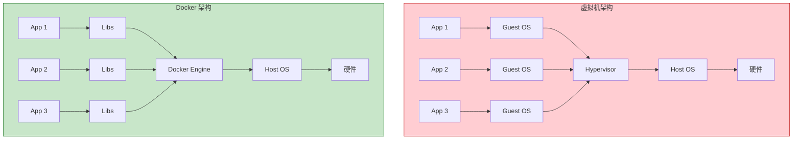

| 对比项 | 虚拟机 | Docker 容器 |
|--------|--------|-------------|
| **启动速度** | 分钟级 | 秒级/毫秒级 |
| **资源占用** | GB 级（完整 OS） | MB 级（共享内核） |
| **隔离性** | 完全隔离 | 进程级隔离 |
| **性能** | 接近原生 | 接近原生 |
| **迁移性** | 一般 | 极强 |
| **操作系统** | 独立内核 | 共享宿主内核 |

### 1.3 Docker 核心优势

| 优势 | 说明 |
|------|------|
| **一致性** | 开发、测试、生产环境完全一致 |
| **轻量级** | 容器共享宿主内核，资源占用少 |
| **快速部署** | 秒级启动，快速扩缩容 |
| **版本控制** | 镜像分层存储，便于版本管理 |
| **可移植性** | 跨平台运行，一次构建处处运行 |

---

## 二、Docker 核心概念

### 2.1 核心组件架构

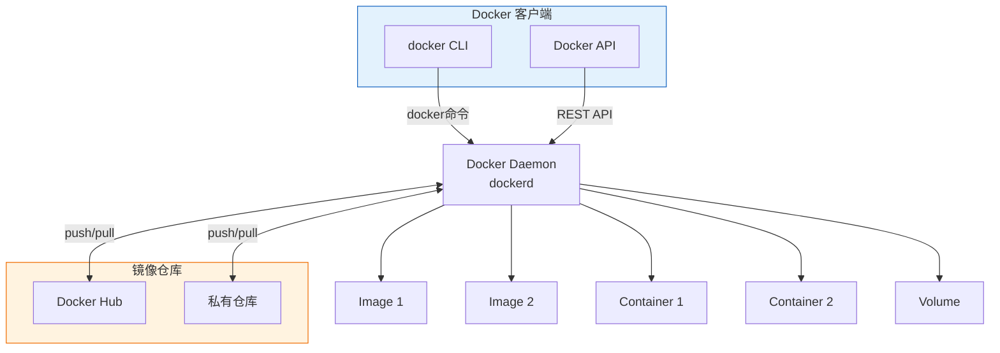

### 2.2 三大核心概念

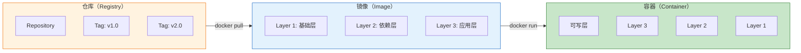

| 概念 | 说明 | 类比 |
|------|------|------|
| **镜像（Image）** | 只读模板，包含运行应用所需的所有内容 | APP 安装包 |
| **容器（Container）** | 镜像的运行实例，可读写 | 运行中的 APP |
| **仓库（Registry）** | 存储和分发镜像的场所 | 应用商店 |

### 2.3 镜像分层原理

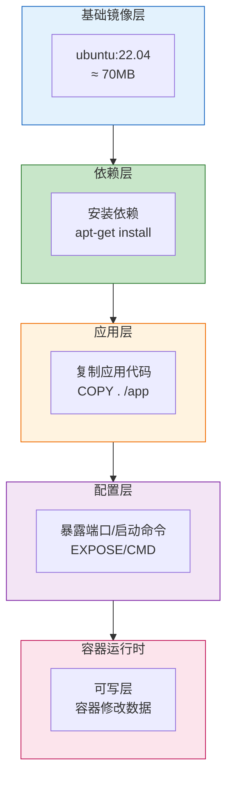

**分层优势**：
- **资源共享**：相同层只存储一份，节省空间
- **快速构建**：利用缓存，只重建变化的层
- **高效传输**：只传输差异层，加快部署

---

## 三、Docker 底层原理

### 3.1 宿主机与容器关系架构

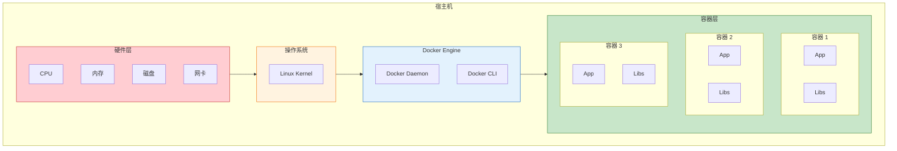

**架构说明**：

| 层级 | 说明 |
|------|------|
| **硬件层** | 物理服务器或虚拟机的硬件资源 |
| **操作系统** | Linux 内核，提供 Namespace、Cgroups 等底层支持 |
| **Docker Engine** | Docker 守护进程和客户端，管理容器生命周期 |
| **容器层** | 运行中的应用容器，共享宿主内核，拥有独立文件系统 |

**关键特点**：

- 容器共享宿主机内核，无需独立操作系统
- 每个容器拥有独立的文件系统、网络、进程空间
- 容器之间相互隔离，互不影响
- 容器对宿主机资源的访问受 Cgroups 限制

### 3.2 核心技术

Docker 容器的实现依赖于 Linux 内核的三项核心技术：Namespace（命名空间）、Cgroups（控制组）和 UnionFS（联合文件系统）。

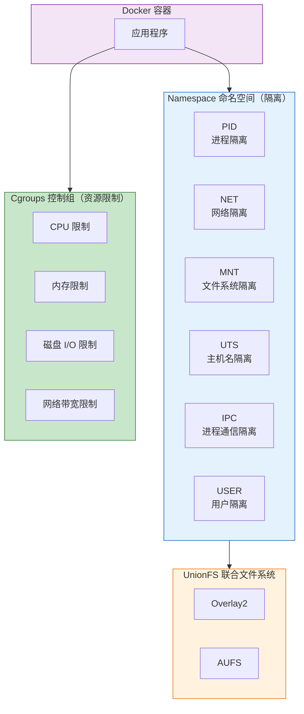

#### 3.2.1 Namespace 隔离机制

Namespace 是 Linux 内核用来隔离系统资源的技术，让容器拥有独立的系统资源视图。

| Namespace | 隔离内容 | 说明 | 示例 |
|-----------|----------|------|------|
| **PID** | 进程 ID | 容器内进程独立编号，从 1 开始 | 容器内第一个进程 PID 为 1 |
| **NET** | 网络设备、协议栈 | 独立网络配置（IP 地址、端口等） | 容器拥有独立 IP 地址 |
| **MNT** | 挂载点 | 独立文件系统视图 | 容器内挂载点不影响宿主机 |
| **UTS** | 主机名、域名 | 独立主机名 | 容器可设置自己的 hostname |
| **IPC** | 进程间通信 | 独立消息队列、信号量 | 容器内进程通信隔离 |
| **USER** | 用户和用户组 | 独立用户权限 | 容器内 root 非宿主机 root |

**Namespace 工作原理**：

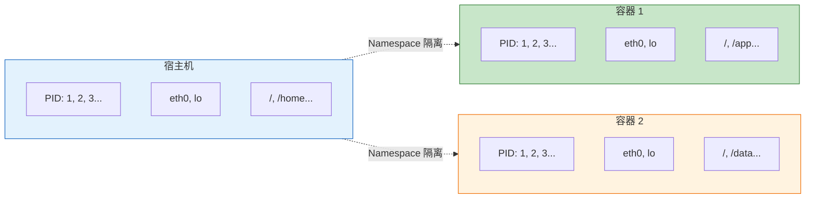

#### 3.2.2 Cgroups 资源限制

Cgroups（Control Groups）是 Linux 内核用来限制、记录和隔离进程组使用的物理资源的技术。

**资源限制类型**：

| 资源类型 | 子系统 | 限制参数 | 说明 |
|----------|--------|----------|------|
| **CPU** | cpu, cpuacct | `--cpus`, `--cpu-shares` | 限制 CPU 使用量和比例 |
| **内存** | memory | `--memory`, `--memory-swap` | 限制内存和交换分区使用量 |
| **磁盘 I/O** | blkio | `--device-read-bps`, `--device-write-bps` | 限制读写速率 |
| **网络** | net_cls, net_prio | `--net` | 限制网络带宽和优先级 |
| **进程数** | pids | `--pids-limit` | 限制容器内进程数量 |

**Cgroups 工作原理**：

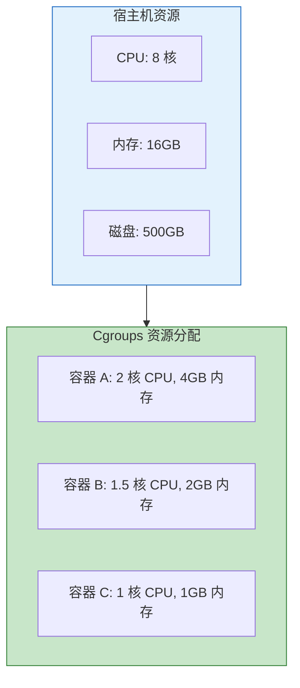

**资源限制示例**：

```bash
docker run -d \
  --name web \
  --cpus=1.5 \
  --memory=512m \
  --memory-swap=1g \
  --device-read-bps=/dev/sda:10mb \
  --pids-limit=100 \
  nginx:latest
```

#### 3.2.3 UnionFS 联合文件系统

UnionFS（Union File System，联合文件系统）是 Docker 镜像分层存储的核心技术，它将多个文件系统层联合挂载，呈现为一个统一的文件系统视图。

**UnionFS 核心概念**：

| 概念 | 说明 |
|------|------|
| **分层存储** | 镜像由多个只读层组成，每层代表一次文件系统变更 |
| **联合挂载** | 将多个目录层叠加挂载到同一个挂载点，形成统一视图 |
| **写时复制（CoW）** | 修改文件时先复制到可写层，只读层保持不变 |

**Overlay2 存储驱动**：

Docker 目前默认使用 Overlay2 作为存储驱动，它是 OverlayFS 的改进版本。

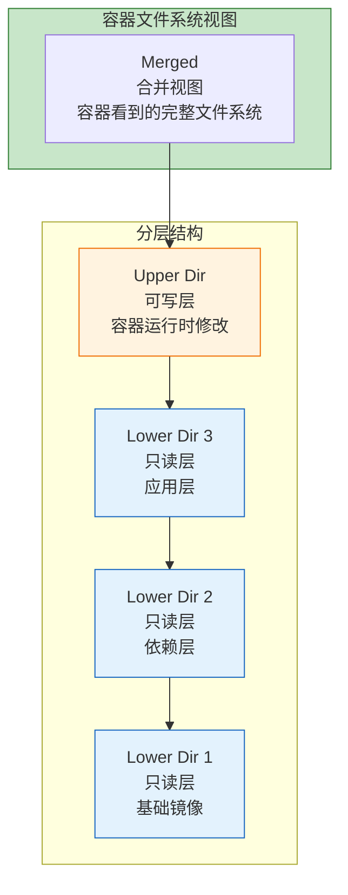

**Overlay2 目录结构**：

| 目录 | 说明 |
|------|------|
| **Lower Dir** | 只读的镜像层，可以有多个，从下往上堆叠 |
| **Upper Dir** | 可写层，存储容器运行时的所有修改 |
| **Work Dir** | OverlayFS 内部使用的工作目录 |
| **Merged Dir** | 联合挂载后的统一视图，容器进程看到的文件系统 |

**文件读写机制**：

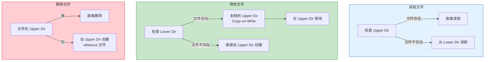

**写时复制（Copy-on-Write）流程**：

| 步骤 | 操作 | 说明 |
|------|------|------|
| 1 | 读取请求 | 容器请求读取文件 |
| 2 | 查找文件 | 从上往下（Upper → Lower）查找文件 |
| 3 | 直接读取 | 找到文件后直接返回内容 |
| 4 | 写入请求 | 容器请求修改文件 |
| 5 | 复制文件 | 如果文件在 Lower Dir，先复制到 Upper Dir |
| 6 | 修改文件 | 在 Upper Dir 中修改文件副本 |

**镜像分层优势**：

| 优势 | 说明 |
|------|------|
| **存储高效** | 相同层只存储一份，多个镜像可共享基础层 |
| **构建快速** | 利用构建缓存，只重建变化的层 |
| **传输高效** | 只传输本地没有的层，加快镜像拉取 |
| **版本管理** | 每层对应一次提交，便于追溯和回滚 |

**查看存储驱动信息**：

```bash
# 查看当前存储驱动
docker info | grep "Storage Driver"
# Storage Driver: overlay2

# 查看 Overlay2 存储目录
ls /var/lib/docker/overlay2/
# 每个层对应一个目录

# 查看容器层信息
docker inspect <container> | grep -A 10 "GraphDriver"
```

### 3.3 Docker 网络原理

Docker 网络是容器间通信和容器与外部世界交互的基础，理解其原理对于构建可靠的容器化应用至关重要。

#### 3.3.1 核心概念

在深入理解 Docker 网络之前，需要先了解几个核心概念：

| 概念 | 说明 |
|------|------|
| **Network Namespace** | Linux 内核提供的网络隔离机制，每个容器拥有独立的网络命名空间（IP 地址、端口、路由表、iptables 规则等） |
| **Bridge（网桥）** | Linux 中的二层虚拟网络设备，类似于物理交换机，用于连接多个网络接口 |
| **veth pair** | 虚拟以太网设备对，成对出现，一端发送的数据会从另一端接收，如同一条虚拟网线 |
| **iptables/NAT** | Linux 防火墙规则，实现地址转换和端口映射 |

#### 3.3.2 Bridge 网络

Bridge 网络是 Docker 最常用的网络模式，分为**默认 Bridge 网络**和**自定义 Bridge 网络**两种类型。

##### 默认 Bridge 网络

**默认行为**：

当创建容器时**不指定网络参数**（即不使用 `--network` 选项），容器会自动使用 bridge 模式的默认网络，连接到 Docker 服务启动时创建的 `docker0` 网桥。

```bash
# 以下两种方式效果相同，都使用默认 bridge 网络
docker run -d --name web nginx
docker run -d --name web --network bridge nginx
```

**docker0 网桥是全局唯一的**：

Docker 服务启动时，会在宿主机上创建一个名为 `docker0` 的虚拟网桥，这个网桥是**全局唯一**的，所有使用默认 bridge 模式的容器都连接到这同一个 docker0 网桥上。

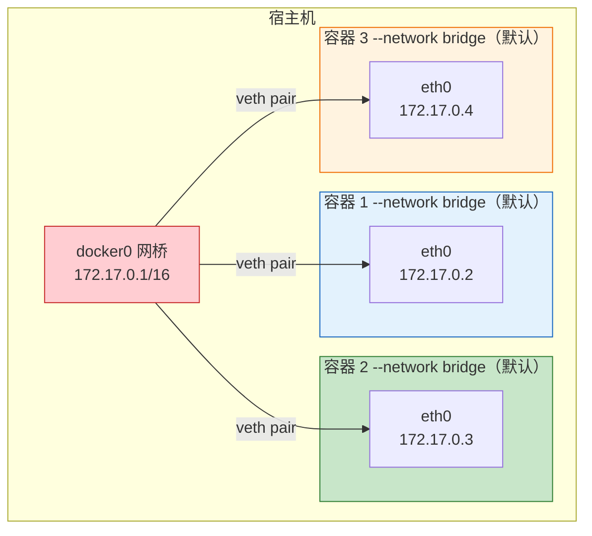

**docker0 网桥的作用**：

| 作用 | 说明 |
|------|------|
| **默认网关** | 容器的默认网关地址，容器访问外部网络时数据包先发送到 docker0 |
| **二层转发** | 连接所有容器，实现同一宿主机内容器间的二层通信 |
| **IP 分配** | 作为 DHCP 服务器，为容器分配 IP 地址（默认 172.17.0.0/16 网段） |

**默认 Bridge 网络的局限性**：

| 局限性 | 说明 |
|--------|------|
| **无 DNS 解析** | 容器之间只能通过 IP 地址通信，无法使用容器名 |
| **无网络隔离** | 所有使用默认 bridge 的容器都在同一网络，无法隔离 |
| **不支持动态连接** | 容器创建后无法动态连接或断开网络 |

##### 自定义 Bridge 网络

**自定义 Bridge 网络使用独立的网桥**：

自定义 Bridge 网络**不使用 docker0 网桥**，而是创建独立的网桥。每创建一个自定义 bridge 网络，Docker 会在宿主机上创建一个新的网桥设备，名称格式为 `br-<network_id前12位>`。

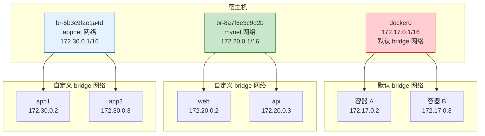

**网络隔离原理**：

| 隔离机制 | 说明 |
|----------|------|
| **不同网桥** | 每个自定义 bridge 网络使用独立的网桥设备 |
| **不同网段** | 每个网络有独立的 IP 子网 |
| **独立命名空间** | 容器只能看到自己网络的网关和路由 |
| **无二层连通** | 不同网桥之间没有二层连接 |

**验证命令**：

```bash
# 创建两个自定义 bridge 网络
docker network create mynet --subnet=172.20.0.0/16
docker network create appnet --subnet=172.30.0.0/16

# 查看网络列表
docker network ls
# NETWORK ID     NAME      DRIVER    SCOPE
# 8a7f6e3c9d2b   mynet     bridge    local
# 5b3c9f2e1a4d   appnet    bridge    local

# 在宿主机上查看网桥
ip addr show | grep br-
# br-8a7f6e3c9d2b: 172.20.0.1/16
# br-5b3c9f2e1a4d: 172.30.0.1/16

# 使用 brctl 查看网桥
brctl show
# bridge name      bridge id            STP enabled    interfaces
# docker0          8000.0242e3a8b7c6    no
# br-8a7f6e3c9d2b  8000.0242a1b2c3d4    no             vethxxx
# br-5b3c9f2e1a4d  8000.0242b2c3d4e5    no             vethyyy
```

**网络隔离验证**：

```bash
# 创建属于不同网络的容器
docker run -d --name web1 --network mynet nginx
docker run -d --name web2 --network appnet nginx
docker run -d --name web3 nginx  # 使用默认 bridge

# web1 (mynet: 172.20.0.x) 无法访问 web2 (appnet: 172.30.0.x)
docker exec web1 ping -c 2 172.30.0.2
# 无法通信，因为不在同一网桥

# web1 也无法访问 web3 (docker0: 172.17.0.x)
docker exec web1 ping -c 2 172.17.0.2
# 无法通信
```

##### 默认 Bridge 与自定义 Bridge 对比

| 特性 | 默认 Bridge 网络 | 自定义 Bridge 网络 |
|------|------------------|-------------------|
| **网桥设备** | docker0（全局唯一） | br-xxx（独立网桥） |
| **使用方式** | 不指定 --network（默认） | 指定 --network <name> |
| **DNS 解析** | ❌ 只能通过 IP 地址 | ✅ 可通过容器名自动解析 |
| **网络隔离** | ❌ 所有容器互通 | ✅ 不同网络相互隔离 |
| **动态连接** | ❌ 不支持 | ✅ 支持动态连接/断开 |
| **IP 地址配置** | ❌ 自动分配 | ✅ 可指定子网、网关、IP 地址 |
| **推荐场景** | 简单测试、临时容器 | 生产环境、微服务架构 |

**自定义 Bridge 网络使用示例**：

```bash
# 创建自定义 bridge 网络
docker network create --driver bridge \
  --subnet=172.20.0.0/16 \
  --gateway=172.20.0.1 \
  mynet

# 使用自定义网络创建容器
docker run -d --name web --network mynet nginx
docker run -d --name api --network mynet myapi:latest
docker run -d --name db --network mynet mysql:8.0

# web 容器可以通过 "api" 和 "db" 主机名访问对应服务
```

#### 3.3.3 veth pair 工作机制

veth pair（Virtual Ethernet Pair）是 Docker 网络的核心技术，理解其工作机制对于理解容器网络至关重要。

**veth pair 本质**：

veth pair 是一对虚拟网络设备接口，它们像一根虚拟网线一样连接在一起。从一端进入的数据包会立即从另一端出来，反之亦然。

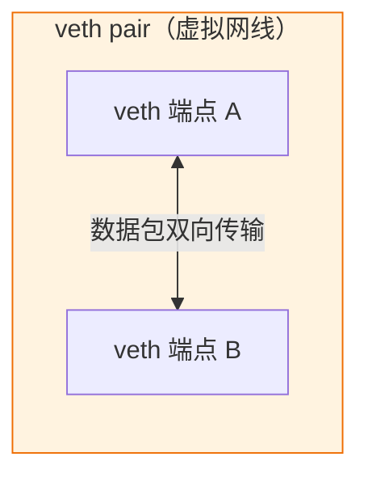

**Docker 中 veth pair 的连接方式**：

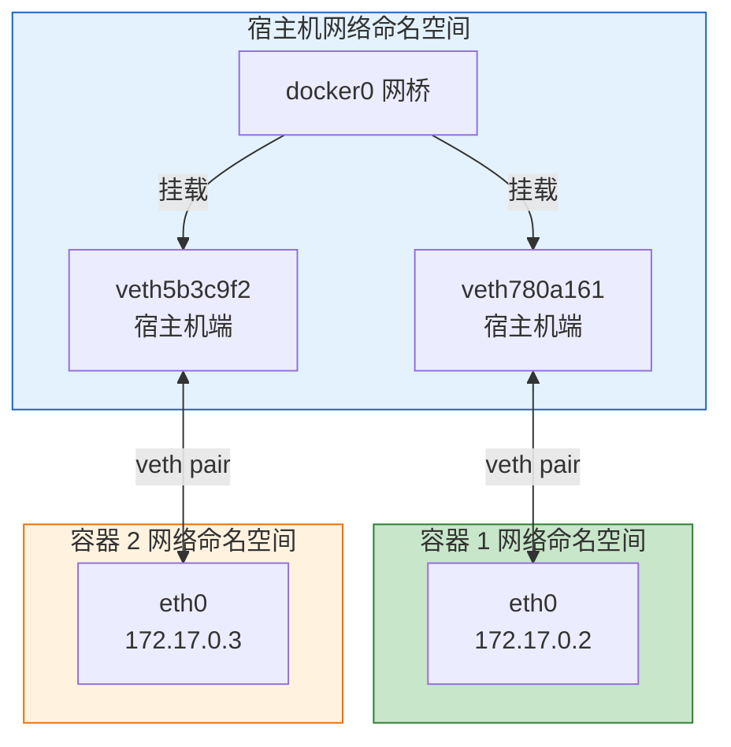

**veth pair 工作流程**：

| 步骤 | 操作 | 说明 |
|------|------|------|
| 1 | 创建 veth pair | Docker 创建一对虚拟网卡（如 veth0 和 veth1） |
| 2 | 分配到命名空间 | 将 veth0 移动到容器的网络命名空间，重命名为 eth0 |
| 3 | 连接网桥 | 将 veth1 保留在宿主机命名空间，挂载到 docker0 网桥 |
| 4 | 分配 IP | 为容器的 eth0 分配 IP 地址，设置 docker0 为默认网关 |

**验证命令**：

```bash
# 在宿主机上查看 veth 设备
ip link show

# 查看 docker0 网桥连接的接口
brctl show

# 输出示例：
# bridge name    bridge id        STP enabled    interfaces
# docker0        8000.02422aa0385a    no         veth780a161
#                                              veth5b3c9f2
```

#### 3.3.4 容器创建时的网络配置流程

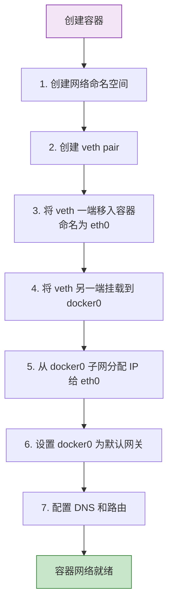

#### 3.3.5 五种网络模式详解

Docker 提供五种网络模式，满足不同场景的网络需求：

| 模式 | 说明 | 网络隔离 | 性能 | 典型场景 |
|------|------|----------|------|----------|
| **bridge** | 默认模式，容器连接到 docker0 网桥 | 完全隔离 | 中等 | 单机容器通信 |
| **host** | 共享宿主机网络命名空间 | 无隔离 | 最高 | 高性能网络应用 |
| **none** | 无网络，只有回环接口 | 完全隔离 | - | 安全隔离场景 |
| **container** | 共享指定容器的网络命名空间 | 共享隔离 | 高 | Sidecar 模式 |
| **overlay** | 跨主机网络 | 完全隔离 | 较低 | Swarm/K8s 集群 |

**1. Bridge 模式（默认）**

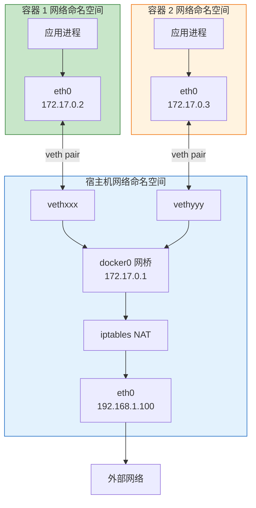

**Bridge 模式特点**：

| 特点 | 说明 |
|------|------|
| **独立网络栈** | 每个容器拥有独立的网络命名空间（IP 地址、端口、路由表等） |
| **通过网桥通信** | 同一宿主机的容器通过 docker0 网桥进行二层通信 |
| **NAT 访问外部** | 容器通过 SNAT 规则访问外部网络，源 IP 被转换为宿主机 IP |
| **端口映射** | 外部访问容器需要通过 DNAT 规则进行端口映射（-p 参数） |

**使用示例**：

```bash
# 创建 bridge 模式容器（默认）
docker run -d --name web -p 8080:80 nginx

# 容器内查看网络配置
docker exec web ip addr
# eth0: 172.17.0.2/16
```

**2. Host 模式**

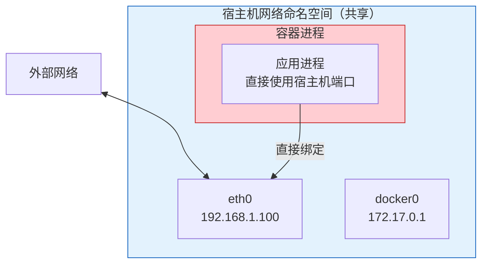

**Host 模式特点**：

| 特点 | 说明 |
|------|------|
| **共享网络栈** | 容器与宿主机共享同一个网络命名空间 |
| **无网络隔离** | 容器直接使用宿主机的 IP 地址、端口、路由表 |
| **最佳性能** | 无 NAT 开销，网络性能等同于宿主机本地进程 |
| **端口冲突** | 容器端口不能与宿主机已使用端口冲突 |

**使用示例**：

```bash
# 创建 host 模式容器
docker run -d --name web --network host nginx

# 容器内查看网络配置（与宿主机相同）
docker exec web ip addr
# 显示宿主机的所有网卡
```

**3. None 模式**

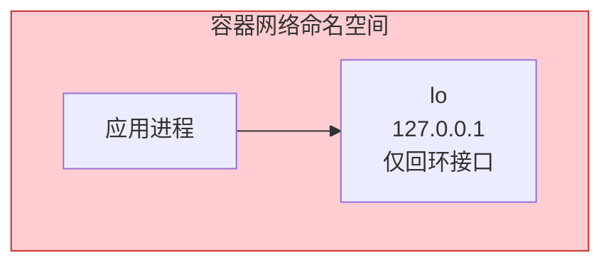

**None 模式特点**：

| 特点 | 说明 |
|------|------|
| **完全隔离** | 容器只有回环接口，无任何外部网络连接 |
| **安全隔离** | 适合需要完全网络隔离的安全敏感应用 |
| **手动配置** | 需要手动添加网卡、配置 IP 才能联网 |

**使用示例**：

```bash
# 创建 none 模式容器
docker run -d --name isolated --network none alpine

# 容器内查看网络配置
docker exec isolated ip addr
# 只有 lo 接口
```

**4. Container 模式**

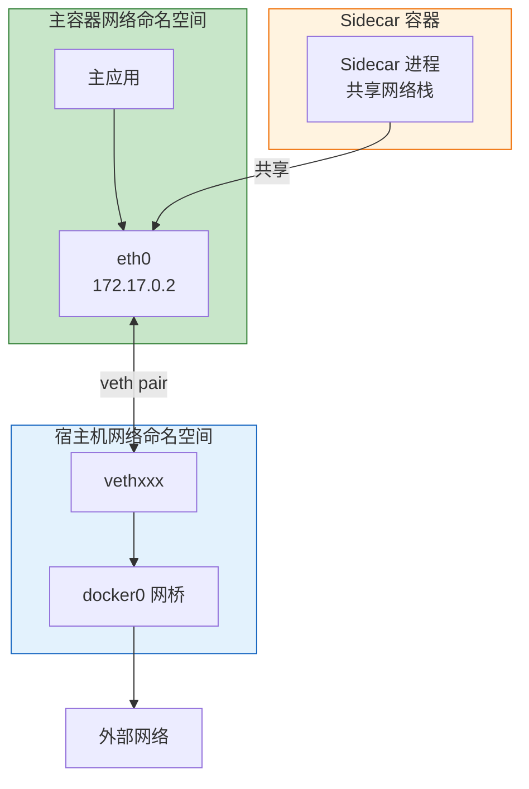

**Container 模式特点**：

| 特点 | 说明 |
|------|------|
| **共享网络栈** | 新容器共享指定容器的网络命名空间 |
| **共享 IP 和端口** | 两个容器使用相同的 IP 地址和端口 |
| **localhost 通信** | 两个容器可通过 localhost 互相访问 |
| **文件系统隔离** | 网络共享，但文件系统、进程列表仍然隔离 |

**使用示例**：

```bash
# 创建主容器
docker run -d --name main-app nginx

# 创建共享网络的 sidecar 容器
docker run -d --name sidecar --network container:main-app alpine

# sidecar 可以通过 localhost 访问主容器
docker exec sidecar wget -qO- http://localhost:80
```

**5. Overlay 模式**

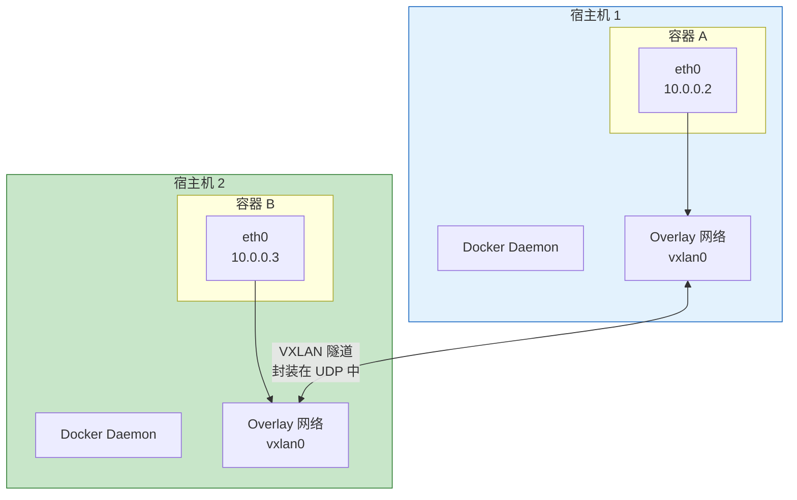

**Overlay 模式特点**：

| 特点 | 说明 |
|------|------|
| **跨主机通信** | 不同宿主机的容器可以直接通信 |
| **VXLAN 封装** | 使用 VXLAN 技术在物理网络上建立虚拟网络 |
| **统一 IP 管理** | 容器 IP 由集群统一管理，跨主机不冲突 |
| **需要 KV 存储** | 需要 etcd 或 Consul 等存储网络状态信息 |

#### 3.3.6 网络通信流程

**1. 容器访问外部网络（SNAT）**

容器访问外部网络时，数据包需要经过 SNAT（源地址转换），将容器 IP 转换为宿主机 IP。

```mermaid
flowchart TB
    subgraph Container["容器网络命名空间"]
        App["应用进程"]
        CEth["eth0<br/>172.17.0.2"]
    end
    
    subgraph Host["宿主机网络命名空间"]
        Docker0["docker0 网桥<br/>172.17.0.1"]
        Route["路由判断<br/>目标非本机网段"]
        SNAT["iptables SNAT<br/>源地址转换<br/>172.17.0.2 → 192.168.1.100"]
        HEth["eth0<br/>192.168.1.100"]
    end
    
    subgraph External["外部网络"]
        Server["目标服务器<br/>8.8.8.8:80"]
    end
    
    App -->|"发送请求<br/>源: 172.17.0.2:随机端口<br/>目标: 8.8.8.8:80"| CEth
    CEth -->|"veth pair"| Docker0
    Docker0 --> Route
    Route --> SNAT
    SNAT -->|"转发请求<br/>源: 192.168.1.100:随机端口<br/>目标: 8.8.8.8:80"| HEth
    HEth -->|"物理网络"| Server
    
    style Container fill:#e3f2fd,stroke:#1565c0
    style Host fill:#c8e6c9,stroke:#2e7d32
    style External fill:#fff3e0,stroke:#ef6c00
```

**通信过程详解**：

| 步骤 | 阶段 | 数据包变化 | 说明 |
|------|------|------------|------|
| 1 | 容器发送 | 源: 172.17.0.2:随机端口 → 目标: 8.8.8.8:80 | 应用进程发起请求 |
| 2 | 通过 veth | 无变化 | 数据包通过 veth pair 到达 docker0 |
| 3 | 路由判断 | 无变化 | docker0 判断目标 IP 不在本机网段 |
| 4 | SNAT 转换 | 源: 192.168.1.100:随机端口 → 目标: 8.8.8.8:80 | iptables 修改源地址 |
| 5 | 发出请求 | 无变化 | 数据包从 eth0 发出到物理网络 |

**2. 外部访问容器（DNAT）**

外部访问容器时，数据包需要经过 DNAT（目标地址转换），将宿主机端口映射到容器端口。

```mermaid
flowchart TB
    subgraph External["外部客户端"]
        Client["用户浏览器"]
    end
    
    subgraph Host["宿主机网络命名空间"]
        HEth["eth0<br/>192.168.1.100"]
        DNAT["iptables DNAT<br/>目标地址转换<br/>192.168.1.100:8080 → 172.17.0.2:80"]
        Docker0["docker0 网桥<br/>172.17.0.1"]
    end
    
    subgraph Container["容器网络命名空间"]
        CEth["eth0<br/>172.17.0.2"]
        Nginx["Nginx 服务<br/>监听 80 端口"]
    end
    
    Client -->|"发起请求<br/>目标: 192.168.1.100:8080"| HEth
    HEth --> DNAT
    DNAT -->|"转发请求<br/>目标: 172.17.0.2:80"| Docker0
    Docker0 -->|"veth pair"| CEth
    CEth --> Nginx
    
    Nginx -.->|"响应"| CEth
    CEth -.->|"veth pair"| Docker0
    Docker0 -.->|"反向 NAT"| HEth
    HEth -.->|"返回响应"| Client
    
    style External fill:#fff3e0,stroke:#ef6c00
    style Host fill:#e3f2fd,stroke:#1565c0
    style Container fill:#c8e6c9,stroke:#2e7d32
```

**端口映射过程详解**：

| 步骤 | 阶段 | 数据包变化 | 说明 |
|------|------|------------|------|
| 1 | 客户端请求 | 目标: 192.168.1.100:8080 | 外部用户访问宿主机端口 |
| 2 | DNAT 转换 | 目标: 172.17.0.2:80 | iptables 修改目标地址 |
| 3 | 路由转发 | 无变化 | 根据路由表转发到 docker0 |
| 4 | 到达容器 | 无变化 | 数据包通过 veth pair 到达容器 |
| 5 | 响应返回 | 源: 172.17.0.2:80 | 容器响应请求 |
| 6 | 反向 NAT | 源: 192.168.1.100:8080 | 自动转换源地址返回客户端 |

**端口映射规则**：

```bash
# 创建端口映射
docker run -d -p 8080:80 nginx

# 查看映射规则
docker port <container>

# 查看 iptables NAT 规则
iptables -t nat -vnL
```

**3. 容器间通信**

同一网桥上的容器可以通过 IP 地址直接进行二层通信，无需 NAT 转换。

```mermaid
flowchart TB
    subgraph Bridge["docker0 网桥 (172.17.0.0/16)"]
        Docker0["docker0<br/>172.17.0.1<br/>二层交换机"]
        
        subgraph Container1["容器 1 (172.17.0.2)"]
            C1Eth["eth0"]
            C1App["Web 应用"]
        end
        
        subgraph Container2["容器 2 (172.17.0.3)"]
            C2Eth["eth0"]
            C2App["API 服务<br/>监听 8080 端口"]
        end
    end
    
    C1App -->|"发起请求<br/>目标: 172.17.0.3:8080"| C1Eth
    C1Eth -->|"veth pair"| Docker0
    Docker0 -->|"二层转发"| C2Eth
    C2Eth --> C2App
    
    C2App -.->|"响应数据"| C2Eth
    C2Eth -.->|"veth pair"| Docker0
    Docker0 -.->|"二层转发"| C1Eth
    C1Eth -.-> C1App
    
    style Bridge fill:#e3f2fd,stroke:#1565c0
    style Container1 fill:#c8e6c9,stroke:#2e7d32
    style Container2 fill:#fff3e0,stroke:#ef6c00
```

**容器间通信过程**：

| 步骤 | 操作 | 说明 |
|------|------|------|
| 1 | 发起请求 | 容器 1 向容器 2 发送请求（目标 IP: 172.17.0.3） |
| 2 | 到达网桥 | 数据包通过 veth pair 到达 docker0 网桥 |
| 3 | 二层转发 | docker0 作为交换机，将数据包转发到容器 2 |
| 4 | 收到请求 | 容器 2 收到数据包，处理请求并返回响应 |

**关键点说明**：

| 要点 | 说明 |
|------|------|
| **同一网段** | 两个容器在同一 IP 子网（172.17.0.0/16），可直接二层通信 |
| **无需 NAT** | 容器间通信不经过 NAT，直接使用容器 IP 地址 |
| **二层转发** | docker0 网桥工作在数据链路层，实现容器间的数据转发 |

**容器间通信方式**：

| 方式 | 说明 | 适用场景 |
|------|------|----------|
| **IP 通信** | 直接使用容器 IP 地址访问 | 默认 bridge 网络 |
| **容器名通信** | 使用容器名或服务名访问 | 自定义 bridge 网络（DNS 解析） |

### 3.4 Docker 容器重启策略

Docker 提供了四种重启策略，用于控制容器在退出或 Docker 守护进程重启后的行为。正确理解这些策略对于保障服务高可用至关重要。

#### 3.4.1 四种重启策略概述

| 策略 | 说明 | 核心特点 |
|------|------|----------|
| **no** | 默认策略，不自动重启容器 | 容器退出后保持停止状态 |
| **on-failure** | 仅当容器异常退出（退出码非0）时重启 | 可指定最大重试次数 |
| **always** | 无论何种原因退出，始终重启容器 | 宿主机重启后容器自动启动 |
| **unless-stopped** | 始终重启，但尊重手动停止操作 | 手动停止后宿主机重启不会启动 |

#### 3.4.2 重启策略核心区别

**always 与 unless-stopped 的关键区别**：

```mermaid
flowchart TB
    subgraph Scenario["关键场景"]
        S1["容器崩溃退出"]
        S2["容器正常退出<br/>exit 0"]
        S3["宿主机重启<br/>Docker 守护进程启动"]
        S4["手动停止容器后<br/>宿主机重启"]
    end
    
    subgraph Always["always 策略"]
        A1["✅ 自动重启"]
        A2["✅ 自动重启"]
        A3["✅ 自动启动"]
        A4["✅ 自动启动<br/>⚠️ 忽略手动停止"]
    end
    
    subgraph UnlessStopped["unless-stopped 策略"]
        U1["✅ 自动重启"]
        U2["✅ 自动重启"]
        U3["✅ 自动启动"]
        U4["❌ 保持停止<br/>尊重手动停止"]
    end
    
    S1 --> A1
    S1 --> U1
    S2 --> A2
    S2 --> U2
    S3 --> A3
    S3 --> U3
    S4 --> A4
    S4 --> U4
    
    style Scenario fill:#f3e5f5,stroke:#7b1fa2
    style Always fill:#ffcdd2,stroke:#c62828
    style UnlessStopped fill:#c8e6c9,stroke:#2e7d32
```

**核心差异说明**：

| 场景 | always | unless-stopped |
|------|--------|----------------|
| 容器崩溃退出 | ✅ 自动重启 | ✅ 自动重启 |
| 容器正常退出（exit 0） | ✅ 自动重启 | ✅ 自动重启 |
| 宿主机重启（容器之前运行中） | ✅ 自动启动 | ✅ 自动启动 |
| 宿主机重启（容器之前手动停止） | ✅ **自动启动** | ❌ **保持停止** |

**关键点**：`always` 策略会忽略手动停止操作，当 Docker 守护进程重启时，容器会被重新启动。而 `unless-stopped` 会"记住"手动停止操作，容器保持停止状态。

#### 3.4.3 on-failure 策略详解

`on-failure` 策略仅在容器异常退出时触发重启，适用于可能正常退出的服务。

**常见退出码含义**：

| 退出码 | 含义 | 是否触发重启 |
|--------|------|-------------|
| 0 | 正常退出 | ❌ 不重启 |
| 1 | 应用错误 | ✅ 重启 |
| 137 | 被 SIGKILL 终止（OOM） | ✅ 重启 |
| 139 | 段错误（Segmentation Fault） | ✅ 重启 |
| 143 | 被 SIGTERM 正常终止 | ✅ 重启 |

**指定最大重试次数**：

```bash
# 最多重试 5 次
docker run -d --name app --restart=on-failure:5 myapp:latest
```

**on-failure 与 always 的区别**：

| 场景 | on-failure | always |
|------|------------|--------|
| 容器正常退出（exit 0） | ❌ 不重启 | ✅ 重启 |
| 容器异常退出（exit 非0） | ✅ 重启 | ✅ 重启 |
| 宿主机重启 | ❌ 不自动启动 | ✅ 自动启动 |

#### 3.4.4 完整行为对比表

```mermaid
flowchart LR
    subgraph Events["触发事件"]
        E1["容器崩溃<br/>exit 1"]
        E2["正常退出<br/>exit 0"]
        E3["宿主机重启<br/>容器之前运行"]
        E4["宿主机重启<br/>容器之前手动停止"]
    end
    
    subgraph No["no"]
        N1["❌"]
        N2["❌"]
        N3["❌"]
        N4["❌"]
    end
    
    subgraph OnFailure["on-failure"]
        O1["✅"]
        O2["❌"]
        O3["❌"]
        O4["❌"]
    end
    
    subgraph Always["always"]
        A1["✅"]
        A2["✅"]
        A3["✅"]
        A4["✅"]
    end
    
    subgraph UnlessStopped["unless-stopped"]
        U1["✅"]
        U2["✅"]
        U3["✅"]
        U4["❌"]
    end
    
    E1 --> N1
    E1 --> O1
    E1 --> A1
    E1 --> U1
    
    E2 --> N2
    E2 --> O2
    E2 --> A2
    E2 --> U2
    
    E3 --> N3
    E3 --> O3
    E3 --> A3
    E3 --> U3
    
    E4 --> N4
    E4 --> O4
    E4 --> A4
    E4 --> U4
    
    style No fill:#ffcdd2,stroke:#c62828
    style OnFailure fill:#fff3e0,stroke:#ef6c00
    style Always fill:#e3f2fd,stroke:#1565c0
    style UnlessStopped fill:#c8e6c9,stroke:#2e7d32
```

#### 3.4.5 使用示例

**1. no 策略（默认）**

```bash
docker run -d --name temp-task --restart=no alpine echo "Hello"
```

**2. always 策略**

```bash
docker run -d \
  --name web \
  --restart=always \
  -p 80:80 \
  nginx:latest
```

**3. on-failure 策略（指定最大重试次数）**

```bash
docker run -d \
  --name app \
  --restart=on-failure:5 \
  myapp:latest
```

**4. unless-stopped 策略（推荐用于生产环境）**

```bash
docker run -d \
  --name db \
  --restart=unless-stopped \
  -v mysql_data:/var/lib/mysql \
  mysql:8.0
```

#### 3.4.6 修改运行中容器的重启策略

```bash
docker update --restart=always mycontainer
docker update --restart=unless-stopped mycontainer
```

#### 3.4.7 重启策略选择指南

```mermaid
flowchart TD
    Start["选择重启策略"] --> Q1{"容器是否需要<br/>长期运行？"}
    Q1 -->|"否"| No["no"]
    Q1 -->|"是"| Q2{"容器可能<br/>正常退出吗？"}
    Q2 -->|"是"| Q3{"宿主机重启后<br/>是否自动启动？"}
    Q2 -->|"否"| Q4{"手动停止后<br/>宿主机重启是否启动？"}
    Q3 -->|"是"| OnFailure["on-failure"]
    Q3 -->|"否"| No
    Q4 -->|"是"| Always["always"]
    Q4 -->|"否"| UnlessStopped["unless-stopped<br/>（推荐）"]
    
    style Start fill:#f3e5f5,stroke:#7b1fa2
    style No fill:#ffcdd2,stroke:#c62828
    style Always fill:#e3f2fd,stroke:#1565c0
    style OnFailure fill:#fff3e0,stroke:#ef6c00
    style UnlessStopped fill:#c8e6c9,stroke:#2e7d32
```

| 场景 | 推荐策略 | 原因 |
|------|----------|------|
| **Web 服务** | `unless-stopped` | 高可用，维护时可手动停止 |
| **数据库** | `unless-stopped` | 维护时可手动停止，重启后不会意外启动 |
| **批处理任务** | `on-failure` | 正常完成后无需重启，异常时自动重试 |
| **临时任务** | `no` | 一次性执行，无需自动重启 |
| **关键服务** | `always` | 确保任何情况下都保持运行 |

#### 3.4.8 注意事项

| 注意点 | 说明 |
|--------|------|
| **重启风暴** | 若应用存在不可恢复错误，可能导致无限重启，建议配合健康检查 |
| **资源限制** | 设置合理的 CPU 和内存限制，避免容器反复因 OOM 重启 |
| **日志监控** | 监控容器重启次数，及时发现异常 |
| **docker stop 行为** | 使用 `docker stop` 停止容器后，`always` 策略在宿主机重启时会重新启动容器 |

---

## 四、Docker 常用命令

### 4.1 镜像操作命令

```mermaid
flowchart LR
    Search["docker search<br/>搜索镜像"] --> Pull["docker pull<br/>拉取镜像"]
    Pull --> List["docker images<br/>查看镜像"]
    List --> Build["docker build<br/>构建镜像"]
    Build --> Tag["docker tag<br/>标记镜像"]
    Tag --> Push["docker push<br/>推送镜像"]
    List --> Rmi["docker rmi<br/>删除镜像"]
    List --> Save["docker save<br/>导出镜像"]
    Save --> Load["docker load<br/>导入镜像"]
    
    style Search fill:#e3f2fd,stroke:#1565c0
    style Pull fill:#c8e6c9,stroke:#2e7d32
    style List fill:#fff3e0,stroke:#ef6c00
    style Build fill:#f3e5f5,stroke:#7b1fa2
    style Push fill:#fce4ec,stroke:#c2185b
    style Rmi fill:#ffcdd2,stroke:#c62828
```

| 命令 | 说明 | 示例 |
|------|------|------|
| `docker search` | 搜索镜像 | `docker search nginx` |
| `docker pull` | 拉取镜像 | `docker pull nginx:latest` |
| `docker images` | 查看本地镜像 | `docker images -a` |
| `docker build` | 构建镜像 | `docker build -t myapp:v1 .` |
| `docker tag` | 标记镜像 | `docker tag myapp:v1 myapp:latest` |
| `docker push` | 推送镜像 | `docker push user/myapp:v1` |
| `docker rmi` | 删除镜像 | `docker rmi nginx:latest` |
| `docker save` | 导出镜像 | `docker save -o app.tar myapp:v1` |
| `docker load` | 导入镜像 | `docker load -i app.tar` |

### 4.2 容器操作命令

```mermaid
flowchart TB
    subgraph Lifecycle["生命周期管理"]
        Run["docker run<br/>创建并启动容器"]
        Start["docker start<br/>启动已停止容器"]
        Stop["docker stop<br/>优雅停止容器"]
        Kill["docker kill<br/>强制停止容器"]
        Restart["docker restart<br/>重启容器"]
        Rm["docker rm<br/>删除容器"]
    end
    
    subgraph Info["信息查看"]
        Ps["docker ps<br/>查看运行容器"]
        Logs["docker logs<br/>查看容器日志"]
        Inspect["docker inspect<br/>查看容器详情"]
        Stats["docker stats<br/>查看资源统计"]
        Port["docker port<br/>查看端口映射"]
    end
    
    subgraph ExecGroup["容器操作"]
        Exec["docker exec<br/>执行命令"]
        Cp["docker cp<br/>复制文件"]
        Attach["docker attach<br/>连接容器"]
    end
    
    style Lifecycle fill:#e3f2fd,stroke:#1565c0
    style Info fill:#c8e6c9,stroke:#2e7d32
    style ExecGroup fill:#fff3e0,stroke:#ef6c00
```

| 命令 | 说明 | 示例 |
|------|------|------|
| `docker run` | 创建并启动容器 | `docker run -d --name web -p 80:80 nginx` |
| `docker start` | 启动已停止容器 | `docker start web` |
| `docker stop` | 优雅停止容器 | `docker stop web` |
| `docker kill` | 强制停止容器 | `docker kill web` |
| `docker restart` | 重启容器 | `docker restart web` |
| `docker rm` | 删除容器 | `docker rm -f web` |
| `docker ps` | 查看运行容器 | `docker ps -a` |
| `docker logs` | 查看容器日志 | `docker logs -f web` |
| `docker inspect` | 查看容器详情 | `docker inspect web` |
| `docker stats` | 查看资源统计 | `docker stats web` |
| `docker port` | 查看端口映射 | `docker port web` |
| `docker exec` | 执行命令 | `docker exec -it web bash` |
| `docker cp` | 复制文件 | `docker cp file.txt web:/app/` |
| `docker attach` | 连接容器 | `docker attach web` |

#### 4.2.1 docker run 常用参数

```bash
docker run [OPTIONS] IMAGE [COMMAND]
```

| 参数 | 说明 | 示例 |
|------|------|------|
| `-d` | 后台运行 | `docker run -d nginx` |
| `--name` | 指定容器名 | `docker run --name web nginx` |
| `-p` | 端口映射 | `docker run -p 8080:80 nginx` |
| `-v` | 挂载卷 | `docker run -v /host:/container nginx` |
| `-e` | 环境变量 | `docker run -e MYSQL_ROOT_PASSWORD=123 mysql` |
| `--network` | 指定网络 | `docker run --network mynet nginx` |
| `--restart` | 重启策略 | `docker run --restart=always nginx` |
| `--cpus` | CPU 限制 | `docker run --cpus=1.5 nginx` |
| `--memory` | 内存限制 | `docker run --memory=512m nginx` |

### 4.3 数据卷管理

| 命令 | 说明 | 示例 |
|------|------|------|
| `docker volume create` | 创建数据卷 | `docker volume create mydata` |
| `docker volume ls` | 列出数据卷 | `docker volume ls` |
| `docker volume inspect` | 查看详情 | `docker volume inspect mydata` |
| `docker volume rm` | 删除数据卷 | `docker volume rm mydata` |
| `docker volume prune` | 清理未使用卷 | `docker volume prune` |

### 4.4 网络管理

| 命令 | 说明 | 示例 |
|------|------|------|
| `docker network create` | 创建网络 | `docker network create mynet` |
| `docker network ls` | 列出网络 | `docker network ls` |
| `docker network inspect` | 查看详情 | `docker network inspect mynet` |
| `docker network connect` | 连接网络 | `docker network connect mynet web` |
| `docker network rm` | 删除网络 | `docker network rm mynet` |

---

## 五、Dockerfile 编写

### 5.1 Dockerfile 基本结构

```dockerfile
FROM ubuntu:22.04

LABEL maintainer="admin@example.com"

ENV APP_HOME=/app

WORKDIR $APP_HOME

COPY package.json ./
COPY src/ ./src/

RUN apt-get update && apt-get install -y \
    python3 \
    python3-pip \
    && rm -rf /var/lib/apt/lists/*

RUN pip3 install -r requirements.txt

EXPOSE 8080

HEALTHCHECK --interval=30s --timeout=3s \
    CMD curl -f http://localhost:8080/health || exit 1

CMD ["python3", "src/main.py"]
```

### 5.2 Dockerfile 指令详解

| 指令 | 说明 | 示例 |
|------|------|------|
| `FROM` | 基础镜像 | `FROM python:3.11-slim` |
| `LABEL` | 元数据标签 | `LABEL version="1.0"` |
| `ENV` | 环境变量 | `ENV APP_ENV=production` |
| `WORKDIR` | 工作目录 | `WORKDIR /app` |
| `COPY` | 复制文件 | `COPY . .` |
| `ADD` | 添加文件（支持 URL 和解压） | `ADD app.tar.gz /app/` |
| `RUN` | 执行命令 | `RUN apt-get update` |
| `EXPOSE` | 声明端口 | `EXPOSE 8080` |
| `CMD` | 容器启动命令 | `CMD ["node", "app.js"]` |
| `ENTRYPOINT` | 入口点 | `ENTRYPOINT ["java", "-jar"]` |
| `VOLUME` | 声明数据卷 | `VOLUME /data` |
| `ARG` | 构建参数 | `ARG VERSION=1.0` |
| `HEALTHCHECK` | 健康检查 | `HEALTHCHECK CMD curl -f http://localhost/` |

### 5.3 CMD 与 ENTRYPOINT 区别

CMD 和 ENTRYPOINT 都是 Dockerfile 中定义容器启动命令的指令，但它们的行为有重要区别。

#### 5.3.1 核心区别

| 对比项 | CMD | ENTRYPOINT |
|--------|-----|------------|
| **作用** | 提供默认启动命令和参数 | 配置容器为可执行程序 |
| **覆盖方式** | `docker run` 参数完全覆盖 | `docker run` 参数追加到后面 |
| **数量限制** | 只能有一个，多个则最后一个生效 | 只能有一个，多个则最后一个生效 |
| **使用场景** | 设置默认参数 | 固定命令，允许参数覆盖 |

#### 5.3.2 CMD 使用方式

CMD 有三种格式：

```dockerfile
# exec 格式（推荐）
CMD ["executable", "param1", "param2"]

# 作为 ENTRYPOINT 的默认参数
CMD ["param1", "param2"]

# shell 格式
CMD command param1 param2
```

**CMD 示例**：

```dockerfile
FROM ubuntu:22.04
CMD ["echo", "Hello Docker"]
```

```bash
# 默认执行 CMD 定义的命令
docker run myimage
# 输出: Hello Docker

# docker run 参数会完全覆盖 CMD
docker run myimage echo "Hello World"
# 输出: Hello World
```

#### 5.3.3 ENTRYPOINT 使用方式

ENTRYPOINT 有两种格式：

```dockerfile
# exec 格式（推荐）
ENTRYPOINT ["executable", "param1", "param2"]

# shell 格式
ENTRYPOINT command param1 param2
```

**ENTRYPOINT 示例**：

```dockerfile
FROM ubuntu:22.04
ENTRYPOINT ["echo"]
```

```bash
# 默认执行 ENTRYPOINT 定义的命令
docker run myimage
# 输出: (空行)

# docker run 参数会追加到 ENTRYPOINT 后面
docker run myimage "Hello Docker"
# 输出: Hello Docker

docker run myimage -n "Hello Docker"
# 输出: Hello Docker
```

#### 5.3.4 CMD 与 ENTRYPOINT 组合使用

最佳实践是 ENTRYPOINT 定义固定命令，CMD 定义默认参数：

```dockerfile
FROM ubuntu:22.04
ENTRYPOINT ["echo"]
CMD ["Hello Docker"]
```

```bash
# 使用默认参数
docker run myimage
# 输出: Hello Docker

# 覆盖默认参数
docker run myimage "Hello World"
# 输出: Hello World
```

#### 5.3.5 实际应用案例

**案例1：自定义 Nginx 镜像**

```dockerfile
FROM nginx:alpine
ENTRYPOINT ["nginx"]
CMD ["-g", "daemon off;"]
```

```bash
# 默认前台运行
docker run mynginx

# 覆盖参数，测试配置
docker run mynginx -t
```

**案例2：自定义 Java 应用镜像**

```dockerfile
FROM openjdk:17-jdk-slim
ENTRYPOINT ["java", "-jar"]
CMD ["app.jar"]
```

```bash
# 默认运行 app.jar
docker run myapp

# 指定其他 jar 包
docker run myapp myapp-v2.jar

# 添加 JVM 参数
docker run myapp -Xms512m -Xmx1g app.jar
```

**案例3：带启动脚本的镜像**

```dockerfile
FROM ubuntu:22.04
COPY entrypoint.sh /entrypoint.sh
RUN chmod +x /entrypoint.sh
ENTRYPOINT ["/entrypoint.sh"]
CMD ["--help"]
```

```bash
# 显示帮助
docker run myimage

# 执行具体操作
docker run myimage --start
```

### 5.4 镜像构建缓存

Docker 构建镜像时会利用缓存机制加速构建过程，理解缓存原理对于优化构建速度至关重要。

#### 5.4.1 缓存工作原理

```mermaid
flowchart TB
    subgraph Dockerfile["Dockerfile"]
        F1["FROM ubuntu:22.04"]
        F2["RUN apt-get update"]
        F3["RUN apt-get install -y python3"]
        F4["COPY . /app"]
        F5["RUN pip install -r requirements.txt"]
        F6["CMD python3 app.py"]
    end
    
    subgraph Cache["缓存检查流程"]
        C1["检查基础镜像缓存"]
        C2["检查 RUN 指令缓存"]
        C3["检查 COPY 文件变化"]
        C4["缓存失效，重新构建"]
        C5["使用缓存"]
    end
    
    F1 --> C1
    C1 --> C2
    C2 --> C3
    C3 -->|"文件变化"| C4
    C3 -->|"文件未变"| C5
    
    style Dockerfile fill:#e3f2fd,stroke:#1565c0
    style Cache fill:#c8e6c9,stroke:#2e7d32
```

**缓存规则**：

| 规则 | 说明 |
|------|------|
| **基础镜像变化** | FROM 指定的镜像变化，后续所有缓存失效 |
| **指令变化** | Dockerfile 指令内容变化，该指令及后续缓存失效 |
| **文件变化** | COPY/ADD 的文件内容变化，该指令及后续缓存失效 |
| **缓存命中** | 指令和输入都未变化，直接使用缓存层 |

#### 5.4.2 缓存命中判断

```mermaid
flowchart LR
    subgraph Hit["缓存命中"]
        H1["指令相同"]
        H2["父层相同"]
        H3["文件内容相同"]
    end
    
    subgraph Miss["缓存失效"]
        M1["指令变化"]
        M2["文件变化"]
        M3["父层缓存失效"]
    end
    
    Hit -->|"全部满足"| Use["使用缓存"]
    Miss -->|"任一触发"| Rebuild["重新构建"]
    
    style Hit fill:#c8e6c9,stroke:#2e7d32
    style Miss fill:#ffcdd2,stroke:#c62828
```

**各指令缓存判断**：

| 指令 | 缓存判断依据 |
|------|-------------|
| `FROM` | 镜像 ID 是否相同 |
| `RUN` | 命令字符串是否相同 |
| `COPY` | 源文件内容 checksum 是否相同 |
| `ADD` | 源文件内容 checksum 是否相同 |
| `ENV` | 环境变量值是否相同 |
| `WORKDIR` | 目录路径是否相同 |

#### 5.4.3 优化构建缓存

**问题示例**：

```dockerfile
FROM python:3.11
WORKDIR /app
COPY . .
RUN pip install -r requirements.txt
CMD ["python", "app.py"]
```

**问题分析**：每次代码变化都会导致 `pip install` 重新执行，即使依赖没有变化。

**优化方案**：

```dockerfile
FROM python:3.11
WORKDIR /app
COPY requirements.txt .
RUN pip install -r requirements.txt
COPY . .
CMD ["python", "app.py"]
```

**优化效果对比**：

```mermaid
flowchart TB
    subgraph Before["优化前"]
        B1["COPY . ."] --> B2["RUN pip install"]
        B2 --> B3["代码变化触发重新安装"]
    end
    
    subgraph After["优化后"]
        A1["COPY requirements.txt"] --> A2["RUN pip install"]
        A2 --> A3["COPY . ."]
        A3 --> A4["代码变化不影响依赖安装"]
    end
    
    style Before fill:#ffcdd2,stroke:#c62828
    style After fill:#c8e6c9,stroke:#2e7d32
```

#### 5.4.4 缓存控制参数

| 参数 | 说明 | 示例 |
|------|------|------|
| `--no-cache` | 禁用所有缓存 | `docker build --no-cache -t myapp .` |
| `--cache-from` | 指定缓存来源镜像 | `docker build --cache-from myapp:v1 -t myapp:v2 .` |
| `--build-arg` | 构建参数（影响缓存） | `docker build --build-arg VERSION=1.0 .` |

#### 5.4.5 缓存最佳实践

| 实践 | 说明 |
|------|------|
| **先复制依赖文件** | 先 COPY 依赖描述文件，再安装依赖 |
| **后复制源代码** | 最后复制源代码，避免频繁触发缓存失效 |
| **合并频繁变化的指令** | 将变化频繁的操作放在 Dockerfile 末尾 |
| **使用多阶段构建** | 构建阶段缓存不影响最终镜像大小 |
| **合理使用 .dockerignore** | 排除不需要的文件，避免触发缓存失效 |

**最佳实践 Dockerfile 结构**：

```dockerfile
FROM node:20-alpine

WORKDIR /app

COPY package*.json ./
RUN npm ci --only=production

COPY . .

EXPOSE 3000
CMD ["node", "src/index.js"]
```

---

### 5.5 多阶段构建

多阶段构建是 Docker 17.05 引入的特性，允许在一个 Dockerfile 中使用多个 FROM 指令，每个 FROM 开始一个新的构建阶段，可以选择性地从之前的阶段复制文件。

#### 5.4.1 为什么需要多阶段构建

**传统构建的问题**：

```dockerfile
FROM golang:1.21
WORKDIR /app
COPY . .
RUN go build -o myapp
CMD ["./myapp"]
```

**问题分析**：
- 最终镜像包含 Go 编译器和构建工具，体积巨大（>800MB）
- 源代码留在镜像中，存在安全风险
- 构建依赖和运行依赖混在一起

#### 5.4.2 多阶段构建原理

```mermaid
flowchart LR
    subgraph Stage1["阶段1: 构建阶段"]
        B1["FROM golang:1.21 AS builder"]
        C1["COPY . ."]
        R1["RUN go build"]
    end
    
    subgraph Stage2["阶段2: 运行阶段"]
        B2["FROM alpine:3.19"]
        C2["COPY --from=builder"]
        R2["CMD ['./myapp']"]
    end
    
    Stage1 -->|"只复制编译产物"| Stage2
    
    style Stage1 fill:#e3f2fd,stroke:#1565c0
    style Stage2 fill:#c8e6c9,stroke:#2e7d32
```

#### 5.4.3 多阶段构建示例

**示例1：Go 应用**

```dockerfile
# 阶段1：构建
FROM golang:1.21 AS builder
WORKDIR /app
COPY go.mod go.sum ./
RUN go mod download
COPY . .
RUN CGO_ENABLED=0 GOOS=linux go build -a -installsuffix cgo -o myapp .

# 阶段2：运行
FROM alpine:3.19
RUN apk --no-cache add ca-certificates
WORKDIR /root/
COPY --from=builder /app/myapp .
EXPOSE 8080
CMD ["./myapp"]
```

**镜像体积对比**：
- 单阶段构建：~850MB
- 多阶段构建：~15MB

**示例2：Java 应用**

```dockerfile
# 阶段1：构建
FROM maven:3.9-eclipse-temurin-17 AS builder
WORKDIR /app
COPY pom.xml .
RUN mvn dependency:go-offline
COPY src ./src
RUN mvn package -DskipTests

# 阶段2：运行
FROM eclipse-temurin:17-jre-alpine
WORKDIR /app
COPY --from=builder /app/target/*.jar app.jar
EXPOSE 8080
ENTRYPOINT ["java", "-jar", "app.jar"]
```

**示例3：Node.js 应用**

```dockerfile
# 阶段1：构建
FROM node:20-alpine AS builder
WORKDIR /app
COPY package*.json ./
RUN npm ci
COPY . .
RUN npm run build

# 阶段2：运行
FROM nginx:alpine
COPY --from=builder /app/dist /usr/share/nginx/html
COPY nginx.conf /etc/nginx/nginx.conf
EXPOSE 80
CMD ["nginx", "-g", "daemon off;"]
```

**示例4：Python 应用**

```dockerfile
# 阶段1：构建
FROM python:3.11 AS builder
WORKDIR /app
COPY requirements.txt .
RUN pip install --user -r requirements.txt
COPY . .

# 阶段2：运行
FROM python:3.11-slim
WORKDIR /app
COPY --from=builder /root/.local /root/.local
COPY --from=builder /app .
ENV PATH=/root/.local/bin:$PATH
EXPOSE 8000
CMD ["python", "app.py"]
```

#### 5.4.4 多阶段构建技巧

| 技巧 | 说明 |
|------|------|
| **命名阶段** | 使用 `AS` 给阶段命名，便于引用 |
| **选择性复制** | 只复制需要的文件，减少镜像体积 |
| **最小化基础镜像** | 运行阶段使用 alpine 或 distroless 镜像 |
| **利用缓存** | 先复制依赖文件，再复制源代码 |

---

### 5.5 .dockerignore 文件

.dockerignore 文件用于排除不需要发送到 Docker 守护进程的文件和目录，减少构建上下文大小，加快构建速度。

#### 5.5.1 文件位置

.dockerignore 文件必须放在**构建上下文的根目录**下，与 Dockerfile 同级：

```
my-project/
├── .dockerignore     ← 必须放在这里
├── Dockerfile        ← Dockerfile 同级目录
├── src/
├── package.json
└── ...
```

**注意事项**：
- 文件名必须为 `.dockerignore`（以点开头）
- 只能有一个 .dockerignore 文件
- 位置必须在构建上下文根目录
- `docker build` 命令指定的路径决定了构建上下文

**示例**：

```bash
# 构建上下文为当前目录，.dockerignore 在当前目录
docker build -t myimage .

# 构建上下文为 ./app 目录，.dockerignore 应在 ./app 目录下
docker build -t myimage ./app

# 使用 -f 指定 Dockerfile 位置时，.dockerignore 仍在构建上下文目录
docker build -t myimage -f ./docker/Dockerfile .
```

#### 5.5.2 为什么需要 .dockerignore

Docker 构建时会将上下文目录的所有文件发送给 Docker 守护进程。如果不排除不需要的文件，会导致：
- 构建上下文过大，传输慢
- 构建缓存失效
- 敏感信息泄露

#### 5.5.3 .dockerignore 语法

```text
# 注释
*               # 通配符
**/temp*        # 匹配任意层级的目录
?               # 单个字符
!               # 排除例外
```

#### 5.5.4 .dockerignore 示例

**Node.js 项目**：

```text
# 依赖目录
node_modules
npm-debug.log

# 构建输出
dist
build
.next

# Git
.git
.gitignore

# IDE
.idea
.vscode
*.swp
*.swo

# 环境配置
.env
.env.local
.env.*.local

# 测试
coverage
.nyc_output

# 日志
logs
*.log

# 系统文件
.DS_Store
Thumbs.db
```

**Java/Maven 项目**：

```text
# Maven
target/
pom.xml.tag
pom.xml.releaseBackup
pom.xml.versionsBackup
pom.xml.next
release.properties

# Gradle
.gradle/
build/
!gradle/wrapper/gradle-wrapper.jar

# IDE
.idea/
*.iml
*.ipr
*.iws
.project
.classpath
.settings/

# Git
.git/
.gitignore

# 日志
*.log
logs/
```

**Python 项目**：

```text
# Python
__pycache__/
*.py[cod]
*$py.class
*.so
.Python
build/
develop-eggs/
dist/
downloads/
eggs/
.eggs/
lib/
lib64/
parts/
sdist/
var/
wheels/
*.egg-info/
.installed.cfg
*.egg

# 虚拟环境
venv/
ENV/
env/

# 测试
.pytest_cache/
.coverage
htmlcov/

# IDE
.idea/
.vscode/
*.swp
*.swo
```

#### 5.5.5 .dockerignore 最佳实践

| 实践 | 说明 |
|------|------|
| **排除版本控制** | 排除 `.git` 目录 |
| **排除依赖目录** | 排除 `node_modules`、`venv` 等 |
| **排除 IDE 配置** | 排除 `.idea`、`.vscode` 等 |
| **排除敏感文件** | 排除 `.env`、密钥文件等 |
| **排除构建产物** | 排除 `dist`、`build` 等 |
| **保持更新** | 项目结构变化时及时更新 |

#### 5.5.6 验证 .dockerignore 效果

```bash
# 查看构建上下文大小
docker build -t myimage . 2>&1 | grep "Sending build context"

# 使用 dry-run 检查哪些文件会被包含
tar -cf - . | tar -tf - | head -20
```

#### 5.5.7 .dockerignore 用法案例

**案例1：Node.js 项目构建优化**

项目结构：
```
my-node-app/
├── .dockerignore     # Docker 忽略文件
├── Dockerfile
├── node_modules/     # 依赖目录（需要排除）
├── dist/             # 构建输出（需要排除）
├── src/              # 源代码
├── .env              # 环境变量（需要排除）
├── .git/             # Git 目录（需要排除）
└── package.json
```

.dockerignore 文件：
```text
node_modules
dist
.env
.git
*.log
```

Dockerfile：
```dockerfile
FROM node:20-alpine
WORKDIR /app
COPY package*.json ./
RUN npm ci --only=production
COPY . .
EXPOSE 3000
CMD ["node", "src/index.js"]
```

构建效果对比：
```
# 无 .dockerignore
Sending build context to Docker daemon  156.7MB

# 有 .dockerignore
Sending build context to Docker daemon  2.1MB
```

**案例2：Python 项目防止敏感信息泄露**

项目结构：
```
my-python-app/
├── .dockerignore     # Docker 忽略文件
├── Dockerfile
├── venv/             # 虚拟环境（需要排除）
├── __pycache__/      # Python 缓存（需要排除）
├── .env              # 敏感配置（需要排除）
├── config/
│   └── secrets.yaml  # 密钥文件（需要排除）
├── app/
└── requirements.txt
```

.dockerignore 文件：
```text
venv/
__pycache__/
*.pyc
.env
config/secrets.yaml
.pytest_cache/
.coverage
```

**案例3：使用排除例外**

```text
# 排除所有日志文件
*.log

# 但保留重要日志
!important.log

# 排除所有测试目录
test/
tests/

# 但保留测试配置
!tests/config/
```

---

### 5.6 Dockerfile 最佳实践

| 实践 | 说明 |
|------|------|
| **使用精简基础镜像** | 选择 alpine、slim 版本减小镜像体积 |
| **合并 RUN 指令** | 减少镜像层数，使用 `&&` 连接命令 |
| **利用构建缓存** | 将变化少的指令放在前面 |
| **使用 .dockerignore** | 排除不需要的文件，加快构建 |
| **不要安装不必要的包** | 保持镜像精简 |
| **使用多阶段构建** | 分离构建环境和运行环境 |
| **设置健康检查** | 使用 HEALTHCHECK 指令 |
| **非 root 用户运行** | 使用 USER 指令切换用户 |

---

## 六、Docker Compose

### 6.1 Docker Compose 简介

Docker Compose 是用于定义和运行多容器 Docker 应用程序的工具，通过 YAML 文件配置应用程序服务，一键启动所有关联容器。

### 6.2 docker-compose.yml 结构

```yaml
version: '3.8'

services:
  web:
    image: nginx:latest
    ports:
      - "80:80"
    volumes:
      - ./html:/usr/share/nginx/html
    depends_on:
      - app
    networks:
      - frontend
    
  app:
    build: ./app
    environment:
      - DB_HOST=db
      - DB_PORT=3306
    depends_on:
      - db
    networks:
      - frontend
      - backend
    
  db:
    image: mysql:8.0
    environment:
      - MYSQL_ROOT_PASSWORD=secret
      - MYSQL_DATABASE=myapp
    volumes:
      - db_data:/var/lib/mysql
    networks:
      - backend

volumes:
  db_data:

networks:
  frontend:
  backend:
```

### 6.3 Docker Compose 常用命令

| 命令 | 说明 | 示例 |
|------|------|------|
| `docker-compose up` | 创建并启动服务 | `docker-compose up -d` |
| `docker-compose down` | 停止并删除服务 | `docker-compose down -v` |
| `docker-compose start` | 启动服务 | `docker-compose start` |
| `docker-compose stop` | 停止服务 | `docker-compose stop` |
| `docker-compose restart` | 重启服务 | `docker-compose restart` |
| `docker-compose ps` | 查看服务状态 | `docker-compose ps` |
| `docker-compose logs` | 查看日志 | `docker-compose logs -f` |
| `docker-compose build` | 构建服务 | `docker-compose build` |
| `docker-compose exec` | 执行命令 | `docker-compose exec web bash` |
| `docker-compose scale` | 扩展服务 | `docker-compose scale app=3` |

### 6.4 服务依赖与启动顺序

```yaml
services:
  app:
    depends_on:
      db:
        condition: service_healthy
      redis:
        condition: service_started
  
  db:
    image: mysql:8.0
    healthcheck:
      test: ["CMD", "mysqladmin", "ping", "-h", "localhost"]
      interval: 10s
      timeout: 5s
      retries: 5
```

---

## 七、Docker Swarm 集群管理

Docker Swarm 是 Docker 官方提供的容器集群管理和编排工具，它允许将多个 Docker 主机组成一个虚拟的整体，实现容器的集群化部署和管理。Docker 1.12 版本后，Swarm mode 已内嵌到 Docker 引擎中。

### 7.1 Swarm 核心概念

#### 7.1.1 概念层级关系

Swarm 中的核心概念存在明确的层级关系，从应用到底层容器依次为：

```mermaid
flowchart TB
    subgraph AppLevel["应用层"]
        App["应用程序<br/>（Application）"]
    end
    
    subgraph StackLevel["Stack 层"]
        Stack["Stack（栈）<br/>一组相关服务的集合<br/>通过 docker-compose.yml 定义"]
    end
    
    subgraph ServiceLevel["Service 层"]
        S1["Service A<br/>服务定义<br/>镜像、端口、副本数"]
        S2["Service B<br/>服务定义"]
    end
    
    subgraph TaskLevel["Task 层"]
        T1["Task 1"]
        T2["Task 2"]
        T3["Task 3"]
        T4["Task 4"]
    end
    
    subgraph ContainerLevel["Container 层"]
        C1["Container<br/>容器实例"]
        C2["Container<br/>容器实例"]
        C3["Container<br/>容器实例"]
        C4["Container<br/>容器实例"]
    end
    
    App --> Stack
    Stack --> S1
    Stack --> S2
    S1 --> T1
    S1 --> T2
    S2 --> T3
    S2 --> T4
    T1 --> C1
    T2 --> C2
    T3 --> C3
    T4 --> C4
    
    style AppLevel fill:#f3e5f5,stroke:#7b1fa2
    style StackLevel fill:#e8eaf6,stroke:#3f51b5
    style ServiceLevel fill:#e3f2fd,stroke:#1565c0
    style TaskLevel fill:#c8e6c9,stroke:#2e7d32
    style ContainerLevel fill:#fff3e0,stroke:#ef6c00
```

#### 7.1.2 核心概念详解

| 概念 | 说明 | 对应关系 |
|------|------|----------|
| **Swarm** | 由多个 Docker 节点组成的集群，作为一个整体对外提供服务 | 集群级别 |
| **Node（节点）** | Swarm 集群中的单个 Docker 引擎实例，可以是物理机或虚拟机 | 集群组成单元 |
| **Stack（栈）** | 一组相关服务的集合，通过 docker-compose.yml 文件定义，用于部署完整应用 | Stack : Service = 1 : N |
| **Service（服务）** | 在 Swarm 上运行的任务定义，指定镜像、端口、副本数等参数 | Service : Task = 1 : N（副本数） |
| **Task（任务）** | Swarm 调度的最小单元，每个 Task 对应一个容器实例 | Task : Container = 1 : 1 |
| **Container（容器）** | 实际运行的容器实例，由 Task 启动和管理 | 最小执行单元 |

#### 7.1.3 Service 与 Stack 的关系

```mermaid
flowchart LR
    subgraph StackFile["docker-compose.yml"]
        Code["services:<br/>  web:<br/>    image: nginx<br/>    replicas: 3<br/>  db:<br/>    image: mysql<br/>    replicas: 1<br/>  redis:<br/>    image: redis<br/>    replicas: 2"]
    end
    
    subgraph Deploy["docker stack deploy"]
        CMD["部署命令"]
    end
    
    subgraph Stack["myapp Stack"]
        Web["web Service<br/>3 副本"]
        DB["db Service<br/>1 副本"]
        Redis["redis Service<br/>2 副本"]
    end
    
    StackFile --> Deploy
    Deploy --> Stack
    
    style StackFile fill:#f3e5f5,stroke:#7b1fa2
    style Deploy fill:#e8eaf6,stroke:#3f51b5
    style Stack fill:#e3f2fd,stroke:#1565c0
```

**Service 与 Stack 关系说明**：

| 对比项 | Service | Stack |
|--------|---------|-------|
| **定义方式** | `docker service create` 命令或 Compose 文件 | docker-compose.yml 文件 |
| **管理粒度** | 单个服务 | 多个相关服务的集合 |
| **部署命令** | `docker service create` | `docker stack deploy -c docker-compose.yml` |
| **适用场景** | 单一服务部署、快速测试 | 完整应用部署、微服务架构 |
| **服务发现** | 服务名访问 | 服务名访问，同一 Stack 内服务互通 |
| **依赖管理** | 不支持服务依赖 | 支持 depends_on 定义服务启动顺序 |

**总结**：Stack 是一组 Service 的逻辑集合，用于部署完整的多服务应用。一个 Stack 可以包含多个 Service，每个 Service 可以有多个副本（Task/Container）。

### 7.2 集群架构

#### 7.2.1 整体架构图

```mermaid
flowchart TB
    subgraph External["外部访问"]
        User["用户/客户端"]
    end
    
    subgraph SwarmCluster["Docker Swarm 集群"]
        subgraph Managers["Manager 节点组（Raft 集群）"]
            M1["Manager 1<br/>Leader<br/>调度器 + API"]
            M2["Manager 2<br/>Follower"]
            M3["Manager 3<br/>Follower"]
            
            M1 <-->|"Raft 共识<br/>日志复制"| M2
            M1 <-->|"Raft 共识<br/>日志复制"| M3
            M2 <-->|"Raft 共识"| M3
        end
        
        subgraph Workers["Worker 节点组"]
            W1["Worker 1"]
            W2["Worker 2"]
            W3["Worker 3"]
        end
        
        subgraph Containers["容器实例"]
            subgraph W1Containers["Worker 1 上的容器"]
                WC1["web-1<br/>容器"]
                WC2["db-1<br/>容器"]
            end
            subgraph W2Containers["Worker 2 上的容器"]
                WC3["web-2<br/>容器"]
                WC4["redis-1<br/>容器"]
            end
            subgraph W3Containers["Worker 3 上的容器"]
                WC5["web-3<br/>容器"]
                WC6["redis-2<br/>容器"]
            end
        end
        
        subgraph OverlayNet["Overlay 网络"]
            ONet["跨主机容器通信网络<br/>VXLAN 隧道"]
        end
    end
    
    User -->|"HTTP 请求<br/>端口 80"| M1
    M1 -->|"调度 Task"| W1
    M1 -->|"调度 Task"| W2
    M1 -->|"调度 Task"| W3
    
    W1 --> WC1
    W1 --> WC2
    W2 --> WC3
    W2 --> WC4
    W3 --> WC5
    W3 --> WC6
    
    WC1 <--> ONet
    WC2 <--> ONet
    WC3 <--> ONet
    WC4 <--> ONet
    WC5 <--> ONet
    WC6 <--> ONet
    
    style External fill:#fce4ec,stroke:#c2185b
    style Managers fill:#e3f2fd,stroke:#1565c0
    style Workers fill:#c8e6c9,stroke:#2e7d32
    style Containers fill:#fff3e0,stroke:#ef6c00
    style OverlayNet fill:#f3e5f5,stroke:#7b1fa2
```

#### 7.2.2 集群工作流程

```mermaid
sequenceDiagram
    participant User as 用户
    participant Manager as Manager 节点
    participant Raft as Raft 集群
    participant Worker1 as Worker 1
    participant Worker2 as Worker 2
    participant Registry as 镜像仓库
    
    User->>Manager: docker service create --name web --replicas 2 nginx
    Manager->>Raft: 提交服务定义到 Raft 日志
    Raft-->>Manager: 多数节点确认，日志提交
    Manager->>Manager: 调度器生成 2 个 Task
    
    par 调度 Task 1
        Manager->>Worker1: 分配 Task 1
        Worker1->>Registry: 拉取 nginx 镜像
        Registry-->>Worker1: 返回镜像
        Worker1->>Worker1: 启动容器 web.1
        Worker1-->>Manager: 上报 Task 状态 Running
    and 调度 Task 2
        Manager->>Worker2: 分配 Task 2
        Worker2->>Registry: 拉取 nginx 镜像
        Registry-->>Worker2: 返回镜像
        Worker2->>Worker2: 启动容器 web.2
        Worker2-->>Manager: 上报 Task 状态 Running
    end
    
    Manager-->>User: 服务创建完成，2/2 副本运行
```

### 7.3 节点类型

#### 7.3.1 节点角色对比

| 节点类型 | 职责 | 可运行容器 | 数量建议 |
|----------|------|------------|----------|
| **Manager 节点** | 集群管理、服务编排、调度、Raft 共识 | 可以，但不推荐 | 奇数个（3、5、7） |
| **Worker 节点** | 执行任务、运行容器 | 是 | 根据负载需求 |

#### 7.3.2 Manager 节点核心组件

```mermaid
flowchart TB
    subgraph ManagerNode["Manager 节点"]
        subgraph API["API 层"]
            DockerAPI["Docker API<br/>接收客户端请求"]
        end
        
        subgraph Orchestration["编排层"]
            Scheduler["调度器<br/>分配 Task 到节点"]
            Orchestrator["编排器<br/>管理服务期望状态"]
        end
        
        subgraph RaftLayer["Raft 共识层"]
            RaftNode["Raft 节点<br/>Leader/Follower"]
            LogStore["日志存储<br/>集群状态日志"]
        end
        
        subgraph Dispatcher["分发器"]
            TaskDispatch["Task 分发<br/>向 Worker 分配任务"]
        end
    end
    
    DockerAPI --> Orchestrator
    Orchestrator --> Scheduler
    Scheduler --> TaskDispatch
    Orchestrator <--> RaftNode
    RaftNode <--> LogStore
    TaskDispatch -->|"gRPC"| Workers["Worker 节点"]
    
    style API fill:#e3f2fd,stroke:#1565c0
    style Orchestration fill:#c8e6c9,stroke:#2e7d32
    style RaftLayer fill:#ffcdd2,stroke:#c62828
    style Dispatcher fill:#fff3e0,stroke:#ef6c00
```

**Manager 节点职责详解**：

| 组件 | 职责 | 说明 |
|------|------|------|
| **API Server** | 接收请求 | 处理 docker service/stack/node 等命令 |
| **Orchestrator** | 状态管理 | 维护服务的期望状态，确保实际状态与期望一致 |
| **Scheduler** | 任务调度 | 根据资源、约束、策略选择最优节点运行 Task |
| **Raft Consensus** | 共识达成 | 多 Manager 之间保持集群状态一致 |
| **Dispatcher** | 任务分发 | 将 Task 分配给 Worker 节点执行 |

#### 7.3.3 Worker 节点工作流程

```mermaid
flowchart LR
    subgraph WorkerNode["Worker 节点"]
        WorkerAgent["Worker Agent<br/>与 Manager 通信"]
        DockerEngine["Docker Engine<br/>执行容器操作"]
        ContainerRuntime["容器运行时<br/>containerd"]
    end
    
    Manager["Manager 节点"] -->|"分配 Task"| WorkerAgent
    WorkerAgent -->|"创建容器"| DockerEngine
    DockerEngine -->|"运行容器"| ContainerRuntime
    ContainerRuntime -->|"状态上报"| WorkerAgent
    WorkerAgent -->|"心跳 + 状态"| Manager
    
    style WorkerNode fill:#c8e6c9,stroke:#2e7d32
```

### 7.4 Raft 共识算法

#### 7.4.1 Raft 算法原理

Swarm 使用 Raft 算法实现 Manager 节点间的高可用和数据一致性。Raft 是一种分布式共识算法，确保在部分节点故障时集群仍能正常工作。

```mermaid
stateDiagram-v2
    [*] --> Follower: 节点启动
    
    Follower --> Candidate: 选举超时<br/>未收到 Leader 心跳
    Candidate --> Leader: 获得多数票
    Candidate --> Follower: 收到更高任期消息<br/>或选举失败
    
    Leader --> Follower: 发现更高任期<br/>或网络分区
    
    state Follower {
        [*] --> 接收日志
        接收日志 --> 响应心跳
        响应心跳 --> [*]
    }
    
    state Leader {
        [*] --> 发送心跳
        发送心跳 --> 日志复制
        日志复制 --> 提交日志
        提交日志 --> [*]
    }
    
    state Candidate {
        [*] --> 发起选举
        发起选举 --> 等待投票
        等待投票 --> [*]
    }
```

#### 7.4.2 Raft 日志复制流程

```mermaid
sequenceDiagram
    participant Client as 客户端
    participant Leader as Leader
    participant F1 as Follower 1
    participant F2 as Follower 2
    
    Client->>Leader: 写请求（创建服务）
    Leader->>Leader: 追加日志到本地
    
    par 日志复制
        Leader->>F1: AppendEntries RPC
        F1->>F1: 追加日志
        F1-->>Leader: 确认
    and
        Leader->>F2: AppendEntries RPC
        F2->>F2: 追加日志
        F2-->>Leader: 确认
    end
    
    Note over Leader: 收到多数确认<br/>日志提交
    Leader->>Leader: 应用到状态机
    Leader-->>Client: 返回成功
    
    par 提交通知
        Leader->>F1: 心跳携带提交索引
        Leader->>F2: 心跳携带提交索引
    end
    
    F1->>F1: 应用到状态机
    F2->>F2: 应用到状态机
```

#### 7.4.3 Raft 关键特性

| 特性 | 说明 | 在 Swarm 中的应用 |
|------|------|-------------------|
| **Leader 选举** | 自动选举 Leader 处理所有写请求 | Manager 节点自动选举 Leader |
| **日志复制** | Leader 将操作日志同步到 Follower | 服务定义、节点信息同步 |
| **故障恢复** | Leader 故障时自动选举新 Leader | Manager 故障后集群自动恢复 |
| **多数派确认** | 操作需多数节点确认后才提交 | 确保数据一致性，防止脑裂 |

#### 7.4.4 高可用配置建议

```mermaid
flowchart LR
    subgraph Cluster["Manager 节点数量"]
        N3["3 个节点<br/>容忍 1 个故障"]
        N5["5 个节点<br/>容忍 2 个故障"]
        N7["7 个节点<br/>容忍 3 个故障"]
    end
    
    subgraph Formula["计算公式"]
        F["容忍故障数 = (n-1)/2<br/>n 为 Manager 节点数"]
    end
    
    Cluster --> Formula
    
    style N3 fill:#c8e6c9,stroke:#2e7d32
    style N5 fill:#fff3e0,stroke:#ef6c00
    style N7 fill:#ffcdd2,stroke:#c62828
```

**推荐配置**：
- 生产环境：3 或 5 个 Manager 节点
- 最大容忍故障：`(n-1)/2` 个节点
- 节点数量必须为奇数，避免选举平票

### 7.5 服务调度机制

#### 7.5.1 服务创建与调度流程

```mermaid
flowchart TB
    subgraph Request["1. 请求阶段"]
        A["docker service create<br/>--name web --replicas 3 nginx"] --> B["Manager API 接收请求"]
    end
    
    subgraph Orchestration["2. 编排阶段"]
        B --> C["Orchestrator 创建服务对象"]
        C --> D["生成期望状态<br/>3 个 Task"]
        D --> E["写入 Raft 日志"]
        E --> F["Raft 多数确认"]
    end
    
    subgraph Scheduling["3. 调度阶段"]
        F --> G["Scheduler 获取待调度 Task"]
        G --> H["评估所有可用节点"]
        H --> I["应用调度策略和约束"]
        I --> J["选择最优节点"]
    end
    
    subgraph Dispatch["4. 分发阶段"]
        J --> K["Dispatcher 发送 Task 到 Worker"]
        K --> L["Worker 接收 Task"]
    end
    
    subgraph Execution["5. 执行阶段"]
        L --> M["拉取镜像"]
        M --> N["创建容器"]
        N --> O["启动容器"]
        O --> P["上报状态到 Manager"]
    end
    
    subgraph Reconcile["6. 调谐阶段"]
        P --> Q["Manager 更新集群状态"]
        Q --> R{"实际状态 == 期望状态?"}
        R -->|"否"| G
        R -->|"是"| S["服务就绪"]
    end
    
    style Request fill:#f3e5f5,stroke:#7b1fa2
    style Orchestration fill:#e3f2fd,stroke:#1565c0
    style Scheduling fill:#c8e6c9,stroke:#2e7d32
    style Dispatch fill:#fff3e0,stroke:#ef6c00
    style Execution fill:#fce4ec,stroke:#c2185b
    style Reconcile fill:#e0e0e0,stroke:#616161
```

#### 7.5.2 调度策略详解

| 策略 | 说明 | 适用场景 |
|------|------|----------|
| **spread** | 默认策略，尽量将任务分散到不同节点 | 高可用场景，避免单点故障 |
| **binpack** | 尽量将任务集中到少数节点，节省资源 | 资源优化场景，降低成本 |
| **random** | 随机选择节点 | 测试环境 |

#### 7.5.3 调度约束

```mermaid
flowchart LR
    subgraph Constraints["调度约束类型"]
        NodeID["node.id<br/>指定节点 ID"]
        NodeName["node.hostname<br/>指定主机名"]
        NodeLabel["node.labels<br/>节点标签"]
        EngineLabel["engine.labels<br/>引擎标签"]
    end
    
    subgraph Examples["示例"]
        E1["--constraint 'node.role==worker'<br/>只在 Worker 节点运行"]
        E2["--constraint 'node.labels.zone==us-east'<br/>在特定区域运行"]
        E3["--constraint 'node.hostname!=node1'<br/>排除特定节点"]
    end
    
    Constraints --> Examples
    
    style Constraints fill:#e3f2fd,stroke:#1565c0
    style Examples fill:#c8e6c9,stroke:#2e7d32
```

### 7.6 Overlay 网络

#### 7.6.1 Overlay 网络架构

Overlay 网络通过 VXLAN 技术实现跨主机的容器通信，在物理网络之上构建虚拟的二层网络。

```mermaid
flowchart TB
    subgraph Host1["主机 1 (192.168.1.10)"]
        subgraph NS1["容器网络命名空间"]
            C1["容器 A<br/>eth0: 10.0.0.2"]
        end
        Veth1["veth pair"]
        Br1["br0 网桥"]
        VTEP1["VTEP<br/>VXLAN 隧道端点"]
    end
    
    subgraph Host2["主机 2 (192.168.1.11)"]
        subgraph NS2["容器网络命名空间"]
            C2["容器 B<br/>eth0: 10.0.0.3"]
        end
        Veth2["veth pair"]
        Br2["br0 网桥"]
        VTEP2["VTEP<br/>VXLAN 隧道端点"]
    end
    
    subgraph Underlay["底层物理网络"]
        Physical["物理交换机/路由器"]
    end
    
    subgraph ControlPlane["控制平面"]
        Manager["Swarm Manager<br/>网络信息分发"]
    end
    
    C1 -->|"同一子网"| Veth1
    Veth1 --> Br1
    Br1 <--> VTEP1
    
    C2 -->|"同一子网"| Veth2
    Veth2 --> Br2
    Br2 <--> VTEP2
    
    VTEP1 <-->|"VXLAN 隧道<br/>UDP 4789"| VTEP2
    VTEP1 --> Physical
    VTEP2 --> Physical
    
    Manager -->|"分发网络配置"| VTEP1
    Manager -->|"分发网络配置"| VTEP2
    
    style Host1 fill:#e3f2fd,stroke:#1565c0
    style Host2 fill:#c8e6c9,stroke:#2e7d32
    style Underlay fill:#fff3e0,stroke:#ef6c00
    style ControlPlane fill:#f3e5f5,stroke:#7b1fa2
```

#### 7.6.2 VXLAN 封装过程

```mermaid
sequenceDiagram
    participant CA as 容器 A (10.0.0.2)
    participant VTEP1 as VTEP 主机1
    participant Network as 物理网络
    participant VTEP2 as VTEP 主机2
    participant CB as 容器 B (10.0.0.3)
    
    CA->>VTEP1: 原始数据包<br/>Src: 10.0.0.2, Dst: 10.0.0.3
    VTEP1->>VTEP1: VXLAN 封装<br/>添加 VNI (网络标识)
    VTEP1->>VTEP1: UDP 封装<br/>Src: 192.168.1.10:4789<br/>Dst: 192.168.1.11:4789
    VTEP1->>Network: 发送封装后的数据包
    Network->>VTEP2: 转发数据包
    VTEP2->>VTEP2: 解封装<br/>移除 UDP 和 VXLAN 头
    VTEP2->>CB: 原始数据包<br/>Src: 10.0.0.2, Dst: 10.0.0.3
```

#### 7.6.3 Overlay 网络特点

| 特点 | 说明 |
|------|------|
| **跨主机通信** | 不同主机上的容器可以直接通信，如同在同一二层网络 |
| **服务发现** | 内置 DNS，容器可通过服务名访问其他服务 |
| **负载均衡** | 自动实现服务的负载均衡 |
| **加密传输** | 支持 `--opt encrypted` 加密跨节点通信 |
| **网络隔离** | 不同 Overlay 网络之间相互隔离 |

### 7.7 服务发现与负载均衡

#### 7.7.1 服务发现机制

Swarm 通过内置 DNS 服务器实现服务发现，每个服务自动注册到 DNS 中。

```mermaid
flowchart TB
    subgraph ClientContainer["客户端容器"]
        App["应用程序"]
        DNSClient["DNS 客户端"]
    end
    
    subgraph SwarmDNS["Swarm 内置 DNS"]
        DNSResolver["DNS 解析器"]
        ServiceRegistry["服务注册表<br/>web → VIP: 10.0.0.100<br/>db → VIP: 10.0.0.101"]
    end
    
    subgraph Services["服务实例"]
        subgraph WebService["web 服务"]
            WebVIP["VIP: 10.0.0.100"]
            Web1["Task 1<br/>10.0.0.2"]
            Web2["Task 2<br/>10.0.0.3"]
        end
        
        subgraph DBService["db 服务"]
            DBVIP["VIP: 10.0.0.101"]
            DB1["Task 1<br/>10.0.0.4"]
        end
    end
    
    App -->|"访问 web"| DNSClient
    DNSClient -->|"DNS 查询: web"| DNSResolver
    DNSResolver -->|"查询"| ServiceRegistry
    ServiceRegistry -->|"返回 VIP"| DNSResolver
    DNSResolver -->|"10.0.0.100"| DNSClient
    DNSClient -->|"连接 VIP"| WebVIP
    WebVIP -->|"负载均衡"| Web1
    WebVIP -->|"负载均衡"| Web2
    
    style ClientContainer fill:#e3f2fd,stroke:#1565c0
    style SwarmDNS fill:#f3e5f5,stroke:#7b1fa2
    style Services fill:#c8e6c9,stroke:#2e7d32
```

#### 7.7.2 负载均衡方式

**方式一：VIP（虚拟 IP）- 默认方式**

```mermaid
flowchart LR
    subgraph Client["客户端"]
        Request["请求 web 服务"]
    end
    
    subgraph VIP["VIP 负载均衡"]
        DNS["DNS 解析<br/>web → 10.0.0.100"]
        IPVS["IPVS 负载均衡器<br/>内核级转发"]
    end
    
    subgraph Backends["后端容器"]
        T1["Task 1<br/>10.0.0.2"]
        T2["Task 2<br/>10.0.0.3"]
        T3["Task 3<br/>10.0.0.4"]
    end
    
    Request --> DNS
    DNS -->|"VIP"| IPVS
    IPVS -->|"Round-Robin"| T1
    IPVS -->|"Round-Robin"| T2
    IPVS -->|"Round-Robin"| T3
    
    style Client fill:#fff3e0,stroke:#ef6c00
    style VIP fill:#e3f2fd,stroke:#1565c0
    style Backends fill:#c8e6c9,stroke:#2e7d32
```

**方式二：DNSRR（DNS 轮询）**

```mermaid
flowchart LR
    subgraph Client["客户端"]
        Request["请求 web 服务"]
    end
    
    subgraph DNSRound["DNS 轮询"]
        DNS["DNS 解析<br/>轮询返回所有 IP"]
    end
    
    subgraph Backends["后端容器"]
        T1["Task 1<br/>10.0.0.2"]
        T2["Task 2<br/>10.0.0.3"]
        T3["Task 3<br/>10.0.0.4"]
    end
    
    Request --> DNS
    DNS -->|"返回 10.0.0.2"| T1
    DNS -.->|"下次返回 10.0.0.3"| T2
    DNS -.->|"下次返回 10.0.0.4"| T3
    
    style Client fill:#fff3e0,stroke:#ef6c00
    style DNSRound fill:#e3f2fd,stroke:#1565c0
    style Backends fill:#c8e6c9,stroke:#2e7d32
```

#### 7.7.3 Ingress 路由网格

Ingress 路由网格实现外部流量到服务的负载均衡，任何 Swarm 节点都可以接收外部请求并转发到服务副本。

```mermaid
flowchart TB
    subgraph External["外部流量"]
        User["用户请求<br/>端口 8080"]
    end
    
    subgraph SwarmCluster["Swarm 集群"]
        subgraph Node1["节点 1"]
            Ingress1["Ingress 网格<br/>监听 8080"]
            Web1["web.1<br/>容器"]
        end
        
        subgraph Node2["节点 2"]
            Ingress2["Ingress 网格<br/>监听 8080"]
            Web2["web.2<br/>容器"]
        end
        
        subgraph Node3["节点 3"]
            Ingress3["Ingress 网格<br/>监听 8080"]
            Web3["web.3<br/>容器"]
        end
    end
    
    User -->|"访问任意节点"| Ingress1
    User -.->|"或"| Ingress2
    User -.->|"或"| Ingress3
    
    Ingress1 -->|"转发"| Web1
    Ingress1 -.->|"转发"| Web2
    Ingress1 -.->|"转发"| Web3
    
    Ingress2 -->|"转发"| Web2
    Ingress2 -.->|"转发"| Web1
    Ingress2 -.->|"转发"| Web3
    
    Ingress3 -->|"转发"| Web3
    Ingress3 -.->|"转发"| Web1
    Ingress3 -.->|"转发"| Web2
    
    style External fill:#fce4ec,stroke:#c2185b
    style Node1 fill:#e3f2fd,stroke:#1565c0
    style Node2 fill:#c8e6c9,stroke:#2e7d32
    style Node3 fill:#fff3e0,stroke:#ef6c00
```

#### 7.7.4 负载均衡方式对比

| 方式 | 工作原理 | 优点 | 缺点 | 适用场景 |
|------|----------|------|------|----------|
| **VIP** | DNS 返回虚拟 IP，IPVS 转发 | 客户端无感知，支持连接保持 | 额外的转发层 | 大多数场景（默认） |
| **DNSRR** | DNS 轮询返回所有后端 IP | 无额外转发层，性能高 | 客户端需支持 DNS 缓存刷新 | 需要高性能的场景 |
| **Ingress** | 所有节点监听端口，路由网格转发 | 任意节点可接收请求 | 增加一跳延迟 | 外部服务访问 |

**配置示例**：

```yaml
services:
  web:
    image: nginx
    deploy:
      endpoint_mode: vip
      replicas: 3
    ports:
      - "8080:80"
```

### 7.8 常用命令

**集群管理**：

| 命令 | 说明 | 示例 |
|------|------|------|
| `docker swarm init` | 初始化集群 | `docker swarm init --advertise-addr 192.168.1.100` |
| `docker swarm join` | 加入集群 | `docker swarm join --token <token> <manager-ip>:2377` |
| `docker swarm leave` | 离开集群 | `docker swarm leave --force` |
| `docker node ls` | 查看节点 | `docker node ls` |
| `docker node update` | 更新节点 | `docker node update --availability drain node1` |

**服务管理**：

| 命令 | 说明 | 示例 |
|------|------|------|
| `docker service create` | 创建服务 | `docker service create --name web -p 80:80 nginx` |
| `docker service ls` | 查看服务 | `docker service ls` |
| `docker service ps` | 查看任务 | `docker service ps web` |
| `docker service scale` | 扩缩容 | `docker service scale web=5` |
| `docker service update` | 更新服务 | `docker service update --image nginx:latest web` |
| `docker service rm` | 删除服务 | `docker service rm web` |

**Stack 管理**：

| 命令 | 说明 | 示例 |
|------|------|------|
| `docker stack deploy` | 部署 Stack | `docker stack deploy -c docker-compose.yml myapp` |
| `docker stack ls` | 查看 Stack | `docker stack ls` |
| `docker stack ps` | 查看任务 | `docker stack ps myapp` |
| `docker stack rm` | 删除 Stack | `docker stack rm myapp` |

### 7.9 实战：搭建 Swarm 集群

**1. 初始化 Manager 节点**：

```bash
# 在 Manager 节点上执行
docker swarm init --advertise-addr 192.168.1.100

# 输出示例：
# Swarm initialized: current node (xxx) is now a manager.
# To add a worker to this swarm, run the following command:
#     docker swarm join --token SWMTKN-1-xxx 192.168.1.100:2377
```

**2. 添加 Worker 节点**：

```bash
# 在 Worker 节点上执行
docker swarm join --token SWMTKN-1-xxx 192.168.1.100:2377

# 获取加入 token（在 Manager 上执行）
docker swarm join-token worker
docker swarm join-token manager
```

**3. 创建 Overlay 网络**：

```bash
# 创建加密的 overlay 网络
docker network create --driver overlay --opt encrypted mynet

# 查看网络
docker network ls
```

**4. 部署服务**：

```bash
# 创建服务（3 副本）
docker service create \
  --name web \
  --replicas 3 \
  --network mynet \
  --publish 80:80 \
  nginx:latest

# 查看服务状态
docker service ls
docker service ps web
```

**5. 使用 Stack 部署**：

```yaml
# docker-compose.yml
version: "3.8"
services:
  web:
    image: nginx:latest
    ports:
      - "80:80"
    deploy:
      replicas: 3
      update_config:
        parallelism: 1
        delay: 10s
      restart_policy:
        condition: on-failure
    networks:
      - mynet

  db:
    image: mysql:8.0
    environment:
      MYSQL_ROOT_PASSWORD: example
    deploy:
      replicas: 1
    networks:
      - mynet

networks:
  mynet:
    driver: overlay
```

```bash
# 部署 Stack
docker stack deploy -c docker-compose.yml myapp

# 查看服务
docker stack services myapp
```

### 7.10 Swarm 与 Kubernetes 对比

| 特性 | Docker Swarm | Kubernetes |
|------|--------------|------------|
| **学习曲线** | 简单，易上手 | 复杂，学习成本高 |
| **部署难度** | 低，Docker 内置 | 高，需要额外部署 |
| **架构复杂度** | 简单，Manager-Worker | 复杂，多组件 |
| **服务发现** | 内置 DNS | 内置 DNS + Service |
| **负载均衡** | 内置 | 需要 Ingress |
| **存储管理** | 简单 | PVC/PV 机制完善 |
| **配置管理** | Config/Secret | ConfigMap/Secret |
| **滚动更新** | 支持 | 支持更灵活 |
| **社区生态** | 较小 | 庞大 |
| **适用场景** | 中小规模集群 | 大规模生产环境 |

**选择建议**：

| 场景 | 推荐方案 |
|------|----------|
| **中小规模（<100 节点）** | Docker Swarm |
| **快速原型开发** | Docker Swarm |
| **大规模生产环境** | Kubernetes |
| **复杂微服务架构** | Kubernetes |
| **已有 Docker 基础** | Docker Swarm |

---

## 八、Docker 实战案例

### 8.1 部署 Nginx Web 服务

```bash
docker run -d \
  --name nginx-web \
  -p 80:80 \
  -v /data/nginx/html:/usr/share/nginx/html \
  -v /data/nginx/conf:/etc/nginx/conf.d \
  --restart=always \
  nginx:latest
```

### 8.2 部署 MySQL 数据库

```bash
docker run -d \
  --name mysql-db \
  -p 3306:3306 \
  -e MYSQL_ROOT_PASSWORD=your_password \
  -e MYSQL_DATABASE=mydb \
  -v mysql_data:/var/lib/mysql \
  --restart=always \
  mysql:8.0
```

### 8.3 部署 Redis 缓存

```bash
docker run -d \
  --name redis-cache \
  -p 6379:6379 \
  -v redis_data:/data \
  --restart=always \
  redis:7-alpine redis-server --appendonly yes
```

### 8.4 完整 Web 应用栈

```yaml
version: '3.8'

services:
  nginx:
    image: nginx:alpine
    ports:
      - "80:80"
    volumes:
      - ./nginx.conf:/etc/nginx/nginx.conf
      - ./static:/usr/share/nginx/html
    depends_on:
      - app
    networks:
      - webnet
  
  app:
    build: ./app
    environment:
      - DATABASE_URL=postgresql://user:pass@db:5432/mydb
      - REDIS_URL=redis://redis:6379
    depends_on:
      - db
      - redis
    networks:
      - webnet
      - dbnet
  
  db:
    image: postgres:15-alpine
    environment:
      - POSTGRES_USER=user
      - POSTGRES_PASSWORD=pass
      - POSTGRES_DB=mydb
    volumes:
      - pgdata:/var/lib/postgresql/data
    networks:
      - dbnet
  
  redis:
    image: redis:7-alpine
    volumes:
      - redisdata:/data
    networks:
      - dbnet

volumes:
  pgdata:
  redisdata:

networks:
  webnet:
  dbnet:
```

---

## 九、Docker 常见问题与解决方案

### 9.1 常见问题

| 问题 | 原因 | 解决方案 |
|------|------|----------|
| 容器无法启动 | 配置错误、资源不足 | `docker logs` 查看日志 |
| 镜像拉取失败 | 网络问题、仓库不存在 | 配置镜像加速器 |
| 容器时间不对 | 时区未设置 | 设置 `TZ` 环境变量 |
| 磁盘空间不足 | 镜像/容器/日志堆积 | 定期清理 `docker system prune` |
| 权限问题 | 用户无 Docker 权限 | 将用户加入 docker 组 |

### 9.2 清理命令

```bash
docker system prune -a --volumes
```

| 清理命令 | 说明 |
|----------|------|
| `docker system prune` | 清理未使用的容器、网络、镜像 |
| `docker system prune -a` | 清理所有未使用的镜像 |
| `docker system prune --volumes` | 清理未使用的数据卷 |
| `docker image prune` | 清理悬空镜像 |
| `docker container prune` | 清理已停止容器 |

### 9.3 镜像加速配置

```json
{
  "registry-mirrors": [
    "https://mirror.ccs.tencentyun.com",
    "https://docker.mirrors.ustc.edu.cn"
  ]
}
```

配置文件位置：
- Linux: `/etc/docker/daemon.json`
- Windows: Docker Desktop 设置中配置

---

## 参考资料

- [Docker 官方文档](https://docs.docker.com/)
- [Docker Hub](https://hub.docker.com/)
- [Docker Compose 官方文档](https://docs.docker.com/compose/)
- [Dockerfile 最佳实践](https://docs.docker.com/develop/develop-images/dockerfile_best-practices/)
