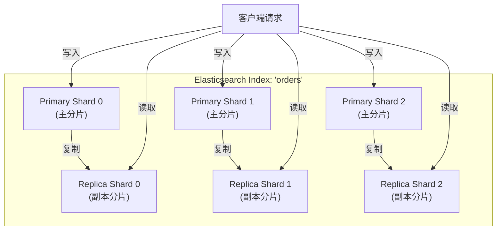
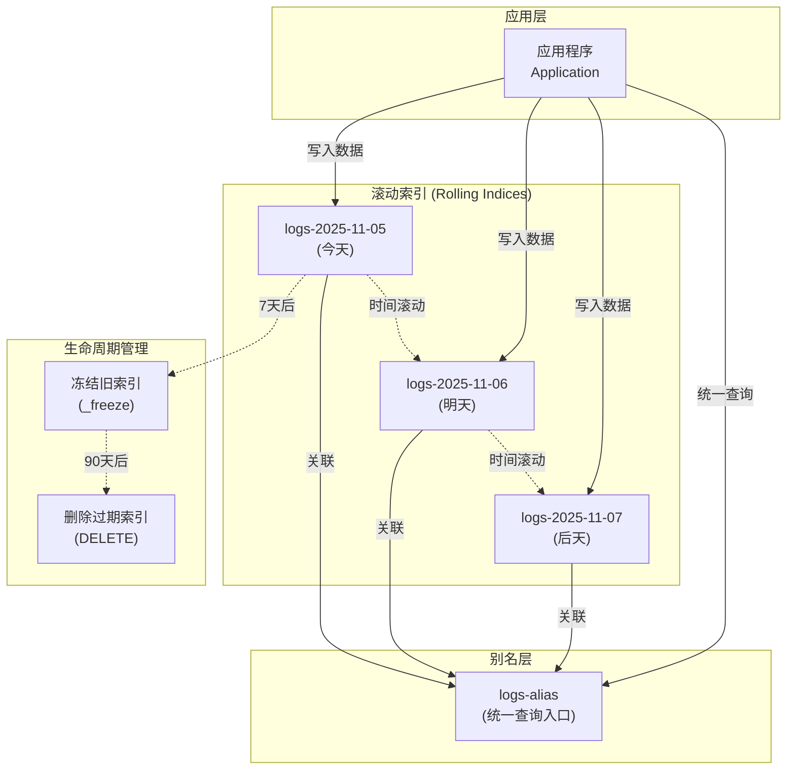

# ElasticSearch 分片数量设置最佳实践

## 概述

在 Elasticsearch 的世界里，分片（Shard）是数据存储与并行处理的基石。它决定了集群能否高效扩展、查询是否迅速、写入是否稳定。本文深入剖析 Elasticsearch 分片数量设置的最佳实践。

### 现实中的惨痛教训

| 案例 | 问题 | 后果 |
|------|------|------|
| 某电商系统 | 单索引设置 1000 个分片 | Master 节点 CPU 100%，集群不可用 |
| 某日志平台 | 1 个分片存储 2TB 数据 | 查询慢，频繁触发 Full GC |
| 某 SaaS 产品 | 每客户独立索引且默认 5 分片 | 1000 客户后集群崩溃 |

---

## 一、分片是什么？为什么它如此关键？

### 1.1 分片的本质：Lucene 索引的分布式封装

Elasticsearch 的索引（Index）并非一个物理存储单元，而是由多个**分片（Shard）**组成。每个分片实际上是一个**完整的 Apache Lucene 索引**，具备独立的倒排索引、正排索引、缓存等结构。



| 分片类型 | 说明 |
|----------|------|
| **Primary Shard（主分片）** | 负责数据的写入与读取，数量在索引创建时固定 |
| **Replica Shard（副本分片）** | 主分片的拷贝，用于高可用与读负载分担，可动态调整 |

### 1.2 分片的作用：并行、扩展与容错

| 作用 | 说明 |
|------|------|
| **并行处理** | 查询/写入请求可并行分发到多个分片，提升吞吐 |
| **水平扩展** | 数据可分布到多个节点，突破单机存储与计算瓶颈 |
| **容错能力** | 副本分片可在主分片故障时接管服务 |

### 1.3 分片过多 or 过少？后果有多严重？

| 问题类型 | 表现 | 根本原因 |
|----------|------|----------|
| **分片过多** | Master 节点 CPU 飙升、集群状态更新慢、文件句柄耗尽、查询变慢 | 每个分片都是 Lucene 索引，消耗内存、CPU、文件描述符 |
| **分片过少** | 单分片过大（>50GB）、查询延迟高、写入吞吐低、合并压力大 | 无法利用多节点并行能力，单分片成为性能瓶颈 |

> **关键认知**：分片不是越多越好，也不是越少越好，而是刚刚好。

---

## 二、官方推荐：分片大小与数量的黄金法则

### 2.1 单分片大小：10GB – 50GB

这是最核心的建议。单个分片的大小应控制在 **10GB 到 50GB** 之间。

| 分片大小 | 评价 | 说明 |
|----------|------|------|
| < 10GB | ⚠️ 过小 | 分片过小，管理开销占比过高 |
| 10GB - 50GB | ✅ 最佳 | 性能与恢复速度平衡 |
| > 50GB | ⚠️ 过大 | Lucene 段合并成本剧增，查询性能下降，恢复时间变长 |

### 2.2 如何计算分片数量？

```
推荐分片数 = 预估总数据量 / 目标分片大小
```

其中，目标分片大小建议取 **30GB**（折中值）。

**示例**：

| 参数 | 值 |
|------|-----|
| 预计索引总数据量 | 300GB |
| 目标分片大小 | 30GB |
| **推荐分片数** | 300 / 30 = **10** |

> **注意**：结果需向上取整，且至少为 1。

### 2.3 节点数量与分片的关系

| 原则 | 说明 |
|------|------|
| 理想情况 | 分片数 ≥ 节点数（让每个节点都能参与计算） |
| 避免极端 | 1000 分片跑在 3 节点集群上 → 资源争抢严重 |

> **经验法则**：单节点承载的分片数建议 ≤ 20（视硬件而定）

---

## 三、Java 代码实现：动态计算最优分片数

### 3.1 基础计算工具类

```java
import java.util.concurrent.TimeUnit;

public class ShardCalculator {

    private static final long TARGET_SHARD_SIZE_BYTES = 30L * 1024 * 1024 * 1024;
    private static final int MIN_SHARDS = 1;
    private static final int MAX_SHARDS = 50;

    public static int calculateOptimalShards(long totalDataBytes) {
        if (totalDataBytes <= 0) {
            return MIN_SHARDS;
        }

        long shards = totalDataBytes / TARGET_SHARD_SIZE_BYTES;
        int result = (int) Math.max(MIN_SHARDS, shards);

        return Math.min(result, MAX_SHARDS);
    }

    public static long calculateTotalData(long dailyDataBytes, int retentionDays) {
        return dailyDataBytes * retentionDays;
    }

    public static void main(String[] args) {
        long dailyLogs = 50L * 1024 * 1024 * 1024;
        int retention = 30;

        long totalData = calculateTotalData(dailyLogs, retention);
        int shards = calculateOptimalShards(totalData);

        System.out.println("总数据量: " + formatBytes(totalData));
        System.out.println("推荐分片数: " + shards);
    }

    private static String formatBytes(long bytes) {
        if (bytes < 1024) return bytes + " B";
        int exp = (int) (Math.log(bytes) / Math.log(1024));
        String pre = "KMGTPE".charAt(exp - 1) + "B";
        return String.format("%.1f %s", bytes / Math.pow(1024, exp), pre);
    }
}
```

### 3.2 在索引创建时应用

```java
import co.elastic.clients.elasticsearch.ElasticsearchClient;
import co.elastic.clients.elasticsearch.indices.CreateIndexRequest;
import co.elastic.clients.transport.endpoints.BooleanResponse;

public class IndexManager {

    private final ElasticsearchClient client;

    public IndexManager(ElasticsearchClient client) {
        this.client = client;
    }

    public void createIndexWithOptimalShards(String indexName, long totalDataBytes) {
        int shards = ShardCalculator.calculateOptimalShards(totalDataBytes);

        CreateIndexRequest request = CreateIndexRequest.of(builder -> builder
            .index(indexName)
            .settings(settings -> settings
                .numberOfShards(shards)
                .numberOfReplicas(1)
                .refreshInterval(t -> t.time("30s"))
            )
            .mappings(mappings -> mappings
                .properties("timestamp", p -> p.date(d -> d))
                .properties("message", p -> p.text(t -> t))
            )
        );

        try {
            BooleanResponse response = client.indices().create(request);
            if (response.acknowledged()) {
                System.out.println("索引 " + indexName + " 创建成功，分片数: " + shards);
            }
        } catch (Exception e) {
            System.err.println("创建索引失败: " + e.getMessage());
        }
    }
}
```

---

## 四、时间序列数据：日志、指标的分片策略

### 4.1 为什么不能用一个大索引？

假设有一个 `logs` 索引，每天写入 100GB，保留 30 天 → 总数据 3TB。

| 方案 | 问题 |
|------|------|
| 1 个分片 | 单分片 3TB → 无法查询、无法恢复 |
| 100 个分片 | 3TB / 100 = 30GB/分片 → 看似合理，但无法按时间清理 |

### 4.2 最佳实践：按时间滚动索引（Rolling Index）



**核心原则**：

- 每天/每周/每月创建一个新索引：`logs-2025-11-05`
- 每个索引独立设置分片数
- 旧索引可冻结（freeze）或删除

### 4.3 滚动索引的分片计算

```java
public void createDailyLogIndex(String dateStr, long dailyDataBytes) {
    int shards = ShardCalculator.calculateOptimalShards(dailyDataBytes);

    String indexName = "logs-" + dateStr;

    CreateIndexRequest request = CreateIndexRequest.of(r -> r
        .index(indexName)
        .settings(s -> s
            .numberOfShards(shards)
            .numberOfReplicas(0)
        )
    );

    client.indices().create(request);

    // 写入完成后增加副本
    client.indices().putSettings(s -> s
        .index(indexName)
        .settings(set -> set.numberOfReplicas(1))
    );

    // 更新别名
    client.indices().updateAliases(a -> a
        .actions(action -> action
            .add(add -> add.index(indexName).alias("logs-alias"))
        )
    );
}
```

> **技巧**：对历史索引（>7天），可调用 `_freeze` API 降低资源占用。

---

## 五、分片数量能否动态调整？答案与替代方案

### 5.1 残酷现实：主分片数量不可变！

Elasticsearch **不允许修改已存在索引的主分片数量**。这是由 Lucene 的底层设计决定的。

```json
// ❌ 以下操作会失败：
PUT /my_index/_settings
{
  "number_of_shards": 10  // 报错！
}
```

### 5.2 替代方案：Reindex API

唯一办法是**创建新索引 + Reindex 数据**。

#### 步骤

1. 创建新索引（目标分片数）
2. 使用 `_reindex` API 迁移数据
3. 切换别名指向新索引
4. 删除旧索引

#### Java 实现

```java
public void resizeIndex(String oldIndex, String newIndex, int newShardCount) {
    // 1. 创建新索引
    client.indices().create(c -> c
        .index(newIndex)
        .settings(s -> s.numberOfShards(newShardCount).numberOfReplicas(1))
        .mappings(m -> m.source(s -> s.enabled(true)))
    );

    // 2. Reindex 数据
    ReindexRequest reindex = ReindexRequest.of(r -> r
        .source(s -> s.index(oldIndex))
        .dest(d -> d.index(newIndex))
        .waitForCompletion(false)
    );

    ReindexResponse response = client.reindex(reindex);
    String taskId = response.task();

    // 3. 监控进度
    TaskInfo taskInfo = client.tasks().get(t -> t.taskId(taskId)).task();
    System.out.println("Reindex 进度: " + taskInfo.status().toString());
}
```

> **注意**：Reindex 是昂贵操作，需在低峰期执行，并确保磁盘空间充足。

### 5.3 预防胜于治疗：初始设计就要合理

```json
PUT /_index_template/logs_template
{
  "index_patterns": ["logs-*"],
  "template": {
    "settings": {
      "number_of_shards": 3,
      "number_of_replicas": 1
    }
  }
}
```

---

## 六、监控与调优：如何判断分片是否合理？

### 6.1 关键监控指标

| 指标 | 命令 | 健康阈值 |
|------|------|----------|
| 分片大小 | `GET /_cat/indices?v` | 10–50GB |
| 单节点分片数 | `GET /_cat/allocation?v` | ≤20 |
| 查询延迟 | Kibana > Discover | P99 < 1s |
| 合并速率 | `GET /_nodes/stats?filter_path=**.merges` | 无持续高峰 |

### 6.2 Java 获取分片统计

```java
public void printShardStats() {
    IndicesStatsResponse stats = client.indices().stats(r -> r
        .index("*")
        .metric("store", "docs")
    );

    stats.indices().forEach((name, indexStats) -> {
        long totalBytes = indexStats.total().store().sizeInBytes();
        long docCount = indexStats.total().docs().count();
        double avgDocSize = docCount > 0 ? (double) totalBytes / docCount : 0;

        System.out.printf("索引: %s, 文档数: %d, 大小: %s, 平均文档: %.2f KB%n",
            name, docCount, formatBytes(totalBytes), avgDocSize / 1024
        );
    });
}
```

### 6.3 自动化告警：分片过大检测

```java
public void checkLargeShards() {
    IndicesStatsResponse stats = client.indices().stats();

    stats.indices().forEach((index, indexStats) -> {
        long size = indexStats.total().store().sizeInBytes();
        int shards = indexStats.shards().size();

        if (shards == 0) return;

        long avgShardSize = size / shards;
        if (avgShardSize > 50L * 1024 * 1024 * 1024) {
            System.err.println("⚠️ 警告: 索引 " + index + " 分片平均大小 " +
                formatBytes(avgShardSize) + "，建议拆分！");
        }
    });
}
```

---

## 七、高级策略：分片分配与冷热架构

### 7.1 冷热架构（Hot-Warm Architecture）

| 节点类型 | 存储 | 用途 |
|----------|------|------|
| **Hot 节点** | SSD，高配 | 处理新数据写入与高频查询 |
| **Warm 节点** | HDD，低配 | 存储历史数据，只读 |

通过 Index Lifecycle Management (ILM) 自动迁移：

```json
PUT /_ilm/policy/logs_policy
{
  "policy": {
    "phases": {
      "hot": {
        "actions": {
          "rollover": {
            "max_size": "50gb",
            "max_age": "1d"
          }
        }
      },
      "warm": {
        "min_age": "7d",
        "actions": {
          "allocate": {
            "require": {
              "data": "warm"
            }
          },
          "forcemerge": {
            "max_num_segments": 1
          }
        }
      }
    }
  }
}
```

### 7.2 分片分配过滤

```json
{
  "settings": {
    "index.routing.allocation.require.data": "hot"
  }
}
```

---

## 八、真实案例：从崩溃到稳定

### 背景

某金融公司日志系统：

- 每天 2TB 日志
- 保留 90 天 → 总数据 180TB
- 初始设计：单索引，5 分片 → 单分片 36TB！

### 问题

- 查询超时（>30s）
- 节点频繁 OOM
- 无法扩容

### 优化方案

| 阶段 | 策略 |
|------|------|
| **索引设计** | 切换为每日索引：`logs-YYYY-MM-DD` |
| **分片计算** | 每索引分片数：2TB / 30GB ≈ 68 → 取整 70 |
| **冷热分离** | Hot：最近 3 天，70 分片，SSD |
| | Warm：4–30 天，合并为 1 segment，HDD |
| | Cold：30–90 天，冻结（freeze） |
| **自动化** | ILM 自动化 |

### 效果

| 指标 | 优化前 | 优化后 |
|------|--------|--------|
| 查询 P99 延迟 | 30s | 0.8s |
| 集群内存使用 | 高 | 下降 60% |
| 扩容能力 | 无法扩容 | 加 Warm 节点即可 |

---

## 九、总结：分片设置 Checklist

| 场景 | 推荐策略 |
|------|----------|
| **通用数据** | 分片大小 10–50GB，数量 = 总数据 / 30GB |
| **时间序列** | 按天/周建索引，每索引独立计算分片 |
| **写密集型** | 初始 replicas=0，写完再加 |
| **读密集型** | replicas=1~2，提升吞吐 |
| **未知数据量** | 先用小分片（如 3），监控后调整 |
| **超大集群** | 采用冷热架构 + ILM |

### 终极建议

1. **不要猜测，用数据估算**
2. **不要硬编码，用模板和自动化**
3. **不要忽视监控，持续优化**

---

## 十、延伸资源

- [官方分片指南：Size your shards](https://www.elastic.co/guide/en/elasticsearch/reference/current/size-your-shards.html)
- [ILM 实战教程：ILM Getting Started](https://www.elastic.co/guide/en/elasticsearch/reference/current/getting-started-index-lifecycle-management.html)
- [Java API Client 文档：Elasticsearch Java Client](https://www.elastic.co/guide/en/elasticsearch/client/java-api-client/current/index.html)
- [社区讨论：Elastic Discuss - Shard Sizing](https://discuss.elastic.co/)

---

## 参考资料

- [Elasticsearch - 分片数量如何设置 Elasticsearch 最佳实践](https://adg.csdn.net/696f50ea437a6b40336a019e.html)
