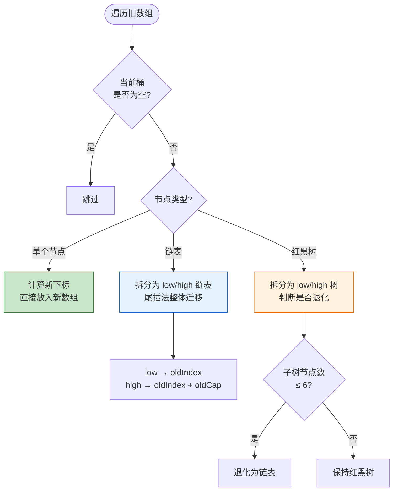
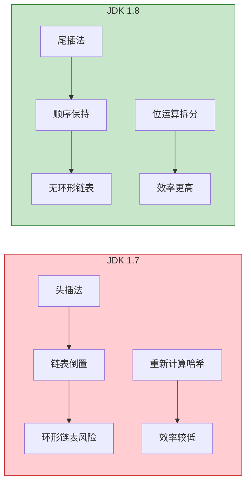

# Java HashMap 扩容机制详解

## 一、扩容的本质

### 1.1 什么是扩容？

扩容是 HashMap 应对元素增多、哈希冲突加剧的动态调整机制：

1. 创建 **2 倍大小**的新数组
2. 将旧数组元素重新计算位置，迁移到新数组
3. 目的：减少哈希冲突，维持 O(1) 级别的平均存取效率

### 1.2 为什么必须扩容？

不扩容的后果：

- 哈希桶被占满，大量 key 挂载到同一链表/红黑树
- 查找效率从 O(1) 退化到 O(n)（链表）或 O(log n)（红黑树）
- 极端情况下 HashMap 退化为"链表集合"

---

## 二、扩容触发条件

### 2.1 条件一：元素数量超过阈值（通用）

```java
threshold = capacity * loadFactor;
if (size > threshold) {
    resize();
}
```

| 参数 | 说明 | 默认值 |
|------|------|--------|
| capacity | 哈希桶数组长度 | 16 |
| loadFactor | 加载因子 | 0.75 |
| threshold | 扩容阈值 | 12 |

**示例**：初始容量 16，阈值 = 16 × 0.75 = 12，第 13 个元素插入时触发扩容。

> **加载因子 0.75 的平衡**：太小会频繁扩容浪费内存，太大则冲突加剧、查询变慢。

### 2.2 条件二：链表树化前置扩容（仅 JDK 1.8）

```java
if (binCount >= TREEIFY_THRESHOLD - 1)  // TREEIFY_THRESHOLD = 8
    treeifyBin(tab, hash);
    
if (tab == null || (n = tab.length) < MIN_TREEIFY_CAPACITY)  // MIN_TREEIFY_CAPACITY = 64
    resize();
```

**触发场景**：链表长度 ≥ 8，但数组长度 < 64 时，优先扩容而非树化。

**原因**：小容量数组下树化浪费内存，扩容后链表长度大概率缩短，更高效。

---

## 三、扩容核心流程

### 3.1 创建新数组

```java
oldCap = table.length;
newCap = oldCap << 1;  // 新容量 = 旧容量 × 2
newThr = oldThr << 1;  // 新阈值 = 旧阈值 × 2
```

**核心约束**：新容量必须是 **2 的幂次方**。

**原因**：
- 下标计算用位运算 `hash & (capacity - 1)` 替代取模，速度更快
- 扩容时可通过高位判断快速定位新下标，无需重新计算哈希

### 3.2 元素迁移（JDK 1.8）

#### 新下标计算规则

JDK 1.8 不重新计算哈希，通过位运算直接推导新下标：

```java
if ((hash & oldCap) == 0) {
    newIndex = oldIndex;           // low 组：保持原位置
} else {
    newIndex = oldIndex + oldCap;  // high 组：原位置 + 旧容量
}
```

**原理图解**：

```
旧容量 16 (二进制: 10000)
hash & oldCap 结果只有 0 或 16

hash = ...0xxxx → 结果 0  → newIndex = oldIndex
hash = ...1xxxx → 结果 16 → newIndex = oldIndex + 16
```

#### 迁移四步流程



| 节点类型 | 迁移方式 | 说明 |
|----------|----------|------|
| 单个节点 | 直接计算新下标 | `hash & (newCap - 1)` |
| 链表 | 拆分为两条链表 | 尾插法保持顺序，整体迁移 |
| 红黑树 | 拆分为两棵子树 | 节点数 ≤ 6 时退化为链表 |

> **退化阈值 6**：避免在 7、8 节点时频繁切换，减少性能抖动。
> 源码中 UNTREEIFY_THRESHOLD = 6，TREEIFY_THRESHOLD = 8，中间留 7 作为缓冲

---

## 四、JDK 1.7 与 1.8 核心差异

### 4.1 插入方式

| 版本 | 插入方式 | 影响 |
|------|----------|------|
| JDK 1.7 | 头插法 | 扩容后链表倒置，多线程易形成环形链表 |
| JDK 1.8 | 尾插法 | 扩容后链表保持原顺序，避免环形链表 |

**头插法缺陷**：多线程扩容时形成 A → B → A 环形引用，`get()` 遍历死循环，CPU 飙升。

### 4.2 元素迁移方式

| 版本 | 迁移逻辑 | 效率 |
|------|----------|------|
| JDK 1.7 | 重新计算每个节点下标，逐个插入 | 低效，需重新哈希，链表倒置 |
| JDK 1.8 | 拆分链表/红黑树，整体迁移 | 高效，位运算拆分，顺序不变 |

### 4.3 并发安全性

| 版本 | 并发问题 |
|------|----------|
| JDK 1.7 | 头插法 + 链表倒置 → 环形链表死循环 |
| JDK 1.8 | 尾插法避免环形链表，但仍非线程安全 |

> **注意**：JDK 1.8 虽解决了环形链表，但 HashMap 仍不是线程安全的，并发场景应使用 ConcurrentHashMap。

### 4.4 差异对比图



---

## 五、面试要点总结

### 5.1 高频问题

| 问题 | 答案要点 |
|------|----------|
| 扩容触发时机？ | size > threshold 或链表长度 ≥ 8 且数组长度 < 64 |
| 为什么容量必须是 2 的幂次方？ | 位运算计算下标更快；扩容时高位判断快速定位 |
| 加载因子为什么是 0.75？ | 空间与时间的平衡，泊松分布概率优化 |
| 1.7 和 1.8 扩容区别？ | 头插法 vs 尾插法；重新哈希 vs 位运算拆分 |
| 为什么链表转红黑树阈值是 8？ | 泊松分布下概率极低（约 0.00000006），避免频繁转换 |

### 5.2 关键数值

| 参数 | 值 | 含义 |
|------|-----|------|
| DEFAULT_INITIAL_CAPACITY | 16 | 默认初始容量 |
| DEFAULT_LOAD_FACTOR | 0.75 | 默认加载因子 |
| TREEIFY_THRESHOLD | 8 | 链表转红黑树阈值 |
| UNTREEIFY_THRESHOLD | 6 | 红黑树退化链表阈值 |
| MIN_TREEIFY_CAPACITY | 64 | 树化最小容量 |

---

## 参考资料

- [深入 HashMap 扩容全流程 - CSDN](https://blog.csdn.net/2301_82132279/article/details/159119951)
- [JDK 1.7 HashMap 源码](https://github.com/openjdk/jdk7u/blob/master/jdk/src/share/classes/java/util/HashMap.java)
- [JDK 1.8 HashMap 源码](https://github.com/openjdk/jdk8u/blob/master/jdk/src/share/classes/java/util/HashMap.java)
