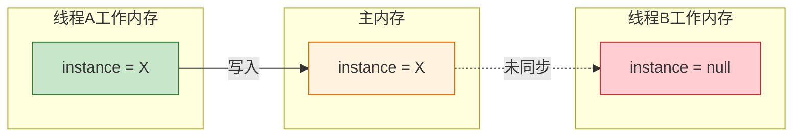

# Java 单例模式详解

## 一、什么是单例模式？

单例模式保证某个类在程序中只存在**唯一一份实例**，不会创建出多个实例。

---

## 二、实现方式

### 2.1 饿汉模式

**特点**：类加载的同时创建实例。

```java
class Singleton {
    private static Singleton instance = new Singleton();
    
    private Singleton() {}
    
    public static Singleton getInstance() {
        return instance;
    }
}
```

**优点**：
- 实现简单
- 线程安全（类加载时由 JVM 保证）

**缺点**：
- 无论是否使用都会创建实例，可能造成资源浪费

---

### 2.2 懒汉模式（单线程版）

**特点**：类加载时不创建实例，第一次使用时才创建。

```java
class Singleton {
    private static Singleton instance = null;
    
    private Singleton() {}
    
    public static Singleton getInstance() {
        if (instance == null) {
            instance = new Singleton();
        }
        return instance;
    }
}
```

**优点**：
- 延迟加载，按需创建

**缺点**：
- **线程不安全**，多线程环境下可能创建多个实例

---

### 2.3 懒汉模式（多线程版）

**特点**：通过 `synchronized` 保证线程安全。

```java
class Singleton {
    private static Singleton instance = null;
    
    private Singleton() {}
    
    public static synchronized Singleton getInstance() {
        if (instance == null) {
            instance = new Singleton();
        }
        return instance;
    }
}
```

**缺点**：
- 每次调用都要加锁，性能开销大
- 实际上只有首次创建实例时需要加锁

---

### 2.4 懒汉模式（双重检查锁定）

**特点**：双重 if 判定 + `volatile` 关键字。

```java
class Singleton {
    private static volatile Singleton instance = null;
    
    private Singleton() {}
    
    public static Singleton getInstance() {
        if (instance == null) {                    // 第一次检查：避免不必要的加锁
            synchronized (Singleton.class) {
                if (instance == null) {            // 第二次检查：确保只创建一个实例
                    instance = new Singleton();
                }
            }
        }
        return instance;
    }
}
```

**优化点**：

| 优化 | 说明 |
|------|------|
| **双重 if 判定** | 外层 if 避免已创建实例后的锁竞争，内层 if 确保线程安全 |
| **volatile 关键字** | 保证内存可见性 + 禁止指令重排序，确保多线程环境下正确获取实例 |

---

## 三、为什么需要 volatile？

`volatile` 关键字有两个核心作用：

### 3.1 保证内存可见性

**问题场景**：

```
线程A：创建单例并将引用指向内存地址
线程B：读取 instance 引用，可能得到 null（读取的是本地缓存，而非主内存）
```

**原因**：每个线程有自己的**工作内存**（CPU 缓存），线程间无法直接共享变量值。



**volatile 解决方案**：

- 写操作：立即刷新到主内存
- 读操作：直接从主内存读取最新值

### 3.2 禁止指令重排序

`new Singleton()` 不是原子操作，分为三步：

```
1. 分配内存空间
2. 初始化对象
3. 将引用指向内存地址
```

**指令重排序问题**：可能变成 1 → 3 → 2，导致其他线程获取到未初始化完成的对象。

**volatile 解决方案**：通过**内存屏障**禁止指令重排序，保证 1 → 2 → 3 的执行顺序。

### 3.3 volatile 两大作用总结

| 作用 | 说明 | 解决的问题 |
|------|------|------------|
| **内存可见性** | 写立即刷新主内存，读直接从主内存获取 | 线程间变量值不可见 |
| **禁止重排序** | 插入内存屏障，保证指令执行顺序 | 获取到未初始化完成的对象 |

> **注意**：`volatile` 只保证可见性和有序性，**不保证原子性**。复合操作（如 `i++`）仍需加锁。

---

## 四、对比总结

| 实现方式 | 线程安全 | 延迟加载 | 性能 | 推荐场景 |
|----------|----------|----------|------|----------|
| 饿汉模式 | ✅ 安全 | ❌ 否 | 高 | 实例创建开销小 |
| 懒汉（单线程） | ❌ 不安全 | ✅ 是 | 高 | 单线程环境 |
| 懒汉（同步方法） | ✅ 安全 | ✅ 是 | 低 | 不推荐 |
| 懒汉（双重检查） | ✅ 安全 | ✅ 是 | 高 | 多线程环境，推荐使用 |

---

## 五、最佳实践

```java
public class Singleton {
    private static volatile Singleton instance;
    
    private Singleton() {}
    
    public static Singleton getInstance() {
        if (instance == null) {
            synchronized (Singleton.class) {
                if (instance == null) {
                    instance = new Singleton();
                }
            }
        }
        return instance;
    }
}
```

**要点**：
1. 私有构造方法，防止外部实例化
2. `volatile` 修饰实例变量
3. 双重检查锁定，兼顾线程安全与性能

---

## 参考资料

- [Java多线程初阶-单例模式的写法 - CSDN](https://blog.csdn.net/m0_62468521/article/details/129972762)
