# MySQL MVCC 多版本并发控制机制详解

## 概述

MVCC（Multi-Version Concurrency Control，多版本并发控制）是 MySQL InnoDB 存储引擎实现高并发读写的核心机制。它通过"保存数据的多个历史版本"，让读操作不用阻塞写操作、写操作也不用阻塞读操作，从根本上解决了传统锁机制下"读写互斥"的性能瓶颈。

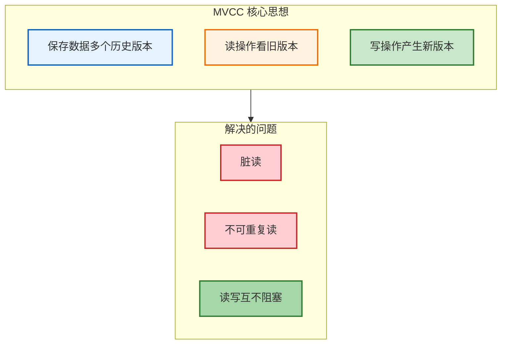

***

## 一、为什么需要 MVCC

### 1.1 传统锁机制的缺陷

| 问题       | 说明                  |
| -------- | ------------------- |
| **读阻塞写** | 写操作加锁后，读操作必须等待锁释放   |
| **写阻塞读** | 读操作加共享锁后，写操作必须等待锁释放 |
| **性能下降** | 锁竞争激烈时，并发性能急剧下降     |
| **死锁风险** | 可能引发死锁问题            |

### 1.2 MVCC 的优势

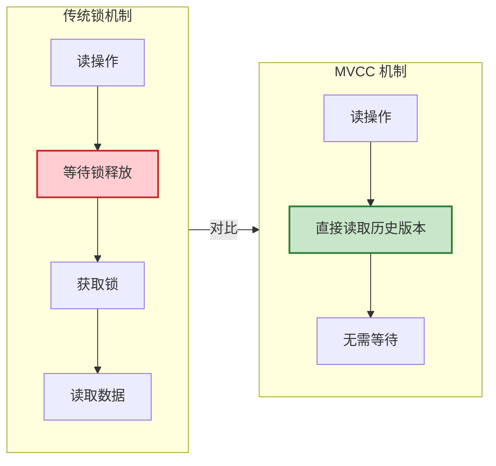

| 优势        | 说明           |
| --------- | ------------ |
| **高并发读写** | 无锁快照读，读写互不阻塞 |
| **保证隔离性** | 解决脏读、不可重复读问题 |
| **减少锁竞争** | 避免大量锁等待和死锁   |

***

## 二、MVCC 的物理基础：隐藏列

### 2.1 MVCC 与聚簇索引的关系

MVCC 的隐藏列是存储在 **聚簇索引（Clustered Index）** 的叶子节点中的。在 InnoDB 中，聚簇索引就是表数据的实际存储位置，隐藏列作为行记录的一部分，与用户数据一起存储在聚簇索引的 B+ 树叶子节点中。

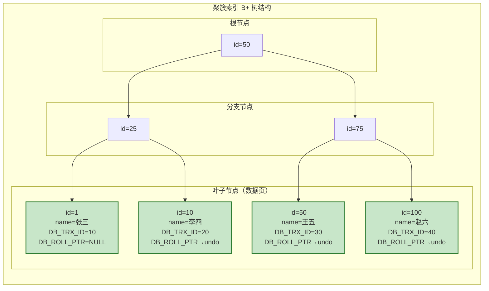

**关键点**：

| 特性 | 说明 |
|------|------|
| **存储位置** | 隐藏列与用户数据一起存储在聚簇索引叶子节点 |
| **索引组织表** | InnoDB 表即聚簇索引，数据按主键顺序存储 |
| **版本链起点** | 聚簇索引中的 DB_ROLL_PTR 指向 undo log 版本链 |
| **二级索引** | 二级索引不包含隐藏列，需回表才能获取 MVCC 信息 |

### 2.2 InnoDB 行记录隐藏列

InnoDB 为每行数据额外添加 3 个隐藏列，这是 MVCC 的物理基础：

| 隐藏列               | 长度   | 作用                  |
| ----------------- | ---- | ------------------- |
| **DB\_TRX\_ID**   | 6 字节 | 记录插入/更新该行的事务 ID     |
| **DB\_ROLL\_PTR** | 7 字节 | 回滚指针，指向该行的上一个历史版本   |
| **DB\_ROW\_ID**   | 6 字节 | 单调递增的行 ID（仅表无主键时使用） |

### 2.3 隐藏列示例

```sql
-- 初始插入一行数据
INSERT INTO user (id, name) VALUES (1, '张三');
-- 事务 ID 为 10

-- 行记录结构：
-- | id | name | DB_TRX_ID | DB_ROLL_PTR |
-- | 1  | 张三 | 10        | NULL        |
```

***

## 三、MVCC 的核心组件：Undo Log

### 3.1 Undo Log 概述

Undo Log（回滚日志）是 InnoDB 为事务回滚和 MVCC 版本管理专门开辟的日志区域。

| 类型                  | 说明                        | 生命周期                  |
| ------------------- | ------------------------- | --------------------- |
| **insert undo log** | 记录 INSERT 操作的 undo        | 事务提交后可立即删除            |
| **update undo log** | 记录 UPDATE/DELETE 操作的 undo | 需等 purge 线程确认无事务引用后清理 |

### 3.2 版本链的形成

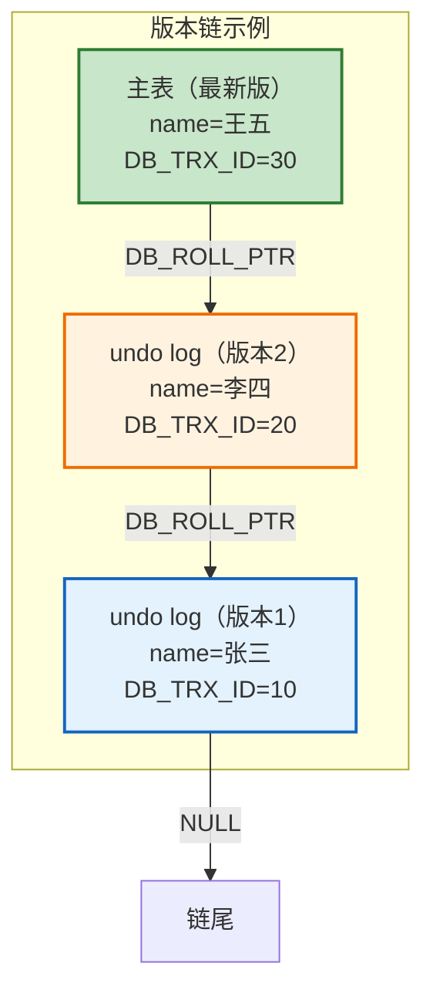

**版本链形成过程**：

```sql
-- 事务 10：初始插入
INSERT INTO user (id, name) VALUES (1, '张三');
-- 主表：name=张三, DB_TRX_ID=10, DB_ROLL_PTR=NULL

-- 事务 20：更新数据
UPDATE user SET name = '李四' WHERE id = 1;
-- 主表：name=李四, DB_TRX_ID=20, DB_ROLL_PTR→undo log 版本1
-- undo log 版本1：name=张三, DB_TRX_ID=10

-- 事务 30：再次更新
UPDATE user SET name = '王五' WHERE id = 1;
-- 主表：name=王五, DB_TRX_ID=30, DB_ROLL_PTR→undo log 版本2
-- undo log 版本2：name=李四, DB_TRX_ID=20, DB_ROLL_PTR→undo log 版本1
```

***

## 四、MVCC 的核心逻辑：Read View

### 4.1 Read View 概述

Read View（读视图）是事务进行快照读时生成的"数据快照"，本质是一套"可见性判断规则"，用来筛选版本链中对当前事务可见的历史版本。

### 4.2 Read View 的核心字段

| 字段                   | 含义                                      |
| -------------------- | --------------------------------------- |
| **m\_ids**           | 生成 Read View 时，系统中所有活跃的（未提交的）读写事务 ID 列表 |
| **min\_trx\_id**     | m\_ids 中的最小值（当前活跃的最小事务 ID）              |
| **max\_trx\_id**     | 生成 Read View 时，系统下一个要分配的事务 ID           |
| **creator\_trx\_id** | 生成该 Read View 的当前事务 ID                  |

### 4.3 版本可见性判断规则

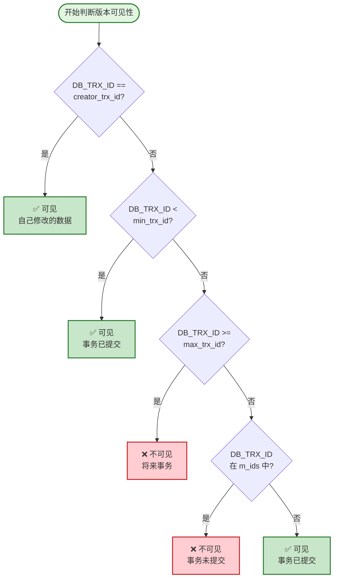

**判断规则详解**：

| 规则        | 条件                              | 结果            |
| --------- | ------------------------------- | ------------- |
| **规则 1**  | DB\_TRX\_ID == creator\_trx\_id | ✅ 可见（自己修改的数据） |
| **规则 2**  | DB\_TRX\_ID < min\_trx\_id      | ✅ 可见（事务已提交）   |
| **规则 3**  | DB\_TRX\_ID >= max\_trx\_id     | ❌ 不可见（将来事务）   |
| **规则 4a** | DB\_TRX\_ID 在 m\_ids 中          | ❌ 不可见（事务未提交）  |
| **规则 4b** | DB\_TRX\_ID 不在 m\_ids 中         | ✅ 可见（事务已提交）   |

***

## 五、MVCC 与事务隔离级别

### 5.1 事务并发问题

在了解 MVCC 如何支持不同隔离级别之前，需要先理解事务并发可能产生的问题：

#### 5.1.1 脏读（Dirty Read）

**概念**：一个事务读取到了另一个事务未提交的数据。

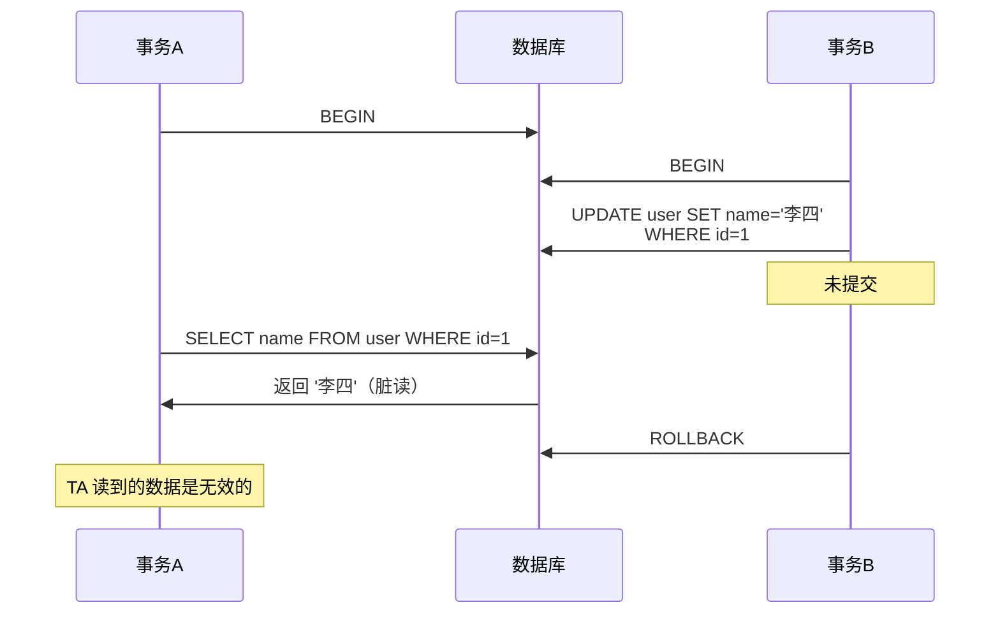

**示例**：

```sql
-- 事务 A
BEGIN;
SELECT balance FROM account WHERE id = 1;  -- 假设返回 1000

-- 事务 B（并发执行）
BEGIN;
UPDATE account SET balance = 500 WHERE id = 1;  -- 未提交

-- 事务 A（脏读）
SELECT balance FROM account WHERE id = 1;  -- 返回 500（读到未提交的数据）

-- 事务 B
ROLLBACK;  -- 回滚，余额实际还是 1000

-- 事务 A 基于错误数据做出了决策
```

#### 5.1.2 不可重复读（Non-Repeatable Read）

**概念**：同一事务内多次读取同一数据，结果不一致（针对**修改**操作）。

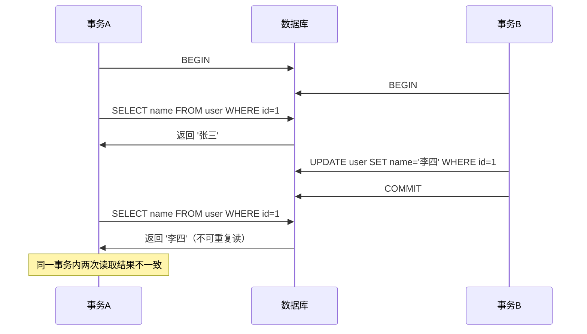

**示例**：

```sql
-- 事务 A
BEGIN;
SELECT balance FROM account WHERE id = 1;  -- 返回 1000

-- 事务 B（并发执行）
BEGIN;
UPDATE account SET balance = 500 WHERE id = 1;
COMMIT;

-- 事务 A
SELECT balance FROM account WHERE id = 1;  -- 返回 500（不可重复读）
-- 同一事务内两次读取结果不同
COMMIT;
```

#### 5.1.3 幻读（Phantom Read）

**概念**：同一事务内多次执行相同查询，结果集数量不一致（针对**插入/删除**操作）。

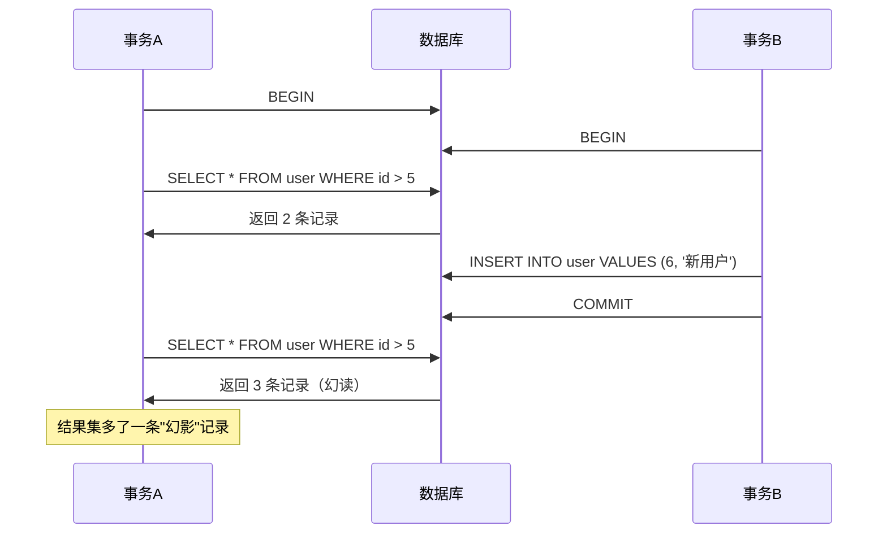

**示例**：

```sql
-- 事务 A
BEGIN;
SELECT * FROM user WHERE age > 20;  -- 返回 5 条记录

-- 事务 B（并发执行）
BEGIN;
INSERT INTO user (id, name, age) VALUES (100, '新用户', 25);
COMMIT;

-- 事务 A
SELECT * FROM user WHERE age > 20;  -- 返回 6 条记录（幻读）
-- 结果集多了一条记录，像出现"幻影"一样
COMMIT;
```

#### 5.1.4 三种问题对比

| 问题 | 操作类型 | 表现 | 影响 |
|------|----------|------|------|
| **脏读** | 读取 | 读到未提交的数据 | 数据可能被回滚，导致决策错误 |
| **不可重复读** | 修改 | 同一数据两次读取结果不同 | 数据一致性被破坏 |
| **幻读** | 插入/删除 | 结果集数量变化 | 范围查询结果不一致 |

### 5.2 Read View 生成时机对比

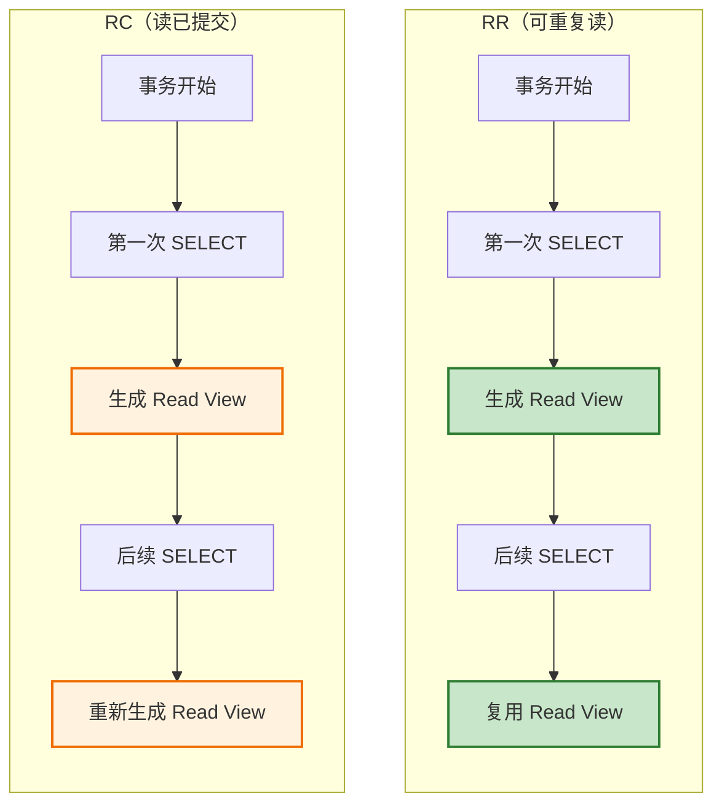

### 5.3 隔离级别对比

| 隔离级别                  | Read View 生成时机 | 脏读 | 不可重复读 | 幻读 | 效果                    |
| --------------------- | -------------- | ---- | ------ | ---- | --------------------- |
| **RU（读未提交）**          | 不生成            | ❌ 可能 | ❌ 可能   | ❌ 可能 | 直接读取最新版本              |
| **RC（读已提交）**          | 每次 SELECT 生成   | ✅ 解决 | ❌ 可能   | ❌ 可能 | 能看到已提交的最新数据 |
| **RR（可重复读）**          | 第一次 SELECT 生成  | ✅ 解决 | ✅ 解决   | ⚠️ 部分解决 | 事务内看到的数据一致 |
| **Serializable（串行化）** | 不使用 MVCC       | ✅ 解决 | ✅ 解决   | ✅ 解决 | 通过锁机制实现               |

> **注意**：RR 级别下，InnoDB 通过 MVCC + Next-Key Lock 可以完全解决幻读问题。

### 5.4 Next-Key Lock 与幻读解决

#### 5.4.1 为什么 MVCC 无法完全解决幻读

MVCC 只能解决**快照读**场景下的幻读问题，对于**当前读**场景，MVCC 无法防止幻读：

| 读类型 | MVCC 支持 | 幻读风险 |
|--------|-----------|----------|
| **快照读**（普通 SELECT） | ✅ 可以解决 | 无 |
| **当前读**（SELECT FOR UPDATE） | ❌ 无法解决 | 有 |

**当前读场景的幻读问题**：

```sql
-- 事务 A
BEGIN;
SELECT * FROM user WHERE id > 5 FOR UPDATE;  -- 返回 2 条记录

-- 事务 B（并发执行）
BEGIN;
INSERT INTO user VALUES (6, '新用户');  -- 被阻塞？如果没有锁，可以插入
COMMIT;

-- 事务 A
SELECT * FROM user WHERE id > 5 FOR UPDATE;  -- 返回 3 条记录（幻读）
COMMIT;
```

#### 5.4.2 Next-Key Lock 概念

**Next-Key Lock（临键锁）** 是 InnoDB 在 RR 隔离级别下默认的加锁算法，它是解决当前读幻读问题的关键。

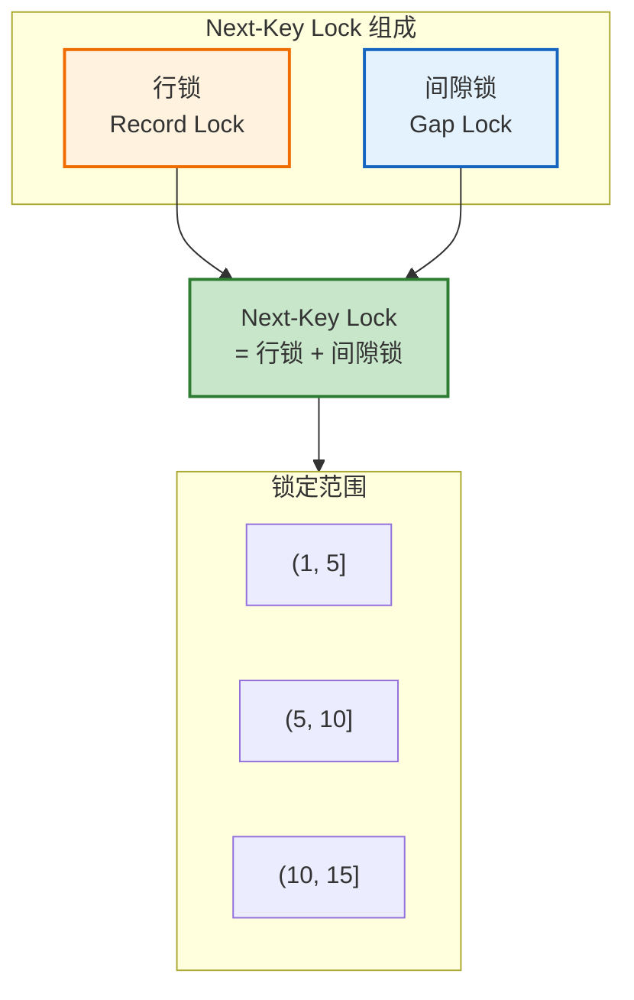

| 锁类型 | 说明 | 作用 |
|--------|------|------|
| **行锁（Record Lock）** | 锁住某一条具体记录 | 防止其他事务修改/删除该行 |
| **间隙锁（Gap Lock）** | 锁住记录之间的"空隙" | 防止其他事务在该区间插入新数据 |
| **Next-Key Lock** | 行锁 + 间隙锁 | 锁定左开右闭区间 (a, b] |

#### 5.4.3 Next-Key Lock 工作原理

**核心规则**：Next-Key Lock 锁定的是**左开右闭区间** `(a, b]`，只要命中索引，就会按这个规则加锁。

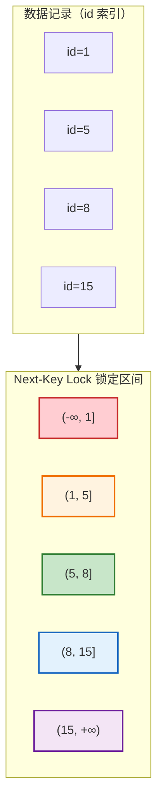

**示例**：假设数据表 user 有 id 索引，数据为：1、5、8、15

```sql
-- 场景 1：范围查询
SELECT * FROM user WHERE id BETWEEN 5 AND 8 FOR UPDATE;
-- Next-Key Lock 锁定区间：(1, 5]、(5, 8]、(8, 15]
-- 其他事务无法插入 id=6、7、9、10 等数据

-- 场景 2：等值查询（命中唯一索引）
SELECT * FROM user WHERE id = 5 FOR UPDATE;
-- 优化：降级为行锁，只锁 id=5 这一条记录
-- 其他事务可以插入 id=6、7 等数据

-- 场景 3：等值查询（未命中记录）
SELECT * FROM user WHERE id = 6 FOR UPDATE;
-- 间隙锁：锁定 (5, 8) 区间
-- 其他事务无法插入 id=6、7 等数据
```

#### 5.4.4 RR 级别解决幻读的完整机制

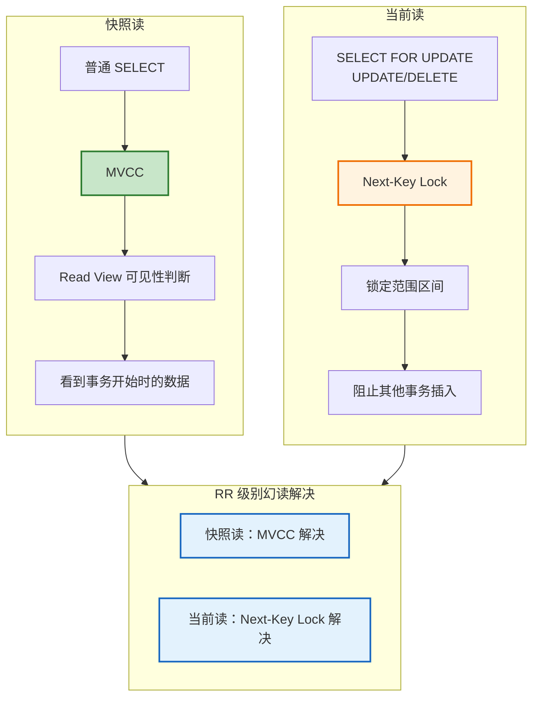

**完整示例**：

```sql
-- 事务 A（RR 级别）
BEGIN;
-- 快照读：MVCC 保证一致性
SELECT * FROM user WHERE id > 5;  -- 返回 2 条记录

-- 当前读：Next-Key Lock 锁定范围
SELECT * FROM user WHERE id > 5 FOR UPDATE;
-- 锁定区间：(5, 8]、(8, 15]、(15, +∞)

-- 事务 B（并发执行）
BEGIN;
INSERT INTO user VALUES (6, '新用户');  -- 被阻塞！无法插入
-- 等待事务 A 释放锁

-- 事务 A
SELECT * FROM user WHERE id > 5 FOR UPDATE;  -- 仍返回 2 条记录
COMMIT;  -- 释放锁

-- 事务 B
-- 此时可以插入成功
INSERT INTO user VALUES (6, '新用户');
COMMIT;
```

#### 5.4.5 Next-Key Lock 注意事项

| 注意点 | 说明 |
|--------|------|
| **生效前提** | InnoDB 引擎、RR 隔离级别、查询命中索引 |
| **唯一索引优化** | 唯一索引等值查询自动降级为行锁 |
| **无索引风险** | 无索引范围查询会升级为表锁，导致性能问题 |
| **死锁风险** | Next-Key Lock 可能增加死锁概率 |

### 5.5 RC 与 RR 的核心区别

```sql
-- RC 级别示例
SET SESSION TRANSACTION ISOLATION LEVEL READ COMMITTED;

BEGIN;
-- 第一次查询：生成 Read View
SELECT name FROM user WHERE id = 1;  -- 假设返回 '张三'

-- 其他事务修改并提交
-- UPDATE user SET name = '李四' WHERE id = 1; COMMIT;

-- 第二次查询：重新生成 Read View
SELECT name FROM user WHERE id = 1;  -- 返回 '李四'（看到已提交的修改）
COMMIT;

-- RR 级别示例
SET SESSION TRANSACTION ISOLATION LEVEL REPEATABLE READ;

BEGIN;
-- 第一次查询：生成 Read View
SELECT name FROM user WHERE id = 1;  -- 假设返回 '张三'

-- 其他事务修改并提交
-- UPDATE user SET name = '李四' WHERE id = 1; COMMIT;

-- 第二次查询：复用 Read View
SELECT name FROM user WHERE id = 1;  -- 仍返回 '张三'（看不到新提交）
COMMIT;
```

***

## 六、快照读与当前读

### 6.1 两种读操作对比

| 类型      | 定义                       | 示例                                         | 特点        |
| ------- | ------------------------ | ------------------------------------------ | --------- |
| **快照读** | 普通 SELECT，基于 MVCC 读取历史版本 | `SELECT * FROM user WHERE id=1`            | 无锁，读写互不阻塞 |
| **当前读** | 加锁读，读取数据最新版本             | `SELECT * FROM user WHERE id=1 FOR UPDATE` | 加锁，保证数据最新 |

### 6.2 当前读的操作类型

```sql
-- 共享锁当前读
SELECT * FROM user WHERE id = 1 LOCK IN SHARE MODE;
SELECT * FROM user WHERE id = 1 FOR SHARE;  -- MySQL 8.0+

-- 排他锁当前读
SELECT * FROM user WHERE id = 1 FOR UPDATE;

-- 写操作（本质是当前读 + 修改）
INSERT INTO user (id, name) VALUES (1, '张三');
UPDATE user SET name = '李四' WHERE id = 1;
DELETE FROM user WHERE id = 1;
```

### 6.3 快照读与当前读的选择

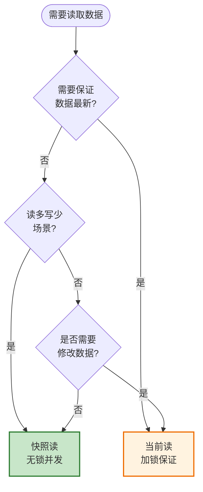

***

## 七、MVCC 工作流程示例

### 7.1 场景设置

```sql
-- 初始数据
-- id=1, name='张三', DB_TRX_ID=10（已提交）

-- 隔离级别：RR
-- 活跃事务：事务 20（未提交）、事务 30（未提交）
```

### 7.2 执行流程

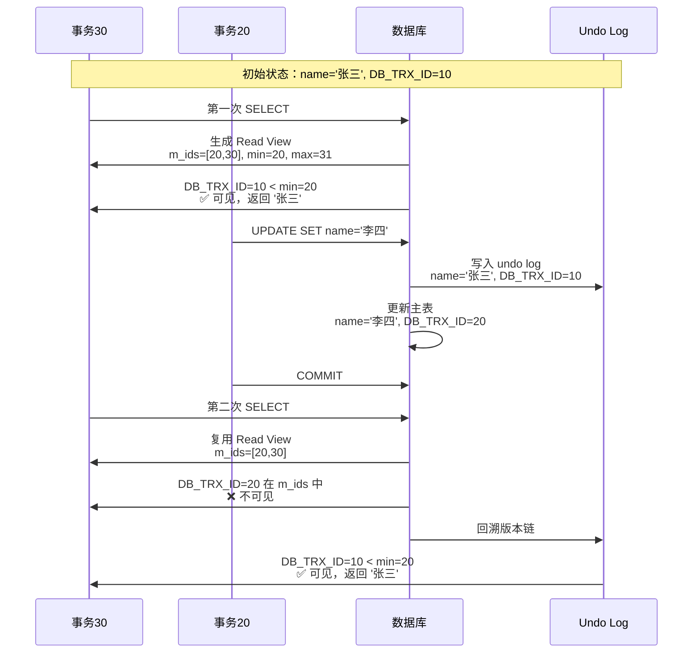

### 7.3 结果分析

| 操作         | Read View          | 判断过程                                         | 结果   |
| ---------- | ------------------ | -------------------------------------------- | ---- |
| 第一次 SELECT | m\_ids=\[20,30]    | DB\_TRX\_ID=10 < min=20                      | '张三' |
| 第二次 SELECT | 复用 m\_ids=\[20,30] | DB\_TRX\_ID=20 在 m\_ids 中，回溯到 DB\_TRX\_ID=10 | '张三' |

**结论**：RR 级别下，事务 30 两次读结果一致，实现了"可重复读"。

***

## 八、MVCC 的优缺点

### 8.1 优点

| 优点        | 说明           |
| --------- | ------------ |
| **高并发读写** | 无锁快照读，读写互不阻塞 |
| **保证隔离性** | 解决脏读、不可重复读问题 |
| **减少锁竞争** | 避免大量锁等待和死锁   |

### 8.2 缺点

| 缺点          | 说明                        |
| ----------- | ------------------------- |
| **额外存储开销**  | 需存储 undo log 历史版本         |
| **版本链遍历开销** | 版本链过长时，遍历判断可见性损耗性能        |
| **无法解决幻读**  | 单纯 MVCC 无法解决范围读时出现新行的幻读问题 |

### 8.3 幻读问题

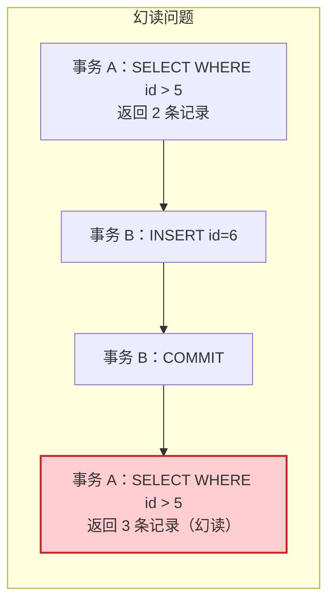

**解决方案**：InnoDB 通过 **Next-Key Lock（间隙锁）** 解决 RR 级别的幻读问题。

***

## 九、MVCC 实现总结

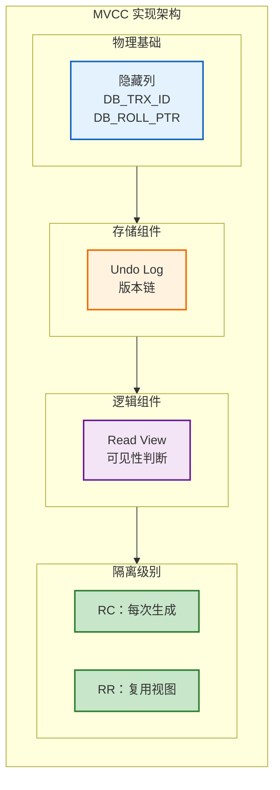

### 9.1 MVCC 三要素

| 要素            | 作用            |
| ------------- | ------------- |
| **隐藏列**       | 记录事务 ID 和回滚指针 |
| **Undo Log**  | 存储历史版本，形成版本链  |
| **Read View** | 判断版本可见性       |

### 9.2 核心流程

1. **写操作**：生成新版本，旧版本写入 undo log
2. **读操作**：根据 Read View 判断版本可见性
3. **版本遍历**：从最新版本开始，沿版本链找到可见版本

***

## 参考资料

- [MySQL 官方文档：InnoDB Multi-Versioning](https://dev.mysql.com/doc/refman/8.0/en/innodb-multi-versioning.html)
- [深入理解 MySQL MVCC：多版本并发控制完整版](http://m.toutiao.com/group/7582034789566284339/)
- [MySQL InnoDB 事务隔离与 MVCC、版本链与 ReadView 原理详解](http://m.toutiao.com/group/7578780736728089103/)
- [MySQL 总结--MVCC(read view 和 undo log)](https://blog.csdn.net/huangzhilin2015/article/details/115195777)

