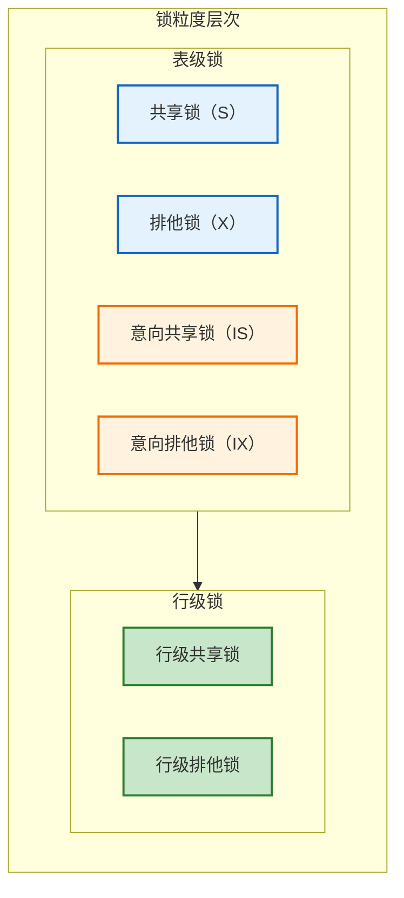
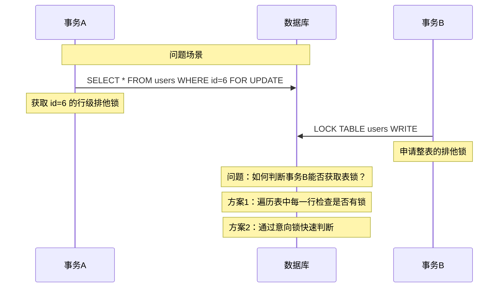
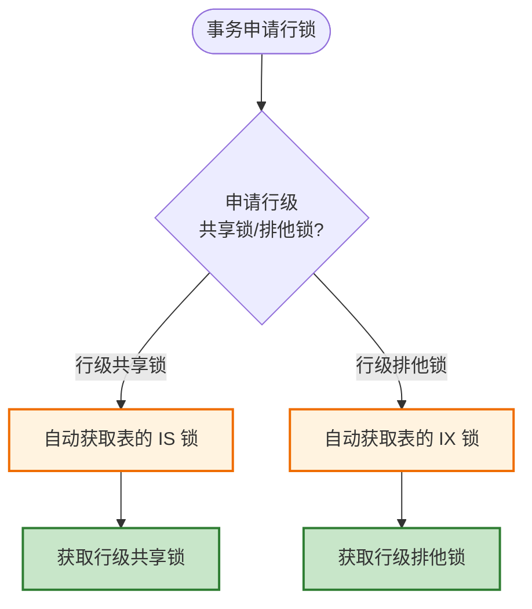
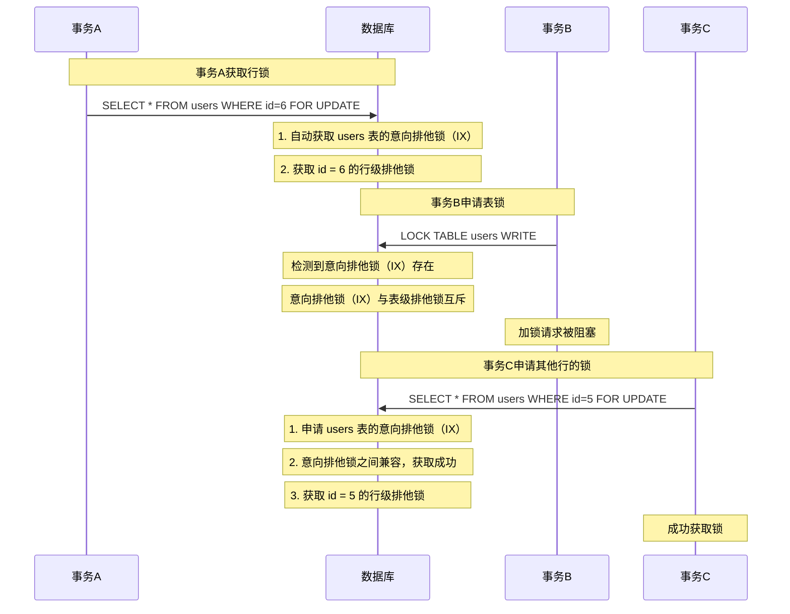
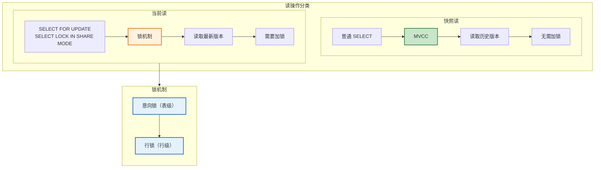
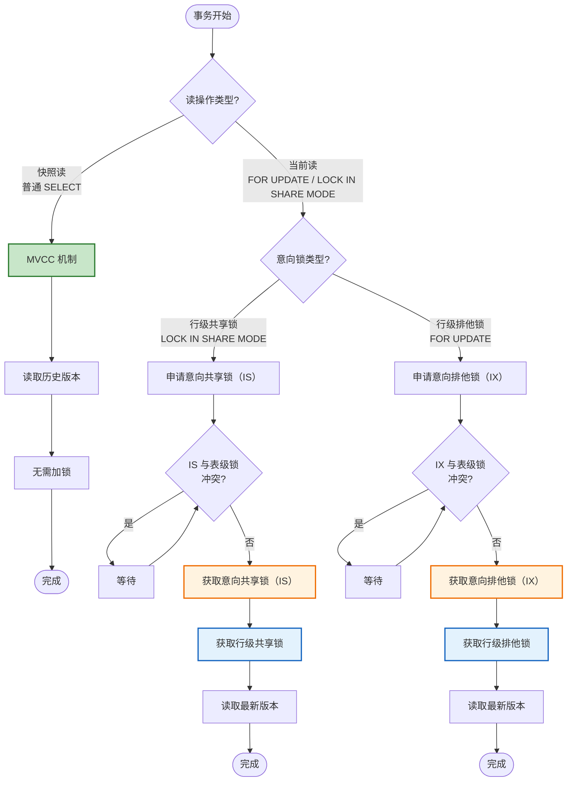
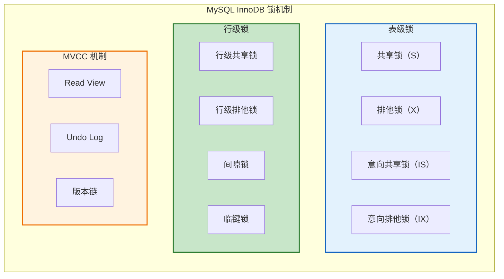

# MySQL 多粒度锁机制详解

## 概述

InnoDB 存储引擎支持**多粒度锁（Multiple Granularity Locking）**，允许行级锁与表级锁共存。这种机制使得数据库能够在不同粒度级别上进行并发控制，既保证了数据的一致性，又最大化了并发性能。



---

## 一、表锁与行锁

### 1.1 表锁

MySQL 自身提供的表级锁能力：

| 锁类型 | SQL 语法 | 作用 |
|--------|----------|------|
| **表级共享锁（S锁）** | `LOCK TABLE table_name READ` | 阻塞其他事务的写操作 |
| **表级排他锁（X锁）** | `LOCK TABLE table_name WRITE` | 阻塞其他事务的读和写操作 |

### 1.2 行锁

InnoDB 存储引擎提供的行级锁能力（MySQL 本身不提供行级锁）：

| 锁类型 | SQL 语法 | 作用 |
|--------|----------|------|
| **行级共享锁** | `SELECT ... LOCK IN SHARE MODE` | 阻塞其他事务对该行的写操作 |
| **行级排他锁** | `SELECT ... FOR UPDATE` | 阻塞其他事务对该行的读和写操作 |

### 1.3 表锁与行锁共存的问题



**问题分析**：

假设事务 A 获取了某一行的排他锁，事务 B 想要获取整张表的排他锁。数据库需要判断：

1. 当前没有其他事务持有该表的排他锁
2. 当前没有其他事务持有该表中**任意一行**的排他锁

**传统方案的缺陷**：为了检测条件 2，需要遍历表中的每一行，效率极其低下。

---

## 二、意向锁（Intention Lock）

### 2.1 意向锁的定义

> **意向锁是一个表级锁，其作用就是指明接下来的事务将会用到哪种锁。**

意向锁是 InnoDB 自动维护的，用户无法手动操作。在为数据行加共享/排他锁之前，InnoDB 会先获取该数据行所在表的对应意向锁。

### 2.2 意向锁的类型

| 意向锁类型 | 说明 | 触发场景 |
|------------|------|----------|
| **意向共享锁（IS）** | 事务有意向对表中的某些行加共享锁 | `SELECT ... LOCK IN SHARE MODE` |
| **意向排他锁（IX）** | 事务有意向对表中的某些行加排他锁 | `SELECT ... FOR UPDATE` |

### 2.3 意向锁的工作流程



### 2.4 意向锁的兼容性矩阵

#### 2.4.1 意向锁之间的兼容性

|  | 意向共享锁（IS） | 意向排他锁（IX） |
|--|----------------|----------------|
| **意向共享锁（IS）** | ✅ 兼容 | ✅ 兼容 |
| **意向排他锁（IX）** | ✅ 兼容 | ✅ 兼容 |

**关键点**：意向锁之间是**互相兼容**的。

#### 2.4.2 意向锁与表级锁的兼容性

|  | 意向共享锁（IS） | 意向排他锁（IX） |
|--|----------------|----------------|
| **表级共享锁（S）** | ✅ 兼容 | ❌ 互斥 |
| **表级排他锁（X）** | ❌ 互斥 | ❌ 互斥 |

> **重要**：意向锁不会与行级的共享/排他锁互斥！

---

## 三、意向锁如何解决问题

### 3.1 问题回顾

事务 A 获取了某一行的排他锁，事务 B 想要获取整张表的排他锁。

### 3.2 使用意向锁后的解决方案



### 3.3 完整示例

假设 users 表数据如下：

| id | name |
|----|------|
| 1 | ROADHOG |
| 2 | Reinhardt |
| 3 | Tracer |
| 4 | Genji |
| 5 | Hanzo |
| 6 | Mccree |

**执行流程**：

```sql
-- 事务 A：获取某一行的排他锁
SELECT * FROM users WHERE id = 6 FOR UPDATE;
-- 1. 自动获取 users 表的意向排他锁（IX）
-- 2. 获取 id=6 的行级排他锁（X）

-- 事务 B：尝试获取表锁
LOCK TABLE users READ;
-- 检测到 IX 锁存在，IX 与表级 S 锁互斥
-- 加锁请求被阻塞

-- 事务 C：获取另一行的排他锁
SELECT * FROM users WHERE id = 5 FOR UPDATE;
-- 1. 申请 users 表的 IX 锁
-- 2. IX 与 IX 兼容，获取成功
-- 3. 获取 id=5 的行级排他锁
-- 成功！
```

### 3.4 效率对比

| 方案 | 判断方式 | 效率 |
|------|----------|------|
| **无意向锁** | 遍历表中每一行检查是否有锁 | O(n)，效率极低 |
| **有意向锁** | 检查表上的意向锁 | O(1)，效率极高 |

---

## 四、多粒度锁与 MVCC 的关系

### 4.1 MVCC 概述

MVCC（Multi-Version Concurrency Control，多版本并发控制）是 InnoDB 实现高并发读写的核心机制。它通过保存数据的多个历史版本，让读操作不用阻塞写操作。

### 4.2 读操作的分类

| 读类型 | 说明 | 实现机制 | 是否涉及锁 |
|--------|------|----------|------------|
| **快照读** | 普通 SELECT | MVCC | 不加锁 |
| **当前读** | SELECT FOR UPDATE | 锁机制 | 加锁 |

### 4.3 MVCC 与锁机制的协作



### 4.4 MVCC 与意向锁的关系

| 维度 | MVCC | 意向锁 |
|------|------|--------|
| **目的** | 解决读写并发问题 | 解决表锁与行锁的协调问题 |
| **作用范围** | 行级数据版本 | 表级锁协调 |
| **触发场景** | 快照读（普通 SELECT） | 当前读（SELECT FOR UPDATE 等） |
| **是否互斥** | 快照读不与任何锁互斥 | 意向锁之间兼容，与表级锁有互斥关系 |

### 4.5 完整的并发控制流程



### 4.6 为什么需要两套机制？

| 场景 | MVCC | 锁机制（含意向锁） |
|------|------|-------------------|
| **普通查询** | ✅ 适用，无锁并发 | ❌ 不适用，会降低并发 |
| **精确更新** | ❌ 不适用，需要最新数据 | ✅ 适用，保证数据一致性 |
| **范围查询加锁** | ❌ 不适用 | ✅ 适用，配合 Next-Key Lock |
| **DDL 操作** | ❌ 不适用 | ✅ 适用，表级锁保护结构 |

**总结**：

- **MVCC**：优化读多写少场景，快照读无需加锁
- **意向锁**：优化表锁与行锁的协调，避免全表扫描
- **两者协作**：共同实现高并发、高一致性的数据库操作

---

## 五、总结

### 5.1 意向锁的核心价值

1. **效率提升**：将 O(n) 的行遍历检查优化为 O(1) 的表意向锁检查
2. **并发保证**：意向锁之间兼容，不影响不同行的并发操作
3. **协调机制**：实现表锁与行锁的和谐共存

### 5.2 关键要点

| 要点 | 说明 |
|------|------|
| **意向锁是表级锁** | 不会与行级锁冲突 |
| **意向锁之间兼容** | IS 与 IX 可以共存 |
| **意向锁与表级锁有互斥关系** | IX 与 S 互斥，IX 与 X 互斥 |
| **自动获取** | 无需手动操作，InnoDB 自动维护 |
| **与 MVCC 互补** | 快照读用 MVCC，当前读用锁机制 |

### 5.3 锁机制全景图



---

## 参考资料

- [详解 MySql InnoDB 中意向锁的作用 - 掘金](https://juejin.cn/post/6844903666332368909)
- [MySQL InnoDB 意向锁详解 - 51CTO](https://www.51cto.com/article/743293.html)
- [MySQL 官方文档：InnoDB Locking](https://dev.mysql.com/doc/refman/8.0/en/innodb-locking.html)
