# MySQL 三大日志详解：Binlog、Redo Log、Undo Log

## 一、概述

MySQL 的日志系统是数据库可靠性与一致性的基石。三大日志各司其职，共同保障事务的 ACID 特性。

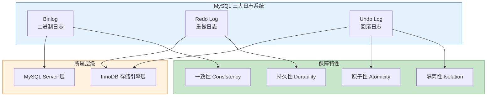

### 1.1 三大日志核心职责

| 日志类型 | 核心作用 | 保障特性 | 所属层级 |
|---------|---------|---------|---------|
| **Redo Log** | 崩溃恢复、持久化 | 持久性 (Durability) | InnoDB 存储引擎层 |
| **Undo Log** | 事务回滚、MVCC | 原子性、隔离性 | InnoDB 存储引擎层 |
| **Binlog** | 主从复制、数据备份 | 一致性 (Consistency) | MySQL Server 层 |

***

## 二、Redo Log（重做日志）

### 2.1 核心原理

Redo Log 是 InnoDB 存储引擎特有的物理日志，采用 **WAL（Write-Ahead Logging，预写日志）** 机制。

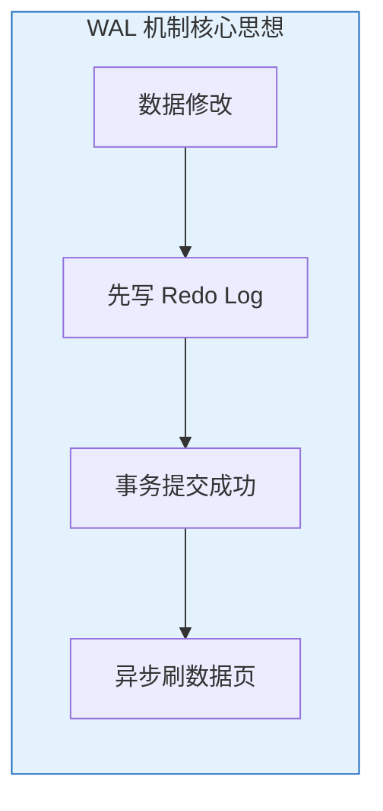

**WAL 核心思想**：先写日志，再写磁盘。当数据修改时，先将修改记录到 Redo Log，事务即可提交成功，数据页可以稍后异步刷盘。

**物理日志格式**：记录的是"在某个数据页上做了什么修改"，例如：
```
对表空间 X 的数据页 Y 的偏移量 Z 处写入数据 A
```

### 2.2 为什么需要 Redo Log？

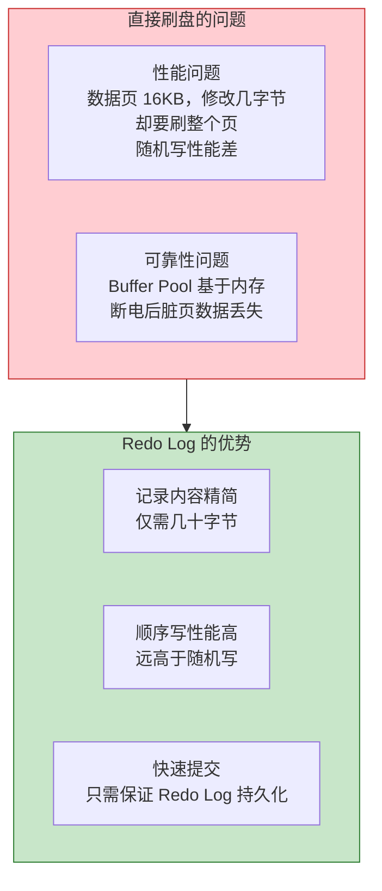

### 2.3 存储结构

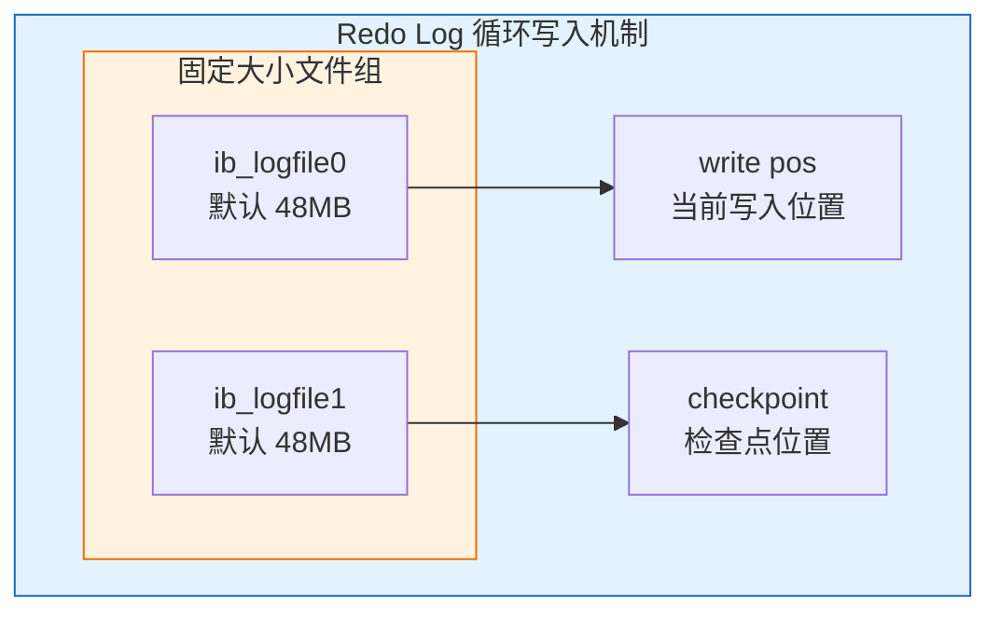

**存储特点**：
- 固定大小的循环文件（默认 `ib_logfile0` 和 `ib_logfile1`）
- 写满后从头开始覆盖，仅保留未刷盘的脏页日志
- `write pos` 记录当前写入位置，`checkpoint` 记录检查点位置

### 2.4 刷盘策略

由 `innodb_flush_log_at_trx_commit` 参数控制：

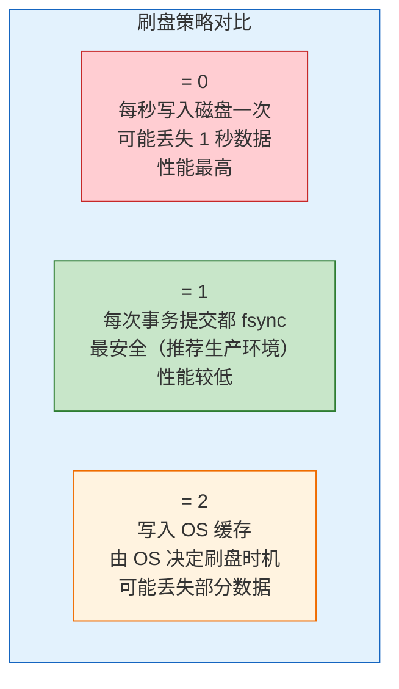

| 参数值 | 行为 | 安全性 | 性能 |
|-------|------|--------|------|
| **0** | 每秒写入磁盘一次 | 可能丢失 1 秒数据 | 最高 |
| **1** | 每次事务提交都 fsync | 最安全（推荐生产环境） | 较低 |
| **2** | 写入 OS 缓存，由 OS 决定刷盘 | 可能丢失部分数据 | 较高 |

### 2.5 Crash-Safe 机制

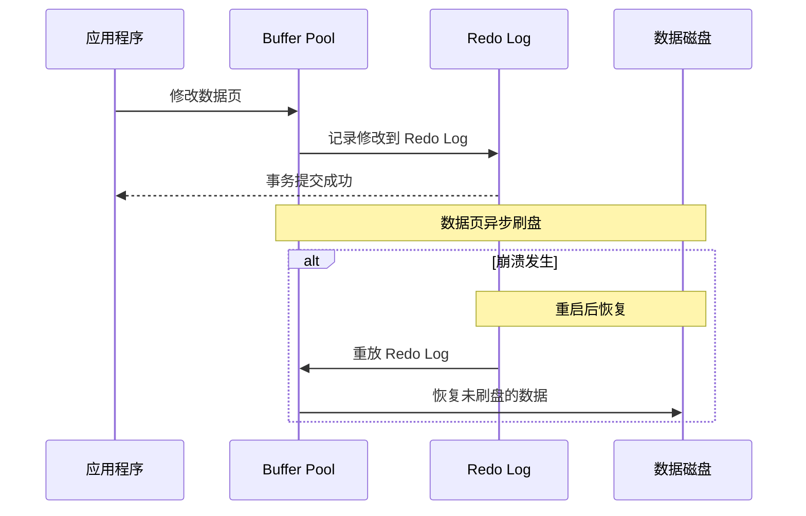

**崩溃恢复流程**：
1. MySQL 崩溃重启时，InnoDB 扫描 Redo Log
2. 已提交事务：重放（前滚）Redo Log，恢复未刷盘的数据修改
3. 未提交事务：结合 Undo Log 回滚

### 2.6 关键配置

```sql
SHOW VARIABLES LIKE 'innodb_log%';
```

| 参数 | 说明 | 建议值 |
|------|------|--------|
| `innodb_log_file_size` | 单个日志文件大小 | 256MB - 2GB |
| `innodb_log_files_in_group` | 日志文件数量 | 默认 2 |
| `innodb_flush_log_at_trx_commit` | 刷盘策略 | 1（生产环境） |

***

## 三、Undo Log（回滚日志）

### 3.1 核心原理

Undo Log 是**逻辑日志**，记录的是事务修改之前的数据状态，用于实现事务回滚和 MVCC。

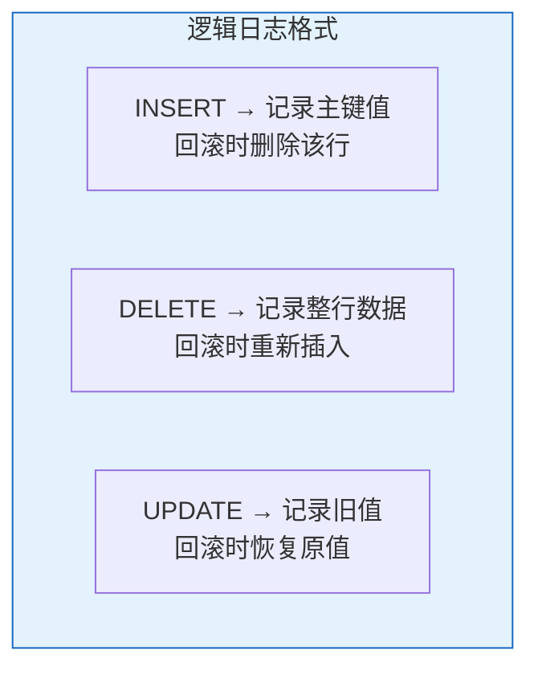

### 3.2 两大核心作用

#### 作用一：事务回滚（保证原子性）

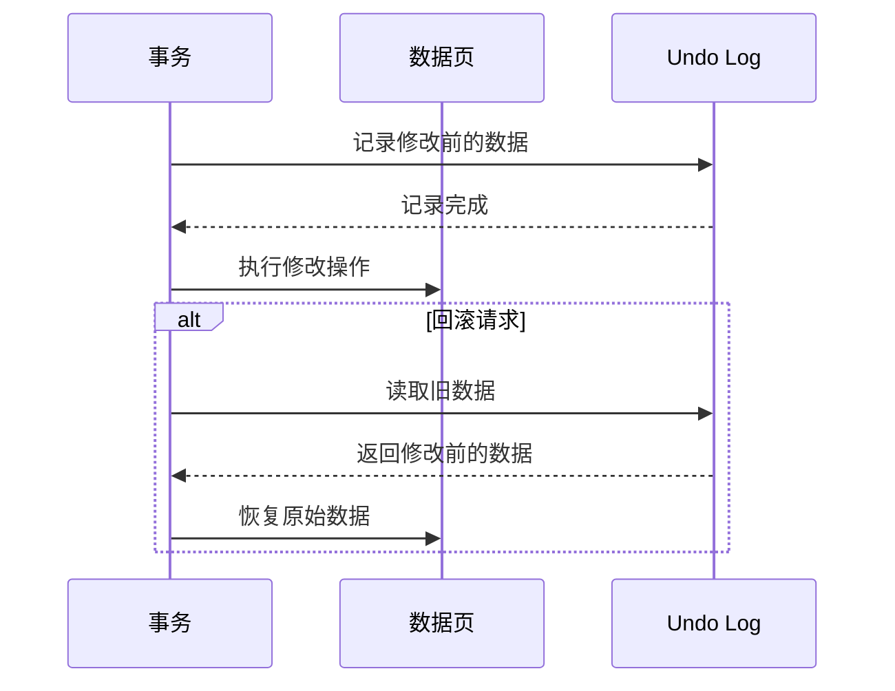

**执行流程示例**：
```sql
START TRANSACTION;
DELETE FROM products WHERE id = 10;
ROLLBACK;
```

1. 执行 DELETE 前，先将 id=10 的完整记录写入 Undo Log
2. 标记数据行为删除状态
3. 执行 ROLLBACK 时，根据 Undo Log 恢复原始数据

#### 作用二：MVCC（多版本并发控制）

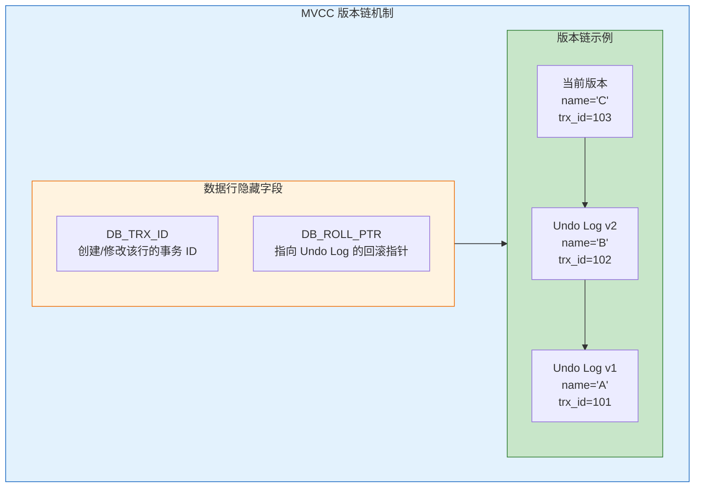

**MVCC 工作原理**：

| 隔离级别 | Read View 创建时机 | 行为 |
|---------|-------------------|------|
| **读已提交 (RC)** | 每次 SELECT 创建新的 Read View | 读取最新已提交版本 |
| **可重复读 (RR)** | 事务开始时创建 Read View 并复用 | 通过 Undo Log 版本链找到事务开始前的数据版本 |

### 3.3 生命周期与清理机制

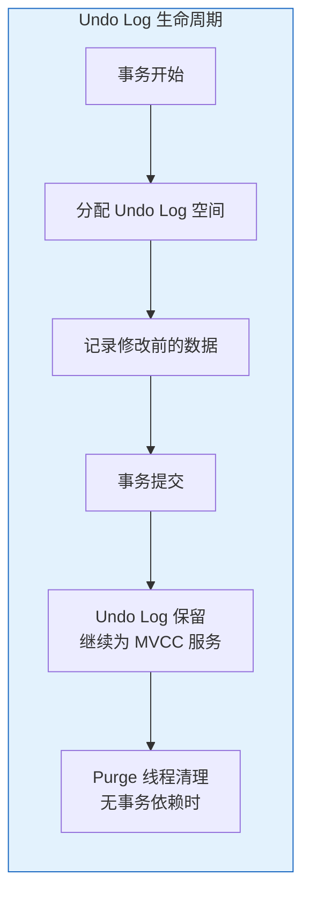

**清理机制**：
- 事务提交后，Undo Log 不会立即删除
- 需继续为 MVCC 服务（其他事务可能需要读取历史版本）
- Purge 线程定期检查不再被任何事务视图引用的 Undo Log 并回收

### 3.4 关键配置

```sql
SHOW VARIABLES LIKE 'innodb_undo%';
```

| 参数 | 说明 |
|------|------|
| `innodb_undo_tablespaces` | Undo 表空间数量 |
| `innodb_max_undo_log_size` | Undo 表空间最大值 |
| `innodb_undo_log_truncate` | 是否自动截断 |

***

## 四、Binlog（二进制日志）

### 4.1 核心原理

Binlog 是 MySQL Server 层实现的逻辑日志，记录所有引起数据变更的操作（DDL、DML），所有存储引擎都可使用。

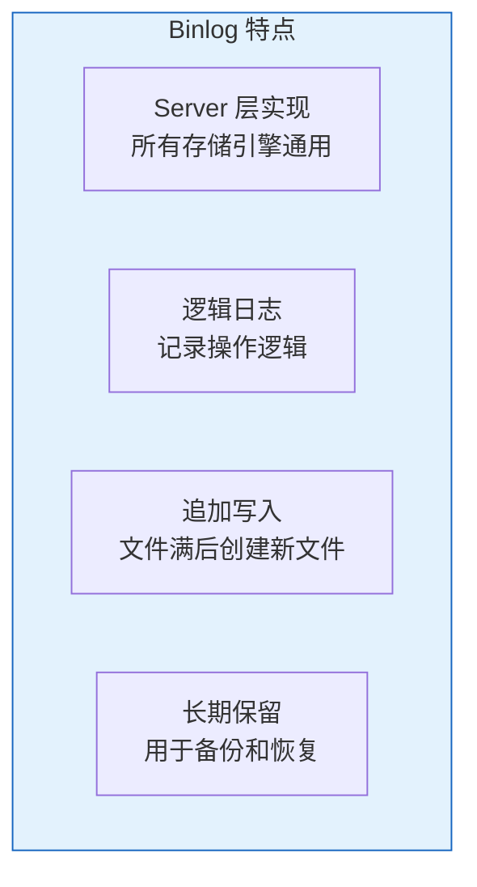

### 4.2 主要作用

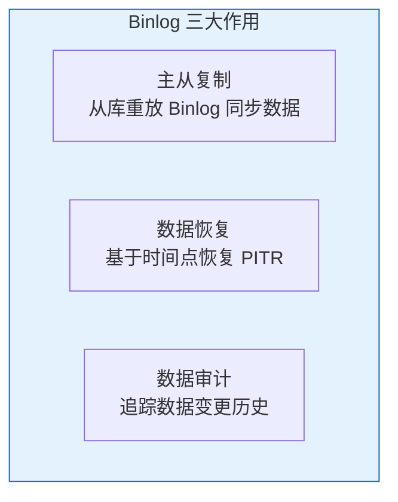

### 4.3 三种记录格式

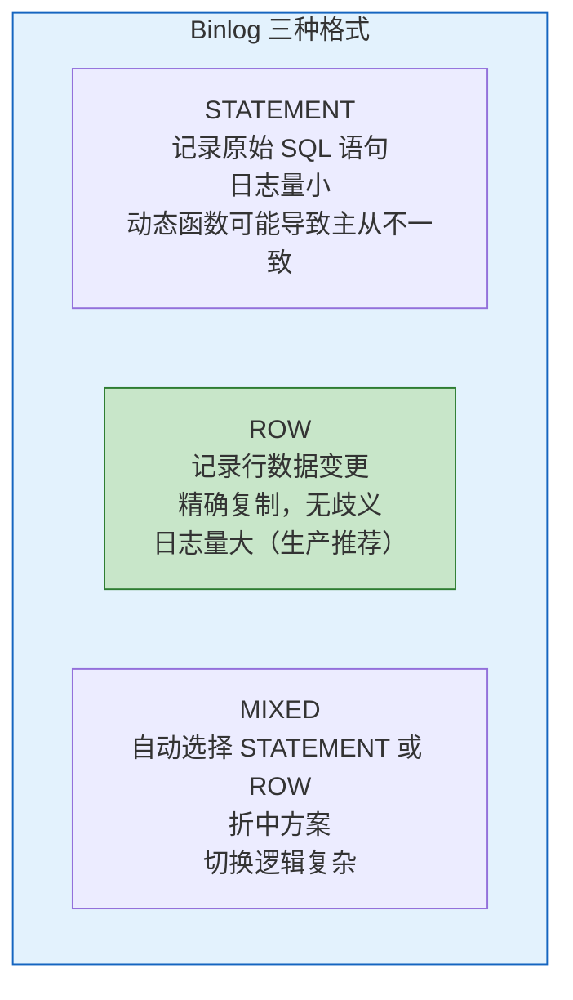

| 格式 | 记录内容 | 优点 | 缺点 | 适用场景 |
|------|---------|------|------|---------|
| **STATEMENT** | 原始 SQL 语句 | 日志量小 | 动态函数可能导致主从不一致 | 简单场景（已不推荐） |
| **ROW** | 行数据修改前后的值 | 精确复制，无歧义 | 日志量大 | 生产环境推荐 |
| **MIXED** | 自动选择 | 折中方案 | 切换逻辑复杂 | 过渡方案 |

### 4.4 主从复制工作流程

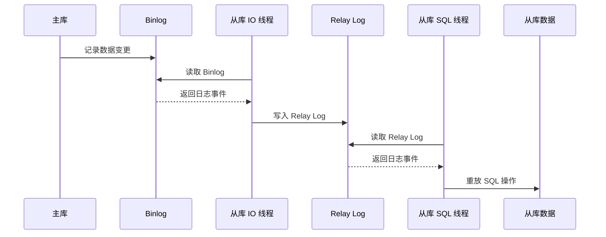

**复制流程详解**：

| 步骤 | 组件 | 操作 |
|------|------|------|
| 1 | 主库 | 将数据变更写入 Binlog |
| 2 | IO 线程 | 连接主库，读取 Binlog |
| 3 | IO 线程 | 将读取的日志写入本地 Relay Log |
| 4 | SQL 线程 | 读取 Relay Log，重放 SQL 操作 |
| 5 | 从库 | 数据与主库保持一致 |

### 4.5 刷盘策略

由 `sync_binlog` 参数控制：

| 参数值 | 行为 | 安全性 | 性能 |
|-------|------|--------|------|
| **0** | 由 OS 决定刷盘时机 | 可能丢失日志 | 最高 |
| **1** | 每次事务提交都刷盘 | 最安全（推荐） | 较低 |
| **N** | 每 N 个事务刷盘一次 | 可能丢失 N 个事务的日志 | 较高 |

### 4.6 关键配置

```sql
SHOW VARIABLES LIKE '%binlog%';
```

| 参数 | 说明 | 建议值 |
|------|------|--------|
| `binlog_format` | 日志格式 | ROW |
| `binlog_cache_size` | 事务缓存大小 | 根据事务大小调整 |
| `sync_binlog` | 刷盘策略 | 1（生产环境） |
| `expire_logs_days` | 日志过期天数 | 7-30 天 |

***

## 五、三大日志对比

### 5.1 核心差异对比

| 对比维度 | Redo Log | Undo Log | Binlog |
|---------|---------|---------|--------|
| **所属层级** | InnoDB 引擎层 | InnoDB 引擎层 | MySQL Server 层 |
| **日志类型** | 物理日志 | 逻辑日志（反向） | 逻辑日志 |
| **写入方式** | 循环写（固定大小） | 随机写（表空间） | 追加写 |
| **写入时机** | 事务执行中持续写 | 数据修改前写入 | 事务提交时一次性写入 |
| **核心用途** | 崩溃恢复、持久性 | 事务回滚、MVCC | 主从复制、数据备份 |
| **崩溃恢复角色** | 核心恢复角色 | 辅助恢复（回滚未提交事务） | 不参与崩溃恢复 |
| **生命周期** | 数据页刷盘后失效 | 提交后保留，Purge 清理 | 长期保留（按策略清理） |

### 5.2 一句话总结

| 日志 | 总结 |
|------|------|
| **Redo Log** | "崩溃恢复的救命稻草" |
| **Undo Log** | "后悔药的原料" |
| **Binlog** | "主从复制的信使" |

***

## 六、两阶段提交

### 6.1 为什么需要两阶段提交？

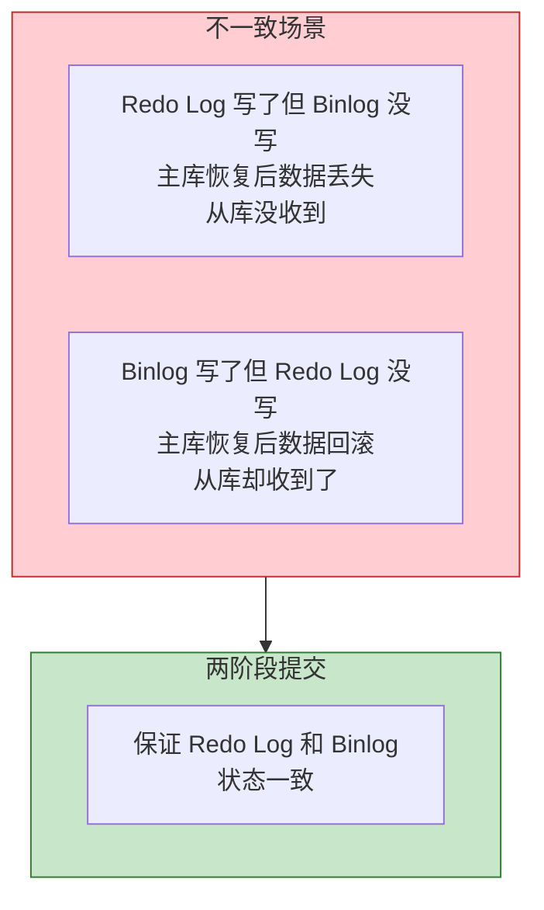

### 6.2 两阶段提交流程

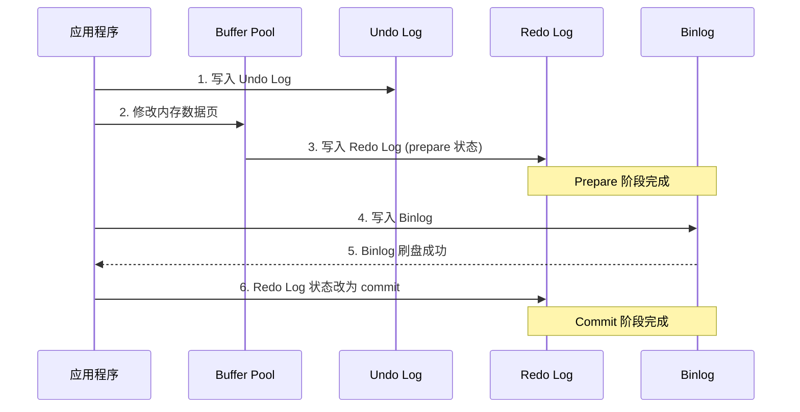

**两阶段提交步骤**：

| 阶段 | 步骤 | 操作 |
|------|------|------|
| **Prepare 阶段** | 1 | 写入 Undo Log |
| | 2 | 修改内存数据页 |
| | 3 | 写入 Redo Log，标记为 prepare 状态 |
| **Commit 阶段** | 4 | 写入 Binlog |
| | 5 | Binlog 刷盘 |
| | 6 | Redo Log 状态改为 commit |

### 6.3 崩溃恢复逻辑

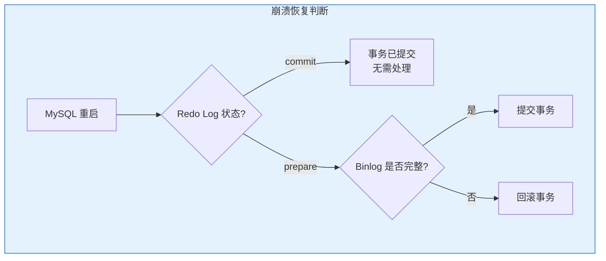

**恢复规则**：
- Redo Log 处于 commit 状态：事务已提交，无需处理
- Redo Log 处于 prepare 状态：
  - Binlog 完整：提交事务
  - Binlog 不完整：回滚事务

***

## 七、数据更新时的日志协作流程

以 `UPDATE user SET name='test' WHERE id=1` 为例：

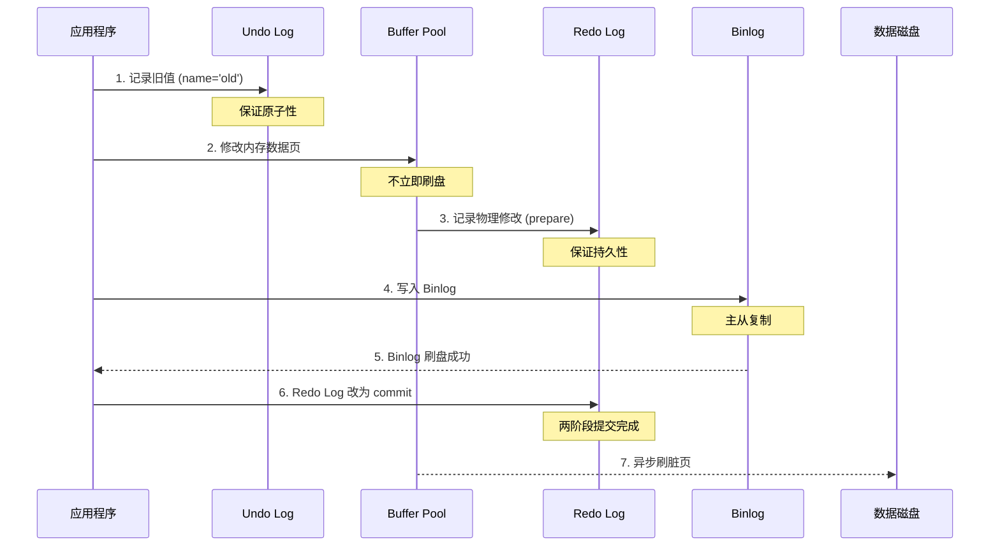

**写入顺序原则**：
- Undo Log "先于修改"
- Redo Log "伴随修改"
- Binlog "最后确认"

***

## 八、实际应用场景

### 8.1 故障恢复场景

| 场景 | 恢复方式 | 涉及日志 |
|------|---------|---------|
| **数据库崩溃** | Redo Log 恢复已提交数据 + Undo Log 回滚未提交事务 | Redo Log + Undo Log |
| **数据误删** | 全量备份 + Binlog 增量回放 | Binlog |
| **主从切换** | 从库提升为主库，继续提供服务 | Binlog |

### 8.2 性能优化建议

| 日志 | 优化建议 |
|------|---------|
| **Redo Log** | 合理设置 `innodb_log_file_size`（建议 256MB-2GB），避免频繁切换 |
| **Undo Log** | 开启独立 Undo 表空间，减少表空间碎片 |
| **Binlog** | 选择 ROW 格式，避免 STATEMENT 格式的复制一致性问题 |

### 8.3 生产环境推荐配置

```ini
[mysqld]
innodb_flush_log_at_trx_commit = 1
sync_binlog = 1
binlog_format = ROW
innodb_log_file_size = 512M
innodb_log_files_in_group = 2
```

**双 1 配置**：`innodb_flush_log_at_trx_commit=1` + `sync_binlog=1`，确保数据安全。

***

## 九、面试高频问题

| 问题 | 答案要点 |
|------|---------|
| **三大日志区别** | Redo Log 保证持久性，Undo Log 保证原子性，Binlog 用于主从复制 |
| **为什么 Redo Log 比 Binlog 快** | Redo Log 是顺序写，Binlog 需要事务提交时才写入 |
| **两阶段提交的意义** | 保证 Redo Log 和 Binlog 状态一致，避免主从数据不一致 |
| **Crash-Safe 如何实现** | Redo Log 恢复已提交事务，Undo Log 回滚未提交事务 |
| **MVCC 如何实现** | 通过 Undo Log 版本链 + Read View 实现多版本读 |

***

## 参考资料

- [MySQL 三大日志系统深度解析：Binlog、Redo Log、Undo Log](https://blog.csdn.net/m0_51000788/article/details/159350731)
- [MySQL三大核心日志深度解析](https://blog.csdn.net/gaosw0521/article/details/157803824)
- [MySQL三大日志详解：Undo Log、Redo Log和Binlog的作用与工作机制](https://blog.csdn.net/nihao2q/article/details/146899875)
- [腾讯二面：binlog、redolog 和 undolog 三大日志的区别？](http://m.toutiao.com/group/7621905756955001344/)
