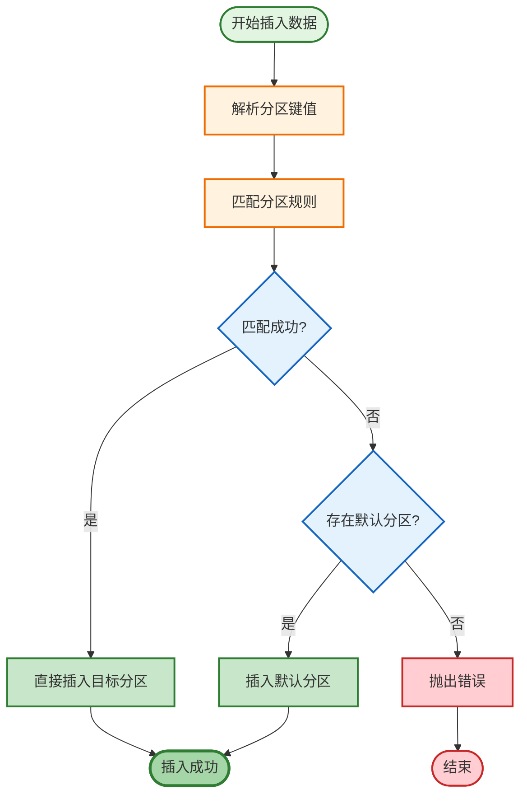
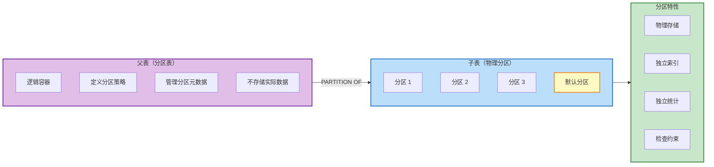
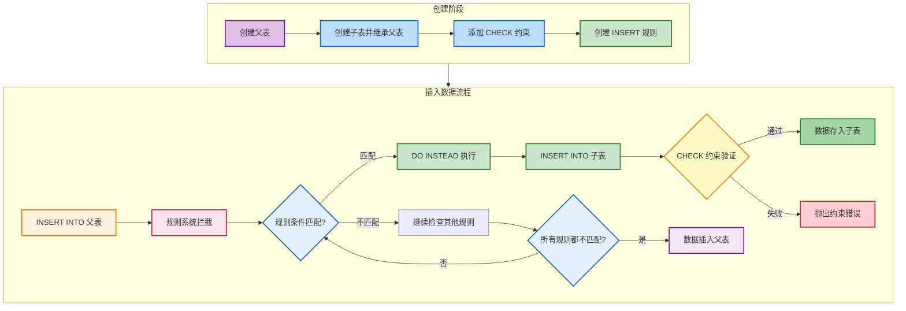
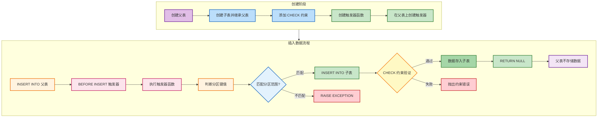
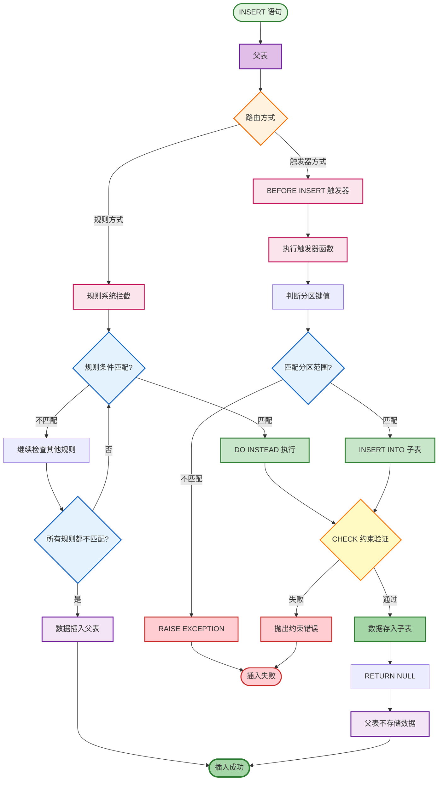
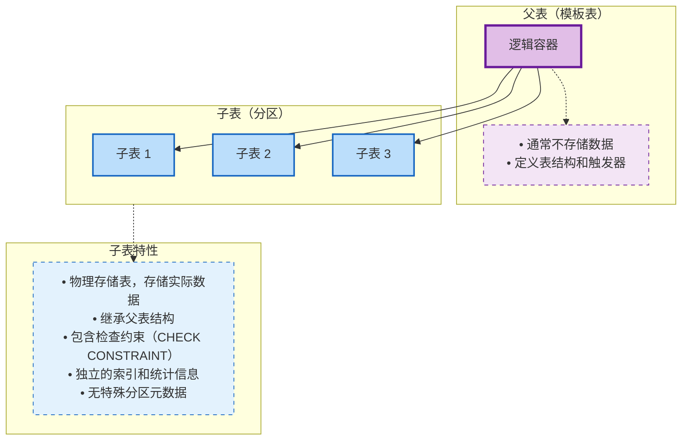

# PostgreSQL 分区表最佳实践与底层原理

## 概述

PostgreSQL 提供两种主要的表分区实现方式：**声明式分区表**和**继承式分区表**。本文深入探讨这两种分区方式的底层原理、最佳实践及适用场景。

### 分区表的核心价值

| 价值 | 说明 |
|------|------|
| **查询性能** | 减少扫描范围，提高查询速度 |
| **维护效率** | 分区独立维护，减少 VACUUM 压力 |
| **数据管理** | 按时间或其他维度管理数据生命周期 |
| **存储优化** | 不同分区可使用不同存储参数 |

---

## 一、声明式分区表（Declarative Partitioning）

### 1.1 基本概念

声明式分区表是 PostgreSQL 10 引入的官方推荐分区方式，通过 `PARTITION BY` 子句直接定义分区策略。

**默认分区**：PostgreSQL 11+ 支持创建默认分区，用于存储不匹配任何分区规则的数据。

### 1.2 分区类型

| 分区类型 | 关键字 | 适用场景 |
|----------|--------|----------|
| **范围分区** | `RANGE` | 时间、连续数值 |
| **列表分区** | `LIST` | 枚举值、分类数据 |
| **哈希分区** | `HASH` | 均匀分布数据 |

#### 1.2.1 范围分区

**描述**：根据分区键的范围值进行分区，适用于时间序列数据、连续数值等场景。

**SQL 示例**：

```sql
-- 创建分区表
CREATE TABLE measurement (
    city_id         int not null,
    logdate         date not null,
    peaktemp        int,
    unitsales       int
) PARTITION BY RANGE (logdate);

-- 创建分区
CREATE TABLE measurement_y2024m01 PARTITION OF measurement
    FOR VALUES FROM ('2024-01-01') TO ('2024-02-01');

CREATE TABLE measurement_y2024m02 PARTITION OF measurement
    FOR VALUES FROM ('2024-02-01') TO ('2024-03-01');

-- 创建默认分区（PostgreSQL 11+）
CREATE TABLE measurement_default PARTITION OF measurement
    DEFAULT;
```

**限制**：
- 范围分区的分区键值必须是连续的，不能重叠
- 范围分区支持默认分区（PostgreSQL 11+），默认分区只能有一个

#### 1.2.2 列表分区

**描述**：根据分区键的离散值进行分区，适用于枚举值、分类数据等场景。

**SQL 示例**：

```sql
CREATE TABLE sales (
    sale_id     serial primary key,
    region      text not null,
    amount      numeric
) PARTITION BY LIST (region);

CREATE TABLE sales_north PARTITION OF sales
    FOR VALUES IN ('north', 'northeast');

CREATE TABLE sales_south PARTITION OF sales
    FOR VALUES IN ('south', 'southeast');

-- 创建默认分区（PostgreSQL 11+）
CREATE TABLE sales_default PARTITION OF sales
    DEFAULT;
```

**限制**：
- 列表分区的分区键值必须是离散的，不能重复
- 列表分区支持默认分区（PostgreSQL 11+），默认分区只能有一个

#### 1.2.3 哈希分区

**描述**：根据分区键的哈希值进行分区，适用于需要均匀分布数据的场景。

**SQL 示例**：

```sql
CREATE TABLE users (
    user_id     bigint primary key,
    name        text,
    email       text
) PARTITION BY HASH (user_id);

-- 创建完整的 4 个分区
CREATE TABLE users_p0 PARTITION OF users
    FOR VALUES WITH (MODULUS 4, REMAINDER 0);

CREATE TABLE users_p1 PARTITION OF users
    FOR VALUES WITH (MODULUS 4, REMAINDER 1);

CREATE TABLE users_p2 PARTITION OF users
    FOR VALUES WITH (MODULUS 4, REMAINDER 2);

CREATE TABLE users_p3 PARTITION OF users
    FOR VALUES WITH (MODULUS 4, REMAINDER 3);

-- 创建默认分区（PostgreSQL 11+）
CREATE TABLE users_default PARTITION OF users
    DEFAULT;
```

**限制**：
- 哈希分区的分区键值会被哈希算法处理，无法直观了解数据分布
- 哈希分区支持默认分区（PostgreSQL 11+），默认分区只能有一个
- 哈希分区的 MODULUS 值决定了分区数量，REMAINDER 值必须在 0 到 MODULUS-1 之间

### 1.3 底层原理

#### 1.3.1 数据路由机制



#### 1.4.2 分区裁剪（Partition Pruning）

**分区裁剪**是声明式分区表的核心性能优化机制：

| 阶段 | 操作 | 说明 |
|------|------|------|
| **解析阶段** | 分析 WHERE 条件 | 提取分区键相关条件 |
| **规划阶段** | 计算需要扫描的分区 | 排除不包含数据的分区 |
| **执行阶段** | 只扫描必要分区 | 避免全表扫描 |

#### 1.3.3 存储结构



### 1.5 最佳实践

#### 1.5.1 分区键选择

| 考虑因素 | 建议 |
|----------|------|
| **查询模式** | 选择频繁用于 WHERE 条件的列 |
| **数据分布** | 选择分布均匀的列 |
| **写入模式** | 考虑写入热点，避免热点分区 |
| **数据生命周期** | 时间列适合按时间管理数据 |

#### 1.5.2 分区管理

| 操作 | 建议 |
|------|------|
| **创建分区** | 提前创建，避免运行时创建 |
| **删除分区** | 使用 `DROP TABLE` 快速删除 |
| **附加分区** | 使用 `ATTACH PARTITION` 在线添加 |
| **分离分区** | 使用 `DETACH PARTITION` 在线移除 |

#### 1.5.3 索引策略

| 索引类型 | 建议 |
|----------|------|
| **主键** | 包含分区键，确保全局唯一性 |
| **唯一索引** | 包含分区键 |
| **本地索引** | 每个分区独立索引，维护成本低 |
| **全局索引** | PostgreSQL 13+ 支持，跨分区唯一性 |

#### 1.5.4 性能优化

```sql
-- 启用分区裁剪
SET enable_partition_pruning = on;

-- 收集统计信息
ANALYZE measurement;

-- 合理设置分区大小
-- 每个分区建议 10-50GB

-- 避免跨分区查询
-- 尽量在 WHERE 条件中包含分区键
```

---

## 二、继承式分区表（Inheritance Partitioning）

### 2.1 基本概念

继承式分区表是 PostgreSQL 传统的分区实现方式，基于表继承机制，结合触发器或规则实现数据路由。

**实现原理**：
1. 创建父表（模板表）
2. 创建子表（分区），继承父表
3. 添加检查约束（CHECK CONSTRAINT）
4. 创建触发器或规则，实现数据路由
5. 可选：创建约束排除（Constraint Exclusion）

### 2.2 分区类型

#### 2.2.1 基于规则分区

**描述**：使用 PostgreSQL 的规则系统实现数据路由，适用于简单的分区逻辑。

**工作流程**：



**SQL 示例**：

```sql
-- 1. 创建父表
CREATE TABLE measurement (
    city_id         int not null,
    logdate         date not null,
    peaktemp        int,
    unitsales       int
);

-- 2. 创建子表（分区）
CREATE TABLE measurement_y2024m01 (
    CHECK (logdate >= DATE '2024-01-01' AND logdate < DATE '2024-02-01')
) INHERITS (measurement);

CREATE TABLE measurement_y2024m02 (
    CHECK (logdate >= DATE '2024-02-01' AND logdate < DATE '2024-03-01')
) INHERITS (measurement);

-- 3. 创建规则
CREATE RULE measurement_insert_y2024m01 AS
    ON INSERT TO measurement
    WHERE (logdate >= DATE '2024-01-01' AND logdate < DATE '2024-02-01')
    DO INSTEAD INSERT INTO measurement_y2024m01 VALUES (NEW.*);

CREATE RULE measurement_insert_y2024m02 AS
    ON INSERT TO measurement
    WHERE (logdate >= DATE '2024-02-01' AND logdate < DATE '2024-03-01')
    DO INSTEAD INSERT INTO measurement_y2024m02 VALUES (NEW.*);

-- 4. 启用约束排除
SET constraint_exclusion = partition;
```

#### 2.2.2 基于触发器分区

**描述**：使用 PostgreSQL 的触发器系统实现数据路由，适用于复杂的分区逻辑。

**工作流程**：



**SQL 示例**：

```sql
-- 1. 创建父表
CREATE TABLE measurement (
    city_id         int not null,
    logdate         date not null,
    peaktemp        int,
    unitsales       int
);

-- 2. 创建子表（分区）
CREATE TABLE measurement_y2024m01 (
    CHECK (logdate >= DATE '2024-01-01' AND logdate < DATE '2024-02-01')
) INHERITS (measurement);

CREATE TABLE measurement_y2024m02 (
    CHECK (logdate >= DATE '2024-02-01' AND logdate < DATE '2024-03-01')
) INHERITS (measurement);

-- 3. 创建触发器函数
CREATE OR REPLACE FUNCTION measurement_insert_trigger()
RETURNS TRIGGER AS $$
BEGIN
    IF (NEW.logdate >= DATE '2024-01-01' AND NEW.logdate < DATE '2024-02-01') THEN
        INSERT INTO measurement_y2024m01 VALUES (NEW.*);
    ELSIF (NEW.logdate >= DATE '2024-02-01' AND NEW.logdate < DATE '2024-03-01') THEN
        INSERT INTO measurement_y2024m02 VALUES (NEW.*);
    ELSE
        RAISE EXCEPTION 'Date out of range. Fix the measurement_insert_trigger() function!';
    END IF;
    RETURN NULL;
END;
$$ LANGUAGE plpgsql;

-- 4. 创建触发器
CREATE TRIGGER insert_measurement_trigger
    BEFORE INSERT ON measurement
    FOR EACH ROW EXECUTE FUNCTION measurement_insert_trigger();

-- 5. 启用约束排除
SET constraint_exclusion = partition;
```

#### 2.2.3 两种分区类型对比

| 特性 | 基于规则分区 | 基于触发器分区 |
|------|--------------|----------------|
| **实现复杂度** | 简单，SQL 语句直接定义 | 复杂，需要编写函数 |
| **性能** | 较低，规则解析开销 | 较高，直接执行函数 |
| **灵活性** | 有限，只能处理简单逻辑 | 灵活，支持复杂逻辑 |
| **维护性** | 简单，易于理解 | 复杂，需要维护函数 |
| **适用场景** | 简单的分区逻辑 | 复杂的分区逻辑 |

### 2.3 底层原理

#### 2.3.1 数据路由机制

继承式分区表的数据路由通过触发器或规则实现，将插入父表的数据重定向到对应的子表。



#### 2.3.2 约束排除（Constraint Exclusion）

**约束排除**是继承式分区表的查询优化机制：

| 配置值 | 说明 |
|--------|------|
| `on` | 对所有表启用约束排除 |
| `partition` | 仅对继承表启用约束排除 |
| `off` | 禁用约束排除 |

#### 2.3.3 存储结构



### 2.4 最佳实践

#### 2.4.1 实现注意事项

| 注意事项 | 建议 |
|----------|------|
| **触发器性能** | 使用 `FOR EACH ROW` 触发器，注意性能影响 |
| **约束排除** | 设置 `constraint_exclusion = partition` |
| **索引维护** | 每个子表单独创建索引 |
| **数据一致性** | 确保触发器逻辑覆盖所有分区范围 |

#### 2.4.2 适用场景

| 场景 | 说明 |
|------|------|
| **复杂分区逻辑** | 声明式分区无法满足的复杂路由规则 |
| **特殊存储需求** | 不同分区需要不同的存储参数 |
| **PostgreSQL 9.x** | 旧版本无法使用声明式分区 |
| **混合分区策略** | 多种分区策略的混合使用 |

---

## 三、两种分区方式对比

### 3.1 功能对比

| 特性 | 声明式分区 | 继承式分区 |
|------|------------|------------|
| **语法简洁性** | ✅ 简洁，原生支持 | ❌ 复杂，需手动实现 |
| **数据路由** | ✅ 自动路由 | ❌ 需触发器/规则 |
| **分区裁剪** | ✅ 自动优化 | ⚠️ 依赖约束排除 |
| **默认分区** | ✅ 支持（PostgreSQL 11+） | ❌ 需手动实现 |
| **在线管理** | ✅ `ATTACH/DETACH` 支持 | ❌ 需手动操作 |
| **全局索引** | ✅ 支持（PostgreSQL 13+） | ❌ 不支持 |
| **跨分区唯一性** | ✅ 支持（PostgreSQL 15+） | ❌ 不支持 |

### 3.2 性能对比

| 性能维度 | 声明式分区 | 继承式分区 |
|----------|------------|------------|
| **插入性能** | ✅ 更快，直接路由 | ❌ 较慢，触发器开销 |
| **查询性能** | ✅ 更好的分区裁剪 | ⚠️ 依赖约束排除 |
| **维护性能** | ✅ 更简单的管理 | ❌ 复杂的触发器维护 |
| **元数据开销** | ✅ 更低 | ❌ 更高 |
| **扩展性能** | ✅ 更好的并行处理 | ⚠️ 有限制 |

### 3.3 适用场景对比

| 场景 | 推荐方式 | 原因 |
|------|----------|------|
| **时间序列数据** | 声明式分区 | 自动路由，管理简单 |
| **日志数据** | 声明式分区 | 按时间分区，易于管理 |
| **用户数据** | 声明式哈希分区 | 均匀分布，性能稳定 |
| **复杂路由逻辑** | 继承式分区 | 触发器支持复杂逻辑 |
| **特殊存储需求** | 继承式分区 | 子表可自定义存储参数 |
| **PostgreSQL 10+** | 声明式分区 | 原生支持，性能更好 |
| **PostgreSQL 9.x** | 继承式分区 | 唯一选择 |

---

## 四、性能优化策略

### 4.1 分区键优化

| 优化方向 | 建议 |
|----------|------|
| **选择合适的分区键** | 频繁用于查询条件的列 |
| **避免热点分区** | 时间分区注意写入热点 |
| **均匀分布** | 哈希分区用于均匀分布数据 |
| **复合分区键** | 考虑多列组合分区 |

### 4.2 索引优化

| 优化策略 | 说明 |
|----------|------|
| **本地索引** | 每个分区独立索引，维护成本低 |
| **分区键包含** | 索引包含分区键，提高查询性能 |
| **部分索引** | 针对特定分区创建索引 |
| **全局索引** | PostgreSQL 13+ 支持跨分区唯一性 |

### 4.3 查询优化

| 优化技巧 | 说明 |
|----------|------|
| **包含分区键** | WHERE 条件中包含分区键 |
| **避免全分区扫描** | 限制查询范围 |
| **使用参数化查询** | 帮助查询规划器进行分区裁剪 |
| **收集统计信息** | 定期 ANALYZE 保持统计信息准确 |

### 4.4 维护优化

| 维护策略 | 说明 |
|----------|------|
| **定期 VACUUM** | 针对各分区单独 VACUUM |
| **分区管理** | 自动化创建/删除分区 |
| **监控分区大小** | 避免分区过大 |
| **备份策略** | 针对热分区更频繁备份 |

---

## 五、常见问题与解决方案

### 5.1 分区表常见问题

| 问题 | 原因 | 解决方案 |
|------|------|----------|
| **插入性能下降** | 触发器开销（继承式） | 切换到声明式分区 |
| **查询性能差** | 分区裁剪失效 | 确保 WHERE 条件包含分区键 |
| **管理复杂度高** | 手动维护分区 | 使用声明式分区，自动化管理 |
| **跨分区查询慢** | 全表扫描 | 优化查询条件，添加适当索引 |
| **存储空间浪费** | 分区过多 | 合理规划分区粒度 |

### 5.2 解决方案示例

#### 自动化分区管理

```sql
-- 创建分区管理函数
CREATE OR REPLACE FUNCTION create_measurement_partition(p_year int, p_month int)
RETURNS void AS $$
DECLARE
    partition_name text;
    start_date date;
    end_date date;
BEGIN
    partition_name := 'measurement_y' || lpad(p_year::text, 4, '0') || 'm' || lpad(p_month::text, 2, '0');
    start_date := to_date(p_year || '-' || p_month || '-01', 'YYYY-MM-DD');
    end_date := start_date + interval '1 month';
    
    EXECUTE format('CREATE TABLE IF NOT EXISTS %I PARTITION OF measurement
        FOR VALUES FROM (%L) TO (%L)',
        partition_name, start_date, end_date);
END;
$$ LANGUAGE plpgsql;

-- 调用示例
SELECT create_measurement_partition(2024, 3);
```

#### 分区裁剪优化

```sql
-- 确保分区裁剪生效
EXPLAIN ANALYZE SELECT * FROM measurement
WHERE logdate >= '2024-01-01' AND logdate < '2024-02-01';

-- 检查执行计划中的分区裁剪信息
-- 应显示只扫描 measurement_y2024m01 分区
```

---

## 六、适用场景指南

### 6.1 声明式分区适用场景

| 场景 | 推荐分区类型 | 原因 |
|------|--------------|------|
| **时间序列数据** | RANGE | 按时间管理，易于归档 |
| **用户数据** | HASH | 均匀分布，避免热点 |
| **地理位置数据** | LIST | 按地区分类 |
| **订单数据** | RANGE | 按时间或订单号分区 |
| **日志数据** | RANGE | 按时间分区，便于清理 |

### 6.2 继承式分区适用场景

| 场景 | 原因 |
|------|------|
| **复杂业务规则** | 触发器支持复杂路由逻辑 |
| **特殊存储需求** | 子表可使用不同存储参数 |
| **PostgreSQL 9.x** | 旧版本唯一选择 |
| **混合分区策略** | 可组合多种分区逻辑 |
| **向后兼容** | 已有系统迁移 |

---

## 七、总结

### 7.1 选择建议

| 版本 | 推荐方式 | 原因 |
|------|----------|------|
| **PostgreSQL 10+** | 声明式分区 | 原生支持，性能更好，管理简单 |
| **PostgreSQL 9.x** | 继承式分区 | 唯一选择，需手动实现 |
| **复杂路由逻辑** | 继承式分区 | 触发器支持复杂业务规则 |
| **标准场景** | 声明式分区 | 开箱即用，维护成本低 |

### 7.2 最佳实践总结

| 实践 | 建议 |
|------|------|
| **分区键选择** | 频繁用于查询的列，分布均匀 |
| **分区粒度** | 每个分区 10-50GB，避免过大或过小 |
| **索引策略** | 本地索引 + 分区键包含 |
| **查询优化** | WHERE 条件包含分区键 |
| **维护管理** | 自动化分区管理，定期 VACUUM |
| **性能监控** | 监控分区裁剪效果，调整查询计划 |

### 7.3 未来趋势

PostgreSQL 对分区表的支持持续增强：

- **PostgreSQL 10**：引入声明式分区
- **PostgreSQL 11**：支持哈希分区和默认分区
- **PostgreSQL 12**：增强分区表性能
- **PostgreSQL 13**：支持全局索引
- **PostgreSQL 14**：增强分区表并行处理
- **PostgreSQL 15**：支持跨分区唯一性约束

---

## 参考资料

- [PostgreSQL 官方文档：Partitioning](https://www.postgresql.org/docs/current/ddl-partitioning.html)
- [PostgreSQL 分区表升级：从基于触发器到声明式](https://blog.csdn.net/international24/article/details/107022793)
- [PostgreSQL 分区表详解及操作指南](https://blog.csdn.net/rone321/article/details/108381815)
- [PostgreSQL 动态分区裁剪技术：查询性能优化的深度解析](https://blog.csdn.net/kkiron/article/details/143947380)
- [PostgreSQL 表继承分表和分区表性能区别](https://blog.51cto.com/u_16213710/12904731)
