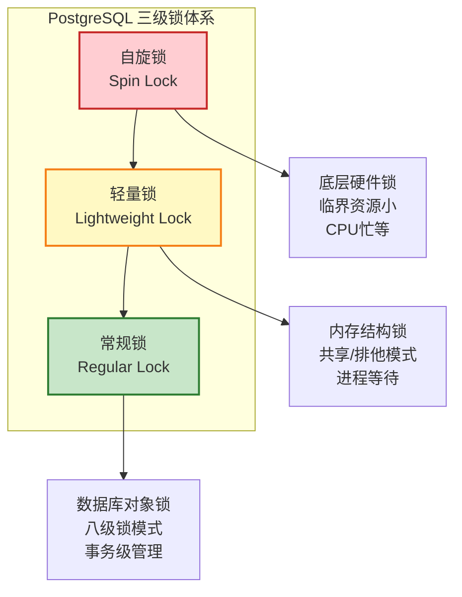
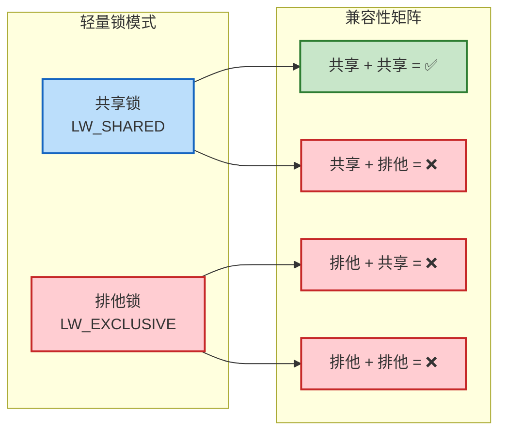
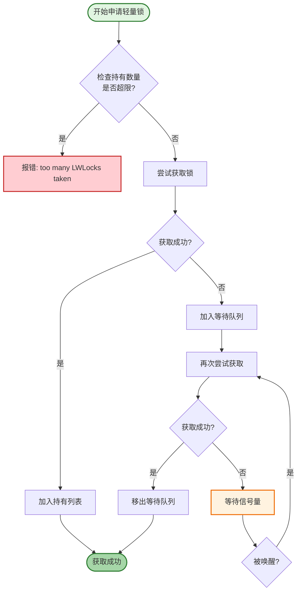
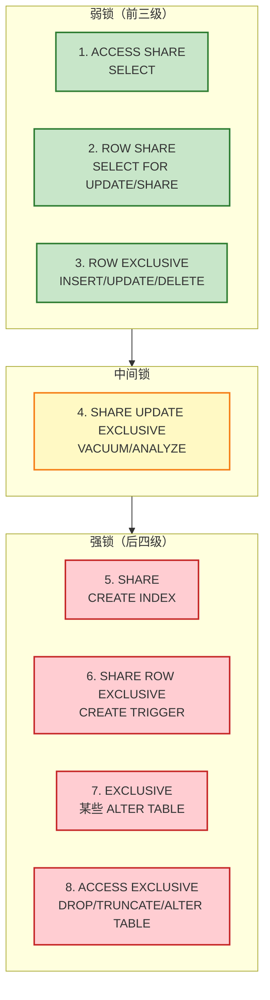
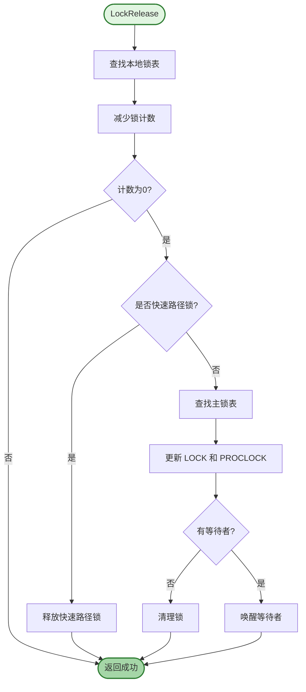
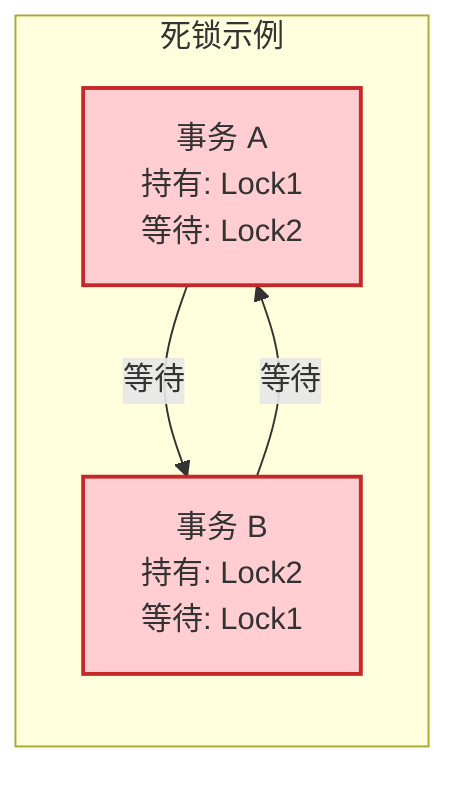
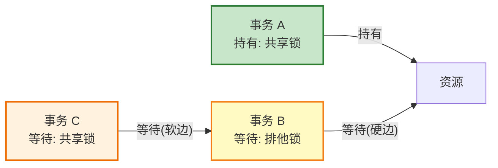
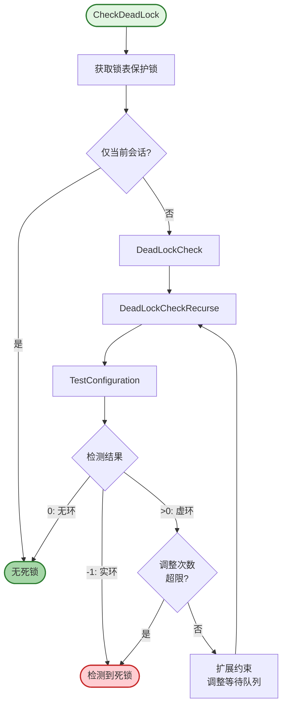
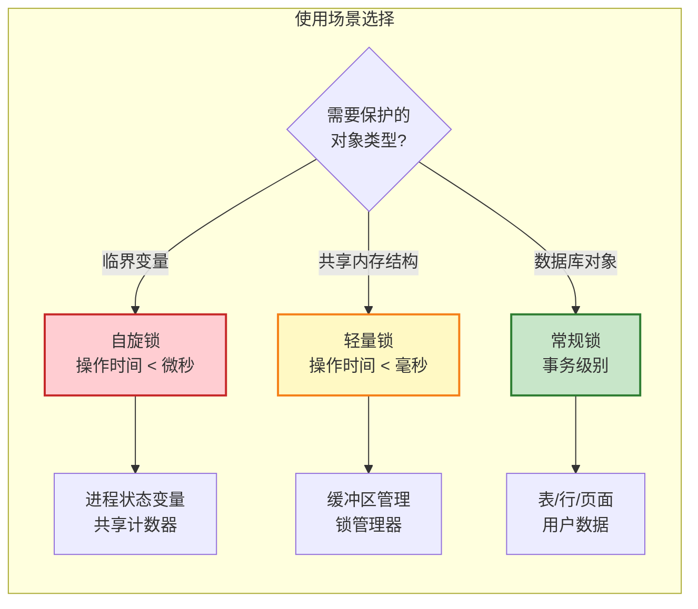

# PostgreSQL 分级锁机制详解

## 概述

PostgreSQL 的锁机制是确保数据一致性和完整性的核心机制。为了满足不同场景的并发控制需求，PostgreSQL 设计了三级锁体系：**自旋锁（Spin Lock）**、**轻量锁（Lightweight Lock）** 和 **常规锁（Regular Lock）**。这三级锁从底层到上层，粒度从细到粗，性能开销从低到高，形成了一个完整的锁层次结构。



---

## 一、自旋锁（Spin Lock）

### 1.1 基本概念

自旋锁是一种与硬件结合的互斥锁，它借用硬件提供的原子操作来对共享变量进行加锁。自旋锁的特点是：当一个进程无法获取锁时，它会在原地"忙等"（busy-wait），不断尝试获取锁，直到成功为止。

### 1.2 适用场景

自旋锁适用于以下场景：

| 特征 | 说明 |
|------|------|
| **临界资源小** | 保护的数据量很小，操作时间极短 |
| **持有时间短** | 锁持有时间非常短，通常在微秒级别 |
| **避免上下文切换** | 忙等的开销小于进程上下文切换的开销 |

### 1.3 实现原理

PostgreSQL 通过硬件提供的 **TAS（Test-And-Set）** 原子指令实现自旋锁。对于 x86 架构，实现如下：

```c
static inline int
tas(volatile slock_t *lock)
{
    register slock_t _res = 1;
    
    __asm__ __volatile__(
        "   lock            \n"
        "   xchgb   %0,%1   \n"
        : "+q"(_res), "+m"(*lock)
        :
        : "memory", "cc");
    
    return (int) _res;
}
```

**关键点**：
- `lock` 前缀确保总线锁定，保证原子性
- `xchgb` 指令交换寄存器和内存值
- 返回 1 表示获取锁失败，返回 0 表示获取锁成功

### 1.4 锁释放

自旋锁的释放非常简单，只需将锁变量置为 0：

```c
#define S_UNLOCK(lock)  \
    do { __asm__ __volatile__("" : : : "memory");  *(lock) = 0; } while (0)
```

### 1.5 使用示例

```c
SpinLockAcquire(&shared_struct->lock);
shared_struct->counter++;
SpinLockRelease(&shared_struct->lock);
```

### 1.6 注意事项

| 注意点 | 说明 |
|--------|------|
| **CPU 浪费** | 忙等会持续占用 CPU 资源 |
| **不适合长时间持有** | 长时间持有会导致其他进程长时间空转 |
| **依赖硬件支持** | 需要硬件提供原子操作指令 |
| **不可递归** | 同一进程不能重复获取同一自旋锁 |

---

## 二、轻量锁（Lightweight Lock）

### 2.1 基本概念

轻量锁是一种读写锁，支持 **共享（Shared）** 和 **排他（Exclusive）** 两种模式。它主要用于保护 PostgreSQL 内部的共享内存数据结构。

### 2.2 锁模式与兼容性



| 持有锁 \ 请求锁 | 共享锁 | 排他锁 |
|----------------|--------|--------|
| **无锁** | ✅ 立即获取 | ✅ 立即获取 |
| **共享锁** | ✅ 立即获取 | ❌ 进入等待 |
| **排他锁** | ❌ 进入等待 | ❌ 进入等待 |

### 2.3 数据结构

```c
typedef struct LWLock
{
    uint16      tranche;          /* 锁类型标识 */
    pg_atomic_uint32 state;       /* 锁状态（共享计数+排他标记） */
    proclist_head waiters;        /* 等待队列 */
#ifdef LOCK_DEBUG
    pg_atomic_uint32 nwaiters;    /* 等待者数量 */
    struct PGPROC *owner;         /* 锁持有者 */
#endif
} LWLock;
```

**状态变量解析**：
- 低 24 位：共享锁计数器（最多 2^24 个共享锁持有者）
- 第 25 位：排他锁标记
- 高位：等待者标记等

### 2.4 锁申请流程



### 2.5 锁释放流程

```c
void LWLockRelease(LWLock *lock)
{
    // 1. 从持有列表中移除
    for (i = num_held_lwlocks; --i >= 0;)
        if (lock == held_lwlocks[i].lock)
            break;
    
    mode = held_lwlocks[i].mode;
    num_held_lwlocks--;
    
    // 2. 更新锁状态
    if (mode == LW_EXCLUSIVE)
        oldstate = pg_atomic_sub_fetch_u32(&lock->state, LW_VAL_EXCLUSIVE);
    else
        oldstate = pg_atomic_sub_fetch_u32(&lock->state, LW_VAL_SHARED);
    
    // 3. 检查是否需要唤醒等待者
    if ((oldstate & (LW_FLAG_HAS_WAITERS | LW_FLAG_RELEASE_OK)) ==
        (LW_FLAG_HAS_WAITERS | LW_FLAG_RELEASE_OK) &&
        (oldstate & LW_LOCK_MASK) == 0)
        LWLockWakeup(lock);
}
```

### 2.6 轻量锁类型

PostgreSQL 定义了多种轻量锁类型，用于保护不同的共享数据结构：

| 锁名称 | 用途 |
|--------|------|
| `ShmemIndexLock` | 共享内存索引 |
| `OidGenLock` | OID 生成器 |
| `XidGenLock` | 事务 ID 生成器 |
| `ProcArrayLock` | 进程数组 |
| `SInvalWriteLock` | 系统无效消息写入 |
| `WALWriteLock` | WAL 写入 |
| `ControlFileLock` | 控制文件 |
| `CheckpointLock` | 检查点 |

### 2.7 使用示例

```c
// 获取排他锁
LWLockAcquire(ShmemIndexLock, LW_EXCLUSIVE);
// ... 操作共享内存 ...
LWLockRelease(ShmemIndexLock);

// 获取共享锁
LWLockAcquire(OidGenLock, LW_SHARED);
// ... 读取 OID ...
LWLockRelease(OidGenLock);
```

---

## 三、常规锁（Regular Lock）

### 3.1 基本概念

常规锁是 PostgreSQL 提供给用户使用的事务级锁，用于保护数据库对象（表、页面、元组等）。常规锁将锁等级分为 **八级**，形成了一个完整的锁层次结构。

### 3.2 八级锁模式



| 锁级别 | 名称 | 典型操作 | 说明 |
|--------|------|----------|------|
| **1** | ACCESS SHARE | SELECT | 最轻量级锁，仅与 ACCESS EXCLUSIVE 冲突 |
| **2** | ROW SHARE | SELECT FOR UPDATE/SHARE | 行级意向共享锁 |
| **3** | ROW EXCLUSIVE | INSERT/UPDATE/DELETE | 行级意向排他锁 |
| **4** | SHARE UPDATE EXCLUSIVE | VACUUM/ANALYZE | 自斥锁，允许并发读取 |
| **5** | SHARE | CREATE INDEX | 共享锁，阻止写入 |
| **6** | SHARE ROW EXCLUSIVE | CREATE TRIGGER | 自斥锁，介于 SHARE 和 EXCLUSIVE 之间 |
| **7** | EXCLUSIVE | 某些 ALTER TABLE | 排他锁，仅允许并发读取 |
| **8** | ACCESS EXCLUSIVE | DROP/TRUNCATE/ALTER TABLE | 最强锁，与所有锁冲突 |

### 3.3 锁兼容性矩阵

| 请求锁 \ 持有锁 | 1 | 2 | 3 | 4 | 5 | 6 | 7 | 8 |
|----------------|---|---|---|---|---|---|---|---|
| **1 ACCESS SHARE** | ✅ | ✅ | ✅ | ✅ | ✅ | ✅ | ✅ | ❌ |
| **2 ROW SHARE** | ✅ | ✅ | ✅ | ✅ | ✅ | ✅ | ❌ | ❌ |
| **3 ROW EXCLUSIVE** | ✅ | ✅ | ✅ | ✅ | ❌ | ❌ | ❌ | ❌ |
| **4 SHARE UPDATE EXCLUSIVE** | ✅ | ✅ | ✅ | ❌ | ❌ | ❌ | ❌ | ❌ |
| **5 SHARE** | ✅ | ✅ | ❌ | ❌ | ✅ | ❌ | ❌ | ❌ |
| **6 SHARE ROW EXCLUSIVE** | ✅ | ✅ | ❌ | ❌ | ❌ | ❌ | ❌ | ❌ |
| **7 EXCLUSIVE** | ✅ | ❌ | ❌ | ❌ | ❌ | ❌ | ❌ | ❌ |
| **8 ACCESS EXCLUSIVE** | ❌ | ❌ | ❌ | ❌ | ❌ | ❌ | ❌ | ❌ |

### 3.4 锁演变历史

```mermaid
flowchart LR
    subgraph Stage1["阶段一：初始阶段"]
        S1["Share 锁<br/>（读操作）"]
        S2["Exclusive 锁<br/>（写操作）"]
    end
    
    subgraph Stage2["阶段二：引入 MVCC"]
        S3["AccessShare 锁<br/>（SELECT）"]
        S4["AccessExclusive 锁<br/>（DDL 操作）"]
    end
    
    subgraph Stage3["阶段三：引入意向锁"]
        S5["RowShare 锁<br/>（意向读）"]
        S6["RowExclusive 锁<br/>（意向写）"]
    end
    
    subgraph Stage4["阶段四：完善锁体系"]
        S7["ShareUpdateExclusive<br/>（VACUUM）"]
        S8["ShareRowExclusive<br/>（TRIGGER）"]
    end
    
    Stage1 --> Stage2 --> Stage3 --> Stage4
    
    style Stage1 fill:#e3f2fd,stroke:#1565c0,stroke-width:2px
    style Stage2 fill:#fff3e0,stroke:#ef6c00,stroke-width:2px
    style Stage3 fill:#f3e5f5,stroke:#6a1b9a,stroke-width:2px
    style Stage4 fill:#c8e6c9,stroke:#2e7d32,stroke-width:2px
```



**演变原因详解**：

1. **初始阶段**：只有 Share（读锁）和 Exclusive（写锁）两种锁

2. **引入 MVCC**：
   - `AccessShare`：普通 SELECT 使用，与 Exclusive 不冲突
   - `AccessExclusive`：DDL 操作使用，与所有锁冲突

3. **引入意向锁**：
   - `RowShare`：协调 SELECT FOR UPDATE/SHARE 的行级锁
   - `RowExclusive`：协调 INSERT/UPDATE/DELETE 的行级锁
   - 意向锁解决表锁和行锁的协调问题

4. **完善锁体系**：
   - `ShareUpdateExclusive`：VACUUM 不应阻止写入，但需自斥
   - `ShareRowExclusive`：创建触发器时需要阻止写入但允许读取

### 3.5 数据结构

#### 3.5.1 主锁表（LockMethodLockHash）

存储所有锁对象，使用 HASH 表结构：

```c
typedef struct LOCK
{
    LOCKTAG     tag;            /* 锁标识 */
    LOCKMASK    grantMask;      /* 已授予锁的位图 */
    LOCKMASK    waitMask;       /* 等待锁的位图 */
    SHM_QUEUE   procLocks;      /* 进程锁链表 */
    PROC_QUEUE  waitProcs;      /* 等待进程队列 */
    int         requested[8];   /* 各级别锁请求计数 */
    int         nRequested;     /* 总请求计数 */
    int         granted[8];     /* 各级别锁授予计数 */
    int         nGranted;       /* 总授予计数 */
} LOCK;
```

#### 3.5.2 进程锁表（LockMethodProcLockHash）

建立锁与会话之间的关系：

```c
typedef struct PROCLOCK
{
    PROCLOCKTAG tag;            /* 进程锁标识 */
    LOCK       *lock;           /* 指向 LOCK */
    PGPROC     *proc;           /* 指向 PGPROC */
    LOCKMASK    holdMask;       /* 持有的锁模式 */
    LOCKMASK    releaseMask;    /* 待释放的锁模式 */
    SHM_QUEUE   lockLink;       /* LOCK 链表节点 */
    SHM_QUEUE   procLink;       /* PGPROC 链表节点 */
} PROCLOCK;
```

#### 3.5.3 本地锁表（LocalLock）

本地缓存，避免频繁访问共享内存：

```c
typedef struct LOCALLOCK
{
    LOCKTAG     tag;            /* 锁标识 */
    LOCKMODE    mode;           /* 锁模式 */
    int         nLocks;         /* 锁计数 */
    LOCK       *lock;           /* 指向共享内存 LOCK */
    PROCLOCK   *proclock;       /* 指向共享内存 PROCLOCK */
    bool        holdsStrongLockCount; /* 是否持有强锁计数 */
} LOCALLOCK;
```

#### 3.5.4 快速路径（Fast Path）

弱锁的快速获取路径，存储在进程本地：

```c
typedef struct PGPROC
{
    // ... 其他字段 ...
    uint64      fpLockBits;     /* 快速路径锁位图 */
    Oid         fpRelId[16];    /* 快速路径表 OID */
    bool        fpLockBitsUsed[16]; /* 快速路径槽位使用标记 */
} PGPROC;
```

**快速路径条件**：
- 非咨询锁
- 锁对象为表
- 当前数据库的锁
- 弱锁（级别 < 4）

### 3.6 锁申请流程

```mermaid
flowchart TB
    Start([LockAcquire]) --> LocalLookup["查找本地锁表"]
    
    LocalLookup --> LocalFound{"本地锁表<br/>找到?"}
    
    LocalFound -->|是| IncrCount["增加锁计数"]
    IncrCount --> Success([返回成功])
    
    LocalFound -->|否| CreateLocal["创建本地锁条目"]
    CreateLocal --> CheckFastPath{"是否弱锁?"}
    
    CheckFastPath -->|是| TryFastPath["尝试快速路径获取"]
    TryFastPath --> FastResult{"快速路径<br/>成功?"}
    FastResult -->|是| Success
    
    FastResult -->|否| CheckStrong{"是否强锁?"}
    CheckFastPath -->|否| CheckStrong
    
    CheckStrong -->|是| BeginStrong["开始强锁获取"]
    BeginStrong --> TransferWeak["转移弱锁到主锁表"]
    TransferWeak --> AcquireStrong["获取强锁"]
    
    CheckStrong -->|否| AcquireNormal["正常获取流程"]
    
    AcquireStrong --> CheckConflict{"检查锁冲突"]
    AcquireNormal --> CheckConflict
    
    CheckConflict -->|无冲突| GrantLock["授予锁"]
    GrantLock --> Success
    
    CheckConflict -->|有冲突| CheckWait{"是否等待?"}
    CheckWait -->|否| Fail([返回失败])
    CheckWait -->|是| WaitOnLock["等待锁"]
    WaitOnLock --> DeadlockCheck["死锁检测"]
    DeadlockCheck --> CheckConflict
    
    style Start fill:#e1f5e1,stroke:#2e7d32,stroke-width:2px
    style Success fill:#a5d6a7,stroke:#2e7d32,stroke-width:2px
    style Fail fill:#ffcdd2,stroke:#c62828,stroke-width:2px
    style DeadlockCheck fill:#fff9c4,stroke:#f57f17,stroke-width:2px
```

### 3.7 锁释放流程



---

## 四、死锁检测机制

### 4.1 死锁概念

死锁是指两个或多个事务相互等待对方持有的锁，形成循环等待的情况。PostgreSQL 使用 **乐观锁** 策略：当锁等待时间超过 `deadlock_timeout`（默认 1 秒）时，才开始死锁检测。

### 4.2 等待图（Wait-For Graph）



### 4.3 硬边与软边

| 类型 | 定义 | 说明 |
|------|------|------|
| **硬边（Hard Edge）** | A 持有锁，B 申请排他锁等待 | 不可调整的阻塞关系 |
| **软边（Soft Edge）** | A 持有共享锁，B 申请排他锁等待，C 申请共享锁等待 B | 可调整的等待关系 |

**软边示例**：



### 4.4 死锁检测流程



### 4.5 死锁解决策略

| 策略 | 适用场景 | 操作 |
|------|----------|------|
| **调整等待队列** | 存在软边的死锁 | 重排等待队列，消除循环 |
| **终止事务** | 全硬边死锁 | 选择一个事务回滚 |

### 4.6 死锁检测数据结构

```c
typedef struct DEADLOCK_INFO
{
    PGPROC     *proc;           /* 等待的进程 */
    LOCK       *lock;           /* 等待的锁 */
    LOCKMODE    mode;           /* 等待的锁模式 */
} DEADLOCK_INFO;

typedef struct EDGE
{
    PGPROC     *waiter;         /* 等待者 */
    PGPROC     *blocker;        /* 阻塞者 */
    bool        isSoft;         /* 是否为软边 */
} EDGE;
```

---

## 五、三级锁对比

### 5.1 特性对比

| 特性 | 自旋锁 | 轻量锁 | 常规锁 |
|------|--------|--------|--------|
| **锁模式** | 互斥 | 共享/排他 | 八级 |
| **锁粒度** | 最细 | 中等 | 最粗 |
| **等待方式** | CPU 忙等 | 进程睡眠 | 进程睡眠 |
| **持有时间** | 微秒级 | 毫秒级 | 事务级 |
| **适用对象** | 临界变量 | 共享内存结构 | 数据库对象 |
| **死锁检测** | 不支持 | 不支持 | 支持 |
| **性能开销** | 最低 | 中等 | 最高 |

### 5.2 使用场景



---

## 六、最佳实践

### 6.1 自旋锁使用原则

```c
// ✅ 正确：短临界区
SpinLockAcquire(&lock);
counter++;
SpinLockRelease(&lock);

// ❌ 错误：长临界区
SpinLockAcquire(&lock);
for (int i = 0; i < 1000000; i++)
    process_data(i);
SpinLockRelease(&lock);
```

### 6.2 轻量锁使用原则

```c
// ✅ 正确：按顺序获取多个锁
LWLockAcquire(LockA, LW_EXCLUSIVE);
LWLockAcquire(LockB, LW_EXCLUSIVE);
// ... 操作 ...
LWLockRelease(LockB);
LWLockRelease(LockA);

// ❌ 错误：逆序释放
LWLockAcquire(LockA, LW_EXCLUSIVE);
LWLockAcquire(LockB, LW_EXCLUSIVE);
LWLockRelease(LockA);  // 可能导致死锁
LWLockRelease(LockB);
```

### 6.3 常规锁使用原则

```sql
-- ✅ 正确：按一致的顺序获取锁
BEGIN;
LOCK TABLE table_a IN ACCESS EXCLUSIVE MODE;
LOCK TABLE table_b IN ACCESS EXCLUSIVE MODE;
-- ... 操作 ...
COMMIT;

-- ❌ 错误：不同事务按不同顺序获取锁
-- 事务 1
BEGIN;
LOCK TABLE table_a IN ACCESS EXCLUSIVE MODE;
LOCK TABLE table_b IN ACCESS EXCLUSIVE MODE;  -- 可能等待
COMMIT;

-- 事务 2（并发执行）
BEGIN;
LOCK TABLE table_b IN ACCESS EXCLUSIVE MODE;
LOCK TABLE table_a IN ACCESS EXCLUSIVE MODE;  -- 可能等待，导致死锁
COMMIT;
```

### 6.4 死锁预防策略

| 策略 | 说明 |
|------|------|
| **固定加锁顺序** | 所有事务按相同顺序获取锁 |
| **设置锁超时** | `SET lock_timeout = '30s'` |
| **最小化锁持有时间** | 尽快释放锁 |
| **使用较低锁级别** | 使用满足需求的最弱锁 |

---

## 七、监控与诊断

### 7.1 查看当前锁

```sql
SELECT 
    pid,
    locktype,
    mode,
    granted,
    relation::regclass,
    page,
    tuple
FROM pg_locks
WHERE pid = pg_backend_pid();
```

### 7.2 查看锁等待

```sql
SELECT 
    blocked.pid AS blocked_pid,
    blocked.query AS blocked_query,
    blocking.pid AS blocking_pid,
    blocking.query AS blocking_query
FROM pg_stat_activity blocked
JOIN pg_locks blocked_locks ON blocked.pid = blocked_locks.pid
JOIN pg_locks blocking_locks ON blocked_locks.locktype = blocking_locks.locktype
    AND blocked_locks.database IS NOT DISTINCT FROM blocking_locks.database
    AND blocked_locks.relation IS NOT DISTINCT FROM blocking_locks.relation
    AND blocked_locks.page IS NOT DISTINCT FROM blocking_locks.page
    AND blocked_locks.tuple IS NOT DISTINCT FROM blocking_locks.tuple
    AND blocked_locks.pid != blocking_locks.pid
JOIN pg_stat_activity blocking ON blocking.pid = blocking_locks.pid
WHERE NOT blocked_locks.granted;
```

### 7.3 死锁统计

```sql
SELECT 
    datname,
    deadlocks,
    conflicts
FROM pg_stat_database
WHERE deadlocks > 0;
```

### 7.4 关键配置参数

| 参数 | 默认值 | 说明 |
|------|--------|------|
| `deadlock_timeout` | 1s | 死锁检测等待时间 |
| `lock_timeout` | 0 | 锁等待超时时间（0 表示禁用） |
| `log_lock_waits` | off | 记录锁等待日志 |
| `max_locks_per_transaction` | 64 | 每个事务最大锁数量 |

---

## 参考资料

- [PostgreSQL 官方文档：Explicit Locking](https://www.postgresql.org/docs/current/explicit-locking.html)
- [PostgreSQL 技术内幕：事务处理深度探索](https://book.douban.com/subject/30355010/)
- [PostgreSQL 数据库内核分析](https://book.douban.com/subject/4173256/)
- [PostgreSQL 锁机制详解](https://blog.csdn.net/cullen2016/article/details/108534055)
