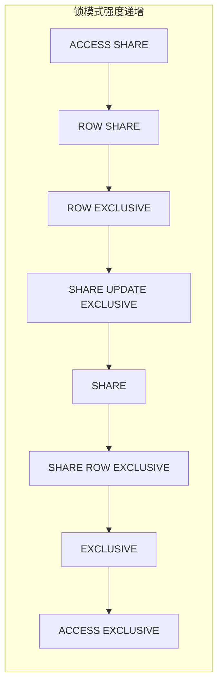
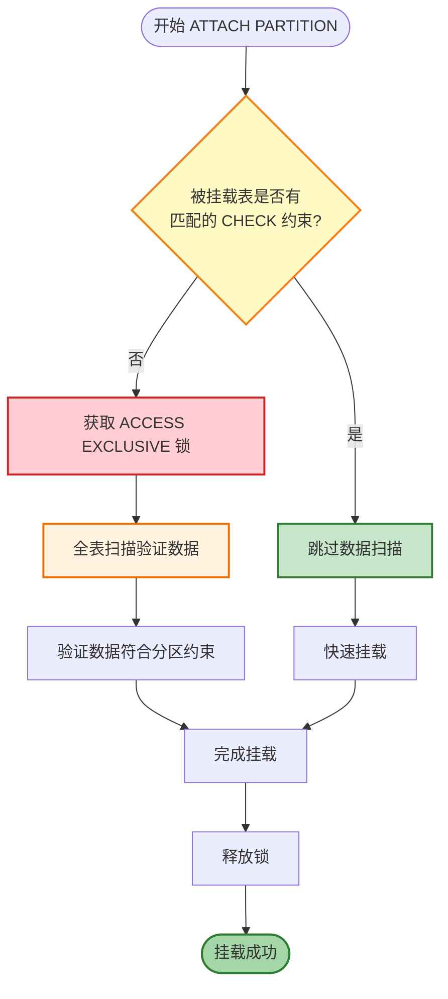
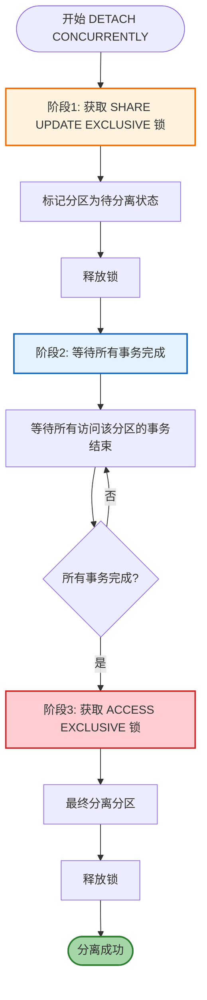

# PostgreSQL 锁机制与分区表操作详解

## 概述

PostgreSQL 的锁机制是确保数据一致性和完整性的核心机制。在分区表操作中，理解不同操作所需的锁级别及其对并发的影响至关重要。本文将深入探讨 PostgreSQL 的各级锁机制及其与分区表操作之间的关系。

---

## 一、PostgreSQL 锁机制详解

### 1.1 表级锁（Table-Level Locks）

PostgreSQL 提供了 8 种表级锁模式，按锁强度从弱到强排列如下：

| 锁模式 | 缩写 | 说明 | 典型操作 |
|--------|------|------|----------|
| **ACCESS SHARE** | AS | 最轻量级锁，允许并发读写 | `SELECT` |
| **ROW SHARE** | RS | 允许并发读取，防止排他写入 | `SELECT FOR UPDATE/SHARE` |
| **ROW EXCLUSIVE** | RE | 允许并发读写，防止 schema 变更 | `INSERT/UPDATE/DELETE` |
| **SHARE UPDATE EXCLUSIVE** | SUE | 允许并发读取，防止 VACUUM 和 schema 变更 | `VACUUM/ANALYZE` |
| **SHARE** | S | 允许并发读取，阻止所有写入 | `CREATE INDEX` |
| **SHARE ROW EXCLUSIVE** | SRE | 允许并发读取，阻止写入和排他操作 | `CREATE TRIGGER` |
| **EXCLUSIVE** | E | 仅允许并发读取，阻止其他所有操作 | 某些 `ALTER TABLE` |
| **ACCESS EXCLUSIVE** | AE | 最强锁，阻止所有并发操作 | `DROP TABLE/TRUNCATE/ALTER TABLE` |

### 1.2 表级锁兼容性矩阵



| 请求锁 \ 持有锁 | AS | RS | RE | SUE | S | SRE | E | AE |
|----------------|----|----|----|----|---|-----|---|-----|
| **ACCESS SHARE** | ✅ | ✅ | ✅ | ✅ | ✅ | ✅ | ✅ | ❌ |
| **ROW SHARE** | ✅ | ✅ | ✅ | ✅ | ✅ | ✅ | ❌ | ❌ |
| **ROW EXCLUSIVE** | ✅ | ✅ | ✅ | ✅ | ❌ | ❌ | ❌ | ❌ |
| **SHARE UPDATE EXCLUSIVE** | ✅ | ✅ | ✅ | ❌ | ❌ | ❌ | ❌ | ❌ |
| **SHARE** | ✅ | ✅ | ❌ | ❌ | ✅ | ❌ | ❌ | ❌ |
| **SHARE ROW EXCLUSIVE** | ✅ | ✅ | ❌ | ❌ | ❌ | ❌ | ❌ | ❌ |
| **EXCLUSIVE** | ✅ | ❌ | ❌ | ❌ | ❌ | ❌ | ❌ | ❌ |
| **ACCESS EXCLUSIVE** | ❌ | ❌ | ❌ | ❌ | ❌ | ❌ | ❌ | ❌ |

### 1.3 行级锁（Row-Level Locks）

行级锁用于控制对特定行的并发访问：

| 行锁模式 | 说明 | 冲突锁 |
|----------|------|--------|
| **FOR UPDATE** | 排他行锁，阻止其他事务修改或删除该行 | FOR UPDATE, FOR NO KEY UPDATE, FOR SHARE, FOR KEY SHARE |
| **FOR NO KEY UPDATE** | 非键列更新锁，允许其他事务读取键值 | FOR UPDATE, FOR NO KEY UPDATE |
| **FOR SHARE** | 共享行锁，允许读取但阻止修改 | FOR UPDATE, FOR NO KEY UPDATE, FOR SHARE |
| **FOR KEY SHARE** | 键共享锁，允许其他事务修改非键列 | FOR UPDATE |

---

## 二、分区表操作与锁的关系

### 2.1 分区创建操作

#### 2.1.1 CREATE TABLE ... PARTITION OF

创建新分区时，需要在父表上获取 **ACCESS EXCLUSIVE** 锁。

```sql
CREATE TABLE measurement_y2024m01 PARTITION OF measurement
    FOR VALUES FROM ('2024-01-01') TO ('2024-02-01');
```

**锁行为分析**：

| 对象 | 锁模式 | 持续时间 |
|------|--------|----------|
| 父表（分区表） | ACCESS EXCLUSIVE | 事务期间 |
| 新分区 | ACCESS EXCLUSIVE | 事务期间 |

**影响**：
- 阻止所有对父表的并发访问
- 生产环境应谨慎使用，建议在维护窗口执行

#### 2.1.2 最佳实践：预创建分区

```sql
BEGIN;
LOCK TABLE measurement IN SHARE UPDATE EXCLUSIVE MODE;
CREATE TABLE measurement_y2024m02 PARTITION OF measurement
    FOR VALUES FROM ('2024-02-01') TO ('2024-03-01');
COMMIT;
```

### 2.2 分区挂载操作（ATTACH PARTITION）

`ATTACH PARTITION` 是将已存在的普通表挂载为分区的操作，其锁行为取决于是否预先创建 CHECK 约束。

#### 2.2.1 无 CHECK 约束的情况

```sql
ALTER TABLE measurement ATTACH PARTITION measurement_y2024m03
    FOR VALUES FROM ('2024-03-01') TO ('2024-04-01');
```

**锁行为分析**：

| 对象 | 锁模式 | 说明 |
|------|--------|------|
| 父表（分区表） | SHARE UPDATE EXCLUSIVE | 允许并发读取 |
| 被挂载表 | ACCESS EXCLUSIVE | 阻止所有并发访问 |

**数据验证过程**：
- 系统需要扫描被挂载表的所有数据
- 验证数据是否符合分区约束
- 扫描期间持有 ACCESS EXCLUSIVE 锁



#### 2.2.2 有 CHECK 约束的情况（推荐）

```sql
CREATE TABLE measurement_y2024m03
    (LIKE measurement INCLUDING DEFAULTS INCLUDING CONSTRAINTS);

ALTER TABLE measurement_y2024m03 ADD CONSTRAINT check_y2024m03
    CHECK (logdate >= DATE '2024-03-01' AND logdate < DATE '2024-04-01');

COPY measurement_y2024m03 FROM '/path/to/data.csv';

ALTER TABLE measurement ATTACH PARTITION measurement_y2024m03
    FOR VALUES FROM ('2024-03-01') TO ('2024-04-01');

ALTER TABLE measurement_y2024m03 DROP CONSTRAINT check_y2024m03;
```

**锁行为分析**：

| 对象 | 锁模式 | 说明 |
|------|--------|------|
| 父表（分区表） | SHARE UPDATE EXCLUSIVE | 允许并发读取 |
| 被挂载表 | SHARE UPDATE EXCLUSIVE | 允许并发读取 |

**优势**：
- 系统跳过数据扫描，因为 CHECK 约束已保证数据有效性
- 大幅减少锁持有时间
- 对生产环境影响最小

#### 2.2.3 ATTACH PARTITION 完整示例

```sql
BEGIN;

CREATE TABLE orders_y2024m01 (LIKE orders INCLUDING ALL);
ALTER TABLE orders_y2024m01 ADD CONSTRAINT orders_y2024m01_check
    CHECK (order_date >= '2024-01-01' AND order_date < '2024-02-01');

COPY orders_y2024m01 FROM '/data/orders_2024_01.csv';

CREATE INDEX idx_orders_y2024m01_customer ON orders_y2024m01(customer_id);

ALTER TABLE orders ATTACH PARTITION orders_y2024m01
    FOR VALUES FROM ('2024-01-01') TO ('2024-02-01');

ALTER TABLE orders_y2024m01 DROP CONSTRAINT orders_y2024m01_check;

COMMIT;
```

### 2.3 分区卸载操作（DETACH PARTITION）

`DETACH PARTITION` 将分区从分区表中分离，变为独立表。

#### 2.3.1 同步卸载

```sql
ALTER TABLE measurement DETACH PARTITION measurement_y2024m01;
```

**锁行为分析**：

| 对象 | 锁模式 | 说明 |
|------|--------|------|
| 父表（分区表） | SHARE UPDATE EXCLUSIVE | 允许并发读取 |
| 被卸载分区 | ACCESS EXCLUSIVE | 阻止所有并发访问 |

#### 2.3.2 并发卸载（PostgreSQL 14+）

```sql
ALTER TABLE measurement DETACH PARTITION measurement_y2024m01 CONCURRENTLY;
```

**锁行为分析**：

| 阶段 | 锁模式 | 说明 |
|------|--------|------|
| 第一阶段 | SHARE UPDATE EXCLUSIVE | 仅获取短暂锁 |
| 第二阶段 | 无锁等待 | 等待所有事务完成 |
| 第三阶段 | ACCESS EXCLUSIVE | 最终分离操作 |

**优势**：
- 最小化对生产环境的影响
- 避免长时间阻塞查询



### 2.4 分区删除操作（DROP PARTITION）

#### 2.4.1 DROP TABLE 删除分区

```sql
DROP TABLE measurement_y2024m01;
```

**锁行为分析**：

| 对象 | 锁模式 | 说明 |
|------|--------|------|
| 父表（分区表） | ACCESS EXCLUSIVE | 阻止所有并发访问 |
| 被删除分区 | ACCESS EXCLUSIVE | 阻止所有并发访问 |

**影响**：
- 需要在父表上获取 ACCESS EXCLUSIVE 锁
- 生产环境应谨慎使用

#### 2.4.2 推荐方案：DETACH + DROP

```sql
BEGIN;
ALTER TABLE measurement DETACH PARTITION measurement_y2024m01;
DROP TABLE measurement_y2024m01;
COMMIT;
```

**优势**：
- DETACH 操作锁级别较低
- 减少对父表的锁定时间

### 2.5 分区截断操作（TRUNCATE）

#### 2.5.1 直接 TRUNCATE 分区

```sql
TRUNCATE TABLE measurement_y2024m01;
```

**锁行为分析**：

| 对象 | 锁模式 | 说明 |
|------|--------|------|
| 分区表 | ACCESS EXCLUSIVE | 阻止所有并发访问 |

**注意**：
- TRUNCATE 是 DDL 操作，比 DELETE 快得多
- 不触发触发器，不记录逐行日志
- 需要获取 ACCESS EXCLUSIVE 锁

#### 2.5.2 最佳实践

```sql
BEGIN;
ALTER TABLE measurement DETACH PARTITION measurement_y2024m01;
TRUNCATE TABLE measurement_y2024m01;
ALTER TABLE measurement ATTACH PARTITION measurement_y2024m01
    FOR VALUES FROM ('2024-01-01') TO ('2024-02-01');
COMMIT;
```

### 2.6 分区索引创建

#### 2.6.1 直接创建索引

```sql
CREATE INDEX idx_measurement_logdate ON measurement(logdate);
```

**锁行为分析**：

| 对象 | 锁模式 | 说明 |
|------|--------|------|
| 父表及所有分区 | SHARE | 阻止写入，允许读取 |

**影响**：
- 在所有分区上创建索引
- 阻止所有写入操作
- 大表可能耗时较长

#### 2.6.2 并发创建索引（推荐）

```sql
CREATE INDEX CONCURRENTLY idx_measurement_logdate ON measurement(logdate);
```

**注意**：`CONCURRENTLY` 不能直接用于分区表，需要分步操作：

```sql
CREATE INDEX idx_measurement_logdate ON ONLY measurement(logdate);

CREATE INDEX CONCURRENTLY idx_measurement_y2024m01_logdate 
    ON measurement_y2024m01(logdate);
ALTER INDEX idx_measurement_logdate 
    ATTACH PARTITION idx_measurement_y2024m01_logdate;

CREATE INDEX CONCURRENTLY idx_measurement_y2024m02_logdate 
    ON measurement_y2024m02(logdate);
ALTER INDEX idx_measurement_logdate 
    ATTACH PARTITION idx_measurement_y2024m02_logdate;
```

**锁行为分析**：

| 操作 | 锁模式 | 说明 |
|------|--------|------|
| CREATE INDEX ON ONLY | SHARE UPDATE EXCLUSIVE | 最小影响 |
| CREATE INDEX CONCURRENTLY | 无阻塞锁 | 允许并发读写 |
| ALTER INDEX ATTACH | SHARE UPDATE EXCLUSIVE | 短暂锁定 |

---

## 三、分区表 ALTER TABLE 操作分类与锁行为

根据 ALTER TABLE 子命令对分区表的影响，可分为以下类别：

### 3.1 仅作用于父表的结构性变更（C1）

| 子命令 | 父表锁模式 | 分区锁模式 | 传播性 |
|--------|-----------|-----------|--------|
| ADD COLUMN | ACCESS EXCLUSIVE | ACCESS EXCLUSIVE | 强制传播 |
| DROP COLUMN | ACCESS EXCLUSIVE | ACCESS EXCLUSIVE | 强制传播 |
| SET DATA TYPE | ACCESS EXCLUSIVE | ACCESS EXCLUSIVE | 强制传播 |
| ADD GENERATED AS IDENTITY | ACCESS EXCLUSIVE | ACCESS EXCLUSIVE | 强制传播 |

**示例**：

```sql
ALTER TABLE measurement ADD COLUMN new_column VARCHAR(100);
```

### 3.2 可传播且可继承的变更（C2）

| 子命令 | 父表锁模式 | 分区锁模式 | ONLY 支持 |
|--------|-----------|-----------|-----------|
| SET DEFAULT | ACCESS EXCLUSIVE | ACCESS EXCLUSIVE | ✅ |
| DROP DEFAULT | ACCESS EXCLUSIVE | ACCESS EXCLUSIVE | ✅ |
| SET STORAGE | ACCESS EXCLUSIVE | ACCESS EXCLUSIVE | ✅ |
| DROP CONSTRAINT | ACCESS EXCLUSIVE | ACCESS EXCLUSIVE | ✅ |

**示例**：

```sql
ALTER TABLE measurement ALTER COLUMN unitsales SET DEFAULT 0;

ALTER TABLE ONLY measurement ALTER COLUMN unitsales SET DEFAULT 0;
```

### 3.3 父表与分区完全独立（C4）

| 子命令 | 父表锁模式 | 分区锁模式 | 传播性 |
|--------|-----------|-----------|--------|
| SET/RESET (attribute_option) | ACCESS EXCLUSIVE | 无 | 不传播 |
| OWNER TO | ACCESS EXCLUSIVE | 无 | 不传播 |
| SET SCHEMA | ACCESS EXCLUSIVE | 无 | 不传播 |
| ENABLE/DISABLE ROW LEVEL SECURITY | ACCESS EXCLUSIVE | 无 | 不传播 |

### 3.4 分区管理类命令（C15）

| 子命令 | 父表锁模式 | 分区锁模式 |
|--------|-----------|-----------|
| ATTACH PARTITION | SHARE UPDATE EXCLUSIVE | ACCESS EXCLUSIVE* |
| DETACH PARTITION | SHARE UPDATE EXCLUSIVE | ACCESS EXCLUSIVE |
| DETACH PARTITION CONCURRENTLY | SHARE UPDATE EXCLUSIVE | 无长时间锁 |

*注：如果有匹配的 CHECK 约束，分区锁降级为 SHARE UPDATE EXCLUSIVE

---

## 四、锁等待与死锁处理

### 4.1 锁等待监控

```sql
SELECT 
    blocked_locks.pid AS blocked_pid,
    blocked_activity.usename AS blocked_user,
    blocking_locks.pid AS blocking_pid,
    blocking_activity.usename AS blocking_user,
    blocked_activity.query AS blocked_statement,
    blocking_activity.query AS current_statement_in_blocking_process,
    blocked_activity.application_name AS blocked_application
FROM pg_catalog.pg_locks blocked_locks
    JOIN pg_catalog.pg_stat_activity blocked_activity ON blocked_activity.pid = blocked_locks.pid
    JOIN pg_catalog.pg_locks blocking_locks ON blocking_locks.locktype = blocked_locks.locktype
        AND blocking_locks.DATABASE IS NOT DISTINCT FROM blocked_locks.DATABASE
        AND blocking_locks.relation IS NOT DISTINCT FROM blocked_locks.relation
        AND blocking_locks.page IS NOT DISTINCT FROM blocked_locks.page
        AND blocking_locks.tuple IS NOT DISTINCT FROM blocked_locks.tuple
        AND blocking_locks.virtualxid IS NOT DISTINCT FROM blocked_locks.virtualxid
        AND blocking_locks.transactionid IS NOT DISTINCT FROM blocked_locks.transactionid
        AND blocking_locks.classid IS NOT DISTINCT FROM blocked_locks.classid
        AND blocking_locks.objid IS NOT DISTINCT FROM blocked_locks.objid
        AND blocking_locks.objsubid IS NOT DISTINCT FROM blocked_locks.objsubid
        AND blocking_locks.pid != blocked_locks.pid
    JOIN pg_catalog.pg_stat_activity blocking_activity ON blocking_activity.pid = blocking_locks.pid
WHERE NOT blocked_locks.GRANTED;
```

### 4.2 死锁检测参数

| 参数 | 默认值 | 说明 |
|------|--------|------|
| `deadlock_timeout` | 1s | 死锁检测等待时间 |
| `lock_timeout` | 0（禁用）| 锁等待超时时间 |
| `log_lock_waits` | off | 记录锁等待日志 |

### 4.3 避免死锁的最佳实践

```sql
SET lock_timeout = '5s';

BEGIN;
LOCK TABLE measurement IN ACCESS EXCLUSIVE MODE;
ALTER TABLE measurement ADD COLUMN new_column INT;
COMMIT;
```

---

## 五、最佳实践总结

### 5.1 分区操作锁优化策略

```mermaid
flowchart TB
    subgraph CreatePartition["创建分区"]
        C1["预创建分区"] --> C2["在维护窗口执行"]
        C2 --> C3["使用 ATTACH 替代直接创建"]
    end
    
    subgraph AttachPartition["挂载分区"]
        A1["预先创建 CHECK 约束"] --> A2["加载数据"]
        A2 --> A3["ATTACH PARTITION"]
        A3 --> A4["删除冗余 CHECK 约束"]
    end
    
    subgraph DetachPartition["卸载分区"]
        D1["使用 CONCURRENTLY 选项"] --> D2["等待事务完成"]
        D2 --> D3["最小化生产影响"]
    end
    
    subgraph DropIndex["删除/截断分区"]
        T1["先 DETACH"] --> T2["再 DROP/TRUNCATE"]
        T2 --> T3["减少父表锁定时间"]
    end
    
    CreatePartition --> BestPractice["最佳实践"]
    AttachPartition --> BestPractice
    DetachPartition --> BestPractice
    DropIndex --> BestPractice
    
    style BestPractice fill:#a5d6a7,stroke:#2e7d32,stroke-width:3px
```



### 5.2 生产环境操作清单

| 操作 | 推荐方法 | 锁级别 | 执行时机 |
|------|----------|--------|----------|
| 新增分区 | ATTACH PARTITION + CHECK 约束 | SUE | 任何时间 |
| 删除旧分区 | DETACH CONCURRENTLY + DROP | SUE | 任何时间 |
| 清空分区 | DETACH + TRUNCATE + ATTACH | SUE | 任何时间 |
| 添加列 | ALTER TABLE ADD COLUMN | AE | 维护窗口 |
| 创建索引 | CREATE INDEX CONCURRENTLY | 无阻塞 | 任何时间 |
| 修改数据类型 | ALTER TABLE SET DATA TYPE | AE | 维护窗口 |

### 5.3 关键配置参数

```sql
-- 启用分区裁剪
SET enable_partition_pruning = on;

-- 设置锁超时
SET lock_timeout = '30s';

-- 启用锁等待日志
SET log_lock_waits = on;

-- 设置死锁检测超时
SET deadlock_timeout = '1s';
```

---

## 六、常见问题与解决方案

### 6.1 ATTACH PARTITION 长时间等待

**问题**：ATTACH PARTITION 操作长时间等待

**原因**：被挂载表没有 CHECK 约束，系统需要全表扫描验证数据

**解决方案**：

```sql
-- 方案1：预先创建 CHECK 约束
ALTER TABLE new_partition ADD CONSTRAINT check_partition
    CHECK (partition_key >= 'value1' AND partition_key < 'value2');

-- 方案2：使用 NOWAIT 快速失败
SET lock_timeout = '1s';
ALTER TABLE parent_table ATTACH PARTITION new_partition
    FOR VALUES FROM ('value1') TO ('value2');
```

### 6.2 分区表 DDL 阻塞查询

**问题**：分区表 DDL 操作阻塞正常查询

**原因**：DDL 操作获取了 ACCESS EXCLUSIVE 锁

**解决方案**：

```sql
-- 方案1：使用低锁级别操作
ALTER TABLE parent_table DETACH PARTITION old_partition CONCURRENTLY;

-- 方案2：在事务中控制锁
BEGIN;
SET lock_timeout = '5s';
LOCK TABLE parent_table IN SHARE UPDATE EXCLUSIVE MODE;
-- 执行操作
COMMIT;
```

### 6.3 索引创建阻塞写入

**问题**：在分区表上创建索引阻塞写入操作

**解决方案**：

```sql
-- 步骤1：在父表上创建无效索引
CREATE INDEX idx_name ON ONLY parent_table(column);

-- 步骤2：并发创建各分区索引
CREATE INDEX CONCURRENTLY idx_partition1 ON partition1(column);
ALTER INDEX idx_name ATTACH PARTITION idx_partition1;

-- 步骤3：重复步骤2直到所有分区完成
```

---

## 参考资料

- [PostgreSQL 官方文档：Explicit Locking](https://www.postgresql.org/docs/current/explicit-locking.html)
- [PostgreSQL 官方文档：Table Partitioning](https://www.postgresql.org/docs/current/ddl-partitioning.html)
- [PostgreSQL 分区表的 ALTER TABLE 语句执行机制解析](https://www.highgo.ca/2026/01/21/understanding-alter-table-behavior-on-partitioned-tables-in-postgresql/)
