# Redis Pipeline 管道技术详解

## 一、概述

Redis Pipeline（管道）是一种通过一次性发出多个命令而无需等待每个单独命令的响应来提高性能的技术。它可以显著减少网络往返时间（RTT），大幅提升批量操作的性能。

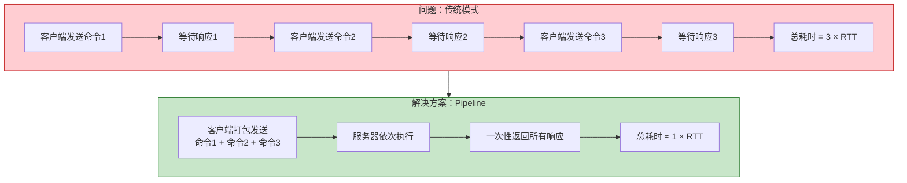

***

## 二、为什么需要 Pipeline

### 2.1 传统模式的问题

Redis 是基于 TCP 的请求/响应模式服务器，传统模式下每条命令都需要经历完整的请求-响应周期：

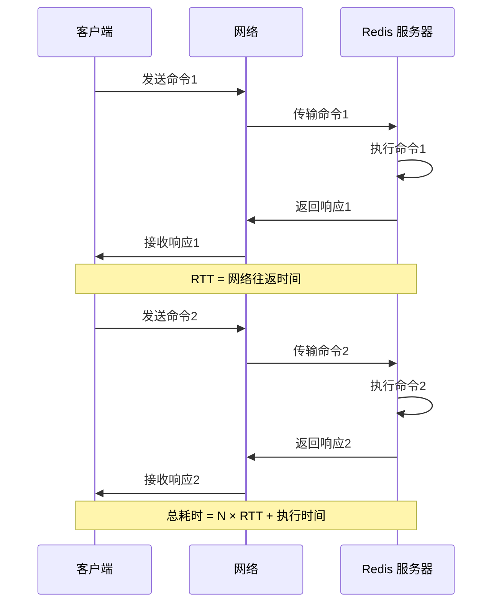

**传统模式的性能瓶颈**：

| 问题 | 说明 |
|------|------|
| **网络延迟累积** | 每条命令都需要一次 RTT，N 条命令 = N × RTT |
| **系统调用开销** | 每次 read/write 都涉及用户态/内核态切换 |
| **TCP 协议开销** | 每个命令都有 TCP 头部开销 |

### 2.2 RTT 对性能的影响

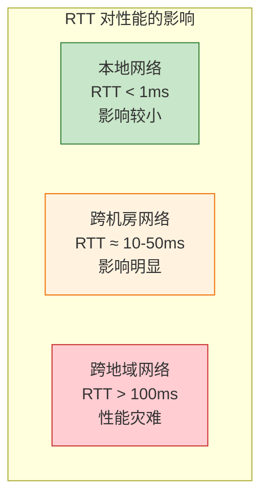

**性能对比示例**：

| 场景 | RTT | 1000 条命令耗时 |
|------|-----|----------------|
| 本地网络 | 0.5ms | 0.5s |
| 跨机房 | 10ms | 10s |
| 跨地域 | 100ms | 100s |

***

## 三、Pipeline 工作原理

### 3.1 核心原理

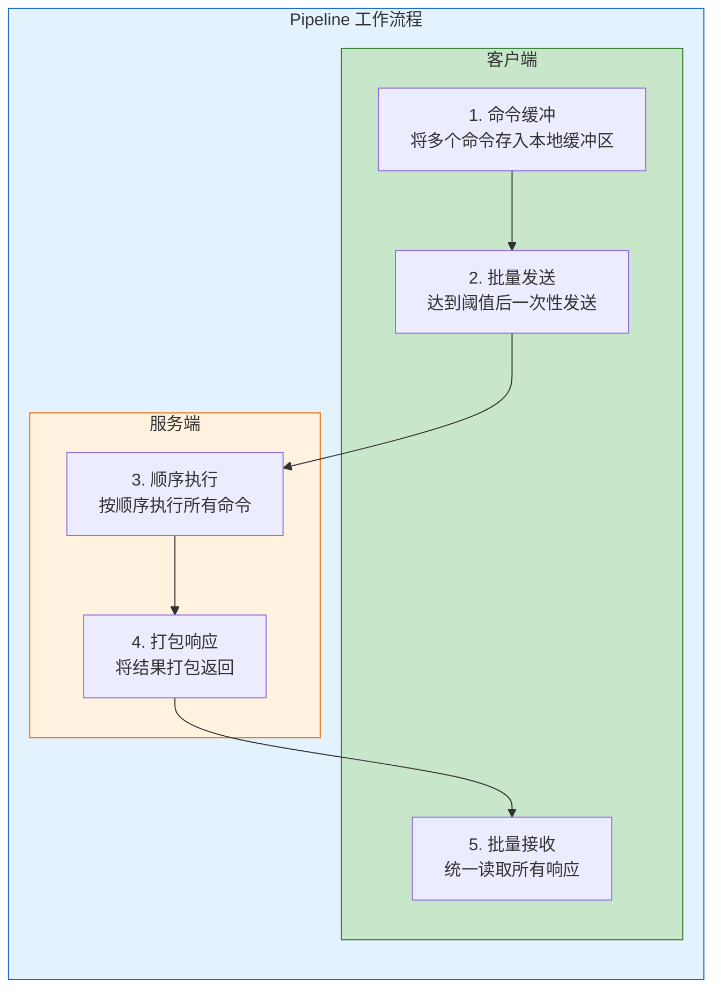

**三个关键阶段**：

| 阶段 | 客户端操作 | 服务端操作 |
|------|-----------|-----------|
| **缓冲** | 将多个命令存入本地缓冲区 | - |
| **发送** | 达到阈值后一次性发送到服务端 | 接收命令序列 |
| **执行** | - | 按顺序执行，打包响应 |
| **接收** | 统一读取所有响应结果 | - |

### 3.2 协议特性

Redis 使用基于 TCP 的 RESP（Redis Serialization Protocol）协议，支持：

| 特性 | 说明 |
|------|------|
| **多命令合并发送** | 遵守 RESP 协议格式，多个命令可合并为一个 TCP 报文 |
| **响应顺序保证** | 先进先出原则，响应顺序与命令顺序严格一致 |
| **无状态处理** | 服务端不需要维护 Pipeline 状态 |

### 3.3 工作流程详解

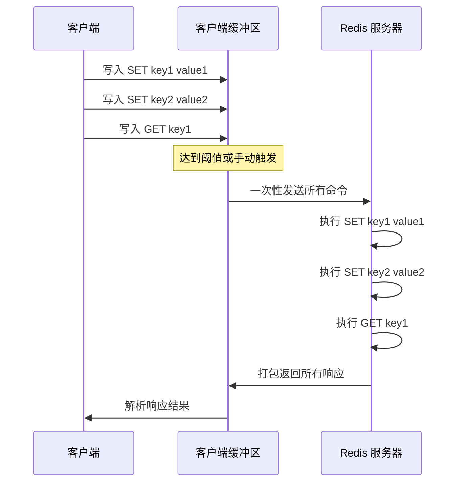

***

## 四、Pipeline 与其他机制对比

### 4.1 Pipeline vs 普通命令 vs 事务 vs Lua 脚本

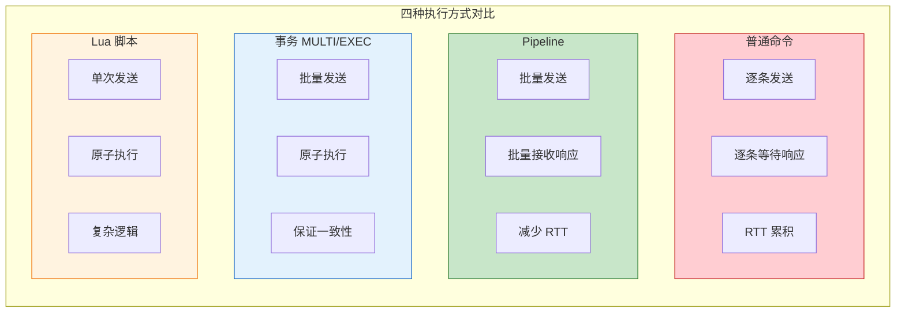

### 4.2 详细对比表

| 对比维度 | 普通命令 | Pipeline | 事务 (MULTI/EXEC) | Lua 脚本 |
|---------|---------|----------|------------------|----------|
| **网络交互** | N 次 RTT | 1 次 RTT | 1 次 RTT | 1 次 RTT |
| **原子性** | ❌ 无 | ❌ 无 | ✅ 有 | ✅ 有 |
| **执行顺序** | 可能穿插 | 可能穿插 | 顺序执行 | 顺序执行 |
| **其他命令插入** | 可能 | 可能 | ❌ 不可能 | ❌ 不可能 |
| **复杂逻辑** | ❌ 不支持 | ❌ 不支持 | ❌ 不支持 | ✅ 支持 |
| **错误处理** | 独立处理 | 独立处理 | 部分支持 | 完整支持 |
| **主要优势** | 简单 | 高性能 | 原子性 | 原子性 + 复杂逻辑 |
| **适用场景** | 单命令操作 | 批量读写 | 简单原子操作 | 复杂原子操作 |

### 4.3 Pipeline 与事务的核心区别

```mermaid
flowchart TB
    subgraph PipelineExec["Pipeline 执行过程"]
        P1["命令1 执行"] --> P2["回到事件循环"]
        P2 --> P3["可能执行其他客户端命令"]
        P3 --> P4["命令2 执行"]
        P4 --> P5["回到事件循环"]
        P5 --> P6["可能执行其他客户端命令"]
    end
    
    subgraph TransactionExec["事务执行过程"]
        T1["MULTI 开始"] --> T2["命令1 执行（入队）"]
        T2 --> T3["命令2 执行（入队）"]
        T3 --> T4["EXEC 触发"]
        T4 --> T5["原子执行所有命令"]
        T5 --> T6["其他命令才能插入"]
    end
    
    style PipelineExec fill:#e3f2fd,stroke:#1565c0
    style TransactionExec fill:#c8e6c9,stroke:#2e7d32
```

**关键区别**：

| 特性 | Pipeline | 事务 |
|------|----------|------|
| **命令执行** | 命令是"散装"的，可能被其他客户端命令穿插 | 命令是"封装好的原子包"，不可穿插 |
| **原子性** | ❌ 不保证 | ✅ 保证 |
| **性能** | 更高（无事务开销） | 略低（需要事务管理） |

***

## 五、Pipeline 使用场景

### 5.1 适用场景

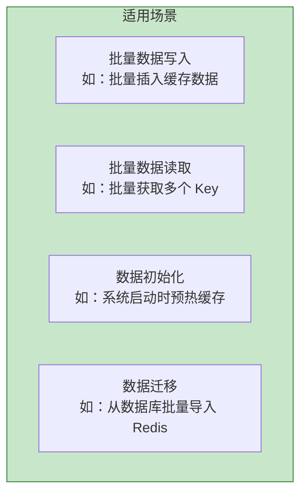

| 场景 | 说明 | 示例 |
|------|------|------|
| **批量写入** | 大量 SET/HSET 操作 | 批量导入用户信息 |
| **批量读取** | 大量 GET/HGET 操作 | 批量获取商品信息 |
| **缓存预热** | 系统启动时加载数据 | 预加载热点数据 |
| **数据同步** | 批量同步数据 | 从 MySQL 同步到 Redis |

### 5.2 不适用场景

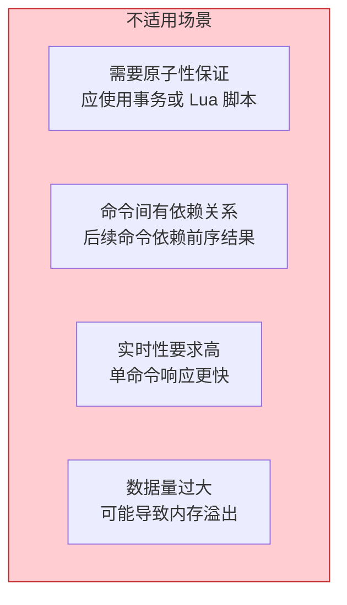

| 场景 | 原因 | 替代方案 |
|------|------|---------|
| **需要原子性** | Pipeline 不保证原子性 | 使用事务或 Lua 脚本 |
| **命令依赖** | 后续命令依赖前序结果 | 普通命令或 Lua 脚本 |
| **实时响应** | 需要立即得到结果 | 普通命令 |
| **超大批量** | 可能导致内存问题 | 分批处理 |

***

## 六、Pipeline 实战示例

### 6.1 Jedis 实现

```java
public class RedisPipelineExample {
    
    private Jedis jedis;
    
    public void pipelineSet() {
        Pipeline pipeline = jedis.pipelined();
        
        for (int i = 0; i < 10000; i++) {
            pipeline.set("key:" + i, "value:" + i);
        }
        
        List<Object> results = pipeline.syncAndReturnAll();
        System.out.println("批量写入完成，共 " + results.size() + " 条");
    }
    
    public void pipelineGet() {
        Pipeline pipeline = jedis.pipelined();
        
        for (int i = 0; i < 10000; i++) {
            pipeline.get("key:" + i);
        }
        
        List<Object> results = pipeline.syncAndReturnAll();
        System.out.println("批量读取完成，共 " + results.size() + " 条");
    }
    
    public void pipelineWithTransaction() {
        Pipeline pipeline = jedis.pipelined();
        pipeline.multi();
        
        pipeline.set("key1", "value1");
        pipeline.set("key2", "value2");
        pipeline.incr("counter");
        
        Response<List<Object>> response = pipeline.exec();
        pipeline.sync();
        
        List<Object> results = response.get();
        System.out.println("事务执行完成");
    }
}
```

### 6.2 Redisson 实现

```java
public class RedissonPipelineExample {
    
    private RedissonClient redisson;
    
    public void batchOperation() {
        RBatch batch = redisson.createBatch();
        
        for (int i = 0; i < 10000; i++) {
            batch.getMap("user:" + i).fastPutAsync("name", "user" + i);
        }
        
        BatchResult<?> result = batch.execute();
        System.out.println("批量操作完成，共 " + result.getResponses().size() + " 条");
    }
    
    public void batchWithTimeout() {
        RBatch batch = redisson.createBatch();
        
        batch.getMap("cache").fastPutAsync("key1", "value1");
        batch.getMap("cache").fastPutAsync("key2", "value2");
        batch.getMap("cache").getAsync("key1");
        
        BatchResult<?> result = batch.execute();
        System.out.println("响应数量: " + result.getResponses().size());
    }
}
```

### 6.3 Spring Data Redis 实现

```java
@Service
public class RedisPipelineService {
    
    @Autowired
    private RedisTemplate<String, String> redisTemplate;
    
    public void pipelineExecute() {
        List<Object> results = redisTemplate.executePipelined(
            (RedisCallback<Object>) connection -> {
                for (int i = 0; i < 10000; i++) {
                    connection.stringCommands().set(
                        ("key:" + i).getBytes(),
                        ("value:" + i).getBytes()
                    );
                }
                return null;
            }
        );
        System.out.println("批量写入完成，共 " + results.size() + " 条");
    }
    
    public List<Object> pipelineGet(List<String> keys) {
        return redisTemplate.executePipelined(
            (RedisCallback<Object>) connection -> {
                for (String key : keys) {
                    connection.stringCommands().get(key.getBytes());
                }
                return null;
            }
        );
    }
}
```

### 6.4 Python redis-py 实现

```python
import redis

r = redis.Redis(host='localhost', port=6379, db=0)

def pipeline_set():
    pipe = r.pipeline()
    for i in range(10000):
        pipe.set(f'key:{i}', f'value:{i}')
    results = pipe.execute()
    print(f'批量写入完成，共 {len(results)} 条')

def pipeline_get():
    pipe = r.pipeline()
    for i in range(10000):
        pipe.get(f'key:{i}')
    results = pipe.execute()
    print(f'批量读取完成，共 {len(results)} 条')

def pipeline_with_transaction():
    pipe = r.pipeline(transaction=True)
    pipe.set('key1', 'value1')
    pipe.set('key2', 'value2')
    pipe.incr('counter')
    results = pipe.execute()
    print(f'事务执行完成: {results}')
```

***

## 七、性能优化建议

### 7.1 批量大小选择

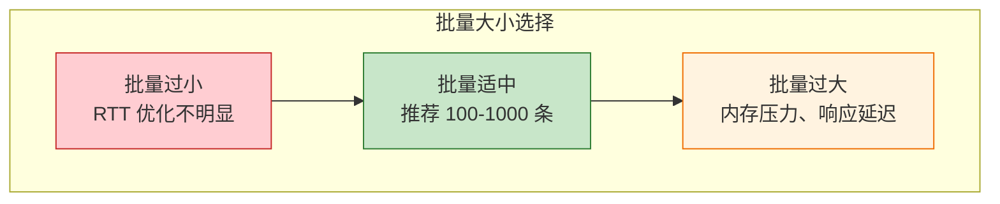

| 批量大小 | 优点 | 缺点 | 建议 |
|---------|------|------|------|
| **< 100** | 响应快 | RTT 优化有限 | 不推荐 |
| **100-1000** | 平衡性能与内存 | - | ✅ 推荐 |
| **> 10000** | RTT 最优 | 内存压力大、响应延迟 | 谨慎使用 |

### 7.2 分批处理策略

```java
public void batchInsert(List<User> users) {
    int batchSize = 500;
    List<List<User>> batches = Lists.partition(users, batchSize);
    
    for (List<User> batch : batches) {
        Pipeline pipeline = jedis.pipelined();
        for (User user : batch) {
            pipeline.hset("user:" + user.getId(), 
                Map.of("name", user.getName(), "age", String.valueOf(user.getAge())));
        }
        pipeline.sync();
    }
}
```

### 7.3 注意事项

| 注意事项 | 说明 |
|---------|------|
| **内存控制** | Pipeline 期间所有响应缓存在内存，注意控制批量大小 |
| **超时设置** | 合理设置超时时间，避免大批量操作超时 |
| **错误处理** | 单个命令失败不影响其他命令，需逐个检查响应 |
| **网络带宽** | 大批量数据可能占用大量带宽，影响其他请求 |

### 7.4 性能测试对比

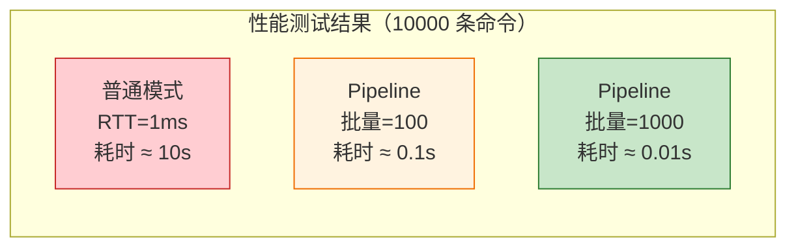

***

## 八、常见问题

### 8.1 Pipeline 是否原子执行？

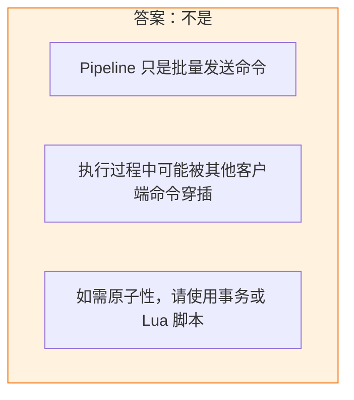

**示例说明**：

```
客户端 A Pipeline: SET a 1, SET b 2
客户端 B 命令: SET a 100

可能的执行顺序:
SET a 1 (A)
SET a 100 (B) ← 插入执行
SET b 2 (A)

最终结果: a = 100, b = 2
```

### 8.2 Pipeline 与 mget/mset 的区别？

| 对比项 | mget/mset | Pipeline |
|--------|-----------|----------|
| **命令类型** | 单条命令 | 多条命令组合 |
| **操作类型** | 仅支持同类型操作 | 支持混合操作 |
| **灵活性** | 低 | 高 |
| **适用场景** | 批量 GET/SET | 复杂批量操作 |

**Pipeline 优势**：可以混合不同类型的命令（SET、HSET、LPUSH 等）。

### 8.3 如何处理 Pipeline 中的错误？

```java
public void handleErrors() {
    Pipeline pipeline = jedis.pipelined();
    
    pipeline.set("key1", "value1");
    pipeline.incr("key2");
    pipeline.hset("key3", "field", "value");
    pipeline.incr("key3");
    
    List<Object> results = pipeline.syncAndReturnAll();
    
    for (int i = 0; i < results.size(); i++) {
        Object result = results.get(i);
        if (result instanceof JedisDataException) {
            System.err.println("命令 " + i + " 执行失败: " + result);
        } else {
            System.out.println("命令 " + i + " 执行成功: " + result);
        }
    }
}
```

***

## 九、最佳实践总结

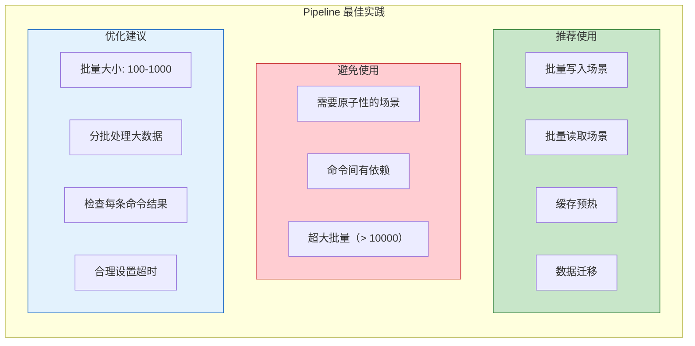

### 9.1 使用建议清单

| 建议 | 说明 |
|------|------|
| ✅ 批量大小适中 | 推荐 100-1000 条命令 |
| ✅ 分批处理 | 大数据量分多次 Pipeline |
| ✅ 检查响应 | 逐个检查命令执行结果 |
| ✅ 设置超时 | 根据批量大小调整超时时间 |
| ❌ 不要过度使用 | 小批量操作收益有限 |
| ❌ 不要期望原子性 | 需要原子性请用事务或 Lua |

***

## 参考资料

- [Redis Pipelining | Redis 官方文档](https://redis.ac.cn/docs/latest/develop/use/pipelining/)
- [Redis 管道(Pipeline)深度解析:原理、场景与实战](https://blog.csdn.net/qq_67342067/article/details/146114011)
- [Redis管道(Pipeline)详解:提升批量操作性能的「神技」](https://blog.csdn.net/2501_92540271/article/details/150761433)
- [Redis 中的 Pipeline 与 Lua 脚本:高性能与原子性的两种武器](https://blog.csdn.net/m0_65555692/article/details/157467799)
