# Redis 缓存穿透、击穿、雪崩详解

## 一、问题概述

在使用 Redis 缓存的高并发系统中，缓存穿透、击穿、雪崩是三大经典问题，它们都会导致大量请求直接打到数据库，可能造成数据库崩溃、系统瘫痪。

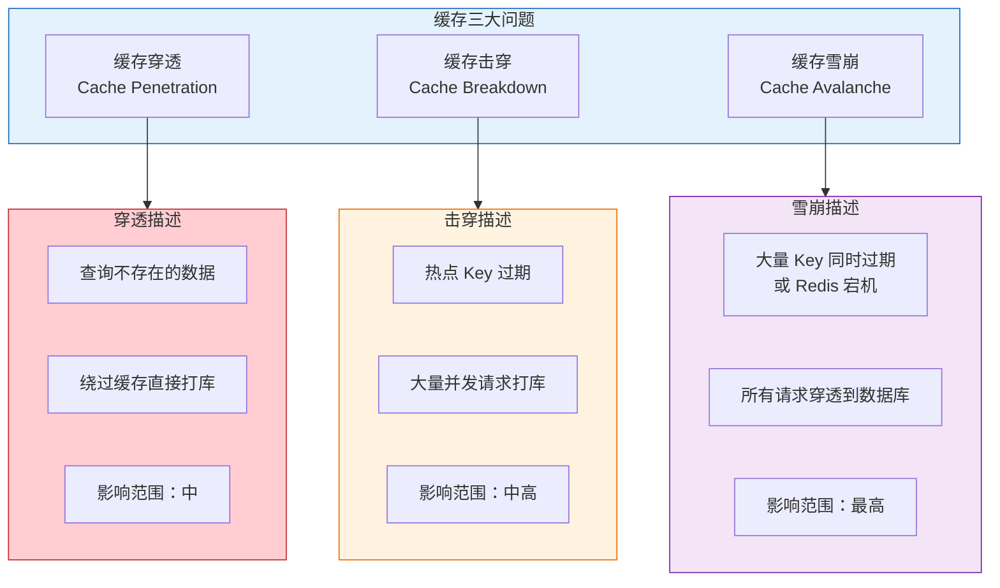

### 1.1 三大问题对比

| 问题 | 触发场景 | 影响范围 | 核心特征 |
|------|----------|----------|----------|
| **缓存穿透** | 查询根本不存在的数据 | 中 | 缓存和数据库都没有 |
| **缓存击穿** | 热点 Key 过期瞬间 | 中高 | 单点热点，高并发 |
| **缓存雪崩** | 大量 Key 同时过期或 Redis 宕机 | 最高 | 大面积失效 |

---

## 二、缓存穿透

### 2.1 问题场景

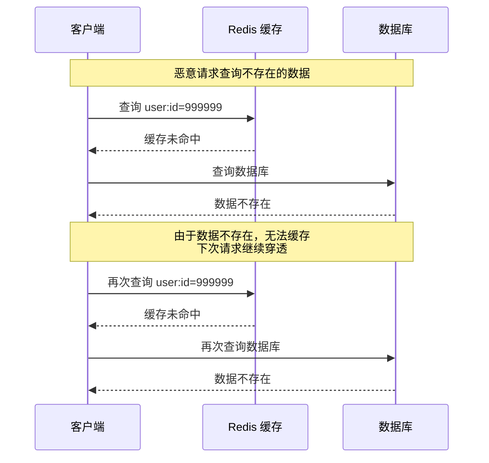

**缓存穿透的原因**：

| 原因 | 说明 |
|------|------|
| **恶意攻击** | 攻击者故意请求不存在的数据，绕过缓存 |
| **业务缺陷** | 业务逻辑错误，产生大量无效查询 |
| **数据删除** | 数据被删除，但缓存未同步清理 |

### 2.2 解决方案

#### 方案一：缓存空值

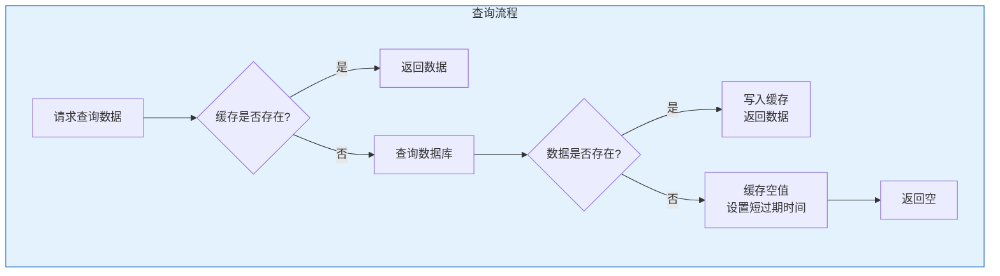

**代码示例**：

```java
public User getUserById(Long id) {
    String key = "user:" + id;
    String value = redis.get(key);
    
    if (value != null) {
        if ("NULL".equals(value)) {
            return null;
        }
        return JSON.parseObject(value, User.class);
    }
    
    User user = userMapper.selectById(id);
    
    if (user != null) {
        redis.set(key, JSON.toJSONString(user), 3600);
    } else {
        redis.set(key, "NULL", 300);
    }
    
    return user;
}
```

**优缺点**：

| 优点 | 缺点 |
|------|------|
| 实现简单 | 占用额外内存 |
| 有效减少数据库压力 | 需要设置合理的过期时间 |
| | 可能存在数据不一致 |

#### 方案二：布隆过滤器

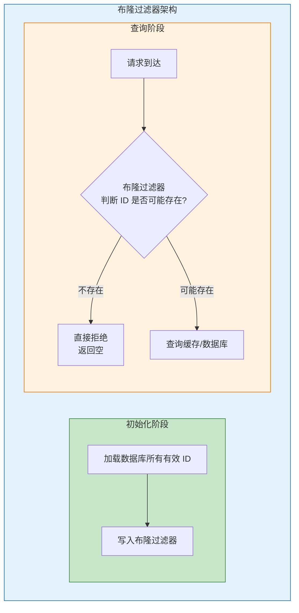

**布隆过滤器原理**：

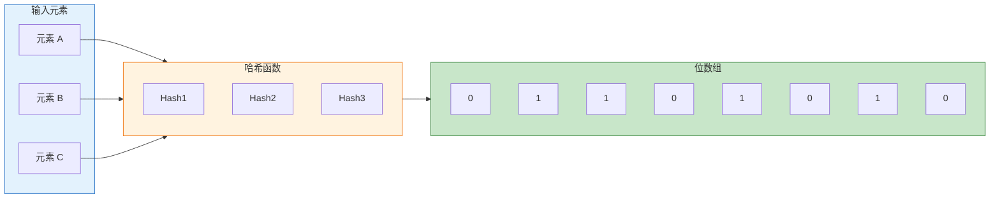

**布隆过滤器特点**：

| 特性 | 说明 |
|------|------|
| **空间效率高** | 使用位数组，占用内存小 |
| **查询速度快** | O(k) 时间复杂度，k 为哈希函数数量 |
| **存在误判** | 可能判断存在但实际不存在（假阳性） |
| **不存在误判** | 判断不存在则一定不存在 |

**Redisson 实现示例**：

```java
@Configuration
public class BloomFilterConfig {
    
    @Bean
    public RBloomFilter<Long> userBloomFilter(RedissonClient redisson) {
        RBloomFilter<Long> bloomFilter = redisson.getBloomFilter("user:bloom");
        bloomFilter.tryInit(1000000L, 0.01);
        return bloomFilter;
    }
}

@Service
public class UserService {
    
    @Autowired
    private RBloomFilter<Long> userBloomFilter;
    
    public User getUserById(Long id) {
        if (!userBloomFilter.contains(id)) {
            return null;
        }
        
        String key = "user:" + id;
        String value = redis.get(key);
        
        if (value != null) {
            return JSON.parseObject(value, User.class);
        }
        
        User user = userMapper.selectById(id);
        if (user != null) {
            redis.set(key, JSON.toJSONString(user), 3600);
        }
        
        return user;
    }
}
```

#### 方案三：接口层校验

```java
@GetMapping("/user/{id}")
public Result getUser(@PathVariable Long id) {
    if (id == null || id <= 0) {
        return Result.error("参数错误");
    }
    
    if (!isValidId(id)) {
        return Result.error("无效ID");
    }
    
    return Result.success(userService.getUserById(id));
}
```

### 2.3 方案对比

| 方案 | 优点 | 缺点 | 适用场景 |
|------|------|------|----------|
| **缓存空值** | 实现简单 | 占用内存、数据不一致 | 数据量小、穿透频率低 |
| **布隆过滤器** | 内存占用小、效率高 | 存在误判、需要预热 | 数据量大、穿透频率高 |
| **接口校验** | 提前拦截 | 无法防止所有情况 | 参数校验、基础防护 |

---

## 三、缓存击穿

### 3.1 问题场景

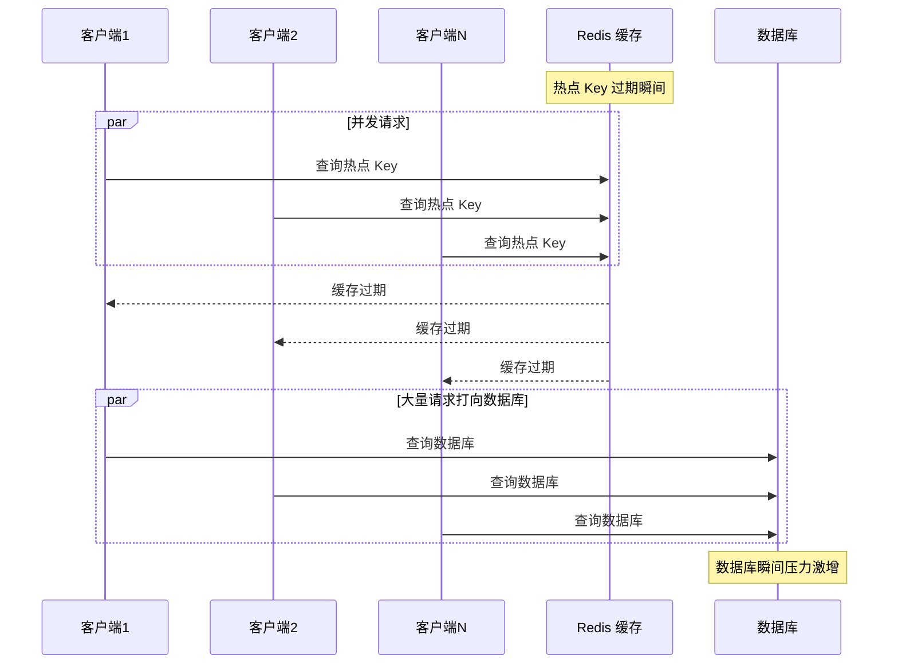

**缓存击穿的原因**：

| 原因 | 说明 |
|------|------|
| **热点数据过期** | 高频访问的 Key 恰好过期 |
| **缓存未命中** | 大量并发请求同时发现缓存失效 |
| **无保护机制** | 没有限制并发查询数据库 |

### 3.2 解决方案

#### 方案一：互斥锁（分布式锁）

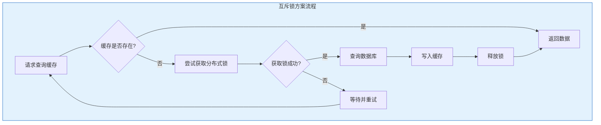

**代码示例**：

```java
public User getUserWithLock(Long id) {
    String key = "user:" + id;
    String lockKey = "lock:user:" + id;
    
    String value = redis.get(key);
    if (value != null) {
        return JSON.parseObject(value, User.class);
    }
    
    try {
        boolean locked = redis.setnx(lockKey, "1", 10);
        if (locked) {
            User user = userMapper.selectById(id);
            if (user != null) {
                redis.set(key, JSON.toJSONString(user), 3600);
            }
            return user;
        } else {
            Thread.sleep(50);
            return getUserWithLock(id);
        }
    } catch (InterruptedException e) {
        Thread.currentThread().interrupt();
        return null;
    } finally {
        redis.del(lockKey);
    }
}
```

**双重检测优化**：

```java
public User getUserWithDoubleCheck(Long id) {
    String key = "user:" + id;
    String lockKey = "lock:user:" + id;
    
    String value = redis.get(key);
    if (value != null) {
        return JSON.parseObject(value, User.class);
    }
    
    try {
        boolean locked = redis.setnx(lockKey, "1", 10);
        if (locked) {
            value = redis.get(key);
            if (value != null) {
                return JSON.parseObject(value, User.class);
            }
            
            User user = userMapper.selectById(id);
            if (user != null) {
                redis.set(key, JSON.toJSONString(user), 3600);
            }
            return user;
        } else {
            Thread.sleep(50);
            return getUserWithDoubleCheck(id);
        }
    } catch (InterruptedException e) {
        Thread.currentThread().interrupt();
        return null;
    } finally {
        redis.del(lockKey);
    }
}
```

#### 方案二：逻辑过期

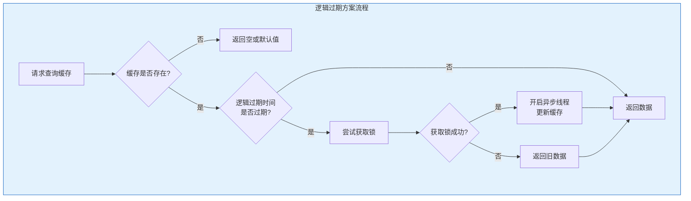

**数据结构设计**：

```java
@Data
public class CacheData<T> {
    private T data;
    private Long expireTime;
}
```

**代码示例**：

```java
public User getUserWithLogicalExpire(Long id) {
    String key = "user:" + id;
    String lockKey = "lock:user:" + id;
    
    String value = redis.get(key);
    if (value == null) {
        return null;
    }
    
    CacheData<User> cacheData = JSON.parseObject(value, 
        new TypeReference<CacheData<User>>(){});
    
    if (cacheData.getExpireTime() > System.currentTimeMillis()) {
        return cacheData.getData();
    }
    
    if (redis.setnx(lockKey, "1", 10)) {
        executorService.submit(() -> {
            try {
                User user = userMapper.selectById(id);
                CacheData<User> newData = new CacheData<>();
                newData.setData(user);
                newData.setExpireTime(System.currentTimeMillis() + 3600000L);
                redis.set(key, JSON.toJSONString(newData));
            } finally {
                redis.del(lockKey);
            }
        });
    }
    
    return cacheData.getData();
}
```

#### 方案三：热点 Key 永不过期

```java
public void cacheHotData(Long id) {
    User user = userMapper.selectById(id);
    if (user != null) {
        redis.set("user:" + id, JSON.toJSONString(user));
    }
}

@Scheduled(fixedRate = 3600000)
public void refreshHotData() {
    List<Long> hotIds = getHotUserIds();
    for (Long id : hotIds) {
        cacheHotData(id);
    }
}
```

### 3.3 方案对比

| 方案 | 一致性 | 性能 | 复杂度 | 适用场景 |
|------|--------|------|--------|----------|
| **互斥锁** | 强一致 | 有等待延迟 | 中 | 对一致性要求高 |
| **逻辑过期** | 最终一致 | 无阻塞 | 高 | 对性能要求高 |
| **永不过期** | 最终一致 | 最高 | 低 | 热点数据、定时更新 |

---

## 四、缓存雪崩

### 4.1 问题场景

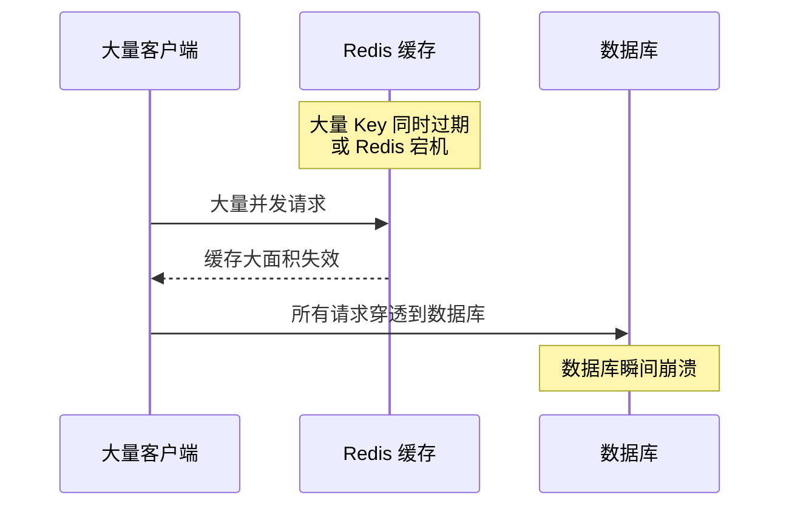

**缓存雪崩的原因**：

| 原因 | 说明 |
|------|------|
| **同时过期** | 大量 Key 设置了相同的过期时间 |
| **Redis 宕机** | Redis 服务故障，缓存不可用 |
| **缓存预热失败** | 系统启动时缓存未预热 |

### 4.2 解决方案

#### 方案一：过期时间随机化

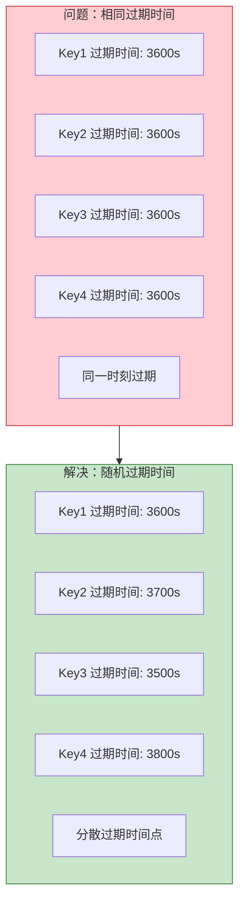

**代码示例**：

```java
public void setWithRandomExpire(String key, String value, long baseExpire) {
    Random random = new Random();
    long randomExpire = baseExpire + random.nextInt(600);
    redis.set(key, value, randomExpire);
}
```

#### 方案二：多级缓存

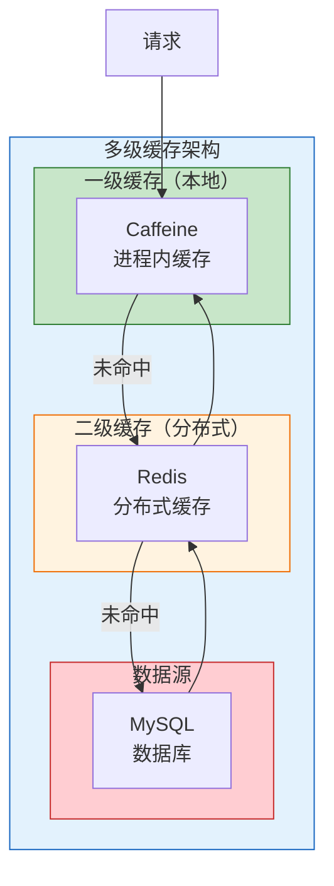

**Spring Cache + Caffeine + Redis 实现**：

```java
@Configuration
public class CacheConfig {
    
    @Bean
    public CacheManager cacheManager(RedisConnectionFactory factory) {
        List<CaffeineCache> caches = new ArrayList<>();
        caches.add(new CaffeineCache("user", 
            Caffeine.newBuilder()
                .expireAfterWrite(300, TimeUnit.SECONDS)
                .maximumSize(1000)
                .build()));
        
        RedisCacheConfiguration config = RedisCacheConfiguration.defaultCacheConfig()
            .entryTtl(Duration.ofSeconds(3600));
        
        return new CompositeCacheManager(
            new CaffeineCacheManager(),
            RedisCacheManager.builder(factory).cacheDefaults(config).build()
        );
    }
}
```

#### 方案三：熔断降级

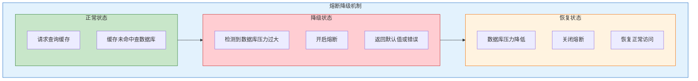

**Sentinel 熔断配置**：

```java
@Service
public class UserService {
    
    @SentinelResource(value = "getUserById", 
        blockHandler = "handleBlock",
        fallback = "handleFallback")
    public User getUserById(Long id) {
        return userMapper.selectById(id);
    }
    
    public User handleBlock(Long id, BlockException ex) {
        return getDefaultUser();
    }
    
    public User handleFallback(Long id, Throwable ex) {
        return getDefaultUser();
    }
    
    private User getDefaultUser() {
        User user = new User();
        user.setId(-1L);
        user.setName("默认用户");
        return user;
    }
}
```

#### 方案四：Redis 高可用

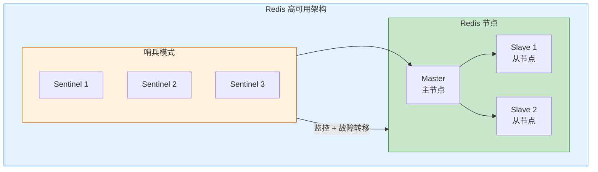

### 4.3 方案对比

| 方案 | 作用 | 优点 | 缺点 |
|------|------|------|------|
| **过期时间随机化** | 防止同时过期 | 实现简单 | 无法防止 Redis 宕机 |
| **多级缓存** | 多层保护 | 高可用 | 数据一致性复杂 |
| **熔断降级** | 保护数据库 | 防止级联故障 | 用户体验下降 |
| **Redis 高可用** | 防止宕机 | 自动故障转移 | 架构复杂 |

---

## 五、综合对比与最佳实践

### 5.1 三大问题对比总结

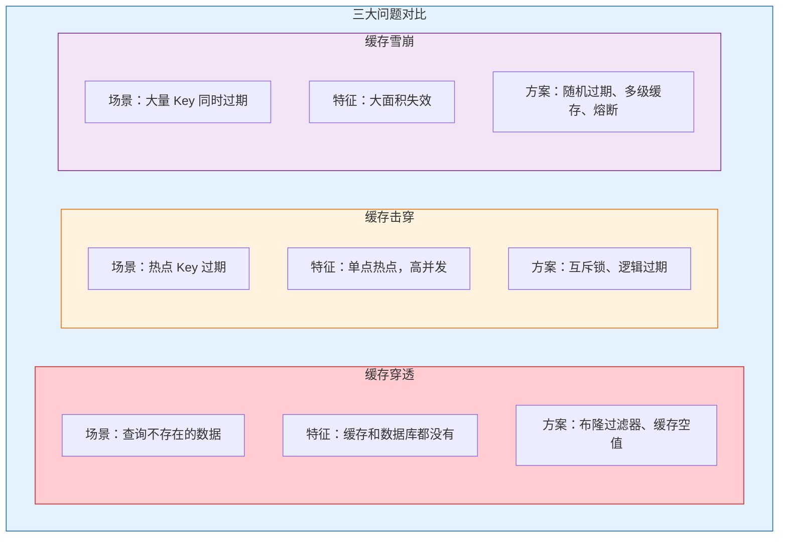

### 5.2 最佳实践

| 场景 | 推荐方案 |
|------|----------|
| **防止穿透** | 布隆过滤器 + 接口参数校验 |
| **防止击穿** | 互斥锁（强一致）或 逻辑过期（高性能） |
| **防止雪崩** | 过期时间随机化 + 多级缓存 + 熔断降级 |
| **高可用** | Redis 集群/哨兵 + 本地缓存兜底 |

### 5.3 面试高频问题

| 问题 | 答案要点 |
|------|----------|
| **三大问题区别** | 穿透是数据不存在，击穿是热点过期，雪崩是大面积失效 |
| **布隆过滤器原理** | 位数组 + 多哈希，存在误判但不会漏判 |
| **互斥锁 vs 逻辑过期** | 互斥锁强一致有阻塞，逻辑过期高性能最终一致 |
| **如何设计缓存** | 多级缓存 + 随机过期 + 熔断降级 + 高可用 |

---

## 参考资料

- [Redis 缓存穿透、击穿、雪崩解决方案](https://blog.csdn.net/m0_73784704/article/details/152006873)
- [Redis 布隆过滤器原理与应用](https://blog.csdn.net/zhang_hao_chao/article/details/132219157)
- [Redis 缓存三大核心问题](https://blog.csdn.net/weixin_43290370/article/details/154689046)
