# RocketMQ 消息中间件详解

## 一、RocketMQ 概述

### 1.1 什么是 RocketMQ？

Apache RocketMQ 是阿里巴巴开源的分布式消息中间件，专为金融级高可靠场景设计。它具有高吞吐、低延迟、高可用等特点，支持顺序消息、事务消息、延迟消息等高级特性。

### 1.2 RocketMQ 核心特性

| 特性 | 说明 |
|------|------|
| **高吞吐量** | 单机 TPS 可达 10 万级 |
| **低延迟** | 毫秒级消息投递延迟 |
| **高可用** | 主从架构，支持故障切换 |
| **顺序消息** | 保证消息按发送顺序消费 |
| **事务消息** | 分布式事务最终一致性 |
| **延迟消息** | 支持任意时间延迟投递 |
| **消息回溯** | 支持按时间重新消费 |
| **消息过滤** | Tag 和 SQL92 过滤 |

### 1.3 应用场景

| 场景 | 说明 |
|------|------|
| **异步解耦** | 将同步调用转为异步，提升响应速度 |
| **流量削峰** | 高峰期消息堆积，平滑处理请求 |
| **分布式事务** | 事务消息保证最终一致性 |
| **订单超时取消** | 延迟消息实现定时任务 |
| **日志收集** | 统一日志收集与处理 |

---

## 二、RocketMQ 核心架构

### 2.1 架构组件

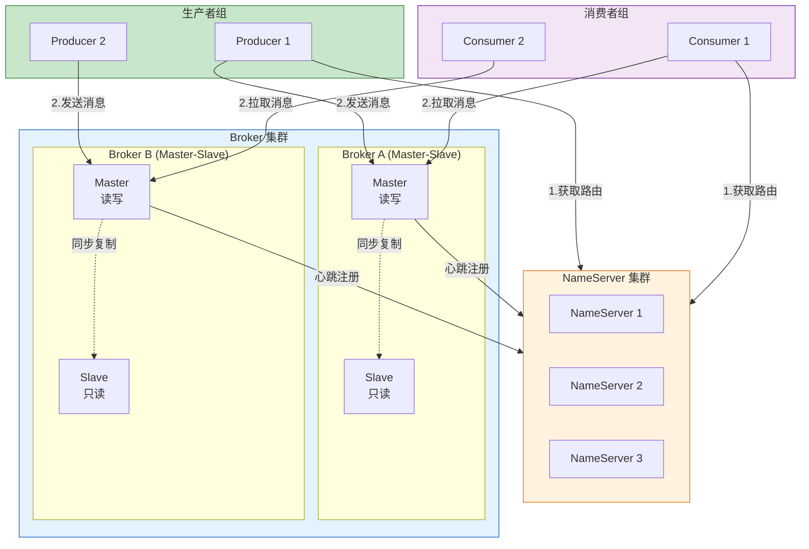

### 2.2 核心组件说明

| 组件 | 说明 | 职责 |
|------|------|------|
| **NameServer** | 路由注册中心 | 管理 Broker 路由信息，提供路由查找服务 |
| **Broker** | 消息服务器 | 消息存储、转发，主从复制 |
| **Producer** | 消息生产者 | 发送消息的应用 |
| **Consumer** | 消息消费者 | 接收消息的应用 |

### 2.3 NameServer 工作原理

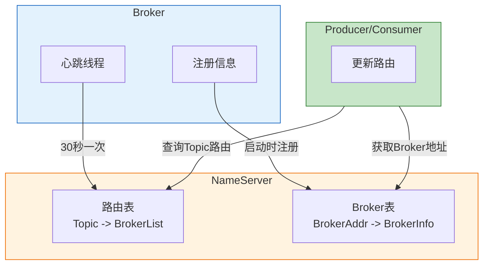

**NameServer 特点**：

| 特点 | 说明 |
|------|------|
| **无状态** | 节点之间互不通信，各自独立 |
| **轻量级** | 不需要 Zookeeper，降低运维复杂度 |
| **最终一致性** | Broker 心跳注册，路由信息最终一致 |
| **高可用** | 多节点部署，任意节点可提供服务 |

### 2.4 Broker 存储架构

RocketMQ 采用混合型存储结构，Broker 单个实例下所有队列共用一个 CommitLog 日志数据文件存储消息主体。

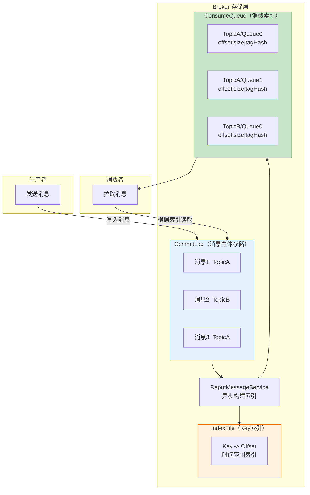

**核心存储文件详解**：

| 文件 | 存储路径 | 文件大小 | 说明 |
|------|----------|----------|------|
| **CommitLog** | `$HOME/store/commitlog/` | 单文件 1G | 消息主体存储，顺序写入 |
| **ConsumeQueue** | `$HOME/store/consumequeue/{topic}/{queueId}/` | 单文件 5.72M | 消费索引，定长 20 字节 |
| **IndexFile** | `$HOME/store/index/` | 单文件 400M | Key 索引，支持按 Key 查询 |

**CommitLog 文件结构**：

```
文件命名规则：起始偏移量（20位数字，左补零）
例如：
00000000000000000000  -> 第一个文件，起始偏移量 0
00000000001073741824  -> 第二个文件，起始偏移量 1G
00000000002147483648  -> 第三个文件，起始偏移量 2G
```

**ConsumeQueue 条目结构**（每个条目固定 20 字节）：

| 字段 | 字节数 | 说明 |
|------|--------|------|
| CommitLog Offset | 8 | 消息在 CommitLog 中的物理偏移量 |
| Message Size | 4 | 消息大小 |
| Tag HashCode | 8 | 消息 Tag 的哈希值，用于过滤 |

**存储流程**：

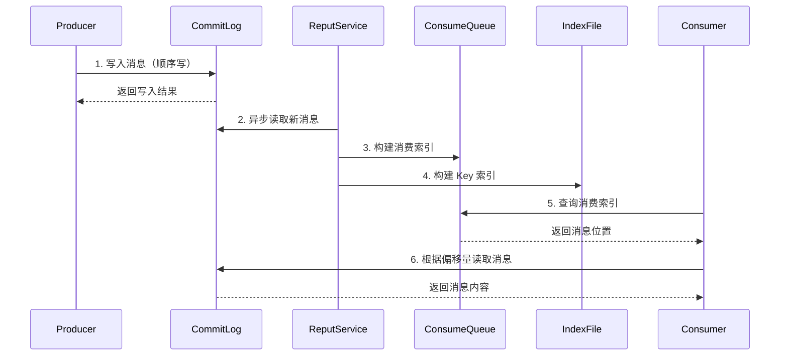

**存储优势**：

| 优势 | 说明 |
|------|------|
| **顺序写入** | CommitLog 顺序写入，性能极高 |
| **零拷贝** | 使用 MMap 内存映射，减少数据拷贝 |
| **异步索引** | ReputService 异步构建索引，不阻塞写入 |
| **快速检索** | ConsumeQueue 定长设计，支持随机访问 |

---

## 三、部署架构

### 3.1 部署模式

RocketMQ 支持多种部署模式，根据业务需求选择合适的架构。

| 模式 | 说明 | 适用场景 | 优缺点 |
|------|------|----------|--------|
| **单 Master** | 单个 Broker 节点 | 开发测试环境 | 简单，但无高可用 |
| **多 Master** | 多个 Master Broker，无 Slave | 允许少量消息丢失 | 高性能，但故障时丢失数据 |
| **多 Master 多 Slave（异步复制）** | Master 异步复制到 Slave | 高可用，允许少量丢失 | 性能高，故障可能丢失少量数据 |
| **多 Master 多 Slave（同步双写）** | Master 同步写入 Slave | 金融级高可靠 | 数据不丢失，性能略低 |

### 3.2 单 Master 模式

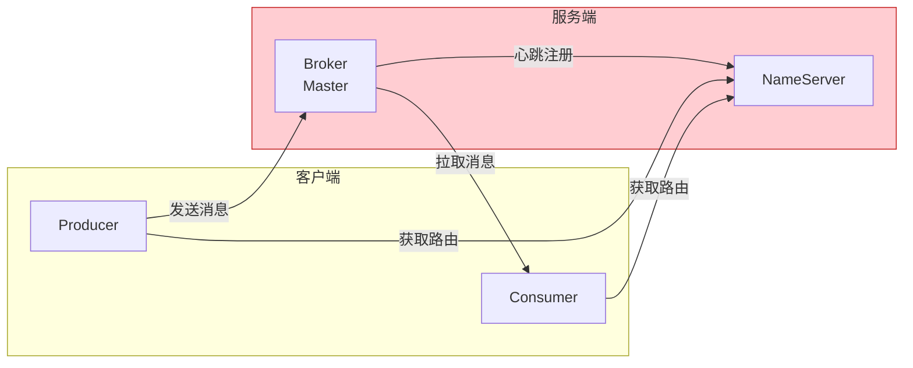

**特点**：
- 架构简单，部署方便
- 无高可用，单点故障风险
- 仅适用于开发测试环境

### 3.3 多 Master 模式

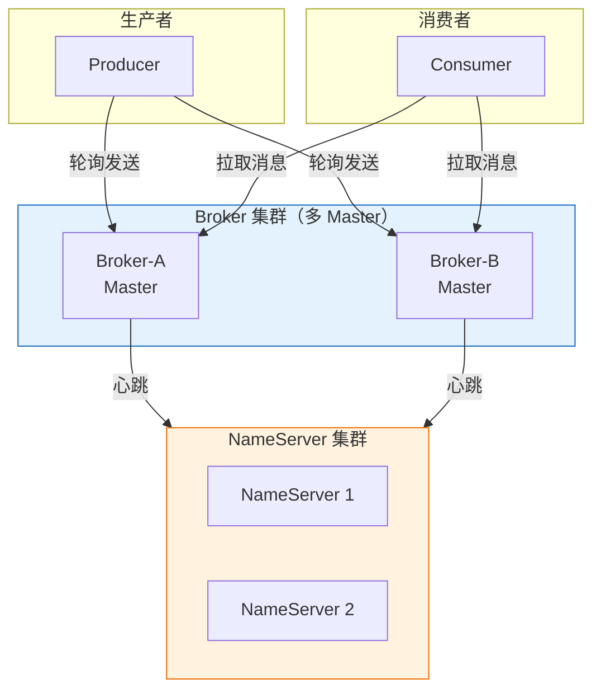

**特点**：
- 多个 Master 负载均衡
- 单个 Master 故障不影响其他
- 故障 Master 上的消息不可用，可能丢失

### 3.4 多 Master 多 Slave 模式

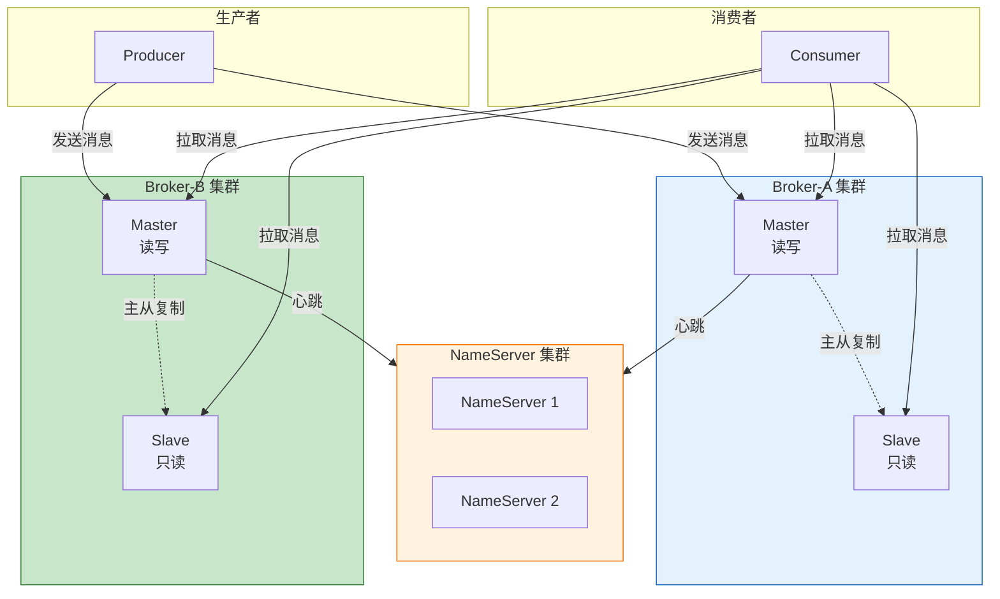

**复制方式对比**：

| 复制方式 | 说明 | 性能 | 可靠性 |
|----------|------|------|--------|
| **异步复制** | Master 写入后立即返回，异步同步到 Slave | 高 | 可能丢失少量数据 |
| **同步双写** | Master 和 Slave 都写入成功后返回 | 较低 | 数据不丢失 |

### 3.5 部署建议

| 场景 | 推荐部署模式 | 说明 |
|------|--------------|------|
| **开发测试** | 单 Master | 资源占用少，部署简单 |
| **一般业务** | 多 Master | 性能高，允许短暂不可用 |
| **重要业务** | 多 Master 多 Slave（异步） | 高可用，性能与可靠性平衡 |
| **金融交易** | 多 Master 多 Slave（同步双写） | 数据不丢失，最高可靠性 |

---

## 四、消息模型

### 4.1 Topic 与 Queue

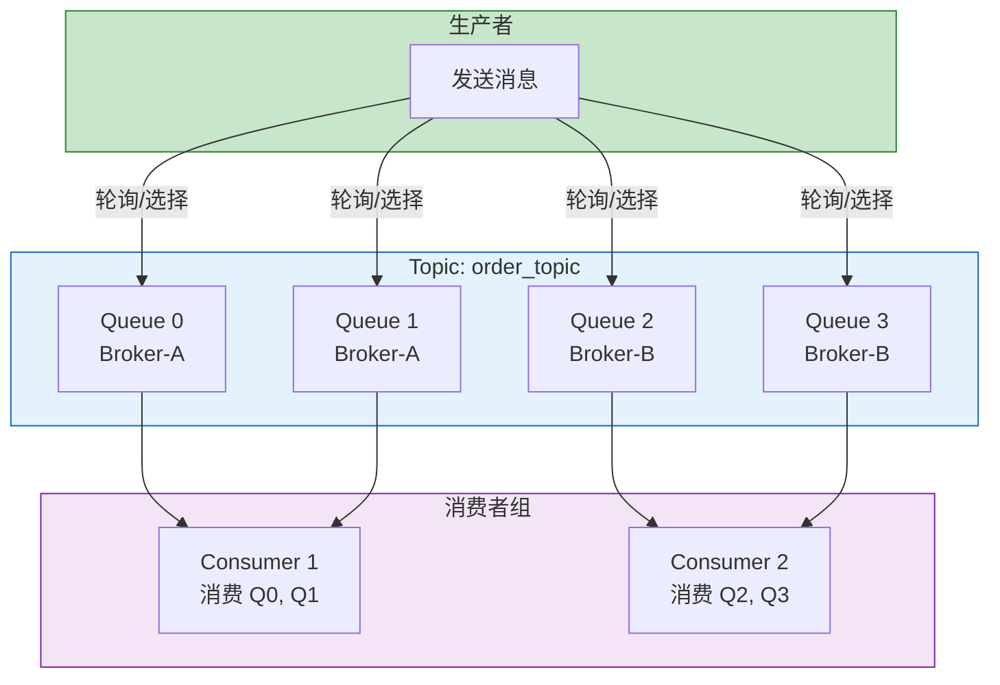

| 概念 | 说明 |
|------|------|
| **Topic** | 消息主题，消息的第一级分类 |
| **Queue** | 消息队列，消息的第二级分类，一个 Topic 包含多个 Queue |
| **Tag** | 消息标签，消息的第三级分类 |

### 4.2 消费模式

| 模式 | 说明 | 特点 |
|------|------|------|
| **集群消费** | 同一消费者组内，每条消息只被一个消费者消费 | 负载均衡，适用于订单处理 |
| **广播消费** | 每条消息被消费者组内所有消费者消费 | 消息广播，适用于配置更新 |

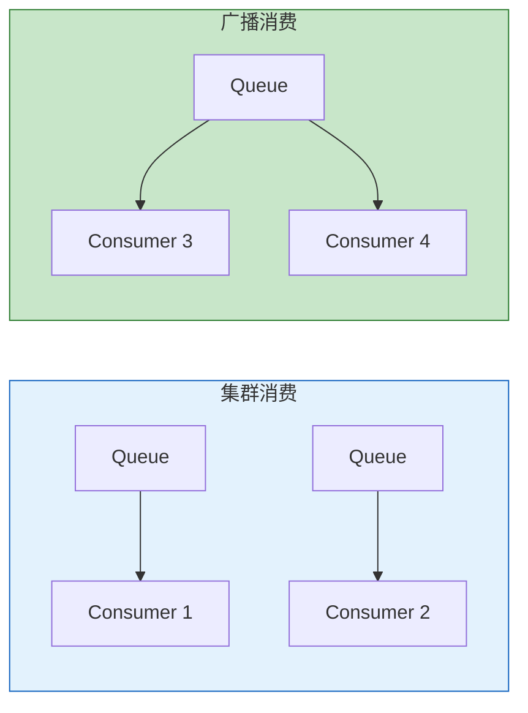

### 4.3 消息消费流程

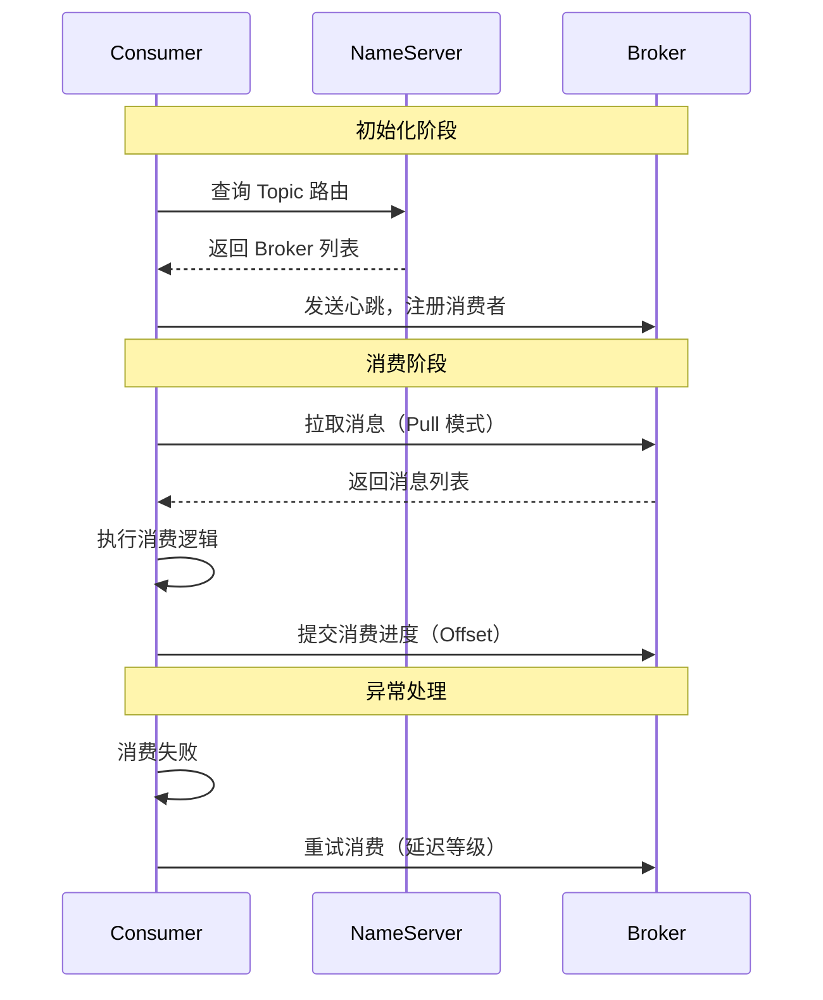

---

## 四、消息发送

### 4.1 发送方式

| 方式 | 说明 | 适用场景 |
|------|------|----------|
| **同步发送** | 发送后等待 Broker 响应 | 重要消息，需要确认 |
| **异步发送** | 发送后立即返回，通过回调获取结果 | 高吞吐场景 |
| **单向发送** | 发送后不等待响应 | 日志收集，允许丢失 |

### 4.2 发送流程

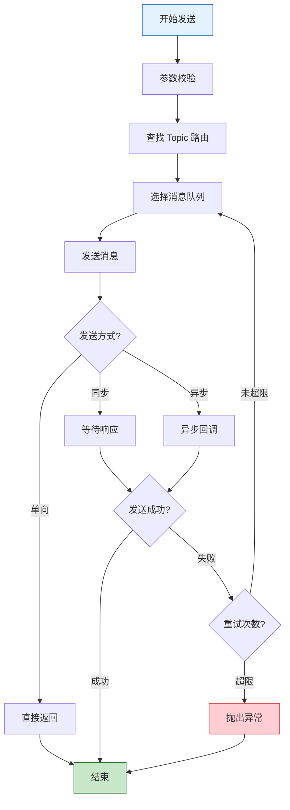

### 4.3 队列选择策略

| 策略 | 说明 | 适用场景 |
|------|------|----------|
| **轮询** | 依次选择队列 | 默认策略，负载均衡 |
| **随机** | 随机选择队列 | 简单场景 |
| **指定队列** | 根据 Key 选择固定队列 | 顺序消息 |
| **自定义** | 实现 MessageQueueSelector | 特殊路由需求 |

### 4.4 消息发送最佳实践

| 实践 | 说明 |
|------|------|
| **合理设置超时** | 根据网络情况设置 sendTimeout |
| **启用重试** | 设置 retryTimesWhenSendFailed |
| **异步发送** | 高吞吐场景使用异步发送 |
| **消息 Key** | 设置唯一 Key 便于查询和去重 |
| **消息压缩** | 大消息启用压缩减少网络开销 |

---

## 五、消息消费

### 5.1 消费模式

| 模式 | 说明 | 特点 |
|------|------|------|
| **Push 模式** | Broker 推送消息给 Consumer | 实时性好，封装了 Pull |
| **Pull 模式** | Consumer 主动拉取消息 | 控制精细，适合批量处理 |

### 5.2 消费进度管理

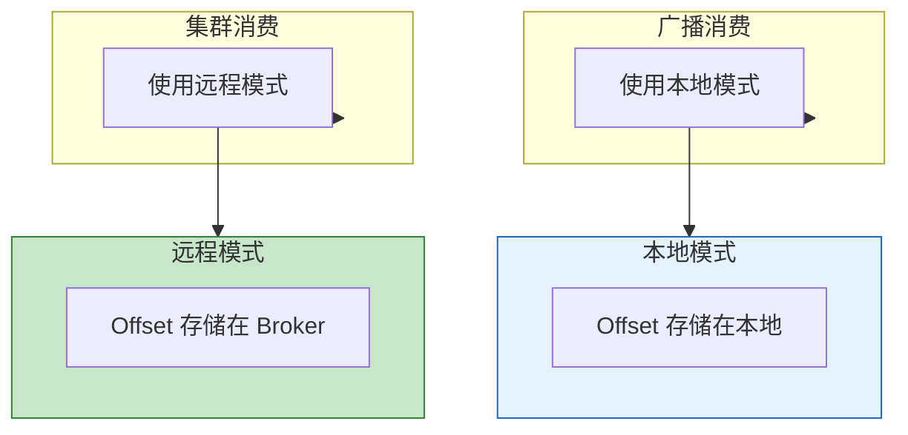

### 5.3 消费重试机制

| 场景 | 处理方式 |
|------|----------|
| **消费失败** | 消息进入重试队列，按延迟等级重试 |
| **重试次数超限** | 消息进入死信队列（DLQ） |
| **消费超时** | 触发重试 |

**延迟等级**：

| 等级 | 延迟时间 |
|------|----------|
| 1 | 1s |
| 2 | 5s |
| 3 | 10s |
| 4 | 30s |
| 5 | 1min |
| 6 | 2min |
| 7 | 3min |
| 8 | 4min |
| 9 | 5min |
| 10 | 6min |
| 11 | 7min |
| 12 | 8min |
| 13 | 9min |
| 14 | 10min |
| 15 | 11min |
| 16 | 12min |
| 17 | 24min |
| 18 | 36min |

### 5.4 消费最佳实践

| 实践 | 说明 |
|------|------|
| **幂等消费** | 消费逻辑需要支持幂等 |
| **批量消费** | 设置 consumeMessageBatchMaxSize |
| **消费超时** | 合理设置 consumeTimeout |
| **异常处理** | 捕获异常，返回 RECONSUME_LATER |
| **消费确认** | 消费成功后返回 CONSUME_SUCCESS |

---

## 六、高级特性

### 6.1 顺序消息

**适用场景**：订单创建、支付、发货等需要按顺序处理的消息。

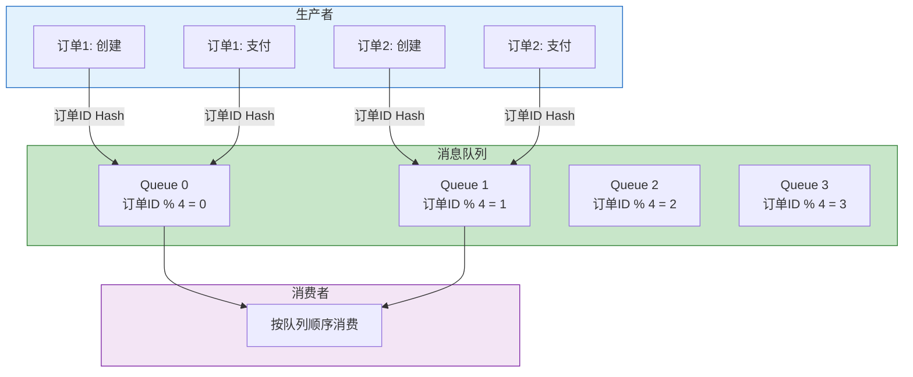

**实现原理**：
- 相同订单 ID 的消息通过 Hash 路由到同一队列
- 同一队列的消息按顺序消费
- 消费者对队列加锁，保证串行消费

### 6.2 事务消息

**适用场景**：分布式事务，保证本地事务与消息发送的一致性。

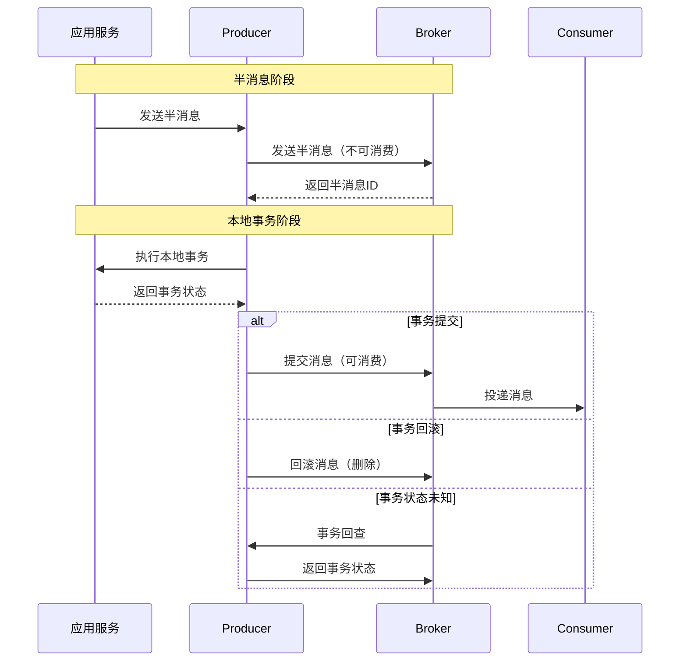

**事务消息流程**：

| 阶段 | 说明 |
|------|------|
| **发送半消息** | 消息暂存，不可被消费 |
| **执行本地事务** | 执行业务逻辑 |
| **提交/回滚消息** | 根据事务结果决定 |
| **事务回查** | 状态未知时，Broker 回查事务状态 |

### 6.3 延迟消息

**适用场景**：订单超时取消、定时任务触发。

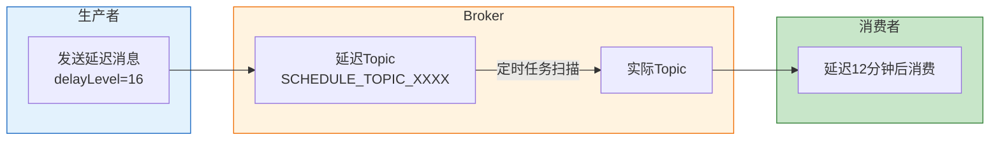

### 6.4 消息过滤

**Tag 过滤**：

```
Consumer 订阅: Topic = "order", Tag = "create || pay"
消息 Tag: "create" -> 匹配
消息 Tag: "pay" -> 匹配
消息 Tag: "cancel" -> 不匹配
```

**SQL92 过滤**：

```
Consumer 订阅: "amount > 1000 AND status = 'pending'"
消息属性: amount=1500, status='pending' -> 匹配
消息属性: amount=500, status='pending' -> 不匹配
```

---

## 七、高可用机制

### 7.1 主从复制

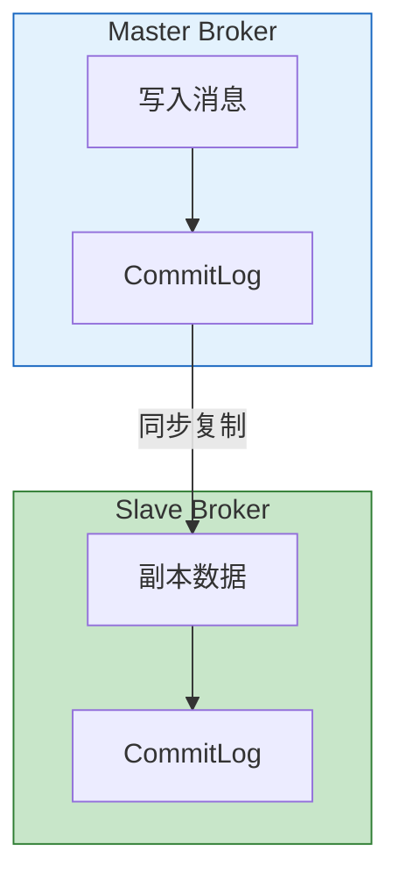

| 复制方式 | 说明 | 特点 |
|------|------|------|
| **同步复制** | Master 等待 Slave 确认后返回 | 数据不丢失，性能较低 |
| **异步复制** | Master 直接返回，异步同步到 Slave | 性能高，可能丢失少量数据 |

### 7.2 故障切换

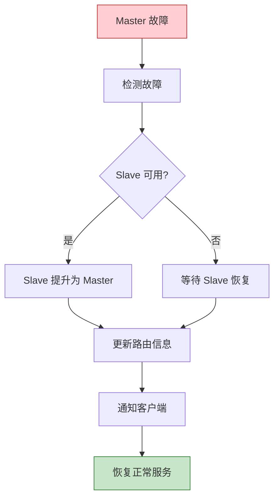

### 7.3 消息可靠性保证

| 机制 | 说明 |
|------|------|
| **同步刷盘** | 消息写入磁盘后返回 |
| **异步刷盘** | 消息写入 PageCache 后返回 |
| **同步复制** | Master 和 Slave 都写入后返回 |
| **消息重试** | 发送失败自动重试 |
| **消息回溯** | 支持按时间重新消费 |

---

## 八、性能优化

### 8.1 生产者优化

| 优化项 | 说明 | 建议 |
|------|------|------|
| **批量发送** | 合并多条消息一起发送 | 减少网络开销 |
| **异步发送** | 使用异步发送模式 | 提升吞吐量 |
| **消息压缩** | 启用消息压缩 | 减少网络传输 |
| **合理设置队列数** | Topic 队列数适中 | 一般 4-8 个 |

### 8.2 消费者优化

| 优化项 | 说明 | 建议 |
|------|------|------|
| **批量消费** | 设置批量消费数量 | 提升消费效率 |
| **并发消费** | 设置消费线程数 | 提升并发能力 |
| **预取消息** | 设置 pullBatchSize | 减少拉取次数 |
| **消费幂等** | 实现幂等消费 | 避免重复消费 |

### 8.3 Broker 优化

| 优化项 | 说明 | 建议 |
|------|------|------|
| **内存映射** | 使用 MMap 提升读写性能 | 默认开启 |
| **页缓存** | 合理设置 PageCache | 提升读性能 |
| **文件预分配** | 预分配 CommitLog 文件 | 减少文件创建开销 |
| **内存池** | 启用消息内存池 | 减少 GC 压力 |

---

## 九、监控与运维

### 9.1 关键监控指标

| 指标 | 说明 | 告警阈值 |
|------|------|----------|
| **TPS** | 每秒消息数 | 根据业务设定 |
| **消息堆积** | 未消费消息数 | 超过阈值告警 |
| **消费延迟** | 消息从生产到消费的时间 | 超过阈值告警 |
| **发送成功率** | 消息发送成功比例 | 低于 99% 告警 |
| **消费成功率** | 消息消费成功比例 | 低于 99% 告警 |

### 9.2 运维命令

| 命令 | 说明 |
|------|------|
| `mqadmin topicList` | 查看 Topic 列表 |
| `mqadmin topicStatus` | 查看 Topic 状态 |
| `mqadmin topicRoute` | 查看 Topic 路由 |
| `mqadmin brokerStatus` | 查看 Broker 状态 |
| `mqadmin clusterList` | 查看集群信息 |
| `mqadmin consumerProgress` | 查看消费进度 |

### 9.3 常见问题排查

| 问题 | 可能原因 | 解决方案 |
|------|----------|----------|
| 消息堆积 | 消费速度慢 | 增加消费者数量 |
| 发送超时 | 网络问题、Broker 压力大 | 检查网络、扩容 Broker |
| 消费失败 | 业务异常 | 查看日志，修复业务逻辑 |
| 主从不同步 | 网络延迟、Slave 压力大 | 检查网络、优化 Slave |

---

## 十、最佳实践总结

### 10.1 Topic 设计

| 实践 | 说明 |
|------|------|
| **按业务划分** | 一个业务一个 Topic |
| **队列数适中** | 一般 4-8 个，避免过多 |
| **命名规范** | 使用业务前缀，如 `order_create` |

### 10.2 消息设计

| 实践 | 说明 |
|------|------|
| **设置 Key** | 便于查询和去重 |
| **设置 Tag** | 便于过滤 |
| **消息体精简** | 只包含必要信息 |
| **统一格式** | 使用 JSON 格式 |

### 10.3 消费设计

| 实践 | 说明 |
|------|------|
| **幂等消费** | 消费逻辑支持重复消费 |
| **异常处理** | 捕获异常，返回重试状态 |
| **消费确认** | 成功后返回确认状态 |
| **监控告警** | 监控消费进度和延迟 |

---

## 参考资料

- [Apache RocketMQ 官方文档](https://rocketmq.apache.org/)
- [RocketMQ GitHub](https://github.com/apache/rocketmq)
- [RocketMQ 最佳实践](https://rocketmq.apache.org/docs/bestPractice/)
