# Sentinel 流量控制与限流算法详解

## 一、Sentinel 简介

### 1.1 什么是 Sentinel

Sentinel 是阿里巴巴开源的面向分布式服务架构的流量控制组件，主要以流量为切入点，从流量控制、熔断降级、系统自适应保护等多个维度来保障微服务的稳定性。

### 1.2 Sentinel 核心功能

| 功能 | 说明 |
|------|------|
| **流量控制** | 支持 QPS、线程数等多种流量控制策略，防止服务被突发流量冲垮 |
| **熔断降级** | 当服务出现不稳定时（如响应变慢、异常比例升高），快速切断调用链路，避免级联故障 |
| **系统自适应保护** | 根据系统负载（CPU、内存等）自动调整流量，防止系统过载 |
| **热点参数限流** | 针对热点数据进行精细化限流，如针对某个商品 ID 进行限流 |
| **实时监控** | 提供实时监控面板，可查看流量、熔断等实时数据 |

### 1.3 Sentinel 特点

| 特点 | 说明 |
|------|------|
| **轻量级** | 核心库无额外依赖，Jar 包体积小 |
| **高性能** | 单机 QPS 承载能力强，对业务代码侵入性低 |
| **易扩展** | 支持自定义规则来源、自定义统计逻辑等 |
| **生态完善** | 与 Spring Cloud、Dubbo 等框架无缝集成 |
| **可视化控制台** | 提供完善的 Web 控制台，支持规则动态配置和实时监控 |

---

## 二、Sentinel 核心概念

### 2.1 资源与规则

Sentinel 通过**资源**和**规则**两个核心概念来进行流量控制与熔断降级。

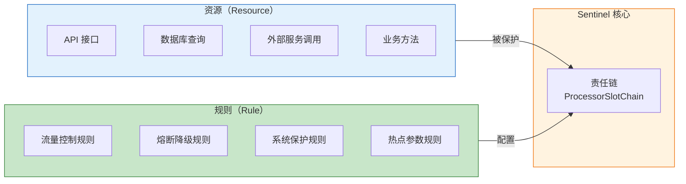
```mermaid
flowchart LR
    subgraph Resources["资源（Resource）"]
        R1["API 接口"]
        R2["数据库查询"]
        R3["外部服务调用"]
        R4["业务方法"]
    end
    
    subgraph Rules["规则（Rule）"]
        FlowRule["流量控制规则"]
        DegradeRule["熔断降级规则"]
        SystemRule["系统保护规则"]
        ParamRule["热点参数规则"]
    end
    
    subgraph Sentinel["Sentinel 核心"]
        SlotChain["责任链<br/>ProcessorSlotChain"]
    end
    
    Resources -->|"被保护"| SlotChain
    Rules -->|"配置"| SlotChain
    
    style Resources fill:#e3f2fd,stroke:#1565c0
    style Rules fill:#c8e6c9,stroke:#2e7d32
    style Sentinel fill:#fff3e0,stroke:#ef6c00
```

#### 资源（Resource）

在 Sentinel 中，任何一个被控制的服务或操作都被视作一个**资源**：

| 资源类型 | 示例 |
|----------|------|
| API 接口 | `/api/user/{id}` |
| 数据库查询 | `selectUserById` 方法 |
| 外部服务调用 | 调用第三方支付接口 |
| 业务方法 | `orderService.createOrder()` |

#### 规则（Rule）

规则是 Sentinel 控制流量、熔断、降级等策略的核心：

| 规则类型 | 说明 |
|----------|------|
| **流量控制规则** | 控制 QPS 或并发线程数 |
| **熔断降级规则** | 根据响应时间、异常比例等触发熔断 |
| **系统保护规则** | 根据系统负载自动保护 |
| **热点参数规则** | 针对热点数据进行限流 |
| **授权控制规则** | 控制资源的访问来源 |

### 2.2 核心组件关系

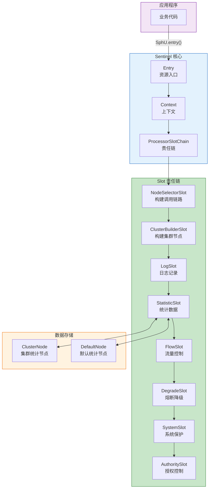
```mermaid
flowchart TB
    subgraph Application["应用程序"]
        Code["业务代码"]
    end
    
    subgraph SentinelCore["Sentinel 核心"]
        Context["Context<br/>上下文"]
        Entry["Entry<br/>资源入口"]
        SlotChain["ProcessorSlotChain<br/>责任链"]
    end
    
    subgraph Slots["Slot 责任链"]
        NodeSelectorSlot["NodeSelectorSlot<br/>构建调用链路"]
        ClusterBuilderSlot["ClusterBuilderSlot<br/>构建集群节点"]
        LogSlot["LogSlot<br/>日志记录"]
        StatisticSlot["StatisticSlot<br/>统计数据"]
        FlowSlot["FlowSlot<br/>流量控制"]
        DegradeSlot["DegradeSlot<br/>熔断降级"]
        SystemSlot["SystemSlot<br/>系统保护"]
        AuthoritySlot["AuthoritySlot<br/>授权控制"]
    end
    
    subgraph DataStorage["数据存储"]
        ClusterNode["ClusterNode<br/>集群统计节点"]
        DefaultNode["DefaultNode<br/>默认统计节点"]
    end
    
    Code -->|"SphU.entry()"| Entry
    Entry --> Context
    Context --> SlotChain
    SlotChain --> NodeSelectorSlot
    NodeSelectorSlot --> ClusterBuilderSlot
    ClusterBuilderSlot --> LogSlot
    LogSlot --> StatisticSlot
    StatisticSlot --> FlowSlot
    FlowSlot --> DegradeSlot
    DegradeSlot --> SystemSlot
    SystemSlot --> AuthoritySlot
    
    StatisticSlot <--> ClusterNode
    StatisticSlot <--> DefaultNode
    
    style Application fill:#f3e5f5,stroke:#7b1fa2
    style SentinelCore fill:#e3f2fd,stroke:#1565c0
    style Slots fill:#c8e6c9,stroke:#2e7d32
    style DataStorage fill:#fff3e0,stroke:#ef6c00
```

---

## 三、Sentinel 工作原理

### 3.1 责任链模式

Sentinel 的核心工作原理基于**责任链模式**，通过一系列的 Slot（槽位）串联成一个处理链。

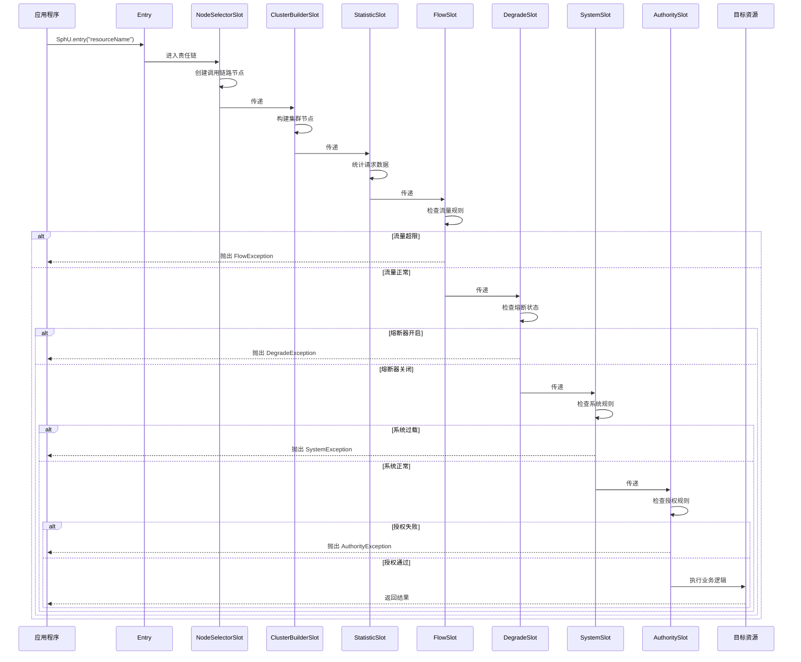
```mermaid
sequenceDiagram
    participant App as 应用程序
    participant Entry as Entry
    participant NS as NodeSelectorSlot
    participant CB as ClusterBuilderSlot
    participant Stat as StatisticSlot
    participant Flow as FlowSlot
    participant Degrade as DegradeSlot
    participant Sys as SystemSlot
    participant Auth as AuthoritySlot
    participant Resource as 目标资源
    
    App->>Entry: SphU.entry("resourceName")
    Entry->>NS: 进入责任链
    NS->>NS: 创建调用链路节点
    NS->>CB: 传递
    CB->>CB: 构建集群节点
    CB->>Stat: 传递
    Stat->>Stat: 统计请求数据
    Stat->>Flow: 传递
    Flow->>Flow: 检查流量规则
    
    alt 流量超限
        Flow-->>App: 抛出 FlowException
    else 流量正常
        Flow->>Degrade: 传递
        Degrade->>Degrade: 检查熔断状态
        
        alt 熔断器开启
            Degrade-->>App: 抛出 DegradeException
        else 熔断器关闭
            Degrade->>Sys: 传递
            Sys->>Sys: 检查系统规则
            
            alt 系统过载
                Sys-->>App: 抛出 SystemException
            else 系统正常
                Sys->>Auth: 传递
                Auth->>Auth: 检查授权规则
                
                alt 授权失败
                    Auth-->>App: 抛出 AuthorityException
                else 授权通过
                    Auth->>Resource: 执行业务逻辑
                    Resource-->>App: 返回结果
                end
            end
        end
    end
```

### 3.2 Slot 职责详解

| Slot | 职责 | 说明 |
|------|------|------|
| **NodeSelectorSlot** | 构建调用链路 | 为每个资源创建 DefaultNode，构建调用树 |
| **ClusterBuilderSlot** | 构建集群节点 | 为每个资源创建 ClusterNode，存储集群维度的统计数据 |
| **LogSlot** | 日志记录 | 记录异常日志 |
| **StatisticSlot** | 统计数据 | 统计 QPS、RT（响应时间）、线程数、异常数等 |
| **FlowSlot** | 流量控制 | 根据 FlowRule 进行流量控制 |
| **DegradeSlot** | 熔断降级 | 根据 DegradeRule 进行熔断判断 |
| **SystemSlot** | 系统保护 | 根据 SystemRule 进行系统级保护 |
| **AuthoritySlot** | 授权控制 | 根据 AuthorityRule 进行来源访问控制 |

### 3.3 统计数据结构

Sentinel 使用**滑动窗口**算法进行实时数据统计：

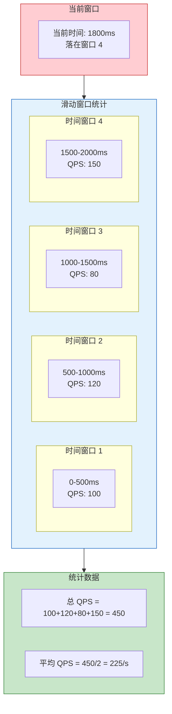
```mermaid
flowchart TB
    subgraph SlidingWindow["滑动窗口统计"]
        subgraph Window1["时间窗口 1"]
            W1["0-500ms<br/>QPS: 100"]
        end
        subgraph Window2["时间窗口 2"]
            W2["500-1000ms<br/>QPS: 120"]
        end
        subgraph Window3["时间窗口 3"]
            W3["1000-1500ms<br/>QPS: 80"]
        end
        subgraph Window4["时间窗口 4"]
            W4["1500-2000ms<br/>QPS: 150"]
        end
    end
    
    subgraph CurrentWindow["当前窗口"]
        Current["当前时间: 1800ms<br/>落在窗口 4"]
    end
    
    subgraph Statistics["统计数据"]
        TotalQPS["总 QPS = 100+120+80+150 = 450"]
        AvgQPS["平均 QPS = 450/2 = 225/s"]
    end
    
    CurrentWindow --> SlidingWindow
    SlidingWindow --> Statistics
    
    style SlidingWindow fill:#e3f2fd,stroke:#1565c0
    style CurrentWindow fill:#ffcdd2,stroke:#c62828
    style Statistics fill:#c8e6c9,stroke:#2e7d32
```

---

## 四、流量控制

### 4.1 限流架构图

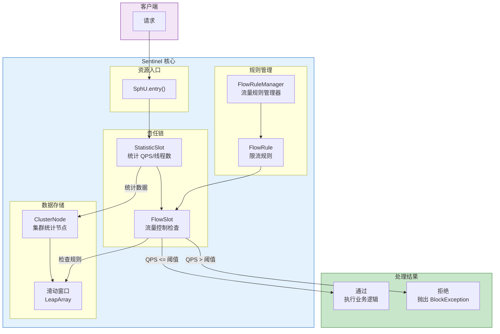
```mermaid
flowchart TB
    subgraph Client["客户端"]
        Request["请求"]
    end
    
    subgraph SentinelCore["Sentinel 核心"]
        subgraph Entry["资源入口"]
            SphU["SphU.entry()"]
        end
        
        subgraph SlotChain["责任链"]
            StatisticSlot["StatisticSlot<br/>统计 QPS/线程数"]
            FlowSlot["FlowSlot<br/>流量控制检查"]
        end
        
        subgraph RuleManager["规则管理"]
            FlowRuleManager["FlowRuleManager<br/>流量规则管理器"]
            Rules["FlowRule<br/>限流规则"]
        end
        
        subgraph DataStorage["数据存储"]
            ClusterNode["ClusterNode<br/>集群统计节点"]
            SlidingWindow["滑动窗口<br/>LeapArray"]
        end
    end
    
    subgraph Result["处理结果"]
        Pass["通过<br/>执行业务逻辑"]
        Block["拒绝<br/>抛出 BlockException"]
    end
    
    Request --> SphU
    SphU --> StatisticSlot
    StatisticSlot -->|"统计数据"| ClusterNode
    ClusterNode --> SlidingWindow
    StatisticSlot --> FlowSlot
    FlowRuleManager --> Rules
    Rules --> FlowSlot
    FlowSlot -->|"检查规则"| SlidingWindow
    
    FlowSlot -->|"QPS <= 阈值"| Pass
    FlowSlot -->|"QPS > 阈值"| Block
    
    style Client fill:#f3e5f5,stroke:#7b1fa2
    style SentinelCore fill:#e3f2fd,stroke:#1565c0
    style Result fill:#c8e6c9,stroke:#2e7d32
```

### 4.2 限流工作流程

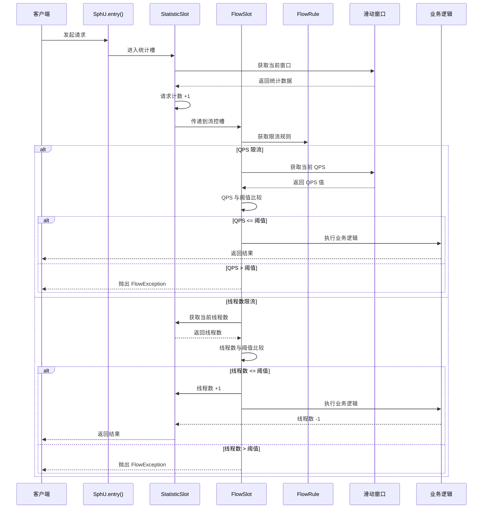
```mermaid
sequenceDiagram
    participant Client as 客户端
    participant Entry as SphU.entry()
    participant StatSlot as StatisticSlot
    participant FlowSlot as FlowSlot
    participant Rule as FlowRule
    participant Window as 滑动窗口
    participant Business as 业务逻辑
    
    Client->>Entry: 发起请求
    Entry->>StatSlot: 进入统计槽
    
    StatSlot->>Window: 获取当前窗口
    Window-->>StatSlot: 返回统计数据
    StatSlot->>StatSlot: 请求计数 +1
    
    StatSlot->>FlowSlot: 传递到流控槽
    FlowSlot->>Rule: 获取限流规则
    
    alt QPS 限流
        FlowSlot->>Window: 获取当前 QPS
        Window-->>FlowSlot: 返回 QPS 值
        FlowSlot->>FlowSlot: QPS 与阈值比较
        
        alt QPS <= 阈值
            FlowSlot->>Business: 执行业务逻辑
            Business-->>Client: 返回结果
        else QPS > 阈值
            FlowSlot-->>Client: 抛出 FlowException
        end
        
    else 线程数限流
        FlowSlot->>StatSlot: 获取当前线程数
        StatSlot-->>FlowSlot: 返回线程数
        FlowSlot->>FlowSlot: 线程数与阈值比较
        
        alt 线程数 <= 阈值
            FlowSlot->>StatSlot: 线程数 +1
            FlowSlot->>Business: 执行业务逻辑
            Business-->>StatSlot: 线程数 -1
            StatSlot-->>Client: 返回结果
        else 线程数 > 阈值
            FlowSlot-->>Client: 抛出 FlowException
        end
    end
```

### 4.3 流量控制策略

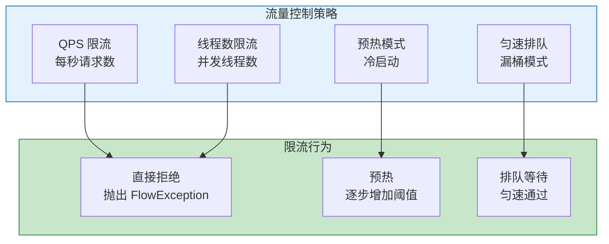
```mermaid
flowchart TB
    subgraph FlowControl["流量控制策略"]
        QPS["QPS 限流<br/>每秒请求数"]
        Thread["线程数限流<br/>并发线程数"]
        WarmUp["预热模式<br/>冷启动"]
        RateLimiter["匀速排队<br/>漏桶模式"]
    end
    
    subgraph Behavior["限流行为"]
        Reject["直接拒绝<br/>抛出 FlowException"]
        WarmUpBehavior["预热<br/>逐步增加阈值"]
        Queue["排队等待<br/>匀速通过"]
    end
    
    QPS --> Reject
    Thread --> Reject
    WarmUp --> WarmUpBehavior
    RateLimiter --> Queue
    
    style FlowControl fill:#e3f2fd,stroke:#1565c0
    style Behavior fill:#c8e6c9,stroke:#2e7d32
```

### 4.4 QPS 限流

| 参数 | 说明 |
|------|------|
| **resource** | 资源名称 |
| **count** | QPS 阈值 |
| **grade** | 限流模式（QPS 模式或线程数模式） |
| **limitApp** | 来源应用（default 表示所有来源） |
| **strategy** | 流控策略（直接、关联、链路） |
| **controlBehavior** | 流控效果（直接拒绝、预热、匀速排队） |

### 4.5 流控策略

| 策略 | 说明 | 适用场景 |
|------|------|----------|
| **直接** | 直接对资源进行限流 | 常规限流场景 |
| **关联** | 当关联资源达到阈值时，限流当前资源 | 保护核心资源 |
| **链路** | 只记录从入口资源进来的流量 | 精细化限流 |

### 4.6 流控效果

| 效果 | 说明 | 适用场景 |
|------|------|----------|
| **直接拒绝** | 超过阈值直接抛出异常 | 大多数场景 |
| **预热（Warm Up）** | 阈值从低到高逐步增加 | 系统冷启动场景 |
| **匀速排队** | 请求在队列中排队，匀速通过 | 削峰填谷场景 |

---

## 五、熔断降级

### 5.1 熔断降级架构图

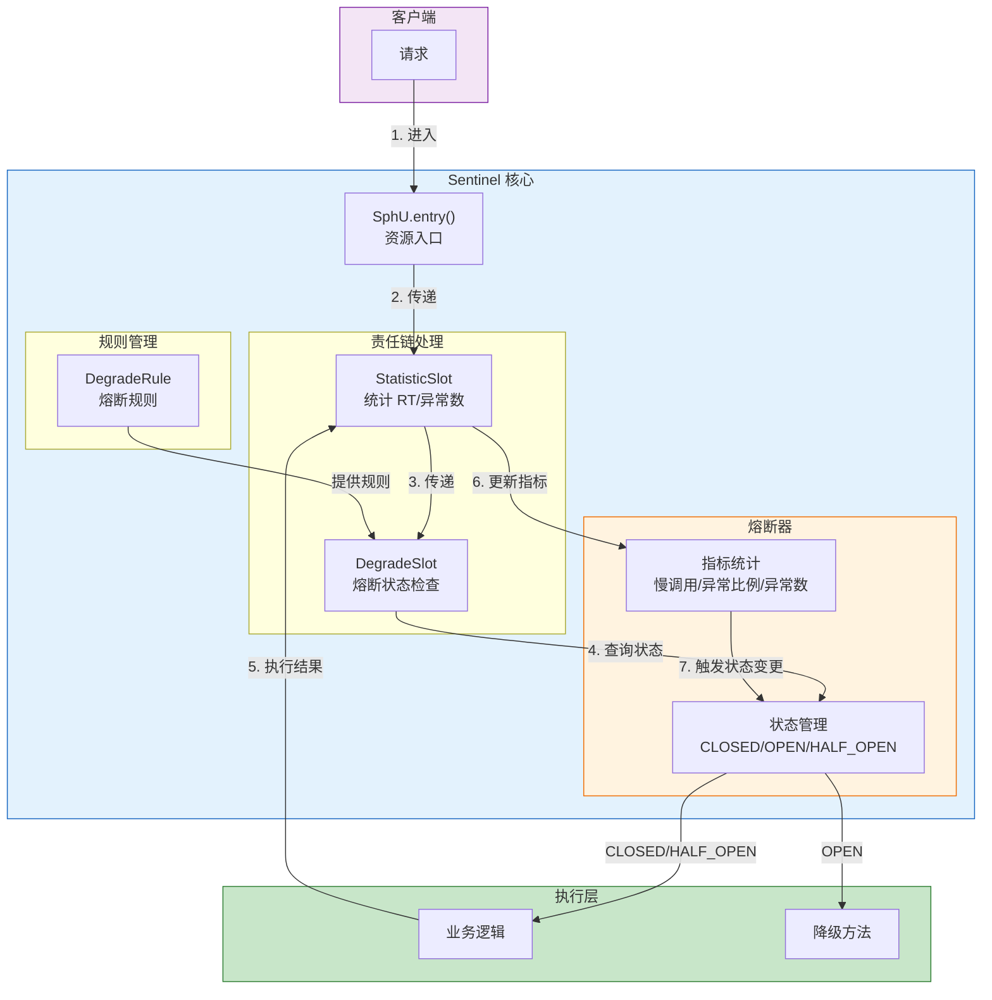
```mermaid
flowchart TB
    subgraph Client["客户端"]
        Request["请求"]
    end
    
    subgraph SentinelCore["Sentinel 核心"]
        SphU["SphU.entry()<br/>资源入口"]
        
        subgraph SlotChain["责任链处理"]
            direction TB
            StatisticSlot["StatisticSlot<br/>统计 RT/异常数"]
            DegradeSlot["DegradeSlot<br/>熔断状态检查"]
        end
        
        subgraph CircuitBreaker["熔断器"]
            direction TB
            CBState["状态管理<br/>CLOSED/OPEN/HALF_OPEN"]
            CBMetrics["指标统计<br/>慢调用/异常比例/异常数"]
        end
        
        subgraph RuleManager["规则管理"]
            DegradeRule["DegradeRule<br/>熔断规则"]
        end
    end
    
    subgraph Execution["执行层"]
        Business["业务逻辑"]
        Fallback["降级方法"]
    end
    
    Request -->|"1. 进入"| SphU
    SphU -->|"2. 传递"| StatisticSlot
    StatisticSlot -->|"3. 传递"| DegradeSlot
    
    DegradeRule -->|"提供规则"| DegradeSlot
    DegradeSlot -->|"4. 查询状态"| CBState
    
    CBState -->|"CLOSED/HALF_OPEN"| Business
    CBState -->|"OPEN"| Fallback
    
    Business -->|"5. 执行结果"| StatisticSlot
    StatisticSlot -->|"6. 更新指标"| CBMetrics
    CBMetrics -->|"7. 触发状态变更"| CBState
    
    style Client fill:#f3e5f5,stroke:#7b1fa2
    style SentinelCore fill:#e3f2fd,stroke:#1565c0
    style CircuitBreaker fill:#fff3e0,stroke:#ef6c00
    style Execution fill:#c8e6c9,stroke:#2e7d32
```

**架构说明**：

| 步骤 | 说明 |
|------|------|
| **1. 进入** | 请求通过 SphU.entry() 进入 Sentinel 保护 |
| **2. 传递** | StatisticSlot 记录请求开始时间，统计线程数 |
| **3. 传递** | DegradeSlot 检查熔断器状态 |
| **4. 查询状态** | 根据熔断器状态决定请求去向 |
| **5. 执行结果** | 业务执行完成后，记录 RT 和异常信息 |
| **6. 更新指标** | 将统计数据更新到熔断器指标 |
| **7. 触发状态变更** | 指标达到阈值时，熔断器状态改变 |

### 5.2 熔断降级工作流程

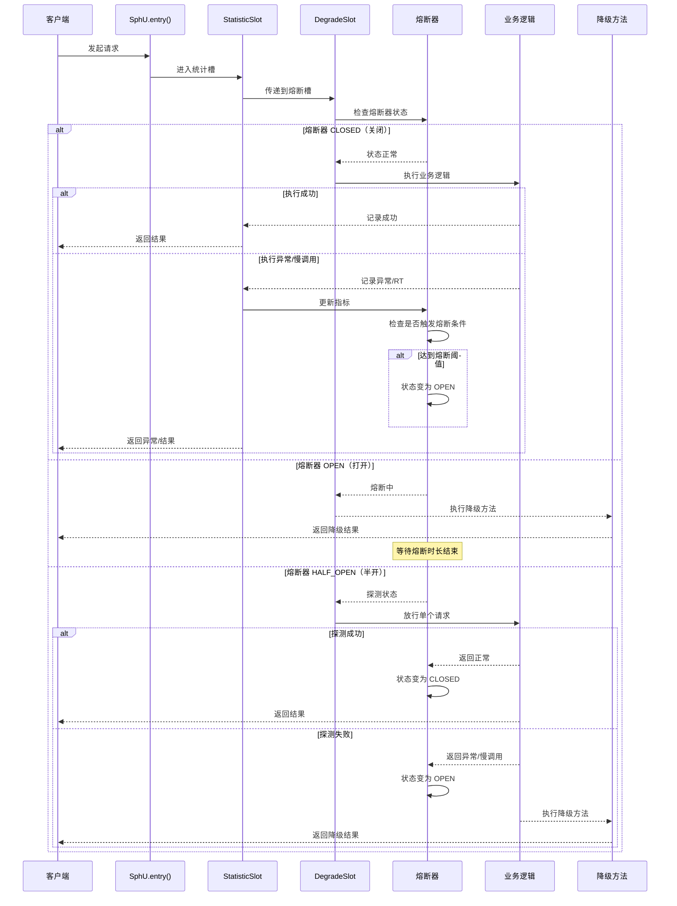
```mermaid
sequenceDiagram
    participant Client as 客户端
    participant Entry as SphU.entry()
    participant StatSlot as StatisticSlot
    participant DegradeSlot as DegradeSlot
    participant CB as 熔断器
    participant Business as 业务逻辑
    participant Fallback as 降级方法
    
    Client->>Entry: 发起请求
    Entry->>StatSlot: 进入统计槽
    StatSlot->>DegradeSlot: 传递到熔断槽
    DegradeSlot->>CB: 检查熔断器状态
    
    alt 熔断器 CLOSED（关闭）
        CB-->>DegradeSlot: 状态正常
        DegradeSlot->>Business: 执行业务逻辑
        
        alt 执行成功
            Business-->>StatSlot: 记录成功
            StatSlot-->>Client: 返回结果
        else 执行异常/慢调用
            Business-->>StatSlot: 记录异常/RT
            StatSlot->>CB: 更新指标
            CB->>CB: 检查是否触发熔断条件
            
            alt 达到熔断阈值
                CB->>CB: 状态变为 OPEN
            end
            
            StatSlot-->>Client: 返回异常/结果
        end
        
    else 熔断器 OPEN（打开）
        CB-->>DegradeSlot: 熔断中
        DegradeSlot-->>Fallback: 执行降级方法
        Fallback-->>Client: 返回降级结果
        
        Note over CB: 等待熔断时长结束
        
    else 熔断器 HALF_OPEN（半开）
        CB-->>DegradeSlot: 探测状态
        DegradeSlot->>Business: 放行单个请求
        
        alt 探测成功
            Business-->>CB: 返回正常
            CB->>CB: 状态变为 CLOSED
            Business-->>Client: 返回结果
        else 探测失败
            Business-->>CB: 返回异常/慢调用
            CB->>CB: 状态变为 OPEN
            Business-->>Fallback: 执行降级方法
            Fallback-->>Client: 返回降级结果
        end
    end
```

### 5.3 熔断器状态机

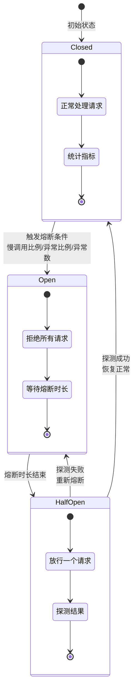
```mermaid
stateDiagram-v2
    [*] --> Closed: 初始状态
    
    Closed --> Open: 触发熔断条件<br/>慢调用比例/异常比例/异常数
    Open --> HalfOpen: 熔断时长结束
    
    HalfOpen --> Closed: 探测成功<br/>恢复正常
    HalfOpen --> Open: 探测失败<br/>重新熔断
    
    state Closed {
        [*] --> 正常处理请求
        正常处理请求 --> 统计指标
        统计指标 --> [*]
    }
    
    state Open {
        [*] --> 拒绝所有请求
        拒绝所有请求 --> 等待熔断时长
        等待熔断时长 --> [*]
    }
    
    state HalfOpen {
        [*] --> 放行一个请求
        放行一个请求 --> 探测结果
        探测结果 --> [*]
    }
```

### 5.4 熔断策略

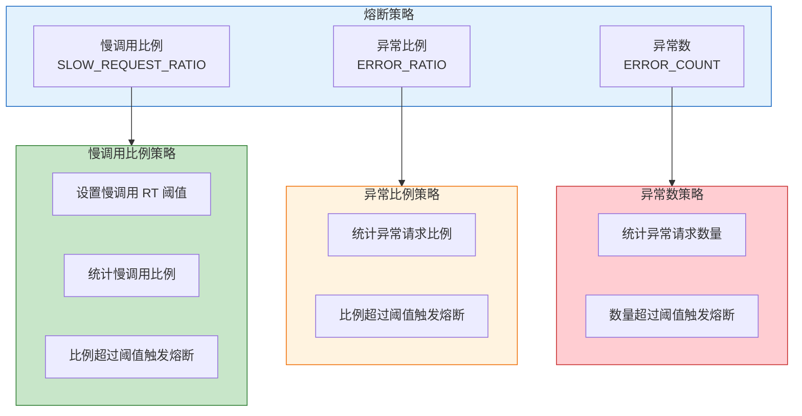
```mermaid
flowchart TB
    subgraph Strategies["熔断策略"]
        S1["慢调用比例<br/>SLOW_REQUEST_RATIO"]
        S2["异常比例<br/>ERROR_RATIO"]
        S3["异常数<br/>ERROR_COUNT"]
    end
    
    subgraph SlowCall["慢调用比例策略"]
        SC1["设置慢调用 RT 阈值"]
        SC2["统计慢调用比例"]
        SC3["比例超过阈值触发熔断"]
    end
    
    subgraph ErrorRatio["异常比例策略"]
        ER1["统计异常请求比例"]
        ER2["比例超过阈值触发熔断"]
    end
    
    subgraph ErrorCount["异常数策略"]
        EC1["统计异常请求数量"]
        EC2["数量超过阈值触发熔断"]
    end
    
    S1 --> SlowCall
    S2 --> ErrorRatio
    S3 --> ErrorCount
    
    style Strategies fill:#e3f2fd,stroke:#1565c0
    style SlowCall fill:#c8e6c9,stroke:#2e7d32
    style ErrorRatio fill:#fff3e0,stroke:#ef6c00
    style ErrorCount fill:#ffcdd2,stroke:#c62828
```

### 5.5 熔断策略详解

#### 慢调用比例（SLOW_REQUEST_RATIO）

| 参数 | 说明 |
|------|------|
| **慢调用 RT** | 最大响应时间，超过此值视为慢调用 |
| **比例阈值** | 慢调用比例阈值（0.0 - 1.0） |
| **最小请求数** | 触发熔断的最小请求数 |
| **熔断时长** | 熔断持续时间 |

**触发条件**：单位统计时长内请求数 > 最小请求数，且慢调用比例 > 阈值

#### 异常比例（ERROR_RATIO）

| 参数 | 说明 |
|------|------|
| **比例阈值** | 异常比例阈值（0.0 - 1.0） |
| **最小请求数** | 触发熔断的最小请求数 |
| **熔断时长** | 熔断持续时间 |

**触发条件**：单位统计时长内请求数 > 最小请求数，且异常比例 > 阈值

#### 异常数（ERROR_COUNT）

| 参数 | 说明 |
|------|------|
| **异常数阈值** | 异常数量阈值 |
| **最小请求数** | 触发熔断的最小请求数 |
| **熔断时长** | 熔断持续时间 |

**触发条件**：单位统计时长内请求数 > 最小请求数，且异常数 > 阈值

---

## 六、限流算法详解

### 6.1 限流算法概览

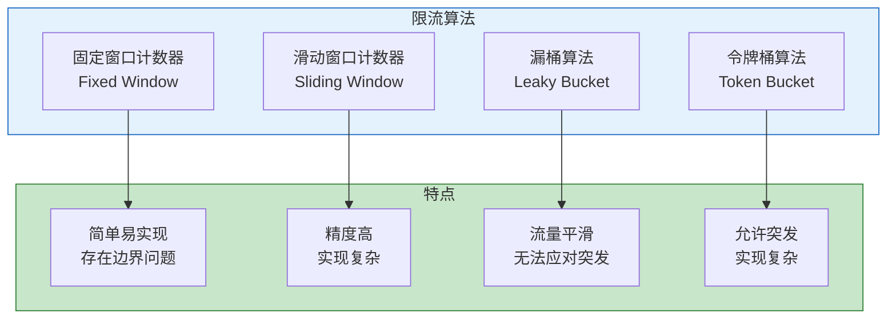
```mermaid
flowchart TB
    subgraph Algorithms["限流算法"]
        A1["固定窗口计数器<br/>Fixed Window"]
        A2["滑动窗口计数器<br/>Sliding Window"]
        A3["漏桶算法<br/>Leaky Bucket"]
        A4["令牌桶算法<br/>Token Bucket"]
    end
    
    subgraph Characteristics["特点"]
        C1["简单易实现<br/>存在边界问题"]
        C2["精度高<br/>实现复杂"]
        C3["流量平滑<br/>无法应对突发"]
        C4["允许突发<br/>实现复杂"]
    end
    
    A1 --> C1
    A2 --> C2
    A3 --> C3
    A4 --> C4
    
    style Algorithms fill:#e3f2fd,stroke:#1565c0
    style Characteristics fill:#c8e6c9,stroke:#2e7d32
```

### 6.2 固定窗口计数器算法

#### 原理

将时间划分为固定大小的窗口，在每个窗口内维护一个计数器，请求到达时计数器加 1，当计数器达到阈值时拒绝后续请求。

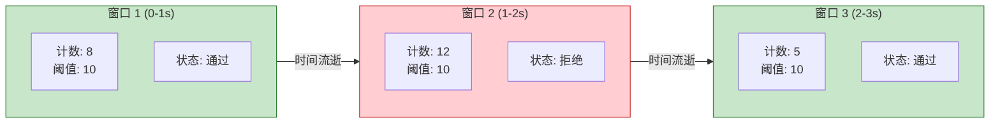
```mermaid
flowchart LR
    subgraph Window1["窗口 1 (0-1s)"]
        W1Count["计数: 8<br/>阈值: 10"]
        W1Status["状态: 通过"]
    end
    
    subgraph Window2["窗口 2 (1-2s)"]
        W2Count["计数: 12<br/>阈值: 10"]
        W2Status["状态: 拒绝"]
    end
    
    subgraph Window3["窗口 3 (2-3s)"]
        W3Count["计数: 5<br/>阈值: 10"]
        W3Status["状态: 通过"]
    end
    
    Window1 -->|"时间流逝"| Window2
    Window2 -->|"时间流逝"| Window3
    
    style Window1 fill:#c8e6c9,stroke:#2e7d32
    style Window2 fill:#ffcdd2,stroke:#c62828
    style Window3 fill:#c8e6c9,stroke:#2e7d32
```

#### 边界问题

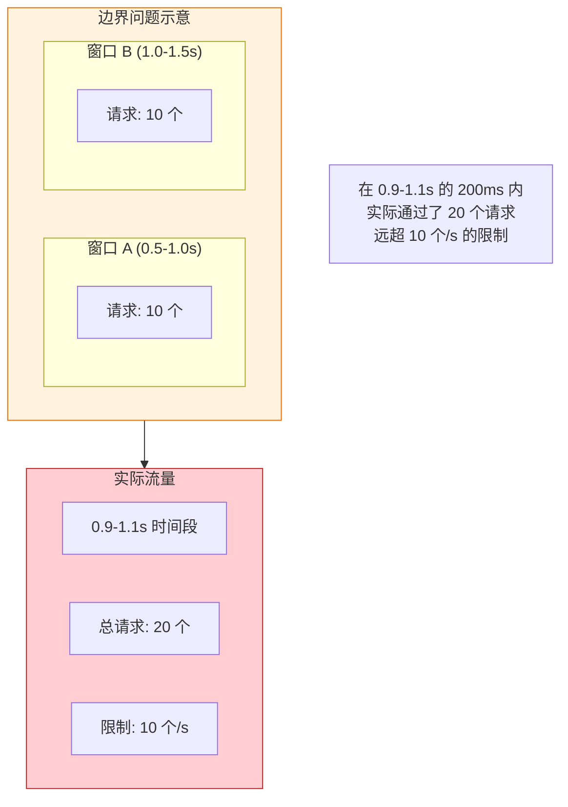
```mermaid
flowchart TB
    subgraph Problem["边界问题示意"]
        subgraph WindowA["窗口 A (0.5-1.0s)"]
            WA["请求: 10 个"]
        end
        subgraph WindowB["窗口 B (1.0-1.5s)"]
            WB["请求: 10 个"]
        end
    end
    
    subgraph Actual["实际流量"]
        TimeRange["0.9-1.1s 时间段"]
        Total["总请求: 20 个"]
        Limit["限制: 10 个/s"]
    end
    
    Problem --> Actual
    
    Note["在 0.9-1.1s 的 200ms 内<br/>实际通过了 20 个请求<br/>远超 10 个/s 的限制"]
    
    style Problem fill:#fff3e0,stroke:#ef6c00
    style Actual fill:#ffcdd2,stroke:#c62828
```

#### 优缺点

| 优点 | 缺点 |
|------|------|
| 实现简单 | 存在边界问题，可能瞬间通过 2 倍请求 |
| 内存占用小 | 限流不够平滑 |
| 适合粗粒度限流 | 无法应对突发流量 |

### 6.3 滑动窗口计数器算法

#### 原理

将固定窗口细分为多个小窗口，通过统计最近 N 个小窗口的请求数来判断是否限流。

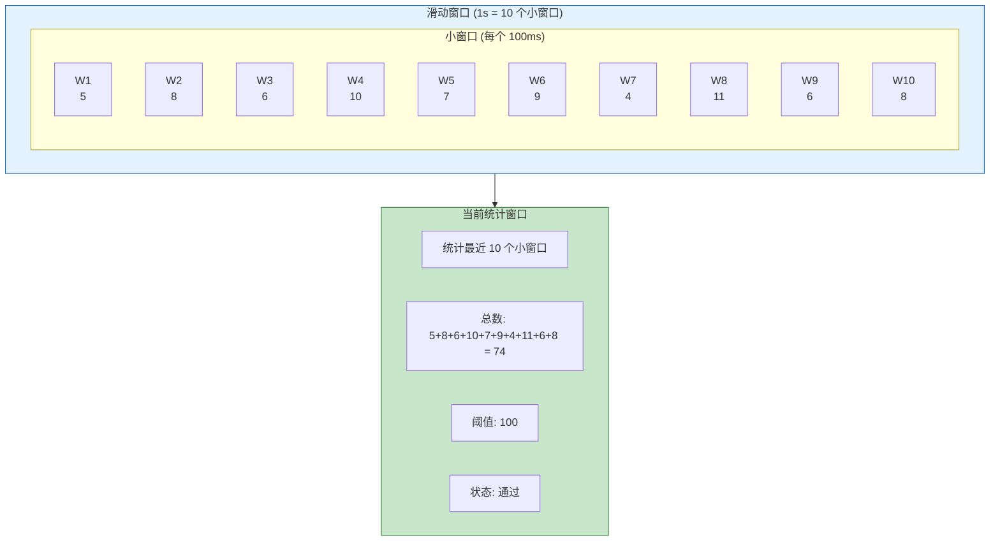
```mermaid
flowchart TB
    subgraph SlidingWindow["滑动窗口 (1s = 10 个小窗口)"]
        subgraph SmallWindows["小窗口 (每个 100ms)"]
            SW1["W1<br/>5"]
            SW2["W2<br/>8"]
            SW3["W3<br/>6"]
            SW4["W4<br/>10"]
            SW5["W5<br/>7"]
            SW6["W6<br/>9"]
            SW7["W7<br/>4"]
            SW8["W8<br/>11"]
            SW9["W9<br/>6"]
            SW10["W10<br/>8"]
        end
    end
    
    subgraph CurrentWindow["当前统计窗口"]
        Range["统计最近 10 个小窗口"]
        Total["总数: 5+8+6+10+7+9+4+11+6+8 = 74"]
        Threshold["阈值: 100"]
        Status["状态: 通过"]
    end
    
    SlidingWindow --> CurrentWindow
    
    style SlidingWindow fill:#e3f2fd,stroke:#1565c0
    style CurrentWindow fill:#c8e6c9,stroke:#2e7d32
```

#### 滑动过程

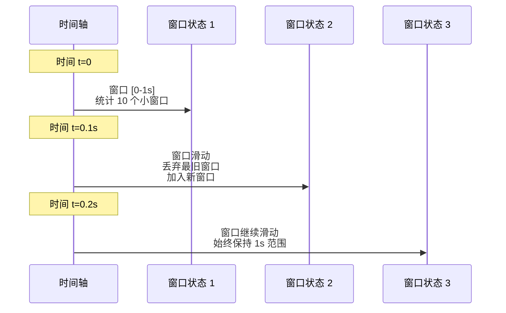
```mermaid
sequenceDiagram
    participant T as 时间轴
    participant W1 as 窗口状态 1
    participant W2 as 窗口状态 2
    participant W3 as 窗口状态 3
    
    Note over T: 时间 t=0
    T->>W1: 窗口 [0-1s]<br/>统计 10 个小窗口
    
    Note over T: 时间 t=0.1s
    T->>W2: 窗口滑动<br/>丢弃最旧窗口<br/>加入新窗口
    
    Note over T: 时间 t=0.2s
    T->>W3: 窗口继续滑动<br/>始终保持 1s 范围
```

#### 优缺点

| 优点 | 缺点 |
|------|------|
| 解决了固定窗口的边界问题 | 实现相对复杂 |
| 限流精度高 | 内存占用略大 |
| 流量统计更准确 | 小窗口数量影响精度和性能 |

### 6.4 漏桶算法

#### 原理

将请求比作水，请求到达时先放入桶中，桶底有一个固定速率的漏孔，水以恒定速率流出。当桶满时，新到达的水（请求）会被丢弃。

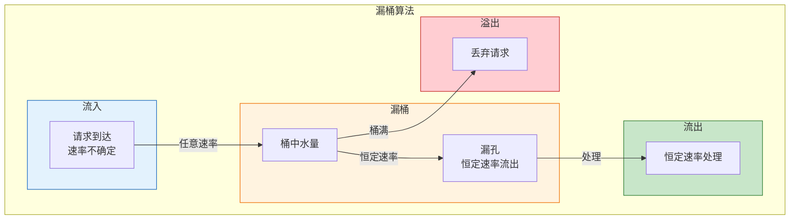
```mermaid
flowchart TB
    subgraph LeakyBucket["漏桶算法"]
        subgraph Incoming["流入"]
            Requests["请求到达<br/>速率不确定"]
        end
        
        subgraph Bucket["漏桶"]
            Water["桶中水量"]
            Hole["漏孔<br/>恒定速率流出"]
        end
        
        subgraph Outgoing["流出"]
            Processed["恒定速率处理"]
        end
        
        subgraph Overflow["溢出"]
            Dropped["丢弃请求"]
        end
    end
    
    Requests -->|"任意速率"| Water
    Water -->|"恒定速率"| Hole
    Hole -->|"处理"| Processed
    
    Water -->|"桶满"| Dropped
    
    style Incoming fill:#e3f2fd,stroke:#1565c0
    style Bucket fill:#fff3e0,stroke:#ef6c00
    style Outgoing fill:#c8e6c9,stroke:#2e7d32
    style Overflow fill:#ffcdd2,stroke:#c62828
```

#### 工作流程

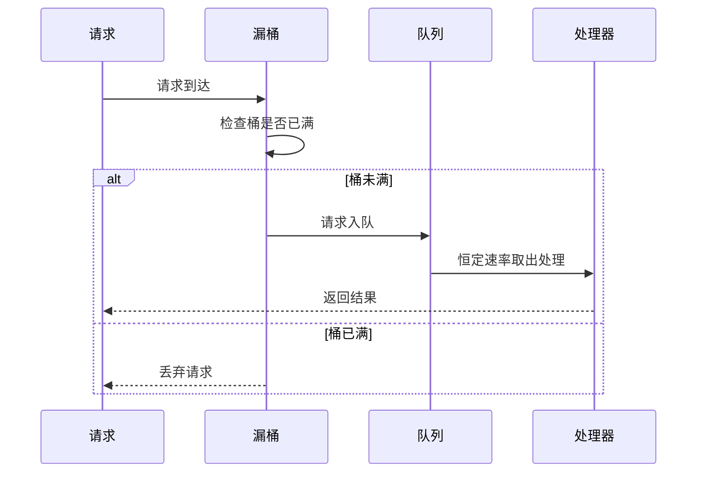
```mermaid
sequenceDiagram
    participant R as 请求
    participant B as 漏桶
    participant Q as 队列
    participant P as 处理器
    
    R->>B: 请求到达
    B->>B: 检查桶是否已满
    
    alt 桶未满
        B->>Q: 请求入队
        Q->>P: 恒定速率取出处理
        P-->>R: 返回结果
    else 桶已满
        B-->>R: 丢弃请求
    end
```

#### 优缺点

| 优点 | 缺点 |
|------|------|
| 流量平滑，输出恒定 | 无法应对突发流量 |
| 实现简单 | 桶大小固定，灵活性差 |
| 适合保护下游系统 | 可能增加请求延迟 |

### 6.5 令牌桶算法

#### 原理

系统以恒定速率向桶中放入令牌，请求到达时需要从桶中获取令牌，获取成功则处理请求，获取失败则拒绝请求。

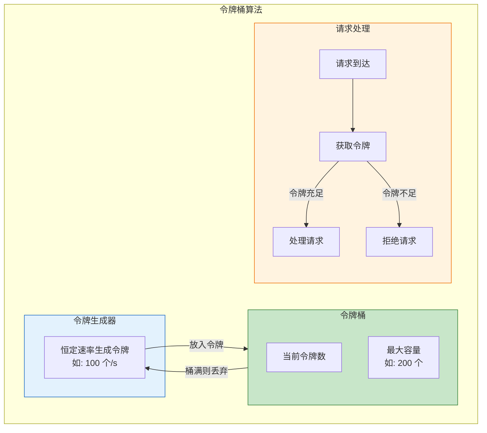
```mermaid
flowchart TB
    subgraph TokenBucket["令牌桶算法"]
        subgraph TokenGenerator["令牌生成器"]
            Rate["恒定速率生成令牌<br/>如: 100 个/s"]
        end
        
        subgraph Bucket["令牌桶"]
            Tokens["当前令牌数"]
            MaxTokens["最大容量<br/>如: 200 个"]
        end
        
        subgraph Request["请求处理"]
            Arrive["请求到达"]
            Acquire["获取令牌"]
            Success["处理请求"]
            Fail["拒绝请求"]
        end
    end
    
    Rate -->|"放入令牌"| Bucket
    Bucket -->|"桶满则丢弃"| Rate
    
    Arrive --> Acquire
    Acquire -->|"令牌充足"| Success
    Acquire -->|"令牌不足"| Fail
    
    style TokenGenerator fill:#e3f2fd,stroke:#1565c0
    style Bucket fill:#c8e6c9,stroke:#2e7d32
    style Request fill:#fff3e0,stroke:#ef6c00
```

#### 工作流程

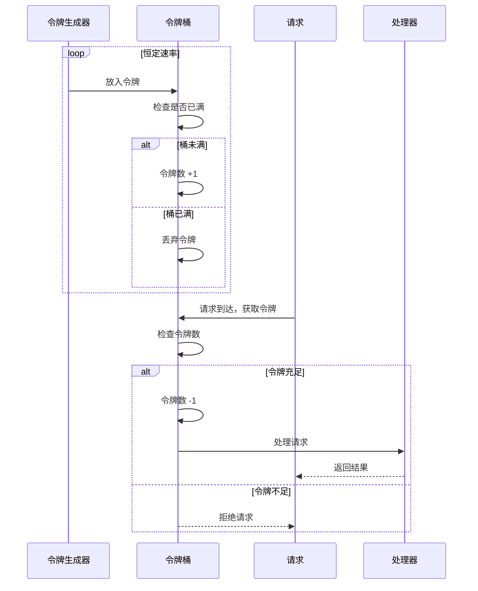
```mermaid
sequenceDiagram
    participant TG as 令牌生成器
    participant B as 令牌桶
    participant R as 请求
    participant H as 处理器
    
    loop 恒定速率
        TG->>B: 放入令牌
        B->>B: 检查是否已满
        alt 桶未满
            B->>B: 令牌数 +1
        else 桶已满
            B->>B: 丢弃令牌
        end
    end
    
    R->>B: 请求到达，获取令牌
    B->>B: 检查令牌数
    
    alt 令牌充足
        B->>B: 令牌数 -1
        B->>H: 处理请求
        H-->>R: 返回结果
    else 令牌不足
        B-->>R: 拒绝请求
    end
```

#### 突发流量处理

```mermaid
flowchart LR
    subgraph Scenario["突发流量场景"]
        Normal["平时流量: 50/s"]
        Burst["突发流量: 150/s"]
        Limit["限制: 100/s"]
    end
    
    subgraph TokenBucketBehavior["令牌桶行为"]
        T1["时刻 1: 桶中有 100 令牌"]
        T2["时刻 2: 突发 150 请求"]
        T3["处理: 100 请求（消耗令牌）"]
        T4["拒绝: 50 请求"]
    end
    
    Scenario --> TokenBucketBehavior
    
    style Scenario fill:#e3f2fd,stroke:#1565c0
    style TokenBucketBehavior fill:#c8e6c9,stroke:#2e7d32
```

#### 优缺点

| 优点 | 缺点 |
|------|------|
| 允许一定程度的突发流量 | 实现相对复杂 |
| 灵活性高，可调整令牌生成速率 | 需要合理设置桶容量 |
| 适合 API 限流场景 | 可能导致短时流量超限 |

### 6.6 算法对比

| 算法 | 流量平滑 | 突发处理 | 实现复杂度 | 内存占用 | 适用场景 |
|------|----------|----------|------------|----------|----------|
| **固定窗口** | 否 | 差 | 低 | 低 | 粗粒度限流 |
| **滑动窗口** | 一般 | 一般 | 中 | 中 | 精确限流 |
| **漏桶** | 是 | 差 | 低 | 低 | 保护下游系统 |
| **令牌桶** | 一般 | 好 | 中 | 低 | API 限流、突发流量 |

### 6.7 Sentinel 限流算法实现

Sentinel 的流量控制使用**滑动窗口**算法实现 QPS 限流，同时支持**漏桶模式**（匀速排队）。

```mermaid
flowchart TB
    subgraph SentinelFlow["Sentinel 流控实现"]
        subgraph Default["默认模式"]
            SlidingWindow["滑动窗口统计<br/>QPS 限流"]
        end
        
        subgraph RateLimiter["匀速排队模式"]
            LeakyBucket["漏桶算法<br/>请求排队"]
        end
        
        subgraph WarmUp["预热模式"]
            TokenBucket["令牌桶变体<br/>冷启动"]
        end
    end
    
    style Default fill:#e3f2fd,stroke:#1565c0
    style RateLimiter fill:#c8e6c9,stroke:#2e7d32
    style WarmUp fill:#fff3e0,stroke:#ef6c00
```

---

## 七、熔断组件对比

### 7.1 主流熔断组件

| 组件 | 开发者 | 状态 | 特点 |
|------|--------|------|------|
| **Sentinel** | 阿里巴巴 | 活跃维护 | 功能全面、控制台完善、生态丰富 |
| **Hystrix** | Netflix | 停止维护 | 成熟稳定、社区资源丰富 |
| **Resilience4j** | 轻量级开源 | 活跃维护 | 模块化、轻量、适配云原生 |

### 7.2 功能对比

| 功能 | Sentinel | Hystrix | Resilience4j |
|------|----------|---------|--------------|
| **流量控制** | 支持（QPS、线程数） | 不支持 | 支持 |
| **熔断降级** | 支持 | 支持 | 支持 |
| **系统保护** | 支持 | 不支持 | 不支持 |
| **热点限流** | 支持 | 不支持 | 不支持 |
| **实时监控** | 完善控制台 | Dashboard | Micrometer 集成 |
| **规则持久化** | 支持 | 配置文件 | 配置文件 |
| **动态规则** | 支持 | 支持 | 支持 |

### 7.3 熔断策略对比

| 熔断策略 | Sentinel | Hystrix | Resilience4j |
|----------|----------|---------|--------------|
| **慢调用比例** | 支持 | 不支持 | 支持 |
| **异常比例** | 支持 | 支持 | 支持 |
| **异常数** | 支持 | 不支持 | 支持 |
| **自定义指标** | 支持 | 不支持 | 支持 |

### 7.4 选型建议

```mermaid
flowchart TB
    subgraph Selection["选型决策"]
        Q1{"是否需要流量控制?"}
        Q2{"是否需要可视化控制台?"}
        Q3{"是否使用 Spring Cloud Alibaba?"}
        Q4{"是否需要轻量级方案?"}
    end
    
    subgraph Results["推荐方案"]
        Sentinel["Sentinel<br/>功能全面、控制台完善"]
        Resilience4j["Resilience4j<br/>轻量、模块化"]
        Hystrix["Hystrix<br/>遗留系统维护"]
    end
    
    Q1 -->|"是"| Sentinel
    Q1 -->|"否"| Q2
    Q2 -->|"是"| Sentinel
    Q2 -->|"否"| Q4
    Q3 -->|"是"| Sentinel
    Q4 -->|"是"| Resilience4j
    Q4 -->|"否"| Hystrix
    
    style Selection fill:#e3f2fd,stroke:#1565c0
    style Results fill:#c8e6c9,stroke:#2e7d32
```

| 场景 | 推荐方案 |
|------|----------|
| **Spring Cloud Alibaba 项目** | Sentinel |
| **需要流量控制 + 熔断降级** | Sentinel |
| **需要完善的可视化监控** | Sentinel |
| **轻量级、云原生项目** | Resilience4j |
| **遗留系统维护** | Hystrix |
| **国际化项目** | Resilience4j |

---

## 八、Sentinel 实战配置

### 8.1 引入依赖

```xml
<dependency>
    <groupId>com.alibaba.cloud</groupId>
    <artifactId>spring-cloud-starter-alibaba-sentinel</artifactId>
</dependency>
```

### 8.2 配置文件

```yaml
spring:
  cloud:
    sentinel:
      transport:
        dashboard: localhost:8080
        port: 8719
      eager: true
```

### 8.3 定义资源

```java
@SentinelResource(value = "getUserById", blockHandler = "handleBlock", fallback = "handleFallback")
public User getUserById(Long id) {
    return userRepository.findById(id);
}

public User handleBlock(Long id, BlockException ex) {
    return new User(-1L, "限流降级用户");
}

public User handleFallback(Long id, Throwable ex) {
    return new User(-1L, "异常降级用户");
}
```

### 8.4 流量控制规则

```java
FlowRule rule = new FlowRule();
rule.setResource("getUserById");
rule.setGrade(RuleConstant.FLOW_GRADE_QPS);
rule.setCount(100);
rule.setLimitApp("default");
rule.setStrategy(RuleConstant.STRATEGY_DIRECT);
rule.setControlBehavior(RuleConstant.CONTROL_BEHAVIOR_DEFAULT);

FlowRuleManager.loadRules(Collections.singletonList(rule));
```

### 8.5 熔断降级规则

```java
DegradeRule rule = new DegradeRule();
rule.setResource("getUserById");
rule.setGrade(CircuitBreakerStrategy.SLOW_REQUEST_RATIO.getType());
rule.setCount(500);
rule.setSlowRatioThreshold(0.5);
rule.setMinRequestAmount(10);
rule.setStatIntervalMs(10000);
rule.setTimeWindow(30);

DegradeRuleManager.loadRules(Collections.singletonList(rule));
```

---

## 九、Sentinel 控制台

Sentinel 控制台是一个独立的 Web 应用，提供实时监控、规则配置、集群流控等功能，支持动态调整限流和熔断降级规则。

### 9.1 控制台架构图

```mermaid
flowchart TB
    subgraph SentinelDashboard["Sentinel 控制台"]
        subgraph WebUI["Web 界面"]
            MonitorPage["实时监控页面"]
            RulePage["规则管理页面"]
            ClusterPage["集群流控页面"]
        end
        
        subgraph DashboardCore["控制台核心"]
            RuleManager["规则管理器"]
            MetricStore["指标存储"]
            MachineRegistry["机器注册中心"]
        end
    end
    
    subgraph ServiceInstances["服务实例集群"]
        direction TB
        subgraph Instance1["服务实例 1"]
            App1["应用程序"]
            Sentinel1["Sentinel Core"]
            Transport1["Transport Server<br/>端口 8719"]
        end
        
        subgraph Instance2["服务实例 2"]
            App2["应用程序"]
            Sentinel2["Sentinel Core"]
            Transport2["Transport Server<br/>端口 8720"]
        end
        
        subgraph Instance3["服务实例 3"]
            App3["应用程序"]
            Sentinel3["Sentinel Core"]
            Transport3["Transport Server<br/>端口 8721"]
        end
    end
    
    subgraph RuleStorage["规则持久化"]
        Nacos["Nacos<br/>配置中心"]
        Apollo["Apollo<br/>配置中心"]
        Zookeeper["Zookeeper"]
    end
    
    WebUI --> DashboardCore
    
    MachineRegistry -->|"心跳检测"| Transport1
    MachineRegistry -->|"心跳检测"| Transport2
    MachineRegistry -->|"心跳检测"| Transport3
    
    RuleManager -->|"推送规则"| Transport1
    RuleManager -->|"推送规则"| Transport2
    RuleManager -->|"推送规则"| Transport3
    
    Transport1 -->|"上报指标"| MetricStore
    Transport2 -->|"上报指标"| MetricStore
    Transport3 -->|"上报指标"| MetricStore
    
    RuleManager -->|"持久化规则"| RuleStorage
    RuleStorage -->|"加载规则"| RuleManager
    
    style SentinelDashboard fill:#e3f2fd,stroke:#1565c0
    style ServiceInstances fill:#c8e6c9,stroke:#2e7d32
    style RuleStorage fill:#fff3e0,stroke:#ef6c00
```

### 9.2 控制台核心功能

| 功能 | 说明 |
|------|------|
| **实时监控** | 查看服务实例的 QPS、RT、异常数等实时指标 |
| **规则管理** | 动态配置流量控制、熔断降级、系统保护等规则 |
| **机器管理** | 查看已注册的服务实例列表和状态 |
| **集群流控** | 配置集群维度的流量控制规则 |
| **规则持久化** | 支持将规则持久化到 Nacos、Apollo、Zookeeper 等 |

### 9.3 规则调整工作流程

```mermaid
sequenceDiagram
    participant User as 运维人员
    participant Dashboard as Sentinel 控制台
    participant Registry as 机器注册中心
    participant Instance as 服务实例
    participant RuleStorage as 规则持久化存储
    participant SentinelCore as Sentinel Core
    
    Note over User,RuleStorage: 服务启动注册流程
    Instance->>Registry: 启动时注册机器信息
    Registry->>Dashboard: 更新机器列表
    Dashboard-->>User: 显示在线实例
    
    Note over User,RuleStorage: 规则配置流程
    User->>Dashboard: 在控制台配置限流/熔断规则
    Dashboard->>Dashboard: 校验规则格式
    
    alt 规则校验通过
        Dashboard->>RuleStorage: 持久化规则到配置中心
        RuleStorage-->>Dashboard: 持久化成功
        
        Dashboard->>Instance: 推送规则到目标实例
        Instance->>SentinelCore: 加载规则到内存
        SentinelCore-->>Instance: 规则生效
        Instance-->>Dashboard: 返回推送结果
        Dashboard-->>User: 显示配置成功
    else 规则校验失败
        Dashboard-->>User: 显示错误信息
    end
    
    Note over User,RuleStorage: 指标上报流程
    loop 定时上报（默认 1 秒）
        Instance->>Dashboard: 上报实时指标数据
        Dashboard->>Dashboard: 存储指标数据
        Dashboard-->>User: 更新监控图表
    end
```

### 9.4 控制台部署

#### 下载控制台 JAR 包

```bash
wget https://github.com/alibaba/Sentinel/releases/download/1.8.6/sentinel-dashboard-1.8.6.jar
```

#### 启动控制台

```bash
java -Dserver.port=8080 \
     -Dcsp.sentinel.dashboard.server=localhost:8080 \
     -Dproject.name=sentinel-dashboard \
     -jar sentinel-dashboard-1.8.6.jar
```

#### 启动参数说明

| 参数 | 说明 | 默认值 |
|------|------|--------|
| `server.port` | 控制台端口 | 8080 |
| `csp.sentinel.dashboard.server` | 控制台地址 | - |
| `project.name` | 项目名称 | - |
| `sentinel.dashboard.auth.username` | 登录用户名 | sentinel |
| `sentinel.dashboard.auth.password` | 登录密码 | sentinel |

### 9.5 服务端接入控制台

#### 配置文件

```yaml
spring:
  application:
    name: my-service
  cloud:
    sentinel:
      transport:
        dashboard: localhost:8080
        port: 8719
      eager: true
      datasource:
        flow:
          nacos:
            server-addr: localhost:8848
            dataId: ${spring.application.name}-flow-rules
            groupId: SENTINEL_GROUP
            rule-type: flow
        degrade:
          nacos:
            server-addr: localhost:8848
            dataId: ${spring.application.name}-degrade-rules
            groupId: SENTINEL_GROUP
            rule-type: degrade
```

#### 配置说明

| 配置项 | 说明 |
|--------|------|
| `transport.dashboard` | 控制台地址 |
| `transport.port` | 与控制台通信的本地端口 |
| `eager` | 是否饥饿加载，启动时立即初始化 |
| `datasource` | 规则数据源配置，支持 Nacos、Apollo、Zookeeper 等 |

### 9.6 规则持久化方案

```mermaid
flowchart TB
    subgraph Dashboard["Sentinel 控制台"]
        RuleEditor["规则编辑"]
    end
    
    subgraph DataSource["数据源"]
        Nacos["Nacos"]
        Apollo["Apollo"]
        Zookeeper["Zookeeper"]
        File["本地文件"]
    end
    
    subgraph ServiceInstance["服务实例"]
        SentinelCore["Sentinel Core"]
        DataSourceAdapter["数据源适配器"]
    end
    
    RuleEditor -->|"保存规则"| DataSource
    DataSource -->|"推送变更"| DataSourceAdapter
    DataSourceAdapter -->|"加载规则"| SentinelCore
    
    style Dashboard fill:#e3f2fd,stroke:#1565c0
    style DataSource fill:#fff3e0,stroke:#ef6c00
    style ServiceInstance fill:#c8e6c9,stroke:#2e7d32
```

#### 各持久化方案对比

| 方案 | 优点 | 缺点 | 适用场景 |
|------|------|------|----------|
| **Nacos** | 支持动态推送、配置管理完善 | 需要额外部署 Nacos | Spring Cloud Alibaba 项目 |
| **Apollo** | 功能强大、支持灰度发布 | 部署复杂 | 大型微服务项目 |
| **Zookeeper** | 高可用、支持集群 | 配置管理功能较弱 | 已有 Zookeeper 集群的项目 |
| **本地文件** | 简单、无需额外组件 | 不支持动态更新 | 开发测试环境 |

---

## 参考资料

- [Sentinel 官方文档](https://sentinelguard.io/zh-cn/)
- [Spring Cloud Alibaba Sentinel](https://github.com/alibaba/spring-cloud-alibaba/wiki/Sentinel)
- [限流算法详解](https://blog.csdn.net/fedorafrog/article/details/114846084)
