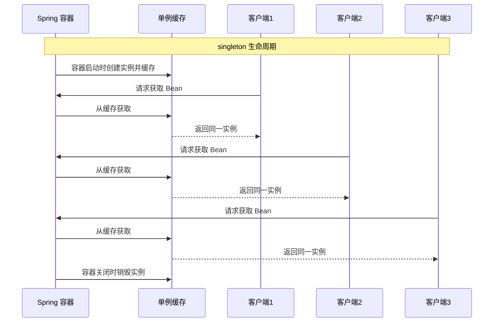
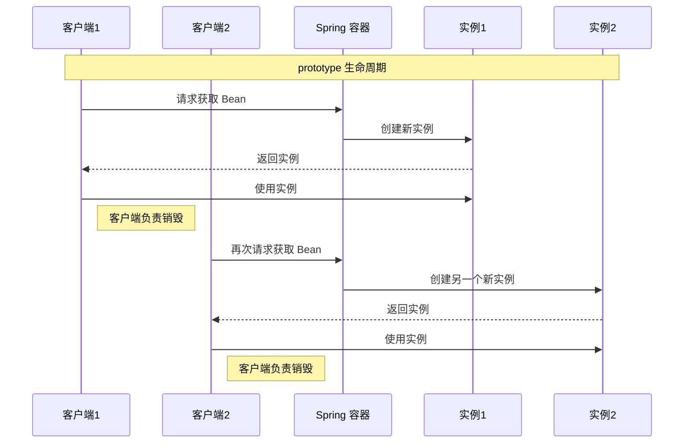
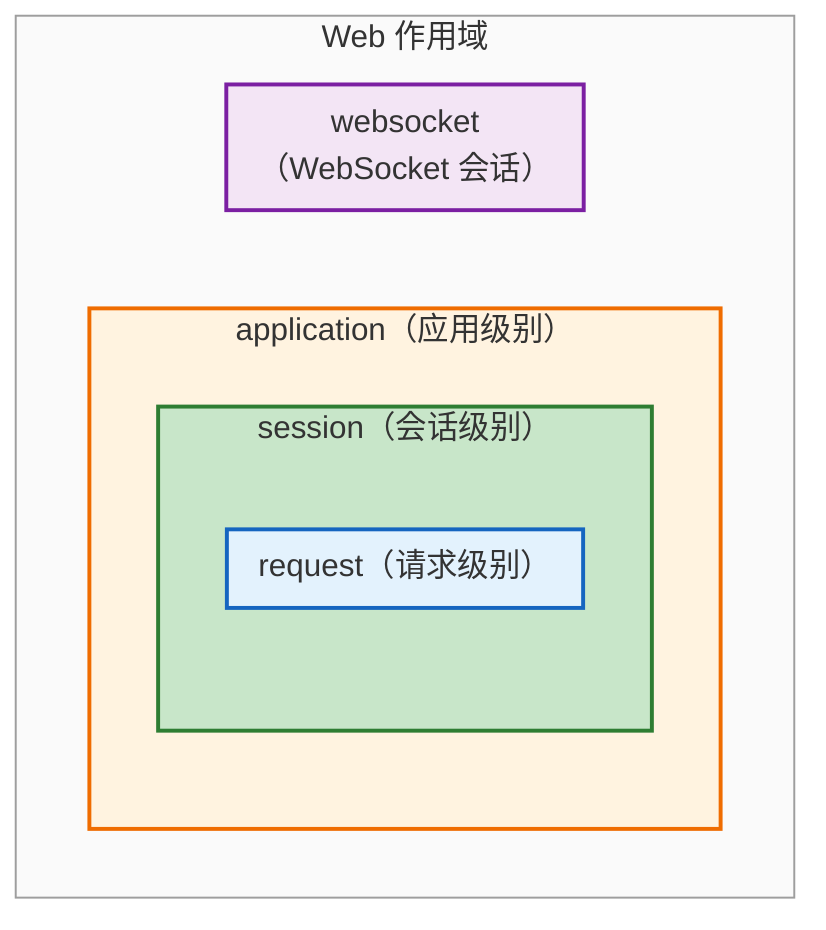
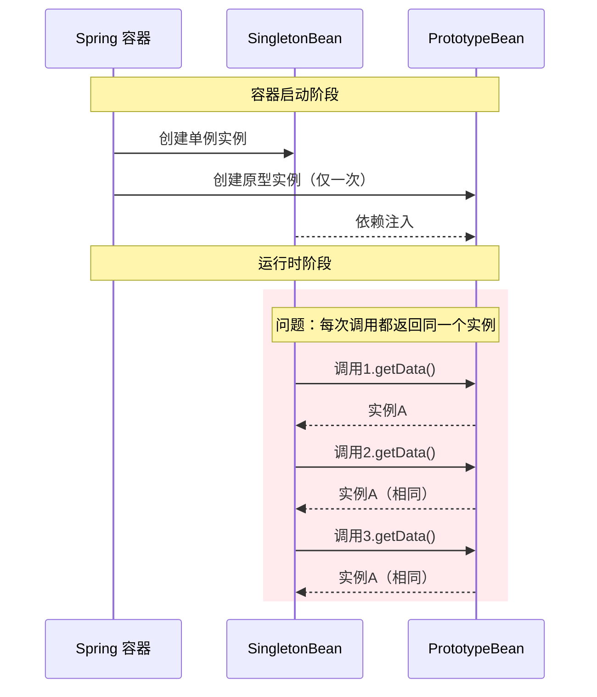
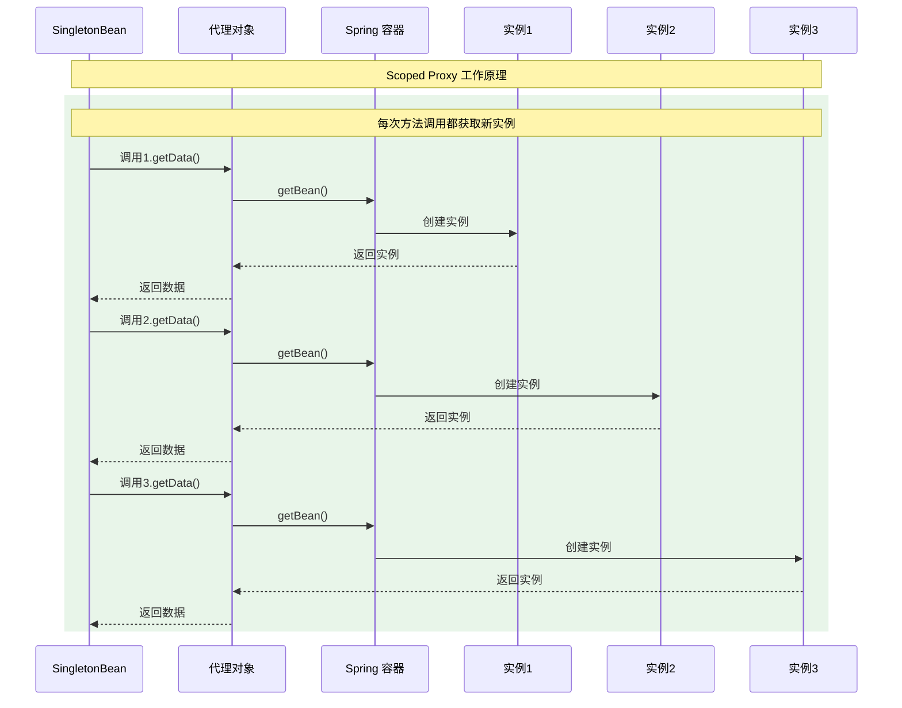
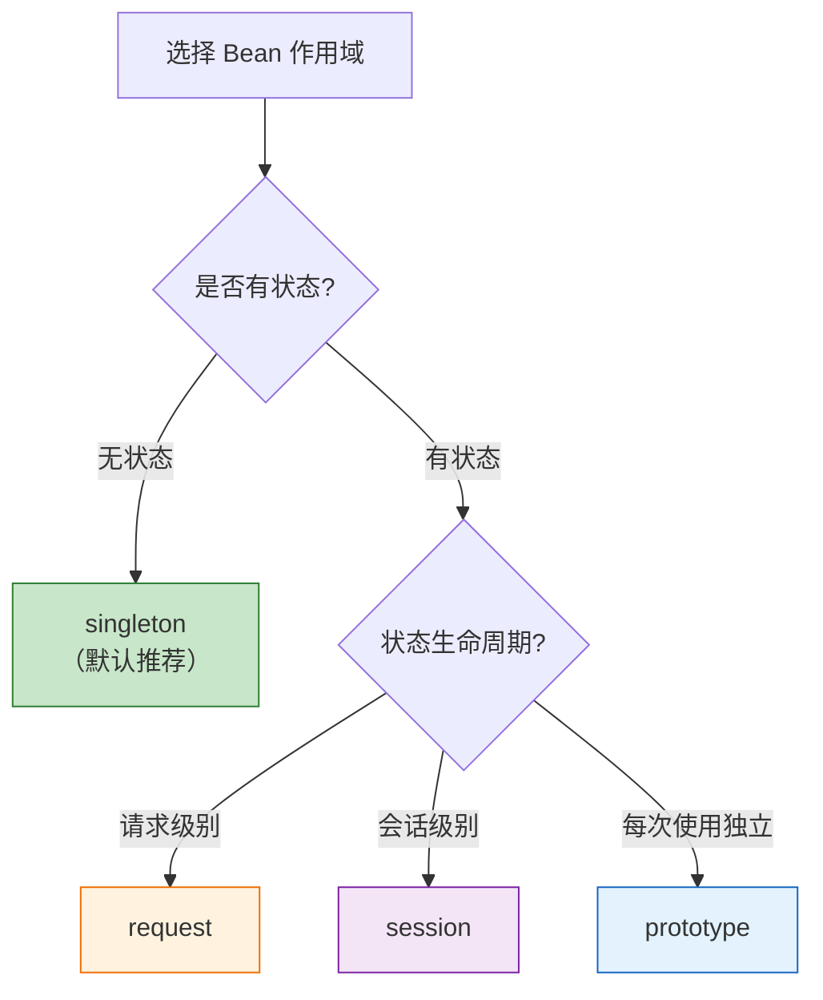

# Spring Bean 作用域详解

## 一、什么是 Bean 作用域？

Bean 作用域定义了 Spring 容器创建和管理 Bean 实例的方式和生命周期。不同的作用域决定了 Bean 实例的创建时机、共享范围和销毁时机。

---

## 二、Bean 作用域类型

### 2.1 作用域概览

| 作用域 | 说明 | 适用场景 |
|--------|------|----------|
| **singleton** | 单例作用域（默认），整个容器中只有一个实例 | 无状态 Bean、工具类、配置类 |
| **prototype** | 原型作用域，每次获取都创建新实例 | 有状态 Bean、需要独立实例的场景 |
| **request** | 请求作用域，每个 HTTP 请求一个实例 | Web 应用，请求级别数据 |
| **session** | 会话作用域，每个 HTTP 会话一个实例 | Web 应用，用户会话数据 |
| **application** | 应用作用域，整个 ServletContext 一个实例 | Web 应用，全局配置 |
| **websocket** | WebSocket 作用域，每个 WebSocket 会话一个实例 | WebSocket 应用 |

### 2.2 singleton（单例作用域）

**特点**：
- Spring 默认作用域
- 容器中只存在一个实例
- 容器启动时创建（默认），所有请求共享同一实例

```java
@Component
// 默认即为 singleton，可省略
@Scope("singleton")
public class SingletonBean {
    // 无状态，线程安全
}
```

**生命周期**：



### 2.3 prototype（原型作用域）

**特点**：
- 每次获取都创建新实例
- 容器不管理完整生命周期（只负责创建，不负责销毁）
- 适合有状态的 Bean

```java
@Component
@Scope("prototype")
public class PrototypeBean {
    // 有状态，每次使用新实例
}
```

**生命周期**：



### 2.4 Web 作用域



```java
// request 作用域：每个 HTTP 请求创建一个实例，请求结束后销毁
@Component
@Scope(value = WebApplicationContext.SCOPE_REQUEST, proxyMode = ScopedProxyMode.TARGET_CLASS)
public class RequestScopedBean {}

// session 作用域：每个 HTTP 会话创建一个实例，会话过期后销毁
@Component
@Scope(value = WebApplicationContext.SCOPE_SESSION, proxyMode = ScopedProxyMode.TARGET_CLASS)
public class SessionScopedBean {}

// application 作用域：整个 ServletContext 共享一个实例，应用关闭时销毁
@Component
@Scope(value = WebApplicationContext.SCOPE_APPLICATION, proxyMode = ScopedProxyMode.TARGET_CLASS)
public class ApplicationScopedBean {}

// websocket 作用域：每个 WebSocket 会话创建一个实例，会话关闭后销毁
@Component
@Scope(value = "websocket", proxyMode = ScopedProxyMode.TARGET_CLASS)
public class WebSocketScopedBean {}
```

---

## 三、单例 Bean 依赖原型 Bean

### 3.1 问题场景

当单例 Bean 依赖原型 Bean 时，由于单例 Bean 只初始化一次，其依赖的原型 Bean 也只会注入一次，导致每次调用都使用同一个原型 Bean 实例。

```java
@Component
@Scope("prototype")
public class PrototypeBean {
    private String data = UUID.randomUUID().toString();
    public String getData() { return data; }
}

@Component
public class SingletonBean {
    @Autowired
    private PrototypeBean prototypeBean;  // 问题：只会注入一次
    
    public void doSomething() {
        System.out.println(prototypeBean.getData());  // 每次输出相同
    }
}
```

**问题图解**：



### 3.2 解决方案

#### 方案一：@Lookup 注解（推荐）

```java
@Component
public class SingletonBean {
    
    @Lookup
    public PrototypeBean getPrototypeBean() {
        // Spring 会重写此方法，返回新的原型实例
        return null;  // 返回值会被忽略
    }
    
    public void doSomething() {
        PrototypeBean prototypeBean = getPrototypeBean();  // 每次获取新实例
        System.out.println(prototypeBean.getData());
    }
}
```

**原理**：Spring 通过 CGLIB 动态代理重写 `@Lookup` 标注的方法，每次调用时从容器获取新的原型实例。

**CGLIB 动态代理原理**：
- CGLIB 通过**继承目标类**生成子类，重写被 `@Lookup` 标注的方法
- 运行时生成代理子类，方法调用被拦截并转发到容器获取 Bean
- 与 JDK 动态代理不同，CGLIB 不依赖接口，可直接代理类

**@Lookup 使用限制**：
| 限制 | 说明 |
|------|------|
| 方法不能是 `private` | CGLIB 无法重写 private 方法 |
| 方法不能是 `final` | final 方法无法被子类重写 |
| 方法不能是 `static` | 静态方法不参与多态，无法被代理 |
| 需要 CGLIB 依赖 | Spring 默认包含 CGLIB，但会增加代理开销 |
| 类不能是 `final` | final 类无法被继承代理 |

#### 方案二：ObjectFactory / ObjectProvider

**ObjectFactory 方式**：

```java
@Component
public class SingletonBean {
    
    @Autowired
    private ObjectFactory<PrototypeBean> prototypeBeanFactory;
    
    public void doSomething() {
        PrototypeBean bean = prototypeBeanFactory.getObject();
        System.out.println(bean.getData());
    }
}
```

**ObjectProvider 方式**（推荐）：

```java
@Component
public class SingletonBean {
    
    @Autowired
    private ObjectProvider<PrototypeBean> prototypeBeanProvider;
    
    public void doSomething() {
        PrototypeBean bean = prototypeBeanProvider.getObject();
        System.out.println(bean.getData());
    }
}
```

**优点**：
- 不需要 CGLIB 代理
- 代码侵入性低
- 支持延迟获取
- `ObjectProvider` 继承 `ObjectFactory`，提供更多便捷方法（如 `getIfAvailable`、`stream`）

#### 方案三：Scoped Proxy（作用域代理）

```java
@Component
@Scope(value = "prototype", proxyMode = ScopedProxyMode.TARGET_CLASS)
public class PrototypeBean {
    private String data = UUID.randomUUID().toString();
    public String getData() { return data; }
}

@Component
public class SingletonBean {
    @Autowired
    private PrototypeBean prototypeBean;  // 注入的是代理对象
    
    public void doSomething() {
        System.out.println(prototypeBean.getData());  // 每次调用代理方法时获取新实例
    }
}
```

**原理**：Spring 注入的是代理对象，每次调用代理方法时，代理会从容器获取真正的原型实例。

**proxyMode 取值说明**：

| 取值 | 代理方式 | 原理 | 适用场景 |
|------|----------|------|----------|
| `NO` | 不使用代理 | 直接注入实际对象 | 默认值，不解决作用域问题 |
| `DEFAULT` | 同 NO | 等同于 `NO` | 默认行为 |
| `INTERFACES` | JDK 动态代理 | 基于接口生成代理对象，要求目标类实现接口 | 目标类已实现接口 |
| `TARGET_CLASS` | CGLIB 代理 | 基于继承生成代理子类，不要求实现接口 | 目标类未实现接口（推荐） |

**代理机制对比**：

| 特性 | JDK 动态代理 | CGLIB 代理 |
|------|--------------|------------|
| 代理方式 | 基于接口 | 基于继承（子类） |
| 目标类要求 | 必须实现接口 | 无需实现接口 |
| 性能 | 方法调用稍快 | 对象创建稍快 |
| 限制 | 只能代理接口方法 | 无法代理 final 方法和类 |
| Spring 默认 | - | AOP 默认使用 CGLIB |



#### 方案四：ApplicationContextAware（不推荐）

```java
@Component
public class SingletonBean implements ApplicationContextAware {
    
    private ApplicationContext applicationContext;
    
    @Override
    public void setApplicationContext(ApplicationContext applicationContext) {
        this.applicationContext = applicationContext;
    }
    
    public void doSomething() {
        PrototypeBean prototypeBean = applicationContext.getBean(PrototypeBean.class);
        System.out.println(prototypeBean.getData());
    }
}
```

**缺点**：与 Spring API 强耦合，不推荐使用。

### 3.3 方案对比

| 方案 | 优点 | 缺点 | 推荐度 |
|------|------|------|--------|
| **@Lookup** | 简洁、侵入性低 | 需要 CGLIB、方法不能 private | ⭐⭐⭐⭐⭐ |
| **ObjectProvider** | 无代理开销、支持延迟加载 | 需要额外调用 getObject() | ⭐⭐⭐⭐⭐ |
| **Scoped Proxy** | 使用方式不变 | 每次方法调用都创建新实例 | ⭐⭐⭐⭐ |
| **ApplicationContextAware** | 灵活 | 与 Spring 强耦合 | ⭐⭐ |

---

## 四、最佳实践

### 4.1 作用域选择原则



### 4.2 线程安全注意事项

| 作用域 | 线程安全 | 说明 |
|--------|----------|------|
| singleton | ⚠️ 需注意 | 多线程共享，避免可变成员变量 |
| prototype | ✅ 相对安全 | 每次新实例，但需注意实例内部线程安全 |
| request | ✅ 安全 | 每个请求独立实例 |
| session | ⚠️ 需注意 | 同一会话可能多线程访问 |

### 4.3 常见陷阱

1. **单例 Bean 中使用可变成员变量**
   ```java
   @Component
   public class UnsafeSingleton {
       private String state;  // 危险：多线程共享
   }
   ```

2. **原型 Bean 未正确获取**
   ```java
   @Component
   public class SingletonBean {
       @Autowired
       private PrototypeBean bean;  // 错误：只会注入一次
   }
   ```

---

## 参考资料

- [Spring Framework Documentation - Bean Scopes](https://docs.spring.io/spring-framework/reference/core/beans/factory-scopes.html)
- [Spring boot 使用注解@Scope和@Lookup进行原型模式注入 - CSDN](https://blog.csdn.net/qq_42602515/article/details/119866323)
- [Spring单例的bean是单例还是原型 - CSDN](https://blog.csdn.net/qq_27218667/article/details/99690798)
