# Spring 事务管理机制详解

## 一、事务基础概念

### 1.1 事务的 ACID 特性

| 特性 | 说明 |
|------|------|
| **原子性（Atomicity）** | 事务中的所有操作要么全部成功，要么全部失败回滚，不会出现部分成功、部分失败的情况 |
| **一致性（Consistency）** | 事务执行前后，数据库从一个一致性状态变换到另一个一致性状态 |
| **隔离性（Isolation）** | 多个事务并发执行时，一个事务的执行不应影响其他事务的执行 |
| **持久性（Durability）** | 事务一旦提交，对数据库的修改就是永久性的，即使系统崩溃也不会丢失 |

### 1.2 事务并发问题

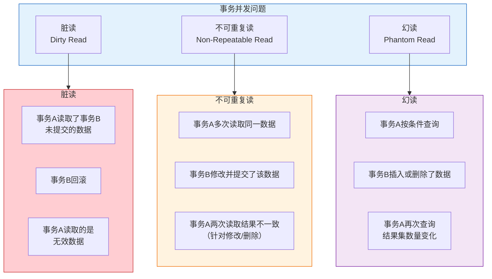

### 1.3 事务隔离级别

| 隔离级别 | 脏读 | 不可重复读 | 幻读 | 说明 |
|----------|------|------------|------|------|
| **READ_UNCOMMITTED**（读未提交） | 可能 | 可能 | 可能 | 隔离级别最低，性能最高 |
| **READ_COMMITTED**（读已提交） | 避免 | 可能 | 可能 | Oracle、SQL Server 默认级别 |
| **REPEATABLE_READ**（可重复读） | 避免 | 避免 | 可能 | MySQL 默认级别 |
| **SERIALIZABLE**（串行化） | 避免 | 避免 | 避免 | 隔离级别最高，性能最低 |

---

## 二、Spring 事务管理概述

### 2.1 Spring 事务管理架构

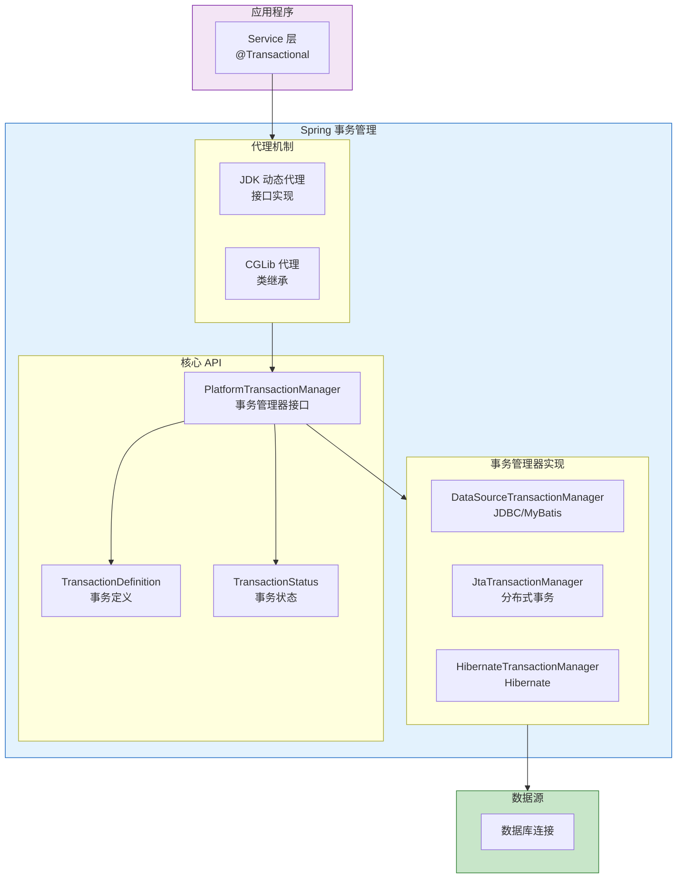

### 2.2 事务管理方式

| 方式 | 说明 | 优缺点 |
|------|------|--------|
| **编程式事务** | 通过 TransactionTemplate 手动控制事务 | 灵活性高，但代码侵入性强 |
| **声明式事务** | 通过 @Transactional 注解声明事务 | 代码简洁，无侵入性，推荐使用 |

---

## 三、Spring 事务核心 API

### 3.1 PlatformTransactionManager

PlatformTransactionManager 是 Spring 事务管理的核心接口：

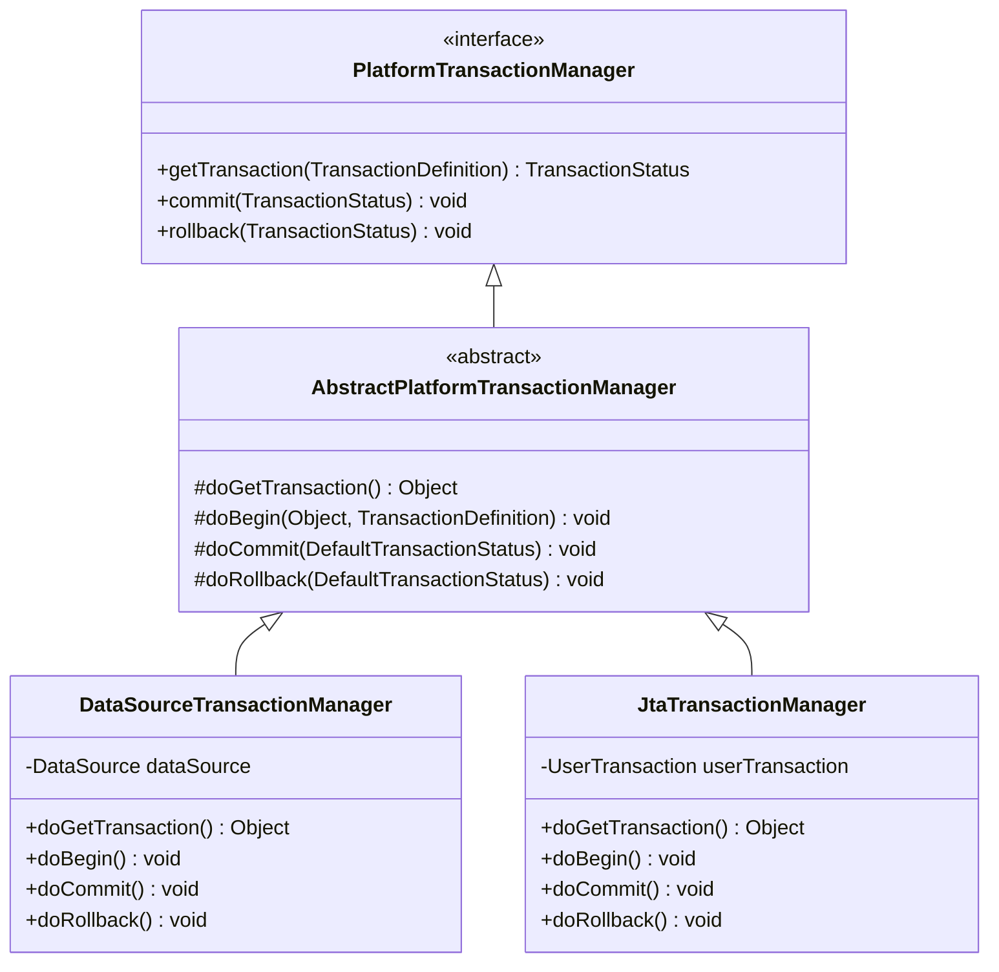

### 3.2 TransactionDefinition

TransactionDefinition 定义事务的属性：

| 属性 | 说明 | 默认值 |
|------|------|--------|
| **propagation** | 事务传播行为 | REQUIRED |
| **isolation** | 事务隔离级别 | DEFAULT（使用数据库默认） |
| **timeout** | 事务超时时间（秒） | -1（不超时） |
| **readOnly** | 是否只读事务 | false |
| **rollbackFor** | 触发回滚的异常类型 | RuntimeException |
| **noRollbackFor** | 不触发回滚的异常类型 | 无 |

### 3.3 TransactionStatus

TransactionStatus 代表事务的运行状态：

| 方法 | 说明 |
|------|------|
| **isNewTransaction()** | 是否是新事务 |
| **hasSavepoint()** | 是否有保存点 |
| **setRollbackOnly()** | 标记事务为回滚 |
| **isRollbackOnly()** | 是否标记为回滚 |
| **isCompleted()** | 事务是否已完成 |

---

## 四、事务传播行为

### 4.1 七种传播行为

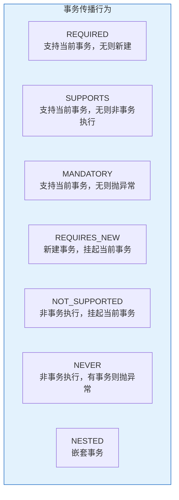

### 4.2 传播行为详解

| 传播行为 | 当前存在事务 | 当前不存在事务 | 说明 |
|----------|--------------|----------------|------|
| **REQUIRED** | 加入当前事务 | 新建事务 | 最常用的选择，默认值 |
| **SUPPORTS** | 加入当前事务 | 非事务执行 | 适合查询方法 |
| **MANDATORY** | 加入当前事务 | 抛出异常 | 必须在事务中调用 |
| **REQUIRES_NEW** | 挂起当前事务，新建事务 | 新建事务 | 独立事务，互不影响 |
| **NOT_SUPPORTED** | 挂起当前事务，非事务执行 | 非事务执行 | 不需要事务的方法 |
| **NEVER** | 抛出异常 | 非事务执行 | 不允许在事务中调用 |
| **NESTED** | 创建嵌套事务（Savepoint） | 新建事务 | 外层回滚影响内层，内层不影响外层 |

### 4.3 REQUIRED vs REQUIRES_NEW vs NESTED

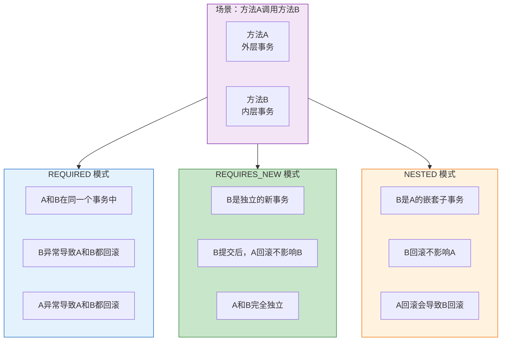

### 4.4 传播行为对比表

| 场景 | REQUIRED | REQUIRES_NEW | NESTED |
|------|----------|--------------|--------|
| **外层回滚** | 内层一起回滚 | 内层不受影响 | 内层一起回滚 |
| **内层回滚** | 外层一起回滚 | 外层不受影响 | 外层不受影响 |
| **事务关系** | 同一个事务 | 两个独立事务 | 父子事务 |
| **实现方式** | 加入现有事务 | 挂起现有事务，新建 | Savepoint |
| **资源消耗** | 低 | 高（需要新连接） | 中 |

---

## 五、事务实现原理

### 5.1 AOP 动态代理机制

Spring 事务通过 AOP 动态代理实现：

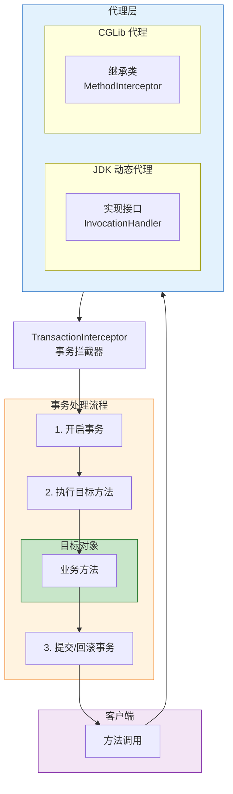

### 5.2 事务执行流程

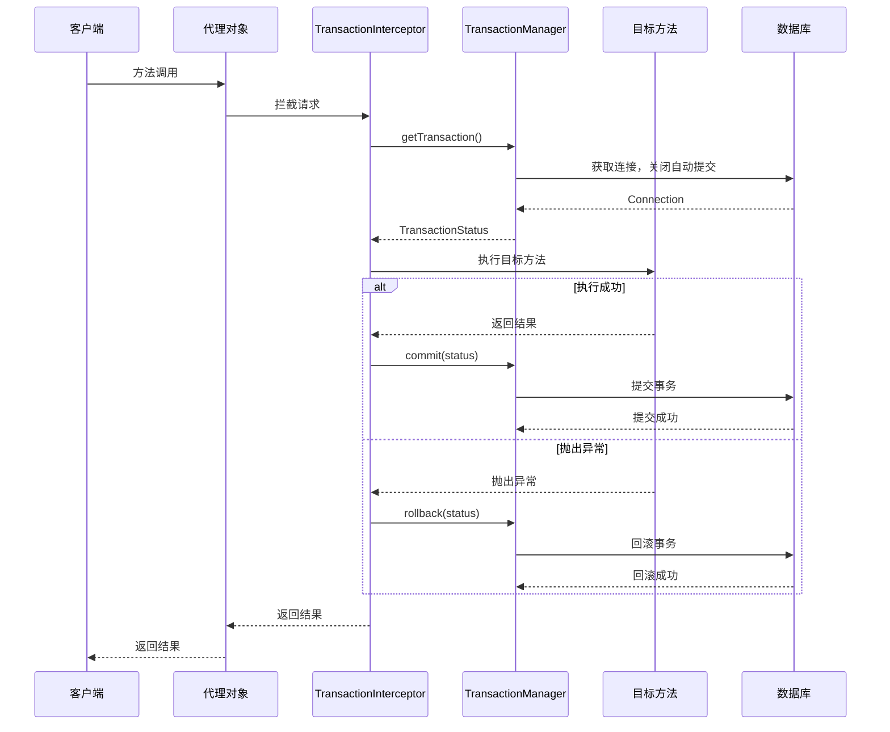

### 5.3 代理方式选择

| 条件 | 代理方式 | 说明 |
|------|----------|------|
| 目标类实现了接口 | JDK 动态代理 | 基于接口，生成代理类 |
| 目标类未实现接口 | CGLib 代理 | 基于继承，生成子类 |
| 配置 proxy-target-class=true | 强制 CGLib | Spring Boot 2.x 默认 |

---

## 六、@Transactional 注解详解

### 6.1 注解属性

```java
@Transactional(
    propagation = Propagation.REQUIRED,      // 传播行为
    isolation = Isolation.DEFAULT,           // 隔离级别
    timeout = -1,                            // 超时时间（秒）
    readOnly = false,                        // 是否只读
    rollbackFor = RuntimeException.class,    // 回滚异常类型
    noRollbackFor = {},                      // 不回滚异常类型
    value = "transactionManager",            // 事务管理器名称
    label = {}                               // 事务标签
)
```

### 6.2 常用属性详解

#### propagation（传播行为）

```java
@Transactional(propagation = Propagation.REQUIRED)
public void saveUser(User user) {
    userDao.save(user);
}

@Transactional(propagation = Propagation.REQUIRES_NEW)
public void saveLog(Log log) {
    logDao.save(log);
}
```

#### isolation（隔离级别）

```java
@Transactional(isolation = Isolation.READ_COMMITTED)
public User getUserById(Long id) {
    return userDao.findById(id);
}

@Transactional(isolation = Isolation.REPEATABLE_READ)
public List<User> listUsers() {
    return userDao.findAll();
}
```

#### readOnly（只读事务）

```java
@Transactional(readOnly = true)
public User getUserById(Long id) {
    return userDao.findById(id);
}
```

**只读事务的优点**：
- 数据库可以进行优化，提高查询性能
- 避免不必要的锁操作
- 明确表明事务意图，提高代码可读性

#### rollbackFor（回滚异常）

```java
@Transactional(rollbackFor = Exception.class)
public void saveUser(User user) throws Exception {
    userDao.save(user);
    if (user.getId() == null) {
        throw new Exception("用户ID不能为空");
    }
}
```

**注意**：默认只对 RuntimeException 和 Error 回滚，对 checked Exception 不回滚。

### 6.3 注解使用位置

| 位置 | 说明 |
|------|------|
| **类上** | 该类所有 public 方法都具有事务 |
| **方法上** | 该方法具有事务（优先级高于类上） |
| **接口上** | 不推荐，可能因代理方式导致失效 |

---

## 七、事务失效场景

### 7.1 事务失效场景汇总

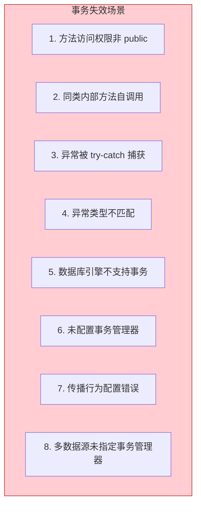

### 7.2 场景详解与解决方案

#### 场景一：方法访问权限非 public

```java
@Service
public class UserService {
    
    @Transactional
    private void saveUser(User user) {
        userDao.save(user);
    }
}
```

**原因**：Spring AOP 只能代理 public 方法。

**解决方案**：将方法改为 public。

#### 场景二：同类内部方法自调用

```java
@Service
public class UserService {
    
    public void createUser(User user) {
        saveUser(user);
    }
    
    @Transactional
    public void saveUser(User user) {
        userDao.save(user);
    }
}
```

**原因**：内部调用走的是 this 引用，不是代理对象。

**解决方案**：

```java
@Service
public class UserService {
    
    @Autowired
    private UserService self;
    
    public void createUser(User user) {
        self.saveUser(user);
    }
    
    @Transactional
    public void saveUser(User user) {
        userDao.save(user);
    }
}
```

或使用 AopContext：

```java
((UserService) AopContext.currentProxy()).saveUser(user);
```

#### 场景三：异常被 try-catch 捕获

```java
@Service
public class UserService {
    
    @Transactional
    public void saveUser(User user) {
        try {
            userDao.save(user);
            throw new RuntimeException("异常");
        } catch (Exception e) {
            e.printStackTrace();
        }
    }
}
```

**原因**：异常被捕获后未抛出，事务管理器认为方法正常执行。

**解决方案**：

```java
@Service
public class UserService {
    
    @Transactional
    public void saveUser(User user) {
        try {
            userDao.save(user);
            throw new RuntimeException("异常");
        } catch (Exception e) {
            throw e;
        }
    }
}
```

或手动回滚：

```java
@Service
public class UserService {
    
    @Autowired
    private TransactionTemplate transactionTemplate;
    
    public void saveUser(User user) {
        transactionTemplate.execute(status -> {
            try {
                userDao.save(user);
                throw new RuntimeException("异常");
            } catch (Exception e) {
                status.setRollbackOnly();
            }
            return null;
        });
    }
}
```

#### 场景四：异常类型不匹配

```java
@Service
public class UserService {
    
    @Transactional
    public void saveUser(User user) throws Exception {
        userDao.save(user);
        throw new Exception("检查异常");
    }
}
```

**原因**：默认只对 RuntimeException 回滚，对 checked Exception 不回滚。

**解决方案**：

```java
@Transactional(rollbackFor = Exception.class)
public void saveUser(User user) throws Exception {
    userDao.save(user);
    throw new Exception("检查异常");
}
```

#### 场景五：数据库引擎不支持事务

**原因**：MySQL 的 MyISAM 引擎不支持事务。

**解决方案**：使用 InnoDB 引擎。

```sql
ALTER TABLE user ENGINE = InnoDB;
```

#### 场景六：未配置事务管理器

```java
@Configuration
public class DataSourceConfig {
    
    @Bean
    public PlatformTransactionManager transactionManager(DataSource dataSource) {
        return new DataSourceTransactionManager(dataSource);
    }
}
```

#### 场景七：传播行为配置错误

```java
@Transactional(propagation = Propagation.NOT_SUPPORTED)
public void saveUser(User user) {
    userDao.save(user);
}
```

**原因**：NOT_SUPPORTED 表示以非事务方式执行。

#### 场景八：多数据源未指定事务管理器

```java
@Service
public class UserService {
    
    @Transactional("primaryTransactionManager")
    public void saveUser(User user) {
        userDao.save(user);
    }
    
    @Transactional("secondaryTransactionManager")
    public void saveOrder(Order order) {
        orderDao.save(order);
    }
}
```

### 7.3 事务失效场景总结

| 场景 | 原因 | 解决方案 |
|------|------|----------|
| 非 public 方法 | AOP 只代理 public | 改为 public |
| 同类自调用 | 走 this 而非代理 | 注入自身或 AopContext |
| 异常被捕获 | 未抛出异常 | 抛出异常或手动回滚 |
| 异常类型不匹配 | 默认只回滚 RuntimeException | 指定 rollbackFor |
| 数据库引擎不支持 | MyISAM 不支持事务 | 使用 InnoDB |
| 未配置事务管理器 | 缺少事务管理器 Bean | 配置 PlatformTransactionManager |
| 传播行为错误 | NOT_SUPPORTED 等不开启事务 | 选择合适的传播行为 |
| 多数据源 | 未指定事务管理器 | 指定 value 或 transactionManager |

---

## 八、跨线程事务问题与解决方案

### 8.1 问题背景

Spring 的声明式事务（@Transactional）在多线程场景下会失效，这是因为 Spring 事务上下文存储在 `ThreadLocal` 中，具有线程隔离特性。

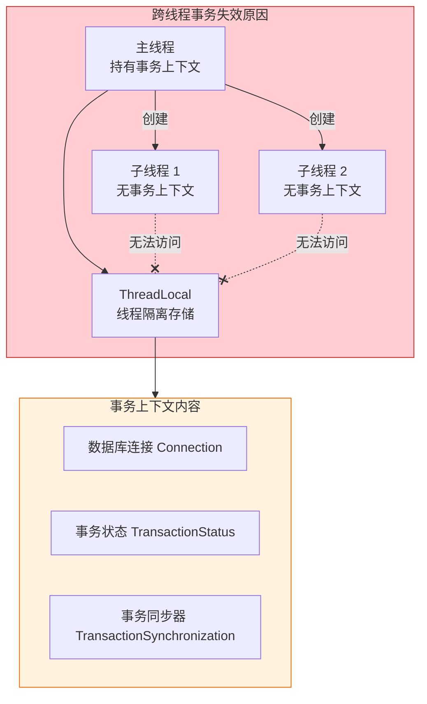

**核心问题**：

| 问题 | 说明 |
|------|------|
| **ThreadLocal 隔离** | TransactionSynchronizationManager 使用 ThreadLocal 存储事务上下文，子线程无法继承 |
| **事务传播失效** | Spring 事务传播行为（REQUIRED、REQUIRES_NEW 等）仅作用于同一线程内 |
| **Connection 线程绑定** | JDBC Connection 与线程绑定，跨线程共享存在线程安全问题 |

### 8.2 解决方案概览

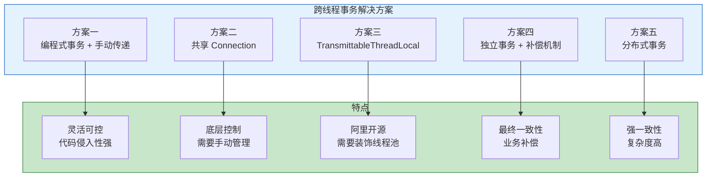

### 8.3 方案一：编程式事务 + 手动传递 Connection

通过编程式事务手动控制事务边界，将 Connection 传递给子线程。

```java
@Service
public class OrderService {
    
    @Autowired
    private DataSource dataSource;
    
    @Autowired
    private PlatformTransactionManager transactionManager;
    
    public void batchInsert(List<Order> orders) {
        TransactionStatus status = transactionManager.getTransaction(new DefaultTransactionDefinition());
        
        try {
            Connection connection = DataSourceUtils.getConnection(dataSource);
            
            CountDownLatch latch = new CountDownLatch(orders.size());
            List<Future<?>> futures = new ArrayList<>();
            
            for (Order order : orders) {
                Future<?> future = Executors.newCachedThreadPool().submit(() -> {
                    try {
                        doInsert(connection, order);
                    } finally {
                        latch.countDown();
                    }
                });
                futures.add(future);
            }
            
            latch.await();
            
            for (Future<?> future : futures) {
                try {
                    future.get();
                } catch (ExecutionException e) {
                    throw new RuntimeException(e.getCause());
                }
            }
            
            transactionManager.commit(status);
        } catch (Exception e) {
            transactionManager.rollback(status);
            throw new RuntimeException(e);
        }
    }
    
    private void doInsert(Connection connection, Order order) throws SQLException {
        try (PreparedStatement ps = connection.prepareStatement("INSERT INTO orders (...) VALUES (...)")) {
            ps.setLong(1, order.getId());
            ps.executeUpdate();
        }
    }
}
```

**注意事项**：
- Connection 需要确保线程安全使用
- 需要手动处理异常和回滚
- 适合批量操作场景

### 8.4 方案二：共享 Connection（原生 JDBC 方式）

手动获取 Connection 并传递给子线程，绕过 Spring 事务管理。

```java
@Service
public class BatchService {
    
    @Autowired
    private DataSource dataSource;
    
    public void batchProcess(List<DataItem> items) throws Exception {
        Connection connection = dataSource.getConnection();
        
        try {
            connection.setAutoCommit(false);
            
            int threadCount = 4;
            ExecutorService executor = Executors.newFixedThreadPool(threadCount);
            CountDownLatch latch = new CountDownLatch(items.size());
            AtomicBoolean hasError = new AtomicBoolean(false);
            
            for (DataItem item : items) {
                executor.submit(() -> {
                    try {
                        processItem(connection, item);
                    } catch (Exception e) {
                        hasError.set(true);
                    } finally {
                        latch.countDown();
                    }
                });
            }
            
            latch.await();
            executor.shutdown();
            
            if (hasError.get()) {
                connection.rollback();
            } else {
                connection.commit();
            }
        } finally {
            connection.close();
        }
    }
    
    private void processItem(Connection connection, DataItem item) throws SQLException {
        try (PreparedStatement ps = connection.prepareStatement("INSERT INTO data (...) VALUES (...)")) {
            ps.setString(1, item.getValue());
            ps.executeUpdate();
        }
    }
}
```

### 8.5 方案三：使用 TransmittableThreadLocal（阿里 TTL）

阿里巴巴开源的 TransmittableThreadLocal（TTL）可以解决线程池场景下的上下文传递问题。

#### 引入依赖

```xml
<dependency>
    <groupId>com.alibaba</groupId>
    <artifactId>transmittable-thread-local</artifactId>
    <version>2.14.5</version>
</dependency>
```

#### 自定义事务上下文传递

```java
public class TransactionContextHolder {
    
    private static final TransmittableThreadLocal<Connection> CONNECTION_HOLDER = 
        new TransmittableThreadLocal<>();
    
    public static void setConnection(Connection connection) {
        CONNECTION_HOLDER.set(connection);
    }
    
    public static Connection getConnection() {
        return CONNECTION_HOLDER.get();
    }
    
    public static void clear() {
        CONNECTION_HOLDER.remove();
    }
}

@Service
public class OrderService {
    
    @Autowired
    private DataSource dataSource;
    
    @Autowired
    private PlatformTransactionManager transactionManager;
    
    public void processWithTransaction(List<Order> orders) {
        TransactionStatus status = transactionManager.getTransaction(new DefaultTransactionDefinition());
        Connection connection = null;
        
        try {
            connection = DataSourceUtils.getConnection(dataSource);
            TransactionContextHolder.setConnection(connection);
            
            ExecutorService executor = TtlExecutors.getTtlExecutorService(
                Executors.newFixedThreadPool(4)
            );
            
            CountDownLatch latch = new CountDownLatch(orders.size());
            AtomicBoolean hasError = new AtomicBoolean(false);
            
            for (Order order : orders) {
                executor.submit(() -> {
                    try {
                        Connection conn = TransactionContextHolder.getConnection();
                        doInsert(conn, order);
                    } catch (Exception e) {
                        hasError.set(true);
                    } finally {
                        latch.countDown();
                    }
                });
            }
            
            latch.await();
            executor.shutdown();
            
            if (hasError.get()) {
                transactionManager.rollback(status);
            } else {
                transactionManager.commit(status);
            }
        } catch (Exception e) {
            transactionManager.rollback(status);
            throw new RuntimeException(e);
        } finally {
            TransactionContextHolder.clear();
            if (connection != null) {
                DataSourceUtils.releaseConnection(connection, dataSource);
            }
        }
    }
    
    private void doInsert(Connection connection, Order order) throws SQLException {
        try (PreparedStatement ps = connection.prepareStatement("INSERT INTO orders (...) VALUES (...)")) {
            ps.setLong(1, order.getId());
            ps.executeUpdate();
        }
    }
}
```

#### 使用 TTL 装饰线程池

```java
@Configuration
public class ThreadPoolConfig {
    
    @Bean
    public ExecutorService taskExecutor() {
        ExecutorService executorService = Executors.newFixedThreadPool(8);
        return TtlExecutors.getTtlExecutorService(executorService);
    }
}
```

**TTL 工作原理**：

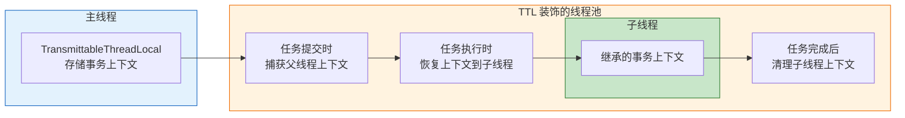

### 8.6 方案四：独立事务 + 补偿机制

每个线程使用独立事务，通过补偿机制保证最终一致性。

#### 补偿机制工作流程

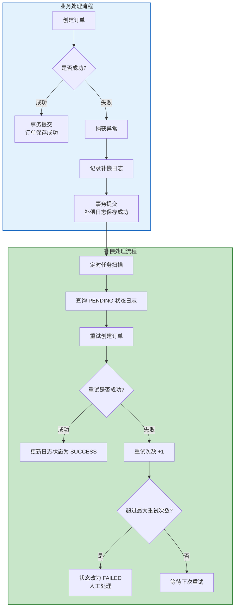

#### 代码实现

```java
@Service
public class OrderService {
    
    @Autowired
    private OrderDao orderDao;
    
    @Autowired
    private CompensateLogDao compensateLogDao;
    
    public void batchCreateOrders(List<OrderDTO> orderDTOs) {
        List<CompletableFuture<Void>> futures = new ArrayList<>();
        
        for (OrderDTO dto : orderDTOs) {
            CompletableFuture<Void> future = CompletableFuture.runAsync(() -> {
                createOrderWithCompensate(dto);
            });
            futures.add(future);
        }
        
        CompletableFuture.allOf(futures.toArray(new CompletableFuture[0])).join();
    }
    
    @Transactional(propagation = Propagation.REQUIRES_NEW, rollbackFor = Exception.class)
    public void createOrderWithCompensate(OrderDTO dto) {
        try {
            Order order = new Order();
            order.setUserId(dto.getUserId());
            orderDao.save(order);
        } catch (Exception e) {
            CompensateLog log = new CompensateLog();
            log.setOrderId(dto.getOrderId());
            log.setReason(e.getMessage());
            log.setStatus("PENDING");
            log.setRetryCount(0);
            log.setCreateTime(new Date());
            compensateLogDao.save(log);
        }
    }
}
```

**关键说明**：

| 问题 | 说明 |
|------|------|
| **为什么 catch 后不抛出异常？** | 如果抛出异常，事务会回滚，补偿日志也会丢失，无法进行后续处理 |
| **事务提交的内容是什么？** | 捕获异常后，事务提交的是补偿日志，而非订单数据 |
| **rollbackFor 还有意义吗？** | 有意义，用于处理补偿日志保存失败的情况 |

#### 补偿日志处理任务

```java
@Component
public class CompensateTask {
    
    private static final int MAX_RETRY_COUNT = 3;
    
    @Autowired
    private CompensateLogDao compensateLogDao;
    
    @Autowired
    private OrderDao orderDao;
    
    @Scheduled(fixedRate = 60000)
    @Transactional
    public void processCompensateLog() {
        List<CompensateLog> logs = compensateLogDao.findByStatusAndRetryCountLessThan(
            "PENDING", MAX_RETRY_COUNT);
        
        for (CompensateLog log : logs) {
            try {
                Order order = new Order();
                order.setId(log.getOrderId());
                orderDao.save(order);
                
                log.setStatus("SUCCESS");
                log.setUpdateTime(new Date());
                compensateLogDao.update(log);
            } catch (Exception e) {
                log.setRetryCount(log.getRetryCount() + 1);
                log.setUpdateTime(new Date());
                
                if (log.getRetryCount() >= MAX_RETRY_COUNT) {
                    log.setStatus("FAILED");
                }
                compensateLogDao.update(log);
            }
        }
    }
}
```

### 8.7 方案五：分布式事务

使用分布式事务框架（如 Seata）实现跨线程、跨服务的事务一致性。

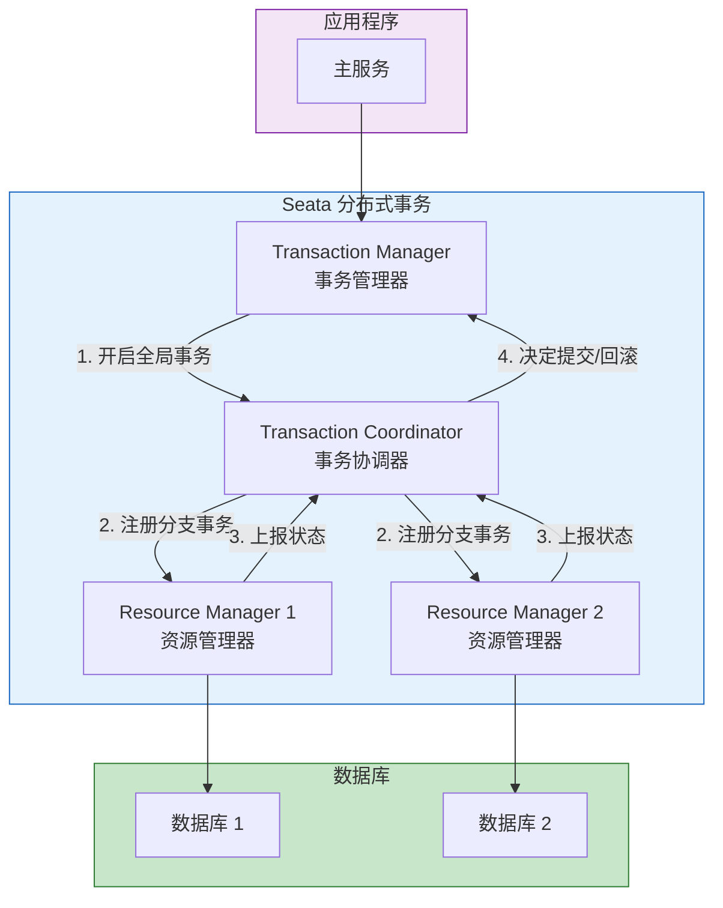

#### Seata 配置示例

```yaml
seata:
  enabled: true
  application-id: order-service
  tx-service-group: my_tx_group
  service:
    vgroup-mapping:
      my_tx_group: default
  registry:
    type: nacos
    nacos:
      server-addr: localhost:8848
```

```java
@Service
public class OrderService {
    
    @GlobalTransactional
    public void createOrder(OrderDTO orderDTO) {
        orderDao.save(orderDTO);
        inventoryService.deductStock(orderDTO.getProductId(), orderDTO.getQuantity());
        pointService.addPoints(orderDTO.getUserId(), orderDTO.getPoints());
    }
}
```

### 8.8 方案对比

| 方案 | 一致性 | 复杂度 | 性能 | 适用场景 |
|------|--------|--------|------|----------|
| **编程式事务 + 手动传递** | 强一致 | 中 | 高 | 批量操作、单数据源 |
| **共享 Connection** | 强一致 | 高 | 高 | 单数据源、底层控制 |
| **TransmittableThreadLocal** | 强一致 | 中 | 高 | 线程池场景、上下文传递 |
| **独立事务 + 补偿** | 最终一致 | 中 | 高 | 允许短暂不一致的业务 |
| **分布式事务** | 强一致 | 高 | 中 | 多数据源、微服务架构 |

### 8.9 最佳实践建议

| 场景 | 推荐方案 |
|------|----------|
| **单数据源批量操作** | 编程式事务 + 共享 Connection |
| **需要上下文传递** | TransmittableThreadLocal |
| **允许最终一致性** | 独立事务 + 补偿机制 |
| **多数据源/微服务** | Seata 分布式事务 |
| **简单场景** | 避免跨线程事务，改用单线程处理 |

---

## 九、最佳实践

### 9.1 事务使用建议

| 建议 | 说明 |
|------|------|
| **只在 Service 层使用事务** | 事务边界应该在业务逻辑层 |
| **事务方法尽量小** | 减少锁持有时间，提高并发性能 |
| **避免嵌套事务** | 逻辑复杂，容易出错 |
| **只读查询使用 readOnly** | 提高性能，明确意图 |
| **指定 rollbackFor** | 避免检查异常不回滚 |
| **避免事务中调用远程服务** | 远程调用失败可能导致事务回滚 |
| **避免事务中进行耗时操作** | 如文件上传、复杂计算等 |

### 9.2 事务配置示例

```java
@Service
@Transactional
public class OrderServiceImpl implements OrderService {
    
    @Autowired
    private OrderDao orderDao;
    
    @Autowired
    private ProductDao productDao;
    
    @Override
    @Transactional(rollbackFor = Exception.class)
    public void createOrder(OrderDTO orderDTO) {
        Order order = new Order();
        order.setUserId(orderDTO.getUserId());
        order.setTotalAmount(orderDTO.getTotalAmount());
        orderDao.save(order);
        
        for (OrderItemDTO item : orderDTO.getItems()) {
            Product product = productDao.findById(item.getProductId());
            if (product.getStock() < item.getQuantity()) {
                throw new RuntimeException("库存不足");
            }
            product.setStock(product.getStock() - item.getQuantity());
            productDao.update(product);
        }
    }
    
    @Override
    @Transactional(readOnly = true)
    public Order getOrderById(Long id) {
        return orderDao.findById(id);
    }
    
    @Override
    @Transactional(propagation = Propagation.REQUIRES_NEW, rollbackFor = Exception.class)
    public void saveOrderLog(OrderLog log) {
        orderLogDao.save(log);
    }
}
```

### 9.3 Spring Boot 配置

```yaml
spring:
  datasource:
    url: jdbc:mysql://localhost:3306/mydb
    username: root
    password: password
    driver-class-name: com.mysql.cj.jdbc.Driver
  transaction:
    default-timeout: 30
    rollback-on-commit-failure: true
```

---

## 参考资料

- [Spring Framework 官方文档](https://docs.spring.io/spring-framework/reference/data-access/transaction.html)
- [Spring 事务传播行为详解](https://blog.csdn.net/fly910905/article/details/80000242)
- [Spring 事务失效场景分析](https://blog.csdn.net/2301_80224759/article/details/157843704)
