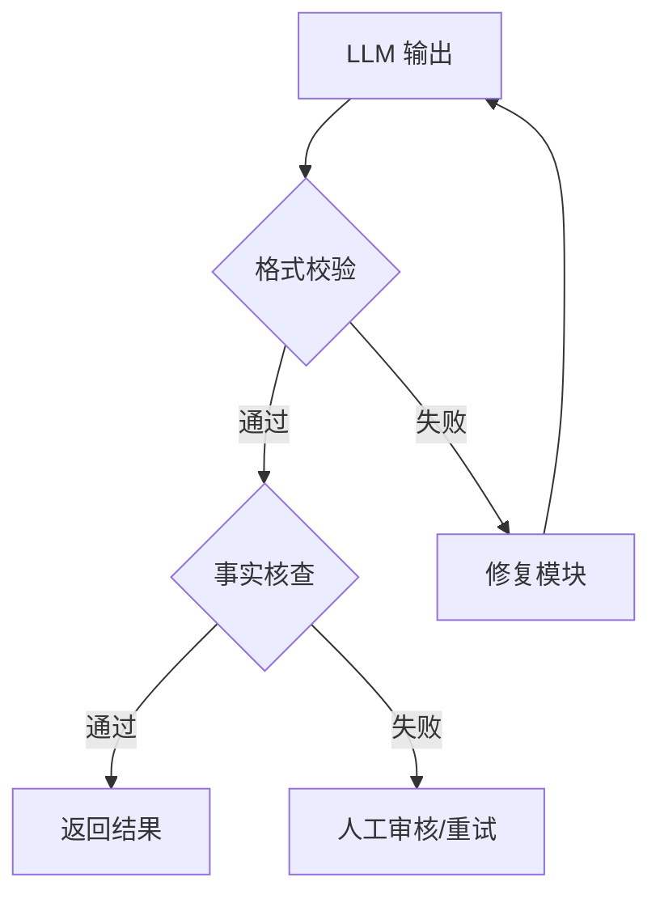

# AI 大模型幻觉与输出稳定性解决方案

## 一、幻觉问题概述

### 1.1 什么是幻觉？

幻觉（Hallucination）是指大语言模型生成与事实不符、虚构或误导性信息的现象。模型会"一本正经胡说八道"，输出看似合理但实际错误的内容。

### 1.2 幻觉的分类

| 类型 | 特征 | 示例 |
|------|------|------|
| **事实冲突** | 与客观知识矛盾 | "亚马逊河位于非洲"（实际在南美洲） |
| **无中生有** | 虚构无法验证的内容 | 补充未提供的房源楼层信息 |
| **指令误解** | 偏离用户意图 | 将翻译指令回答为事实陈述 |
| **逻辑错误** | 推理过程漏洞 | 解方程步骤正确但结果错误 |

### 1.3 高风险场景

| 场景 | 风险说明 |
|------|----------|
| **小众话题** | 训练数据稀疏，模型易编造细节 |
| **虚假引用** | 生成看似规范但不存在的参考文献 |
| **数学推理** | 多步骤计算易跳步导致错误 |
| **医疗法律** | 专业领域信息错误可能造成严重后果 |
| **推测性内容** | 对未来事件过度预测 |

---

## 二、幻觉产生的原因

### 2.1 预训练阶段

| 原因 | 说明 |
|------|------|
| **训练数据噪声** | 数据包含错误、过时、偏见信息 |
| **领域知识稀疏** | 特定领域专业数据不足 |
| **事实验证缺失** | 优化目标是语言流畅性而非准确性 |

### 2.2 微调阶段

| 原因 | 说明 |
|------|------|
| **标注错误** | 训练数据标注不一致 |
| **过拟合** | 对错误知识过于自信 |

### 2.3 对齐阶段（RLHF）

| 原因 | 说明 |
|------|------|
| **奖励设计缺陷** | 模型为迎合目标牺牲真实性 |

### 2.4 推理阶段

| 原因 | 说明 |
|------|------|
| **Token 级生成** | 无法修正早期错误，滚雪球式扩大 |
| **随机采样** | 引入多样性的同时增加幻觉风险 |
| **提示模糊** | 用户指令不明确导致推测性输出 |

---

## 三、幻觉解决方案

### 3.1 检索增强生成（RAG）

**核心思想**：将"闭卷考试"转为"开卷考试"，通过外部知识库提供实时依据。


**优势**：
- 突破模型参数化知识边界
- 提升时效性与领域适应性
- 研究显示可降低幻觉率 42%-68%

**局限**：
- 知识冲突时仍可能产生幻觉
- 依赖检索质量

### 3.2 思维链提示（CoT）

**核心思想**：引导模型分步思考，强制暴露推理过程，减少逻辑漏洞。

**示例**：

```
请按以下步骤解答：
1. 分析问题中的关键信息
2. 列出已知条件
3. 逐步推理
4. 验证结果
5. 给出最终答案
```

**效果**：可使推理任务准确率提升 35%，GPT-4 数学错误率降低 28%。

### 3.3 提示工程优化

| 策略 | 说明 | 示例 |
|------|------|------|
| **明确约束** | 限制回答范围 | "请根据提供的资料回答，资料中没有则回答'信息不足'" |
| **要求引用** | 强制标注来源 | "回答时必须注明信息来源" |
| **Few-shot 示例** | 提供输入输出示例 | 给出 2-3 个标准问答范例 |
| **否定约束** | 明确禁止行为 | "不要使用缩写，避免口语化表达" |

### 3.4 人类反馈强化学习（RLHF）

**核心思想**：通过人类评价校准输出，让模型优先输出可验证内容，惩罚幻觉回答。

**流程**：


### 3.5 幻觉检测技术

#### 白盒方案（需模型访问权限）

| 方法 | 说明 |
|------|------|
| **不确定性度量** | 提取关键概念，计算 token 概率，概率越低风险越高 |
| **注意力机制分析** | Lookback Ratio（对上下文/新生成内容的注意力比值）越低，风险越高 |
| **隐藏状态分析** | 正确内容对应低熵值激活模式，错误内容呈现高熵值模糊模式 |

#### 黑盒方案（仅 API 调用）

| 方法 | 说明 |
|------|------|
| **采样一致性检测** | 同一问题多次生成，输出不一致则标识风险 |
| **规则引擎** | ROUGE、BLEU 等统计指标衡量输出与源信息重叠度 |
| **命名实体识别** | 生成的命名实体未出现在知识源中则存在风险 |

### 3.6 外部工具验证



---

## 四、输出不稳定的原因

### 4.1 技术成因

| 原因 | 说明 |
|------|------|
| **随机性解码** | 默认使用采样而非贪婪解码，引入随机变量 |
| **上下文敏感性** | 对输入表述微小变化敏感，标点、换行可能导致路径偏移 |
| **训练数据噪声** | 预训练语料存在多种表达方式，模型学习到多模态输出分布 |
| **并行计算误差** | 即使固定种子，部分框架因浮点误差引发偏差 |
| **缺乏外部约束** | 模型内部无强制校验逻辑 |

---

## 五、输出稳定性解决方案

### 5.1 解码参数控制

| 参数 | 推荐值 | 作用说明 |
|------|--------|----------|
| **temperature** | 0 或 0.01 | 降低输出随机性 |
| **top_p** | 1.0（关闭）或 0.9 | 限制候选词汇集 |
| **top_k** | 1~50 | 仅保留前 k 个高概率词 |
| **do_sample** | false | 启用贪婪/束搜索 |
| **num_beams** | 4~8 | 束搜索宽度，提升一致性 |
| **seed** | 固定整数 | 确保可复现性 |
| **repetition_penalty** | 1.0~1.2 | 抑制重复文本 |

### 5.2 Temperature 参数详解

**数学原理**：温度作用于 softmax 函数的输出分布：

```
softmax(logits / temperature)
```

| 温度值 | 行为特征 | 适用场景 |
|--------|----------|----------|
| **0** | 完全确定性，贪婪解码 | 代码生成、数学计算、JSON 输出 |
| **0.1-0.3** | 稳定且少量创造性 | 技术文档、数据提取 |
| **0.7-1.0** | 更有创意、语言自由 | 创意写作、营销文案 |
| **>1.0** | 非常随机，可能失控 | 不推荐 |

### 5.3 Top-K 与 Top-P 协同

**工作流程**：


**注意**：Temperature 和 Top-P 只调其中一个，不要同时调整。

### 5.4 推荐配置组合

| 任务类型 | Temperature | Top-P | Top-K | 说明 |
|----------|-------------|-------|-------|------|
| **代码生成** | 0 | 1.0 | - | 完全确定 |
| **数据提取** | 0-0.2 | 0.9-0.95 | 20-30 | 稳定专业 |
| **技术文档** | 0.2-0.3 | 0.9 | 30 | 准确稳定 |
| **创意写作** | 0.7-1.0 | 0.95-0.99 | 40 | 多样创意 |

### 5.5 后处理校验机制

| 方法 | 说明 |
|------|------|
| **JSON Schema 校验** | 验证输出结构是否符合预期 |
| **正则表达式匹配** | 检查关键字段格式 |
| **静态分析** | 检查生成代码语法正确性 |
| **闭环反馈** | 异常输出触发重试或人工审核 |

### 5.6 提示词工程优化

**五段式 Prompt 工程模型**：

```
# Role（角色）
你是一个资深的数据工程师，擅长结构化输出与多步骤推理。

# Goal（目标）
生成一个结构化总结，需覆盖背景、问题、核心结论、可执行建议。

# Input（输入）
下面是原始材料：
———
（内容）
———

# Process（步骤）
请按以下步骤执行：
1. 阅读输入材料
2. 提取关键词
3. 生成结构化总结
4. 按 Output 模板输出结果

# Output（输出格式）
请严格按照如下 JSON 输出：
{
  "background": "",
  "problems": [],
  "conclusions": [],
  "recommendations": []
}
```

---

## 六、企业级实践架构

### 6.1 稳定性防护层


### 6.2 核心组件

| 组件 | 功能 |
|------|------|
| **提示模板管理** | 版本控制、A/B 测试 |
| **解码参数配置** | 统一参数管理 |
| **输出校验中间件** | 规则校验、格式校验 |
| **日志审计** | 差异检测、问题追溯 |
| **熔断机制** | 连续失败后切换备用方案 |
| **可观测性** | 监控输出熵值、格式合规率 |

---

## 七、总结

### 7.1 幻觉解决核心策略

| 策略 | 核心思想 |
|------|----------|
| **RAG** | 外部知识锚定事实 |
| **CoT** | 分步推理避免跳跃 |
| **提示工程** | 明确约束、Few-shot 示例 |
| **RLHF** | 人类反馈校准输出 |
| **幻觉检测** | 白盒/黑盒方案识别风险 |

### 7.2 输出稳定性核心策略

| 策略 | 核心思想 |
|------|----------|
| **Temperature=0** | 完全确定性输出 |
| **结构化提示** | 五段式模型约束行为 |
| **后处理校验** | 外部验证兜底 |
| **企业级架构** | 稳定性防护层 |

### 7.3 黄金公式

| 任务类型 | 推荐配置 |
|----------|----------|
| **精确任务** | Temperature=0 + 结构化 Prompt + 后处理校验 |
| **创意任务** | Temperature=0.7-0.9 + 适当惩罚 + Few-shot 示例 |
