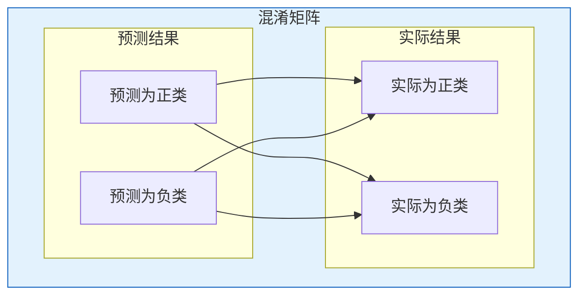
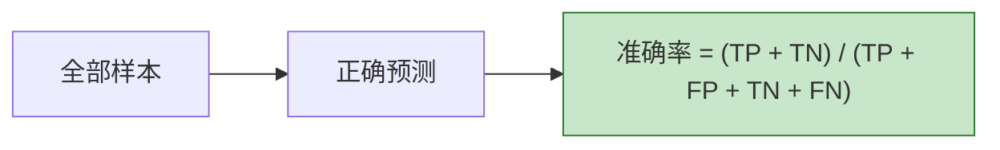
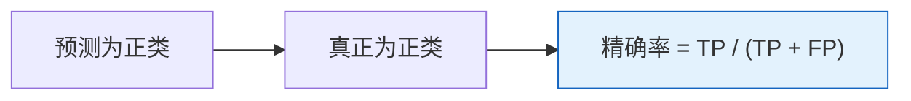
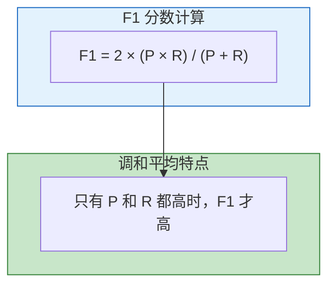
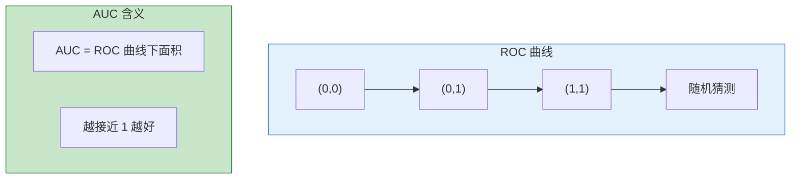
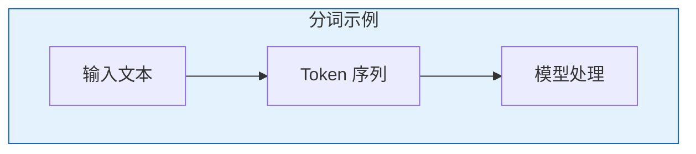
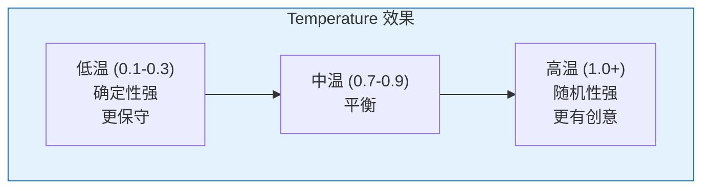
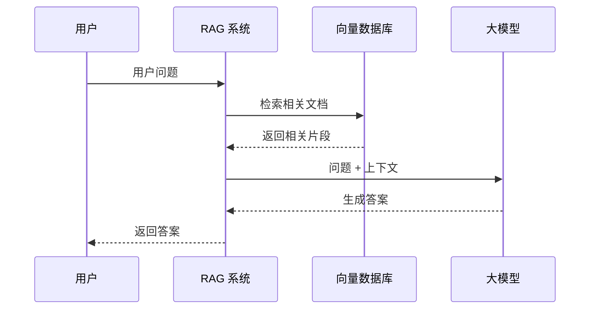
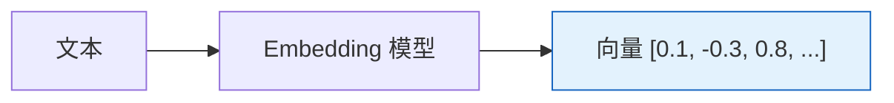
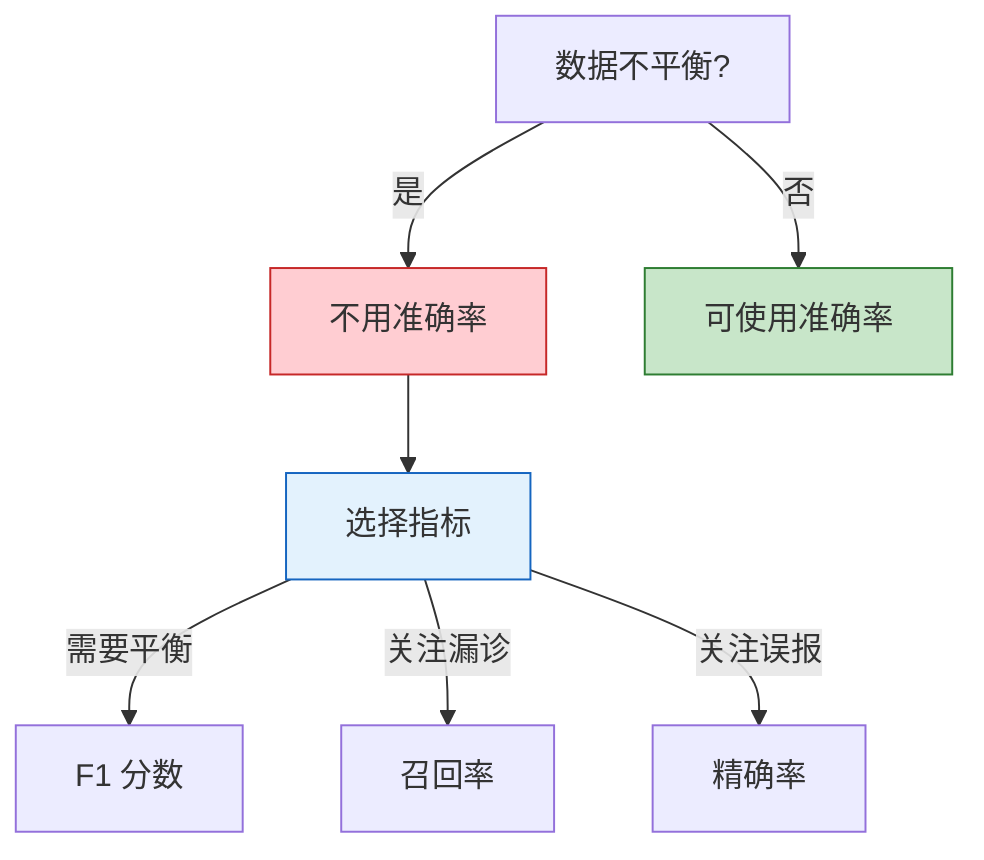

# AI 开发术语详解

## 一、机器学习评估指标

### 1.1 混淆矩阵

混淆矩阵是分类模型评估的基础，以二分类问题为例：



| 术语 | 英文 | 说明 | 示例 |
|------|------|------|------|
| **真正例 (TP)** | True Positive | 预测为正，实际为正 | 垃圾邮件识别：正确的垃圾邮件 |
| **假正例 (FP)** | False Positive | 预测为正，实际为负 | 垃圾邮件识别：正常邮件被误判 |
| **真负例 (TN)** | True Negative | 预测为负，实际为负 | 垃圾邮件识别：正确的正常邮件 |
| **假负例 (FN)** | False Negative | 预测为负，实际为正 | 垃圾邮件识别：垃圾邮件漏判 |

### 1.2 准确率 (Accuracy)

**定义**：模型预测正确的样本占总样本的比例



| 特点 | 说明 |
|------|------|
| **优点** | 简单直观，易于理解 |
| **缺点** | 类别不平衡时具有误导性 |
| **适用场景** | 正负样本比例均衡 |

**例子**：10000 样本中，9900 正常 + 100 患病，全部预测为正常，准确率 99%，但实际漏诊了所有病人！

### 1.3 精确率 (Precision)

**定义**：预测为正类的样本中，实际为正类的比例

```
精确率 = TP / (TP + FP)
```



| 特点 | 说明 |
|------|------|
| **关注点** | 预测结果的质量、可信度 |
| **核心问题** | "模型说是正类时，有多可信？" |
| **适用场景** | 垃圾邮件过滤、推荐系统（减少误报） |

**例子**：推荐了 100 件商品，80 件用户真正喜欢 → 精确率 80%

### 1.4 召回率 (Recall)

**定义**：实际为正类的样本中，被正确预测为正类的比例

```
召回率 = TP / (TP + FN)
```


| 特点 | 说明 |
|------|------|
| **关注点** | 找出所有正类的能力、覆盖率 |
| **核心问题** | "所有正类中，模型找到了多少？" |
| **适用场景** | 疾病诊断、欺诈检测（减少漏报） |

**例子**：100 个病人中，90 个被正确诊断 → 召回率 90%

### 1.5 F1 分数 (F1-Score)

**定义**：精确率和召回率的调和平均数

```
F1 = 2 × (精确率 × 召回率) / (精确率 + 召回率)
```



| 特点 | 说明 |
|------|------|
| **优势** | 综合平衡精确率和召回率 |
| **适用场景** | 类别不平衡、需要综合评估 |
| **注意** | 对极端值更敏感 |

**精确率 vs 召回率 对比**：

| 场景 | 追求高精确率 | 追求高召回率 |
|------|-------------|-------------|
| **垃圾邮件过滤** | 减少误判正常邮件 | 不漏掉垃圾邮件 |
| **疾病诊断** | 减少误诊 | 不漏诊病人 |
| **搜索推荐** | 结果必须精准 | 结果要全面 |

### 1.6 ROC 曲线与 AUC

**ROC 曲线**（Receiver Operating Characteristic）：以 FPR 为横轴，TPR 为纵轴绘制的曲线



| 指标 | 说明 |
|------|------|
| **TPR** | 真正率 = TP / (TP + FN)，同召回率 |
| **FPR** | 假正率 = FP / (FP + TN) |
| **AUC** | ROC 曲线下面积，取值 [0, 1] |

| AUC 值 | 模型效果 |
|--------|---------|
| 0.5 | 随机猜测 |
| 0.7 - 0.9 | 较好 |
| > 0.9 | 优秀 |

***

## 二、大模型开发术语

### 2.1 Token

**定义**：大模型处理文本的基本单位



| 特点 | 说明 |
|------|------|
| **不是词** | 可能是词根、子词、字符 |
| **中文** | 通常按字或词分割 |
| **英文** | 通常按 WordPiece 分割 |

**例子**：
- "人工智能" → ["人工", "智能"] (2 tokens)
- "Hello world" → ["Hello", " world"] (2 tokens)

### 2.2 上下文窗口 (Context Window)

**定义**：模型单次处理的最大 Token 数量

| 模型 | 上下文窗口 |
|------|-----------|
| GPT-3.5 | 4K / 16K |
| GPT-4 | 8K / 32K / 128K |
| Claude 3 | 200K |
| Llama 3 | 8K |

### 2.3 温度 (Temperature)

**定义**：控制生成随机性的超参数



| 温度值 | 效果 | 适用场景 |
|--------|------|---------|
| **低 (0.1-0.3)** | 几乎选择最高概率词 | 事实性问答、代码生成 |
| **中 (0.7-0.9)** | 平衡多样性 | 对话、写作 |
| **高 (1.0+)** | 随机选择，更有多样性 | 创意写作、头脑风暴 |

**公式**：`softmax(logits / temperature)`

### 2.4 Top-k 采样

**定义**：只从概率最高的 k 个 Token 中随机选择


| k 值 | 效果 |
|------|------|
| k=1 | 贪心解码，始终选最高概率 |
| k=10 | 从 top10 中选择 |
| k=全量 | 不限制 |

### 2.5 Top-p (Nucleus Sampling)

**定义**：从累积概率达到 p 的最小 Token 集合中随机选择


| 特点 | 优势 |
|------|------|
| **动态调整** | Token 数量随概率分布变化 |
| **优于 Top-k** | 避免低概率词被选中 |

**对比**：
- Top-k：固定选择前 k 个
- Top-p：选择累积概率 > p 的所有词

### 2.6 Max Tokens

**定义**：生成内容的最长长度

| 说明 | 影响 |
|------|------|
| 限制输出长度 | 避免无限生成 |
| 按 Token 计费 | 影响成本 |
| 过短可能截断 | 需合理设置 |

### 2.7 RAG (检索增强生成)

**定义**：结合检索系统和生成模型的架构



| 优势 | 说明 |
|------|------|
| **最新知识** | 可接入实时信息 |
| **可解释性** | 答案可追溯来源 |
| **降低成本** | 无需频繁微调 |

### 2.8 嵌入 (Embedding)

**定义**：将文本转换为向量表示



| 用途 | 说明 |
|------|------|
| **语义搜索** | 计算向量相似度 |
| **分类** | 向量特征输入分类器 |
| **聚类** | 向量距离聚类 |

### 2.9 幻觉 (Hallucination)

**定义**：模型生成看似合理但实际错误的内容

| 类型 | 说明 |
|------|------|
| **事实性幻觉** | 生成与事实不符的内容 |
| **逻辑性幻觉** | 前后逻辑不一致 |

**缓解方法**：
- RAG：提供准确上下文
- 提示工程：要求引用来源
- 微调：使用高质量数据

### 2.10 微调 (Fine-tuning)

**定义**：在预训练模型基础上进行针对性训练


| 方法 | 说明 |
|------|------|
| **全参数微调** | 更新全部参数 |
| **LoRA** | 仅更新低秩矩阵 |
| **Prompt Tuning** | 仅调整提示 |

### 2.11 对齐 (Alignment)

**定义**：让模型输出符合人类期望

| 目标 | 说明 |
|------|------|
| **有用** | 满足用户需求 |
| **无害** | 不产生有害内容 |
| **诚实** | 不欺骗用户 |

**技术**：RLHF (人类反馈强化学习)、DPO

***

## 三、评估指标选择指南

### 3.1 场景化指标选择

| 场景 | 重点指标 | 原因 |
|------|---------|------|
| **疾病诊断** | 召回率 | 漏诊后果严重 |
| **垃圾邮件过滤** | 精确率 | 误判正常邮件影响大 |
| **推荐系统** | F1 | 需平衡精准与召回 |
| **搜索排序** | AUC | 关注整体排序能力 |
| **欺诈检测** | 召回率/F1 | 漏检损失大 |

### 3.2 类别不平衡处理



### 3.3 指标关系速查表

| 指标 | 公式 | 关注点 |
|------|------|--------|
| **准确率** | (TP+TN)/(TP+FP+TN+FN) | 整体正确率 |
| **精确率** | TP/(TP+FP) | 预测的可信度 |
| **召回率** | TP/(TP+FN) | 找到所有正类 |
| **F1** | 2×P×R/(P+R) | 精确率与召回率平衡 |
| **AUC** | ROC 曲线下面积 | 分类器区分能力 |

***

## 四、面试高频问题

| 问题 | 答案要点 |
|------|---------|
| **准确率的局限性** | 类别不平衡时可能误导，需结合其他指标 |
| **精确率 vs 召回率** | 精确率关注预测质量，召回率关注覆盖能力 |
| **为什么用 F1** | 调和平均，对极端值敏感，平衡精确率和召回率 |
| **AUC 含义** | 随机正样本排在负样本前面的概率，越大越好 |
| **Temperature 作用** | 控制生成随机性，低温保守，高温创意 |
| **Top-k vs Top-p** | Top-k 固定数量，Top-p 动态调整 |
| **RAG 优势** | 接入实时知识、可追溯、降低成本 |
| **幻觉是什么** | 生成看似合理但实际错误的内容 |

***

## 参考资料

- [准确率、精确率、召回率和F1分数定义 - CSDN](https://blog.csdn.net/weixin_45422672/article/details/152456888)
- [机器学习核心评估指标详解 - CSDN](https://wenku.csdn.net/doc/416aqq1z3s)
- [AI大模型核心概念详解 - CSDN](https://wenku.csdn.net/doc/5hanrwdy8o)
- [大模型参数调优秘籍 - CSDN](https://blog.csdn.net/Code1994/article/details/154007707)
