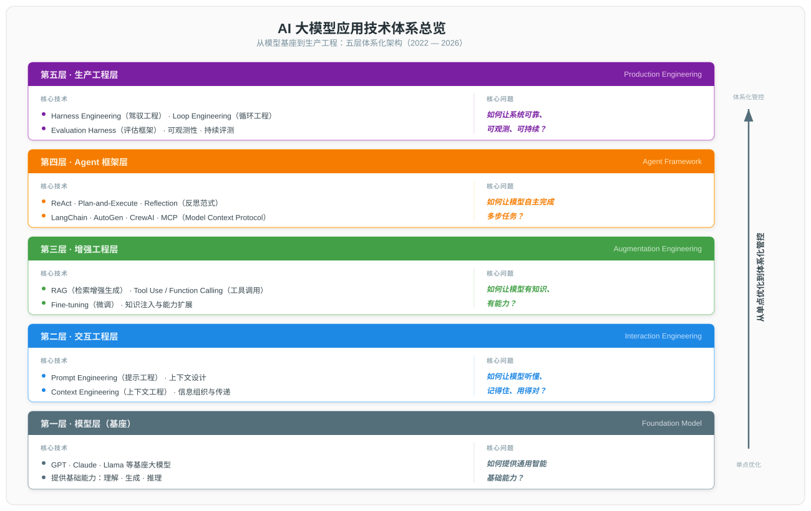
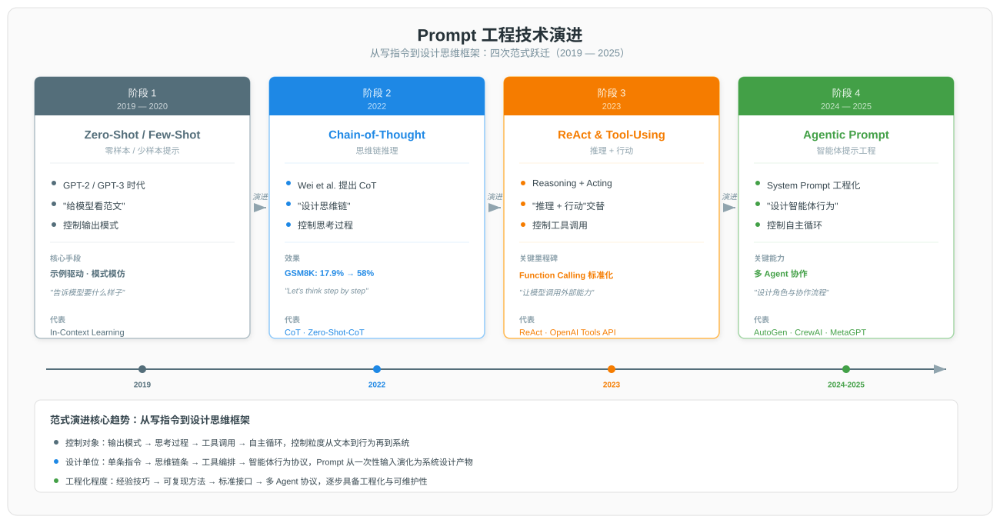
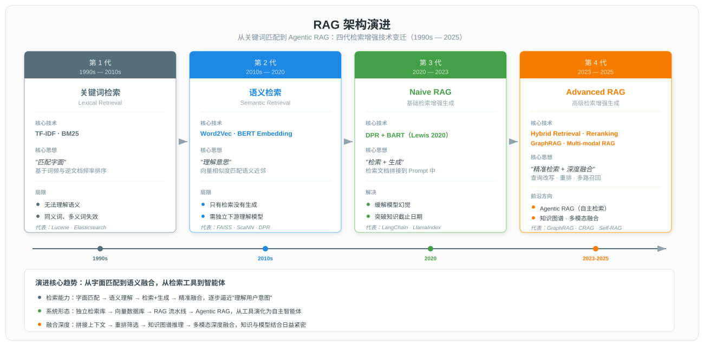
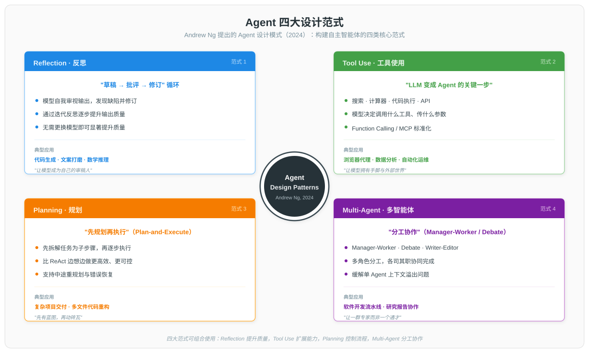
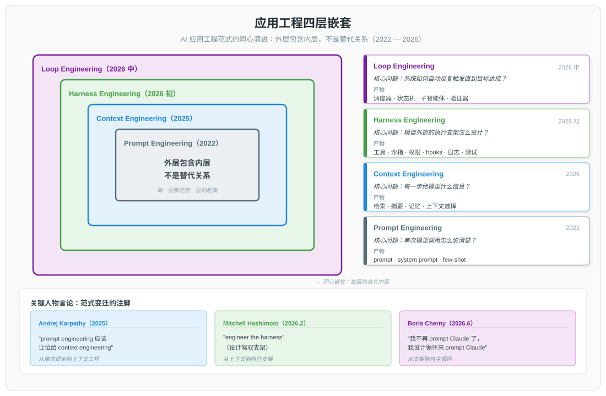

# AI 大模型应用技术发展历程

> 本文系统梳理 AI 大模型从"能用"到"好用"再到"可靠"的应用技术完整发展脉络。大模型应用技术解决的核心问题是"如何让大模型在实际场景中可控、可靠、实用"，与训练技术（解决"大模型能不能"）形成互补。本文以"时间轴 + 技术分层 + 范式演进"为分析框架，覆盖 2017—2026 年间提示工程兴起、检索增强生成（RAG）、工具调用（Tool Use）、Agent 框架爆发、应用工程范式跃迁、评估技术成熟等关键阶段，揭示应用技术从"单点优化"到"体系化管控"的演进规律，旨在为读者构建一张完整的大模型应用技术演进图谱。

---

## 一、概述

### 1.1 应用技术的定位

应用技术（Application Technology）是指在基座模型能力确定的前提下，通过提示、检索、工具、编排、评估等工程手段，让大模型在具体场景中产生可靠价值的技术体系。它的核心命题是：在模型参数不再变化的情况下，通过优化"如何使用模型"来最大化其落地效果。这一命题与训练技术形成鲜明对照——训练技术关注"如何让模型变得更强"，通过预训练、监督微调（SFT）、人类反馈强化学习（RLHF）等手段改变模型参数；而应用技术则在不改变参数的前提下，优化模型与外部世界的交互方式。

理解两者的分界至关重要。训练技术改变模型权重，应用技术不改权重；训练技术解决"模型能不能"，应用技术解决"模型用得好不好"。这一分界并非理论划分，而是工程现实：在企业生产环境中，基座模型通常由少数厂商提供且不可微调，应用开发者只能在"使用方式"上做文章。因此，应用技术是绝大多数企业落地大模型的主战场。

应用技术之所以重要，源于一个被反复验证的工程经验：同一个模型，应用技术的好坏可以产生 10 倍以上的效果差距。GPT-4 在缺乏检索增强时可能因知识截止而编造事实，配合 RAG 后则能准确引用企业内部文档；同一个 Claude 模型，用单次 prompt 调用与用 Agent 循环编排，其任务完成率可能相差数倍。这种"参数不变、效果剧变"的特性，使应用技术成为决定大模型落地成败的关键变量。

### 1.2 分析框架

本文采用"时间轴 + 技术分层 + 范式演进"三维分析框架，对 2017—2026 年的大模型应用技术发展进行系统梳理。三维框架各自承担不同分析职能，共同构成对应用技术演进的完整刻画。

| 维度 | 含义 | 作用 |
|------|------|------|
| 时间轴 | 按 2017—2026 的时间顺序组织内容 | 提供历史脉络与阶段划分 |
| 技术分层 | 将技术划分为交互层、增强层、Agent 层、生产层、治理层 | 揭示技术栈的层次结构 |
| 范式演进 | 描述应用范式从 Prompt 到 Context 到 Harness 到 Loop 的跃迁 | 解释代际更替的内在逻辑 |

时间范围选择 2017 年为起点，是因为 Transformer 架构在该年诞生，为后续所有大模型提供了统一基础，应用技术的演进从此具备可比性；终点设为 2026 年，覆盖 Loop Engineering 等 2026 年中的最新进展。从技术分层看，应用技术自下而上依次为：交互层（如何让模型听懂指令）→ 增强层（如何让模型有知识、有能力）→ Agent 层（如何让模型自主完成多步任务）→ 生产层（如何让系统可靠、可观测）→ 治理层（如何让系统安全、合规）。下层技术为上层提供基础，上层技术为下层提供组织框架，形成嵌套而非替代的关系。

---

## 二、提示工程时代（2019-2022）

本章关注应用技术的奠基期。提示工程（Prompt Engineering）是大模型应用技术的起点，它解决"如何用自然语言指挥模型"这一最基本问题，后续所有应用技术都在其基础上扩展。本章梳理从 Zero-Shot 到 Few-Shot 再到 Chain-of-Thought 的演进脉络，并揭示提示工程的内生局限如何催生 RAG 与 Tool Use 等增强技术。

### 2.1 Zero-Shot 与 Few-Shot 的诞生

提示工程的萌芽可追溯到 2019 年 GPT-2 的发布。OpenAI 在 GPT-2 论文中展示了模型的 Zero-Shot 能力：仅凭任务描述（如"Translate English to French: "）即可执行新任务，无需任何梯度更新或示例。这一能力在当时具有颠覆性意义——传统机器学习范式下，每完成一个新任务都需要收集标注数据并重新训练模型，而 GPT-2 通过预训练获得了"举一反三"的泛化能力。Zero-Shot 的本质是：模型在预训练阶段已经见过足够多的任务模式，仅需自然语言指令即可激活相应能力。

2020 年 6 月，Brown 等人在 GPT-3 论文中正式提出 Few-Shot Learning 与 In-Context Learning（上下文学习）概念。GPT-3 的 1750 亿参数规模使其能够仅凭输入中提供的 1—5 个示例学会任务模式，且效果随模型规模显著提升。Few-Shot 的核心机制是：在 prompt 中拼接若干"输入—输出"示例，模型通过模式匹配推断当前输入的期望输出，整个过程不更新任何参数。这与传统机器学习的"训练—推理"两阶段范式截然不同，标志着"提示工程"作为一项独立技能的诞生。

| 学习范式 | 是否更新参数 | 是否需要示例 | 典型场景 |
|---------|------------|------------|---------|
| Zero-Shot | 否 | 否 | 通用任务、快速验证 |
| Few-Shot | 否 | 是（1—5 个） | 任务模式明确、需稳定输出格式 |
| Fine-Tuning | 是 | 是（大量） | 领域专属、高质量要求 |
| In-Context Learning | 否 | 可选 | GPT-3 引入的统一框架，涵盖上述两者 |

In-Context Learning 的历史意义在于：它将"使用模型"从"调参"转变为"写提示"，极大降低了大模型的应用门槛。从此，开发者无需训练基础设施，仅凭自然语言即可调用模型能力，这直接催生了 2022 年后围绕 prompt 的整个应用生态。

### 2.2 Chain-of-Thought 思维链革命

2022 年 1 月，Wei 等人（Google Brain）发表 Chain-of-Thought（CoT）论文《Chain-of-Thought Prompting Elicits Reasoning in Large Language Models》，这是提示工程史上最重要的单点突破。核心发现是：在 Few-Shot 示例中展示"逐步推理过程"而非直接给出答案，可显著提升模型在数学、逻辑、常识推理任务上的表现。CoT 的本质是：通过示例引导模型在生成最终答案前先生成中间推理步骤，从而将复杂问题分解为模型可逐步解决的子问题。

CoT 的关键数据极具说服力：在 GSM8K 小学数学推理基准上，PaLM 模型从标准 prompt 的 17.9% 准确率提升至 58.1%，提升幅度超过 3 倍；在 MultiArith 上从 17.7% 提升至 92.7%。更重要的是，CoT 的收益具有规模效应——仅在足够大的模型（约 60B 参数以上）上才显现，小模型使用 CoT 反而可能因"模仿推理"而表现更差。这一现象与模型的"涌现能力"（Emergent Abilities）相关——即某些能力在模型规模超过阈值后才显现，揭示了提示工程技术与模型规模的耦合关系。

CoT 的后续演进围绕"如何更可靠地触发推理"展开。Kojima 等人 2022 年提出 Zero-Shot CoT：仅需在 prompt 末尾添加"Let's think step by step"即可触发推理，无需构造示例，极大简化了使用成本。Zhang 等人 2022 年提出 Auto-CoT，用模型自动采样并构造推理链示例，解决手动构造的高成本问题。Wang 等人 2022 年提出 Self-Consistency：让模型多次采样不同的推理链，再对最终答案投票，进一步提升推理稳定性。这些演进共同将 CoT 从"技巧"升级为"方法论"。

### 2.3 提示工程的局限

提示工程虽开启了应用技术的先河，但其内生局限在 2022 年后逐渐显现，直接催生了后续的增强技术。这些局限并非 prompt 写得不够好，而是其技术范式的根本约束。

| 局限维度 | 具体表现 | 催生的后续技术 |
|---------|---------|--------------|
| 单点优化 | 仅优化单次模型调用的输入，无法编排多步流程 | Agent 框架、Loop Engineering |
| 静态性 | prompt 在运行时不可变，无法根据执行结果动态调整 | ReAct、Function Calling |
| 信息瓶颈 | 模型只知道 prompt 里的信息，无法访问外部知识 | RAG、Tool Use |
| 知识截止 | 模型权重固化在训练数据时间点，无法获取新信息 | RAG 的核心动机 |

信息瓶颈是最根本的局限：无论 prompt 写得多好，模型都只能"知道"训练时见过的内容。对于企业内部文档、实时数据、专业知识库等"训练时不存在"的信息，纯 prompt 方案无能为力。这一瓶颈直接催生了检索增强生成（RAG）——通过在推理时检索外部知识并注入 prompt，突破模型的内生知识边界。静态性局限则催生了 ReAct 与 Function Calling：让模型在推理过程中调用工具、获取反馈，从而实现"动态调整"。

---

## 三、检索增强生成（RAG）的兴起（2020-2025）

本章关注解决"信息瓶颈"的核心技术——检索增强生成。RAG 通过将外部知识库接入推理流程，让模型在生成时引用权威信息，从而缓解幻觉、突破知识截止、弥补领域盲区。本章梳理 RAG 从关键词检索到 Agentic RAG 的四代演进，重点剖析 Advanced RAG 的关键技术。

### 3.1 RAG 的诞生：解决幻觉与知识截止

2020 年 5 月，Lewis 等人（Facebook AI）发表 RAG 论文《Retrieval-Augmented Generation for Knowledge-Intensive NLP Tasks》，正式提出检索增强生成范式。其核心思想是将参数化记忆（模型权重中编码的知识）与非参数化记忆（外部知识库中的文档）结合：模型权重提供语言能力和通用推理能力，外部知识库提供领域专属、可更新的事实知识。两者通过检索机制在推理时融合，既保留了模型的生成能力，又突破了知识截止限制。

原始 RAG 架构由两个核心组件构成：DPR（Dense Passage Retrieval，密集段落检索器）负责从知识库中检索相关段落，BART（生成器）负责基于检索结果生成最终答案。DPR 采用双编码器结构，对问题和段落分别编码为向量，通过向量相似度检索；BART 接收问题与检索到的段落作为输入，生成自然语言答案。这一架构在开放域问答任务上显著优于纯参数化模型，证明了"检索 + 生成"范式的可行性。

RAG 解决的三大问题在大模型落地中具有普遍性：幻觉（模型编造看似合理但实际错误的事实）、知识截止（模型不知道训练数据时间点之后的事件）、领域盲（模型缺乏垂直领域的专业知识）。在企业场景中，这三大问题几乎必然出现——企业的内部文档、产品手册、客户数据都不在公开训练集中。RAG 通过将企业知识库接入推理流程，使大模型能够"引用"而非"记忆"这些知识，既保证了准确性，又支持知识库的实时更新。

### 3.2 RAG 的四代演进

RAG 并非单一技术，而是一个持续演进的范式家族。从 1990s 的关键词检索到 2025 年的 Agentic RAG，检索增强技术经历了四代演进，每代都针对前代的瓶颈提出新方案。理解这一演进脉络，有助于在实际场景中选择合适的 RAG 方案。

| 代际 | 时间 | 核心技术 | 核心思想 | 代表系统 |
|------|------|---------|---------|---------|
| 第1代：关键词检索 | 1990s—2010s | TF-IDF / BM25 | 匹配字面关键词 | 传统搜索引擎 |
| 第2代：语义检索 | 2010s—2020 | Word2Vec / BERT Embedding | 理解语义相似性 | 向量数据库 |
| 第3代：Naive RAG | 2020—2023 | DPR + BART | 检索 + 生成端到端 | 原始 RAG 论文 |
| 第4代：Advanced RAG | 2023—2025 | Hybrid Retrieval / Reranking / GraphRAG | 精准检索 + 深度融合 | 现代 RAG 框架 |

第1代关键词检索基于词频统计（TF-IDF）或概率模型（BM25），通过字面匹配查找相关文档。其优势是速度快、可解释性强，劣势是无法理解同义词、上下文语义。第2代语义检索引入词向量（Word2Vec、BERT Embedding），将文本映射到高维语义空间，通过向量相似度匹配语义相关内容，解决了关键词检索的"字面不同、语义相同"问题。第3代 Naive RAG 是 Lewis 论文的原始范式，将语义检索与生成模型端到端结合，但存在检索精度不足、上下文过长导致生成质量下降等问题。第4代 Advanced RAG 通过混合检索、重排序、知识图谱等技术系统性解决 Naive RAG 的痛点，是当前生产环境的主流方案。

### 3.3 Advanced RAG 的关键技术

Advanced RAG 是对 Naive RAG 的系统性升级，其核心目标是"更精准地检索、更深度地融合"。它并非单一技术，而是多项关键技术的组合，每项技术都针对 Naive RAG 的特定瓶颈。

| 技术 | 解决的问题 | 工作原理 | 适用场景 |
|------|-----------|---------|---------|
| Hybrid Retrieval | 单一检索方式召回不全 | BM25（稀疏）+ Embedding（密集）融合排序 | 通用 RAG 场景 |
| Reranking | 初检结果排序不够精准 | Cross-Encoder 对初检结果重新打分排序 | 高精度问答 |
| GraphRAG | 文本检索缺乏结构化关联 | 基于知识图谱的结构化检索与多跳推理 | 复杂关系推理 |
| Agentic RAG | 检索流程僵化、无法自适应 | Agent 自主决定是否检索、如何检索 | 复杂多步问答 |

Hybrid Retrieval 融合稀疏检索与密集检索的优势：BM25 擅长匹配专有名词、代码标识符等字面敏感内容，Embedding 擅长理解语义相似性，两者融合可显著提升召回率。Reranking 用 Cross-Encoder 对初检结果重新打分：与 Bi-Encoder（双编码器）将问题和段落独立编码不同，Cross-Encoder 将问题和段落拼接后联合编码，能够捕获更精细的语义交互，但计算成本更高，因此只对初检的 Top-K 结果重排序。GraphRAG 引入知识图谱：将文档抽取为实体—关系图，检索时不仅返回相关段落，还返回相关的图结构，支持多跳推理（如"A 公司的 CEO 的母校在哪里"）。Agentic RAG 是最新演进：让 Agent 根据问题难度自主决定是否检索、检索几次、检索哪些来源，而非固定执行"检索—生成"两步流程。

---

## 四、工具调用（Tool Use）的发展（2023-2024）

本章关注让大模型具备"行动能力"的技术演进。工具调用解决了"模型只能说话、不能做事"的根本局限，使大模型从"对话系统"升级为"行动系统"。本章梳理从 ReAct 的文本解析范式到 Function Calling 的标准化协议，再到 MCP 的生态级协议的演进脉络。

### 4.1 ReAct：推理与行动的融合

2022 年 10 月，Yao 等人发表 ReAct 论文《ReAct: Synergizing Reasoning and Acting in Language Models》，这是第一个让 LLM 系统性具备工具调用能力的框架。其核心思想是让模型在"推理"（Reasoning）和"行动"（Acting）之间交替：模型先思考下一步该做什么，然后调用工具执行，观察工具返回的结果，再思考下一步。这一循环构成了 ReAct 的基本执行模式。

ReAct 的执行循环为：思考（Thought）→ 行动（Action）→ 观察（Observation）→ 再思考（Thought）→ …，直到模型判断任务完成。在每一轮中，模型先输出一段自然语言推理（Thought），然后输出一个工具调用（Action），框架执行该工具并将结果回填（Observation），模型基于观察结果继续推理。这一范式的关键创新是：将"推理"与"行动"显式分离并交替执行，避免了纯推理模型"想得多做得少"和纯行动模型"做事不动脑"的极端。

| 维度 | 纯推理（CoT） | 纯行动 | ReAct |
|------|-------------|--------|-------|
| 推理能力 | 强 | 弱 | 强 |
| 行动能力 | 无 | 强 | 强 |
| 错误恢复 | 无法恢复 | 无法恢复 | 可基于观察调整 |
| 适用场景 | 数学推理 | 简单查询 | 复杂多步任务 |

ReAct 的历史意义在于：它证明了 LLM 可以作为"行动的发起者"而非仅是"文本的生成者"。然而，ReAct 依赖文本解析来识别 Action，解析过程脆弱且不可靠——模型输出的 Action 格式稍有偏差就会导致解析失败。这一痛点直接催生了 Function Calling 的标准化。

### 4.2 Function Calling 标准化

2023 年 6 月，OpenAI 在 GPT-4 API 中引入 Function Calling 功能，这是工具调用从"研究范式"走向"工程标准"的关键里程碑。其核心创新是：模型原生支持结构化工具调用，开发者通过 JSON Schema 定义工具的名称、参数、返回值，模型根据用户意图决定是否调用工具、调用哪个工具、传入什么参数，并返回结构化的 JSON 调用结果，而非自然语言文本。

Function Calling 相比 ReAct 的优势在于可靠性与效率。可靠性方面：模型直接输出 JSON 而非自然语言，开发者无需解析脆弱的文本格式，调用成功率显著提升。效率方面：模型专注于"决定调用什么"而非"格式化输出"，减少了 token 消耗和解析开销。此外，Function Calling 支持并行调用多个工具，进一步提升了复杂任务的执行效率。这些优势使 Function Calling 迅速成为行业标准：Anthropic Claude、Google Gemini、Mistral、Qwen 等主流模型纷纷跟进，形成跨厂商的统一工具调用接口。

| 维度 | ReAct | Function Calling |
|------|-------|----------------|
| 输出格式 | 自然语言文本 | 结构化 JSON |
| 解析方式 | 正则/文本解析 | 原生 JSON 解析 |
| 可靠性 | 低（格式易错） | 高（结构化保证） |
| 并行调用 | 不支持 | 支持 |
| 行业标准化 | 无 | 跨厂商统一 |

### 4.3 MCP：工具集成协议

2024 年 11 月，Anthropic 发布 MCP（Model Context Protocol，模型上下文协议），这是工具调用从"模型能力"走向"生态协议"的关键一步。Function Calling 解决了"模型如何调用工具"的问题，但每个工具仍需为每个模型分别集成，导致 N×M 的集成矩阵爆炸。MCP 的核心价值是标准化模型与外部工具/数据源的连接：工具开发者只需实现一次 MCP 服务器，即可被所有支持 MCP 的模型客户端使用，实现"一次集成，解锁整个生态"。

MCP 的设计借鉴了 LSP（Language Server Protocol）的成功经验：LSP 让编辑器与语言服务器解耦，MCP 让模型客户端与工具服务器解耦。MCP 定义了统一的协议规范，包括工具发现、工具调用、资源访问、提示模板等核心能力，任何符合规范的客户端都能与任何符合规范的服务器互操作。这一设计极大降低了工具生态的碎片化问题。

2026 年 MCP 成为事实标准：OpenAI 于 1 月宣布支持 MCP，Google 于 2 月跟进，Microsoft 于 3 月集成。至此，主流模型厂商全部采用 MCP，工具生态从"各自为政"走向"统一协议"。MCP 的成功标志着大模型应用技术从"应用层"向"基础设施层"下沉，工具集成从"开发者负担"变为"协议化能力"。

---

## 五、Agent 框架的爆发（2023-2026）

本章关注让大模型"自主完成任务"的 Agent 范式。Agent 是应用技术从"单次调用"到"多步自主"的跃迁，它将提示工程、RAG、工具调用等基础技术组织为完整的工作流。本章梳理 Agent 的定义、四大设计范式、框架演进，以及 Workflow 与 Agent 的工程权衡。

### 5.1 Agent 的定义与四大设计范式

Agent（智能体）的定义由 Anthropic 在 2024 年的工程博客中明确阐述：Agent 是能代表用户以较高独立性完成工作流的系统，其核心特征是 LLM 动态决定流程和工具使用，而非遵循预定义的代码路径。这一定义与 Workflow（工作流）形成对照：Workflow 中 LLM 和工具按预定义路径编排，流程可预测、可审计；Agent 中 LLM 自主决定下一步做什么，流程灵活但不可预测。

Andrew Ng（吴恩达）在 2024 年提出 Agent 的四大设计范式，这四大范式构成了 Agent 技术的基础工具箱，后续所有 Agent 框架都是对这些范式的组合与扩展。理解四大范式是理解 Agent 框架的前提。

| 范式 | 核心思想 | 执行流程 | 适用场景 |
|------|---------|---------|---------|
| Reflection（反思） | 草稿→批评→修订 | 生成初稿→批评→修订→再批评→… | 写作、代码生成 |
| Tool Use（工具使用） | 搜索、计算、代码执行 | 决定工具→调用→观察→继续 | 信息查询、计算任务 |
| Planning（规划） | Plan-and-Execute | 分解任务→依次执行子任务→汇总 | 复杂多步任务 |
| Multi-Agent（多智能体） | 分工协作 | 多个 Agent 各司其职、协作完成 | 角色明确的复杂任务 |

Reflection 范式让 Agent 对自己的输出进行批评与修订：先生成初稿，再以批评者身份审查初稿，根据批评意见修订，如此反复直至质量达标。Tool Use 范式让 Agent 调用外部工具扩展能力边界：搜索、计算、代码执行、API 调用等。Planning 范式让 Agent 先规划再执行：将复杂任务分解为子任务列表，依次执行并汇总结果，适用于需要长程规划的任务。Multi-Agent 范式让多个 Agent 分工协作：每个 Agent 扮演特定角色（如产品经理、工程师、测试），通过对话或消息传递协作完成任务。这四大范式并非互斥，现代 Agent 系统通常组合多种范式。

### 5.2 Agent 框架的演进

Agent 框架的发展经历了从"单框架主导"到"多框架竞争"再到"官方 SDK 入场"的完整周期，每一阶段都反映了 Agent 技术成熟度的变化。

| 时期 | 代表框架 | 核心特点 | 阶段定位 |
|------|---------|---------|---------|
| 2023 春 | LangChain（ReAct notebook） | Agent = LangChain，ReAct 范式主导 | 萌芽期 |
| 2024 | AutoGen / CrewAI | 多智能体时代，角色编排 | 成长期 |
| 2025 | OpenAI Agents SDK / Anthropic Agent SDK | 官方 SDK，标准化 | 成熟期 |
| 2026 | 框架寒武纪大爆发 | 图状态机/角色编排/极简主义等 | 分化期 |

2023 年春，LangChain 凭借 ReAct notebook 成为 Agent 的代名词，"Agent = LangChain"成为当时共识。但其复杂性（"为了用 LangChain 而用 LangChain"）也引发批评。2024 年 AutoGen 与 CrewAI 推动多智能体范式普及，Agent 从单兵作战走向团队协作。2025 年 OpenAI 与 Anthropic 相继发布官方 Agent SDK，标志着 Agent 技术从社区探索走向厂商标准化。2026 年迎来框架寒武纪大爆发：图状态机派（如 LangGraph）、角色编排派（如 CrewAI）、极简主义派（如 Pydantic AI）等多种设计哲学并存，开发者根据场景选择而非"一个框架打天下"。

### 5.3 从 Workflow 到 Agent

Workflow 按预定义路径编排，流程可预测、可审计；Agent 由 LLM 动态决定流程和工具使用，灵活但不可预测。Anthropic 在 2024 年的工程博客中进一步指出：两者并非对立，而是适用于不同场景的两种范式，工程实践的关键是根据任务复杂度选择合适的范式。

| 维度 | Workflow | Agent |
|------|---------|-------|
| 流程控制 | 预定义代码路径 | LLM 动态决定 |
| 可预测性 | 高 | 低 |
| 可审计性 | 高 | 低 |
| 成本 | 低 | 高 |
| 适用任务 | 结构化、重复性 | 探索性、创造性 |

工程实践的经验法则是：简单任务用 Workflow，复杂探索性任务用 Agent。过早引入 Agent 会导致系统不可控、成本不可预测；过晚引入 Agent 则会限制系统处理复杂任务的能力。Anthropic 建议：从 Workflow 开始，当 Workflow 无法覆盖的场景足够多时再升级为 Agent。

---

## 六、应用工程的范式跃迁（2025-2026）

本章关注应用技术从"经验技巧"走向"工程学科"的范式跃迁。2025—2026 年间，业界逐步认识到：单点优化 prompt 已不足以应对生产环境的可靠性需求，必须将 prompt 嵌入更大的工程体系中。本章梳理从 Prompt Engineering 到 Context Engineering 到 Harness Engineering 再到 Loop Engineering 的四层演进，揭示其嵌套关系与核心认知。

### 6.1 从 Prompt Engineering 到 Context Engineering

2025 年中，Andrej Karpathy 提出"prompt engineering 应该让位给 context engineering"，标志着应用工程范式的第一次跃迁。核心转变是：从"优化单次提示词"到"为每一步推理组装最优上下文"。Prompt Engineering 关注"如何写好一条指令"，而 Context Engineering 关注"如何为模型的每一步推理组装最有效的上下文"——上下文不仅包含指令，还包含工具定义、检索知识、对话历史、长期记忆、草稿区等多种信息源。

Context Engineering 的关键技术是上下文窗口的 7 个槽位模型：系统提示（System Prompt）、工具定义（Tool Definitions）、长期记忆（Long-term Memory）、检索知识（Retrieved Knowledge）、对话历史（Conversation History）、草稿区（Scratchpad）、当前指令（Current Instruction）。每个槽位承载不同类型的信息，Context Engineering 的任务是在有限的上下文窗口内最优地分配这些槽位。

Context Engineering 识别出四种典型的失败模式，每种都对应上下文组装的具体缺陷。上下文中毒（Context Poisoning）指错误信息污染上下文，导致后续推理连锁出错；上下文分心（Context Distraction）指过多无关信息分散模型注意力，导致关键信息被忽略；上下文混淆（Context Confusion）指相似但不同的信息相互干扰，导致模型混淆；上下文冲突（Context Conflict）指上下文中存在矛盾信息，导致模型无法决策。识别这些失败模式是规避它们的前提。

### 6.2 Harness Engineering：驾驭工程

2026 年 2 月，Mitchell Hashimoto（HashiCorp 联合创始人）提出"engineer the harness"的理念，标志着应用工程范式的第二次跃迁。其核心问题是：模型外部的执行支架如何设计，才能让模型安全、可靠、可观测地行动。Harness 指模型外部的整套执行基础设施，它不是模型本身，而是承载模型行动的执行支架。

Harness Engineering 的组成包括多个关键组件：工具（Tools）定义模型能调用什么；沙箱（Sandbox）限制模型的执行环境，防止副作用外泄；权限（Permissions）控制模型能做什么、不能做什么；hooks 在关键节点插入自定义逻辑（如审计、校验）；日志（Logs）记录模型的所有行动以支持可观测性；测试（Tests）验证模型行为符合预期；AGENTS.md / CLAUDE.md / skills 等约定文件为模型提供项目级指令。这些组件共同构成了模型的"执行支架"。

| 组件 | 作用 | 关键设计点 |
|------|------|-----------|
| 工具 | 定义模型能力边界 | 能力范围显式声明、Schema 规范 |
| 沙箱 | 隔离执行环境 | 文件系统/网络/进程隔离 |
| 权限 | 控制敏感操作 | 最小权限原则 + 白名单 + 确认机制 |
| hooks | 关键节点插桩 | 审计、校验、转换 |
| 日志 | 可观测性 | 全量记录、可回放 |
| 测试 | 验证行为符合预期 | 回归集、护栏断言、变异测试 |
| 约定文件 | 项目级指令 | AGENTS.md / CLAUDE.md |

工具组件与权限组件分别负责"能力声明"与"访问管控"：工具组件以规范化的 Schema（如 JSON Schema、MCP 工具定义）显式声明每个工具的输入输出契约，明确模型可调用的能力集合；权限组件在此基础上，决定哪些能力在实际执行中被允许触发。最小权限原则是权限组件的核心设计准则——仅授予完成当前任务所需的最小权限集合，避免过度授权扩大攻击面；其落地方式是白名单显式枚举允许的操作，并对敏感操作引入人工确认机制。

Harness Engineering 的核心关注点是：模型如何安全、可靠、可观测地行动。安全性通过沙箱与权限保证，模型在受限环境中运行，无法造成不可逆破坏；可靠性通过测试与 hooks 保证，关键操作经过校验；可观测性通过日志保证，模型的所有行动可追溯、可回放。这三者是生产环境部署 Agent 的必要条件。

### 6.3 Loop Engineering：循环工程

2026 年 6 月，Boris Cherny（Anthropic）在博客中提出："*I don't prompt Claude anymore — I build loops that prompt Claude.*"即不再由人工逐次编写提示词驱动模型，而是设计自动循环让系统反复触发模型直至目标达成。这标志着应用工程范式的第三次跃迁——Loop Engineering，它将 Agent 从"单次调用"升级为"持续运行的工作系统"。

Loop Engineering 的组成包括：调度器（Scheduler）决定何时触发 Agent；状态文件（State File）记录任务进度，支持断点续跑；任务队列（Task Queue）管理待办任务；子智能体（Sub-agents）处理特定子任务；验证器（Validator）检查结果是否达标；工作树（Work Tree）隔离不同任务的执行环境，防止相互干扰。这些组件共同构成了 Agent 的"循环执行系统"。

| 组件 | 作用 | 设计考量 |
|------|------|---------|
| 调度器 | 触发 Agent 执行 | 触发条件、频率、优先级 |
| 状态文件 | 记录进度 | 持久化、断点续跑 |
| 任务队列 | 管理待办 | 优先级、依赖关系 |
| 子智能体 | 处理子任务 | 隔离、并行 |
| 验证器 | 检查结果 | 验收标准、回滚机制 |
| 工作树 | 隔离执行环境 | Git worktree、沙箱 |

### 6.4 四层嵌套的核心认知

四层嵌套的核心认知是：外层包含内层，而非替代关系。这一认知对实践至关重要，因为它直接反驳了"现在都 2026 年了，还搞 Prompt Engineering？"的常见误区。事实上，如果 prompt 写得模糊、context 配置混乱，再好的 harness 也救不了；如果 harness 设计缺陷，再精巧的 loop 也无法稳定运行。内层是外层的基础，外层是内层的组织框架。

| 层级 | 解决的问题 | 留下的瓶颈 | 引入的新挑战 |
|------|-----------|-----------|------------|
| Prompt | 如何让模型听懂指令 | 信息瓶颈、静态性 | 无法访问外部信息 |
| Context | 如何组装最优上下文 | 上下文窗口有限 | 上下文中毒、分心 |
| Harness | 如何安全可靠执行 | 单次执行 | 无法持续运行 |
| Loop | 如何持续运行至目标达成 | 复杂度爆炸 | 调度、状态管理 |

每一外层解决内层留下的核心瓶颈，但同时引入新的工程挑战，形成"解决一个瓶颈、引入新瓶颈"的螺旋演进。这一模式是技术演进的一般规律，也是应用技术持续向前发展的内在动力。

---

## 七、评估技术：让能力可衡量（2022-2026）

本章关注让大模型能力"可衡量"的评估技术。随着模型数量爆发与场景多样化，如何客观评估并选择最适合的模型成为关键工程问题。本章梳理评估框架的演进、主流基准的特点，以及评估面临的固有局限。

### 7.1 评估框架的必要性

2023 年后，大模型数量爆发式增长：GPT-4o、Claude、Gemini、Llama、Mistral、Qwen 等众多模型并存，每个模型又有多个版本。这直接催生了"如何客观选择最适合的模型"这一工程问题。在企业落地中，模型选择不能依赖直觉或厂商宣传，必须基于可量化的评估数据。

评估的维度是多维的，不同场景对各维度的权重不同。性能维度关注模型在任务上的准确率、质量；安全维度关注模型是否会生成有害内容；成本维度关注 token 单价与总体拥有成本；延迟维度关注首 token 延迟与吞吐量；合规维度关注模型是否符合行业法规（如金融、医疗）。这五个维度通常存在权衡——性能高的模型往往成本高、延迟大，企业需根据具体场景权衡。

| 评估维度 | 核心问题 | 典型指标 |
|---------|---------|---------|
| 性能 | 模型在任务上做得好不好 | 准确率、BLEU、ROUGE |
| 安全 | 模型是否会生成有害内容 | 拒绝率、毒性分数 |
| 成本 | 模型使用成本 | token 单价、TCO |
| 延迟 | 模型响应速度 | 首 token 延迟、吞吐量 |
| 合规 | 模型是否符合法规 | 合规审计通过率 |

### 7.2 评估框架演进

评估框架的演进反映了业界对"如何评估大模型"认知的深化，从学术基准标准化到 LLM-as-Judge，再到生产级评估。

| 框架 | 时间 | 核心特点 | 适用阶段 |
|------|------|---------|---------|
| lm-eval-harness（EleutherAI） | 2022 | 60+ 学术基准标准化评测（harness 取"测试脚手架"之义） | 研究阶段 |
| OpenAI Evals | 2023 | LLM-as-Judge 评估 | 应用验证 |
| MMLU / GSM8K / HumanEval | 2022—2023 | 标准基准测试集 | 通用能力评测 |
| LMSYS Chatbot Arena | 2023 | 人类偏好对战评估 | 主观体验评测 |
| Inspect AI / DeepEval | 2025 | 生产级评估框架 | 生产部署 |

> **词义辨析**：lm-eval-harness 中的 "harness" 取其软件工程传统含义——"测试脚手架"（test harness），即为运行测试而搭建的自动化驱动与结果收集基础设施，该用法早于大模型时代数十年。6.2 节所述 Harness Engineering 中的 "harness" 取其引申含义——"驾驭执行"（execution harness），即包裹在 Agent 外部使其安全、可靠、可观测运行的执行支架。两者词源相同但指代层次不同：前者是测试基础设施，后者是生产运行基础设施。

EleutherAI 的 lm-eval-harness 是最早的开源评估框架，将 60+ 学术基准（MMLU、GSM8K、HumanEval 等）标准化为统一接口，使不同模型的评估结果可比。OpenAI Evals 引入 LLM-as-Judge 范式：用强模型评估弱模型的输出，降低人工评估成本，适用于开放式生成任务。LMSYS Chatbot Arena 采用人类偏好对战：让真实用户在两个模型的回答中选择更好的一个，通过 Elo 评分排名，反映主观体验。Inspect AI 与 DeepEval 是 2025 年成熟的生产级评估框架，支持自定义评估流水线、持续评估、A/B 测试等生产场景需求。整体趋势上，评估正从单一基准走向多维评估矩阵，从静态一次性评估走向持续在线评估；企业越来越多地构建私有评估集，基于自身业务数据评估模型，而非仅依赖公开基准。

### 7.3 评估的局限与挑战

评估技术虽持续进步，但面临四类固有局限，在实践中必须被清醒认识。

| 局限 | 机理与表现 | 缓解策略 |
|------|-----------|---------|
| 数据污染 | 公开基准（MMLU、GSM8K 等）可能进入训练数据，导致分数虚高且无法泛化到未见过的问题 | 私有基准、动态基准 |
| Goodhart 定律 | "当测量成为目标，它就不再是好测量"——厂商针对基准优化，削弱基准分数与真实能力的关联 | 多维评估矩阵、对抗性基准 |
| 基准与生产脱节 | MMLU 90% ≠ 生产可靠；基准测试单项能力（如多项选择），而生产需要多步推理、工具使用、错误恢复等综合能力 | 生产数据评估、在线评估 |
| 评估成本高 | 全面人工评估耗时且昂贵，尤其在模型频繁迭代时 | LLM-as-Judge、自动化评估流水线 |

---

## 八、核心技术体系总结

### 8.1 应用技术栈全景

大模型应用技术经过近十年演进，已形成层次分明的技术栈。下表总结五大技术层的核心问题、关键技术与成熟度，构成应用技术的全景视图。

| 技术层 | 核心问题 | 关键技术 | 成熟度 |
|--------|---------|---------|--------|
| 交互层 | 如何让模型听懂、用得对 | Prompt Eng. / Context Eng. | 成熟 |
| 增强层 | 如何让模型有知识、有能力 | RAG / Tool Use / Fine-tuning | 成熟 |
| Agent 层 | 如何让模型自主完成多步任务 | Reflection / Tool Use / Planning / Multi-Agent | 快速演进 |
| 生产层 | 如何让系统可靠、可观测 | Harness Eng. / Loop Eng. / Eval | 新兴 |
| 治理层 | 如何让系统安全、合规 | 权限 / 审计 / 红队测试 | 新兴 |

交互层是最成熟的技术层，Prompt Engineering 已成为开发者基础技能，Context Engineering 正在快速普及。增强层中 RAG 与 Tool Use 已在生产环境大规模部署，是当前企业落地的主流方案；ReAct 作为 Tool Use 的早期范式、MCP 作为工具集成协议，均归属此层，为 Agent 层提供能力底座。Agent 层是当前最活跃的技术层，以 Andrew Ng 提出的四大设计范式（Reflection / Tool Use / Planning / Multi-Agent）为核心，其中 Tool Use 范式虽源于增强层，但在 Agent 层被组织为自主工作流的一部分。生产层与治理层是新兴领域，随着 Agent 在生产环境部署规模扩大，其重要性将持续上升。

### 8.2 范式演进的核心逻辑

应用技术的演进呈现两条交织的主线：一是技术范式的代际更替，二是工程体系的层级嵌套（见 6.4 节）。前者沿时间轴展开，每一代技术解决前代遗留的瓶颈；后者沿架构轴展开，外层将内层作为组件嵌入。两者共同构成应用技术的完整演进图景。

| 演进阶段 | 核心技术 | 演进方向 | 驱动力 |
|---------|---------|---------|--------|
| 2019—2022 | Prompt Engineering | → Context Engineering | 信息瓶颈 |
| 2020—2025 | RAG | → Agentic RAG | 检索灵活性 |
| 2023—2024 | Function Calling | → MCP | 生态标准化 |
| 2023—2026 | Harness Engineering | → Loop Engineering | 持续运行 |

范式演进的驱动力源于生产环境的可靠性需求。研究阶段关注"能不能做到"，生产阶段关注"能不能可靠地做到"——这一转变驱动应用技术从单点优化走向体系化管控。

---

## 九、未来趋势展望

### 9.1 技术融合趋势

应用技术的四层嵌套（Prompt/Context/Harness/Loop）是分析框架，而非物理隔离的组件。实践中各层正在三个方向上深度融合。

| 融合方向 | 机理 | 具体表现 |
|---------|------|---------|
| 层间职责渗透 | 外层在组织内层时，将内层的部分决策逻辑上提 | Context Engineering 内嵌检索策略与工具选择；Harness Engineering 内嵌上下文组装与压缩逻辑 |
| 跨层范式重组 | 同一技术在不同层扮演不同角色 | RAG 作为增强层是固定"检索—生成"流程；作为 Agentic RAG 时由 Agent 自主决定是否检索、检索何种来源、是否迭代检索 |
| 评估内建化 | 评估从独立环节转为嵌入流程的护栏 | 评估不再独立于应用系统，而是嵌入 Harness 的 hooks 与 Loop 的验证器，实现持续在线评估 |

层间职责渗透与跨层范式重组改变了技术栈的形态，但不改变嵌套关系本身——外层仍包含内层，只是外层承担了更多原本属于内层的决策。评估内建化则使评估从"事后检验"转为"过程内建"，与应用流程共生。

### 9.2 产业落地趋势

产业层面，大模型应用正经历从"原型验证"到"生产落地"的转变，三个趋势构成这一转变的主线。

| 趋势 | 触发条件 | 表现 |
|------|---------|------|
| 工程化鸿沟被正视 | 2023—2024 年大量企业原型停留 Demo 阶段无法上线 | 业界认识到应用工程化是大模型落地的关键瓶颈；Context/Harness/Loop Engineering 等方法论与工具链快速成熟 |
| Agent 基础设施化 | Agent 自研成本高、集成重复劳动严重 | MCP 标准化工具集成接口；A2A（Agent-to-Agent）协议标准化 Agent 间通信；Agent 注册中心支持 Agent 发现与调用。Agent 从"自研系统"走向"即插即用组件" |
| 从经验技巧到工程学科 | 早期应用效果依赖开发者个人"prompt 灵感"，因人而异且难复制 | 方法论成熟使应用技术形成可教学、可复制、可认证的工程体系；大模型应用从"少数人专长"变为"多数工程师通用技能" |

三个趋势的内在驱动一致：生产环境的可靠性需求倒逼应用技术从依赖个人经验转为依赖方法论与工具链。这一转变与软件工程从"程序员经验技巧"到"软件工程学科"的历史进程机理相同——当技术从探索期进入规模化应用阶段，工程化是必然路径。

---

## 参考资料

1. [Brown et al. (2020) GPT-3: Language Models are Few-Shot Learners](https://arxiv.org/abs/2005.14165)
2. [Wei et al. (2022) Chain-of-Thought Prompting Elicits Reasoning in Large Language Models](https://arxiv.org/abs/2201.11903)
3. [Lewis et al. (2020) Retrieval-Augmented Generation for Knowledge-Intensive NLP Tasks](https://arxiv.org/abs/2005.11401)
4. [Karpukhin et al. (2020) Dense Passage Retrieval for Open-Domain Question Answering](https://arxiv.org/abs/2004.04906)
5. [Yao et al. (2022) ReAct: Synergizing Reasoning and Acting in Language Models](https://arxiv.org/abs/2210.03629)
6. [OpenAI Function Calling (2023) 官方文档](https://platform.openai.com/docs/guides/function-calling)
7. [Anthropic MCP (2024) Model Context Protocol 官方文档](https://modelcontextprotocol.io/)
8. [Anthropic Effective Agents: Building Effective Context Engineering for AI Agents](https://www.anthropic.com/engineering/effective-context-engineering-for-ai-agents)
9. [Andrew Ng Agent Design Patterns (2024) How Agents Can Improve LLM Performance](https://www.deeplearning.ai/the-batch/how-agents-can-improve-llm-performance/)
10. [EleutherAI lm-eval-harness 开源评估框架](https://github.com/EleutherAI/lm-evaluation-harness)
