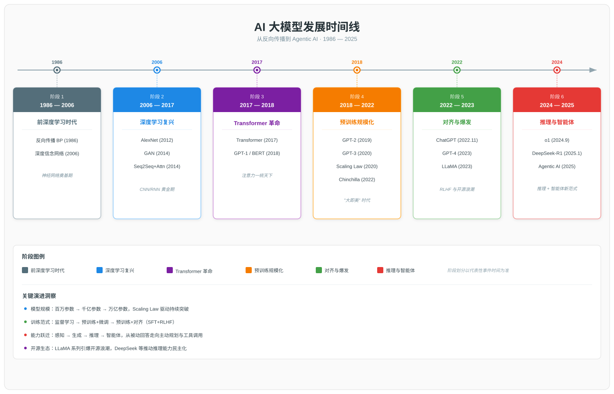
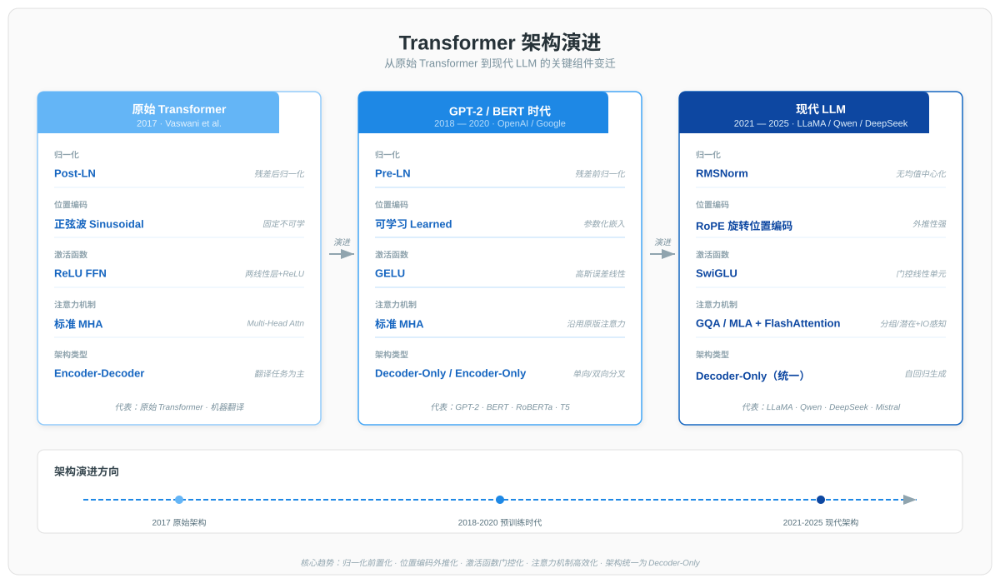
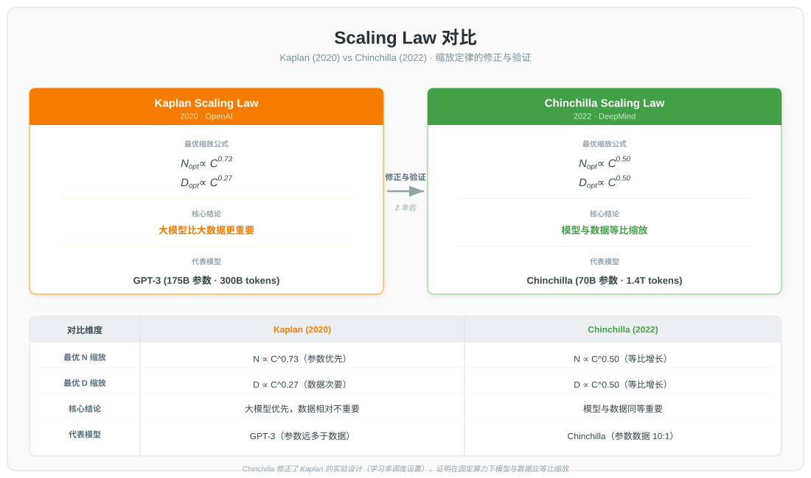
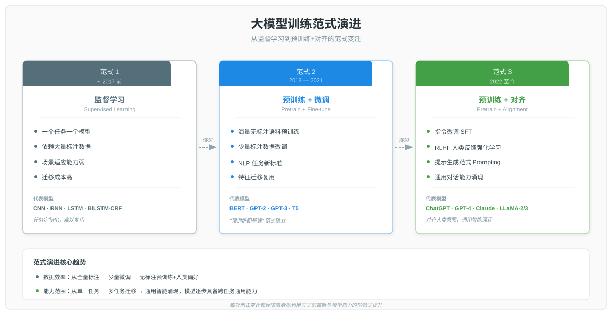
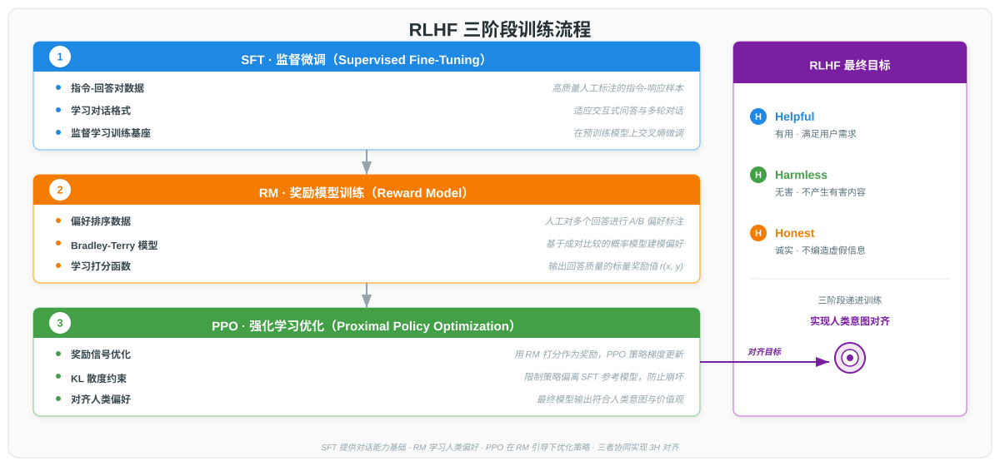

# AI 大模型技术发展历程

> 本文系统梳理 AI 大模型技术从深度学习基础到现代大语言模型的完整发展脉络，以"时间轴 + 技术突破 + 范式演进"为分析框架，涵盖 1986—2025 年间反向传播算法奠基、深度学习复兴、Transformer 架构革命、预训练范式确立、对齐技术成熟、大模型爆发、推理模型与智能体时代七个关键阶段。文档既关注单点技术突破的因果链，也关注训练范式从"监督学习"到"预训练+对齐"的代际跃迁，旨在为读者构建一张完整的大模型技术演进图谱。

---

## 一、概述

### 1.1 大模型的定义

大模型（Large Model）是指通过在海量数据上进行大规模预训练，然后通过指令微调以适应一系列下游任务的通用人工智能模型。与传统的"一个任务一个模型"范式不同，大模型强调用单一模型解决多类型、多领域的任务，其能力来源于预训练阶段对语言、世界知识的统计建模，以及对齐阶段对人类意图的精确捕捉。

大模型的"大"由三个要素共同定义，三者缺一不可：

| 要素 | 内涵 | 典型量级 |
|------|------|---------|
| 大数据 | 海量、多源、高质量的预训练语料 | 万亿级 tokens |
| 大算力 | 大规模 GPU/TPU 集群提供的训练算力 | 千卡至万卡级 |
| 强算法 | Transformer 架构、对齐技术、训练优化方法 | 持续迭代 |

需要强调的是，"大模型"并不等于"参数多"。Chinchilla Scaling Law 表明，在固定算力预算下，模型参数与训练数据必须等比缩放，单纯堆参数而训练不足会导致性能严重浪费。因此大模型是一个由数据、算力、算法共同支撑的系统工程概念。

### 1.2 分析框架

本文采用"时间轴 + 技术突破 + 范式演进"四维分析框架，对 1986—2025 年的 AI 大模型技术发展进行系统梳理：

| 维度 | 含义 | 作用 |
|------|------|------|
| 时间轴 | 按 1986—2025 的时间顺序组织内容 | 提供历史脉络 |
| 技术突破 | 标注每个阶段的关键论文与里程碑事件 | 锚定技术节点 |
| 范式演进 | 描述训练范式从监督学习到预训练+对齐的跃迁 | 揭示代际规律 |
| 因果链 | 完整刻画"瓶颈→突破→新瓶颈"的演进逻辑 | 解释技术动因 |

时间范围选择 1986 年为起点，是因为该年 Rumelhart、Hinton、Williams 在 Nature 发表反向传播算法论文，为后续深度学习奠定了理论基础；终点设为 2025 年，覆盖推理模型与智能体时代的最新进展。

---

## 二、前深度学习时代（1986-2006）

本章关注大模型技术的理论奠基期。在深度学习兴起之前，神经网络经历了从理论突破到发展瓶颈的完整周期，这一阶段的经验与教训为后续深度学习复兴提供了重要借鉴。

### 2.1 反向传播算法的提出

1986 年，Rumelhart、Hinton 和 Williams 在 Nature 上发表论文《Learning representations by back-propagating errors》，系统阐述了反向传播算法（Backpropagation, BP）。该算法通过链式法则将误差从输出层逐层反向传播至输入层，计算每个权重的梯度，再通过梯度下降法更新权重，从而解决了多层神经网络的训练问题。

反向传播算法的核心贡献在于：它使多层神经网络能够通过端到端的梯度优化进行训练，为深度学习奠定了理论基础。在此之前，单层感知机无法解决 XOR 等线性不可分问题（Minsky 1969 年指出），而多层网络又缺乏有效的训练算法。BP 算法的提出同时解决了这两个难题。

然而，受限于当时的硬件能力和理论发展，神经网络研究很快遇到瓶颈：

| 瓶颈 | 表现 | 影响 |
|------|------|------|
| 梯度消失/爆炸 | Sigmoid 激活函数导致深层网络梯度趋近于 0 | 无法训练深层网络 |
| 算力不足 | 80 年代 CPU 计算能力有限 | 训练大规模网络不现实 |
| 数据匮乏 | 缺少大规模标注数据集 | 模型泛化能力差 |
| 理论缺陷 | 缺乏有效的初始化与正则化方法 | 训练不稳定 |

这些瓶颈导致神经网络研究在 90 年代进入低谷，为后续的"第二次 AI 寒冬"埋下伏笔。

### 2.2 第二次AI寒冬与浅层方法主导

1987—1993 年间，AI 领域经历了第二次寒冬（第二次 AI 寒冬）。触发原因包括：早期专家系统维护成本高昂、Lisp 机器市场崩溃、神经网络训练瓶颈未解。投资机构与学术界对 AI 的热情急剧降温，神经网络研究经费大幅削减。

在这一背景下，支持向量机（SVM）、决策树、逻辑回归、随机森林等浅层机器学习方法成为主流。这些方法具有理论完备、训练高效、可解释性强等优势，在工业界得到广泛应用：

| 方法 | 核心思想 | 优势 |
|------|---------|------|
| SVM | 通过核函数将数据映射到高维空间寻找最大间隔超平面 | 理论严谨，小样本表现好 |
| 决策树 | 基于特征取值递归划分样本空间 | 可解释性强 |
| 随机森林 | 多棵决策树集成投票 | 抗过拟合 |
| 逻辑回归 | 线性模型 + Sigmoid 输出 | 训练高效，概率输出 |

神经网络研究虽进入低谷，但并未消失。Hinton、LeCun、Bengio 等研究者坚持深耕，分别在深度信念网络、卷积神经网络（LeNet）、词嵌入等领域持续积累，为 2006 年深度学习复兴奠定了基础。这一段低谷期的坚守，最终在算力与数据条件成熟后迎来了爆发。

---

## 三、深度学习复兴期（2006-2017）

本章聚焦深度学习从概念确立到关键技术突破的复兴过程。这一阶段的三个里程碑——深度信念网络、AlexNet、注意力机制——共同为大模型时代准备了算法、数据与架构基础。

### 3.1 深度学习概念确立

2006 年，Hinton 等人发表论文《A fast learning algorithm for deep belief nets》，提出深度信念网络（Deep Belief Network, DBN）与逐层无监督预训练方案。DBN 由多层受限玻尔兹曼机（RBM）堆叠而成，每一层在前一层提取的特征之上进一步抽象，通过贪心逐层训练后再用反向传播整体微调。

这一方案的关键意义在于突破了梯度消失问题：逐层无监督预训练为深层网络提供了良好的初始化，使梯度能够有效传播至底层，从而成功训练出此前难以训练的深层网络。Hinton 等人在论文中正式提出"深度学习"概念，标志着深度学习作为独立研究方向的诞生。

| 关键创新 | 作用 | 解决的问题 |
|---------|------|-----------|
| 逐层无监督预训练 | 为深层网络提供良好初始化 | 梯度消失 |
| RBM 堆叠 | 层层提取抽象特征 | 深层特征学习 |
| 整体微调 | 端到端优化 | 任务适配 |

2009 年，Hinton 团队进一步提出 ReLU 激活函数的早期思想，并在后续工作中逐步替代 Sigmoid，从根本上缓解了梯度消失问题。深度学习从此具备了规模化训练的理论条件。

### 3.2 ImageNet 与 AlexNet 突破

深度学习复兴需要三个条件：算法、数据、算力。2006—2012 年间，这三个条件逐步成熟，最终在 AlexNet 上集中爆发。

数据层面，2009 年李飞飞团队发布 ImageNet 数据集，包含 1000 类、超过 1200 万张标注图像，为深度学习提供了前所未有的规模化训练数据。ImageNet 大规模视觉识别挑战赛（ILSVRC）成为计算机视觉领域的标杆基准。

算法与算力层面的突破来自 2012 年 AlexNet。Alex Krizhevsky、Ilya Sutskever、Geoffrey Hinton 提出的 AlexNet 在 ILSVRC 2012 中以 15.3% 的 Top-5 错误率夺冠，大幅领先第二名 26.2% 的传统方法，差距超过 10 个百分点，震惊学界。AlexNet 的关键技术贡献包括：

| 技术 | 创新点 | 作用 |
|------|--------|------|
| ReLU 激活函数 | 替代 Sigmoid/Tanh | 缓解梯度消失，加速收敛 |
| Dropout | 训练时随机失活神经元 | 正则化，防止过拟合 |
| GPU 并行训练 | 使用 2 块 NVIDIA GTX 580 | 训练速度提升 10 倍以上 |
| 局部响应归一化（LRN） | 模拟生物侧抑制 | 提升泛化能力 |
| 数据增强 | 随机裁剪、水平翻转 | 扩充有效训练样本 |

AlexNet 的成功具有划时代意义：它证明了"大数据 + 深层网络 + GPU"这一组合的巨大潜力，使深度学习从边缘方向跃升为 AI 主流范式，直接催生了后续的卷积神经网络热潮（VGG、GoogLeNet、ResNet 等）。

### 3.3 注意力机制的萌芽

注意力机制（Attention Mechanism）最初源于计算机视觉领域，2014 年 Bahdanau 等人在论文《Neural Machine Translation by Jointly Learning to Align and Translate》中将其引入自然语言处理，与 RNN 结合用于机器翻译。

在传统 Seq2Seq 模型中，编码器将输入序列压缩为固定长度的上下文向量，长输入序列会导致信息损失。Bahdanau 的核心创新是：解码时让模型动态关注输入序列的不同位置，通过注意力权重加权求和得到上下文向量。这一机制解决了长序列信息瓶颈问题。

| 阶段 | 模型 | 注意力机制 |
|------|------|-----------|
| 2014 前 | 传统 Seq2Seq | 无注意力，固定上下文 |
| 2014 | Bahdanau Attention | RNN + 加性注意力 |
| 2015 | Luong Attention | RNN + 乘性注意力 |
| 2017 | Transformer | 自注意力（Self-Attention） |

Seq2Seq + Attention 在机器翻译任务中取得显著成功，并逐步扩展到文本摘要、问答等任务。这一阶段的注意力机制仍与 RNN 紧密绑定，存在串行计算瓶颈。如何剥离 RNN、纯用注意力机制构建模型，成为 2017 年 Transformer 诞生的直接动因。

---

## 四、Transformer 架构革命（2017）

本章是整个大模型技术史的核心转折点。Transformer 架构不仅解决了 RNN 的串行瓶颈，更成为后续所有大语言模型的基础架构，深刻改变了 AI 技术的演进轨迹。

### 4.1 Attention is All You Need

2017 年 6 月，Google 团队发表论文《Attention is All You Need》，提出 Transformer 架构。论文的核心主张是：完全摒弃 RNN 与 CNN，仅依赖注意力机制构建序列模型。这一大胆设计在当时极具颠覆性。

Transformer 的三大核心创新如下：

| 创新点 | 定义 | 作用 |
|--------|------|------|
| Self-Attention | 序列中每个位置与所有位置计算注意力权重 | 直接建模任意两词的依赖关系 |
| Multi-Head Attention | 多组 Q/K/V 并行计算注意力 | 在不同子空间捕获不同模式 |
| Positional Encoding | 通过正弦/余弦函数注入位置信息 | 弥补自注意力本身的位置不变性 |

自注意力的计算公式为：Attention(Q, K, V) = softmax(QK^T / √d_k) V。其中 Q、K、V 分别由输入经线性变换得到，d_k 为键向量维度，√d_k 用于缩放防止点积过大导致梯度消失。

### 4.2 Transformer 的核心优势

相较于 RNN 与 CNN，Transformer 在多个维度实现代际跨越，这些优势共同构成了其成为大模型基础架构的根本原因：

| 优势维度 | RNN/CNN 局限 | Transformer 解决方案 | 效果 |
|---------|------------|---------------------|------|
| 并行计算 | RNN 必须按时间步串行计算 | 自注意力可并行计算所有位置 | 训练速度提升数倍 |
| 长距离依赖 | RNN 梯度消失导致长程信息丢失 | 任意两词一跳相连 | 长程依赖建模能力质变 |
| 可扩展性 | 结构固定，难以规模化 | 结构灵活，易扩展至千亿参数 | 支撑大模型规模化竞赛 |
| 通用性 | 不同任务需定制架构 | 统一架构支持生成、理解、翻译 | 一套架构覆盖多任务 |

Transformer 的可扩展性尤为关键。Kaplan 等人 2020 年的研究表明，Transformer 架构在参数量、数据量、算力三个维度上均呈现幂律关系，这意味着只要持续投入资源，模型性能将可预测地提升。这一发现直接驱动了 GPT-3、PaLM、GPT-4 等千亿乃至万亿参数模型的诞生。

Transformer 的诞生也催生了三大架构流派的分化：Decoder-Only、Encoder-Only、Encoder-Decoder，它们分别主导了生成、理解、转换三类任务，将在第五章详细展开。

---

## 五、预训练范式确立期（2018-2020）

本章关注预训练范式从提出到成熟的关键三年。GPT 与 BERT 的双线突破确立了"预训练+微调"范式，Scaling Law 的发现为大模型规模化竞赛提供了理论指导，三大架构流派的分化则完成了 Transformer 生态的初始布局。

### 5.1 GPT 与 BERT 的双线突破

2018 年是预训练范式确立的元年。OpenAI 与 Google 分别在同年发表 GPT-1 与 BERT，从 Decoder-Only 与 Encoder-Only 两个方向验证了预训练范式的巨大潜力。

| 模型 | 发布时间 | 参数量 | 架构 | 预训练任务 | 微调方式 |
|------|---------|--------|------|-----------|---------|
| GPT-1 | 2018.06 | 1.17 亿 | Decoder-Only | 自回归语言建模 | 监督微调 |
| BERT | 2018.10 | 3.4 亿（Large） | Encoder-Only | 掩码语言模型 + 下一句预测 | 监督微调 |

GPT-1 采用"无监督预训练 + 有监督微调"两阶段范式：先在大规模无标注文本上以自回归方式预测下一个词，再在下游任务上用少量标注数据微调。BERT 则提出掩码语言模型（Masked Language Model, MLM），随机遮蔽输入中的部分 token 让模型预测，使编码器具备双向上下文理解能力。BERT 刷新了 11 项 NLP 任务的 SOTA 纪录，影响深远。

"预训练+微调"范式相对于传统监督学习的优势在于：

1. **预训练阶段**：在海量无标注文本上学习通用语言表示，无需任务特定标注
2. **微调阶段**：仅需少量下游任务标注数据即可适配，显著降低标注成本
3. **统一范式**：一套预训练模型可适配多个下游任务，告别"一个任务一个模型"时代

这一范式迅速成为 NLP 新标准，并持续主导至 2022 年 ChatGPT 引领的"预训练+对齐"范式出现。

### 5.2 规模化竞赛与 Scaling Law

GPT-1 与 BERT 的成功开启了规模化竞赛。研究者发现，增大模型参数与训练数据能持续提升性能，这一现象被 Kaplan 等人于 2020 年量化为 Scaling Law。

| 模型 | 发布年份 | 参数量 | 关键能力 |
|------|---------|--------|---------|
| GPT-1 | 2018 | 1.17 亿 | 监督微调适配下游任务 |
| GPT-2 | 2019 | 15 亿 | 零样本学习初现 |
| GPT-3 | 2020 | 1750 亿 | 上下文学习、Few-Shot Learning |

GPT-2（2019）首次展示了零样本学习（Zero-Shot Learning）的潜力：模型在不进行任何微调的情况下，通过精心设计的提示词完成下游任务。GPT-3（2020）将参数量提升至 1750 亿，引入了上下文学习（In-Context Learning, ICL）与少样本学习（Few-Shot Learning），仅需在提示中给出几个示例即可让模型完成任务，彻底改变了人机交互方式。

2020 年，Kaplan 等人发表论文《Scaling Laws for Neural Language Models》，系统研究了模型性能与参数量 N、数据量 D、算力 C 的关系。核心发现为：在算力受限情况下，最优参数量 N_opt 与算力 C 呈幂律关系 **N_opt ∝ C^0.73**，最优数据量 D_opt ∝ C^0.27。这意味着**"大模型比大数据更重要"**，模型参数应优先扩展。

| Scaling Law | 发表年份 | 模型缩放指数 | 数据缩放指数 | 核心主张 |
|------------|---------|------------|------------|---------|
| Kaplan | 2020 | C^0.73 | C^0.27 | 大模型优先 |
| Chinchilla | 2022 | C^0.50 | C^0.50 | 模型与数据等比 |

Scaling Law 的提出具有里程碑意义：它将大模型规模化从"经验试错"提升为"可预测的科学"，使研究者能够根据算力预算精确规划模型与数据规模，直接驱动了千亿参数模型的诞生。

### 5.3 Chinchilla 修正

Kaplan Scaling Law 主导了 2020—2022 年的规模化竞赛，但实践中暴露出一个问题：按 Kaplan 法则训练的模型在推理效率上不理想。2022 年，DeepMind 的 Hoffmann 等人发表论文《Training Compute-Optimal Large Language Models》，提出 Chinchilla Scaling Law，对 Kaplan 的结论做出重要修正。

Chinchilla 的核心发现是：**当代大模型显著训练不足**。通过在 400 余个模型上的系统实验，Hoffmann 等人得出最优参数量与最优数据量均与算力呈 C^0.50 的幂律关系，即 **N_opt ∝ C^0.50, D_opt ∝ C^0.50**。这意味着模型与数据应等比缩放，而非 Kaplan 主张的"模型优先"。

为验证新法则，DeepMind 训练了 Chinchilla 模型：70B 参数，训练 1.4 万亿 tokens。在相同算力预算下，Chinchilla 全面超越 280B 参数的 Gopher 模型：

| 模型 | 参数量 | 训练数据 | 算力 | 性能 |
|------|--------|---------|------|------|
| Gopher | 280B | 3000 亿 tokens | 相同 | 基准 |
| Chinchilla | 70B | 1.4 万亿 tokens | 相同 | 全面超越 Gopher |

Chinchilla 的修正对大模型实践产生深远影响：

1. **数据重要性提升**：模型规模不再是唯一关键，高质量数据同等重要
2. **训练 token 数增加**：千亿参数模型应训练约 2 万亿 tokens
3. **推理效率优化**：相同性能下模型更小，推理成本显著降低
4. **数据质量成为新瓶颈**：高质量预训练数据成为稀缺资源

### 5.4 三大架构流派

基于 Transformer 的不同使用方式，大模型领域分化出三大架构流派，各自适配不同任务类型：

| 架构流派 | 代表模型 | 注意力方向 | 优势任务 | 局限 |
|---------|---------|-----------|---------|------|
| Decoder-Only | GPT 系列、LLaMA、PaLM | 单向（因果）注意力 | 文本生成、对话、代码 | 双向理解略弱 |
| Encoder-Only | BERT、RoBERTa、DeBERTa | 双向全注意力 | 文本分类、NER、检索 | 不擅长生成 |
| Encoder-Decoder | T5、BART、mT5 | 编码器双向 + 解码器单向 | 翻译、摘要、转换 | 参数效率较低 |

2018—2021 年间，三大流派各有侧重，BERT 系列在理解任务上占优，GPT 系列在生成任务上占优，T5 系列在转换任务上占优。但 2022 年后，随着 ChatGPT 的爆火与指令微调技术的成熟，Decoder-Only 架构凭借其在对话、推理、Agent 等通用任务上的灵活性与可扩展性，逐步成为大模型主流架构。当前主流开源模型（LLaMA、Qwen、DeepSeek、Mistral）与闭源模型（GPT-4、Claude、Gemini）均采用 Decoder-Only 架构。

---

## 六、训练范式演进与对齐技术（2020-2022）

本章关注训练范式从"预训练+微调"向"预训练+对齐"的代际跃迁。对齐技术的成熟是大模型从"语言建模工具"进化为"通用助手"的关键，直接催生了 ChatGPT 的爆发。

### 6.1 三大训练范式

大模型的训练范式经历了三次重大演进，每一次演进都源于前一次范式的能力瓶颈：

| 范式 | 时间 | 核心流程 | 优势 | 局限 |
|------|------|---------|------|------|
| 范式 1：监督学习 | ~2017 前 | 标注数据 → 训练任务专用模型 | 任务精度高 | 一个任务一个模型，标注成本高 |
| 范式 2：预训练+微调 | 2018—2021 | 无监督预训练 → 少量标注微调 | 通用表示 + 任务适配 | 需为每个任务单独微调 |
| 范式 3：预训练+对齐 | 2022 至今 | 预训练 → 指令微调 → RLHF → 提示生成 | 单模型多任务，零样本能力强 | 对齐技术复杂，训练成本高 |

范式 2 的局限在于：每个下游任务仍需单独微调，模型无法直接响应用户的自然语言指令。范式 3 通过指令微调（SFT）让模型学习"理解并执行指令"，通过 RLHF 让模型对齐人类偏好，最终实现"零样本"的通用任务能力。这一跃迁是大模型从专用工具进化为通用助手的核心机制。

### 6.2 RLHF：让大模型对齐人类偏好

RLHF（Reinforcement Learning from Human Feedback，基于人类反馈的强化学习）是大模型对齐技术的核心。其要解决的根本问题是：**语言建模目标（预测下一个词）与"生成有帮助且无害的回复"之间存在根本性错位**。模型可能生成流畅但有害、错误或无帮助的内容，单纯的语言建模无法消除这一错位。

RLHF 通过三阶段流程实现对齐，每个阶段有明确的输入、输出与训练目标：

| 阶段 | 名称 | 输入 | 输出 | 训练目标 |
|------|------|------|------|---------|
| 阶段 1 | SFT（监督指令微调） | 指令-回复对 | 微调后的策略模型 | 学习对话格式与基础指令遵循 |
| 阶段 2 | RM（奖励模型训练） | 同一指令的多条回复排序 | 奖励函数 r(x, y) | 学习人类偏好打分 |
| 阶段 3 | PPO（强化学习优化） | 策略模型 + 奖励模型 | 对齐后的最终模型 | 最大化奖励，KL 散度约束防止偏离 |

**阶段 1：SFT（Supervised Fine-Tuning，监督指令微调）**。在预训练模型基础上，使用高质量"指令-回复"对进行监督微调，让模型学习对话格式与基础指令遵循能力。SFT 是后续 RLHF 的起点，其数据质量直接决定对齐上限。

**阶段 2：RM（Reward Model，奖励模型训练）**。对同一指令的多条回复由人类标注员进行偏好排序，训练一个奖励模型 r(x, y) 学习给回复打分。奖励模型的训练目标是 Bradley-Terry 模型：让人类偏好的回复得分高于不偏好的回复。

**阶段 3：PPO（Proximal Policy Optimization，近端策略优化）**。将 SFT 模型作为策略，用奖励模型的打分作为奖励信号，通过 PPO 算法优化策略模型。关键约束是 KL 散度惩罚：防止策略模型为追求高分而偏离 SFT 模型过远，导致输出退化或失去语言能力。

2022 年，OpenAI 发表 InstructGPT 论文《Training language models to follow instructions with human feedback》，系统阐述了 RLHF 范式。InstructGPT（GPT-3.5 系列）相对 GPT-3 在指令遵循、有用性、无害性上实现质的飞跃，验证了 RLHF 的有效性。

RLHF 对齐遵循三大标准，合称"3H"：

| 标准 | 英文 | 含义 | 评估维度 |
|------|------|------|---------|
| 有帮助 | Helpful | 准确理解用户意图，提供有效回复 | 任务完成度 |
| 诚实 | Honest | 不编造事实，承认不确定 | 事实准确性 |
| 无害 | Harmless | 不生成有害、歧视、危险内容 | 安全性 |

RLHF 范式的确立是大模型技术史上的关键转折。它使大模型从"语言建模工具"进化为"通用对话助手"，直接催生了 2022 年底 ChatGPT 的爆发，开启了通用人工智能的新阶段。

---

## 七、大模型爆发期（2022-2023）

本章关注大模型从技术圈走向全民爆发的关键奇点。ChatGPT 的发布、GPT-4 的多模态能力、开源生态的繁荣共同构成了大模型的"iPhone 时刻"。

### 7.1 ChatGPT 的 iPhone 时刻

2022 年 11 月 30 日，OpenAI 发布 ChatGPT（基于 GPT-3.5 + RLHF）。ChatGPT 凭借流畅的对话能力、广泛的任务覆盖、自然的交互体验，迅速引爆全球。发布 5 天突破 100 万用户，2 个月达到 1 亿月活，成为史上增长最快的消费级应用。

ChatGPT 的爆发并非单一技术突破，而是多项技术成熟叠加的结果：

| 技术要素 | 贡献 | 成熟时间 |
|---------|------|---------|
| Transformer 架构 | 提供可扩展的基础架构 | 2017 |
| 大规模预训练（GPT-3） | 提供基础语言能力 | 2020 |
| 代码训练（Codex） | 增强推理与代码能力 | 2021 |
| RLHF 对齐 | 实现自然对话与指令遵循 | 2022 |

ChatGPT 的意义远超产品本身。它标志着 AI 从技术圈走向全民，让普通用户第一次直观感受到大模型的能力，引发了全球范围的 AI 浪潮。这一天被业界称为"AI 的 iPhone 时刻"，意味着 AI 从实验室技术正式进入大众消费时代。

### 7.2 多模态与 GPT-4

2023 年 3 月，OpenAI 发布 GPT-4，首次在大模型中实现图像 + 文本的多模态输入。GPT-4 在多个维度实现质的飞跃：

| 能力维度 | GPT-3.5 表现 | GPT-4 表现 |
|---------|-------------|-----------|
| 多模态 | 仅文本 | 图像 + 文本输入 |
| 推理能力 | 基础推理 | 复杂多步推理 |
| 专业考试 | 中等水平 | 美国律师资格考试前 10% |
| 上下文长度 | 4K-8K tokens | 32K-128K tokens |
| 事实准确性 | 较多幻觉 | 显著降低 |

GPT-4 的多模态能力使大模型从"语言理解"扩展到"视觉理解"，为后续的多模态融合（GPT-4V、GPT-4o、Gemini、Claude 3.5）奠定了基础。同时，GPT-4 在专业能力上的飞跃（律师考试、医学考试、代码竞赛）使大模型开始进入专业生产力场景。

### 7.3 开源生态与百模大战

ChatGPT 的爆火引发了全球范围的"百模大战"，开源与闭源两大生态同步繁荣：

| 时间 | 事件 | 意义 |
|------|------|------|
| 2023.02 | Meta 发布 LLaMA（13B/33B/65B） | 开源大模型生态起点 |
| 2023.03 | 百度发布文心一言 | 国产百模大战开启 |
| 2023.03 | Stanford 发布 Alpaca（基于 LLaMA 7B） | 低成本指令微调范式 |
| 2023.03 | Vicuna、CodeLlama 等衍生模型涌现 | 开源社区蓬勃创新 |
| 2023.07 | LLaMA 2 发布，商用许可 | 开源商用化里程碑 |

LLaMA 的开源意义尤为重大。Meta 通过开放模型权重，使全球研究者和开发者能够基于 LLaMA 进行二次开发，催生了 Alpaca、Vicuna、CodeLlama 等一系列衍生模型，形成了繁荣的开源生态。这一生态大幅降低了进入大模型领域的门槛，推动了百模大战的形成。

国内方面，百度文心一言、阿里通义千问、华为盘古、智谱 GLM、月之暗面 Kimi、DeepSeek 等模型相继发布，国产大模型生态快速成型。开源生态与闭源生态的竞争，成为后续技术演进的重要驱动力。

---

## 八、推理模型与智能体时代（2024-2025）

本章关注大模型技术从"快思考"向"慢思考"的范式跃迁，以及从"回答问题"向"自主行动"的能力进化。推理模型与 Agentic AI 的兴起，标志着大模型进入新的发展阶段。

### 8.1 推理模型：从"快思考"到"慢思考"

2024 年 9 月，OpenAI 发布 o1 模型，首次系统引入"测试时计算"（Test-Time Compute）范式。o1 通过在回答前生成详细的思维链（Chain-of-Thought, CoT），将更多计算资源投入到推理过程中，在数学、编程、科研等复杂推理任务上实现质的飞跃。

| 模型 | 发布时间 | 关键创新 | 开源情况 |
|------|---------|---------|---------|
| OpenAI o1 | 2024.09 | 测试时计算、思维链推理 | 闭源 |
| DeepSeek-R1 | 2025.01 | 纯 RL 激发推理能力、GRPO 算法 | MIT 开源 |

2025 年 1 月，DeepSeek 发布 R1 模型，进一步推动推理模型发展。R1 的核心突破包括：

1. **R1-Zero 实验**：证明推理能力可从纯强化学习（RL）涌现，无需人类标注推理数据
2. **GRPO 算法**（Group Relative Policy Optimization）：无需 critic 模型，用组内相对优势替代绝对价值估计，大幅降低训练成本
3. **MIT 开源**：完整开源模型权重与训练方法，推动开源推理模型生态

R1-Zero 的意义在于：它挑战了"推理能力必须依赖人类标注 CoT 数据"的传统认知，证明通过精心设计的奖励函数，强化学习可以自发涌现出反思、回溯、多路径探索等复杂推理行为。这一发现为推理模型的规模化训练提供了新路径。

### 8.2 推理模型的技术原理

推理模型的核心是思维链（Chain-of-Thought, CoT）技术：模型在给出最终答案前，先输出一段中间推理过程，将复杂问题分解为多个简单步骤逐步求解。

| 推理技术 | 定义 | 作用 |
|---------|------|------|
| 思维链（CoT） | 先思考再回答，输出中间推理步骤 | 分解复杂问题 |
| 自我验证 | 模型检查自己的推理过程是否正确 | 降低推理错误 |
| 回溯 | 发现当前路径错误时返回重新探索 | 避免错误累积 |
| 多路径探索 | 同时探索多条推理路径并选择最优 | 提升推理鲁棒性 |

推理模型的兴起标志着 AI 从"快思考"（System 1，直觉式快速响应）向"慢思考"（System 2，深思熟虑的逐步推理）的范式转变。这一转变对应训练范式的重要变化：

| 计算范式 | 传统大模型 | 推理模型 |
|---------|-----------|---------|
| 训练时计算 | 主导，资源集中投入预训练 | 与测试时计算并重 |
| 测试时计算 | 较少，一次前向传播生成回复 | 大幅增加，多步推理 + 验证 |
| 推理成本 | 较低 | 显著提升（思考 token 数倍增加） |
| 适用场景 | 通用对话、创作 | 数学、编程、科研等复杂推理 |

### 8.3 Agentic AI：从"回答"到"行动"

2025 年被称为"AI Agent 元年"。Agentic AI（智能体 AI）是大模型能力从"回答问题"向"自主行动"的进化，标志着 AI 从被动工具向主动助手的转变。

| 维度 | 传统大模型 | Agentic AI |
|------|-----------|-----------|
| 交互模式 | 一问一答 | 自主规划 + 多轮执行 |
| 工具使用 | 无或有限 | 主动调用搜索、代码、API |
| 任务时长 | 单轮响应 | 长时间自主任务（30+ 小时） |
| 工作流 | 用户驱动 | 模型自主分解与执行 |

Agentic AI 的核心能力包括：任务分解（将复杂任务拆分为子任务）、工具调用（根据需要调用搜索、代码执行、API 等外部工具）、自我反思（评估执行结果并调整策略）、长程规划（在长时间跨度内维持任务目标）。这些能力使大模型能够处理"预订机票并安排行程""分析这份代码库并修复 bug"等复杂工作流任务。

### 8.4 开源与闭源竞争

2024—2025 年，开源与闭源模型的竞争格局发生深刻变化：

| 维度 | 2023 年格局 | 2025 年格局 |
|------|-----------|-----------|
| 性能差距 | 闭源显著领先 | 显著缩小 |
| 训练成本 | 闭源投入巨大 | 开源以极低成本追赶 |
| 发布间隔 | 闭源领先 12-18 个月 | 缩短至 6-12 个月 |
| 代表模型 | GPT-4 vs LLaMA | GPT-4o vs DeepSeek-V3/R1 |

DeepSeek-V3 与 R1 的发布具有标志性意义。DeepSeek-V3 以约 557 万美元的训练成本，达到与 GPT-4 同级的性能；R1 作为开源推理模型，在数学、代码推理上对标 o1。这证明开源路线能够以极低成本追赶闭源，改变了"闭源必然领先"的预期。

中美模型性能差距也显著缩小。国产模型（DeepSeek、Qwen、GLM、Kimi）在多项基准测试上接近甚至部分超越美国头部模型，模型发布间隔从 18 个月缩短至 6-12 个月。开源与闭源的长期共存与良性竞争，成为推动大模型技术持续进步的重要动力。

---

## 九、核心技术体系总结

本章对前述各阶段的技术演进进行系统梳理，从架构、训练、能力三个维度总结大模型核心技术体系。

### 9.1 架构演进总结

大模型架构经历了从 RNN/LSTM 到 Transformer，再到 Decoder-Only 主流化的演进过程：

| 阶段 | 主流架构 | 时间 | 关键创新 |
|------|---------|------|---------|
| 前深度学习 | RNN、LSTM | ~2017 前 | 序列建模、门控机制 |
| 深度学习复兴 | CNN、RNN+Attention | 2006-2017 | 深层网络训练、注意力萌芽 |
| Transformer 革命 | Transformer | 2017 | 自注意力、并行计算 |
| 三大流派分化 | Decoder/Encoder/Enc-Dec | 2018-2021 | 任务特化架构 |
| Decoder-Only 主流化 | Decoder-Only | 2022 至今 | 通用任务能力、可扩展性 |

Decoder-Only 架构成为主流后，一系列关键技术持续优化其训练效率与推理性能：

| 关键技术 | 作用 | 引入模型 |
|---------|------|---------|
| Pre-LN | 将 LayerNorm 移至注意力前，提升训练稳定性 | GPT-2、LLaMA |
| RMSNorm | 简化 LayerNorm，去除中心化，加速计算 | LLaMA、Qwen |
| RoPE（旋转位置编码） | 通过旋转矩阵注入相对位置信息，支持长度外推 | LLaMA、Qwen、DeepSeek |
| SwiGLU | GLU 激活 + Swish，提升 FFN 表达能力 | LLaMA、PaLM |
| GQA（分组查询注意力） | KV 头共享，降低推理显存 | LLaMA-2、LLaMA-3 |
| FlashAttention | IO 感知的注意力计算，加速训练与推理 | 通用 |

### 9.2 训练技术演进

大模型训练技术经历了从单一监督学习到多阶段对齐的演进：

| 训练阶段 | 技术 | 目标 | 代表工作 |
|---------|------|------|---------|
| 预训练 | 自回归语言建模 | 学习通用语言表示 | GPT、BERT、LLaMA |
| 指令微调（SFT） | 监督指令学习 | 学习指令遵循与对话格式 | InstructGPT、Alpaca |
| 偏好对齐（RLHF） | PPO + 奖励模型 | 对齐人类偏好 | InstructGPT、ChatGPT |
| 直接偏好优化（DPO） | 直接优化偏好损失 | 简化 RLHF 流程 | LLaMA-3、Zephyr |
| 推理强化学习（RL） | GRPO 等算法 | 激发推理能力 | DeepSeek-R1、o1 |

三大范式的核心差异在于"如何让模型生成符合人类期望的输出"：

| 范式 | 核心机制 | 优势 | 局限 |
|------|---------|------|------|
| 预训练+微调 | 任务标注数据监督 | 任务精度高 | 需为每个任务单独微调 |
| 预训练+对齐 | 指令微调 + RLHF | 通用任务能力 | 训练复杂，成本高 |
| 推理模型 | RL 激发推理 | 复杂推理能力强 | 推理成本高，速度慢 |

### 9.3 能力涌现与规模定律

大模型展现出"涌现能力"（Emergent Abilities）现象：某些能力在模型规模较小时不存在，当规模超过某个阈值后突然出现。这一现象是 Scaling Law 在能力层面的直接体现。

| 涌现能力 | 定义 | 出现阈值 |
|---------|------|---------|
| 上下文学习（ICL） | 通过提示中的示例学习新任务 | ~10B 参数 |
| 思维链推理（CoT） | 通过中间步骤完成复杂推理 | ~60B 参数 |
| 指令遵循 | 理解并执行自然语言指令 | ~10B 参数 + SFT |
| 工具使用 | 主动调用外部工具完成任务 | ~30B 参数 + 训练 |

Scaling Law 的演进同样值得关注。从 Kaplan 到 Chinchilla 的修正，反映了对大模型规模化规律认识的深化：

| 阶段 | 法则 | 核心结论 | 影响 |
|------|------|---------|------|
| Kaplan (2020) | N_opt ∝ C^0.73 | 大模型优先 | 驱动千亿参数竞赛 |
| Chinchilla (2022) | N_opt ∝ C^0.50, D_opt ∝ C^0.50 | 模型数据等比 | 数据质量成为关键 |
| 推理时代 (2024+) | 测试时计算 Scaling | 推理时算力投入也能换性能 | 推理模型兴起 |

---

## 十、未来趋势展望

本章基于前述技术演进规律，展望大模型未来发展方向。技术层面聚焦多模态、推理、Agent 三大方向；产业层面关注开源闭源共存、模型小型化、基础设施化三大趋势。

### 10.1 技术趋势

| 技术方向 | 现状 | 未来展望 |
|---------|------|---------|
| 多模态原生融合 | 图像 + 文本输入已成熟 | 原生融合图像、音频、视频、3D，统一理解与生成 |
| 推理能力深化 | 思维链推理已验证 | 长程推理、自我纠错、跨模态推理 |
| Agent 与工具链 | 单工具调用已成熟 | 多 Agent 协作、长程任务规划、自主工作流 |
| 个性化与记忆 | 上下文窗口有限 | 长期记忆、个性化适配、持续学习 |

多模态原生融合是当前最活跃的方向。GPT-4o、Gemini、Claude 3.5 等模型已实现图像、音频、文本的统一输入输出，未来将进一步融合视频、3D、传感数据，实现真正的多模态原生理解与生成。推理能力的深化则体现在长程推理、自我纠错、跨模态推理等方向，DeepSeek-R1 与 o1 已展示出这一潜力。

### 10.2 产业趋势

| 产业方向 | 趋势 | 驱动因素 |
|---------|------|---------|
| 开源与闭源共存 | 长期共存，各有定位 | 开源降低门槛，闭源保持领先 |
| 模型小型化与端侧部署 | 7B-13B 模型端侧运行 | 推理成本、隐私、延迟需求 |
| AI 基础设施化 | AI 成为通用基础设施 | 算力成本下降、生态成熟 |
| 行业垂直化 | 金融、医疗、法律等行业模型 | 领域知识、合规要求 |

开源与闭源将长期共存：闭源模型在通用能力、推理深度上保持领先，开源模型在定制化、成本控制、数据隐私上具备优势。模型小型化与端侧部署是另一个重要趋势，7B-13B 参数模型的推理能力持续提升，使端侧运行成为可能，满足隐私、延迟、成本等多重需求。AI 基础设施化则意味着大模型将像电力、云计算一样成为社会通用基础设施，渗透到各行各业。

> 回顾大模型技术近四十年的发展历程，可以总结出一条清晰的演进规律：**每一次代际跃迁都源于前一代范式的瓶颈，而新范式的确立又孕育着下一个瓶颈**。反向传播解决了训练问题但受限于浅层结构，深度学习突破了深层训练但依赖任务专用架构，Transformer 实现了通用架构但缺乏对齐能力，RLHF 实现了对齐但推理能力有限，推理模型增强了推理但成本高昂。这一"瓶颈→突破→新瓶颈"的螺旋上升，将持续驱动大模型技术向通用人工智能的方向演进。

---

## 参考资料

1. [Vaswani et al. (2017) "Attention is All You Need"](https://arxiv.org/abs/1706.03762)
2. [Radford et al. (2018) GPT-1 "Improving Language Understanding by Generative Pre-Training"](https://cdn.openai.com/research-covers/language-unsupervised/language_understanding_paper.pdf)
3. [Devlin et al. (2018) BERT "Pre-training of Deep Bidirectional Transformers for Language Understanding"](https://arxiv.org/abs/1810.04805)
4. [Brown et al. (2020) GPT-3 "Language Models are Few-Shot Learners"](https://arxiv.org/abs/2005.14165)
5. [Kaplan et al. (2020) Scaling Laws for Neural Language Models](https://arxiv.org/abs/2001.08361)
6. [Hoffmann et al. (2022) Chinchilla "Training Compute-Optimal Large Language Models"](https://arxiv.org/abs/2203.15556)
7. [Ouyang et al. (2022) InstructGPT "Training language models to follow instructions with human feedback"](https://arxiv.org/abs/2203.02155)
8. [OpenAI o1 (2024) Learning to Reason with LLMs](https://openai.com/index/learning-to-reason-with-llms/)
9. [DeepSeek-R1 (2025) "Incentivizing Reasoning Capability in LLMs via Reinforcement Learning"](https://arxiv.org/abs/2501.12948)
10. [陶建华等 (2023)《语言大模型的演进与启示》中国科学基金](https://www.nsfc.gov.cn/csc/20345/20348/pdf/2023/202305-767-775.pdf)
