# Spring AI 框架详解

## 一、概述

Spring AI 是 Spring 生态体系下专为 AI 应用开发打造的开源框架，核心定位是"降低 Java 开发者集成 AI 能力的门槛"——通过提供统一 API 与标准化抽象，屏蔽不同 AI 供应商的底层差异，让开发者无需关注复杂的 AI 接口适配，即可快速在 Spring 应用中嵌入 AI 功能。

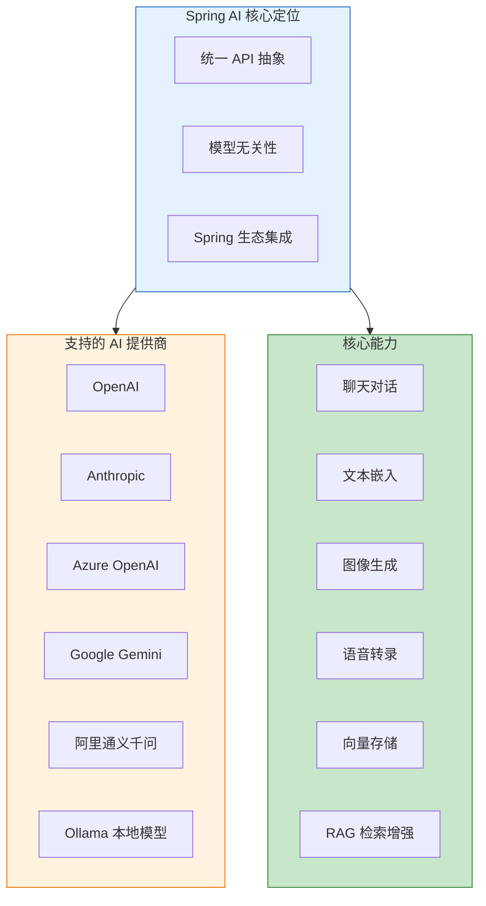

### 1.1 核心设计理念

| 设计理念 | 说明 |
|---------|------|
| **生态原生适配** | 无缝融入 Spring 生态，遵循 Spring 开发者熟悉的编程模式 |
| **统一 API 抽象** | 为各类 AI 功能提供标准化接口，切换模型仅需修改配置 |
| **模型无关性** | 屏蔽不同 AI 供应商的底层差异，实现"一次编码，多模型适配" |
| **面向 Java 开发者** | 专为 Java/Kotlin 技术栈设计，契合企业级应用开发习惯 |

### 1.2 解决的核心痛点

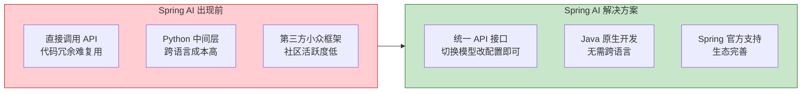

***

## 二、技术架构

Spring AI 采用"分层抽象"架构，确保不同层级的解耦与扩展性。

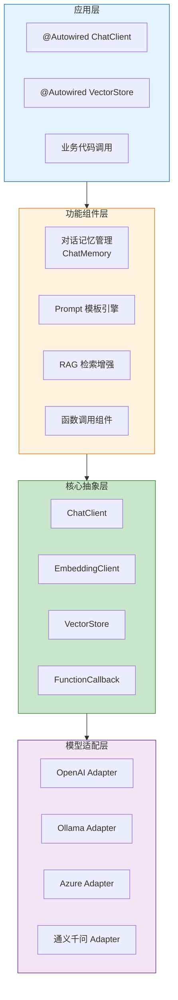

### 2.1 架构层级说明

| 层级 | 核心职责 | 关键组件 |
|------|---------|---------|
| **应用层** | 开发者直接使用的 API、注解 | `@Autowired`、配置属性 |
| **功能组件层** | 实现具体功能组件 | ChatMemory、PromptTemplate、RAG |
| **核心抽象层** | 定义核心接口，保证模型无关性 | ChatClient、EmbeddingClient、VectorStore |
| **模型适配层** | 对接不同 AI 模型的 API | OpenAIAdapter、OllamaAdapter |

### 2.2 核心抽象接口

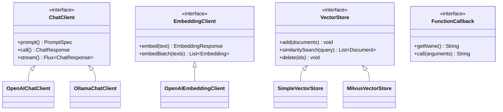

| 接口 | 作用 | 使用场景 |
|------|------|---------|
| **ChatClient** | 调用大模型对话能力 | 对话生成、指令执行 |
| **EmbeddingClient** | 将文本转换为向量 | 语义检索、相似度计算 |
| **VectorStore** | 向量存储与检索 | RAG 检索增强 |
| **FunctionCallback** | 函数调用回调 | 工具调用、实时数据获取 |

***

## 三、核心特性

### 3.1 跨供应商可移植 API

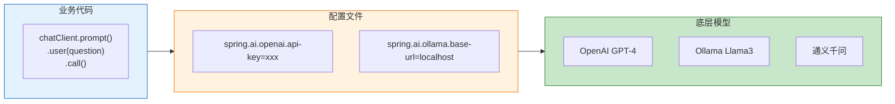

**支持的模型类型**：

| 模型类型 | 说明 | 支持供应商 |
|---------|------|-----------|
| **聊天补全** | 对话生成、指令执行 | OpenAI、Anthropic、Azure、Ollama |
| **嵌入模型** | 文本向量化 | OpenAI、Azure、Hugging Face |
| **文本转图像** | 根据描述生成图片 | OpenAI DALL-E、Stable Diffusion |
| **语音转录** | 语音转文字 | OpenAI Whisper |
| **文本转语音** | 文字转语音 | OpenAI TTS |

### 3.2 结构化输出

将 AI 模型输出自动映射到 Java POJO：

```java
public record Person(
    String name,
    int age,
    List<String> hobbies
) {}

// 调用时指定输出类型
Person person = chatClient.prompt()
    .user("生成一个人物信息")
    .call()
    .entity(Person.class);
```

### 3.3 向量数据库支持

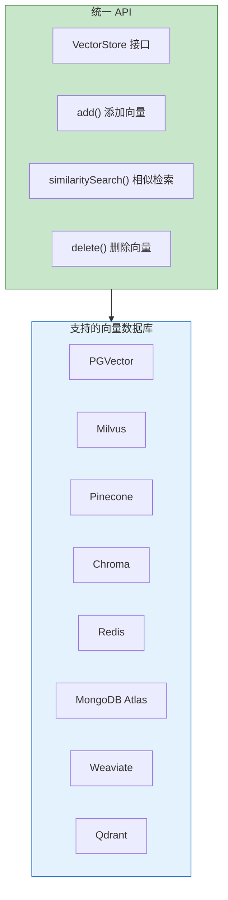

### 3.4 函数调用（Tool Calling）

允许模型请求执行客户端工具和函数，按需访问实时信息：

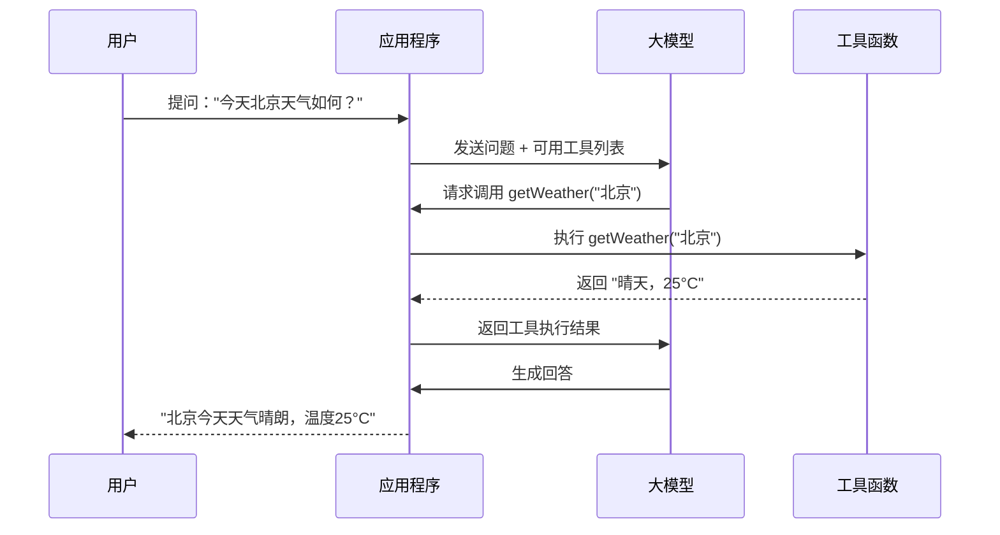

### 3.5 可观察性

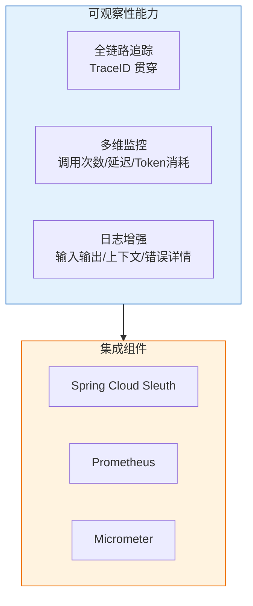

***

## 四、快速入门

### 4.1 Maven 依赖

**OpenAI 集成**：
```xml
<dependency>
    <groupId>org.springframework.ai</groupId>
    <artifactId>spring-ai-openai-spring-boot-starter</artifactId>
</dependency>
```

**Ollama 本地模型集成**：
```xml
<dependency>
    <groupId>org.springframework.ai</groupId>
    <artifactId>spring-ai-ollama-spring-boot-starter</artifactId>
</dependency>
```

### 4.2 配置文件

**OpenAI 配置**：
```yaml
spring:
  ai:
    openai:
      api-key: ${OPENAI_API_KEY}
      chat:
        options:
          model: gpt-4o
          temperature: 0.7
```

**Ollama 配置**：
```yaml
spring:
  ai:
    ollama:
      base-url: http://localhost:11434
      chat:
        model: llama3
```

### 4.3 基础使用示例

```java
@RestController
public class ChatController {
    
    private final ChatClient chatClient;
    
    public ChatController(ChatClient.Builder builder) {
        this.chatClient = builder.build();
    }
    
    @GetMapping("/chat")
    public String chat(@RequestParam String question) {
        return chatClient.prompt()
            .user(question)
            .call()
            .content();
    }
    
    @GetMapping("/stream")
    public Flux<String> stream(@RequestParam String question) {
        return chatClient.prompt()
            .user(question)
            .stream()
            .content();
    }
}
```

***

## 五、核心功能详解

### 5.1 ChatClient API

ChatClient 是与 AI 聊天模型通信的流畅 API，设计风格类似 WebClient 和 RestClient。

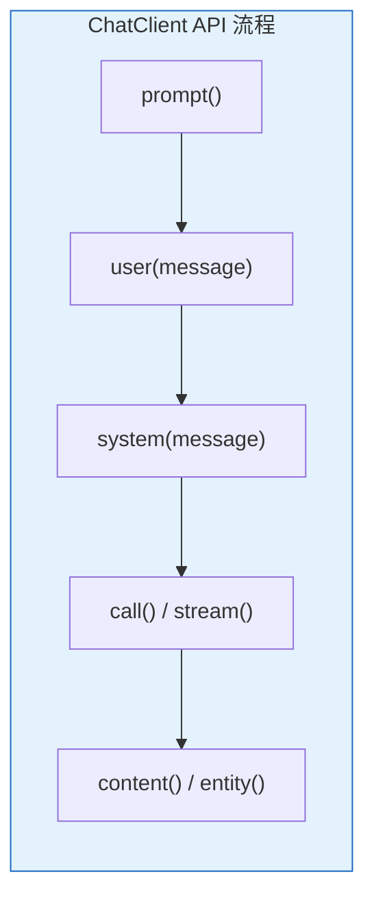

**调用方式对比**：

| 方式 | 说明 | 适用场景 |
|------|------|---------|
| **call()** | 同步调用，等待完整响应 | 短文本、快速响应 |
| **stream()** | 流式调用，实时返回 | 长文本、打字机效果 |

**完整示例**：
```java
// 同步调用
String response = chatClient.prompt()
    .system("你是一个专业的技术顾问")
    .user("解释一下微服务架构")
    .call()
    .content();

// 流式调用
Flux<String> stream = chatClient.prompt()
    .user("写一首关于春天的诗")
    .stream()
    .content();

// 结构化输出
Person person = chatClient.prompt()
    .user("生成一个人物信息")
    .call()
    .entity(Person.class);
```

### 5.2 Prompt 模板

使用 PromptTemplate 创建结构化的提示词：

```java
PromptTemplate template = new PromptTemplate("""
    请根据以下信息回答问题：
    
    背景：{context}
    问题：{question}
    
    请用专业、简洁的语言回答。
    """);

Map<String, Object> params = Map.of(
    "context", "Spring 是一个 Java 企业级开发框架",
    "question", "Spring 的核心特性有哪些？"
);

Prompt prompt = template.create(params);
String response = chatClient.prompt(prompt).call().content();
```

### 5.3 对话记忆管理

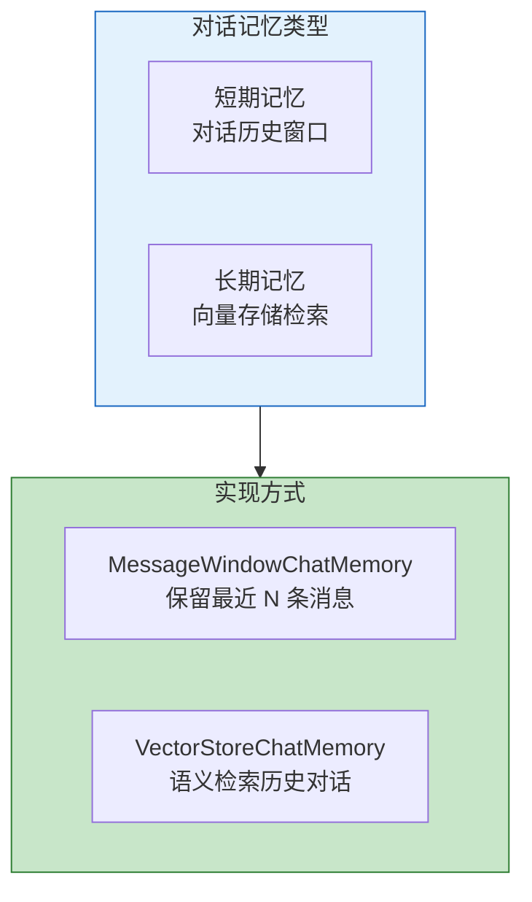

**使用示例**：
```java
// 配置对话记忆
ChatClient chatClient = ChatClient.builder(chatModel)
    .defaultAdvisors(new MessageChatMemoryAdvisor(chatMemory))
    .build();

// 多轮对话自动保持上下文
String response1 = chatClient.prompt()
    .user("我叫张三")
    .call()
    .content();

String response2 = chatClient.prompt()
    .user("我叫什么名字？")  // 模型能回答"你叫张三"
    .call()
    .content();
```

### 5.4 RAG 检索增强生成

RAG（Retrieval-Augmented Generation）是将检索系统与生成模型结合的技术，让模型能够基于外部知识库回答问题。

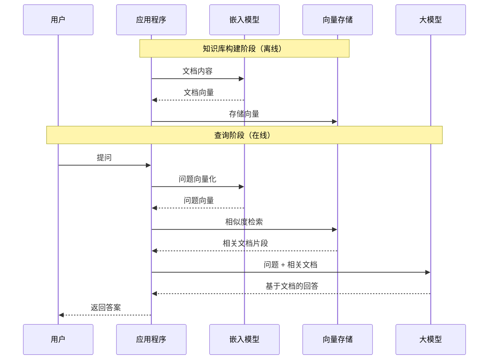

**RAG 实现示例**：
```java
@Configuration
public class RagConfig {
    
    @Bean
    public VectorStore vectorStore(EmbeddingModel embeddingModel) {
        return SimpleVectorStore.builder(embeddingModel).build();
    }
    
    @Bean
    public ChatClient ragChatClient(ChatModel chatModel, VectorStore vectorStore) {
        return ChatClient.builder(chatModel)
            .defaultAdvisors(new QuestionAnswerAdvisor(vectorStore))
            .build();
    }
}

// 使用 RAG
String response = chatClient.prompt()
    .user("公司的请假制度是什么？")
    .call()
    .content();  // 自动检索相关文档并基于文档回答
```

### 5.5 函数调用

```java
@Configuration
public class ToolConfig {
    
    @Bean
    @Description("获取指定城市的当前天气信息")
    public Function<WeatherRequest, WeatherResponse> weatherFunction() {
        return request -> {
            // 调用天气 API
            return new WeatherResponse(request.city(), "晴天", 25);
        };
    }
}

// 使用函数调用
String response = chatClient.prompt()
    .user("北京今天天气怎么样？")
    .functions("weatherFunction")  // 注册可用函数
    .call()
    .content();
```

***

## 六、支持的 AI 提供商

### 6.1 云服务商

| 提供商 | 模型 | 依赖 |
|--------|------|------|
| **OpenAI** | GPT-4、GPT-3.5、DALL-E、Whisper | `spring-ai-openai` |
| **Anthropic** | Claude 3 | `spring-ai-anthropic` |
| **Azure OpenAI** | GPT-4、GPT-3.5 | `spring-ai-azure-openai` |
| **Google** | Gemini | `spring-ai-vertex-ai-gemini` |
| **阿里云** | 通义千问 | `spring-ai-alibaba` |
| **百度** | 文心一言 | `spring-ai-baidu` |

### 6.2 本地模型（Ollama）

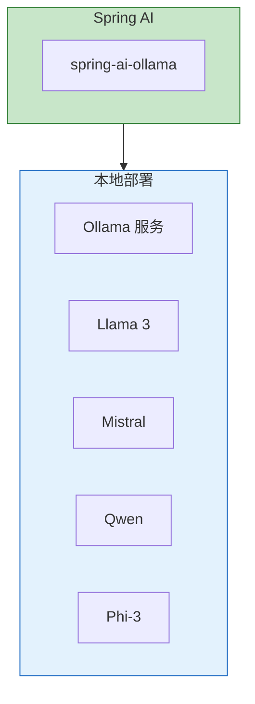

**Ollama 快速启动**：
```bash
# 安装 Ollama
curl -fsSL https://ollama.com/install.sh | sh

# 拉取模型
ollama pull llama3

# 启动服务（默认端口 11434）
ollama serve
```

***

## 七、向量数据库集成

### 7.1 支持的向量数据库

| 数据库 | 类型 | 依赖 |
|--------|------|------|
| **PGVector** | 关系型扩展 | `spring-ai-pgvector-store` |
| **Milvus** | 专用向量库 | `spring-ai-milvus-store` |
| **Chroma** | 嵌入式向量库 | `spring-ai-chroma-store` |
| **Pinecone** | 云托管 | `spring-ai-pinecone-store` |
| **Redis** | 缓存扩展 | `spring-ai-redis-store` |
| **MongoDB Atlas** | 文档数据库 | `spring-ai-mongodb-atlas-store` |

### 7.2 向量存储使用示例

```java
@Service
public class DocumentService {
    
    private final VectorStore vectorStore;
    private final EmbeddingModel embeddingModel;
    
    // 添加文档到向量库
    public void addDocument(String content, Map<String, Object> metadata) {
        Document doc = new Document(content, metadata);
        vectorStore.add(List.of(doc));
    }
    
    // 相似度检索
    public List<Document> search(String query, int topK) {
        return vectorStore.similaritySearch(
            SearchRequest.query(query).withTopK(topK)
        );
    }
}
```

***

## 八、实际应用场景

### 8.1 智能客服

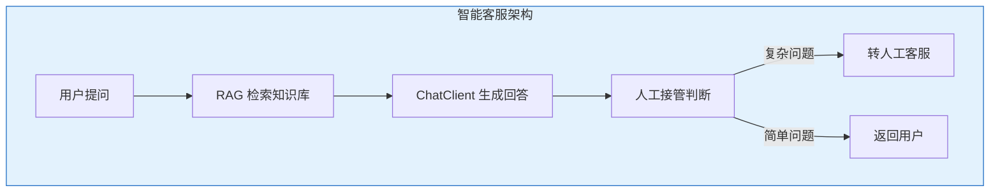

### 8.2 文档问答系统

```java
@Service
public class DocumentQAService {
    
    private final ChatClient chatClient;
    private final VectorStore vectorStore;
    
    public String ask(String question) {
        // 1. 检索相关文档
        List<Document> docs = vectorStore.similaritySearch(
            SearchRequest.query(question).withTopK(5)
        );
        
        // 2. 构建上下文
        String context = docs.stream()
            .map(Document::getContent)
            .collect(Collectors.joining("\n\n"));
        
        // 3. 生成回答
        return chatClient.prompt()
            .system("基于以下文档回答问题，如果文档中没有相关信息，请说明。")
            .user("文档：" + context + "\n\n问题：" + question)
            .call()
            .content();
    }
}
```

### 8.3 代码助手

```java
@Service
public class CodeAssistantService {
    
    private final ChatClient chatClient;
    
    public String reviewCode(String code) {
        return chatClient.prompt()
            .system("""
                你是一个资深的代码审查专家。请分析以下代码：
                1. 指出潜在的问题和风险
                2. 提供优化建议
                3. 给出改进后的代码示例
                """)
            .user("请审查以下代码：\n```\n" + code + "\n```")
            .call()
            .content();
    }
}
```

***

## 九、最佳实践

### 9.1 配置管理

```yaml
# application.yml
spring:
  ai:
    openai:
      api-key: ${OPENAI_API_KEY}
      chat:
        options:
          model: gpt-4o
          temperature: 0.7
          max-tokens: 2000
    vectorstore:
      pgvector:
        index-type: HNSW
        distance-type: COSINE_DISTANCE
```

### 9.2 异常处理

```java
@RestControllerAdvice
public class AIExceptionHandler {
    
    @ExceptionHandler(AIResponseException.class)
    public ResponseEntity<String> handleAIResponseException(AIResponseException e) {
        return ResponseEntity.status(503)
            .body("AI 服务暂时不可用，请稍后重试");
    }
}
```

### 9.3 成本控制

| 策略 | 说明 |
|------|------|
| **缓存响应** | 对相同问题缓存答案，减少重复调用 |
| **模型分级** | 简单问题用小模型，复杂问题用大模型 |
| **Token 限制** | 设置 max-tokens 限制输出长度 |
| **流式输出** | 使用 stream() 提前中断无效回答 |

***

## 十、面试高频问题

| 问题 | 答案要点 |
|------|---------|
| **Spring AI 的核心价值** | 统一 API 抽象、模型无关性、Spring 生态无缝集成 |
| **ChatClient 的两种调用方式** | call() 同步调用、stream() 流式调用 |
| **RAG 的实现原理** | 文档向量化 → 存储向量 → 问题检索 → 上下文增强 |
| **如何切换不同的 AI 模型** | 修改配置文件即可，业务代码无需改动 |
| **函数调用的作用** | 让模型能够调用外部工具获取实时信息 |
| **对话记忆如何实现** | MessageChatMemoryAdvisor 保留对话历史 |

***

## 参考资料

- [Spring AI 官方文档](https://spring.io/projects/spring-ai)
- [Spring AI 中文文档](https://www.spring-doc.cn/spring-ai/)
- [Spring AI Alibaba](https://java2ai.com/)
- [Spring AI GitHub](https://github.com/spring-projects/spring-ai)
