# 向量数据库选型与原理详解

## 一、概述

向量数据库是专门用于存储和查询向量数据（高维数值数组）的数据库系统，它通过高效的相似性搜索算法，解决了传统数据库无法处理的"语义匹配"问题。

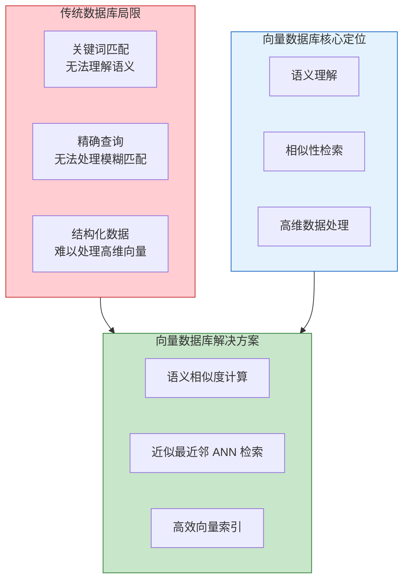

### 1.1 为什么需要向量数据库？

| 场景 | 传统数据库 | 向量数据库 |
|------|-----------|-----------|
| **搜索方式** | 关键词精确匹配 | 语义相似度匹配 |
| **查询类型** | 结构化查询（SQL） | 向量相似性查询 |
| **数据类型** | 表格、文档 | 高维向量（Embedding） |
| **典型应用** | 业务系统、事务处理 | AI 应用、RAG、推荐系统 |

### 1.2 核心应用场景

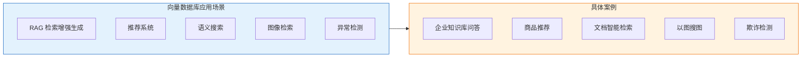

***

## 二、核心原理

### 2.1 向量相似度计算

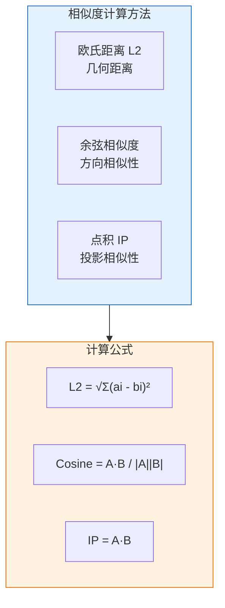

| 方法 | 公式 | 适用场景 | 特点 |
|------|------|---------|------|
| **欧氏距离 (L2)** | √Σ(ai - bi)² | 图像检索、聚类 | 关注绝对距离 |
| **余弦相似度** | A·B / \|A\|\|B\| | 文本语义、推荐 | 关注方向，忽略长度 |
| **点积 (IP)** | A·B | 归一化向量 | 计算简单 |

### 2.2 向量索引算法

向量索引是向量数据库的核心，决定了检索效率与精度。

#### 2.2.1 索引算法分类

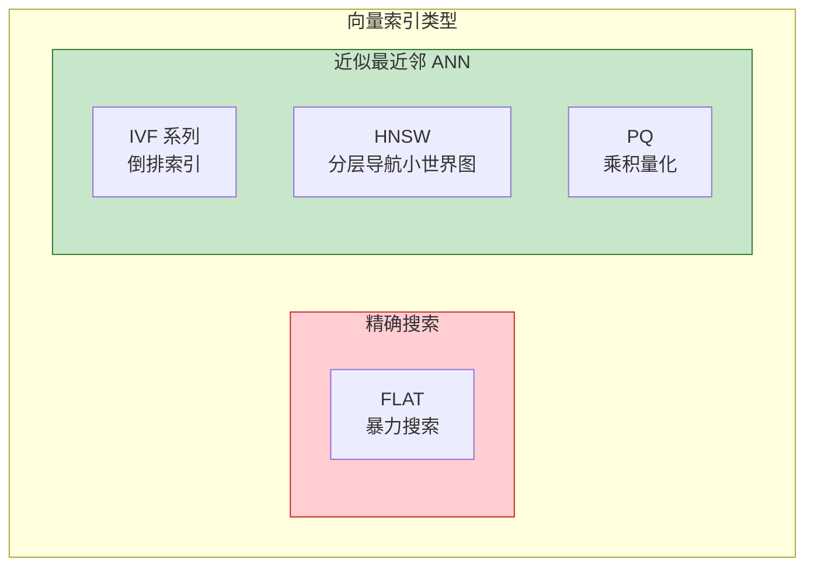

#### 2.2.2 FLAT 索引（暴力搜索）

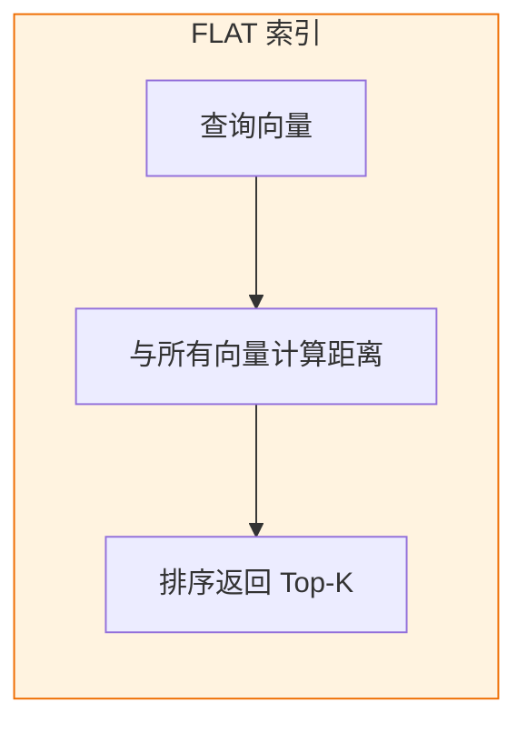

| 特点 | 说明 |
|------|------|
| **精度** | 100% 召回率 |
| **速度** | 最慢，O(N) 复杂度 |
| **内存** | 需存储全部向量 |
| **适用场景** | 小规模数据（< 10 万）、高精度要求 |

#### 2.2.3 IVF 索引（倒排文件索引）

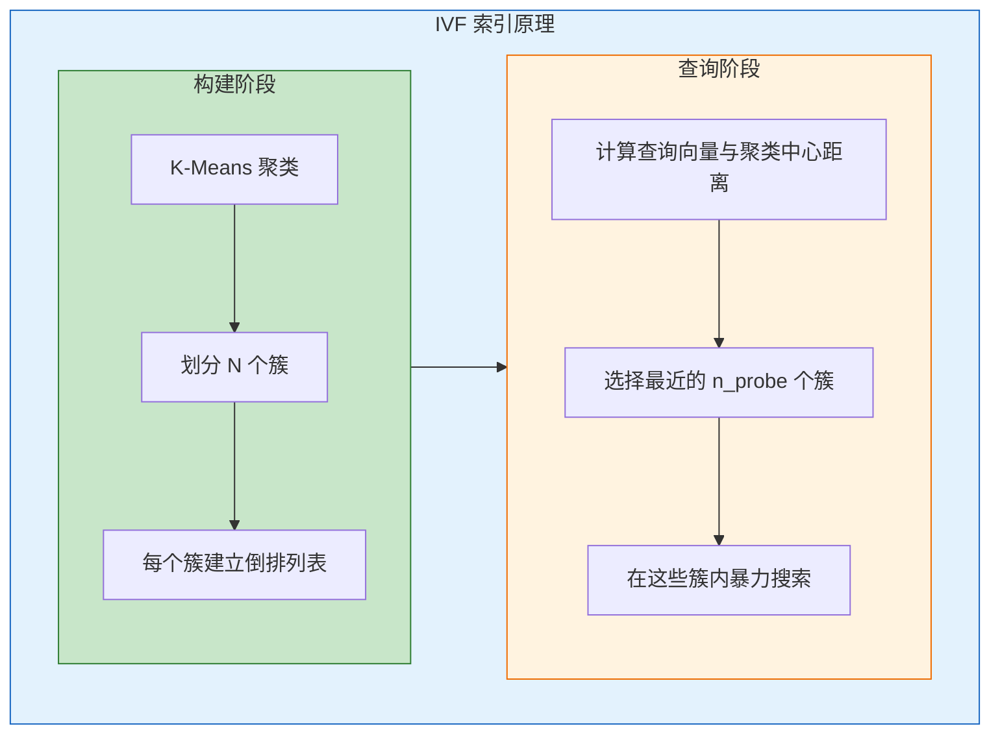

**IVF 系列索引对比**：

| 索引类型 | 说明 | 内存占用 | 查询速度 | 召回率 |
|---------|------|---------|---------|--------|
| **IVF_FLAT** | 原始向量存储 | 高 | 中 | 高 |
| **IVF_SQ8** | 8 位标量量化 | 低 | 快 | 中 |
| **IVF_PQ** | 乘积量化压缩 | 最低 | 最快 | 较低 |

**关键参数**：

| 参数 | 说明 | 影响 |
|------|------|------|
| `nlist` | 聚类中心数量 | 越大越精细，但构建越慢 |
| `nprobe` | 查询时搜索的簇数 | 越大召回率越高，速度越慢 |

#### 2.2.4 HNSW 索引（分层导航小世界图）

HNSW（Hierarchical Navigable Small World）是目前生产环境首选索引，兼顾检索速度、召回率与动态更新。

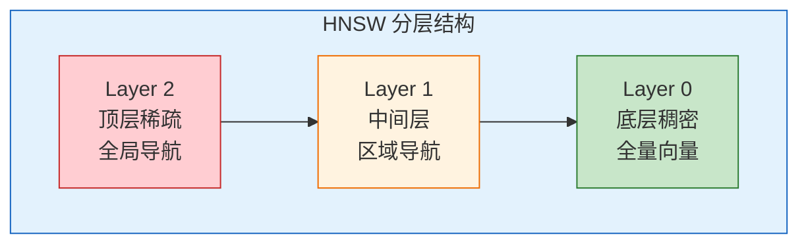

**工作原理**：

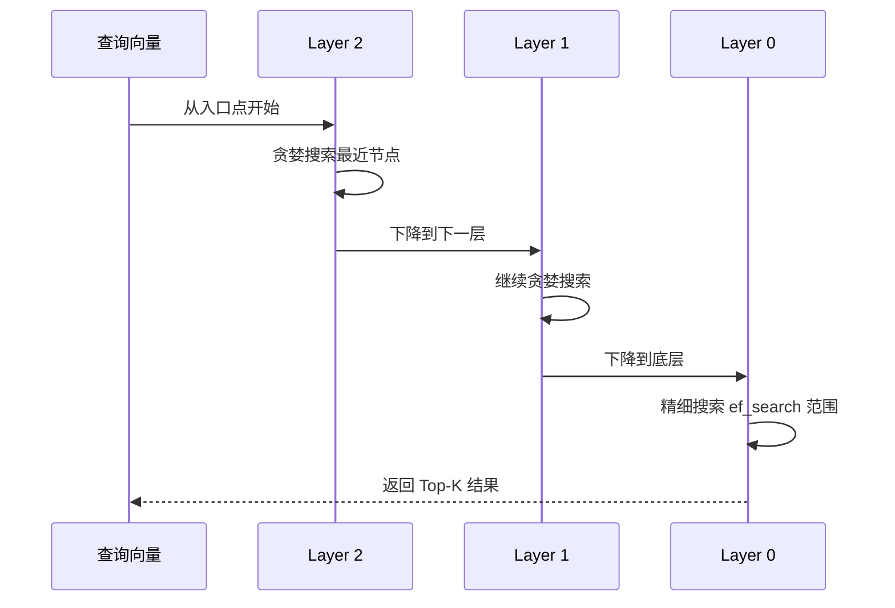

**关键参数**：

| 参数 | 说明 | 建议 |
|------|------|------|
| `M` | 每个节点的最大连接数 | 16-64，越大召回率越高 |
| `ef_construction` | 构建时搜索宽度 | 100-400，越大构建越慢 |
| `ef_search` | 查询时搜索宽度 | 10-100，越大召回率越高 |

**HNSW vs IVF 对比**：

| 对比维度 | HNSW | IVF |
|---------|------|-----|
| **查询速度** | 更快 | 较快 |
| **召回率** | 更高 | 可调 |
| **内存占用** | 较高 | 较低 |
| **构建速度** | 较慢 | 较快 |
| **动态更新** | 支持 | 需重建 |
| **适用场景** | 实时检索、高召回 | 大规模、内存受限 |

#### 2.2.5 PQ 索引（乘积量化）

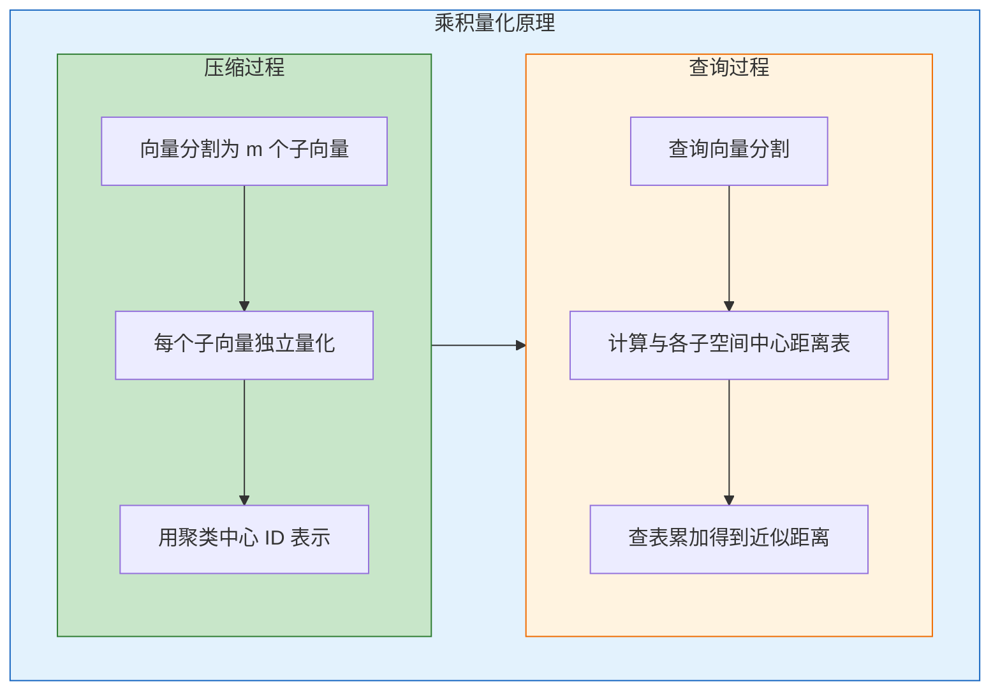

**压缩效果**：

| 原始向量 | 压缩后 | 压缩比 |
|---------|--------|--------|
| 128 维 float (512 bytes) | 8 个 uint8 (8 bytes) | 64:1 |
| 768 维 float (3072 bytes) | 48 个 uint8 (48 bytes) | 64:1 |

### 2.3 混合检索

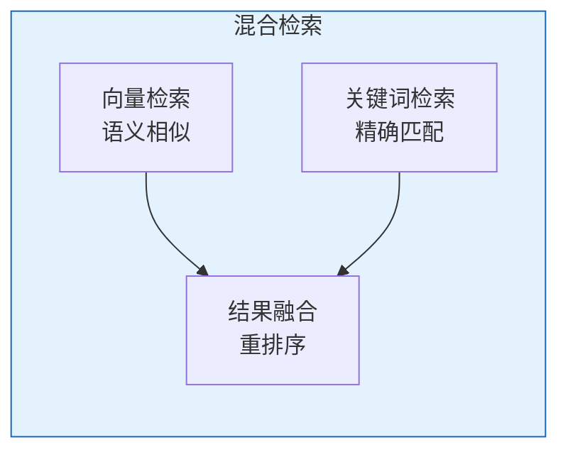

**融合策略**：

| 策略 | 说明 |
|------|------|
| **加权融合** | 向量分数 × α + 关键词分数 × β |
| **倒数排名融合 (RRF)** | rank = Σ 1/(k + rank_i) |
| **重排序** | 先向量粗筛，再关键词精排 |

***

## 三、主流向量数据库对比

### 3.1 核心产品概览

| 产品 | 类型 | 开源协议 | 典型规模 | 社区热度 |
|------|------|---------|---------|---------|
| **Milvus** | 专用向量数据库 | Apache 2.0 | 十亿级 | ⭐ 40k+ |
| **Qdrant** | 专用向量数据库 | Apache 2.0 | 亿级 | ⭐ 28k+ |
| **Weaviate** | 向量+图数据库 | BSD-3 | 十亿级 | ⭐ 15k+ |
| **Chroma** | 轻量向量数据库 | Apache 2.0 | 百万级 | ⭐ 25k+ |
| **Pinecone** | 全托管云服务 | 闭源 | 十亿级 | - |
| **pgvector** | PostgreSQL 扩展 | PostgreSQL | 千万级 | ⭐ 4k+ |
| **Faiss** | 向量检索库 | MIT | 亿级 | ⭐ 39k+ |

### 3.2 功能特性对比

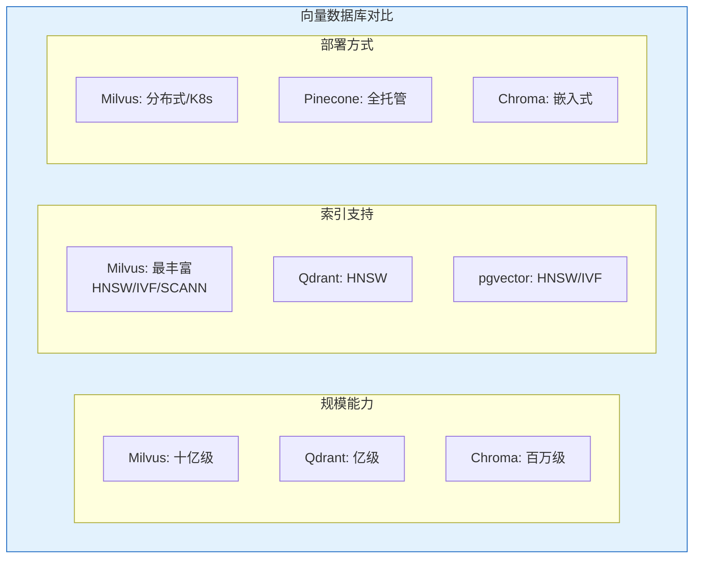

### 3.3 详细对比表

| 对比维度 | Milvus | Qdrant | Weaviate | Chroma | Pinecone | pgvector |
|---------|--------|--------|----------|--------|----------|----------|
| **索引类型** | HNSW/IVF/SCANN | HNSW | HNSW | HNSW | 专有 | HNSW/IVF |
| **稀疏向量** | 支持 | 支持 | 支持 | 不支持 | 不支持 | 支持 |
| **混合检索** | 支持 | 支持 | 支持 | 不支持 | 支持 | 支持 |
| **分布式** | 支持 | 支持 | 支持 | 不支持 | 自动 | 不支持 |
| **云托管** | Zilliz Cloud | Qdrant Cloud | Weaviate Cloud | 不支持 | 仅云服务 | 不支持 |
| **多模态** | 支持 | 支持 | 支持 | 不支持 | 支持 | 不支持 |
| **标量过滤** | 强 | 强 | 强 | 基础 | 强 | 最强 |

### 3.4 性能基准参考

基于 ANN-Benchmarks 标准测试：

| 数据库 | 查询延迟 (P95) | 插入速度 | 召回率 |
|--------|---------------|---------|--------|
| **Milvus** | 15-30ms (1亿向量) | > 200k/s | 95%+ |
| **Qdrant** | < 10ms (1000万向量) | 50-100k/s | 95%+ |
| **Weaviate** | < 150ms | 中等 | 90%+ |
| **Chroma** | < 200ms | 快 | 90%+ |
| **Faiss (GPU)** | < 5ms | 极快 | 95%+ |

***

## 四、选型指南

### 4.1 选型决策树

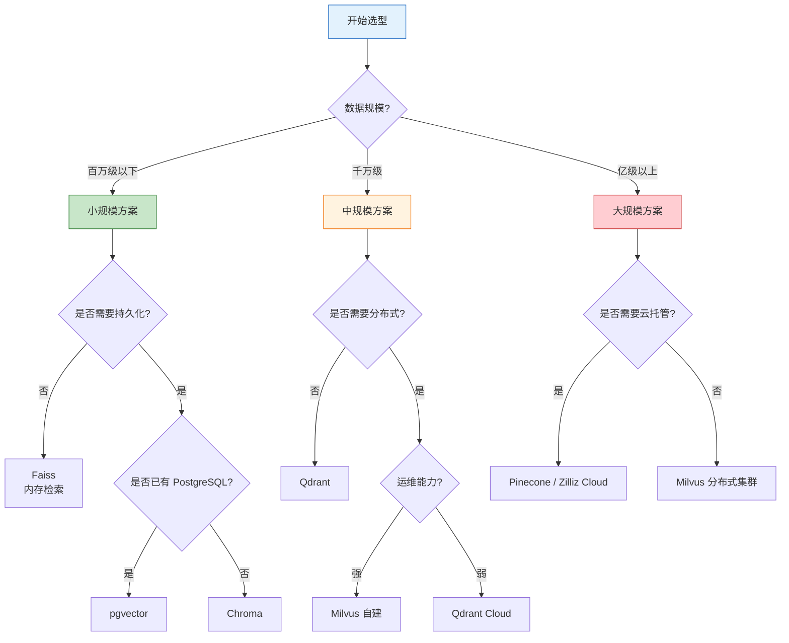

### 4.2 场景化选型建议

| 场景 | 首选 | 备选 | 理由 |
|------|------|------|------|
| **快速原型开发** | Chroma | LanceDB | 轻量、开箱即用 |
| **已有 PostgreSQL 生态** | pgvector | - | 无需引入新组件 |
| **中小规模 RAG** | Qdrant | Weaviate | 性能好、易运维 |
| **大规模生产环境** | Milvus | Pinecone | 分布式、高可用 |
| **多模态检索** | Weaviate | Milvus | 原生支持多模态 |
| **极致性能** | Faiss | - | GPU 加速、算法丰富 |
| **无运维需求** | Pinecone | Zilliz Cloud | 全托管 |

### 4.3 成本对比

| 方案 | 月成本估算 | 说明 |
|------|-----------|------|
| **Chroma** | 免费 | 自建，仅服务器成本 |
| **pgvector** | 免费 | 自建，需 PostgreSQL |
| **Milvus 自建** | $2000+ | 4 节点 K8s 集群 |
| **Qdrant Cloud** | $500+ | 企业版 |
| **Pinecone** | $70+ | 10 亿向量起 |
| **Zilliz Cloud** | $100+ | 中型数据集 |

***

## 五、RAG 架构实践

### 5.1 RAG 工作流程

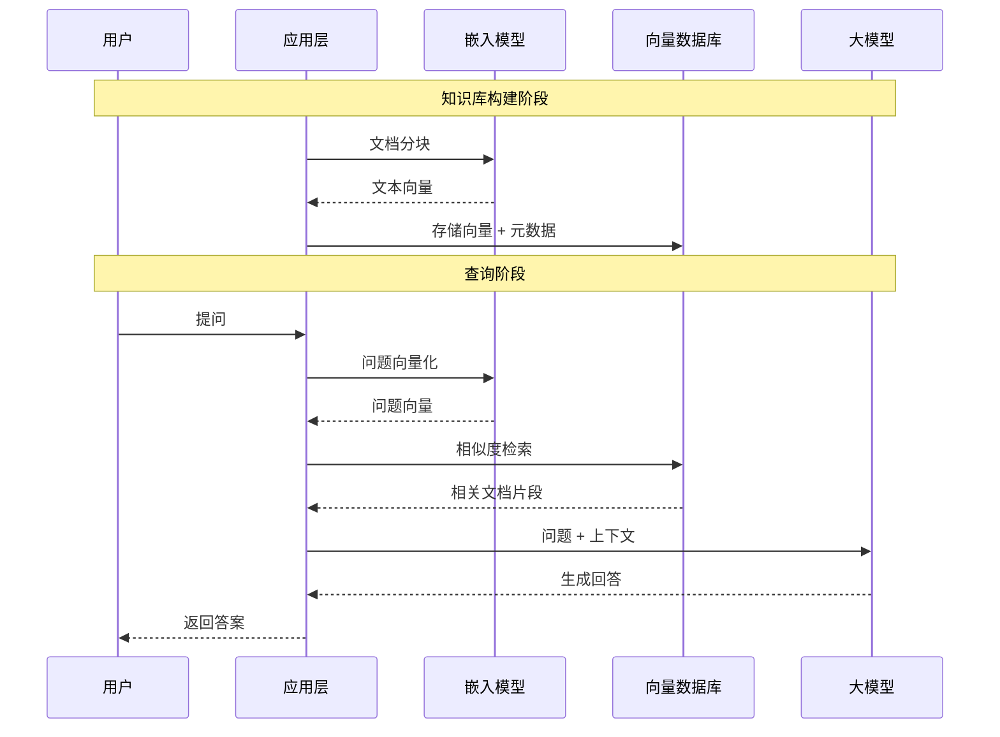

### 5.2 向量数据库在 RAG 中的角色

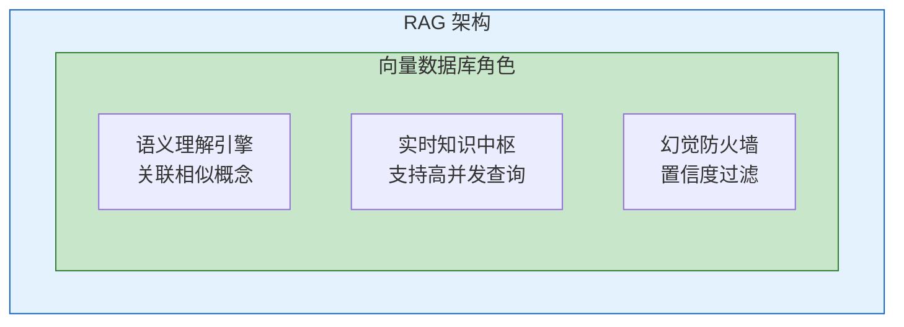

### 5.3 最佳实践

| 实践 | 说明 |
|------|------|
| **文档分块** | 推荐 500-1000 tokens，重叠 10-20% |
| **元数据设计** | 包含来源、时间、权限等过滤字段 |
| **索引选择** | 小规模用 HNSW，大规模用 IVF+PQ |
| **混合检索** | 向量 + 关键词，提升召回率 |
| **重排序** | 粗筛 Top-100，精排 Top-10 |

***

## 六、部署架构

### 6.1 单机部署

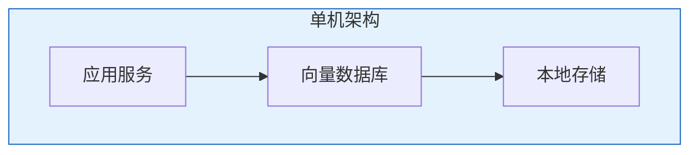

**适用场景**：开发测试、小规模应用（< 100 万向量）

### 6.2 分布式部署

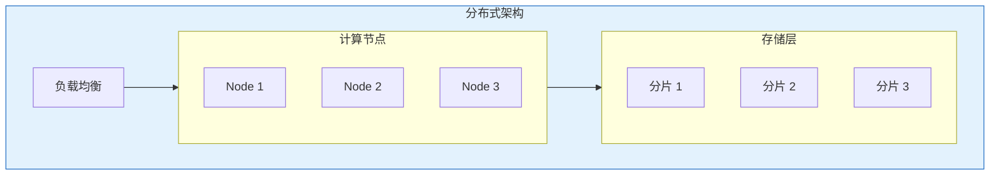

**适用场景**：生产环境、大规模数据（> 1000 万向量）

### 6.3 云托管架构

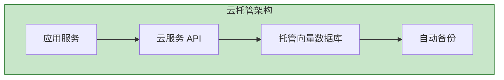

**适用场景**：快速上线、无运维需求

***

## 七、面试高频问题

| 问题 | 答案要点 |
|------|---------|
| **向量数据库 vs 传统数据库** | 语义匹配 vs 关键词匹配，ANN 索引 vs B+ 树 |
| **HNSW 原理** | 分层图结构，顶层快速导航，底层精细搜索 |
| **IVF 原理** | 聚类划分，倒排索引，nprobe 控制精度 |
| **HNSW vs IVF** | HNSW 更快更高召回，IVF 更省内存 |
| **RAG 中向量数据库作用** | 语义检索、知识存储、幻觉过滤 |
| **如何选择向量数据库** | 数据规模、运维能力、成本预算、功能需求 |
| **混合检索如何实现** | 向量 + 关键词，加权融合或 RRF |

***

## 参考资料

- [向量数据库产品对比评测 - 腾讯云](https://cloud.tencent.cn/developer/article/2601251)
- [向量数据库选型指南 - CSDN](https://blog.csdn.net/qq_21103417/article/details/157389408)
- [Milvus 官方文档 - 索引解释](https://milvus.io/docs/index-explained.md)
- [向量数据库索引终极指南 - CSDN](https://blog.csdn.net/gitblog_01123/article/details/154102423)
- [ANN-Benchmarks](https://ann-benchmarks.com/)
