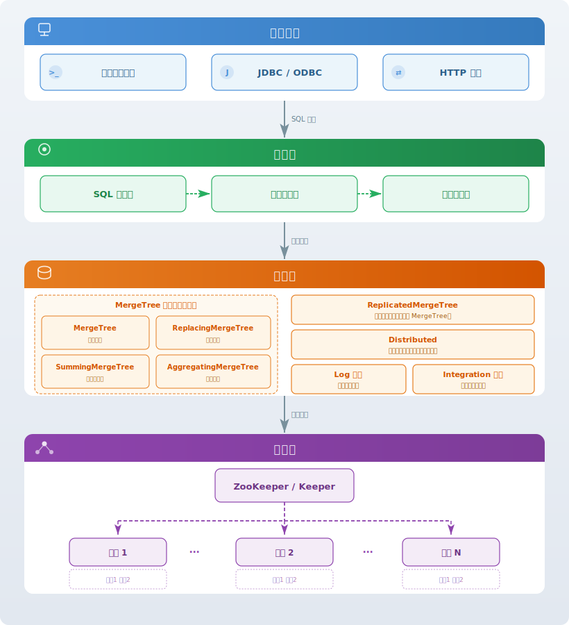
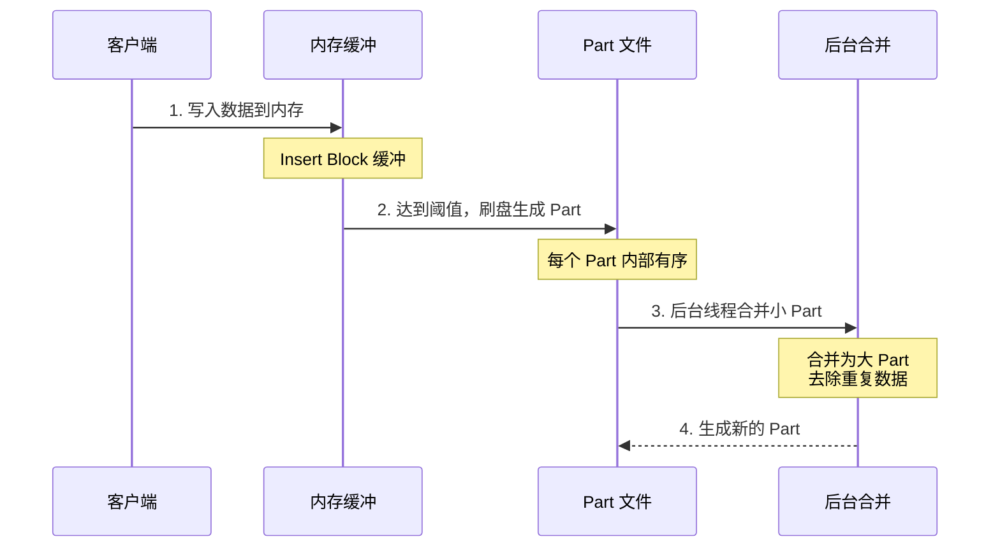
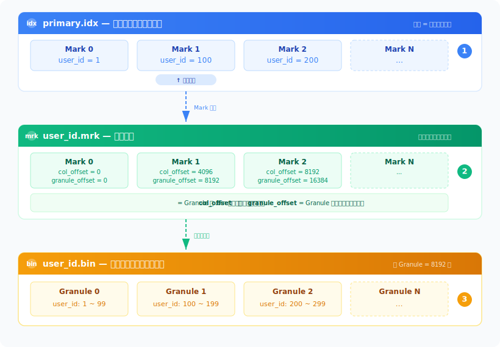
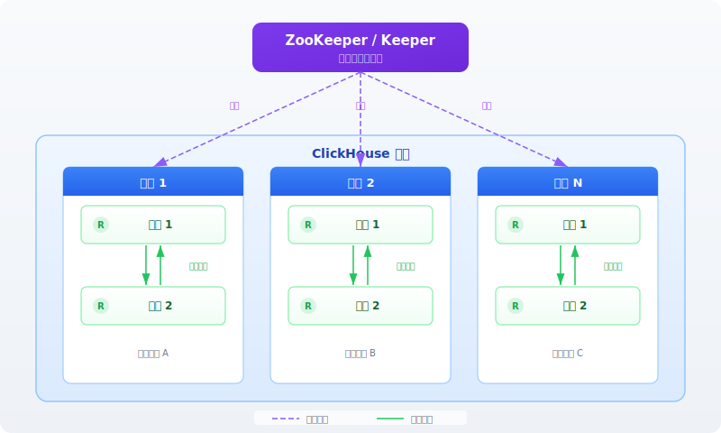
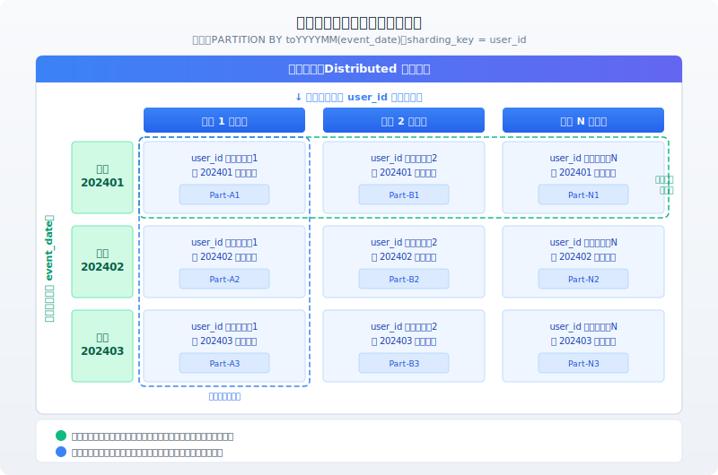
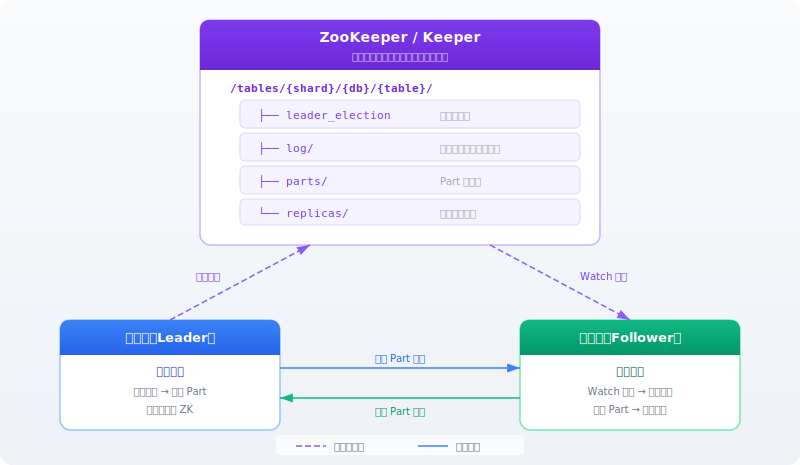
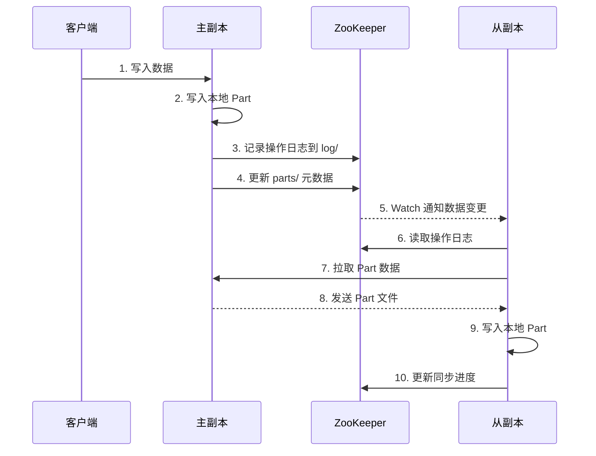
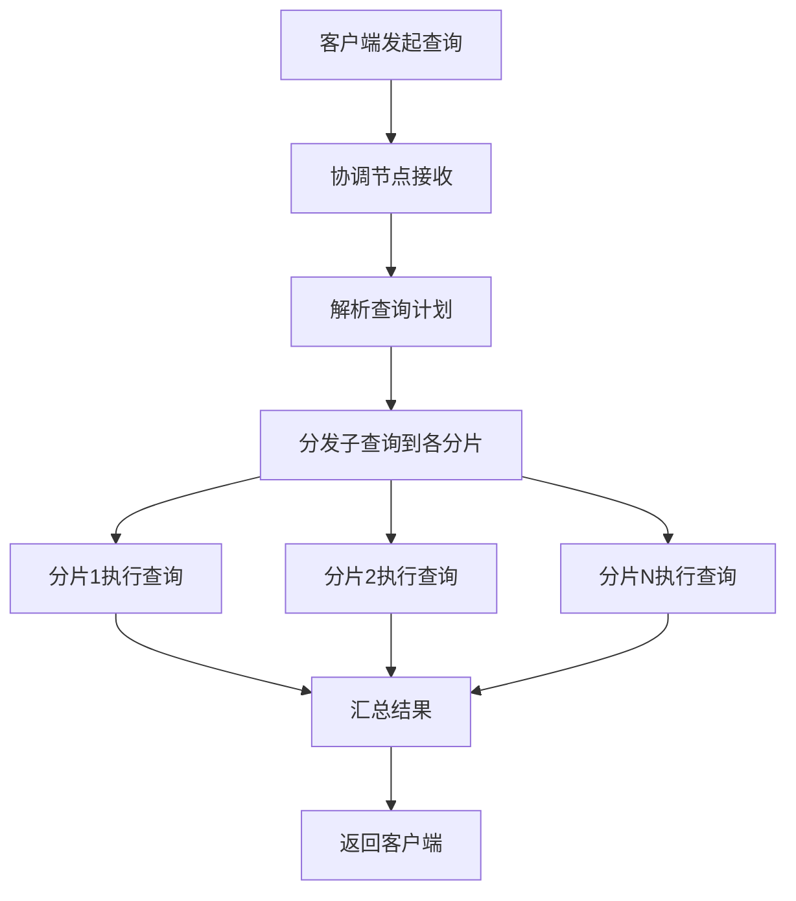
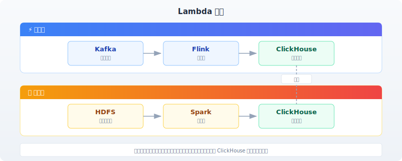
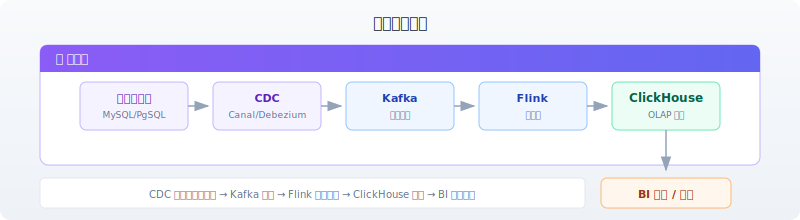

# ClickHouse 列式数据库详解

## 一、概述

### 1.1 什么是 ClickHouse？

ClickHouse 是一个开源的**列式数据库管理系统（DBMS）**，专为**在线分析处理（OLAP）** 场景设计。由俄罗斯 Yandex 公司开发，2016 年开源，现已成为全球最受欢迎的 OLAP 引擎之一。

| 属性 | 说明 |
|------|------|
| **开发方** | Yandex（俄罗斯搜索引擎公司） |
| **开源时间** | 2016 年 |
| **许可证** | Apache 2.0 |
| **定位** | 列式 OLAP 数据库 |
| **核心能力** | PB 级数据处理、亚秒级查询响应 |

### 1.2 核心特性

ClickHouse 之所以能在 OLAP 场景下实现亚秒级查询响应，源于以下特性的协同作用：

| 特性 | 说明 | 为什么重要 |
|------|------|------------|
| **列式存储** | 数据按列独立存储，查询只读需要的列 | 100 列的表查 3 列，I/O 减少 97% |
| **向量化执行** | 以 Block（8192 行）为处理单位，利用 CPU SIMD 指令批量处理 | 一条指令处理多行，减少函数调用开销 |
| **高效压缩** | 同列数据类型一致、值分布相似 | 压缩比达 10:1 ~ 30:1，进一步减少 I/O |
| **稀疏索引** | 每 8192 行一个索引项，索引体积极小 | 索引常驻内存，避免磁盘随机访问 |
| **分布式架构** | 支持分片和副本，线性扩展 | 写入和查询并行度随节点数线性增长 |
| **SQL 支持** | 标准 SQL 语法 | 学习成本低，生态兼容性好 |

### 1.3 发展历程

| 时间 | 里程碑 |
|------|--------|
| **2009 年** | Yandex 内部开始研发，用于流量分析 |
| **2016 年** | 正式开源 |
| **2019 年** | 成立 ClickHouse Inc.，商业化运营 |
| **至今** | 字节跳动、腾讯、美团、快手等广泛应用 |

---

## 二、核心架构与原理

> 本章按**数据生命周期**组织：架构总览 → 数据如何存储 → 数据如何写入 → 数据如何查找 → 数据如何计算。

### 2.1 整体架构



ClickHouse 采用**分层架构**，自上而下分为四层：

| 层级 | 职责 | 核心组件 |
|------|------|----------|
| **客户端层** | 接收请求 | CLI、JDBC/ODBC、HTTP 接口 |
| **服务层** | 解析与执行 | SQL 解析器 → 查询优化器 → 查询执行器 |
| **存储层** | 数据组织与持久化 | MergeTree 引擎族、ReplicatedMergeTree、Distributed、Log 系列、Integration 系列 |
| **集群层** | 分布式协调 | ZooKeeper/Keeper、分片、副本 |

### 2.2 列式存储模型

#### 2.2.1 存储结构

每张表的数据按列独立存储，每个 Part 目录内包含以下文件（Part 是 MergeTree 写入磁盘后的存储单元，详见 [4.2 Part 与 Granule 的关系](#42-数据复制机制)）：

```
Part 目录结构：
├── primary.idx        # 主键索引（排序键首行值，常驻内存）
├── user_id.bin        # 用户ID列数据文件
├── user_id.mrk        # 用户ID列标记文件（每 Granule 的偏移量）
├── name.bin           # 姓名列数据文件
├── name.mrk           # 姓名列标记文件
├── age.bin            # 年龄列数据文件
├── age.mrk            # 年龄列标记文件
└── ...
```

#### 2.2.2 核心优势

| 优势 | 原理 |
|------|------|
| **减少 I/O** | 只读取查询涉及的列，跳过无关列（如查询 3 列的 100 列表，I/O 减少 97%） |
| **高效压缩** | 同列数据类型一致、值分布相似，压缩比可达 10:1 ~ 30:1 |
| **CPU 缓存友好** | 连续的同类型数据提高 CPU L1/L2 缓存命中率 |

#### 2.2.3 压缩编码

| 算法 | 适用场景 | 压缩比 | 速度 |
|------|----------|--------|------|
| **LZ4** | 通用数据（默认） | 中等 | 极快 |
| **ZSTD** | 高压缩需求 | 高 | 快 |
| **Delta** | 时间序列数据 | 极高 | 快 |
| **DoubleDelta** | 单调递增序列 | 极高 | 快 |
| **Gorilla** | 浮点数时序 | 极高 | 快 |

### 2.3 MergeTree 存储引擎

MergeTree 是 ClickHouse 最核心的存储引擎家族，基于 **LSM-Tree 变体**设计。数据写入后经历「内存缓冲 → 刷盘生成 Part → 后台合并」三个阶段：



**核心参数**：

| 参数 | 默认值 | 说明 |
|------|--------|------|
| `index_granularity` | 8192 | 稀疏索引粒度（每个 Granule 的行数） |
| `min_bytes_for_wide_part` | 10MB | Part 超过此大小使用宽表模式（每列独立文件），否则使用紧凑模式（所有列合并在一个文件） |
| `min_rows_for_wide_part` | 10000 | 同上，按行数判断 |

### 2.4 索引机制

ClickHouse 的索引体系由**主键索引**和**跳数索引**两层构成，前者用于排序列的快速定位，后者用于非排序列的 Granule 跳过，两者协作减少 I/O。

#### 2.4.1 主键索引（稀疏索引）

**与 B+ 树索引的区别**：

| 对比项 | B+ 树索引 | 稀疏索引 |
|--------|----------|----------|
| **索引粒度** | 每行一个索引项 | 每 8192 行一个索引项 |
| **索引大小** | 数据量的 10%-30% | 数据量的 0.01% |
| **内存占用** | 可能无法常驻内存 | 可常驻内存 |
| **查询方式** | 精确定位到行 | 定位到数据块（Granule） |

**三文件协作结构**：

> 以下假设表定义为 `ORDER BY (user_id)`，`user_id` 为排序键，数据按 `user_id` 升序物理排列。



**查询流程（以 `WHERE user_id = 150` 为例）**：

| 步骤 | 操作 | 说明 |
|------|------|------|
| ① | 在 `primary.idx` 中二分查找 150 | 定位到 Mark 1（100 ≤ 150 < 200） |
| ② | 用 Mark 1 查 `.mrk` 文件 | 取得 `col_offset=4096, granule_offset=8192` |
| ③ | 按偏移量读取 `.bin` 文件 | 解压 Granule 1，在 8192 行中过滤出目标行 |

**内存常驻形态**：`primary.idx` 启动时整体加载为连续内存数组，每个元素即排序键的首行值。由于数组有序且紧凑，直接对排序键值做二分查找，定位到 Mark 编号，再用 Mark 编号到 `.mrk` 文件中取出偏移量，最终到 `.bin` 文件读取对应 Granule。

#### 2.4.2 跳数索引（二级索引）

> 跳数索引是主键索引的**补充**，而非替代。主键索引只能加速 ORDER BY 键的查询，当 WHERE 条件包含**非排序列**时，主键索引无法跳过任何 Granule，只能全量扫描。跳数索引正是为此设计——为非排序列建立 Granule 级的粗粒度摘要，在扫描时跳过不可能包含目标值的 Granule，减少 I/O。

**主键索引 vs 跳数索引**：

| 对比项 | 主键索引（primary.idx） | 跳数索引（Skip Index） |
|--------|------------------------|----------------------|
| **索引列** | 仅限 ORDER BY 键 | 任意列 |
| **索引粒度** | 每 Granule 一个排序键首行值 | 每 Granule 一个摘要信息 |
| **查找方式** | 二分查找，精确定位 Granule | 逐 Granule 判断，跳过不匹配的 |
| **存储位置** | 常驻内存 | 磁盘（按需加载） |
| **是否必需** | 建表时自动创建 | 需手动定义 |
| **协作关系** | 先用主键索引定位 Granule 范围 | 再用跳数索引在范围内进一步跳过无关 Granule |

**跳数索引类型**：

| 索引类型 | 适用场景 | 说明 |
|----------|----------|------|
| **minmax** | 范围查询 | 记录每个 Granule 的最大最小值，过滤范围外的 Granule |
| **set** | IN / 等值查询 | 记录每个 Granule 的唯一值集合，判断目标值是否可能存在 |
| **bloom_filter** | 等值 / IN 查询 | 概率型索引，空间效率高于 set，可能有假阳性但无假阴性 |
| **ngrambf_v1** | 字符串模糊匹配 | N-gram 布隆过滤器，加速 LIKE 查询 |
| **tokenbf_v1** | 分词匹配 | 分词布隆过滤器，加速分词搜索 |

**建表时定义跳数索引**：

```sql
CREATE TABLE user_events (
    event_date Date,
    user_id UInt64,
    event_type String,
    event_time DateTime,
    properties String,
    INDEX idx_type event_type TYPE set(0) GRANULARITY 4,
    INDEX idx_props properties TYPE tokenbf_v1(512, 3, 0) GRANULARITY 4
) ENGINE = MergeTree()
PARTITION BY toYYYYMM(event_date)
ORDER BY (event_date, user_id)
SETTINGS index_granularity = 8192;
```

| 参数 | 说明 |
|------|------|
| `INDEX name expr` | 索引名称和索引表达式 |
| `TYPE type(params)` | 索引类型及参数 |
| `GRANULARITY` | 跳数索引粒度，即每多少个 Granule 生成一个索引项（默认 1） |

### 2.5 向量化执行引擎

传统数据库逐行处理数据，每行一次函数调用，CPU 利用率低。ClickHouse 采用**向量化执行**，以 Block（默认 8192 行）为处理单位，利用 CPU SIMD 指令一条指令处理多行数据。

| 对比项 | 传统执行 | 向量化执行 |
|--------|----------|------------|
| **处理单位** | 逐行 | 批量（Block = 8192 行） |
| **函数调用** | 每行一次 | 每块一次 |
| **CPU 指令** | 标量指令 | SIMD 向量指令 |
| **缓存利用** | 低（数据分散） | 高（连续同类型数据） |

**核心概念**：

| 概念 | 说明 |
|------|------|
| **Block** | 查询处理的基本单位，默认包含 8192 行，由多列 Column 组成 |
| **Granule** | 存储读取的最小单位，默认 8192 行，与 Block 大小对齐 |
| **Column** | Block 中的列数据，以连续数组形式存储，可直接被 SIMD 指令处理 |

---

## 三、表引擎家族

### 3.1 引擎概览

| 引擎家族 | 引擎 | 适用场景 |
|----------|------|----------|
| **MergeTree** | MergeTree | 基础引擎，支持主键、分区、索引，通用分析场景 |
| | ReplacingMergeTree | 自动去重（合并时），需要去重的场景 |
| | SummingMergeTree | 自动预聚合求和，聚合统计场景 |
| | AggregatingMergeTree | 自动预聚合（多种聚合函数），复杂聚合场景 |
| | CollapsingMergeTree | 折叠删除，状态变更追踪 |
| | VersionedCollapsingMergeTree | 带版本的折叠，多版本状态追踪 |
| | GraphiteMergeTree | Graphite 指标聚合，监控时序场景 |
| **Replicated** | ReplicatedMergeTree | 高可用副本引擎，基于 MergeTree |
| | ReplicatedReplacingMergeTree | 高可用 + 自动去重 |
| | ReplicatedSummingMergeTree | 高可用 + 预聚合求和 |
| | ReplicatedAggregatingMergeTree | 高可用 + 复杂预聚合 |
| | ReplicatedCollapsingMergeTree | 高可用 + 折叠删除 |
| **Distributed** | Distributed | 分布式查询路由引擎（逻辑表），不存储数据 |
| **Log** | TinyLog | 最简单的日志引擎，单线程写入，适用于临时小数据 |
| | StripeLog | 支持并发读取的日志引擎，适用于临时中等数据 |
| | Log | 支持并发读写的日志引擎，适用于临时数据 |
| **Integration** | Kafka | 消费 Kafka 消息写入表中 |
| | HDFS | 读取 HDFS 上的数据 |
| | MySQL | 读取 MySQL 表数据 |
| | PostgreSQL | 读取 PostgreSQL 表数据 |
| | RabbitMQ | 消费 RabbitMQ 消息写入表中 |
| | S3 | 读取 S3 对象存储数据 |
| **Memory** | Memory | 内存表，数据不压缩，重启丢失，适用于缓存和测试 |
| **Special** | Buffer | 写入缓冲，批量刷盘到目标表 |
| | Join | 内存中的 JOIN 右表，用于 RIGHT JOIN 优化 |
| | File | 直接操作本地文件，数据导入导出 |
| | Null | 丢弃写入数据，仅返回读取结构 |
| | Generate | 随机数据生成，测试用 |

### 3.2 MergeTree 引擎族

MergeTree 是 ClickHouse 最核心的引擎族，所有 MergeTree 变体共享相同的存储结构（Part + Granule + 稀疏索引），区别在于**后台合并时的数据处理逻辑**。

#### 3.2.1 MergeTree 基础引擎

最基础的 MergeTree 引擎，支持主键、分区、排序，不执行任何自动去重或聚合。

```sql
CREATE TABLE user_events (
    event_date Date,
    user_id UInt64,
    event_type String,
    event_time DateTime,
    properties String
) ENGINE = MergeTree()
PARTITION BY toYYYYMM(event_date)
ORDER BY (event_date, user_id, event_time)
SETTINGS index_granularity = 8192;
```

**建表关键参数**：

| 参数 | 说明 |
|------|------|
| `PARTITION BY` | 分区键，通常按时间分区 |
| `ORDER BY` | 排序键，决定数据物理排序（必填） |
| `PRIMARY KEY` | 主键（可选，默认与 ORDER BY 相同，决定稀疏索引） |
| `SETTINGS` | 引擎参数配置 |

#### 3.2.2 ReplacingMergeTree（去重）

后台合并时自动去除 ORDER BY 键相同的重复行，保留版本字段值最大的行。

```sql
CREATE TABLE user_profiles (
    user_id UInt64,
    name String,
    age UInt8,
    update_time DateTime
) ENGINE = ReplacingMergeTree(update_time)
ORDER BY user_id;
```

| 特性 | 说明 |
|------|------|
| **去重时机** | 后台合并时，非实时保证 |
| **去重依据** | ORDER BY 键相同的行视为重复 |
| **版本字段** | 可选，指定后保留版本值最大的行；未指定则保留最后写入的行 |
| **查询去重** | 需使用 `FINAL` 关键字（性能差，生产环境应避免） |

#### 3.2.3 SummingMergeTree 与 AggregatingMergeTree（预聚合）

两者都在后台合并时自动预聚合数据，减少存储量和查询计算量。

| 引擎 | 聚合方式 | 适用场景 |
|------|----------|----------|
| **SummingMergeTree** | 对指定数值列求和 | 简单求和统计（如 GMV、订单量） |
| **AggregatingMergeTree** | 支持任意聚合函数（需配合 `AggregateFunction` 类型） | 复杂聚合（如 UV、中位数、分位数） |

```sql
-- SummingMergeTree：自动对 amount 列求和
CREATE TABLE order_stats (
    event_date Date,
    user_id UInt64,
    amount Decimal(12,2)
) ENGINE = SummingMergeTree((amount))
ORDER BY (event_date, user_id);

-- AggregatingMergeTree：使用 AggregateFunction 类型
CREATE TABLE uv_stats (
    event_date Date,
    user_id AggregateFunction(uniq, UInt64)
) ENGINE = AggregatingMergeTree()
ORDER BY event_date;
```

#### 3.2.4 CollapsingMergeTree 与 VersionedCollapsingMergeTree（折叠）

通过"签名行"机制在合并时抵消状态变更，适用于追踪状态变化的场景（如订单状态流转）。

| 引擎 | 折叠方式 | 适用场景 |
|------|----------|----------|
| **CollapsingMergeTree** | 需要 `sign` 列（1 表示插入，-1 表示取消），合并时抵消 sign 对的行 | 状态变更严格按序到达 |
| **VersionedCollapsingMergeTree** | 增加 `version` 列，相同 version 的 sign 对才抵消 | 状态变更可能乱序到达 |

```sql
-- CollapsingMergeTree
CREATE TABLE order_states (
    order_id UInt64,
    status String,
    sign Int8
) ENGINE = CollapsingMergeTree(sign)
ORDER BY order_id;

-- VersionedCollapsingMergeTree
CREATE TABLE order_states_v2 (
    order_id UInt64,
    status String,
    sign Int8,
    version UInt32
) ENGINE = VersionedCollapsingMergeTree(sign, version)
ORDER BY (order_id, version);
```

#### 3.2.5 GraphiteMergeTree（时序监控）

专为 Graphite 监控指标设计，后台合并时按 Graphite 路径规则自动聚合（Rollup）历史精度数据。

```sql
CREATE TABLE graphite_metrics (
    path String,
    value Float64,
    timestamp UInt32,
    date Date
) ENGINE = GraphiteMergeTree('config_section')
ORDER BY (path, timestamp);
```

### 3.3 Replicated 引擎族

Replicated 系列引擎在 MergeTree 变体基础上增加**多副本数据复制**能力，依赖 ZooKeeper/Keeper 协调。每个 Replicated 引擎对应一个 MergeTree 变体：

| 引擎 | 基础引擎 | 增加能力 |
|------|----------|----------|
| ReplicatedMergeTree | MergeTree | 高可用副本 |
| ReplicatedReplacingMergeTree | ReplacingMergeTree | 高可用 + 去重 |
| ReplicatedSummingMergeTree | SummingMergeTree | 高可用 + 预聚合求和 |
| ReplicatedAggregatingMergeTree | AggregatingMergeTree | 高可用 + 复杂预聚合 |
| ReplicatedCollapsingMergeTree | CollapsingMergeTree | 高可用 + 折叠删除 |

```sql
CREATE TABLE user_events_local ON CLUSTER 'cluster_name' (
    event_date Date,
    user_id UInt64,
    event_type String
) ENGINE = ReplicatedMergeTree('/clickhouse/tables/{shard}/user_events', '{replica}')
PARTITION BY toYYYYMM(event_date)
ORDER BY (event_date, user_id);
```

**Replicated 引擎关键参数**：

| 参数 | 说明 |
|------|------|
| `ZooKeeper 路径` | 同一分片内所有副本使用相同路径，格式如 `/clickhouse/tables/{shard}/table_name` |
| `副本名称` | 同一分片内每个副本使用不同名称，通过 `{replica}` 宏自动替换 |

### 3.4 Distributed 引擎

Distributed 引擎不存储数据，作为**查询路由层**将请求分发到各分片的本地表并汇总结果。

```sql
CREATE TABLE user_events_all ON CLUSTER 'cluster_name' (
    event_date Date,
    user_id UInt64,
    event_type String
) ENGINE = Distributed('cluster_name', 'default', 'user_events_local', rand());
```

**Distributed 表参数**：

| 参数 | 说明 |
|------|------|
| `cluster_name` | 集群名称（在配置文件中定义） |
| `database` | 目标数据库名 |
| `table` | 目标本地表名 |
| `sharding_key` | 分片键，决定写入时数据路由到哪个分片 |

**Distributed 表 vs 直接访问本地表**：

可以直接访问 Replicated 引擎的本地表，但只能查到当前节点持有的数据。两者区别如下：

| 对比项 | Distributed 表 | 直接访问本地表（Replicated） |
|--------|----------------|---------------------------|
| **数据范围** | 全集群数据（查询所有分片并汇总） | 仅当前节点持有的分片数据 |
| **写入行为** | 按 `sharding_key` 路由到对应分片 | 直接写入当前节点（数据可能分布不均） |
| **查询性能** | 需网络传输和结果汇总，有额外开销 | 无网络开销，单节点最快 |
| **适用场景** | 日常查询和写入的统一入口 | 运维排查、单分片数据验证、性能调优 |

> **实践建议**：生产环境中，查询和写入统一通过 Distributed 表操作，避免数据遗漏；运维场景下可直接查询本地表定位问题。

### 3.5 辅助引擎族

#### 3.5.1 Log 系列

轻量级日志引擎，数据不做压缩和合并，适用于临时数据存储和测试。

| 引擎 | 写入 | 读取 | 适用场景 |
|------|------|------|----------|
| **TinyLog** | 单线程 | 并发 | 最简单，临时小数据 |
| **StripeLog** | 单线程 | 并发 | 临时中等数据 |
| **Log** | 并发 | 并发 | 临时数据，支持并发写入 |

#### 3.5.2 Integration 系列

对接外部数据源的引擎，支持直接查询或消费外部系统数据。

| 引擎 | 数据源方向 | 说明 |
|------|------------|------|
| **Kafka** | 消费写入 | 消费 Kafka Topic 消息写入表中 |
| **RabbitMQ** | 消费写入 | 消费 RabbitMQ 队列消息写入表中 |
| **HDFS** | 只读查询 | 读取 HDFS 上的数据文件 |
| **S3** | 只读查询 | 读取 S3 对象存储数据 |
| **MySQL** | 只读查询 | 读取 MySQL 表数据 |
| **PostgreSQL** | 只读查询 | 读取 PostgreSQL 表数据 |

#### 3.5.3 Memory 引擎

数据全量驻留内存，不压缩，重启丢失。适用于缓存、测试和中间结果集。

#### 3.5.4 Special 系列

特殊用途引擎，通常配合其他引擎使用。

| 引擎 | 说明 |
|------|------|
| **Buffer** | 写入缓冲，积累到阈值后批量刷盘到目标表 |
| **Join** | 内存中的 JOIN 右表，用于 RIGHT JOIN 优化 |
| **File** | 直接操作本地文件，用于数据导入导出 |
| **Null** | 丢弃写入数据，仅返回读取结构（测试用） |
| **Generate** | 随机数据生成（测试用） |

---

## 四、分布式架构

### 4.1 分片与副本



**分片与副本概念**：

| 概念 | 说明 | 作用 |
|------|------|------|
| **分片（Shard）** | 数据水平切分的逻辑单元，不同分片持有不同数据子集 | 提升写入和查询并行度 |
| **副本（Replica）** | 同一分片内的数据冗余拷贝，同分片内副本持有相同数据 | 保证高可用和查询负载均衡 |

> 在 ClickHouse 中，**分片是包含多个副本的集合体**。不同分片持有不同数据子集（水平切分），同一分片内的副本持有相同数据（冗余拷贝）。

**推荐配置**：

| 场景 | 分片数 | 副本数 |
|------|--------|--------|
| **开发测试** | 1 | 1 |
| **生产环境** | 3+ | 2 |
| **高吞吐写入** | 按数据量增加 | 2 |

### 4.2 分片与分区

分区（`PARTITION BY`）和分片是两个**正交独立**的维度：分区是单节点本地表的存储组织方式，分片是集群级的数据分布方式。同一逻辑分区的数据会按分片键散布到多个分片，每个分片的本地表各自持有该分区的一个子集。



| 对比项 | 分区（Partition） | 分片（Shard） |
|--------|-------------------|---------------|
| **作用层级** | 单节点本地表 | 集群 |
| **定义方式** | `PARTITION BY` 子句 | Distributed 引擎的 `sharding_key` |
| **数据范围** | 每个分区是本地表的一个数据子集 | 每个分片是全表的一个数据子集 |
| **绑定关系** | 弱绑定——同一逻辑分区跨多个分片存在，每个分片仅持有该分区中属于自己的一部分数据 |

### 4.3 数据复制机制

ClickHouse 通过 **ReplicatedMergeTree** 系列引擎实现数据复制，依赖 ZooKeeper/Keeper 作为元数据协调中心。

**Part 与 Granule 的关系**：

| 概念 | 说明 |
|------|------|
| **Part** | 数据写入磁盘后的存储单元。每次 Insert 刷盘生成一个 Part 目录，内含 `.bin`（列数据）、`.mrk`（标记）、`primary.idx`（主键索引）等文件。后台合并将小 Part 合并为大 Part。 |
| **Granule** | Part 内部的最小读取单元，默认 8192 行。`.bin` 文件按 Granule 粒度压缩存储，`.mrk` 文件记录每个 Granule 的偏移量。 |
| **关系** | Part 包含多个 Granule；`.bin` 文件是 Granule 的物理载体；复制以 Part 为单位在副本间传输。 |

#### 4.3.1 复制架构



**ZooKeeper 中存储的关键数据**：

| ZNode 路径 | 作用 |
|------------|------|
| `leader_election` | 主副本选举，同一分片内只有一个 Leader |
| `log/` | 操作日志序列，记录每次写入指令 |
| `parts/` | Part 元数据（校验和、行数、大小等） |
| `replicas/` | 副本注册信息与同步进度 |

> **重要**：ZooKeeper 只存储**元数据和协调信息**，不存储实际数据。Part 始终在 ClickHouse 节点之间直接传输。

#### 4.3.2 写入复制流程



**流程详解**：

| 步骤 | 操作 | 说明 |
|------|------|------|
| ① | 客户端写入 | 数据发送到任一副本（通常由 Leader 选举决定写入入口） |
| ② | Leader 本地写入 | 生成 Part 文件，写入本地磁盘 |
| ③ | 记录操作日志 | 将写入指令追加到 ZK 的 `log/` 节点 |
| ④ | 更新 Part 元数据 | 在 ZK 的 `parts/` 中注册新 Part 信息 |
| ⑤ | Watch 通知 | ZK 通过 Watch 机制通知 Follower 数据变更 |
| ⑥⑦ | Follower 拉取 | Follower 从 ZK 读取日志后，向 Leader 拉取 Part |
| ⑧⑨ | 传输并写入 | Leader 直接发送 Part 文件给 Follower，Follower 写入本地 |
| ⑩ | 确认同步 | Follower 在 ZK 中更新自己的同步进度 |

#### 4.3.3 副本同步模式

| 模式 | 说明 | 配置 |
|------|------|------|
| **异步复制**（默认） | 写入 Leader 后立即返回，Follower 后台同步 | `insert_quorum=1`（默认） |
| **法定人数写入** | 等待指定数量的副本确认后才返回成功 | `insert_quorum=2` |
| **严格法定人数** | 读取时也必须从法定数量副本读取 | `select_sequential_consistency=1` |

**法定人数写入示例**：

```sql
INSERT INTO user_events SETTINGS insert_quorum=2, insert_quorum_timeout=60000 VALUES (...);
```

| 参数 | 说明 |
|------|------|
| `insert_quorum` | 需要确认写入的副本数（默认 1） |
| `insert_quorum_timeout` | 等待法定人数的超时时间（毫秒） |
| `select_sequential_consistency` | 读取时是否要求严格一致性（默认 0） |

#### 4.3.4 故障恢复

| 场景 | 恢复机制 |
|------|----------|
| **Follower 宕机** | 不影响写入，恢复后自动从 ZK 读取未同步的日志，向 Leader 拉取缺失的 Part |
| **Leader 宕机** | ZK 自动触发主副本选举，新 Leader 接管写入入口 |
| **ZK 宕机** | 表变为只读，无法写入新数据，但查询不受影响；ZK 恢复后自动恢复写入 |

#### 4.3.5 复制相关配置

```xml
<clickhouse>
    <zookeeper>
        <node>
            <host>zk1</host>
            <port>2181</port>
        </node>
    </zookeeper>
    
    <macros>
        <shard>01</shard>
        <replica>replica1</replica>
    </macros>
</clickhouse>
```

| 配置项 | 说明 |
|--------|------|
| `zookeeper/node` | ZooKeeper 集群地址 |
| `macros/shard` | 当前节点的分片编号 |
| `macros/replica` | 当前节点的副本标识 |

### 4.4 查询路由

通过 Distributed 引擎表发起查询时，ClickHouse 采用**两阶段执行**模型：



**执行阶段**：

| 阶段 | 说明 |
|------|------|
| **阶段一：分发** | 协调节点将查询拆分为子查询，发送到各分片的本地表并行执行 |
| **阶段二：汇总** | 协调节点收集各分片的结果，执行聚合、排序等最终计算后返回客户端 |

**关键配置**：

| 配置项 | 说明 |
|--------|------|
| `distributed_product_mode` | 分布式 JOIN 的处理策略 |
| `prefer_localhost_replica` | 优先查询本地副本，减少网络传输（默认开启） |
| `max_distributed_connections` | 分布式查询的最大并发连接数 |

---

## 五、应用场景与选型

### 5.1 适用场景

| 场景 | 说明 | 典型应用 |
|------|------|----------|
| **用户行为分析** | 点击流、事件日志分析 | PV/UV、漏斗分析、留存分析 |
| **实时报表** | 业务指标实时统计 | GMV、订单量、DAU/MAU |
| **日志分析** | 替代 ELK 中的 ES | 系统日志、访问日志分析 |
| **广告效果分析** | 广告数据统计 | 点击率、转化率、ROI |
| **IoT 数据分析** | 设备指标聚合 | 传感器数据、监控指标 |
| **数据仓库** | 企业级数仓构建 | 替代 Hadoop/Hive |

### 5.2 不适用场景

| 场景 | 原因 | 推荐方案 |
|------|------|----------|
| **OLTP 事务** | 不支持 ACID 事务 | MySQL、PostgreSQL |
| **高频点查** | 不适合按 ID 查单条记录 | MySQL、Redis |
| **全文搜索** | 不支持倒排索引 | Elasticsearch |
| **频繁更新删除** | UPDATE/DELETE 性能差 | MySQL、MongoDB |
| **高并发写入** | 写入有锁竞争 | Kafka + 批量导入 |

### 5.3 与其他数据库对比

| 对比项 | MySQL | Elasticsearch | HBase | Hive | ClickHouse |
|--------|-------|---------------|-------|------|------------|
| **定位** | OLTP 事务型数据库 | 搜索引擎 | NoSQL 数据库 | 数据仓库 | OLAP 分析型数据库 |
| **存储方式** | 行式存储 | 倒排索引 + 列存储 | 列族存储 | 行式存储 | 列式存储 |
| **查询延迟** | 毫秒级（点查） | 毫秒~秒级 | 毫秒级（点查） | 分钟~小时级 | 毫秒~秒级 |
| **事务支持** | 完整 ACID | 无 | 行级 ACID | 无 | 无 |
| **SQL 支持** | 强 | DSL 语法 | 弱 | 强 | 强 |
| **压缩比** | 低 | 较低 | 中 | 中 | 极高（10:1+） |
| **适用场景** | 交易系统 | 全文搜索 | KV 存储 | 离线批处理 | 实时分析 |

> **ES 迁移到 ClickHouse 的典型收益**：存储空间减少 6 倍、写入性能提升 5 倍、查询速度提升 10+ 倍（适用于纯分析场景，非全文搜索场景）。

### 5.4 典型架构方案

**Lambda 架构**：



**实时数仓架构**：



---

## 六、最佳实践

### 6.1 表设计原则

**ORDER BY 键设计**：

ORDER BY 决定数据的物理排序，直接影响主键索引的效率和 Part 合并的性能。设计时需在**查询过滤效率**和**写入合并效率**之间权衡：

| 原则 | 说明 | 原因 |
|------|------|------|
| **高频过滤字段优先** | 将常用 WHERE 条件字段放在前面 | 主键索引只能加速 ORDER BY 前缀列的查询 |
| **基数递减** | 字段基数从前到后递减 | 低基数字段在前可使主键索引更紧凑，减少需扫描的 Granule |
| **时间字段优先** | 时间字段通常放在第一位 | 时间过滤是最常见的查询模式，且有利于 Part 合并效率 |

> **注意**：上述原则可能冲突。例如"时间字段优先"与"高频过滤字段优先"矛盾时，应优先保证查询频率最高的过滤条件能命中主键索引。

```sql
-- 好的设计：时间 + 用户ID（时间过滤 + 用户过滤都能命中索引）
ORDER BY (event_date, user_id)

-- 不好的设计：高基数字段在前（时间过滤无法命中索引，需全量扫描）
ORDER BY (user_id, event_date)
```

**分区设计**：

分区决定数据的物理分隔，主要作用是**分区裁剪**（查询时跳过无关分区）和**数据生命周期管理**（按分区删除过期数据）。

| 建议 | 说明 | 原因 |
|------|------|------|
| **按时间分区** | 使用 `toYYYYMM(date)` 或 `toYYYYMMDD(date)` | 便于按时间裁剪和清理过期数据 |
| **避免过度分区** | 单表分区数不宜超过 1000 | 分区过多会增加 ZooKeeper 元数据开销和 Part 数量 |
| **分区粒度与数据量匹配** | 日增量 < 1GB 用月分区，日增量 > 1GB 用日分区 | 避免分区过小（Part 碎片）或过大（裁剪粒度粗） |

### 6.2 查询优化

**优化原则**：

| 原则 | 说明 |
|------|------|
| **避免 SELECT \*** | 只查询需要的列，减少 I/O |
| **利用分区裁剪** | WHERE 条件包含分区字段，跳过无关分区 |
| **利用主键索引** | WHERE 条件包含 ORDER BY 前缀列，减少扫描 Granule |
| **避免 FINAL** | ReplacingMergeTree 查询时避免使用 FINAL（触发全量重排，性能差） |
| **使用 PREWHERE** | 将高过滤率的条件下推到读取阶段，在解压前先过滤，减少后续列的读取量 |

**优化示例**：

```sql
-- 不好的查询
SELECT * FROM user_events WHERE event_date = '2024-01-01';

-- 优化后的查询
SELECT user_id, event_type 
FROM user_events 
PREWHERE event_date = '2024-01-01'
WHERE event_type = 'click';
```

### 6.3 写入优化

| 优化项 | 说明 |
|--------|------|
| **批量写入** | 每次写入 10000~100000 行 |
| **避免小批量写入** | 频繁小批量写入产生大量小 Part |
| **使用 Buffer 表** | Buffer 表缓冲后批量写入 |
| **异步写入** | 使用 Kafka 引擎异步消费 |

**Buffer 表示例**：

```sql
-- Buffer 表（缓冲写入）
CREATE TABLE user_events_buffer AS user_events
ENGINE = Buffer(currentDatabase, user_events, 16, 10, 100, 10000, 1000000, 10000000, 100000000);

-- 写入 Buffer 表，自动刷新到主表
INSERT INTO user_events_buffer VALUES ...;
```

### 6.4 集群配置建议

| 配置项 | 建议值 | 说明 |
|--------|--------|------|
| `max_memory_usage` | 物理内存的 50%-70% | 单查询最大内存 |
| `max_bytes_before_external_group_by` | max_memory_usage 的一半 | GROUP BY 溢出到磁盘阈值 |
| `background_pool_size` | CPU 核心数 | 后台合并线程数 |
| `max_threads` | CPU 核心数 | 查询并行度 |

---

## 七、总结

### 7.1 核心要点

| 要点 | 说明 |
|------|------|
| **列式存储** | 只读需要的列，大幅减少 I/O |
| **向量化执行** | 利用 SIMD 指令批量处理数据 |
| **稀疏索引** | 索引体积极小，常驻内存 |
| **MergeTree 引擎** | 核心存储引擎，支持分区、排序、合并 |
| **分布式架构** | 分片 + 副本，线性扩展 |

### 7.2 选型建议

| 场景 | 推荐方案 |
|------|----------|
| **OLTP 事务** | MySQL / PostgreSQL |
| **全文搜索** | Elasticsearch |
| **实时分析** | ClickHouse |
| **离线批处理** | Hive / Spark |
| **时序数据** | InfluxDB / TDengine |

### 7.3 学习路径

```
入门 → 基础 SQL 操作 → 表引擎理解 → 性能优化 → 集群运维 → 架构设计
```

---

## 参考资料

- [ClickHouse 官方文档](https://clickhouse.com/docs)
- [ClickHouse GitHub 仓库](https://github.com/ClickHouse/ClickHouse)
- [ClickHouse 中文社区](https://clickhouse.com.cn)
