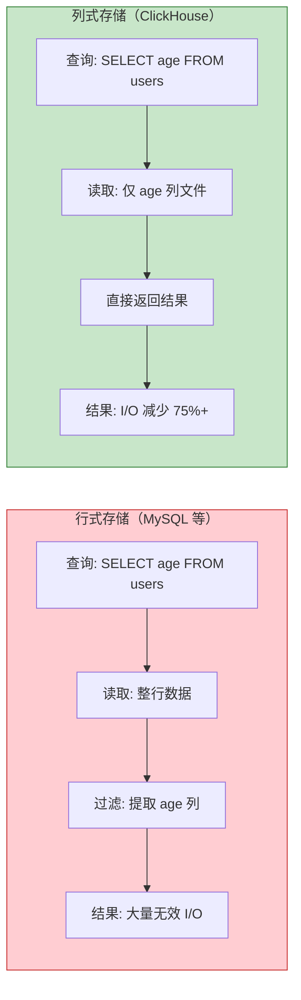
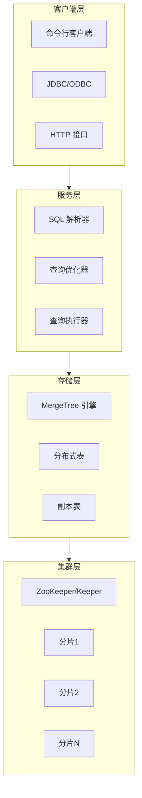
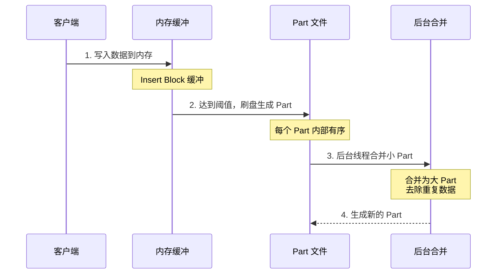
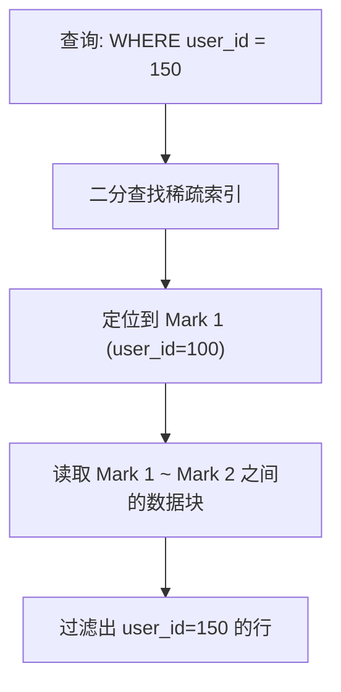
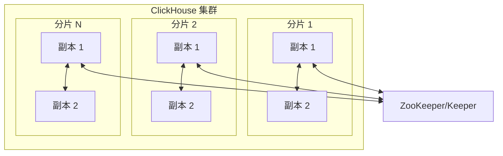
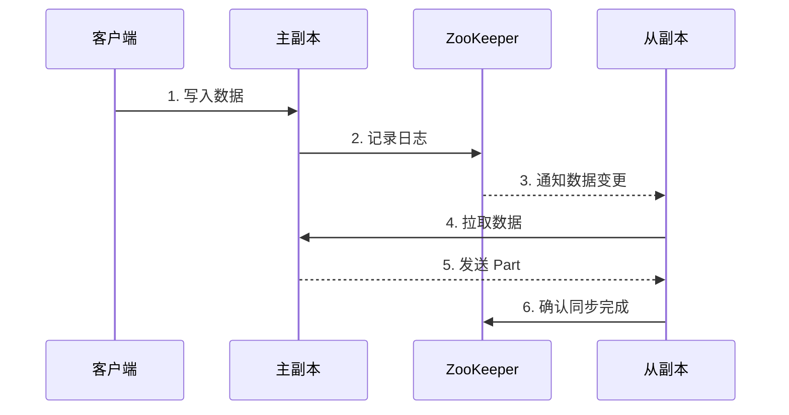
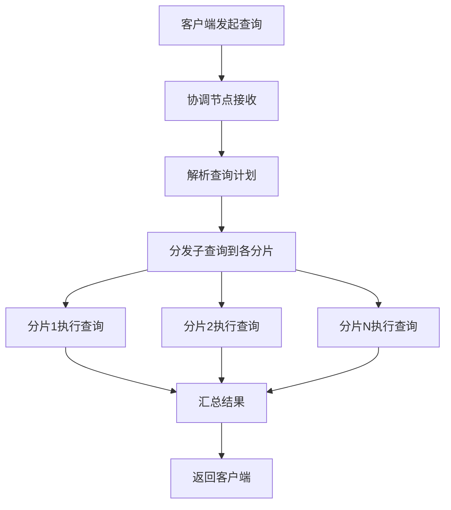

# ClickHouse 列式数据库详解

## 一、概述

### 1.1 什么是 ClickHouse？

ClickHouse 是一个开源的**列式数据库管理系统（DBMS）**，专为**在线分析处理（OLAP）** 场景设计。由俄罗斯 Yandex 公司开发，2016 年开源，现已成为全球最受欢迎的 OLAP 引擎之一。

| 属性 | 说明 |
|------|------|
| **开发方** | Yandex（俄罗斯搜索引擎公司） |
| **开源时间** | 2016 年 |
| **许可证** | Apache 2.0 |
| **定位** | 列式 OLAP 数据库 |
| **核心能力** | PB 级数据处理、亚秒级查询响应 |

### 1.2 发展历程

| 时间 | 里程碑 |
|------|--------|
| **2009 年** | Yandex 内部开始研发，用于流量分析 |
| **2016 年** | 正式开源 |
| **2019 年** | 成立 ClickHouse Inc.，商业化运营 |
| **至今** | 字节跳动、腾讯、美团、快手等广泛应用 |

### 1.3 核心特性

| 特性 | 说明 |
|------|------|
| **列式存储** | 数据按列存储，查询只读需要的列 |
| **向量化执行** | 利用 CPU SIMD 指令批量处理数据 |
| **高效压缩** | 同列数据类型一致，压缩比达 10:1 ~ 30:1 |
| **稀疏索引** | 索引体积极小，常驻内存 |
| **分布式架构** | 支持分片和副本，线性扩展 |
| **SQL 支持** | 标准 SQL 语法，学习成本低 |

### 1.4 为什么 ClickHouse 快？



**行式 vs 列式存储对比**：

| 对比项 | 行式存储 | 列式存储 |
|--------|----------|----------|
| **存储方式** | 按行连续存储 | 按列独立存储 |
| **查询方式** | 需读取整行 | 只读涉及的列 |
| **聚合查询** | 需扫描全部数据 | 只扫描目标列 |
| **压缩比** | 较低（1:2 ~ 1:5） | 极高（1:10 ~ 1:30） |
| **适用场景** | OLTP 事务处理 | OLAP 分析查询 |

---

## 二、核心架构与原理

### 2.1 整体架构



### 2.2 列式存储原理

**存储结构**：

```
表数据存储结构：
├── user_id.bin    # 用户ID列数据文件
├── user_id.mrk    # 用户ID列标记文件（索引）
├── name.bin       # 姓名列数据文件
├── name.mrk       # 姓名列标记文件
├── age.bin        # 年龄列数据文件
├── age.mrk        # 年龄列标记文件
└── ...
```

**列式存储优势**：

| 优势 | 说明 |
|------|------|
| **减少 I/O** | 只读取查询涉及的列，跳过无关列 |
| **高效压缩** | 同列数据类型一致、值分布相似，压缩率高 |
| **CPU 缓存友好** | 连续的同类型数据提高 CPU 缓存命中率 |

**压缩算法选择**：

| 算法 | 适用场景 | 压缩比 | 速度 |
|------|----------|--------|------|
| **LZ4** | 通用数据（默认） | 中等 | 极快 |
| **ZSTD** | 高压缩需求 | 高 | 快 |
| **Delta** | 时间序列数据 | 极高 | 快 |
| **DoubleDelta** | 单调递增序列 | 极高 | 快 |
| **Gorilla** | 浮点数时序 | 极高 | 快 |

### 2.3 向量化执行引擎

**传统执行 vs 向量化执行**：

| 执行方式 | 处理单位 | CPU 利用率 | 性能 |
|----------|----------|------------|------|
| **传统执行** | 逐行处理 | 低（频繁函数调用） | 慢 |
| **向量化执行** | 批量处理（Block） | 高（SIMD 指令） | 快 |

**向量化执行原理**：

```
传统执行（逐行）：
for each row:
    result = process(row)  # 每行一次函数调用

向量化执行（批量）：
for each block (8192 rows):
    result_vector = SIMD_process(block)  # 一条指令处理多行
```

**Block 结构**：

| 概念 | 说明 |
|------|------|
| **Block** | 数据处理的基本单位，默认包含 8192 行 |
| **Granule** | 数据读取的最小单位，默认 8192 行 |
| **Column** | Block 中的列数据，以连续数组形式存储 |

### 2.4 MergeTree 存储引擎

MergeTree 是 ClickHouse 最核心的存储引擎家族，基于 **LSM-Tree 变体**设计。

**数据写入流程**：



**Part 生命周期**：

| 阶段 | 说明 |
|------|------|
| **写入** | 数据写入内存缓冲区 |
| **刷盘** | 缓冲区达到阈值，生成 Part 文件 |
| **合并** | 后台线程将小 Part 合并为大 Part |
| **清理** | 合并完成后删除旧 Part |

**MergeTree 核心参数**：

| 参数 | 默认值 | 说明 |
|------|--------|------|
| `index_granularity` | 8192 | 稀疏索引粒度 |
| `min_bytes_for_wide_part` | 10MB | 宽表模式阈值 |
| `min_rows_for_wide_part` | 10000 | 宽表模式阈值 |

### 2.5 稀疏索引机制

**与传统 B+ 树索引的区别**：

| 对比项 | B+ 树索引 | 稀疏索引 |
|--------|----------|----------|
| **索引粒度** | 每行一个索引项 | 每 8192 行一个索引项 |
| **索引大小** | 数据量的 10%-30% | 数据量的 0.01% |
| **内存占用** | 可能无法常驻内存 | 可常驻内存 |
| **查询方式** | 精确定位到行 | 定位到数据块 |

**稀疏索引结构**：

```
数据文件（按 ORDER BY 排序）：
┌─────────────────────────────────────────────────────┐
│ Mark 0      │ Mark 1      │ Mark 2      │ Mark N    │
│ (row 0)     │ (row 8192)  │ (row 16384) │ ...       │
│ user_id=1   │ user_id=100 │ user_id=200 │           │
└─────────────────────────────────────────────────────┘

索引文件（.mrk）：
┌──────────┬────────────┬──────────┐
│ Mark 0   │ Mark 1     │ Mark 2   │
│ offset=0 │ offset=4K  │ offset=8K│
└──────────┴────────────┴──────────┘
```

**查询过程**：



**跳数索引（二级索引）**：

| 索引类型 | 适用场景 | 说明 |
|----------|----------|------|
| **minmax** | 范围查询 | 记录每个 Granule 的最大最小值 |
| **set** | IN 查询 | 记录每个 Granule 的唯一值集合 |
| **bloom_filter** | 等值/模糊查询 | 概率型索引，判断值是否可能存在 |
| **ngrambf_v1** | 字符串模糊匹配 | N-gram 布隆过滤器 |

---

## 三、表引擎家族

### 3.1 引擎概览

| 引擎家族 | 代表引擎 | 适用场景 |
|----------|----------|----------|
| **MergeTree** | MergeTree、ReplacingMergeTree | 大规模数据分析（核心） |
| **Replicated** | ReplicatedMergeTree | 高可用集群 |
| **Distributed** | Distributed | 分布式查询 |
| **Log** | TinyLog、StripeLog | 临时数据、测试 |
| **Integration** | Kafka、HDFS、MySQL | 外部数据源集成 |
| **Memory** | Memory | 内存表、缓存 |

### 3.2 MergeTree 系列引擎

**MergeTree 系列对比**：

| 引擎 | 特点 | 适用场景 |
|------|------|----------|
| **MergeTree** | 基础引擎，支持主键、分区、索引 | 通用分析场景 |
| **ReplacingMergeTree** | 自动去重（合并时） | 需要去重的场景 |
| **SummingMergeTree** | 自动预聚合（求和） | 聚合统计场景 |
| **AggregatingMergeTree** | 自动预聚合（多种聚合函数） | 复杂聚合场景 |
| **CollapsingMergeTree** | 折叠删除 | 状态变更追踪 |
| **VersionedCollapsingMergeTree** | 带版本的折叠 | 多版本状态追踪 |

**MergeTree 建表示例**：

```sql
CREATE TABLE user_events (
    event_date Date,
    user_id UInt64,
    event_type String,
    event_time DateTime,
    properties String
) ENGINE = MergeTree()
PARTITION BY toYYYYMM(event_date)
ORDER BY (event_date, user_id, event_time)
SETTINGS index_granularity = 8192;
```

**关键参数说明**：

| 参数 | 说明 |
|------|------|
| `PARTITION BY` | 分区键，通常按时间分区 |
| `ORDER BY` | 排序键，决定数据物理排序 |
| `PRIMARY KEY` | 主键（可选，默认与 ORDER BY 相同） |
| `SETTINGS` | 引擎参数配置 |

### 3.3 ReplacingMergeTree 去重机制

```sql
CREATE TABLE user_profiles (
    user_id UInt64,
    name String,
    age UInt8,
    update_time DateTime
) ENGINE = ReplacingMergeTree(update_time)
ORDER BY user_id;
```

**去重机制**：

| 特性 | 说明 |
|------|------|
| **去重时机** | 后台合并时，非实时 |
| **去重依据** | ORDER BY 键相同则去重 |
| **版本字段** | 保留版本最大的行 |
| **查询去重** | 需使用 `FINAL` 关键字（性能差） |

### 3.4 Distributed 分布式表

```sql
-- 本地表（各分片节点）
CREATE TABLE user_events_local ON CLUSTER 'cluster_name' (
    event_date Date,
    user_id UInt64,
    event_type String
) ENGINE = ReplicatedMergeTree('/clickhouse/tables/{shard}/user_events', '{replica}')
PARTITION BY toYYYYMM(event_date)
ORDER BY (event_date, user_id);

-- 分布式表（查询入口）
CREATE TABLE user_events_all ON CLUSTER 'cluster_name' (
    event_date Date,
    user_id UInt64,
    event_type String
) ENGINE = Distributed('cluster_name', 'default', 'user_events_local', rand());
```

**Distributed 表参数**：

| 参数 | 说明 |
|------|------|
| `cluster_name` | 集群名称（在配置文件中定义） |
| `database` | 目标数据库 |
| `table` | 目标本地表 |
| `sharding_key` | 分片键（决定数据路由） |

---

## 四、分布式架构

### 4.1 分片与副本



**分片与副本概念**：

| 概念 | 说明 | 作用 |
|------|------|------|
| **分片（Shard）** | 数据水平切分 | 提升写入和查询并行度 |
| **副本（Replica）** | 数据冗余复制 | 保证高可用和查询负载均衡 |

**推荐配置**：

| 场景 | 分片数 | 副本数 |
|------|--------|--------|
| **开发测试** | 1 | 1 |
| **生产环境** | 3+ | 2 |
| **高吞吐写入** | 按数据量增加 | 2 |

### 4.2 数据复制机制

**ReplicatedMergeTree 复制流程**：



**复制相关配置**：

```xml
<!-- metrika.xml -->
<clickhouse>
    <zookeeper>
        <node>
            <host>zk1</host>
            <port>2181</port>
        </node>
    </zookeeper>
    
    <macros>
        <shard>01</shard>
        <replica>replica1</replica>
    </macros>
</clickhouse>
```

### 4.3 查询路由

**分布式查询流程**：



---

## 五、应用场景

### 5.1 适用场景

| 场景 | 说明 | 典型应用 |
|------|------|----------|
| **用户行为分析** | 点击流、事件日志分析 | PV/UV、漏斗分析、留存分析 |
| **实时报表** | 业务指标实时统计 | GMV、订单量、DAU/MAU |
| **日志分析** | 替代 ELK 中的 ES | 系统日志、访问日志分析 |
| **广告效果分析** | 广告数据统计 | 点击率、转化率、ROI |
| **IoT 数据分析** | 设备指标聚合 | 传感器数据、监控指标 |
| **数据仓库** | 企业级数仓构建 | 替代 Hadoop/Hive |

### 5.2 不适用场景

| 场景 | 原因 | 推荐方案 |
|------|------|----------|
| **OLTP 事务** | 不支持 ACID 事务 | MySQL、PostgreSQL |
| **高频点查** | 不适合按 ID 查单条记录 | MySQL、Redis |
| **全文搜索** | 不支持倒排索引 | Elasticsearch |
| **频繁更新删除** | UPDATE/DELETE 性能差 | MySQL、MongoDB |
| **高并发写入** | 写入有锁竞争 | Kafka + 批量导入 |

### 5.3 典型架构方案

**Lambda 架构**：

```
实时层：Kafka → Flink → ClickHouse（实时查询）
                        ↓
离线层：HDFS → Spark → ClickHouse（历史数据）
```

**实时数仓架构**：

```
业务数据库 → CDC（Canal/Debezium） → Kafka → Flink → ClickHouse
                                                          ↓
                                                    BI 工具/大屏
```

---

## 六、与其他数据库对比

### 6.1 与 MySQL 对比

| 对比项 | MySQL | ClickHouse |
|--------|-------|------------|
| **定位** | OLTP 事务型数据库 | OLAP 分析型数据库 |
| **存储方式** | 行式存储 | 列式存储 |
| **事务支持** | 完整 ACID | 不支持事务 |
| **查询类型** | 点查、简单查询 | 复杂聚合分析 |
| **写入模式** | 随机写入、实时更新 | 批量追加写入 |
| **索引类型** | B+ 树索引 | 稀疏索引 |
| **适用场景** | 交易系统、业务系统 | 数据分析、报表 |

### 6.2 与 Elasticsearch 对比

| 对比项 | Elasticsearch | ClickHouse |
|--------|---------------|------------|
| **定位** | 搜索引擎 | 分析型数据库 |
| **存储方式** | 倒排索引 + 列存储 | 列式存储 |
| **查询优势** | 全文搜索、模糊匹配 | 聚合分析 |
| **压缩比** | 较低 | 极高（10:1+） |
| **SQL 支持** | DSL 语法 | 标准 SQL |
| **写入性能** | 较低（GC 开销） | 高 |
| **存储成本** | 高 | 低 |

**ES 迁移到 ClickHouse 的收益**：

| 指标 | 提升幅度 |
|------|----------|
| 存储空间 | 减少 6 倍 |
| 写入性能 | 提升 5 倍 |
| 查询速度 | 提升 10+ 倍 |

### 6.3 与 HBase/Hive 对比

| 对比项 | HBase | Hive | ClickHouse |
|--------|-------|------|------------|
| **定位** | NoSQL 数据库 | 数据仓库 | OLAP 数据库 |
| **查询延迟** | 毫秒级（点查） | 分钟~小时级 | 毫秒~秒级 |
| **SQL 支持** | 弱 | 强 | 强 |
| **实时分析** | 不适合 | 不支持 | 支持 |
| **适用场景** | KV 存储 | 离线批处理 | 实时分析 |

---

## 七、最佳实践

### 7.1 表设计原则

**ORDER BY 键设计**：

| 原则 | 说明 |
|------|------|
| **高频过滤字段优先** | 将常用 WHERE 条件字段放在前面 |
| **基数递减** | 字段基数从前到后递减 |
| **时间字段优先** | 时间字段通常放在第一位 |

```sql
-- 好的设计：时间 + 用户ID
ORDER BY (event_date, user_id)

-- 不好的设计：高基数字段在前
ORDER BY (user_id, event_date)
```

**分区设计**：

| 建议 | 说明 |
|------|------|
| **按时间分区** | 使用 `toYYYYMM(date)` 或 `toYYYYMMDD(date)` |
| **避免过度分区** | 分区过多会增加元数据开销 |
| **分区字段类型** | 推荐使用 Date 或 UInt32 |

### 7.2 查询优化

**优化原则**：

| 原则 | 说明 |
|------|------|
| **避免 SELECT \*** | 只查询需要的列 |
| **利用分区裁剪** | WHERE 条件包含分区字段 |
| **利用主键索引** | WHERE 条件包含 ORDER BY 前缀列 |
| **避免 FINAL** | ReplacingMergeTree 查询时避免使用 FINAL |
| **使用 PREWHERE** | 将过滤条件下推到读取阶段 |

**优化示例**：

```sql
-- 不好的查询
SELECT * FROM user_events WHERE event_date = '2024-01-01';

-- 优化后的查询
SELECT user_id, event_type 
FROM user_events 
PREWHERE event_date = '2024-01-01'
WHERE event_type = 'click';
```

### 7.3 写入优化

| 优化项 | 说明 |
|--------|------|
| **批量写入** | 每次写入 10000~100000 行 |
| **避免小批量写入** | 频繁小批量写入产生大量小 Part |
| **使用 Buffer 表** | Buffer 表缓冲后批量写入 |
| **异步写入** | 使用 Kafka 引擎异步消费 |

**Buffer 表示例**：

```sql
-- Buffer 表（缓冲写入）
CREATE TABLE user_events_buffer AS user_events
ENGINE = Buffer(currentDatabase, user_events, 16, 10, 100, 10000, 1000000, 10000000, 100000000);

-- 写入 Buffer 表，自动刷新到主表
INSERT INTO user_events_buffer VALUES ...;
```

### 7.4 集群配置建议

| 配置项 | 建议值 | 说明 |
|--------|--------|------|
| `max_memory_usage` | 物理内存的 50%-70% | 单查询最大内存 |
| `max_bytes_before_external_group_by` | max_memory_usage 的一半 | GROUP BY 溢出到磁盘阈值 |
| `background_pool_size` | CPU 核心数 | 后台合并线程数 |
| `max_threads` | CPU 核心数 | 查询并行度 |

---

## 八、常用命令速查

### 8.1 数据库操作

```sql
-- 创建数据库
CREATE DATABASE IF NOT EXISTS analytics;

-- 删除数据库
DROP DATABASE IF EXISTS analytics;

-- 查看数据库
SHOW DATABASES;
```

### 8.2 表操作

```sql
-- 查看表结构
DESCRIBE TABLE user_events;

-- 查看建表语句
SHOW CREATE TABLE user_events;

-- 删除表
DROP TABLE IF EXISTS user_events;

-- 清空表
TRUNCATE TABLE user_events;

-- 重命名表
RENAME TABLE user_events TO user_events_old;
```

### 8.3 数据操作

```sql
-- 插入数据
INSERT INTO user_events VALUES ('2024-01-01', 1001, 'click', now(), '{}');

-- 批量插入
INSERT INTO user_events SELECT * FROM staging_table;

-- 删除数据（异步）
ALTER TABLE user_events DELETE WHERE event_date < '2024-01-01';

-- 更新数据（异步）
ALTER TABLE user_events UPDATE event_type = 'view' WHERE event_type = 'click' AND user_id = 1001;
```

### 8.4 查询操作

```sql
-- 查看集群信息
SELECT * FROM system.clusters;

-- 查看表大小
SELECT 
    database,
    table,
    formatReadableSize(sum(bytes)) AS size
FROM system.parts
WHERE active = 1
GROUP BY database, table
ORDER BY sum(bytes) DESC;

-- 查看正在执行的查询
SELECT * FROM system.processes;

-- 杀死查询
KILL QUERY WHERE query_id = 'xxx';
```

---

## 九、总结

### 9.1 核心要点

| 要点 | 说明 |
|------|------|
| **列式存储** | 只读需要的列，大幅减少 I/O |
| **向量化执行** | 利用 SIMD 指令批量处理数据 |
| **稀疏索引** | 索引体积极小，常驻内存 |
| **MergeTree 引擎** | 核心存储引擎，支持分区、排序、合并 |
| **分布式架构** | 分片 + 副本，线性扩展 |

### 9.2 选型建议

| 场景 | 推荐方案 |
|------|----------|
| **OLTP 事务** | MySQL / PostgreSQL |
| **全文搜索** | Elasticsearch |
| **实时分析** | ClickHouse |
| **离线批处理** | Hive / Spark |
| **时序数据** | InfluxDB / TDengine |

### 9.3 学习路径

```
入门 → 基础 SQL 操作 → 表引擎理解 → 性能优化 → 集群运维 → 架构设计
```

---

## 参考资料

- [ClickHouse 官方文档](https://clickhouse.com/docs)
- [ClickHouse GitHub 仓库](https://github.com/ClickHouse/ClickHouse)
- [ClickHouse 中文社区](https://clickhouse.com.cn)
