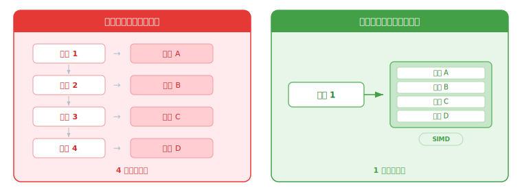
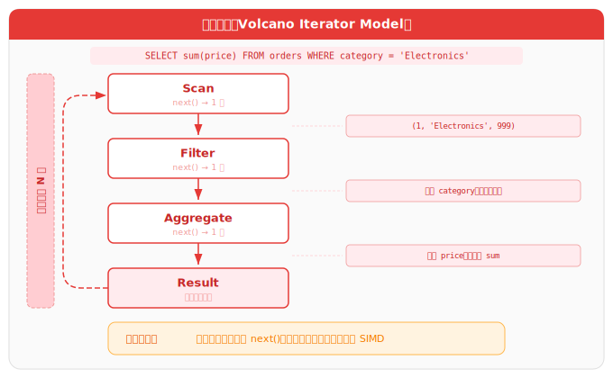
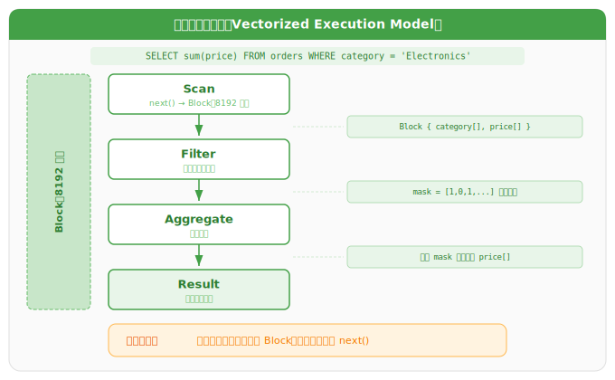
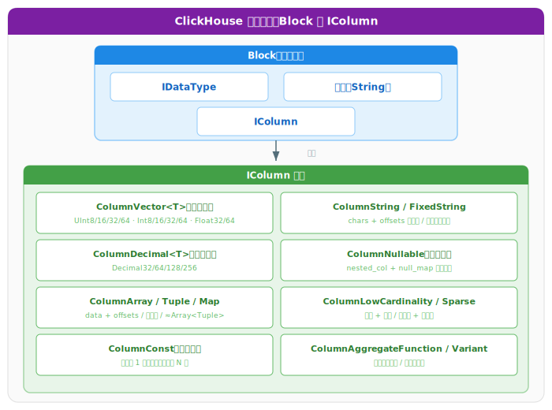
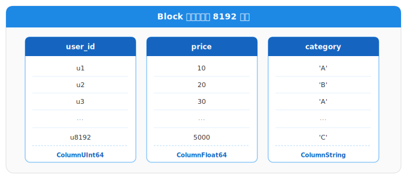
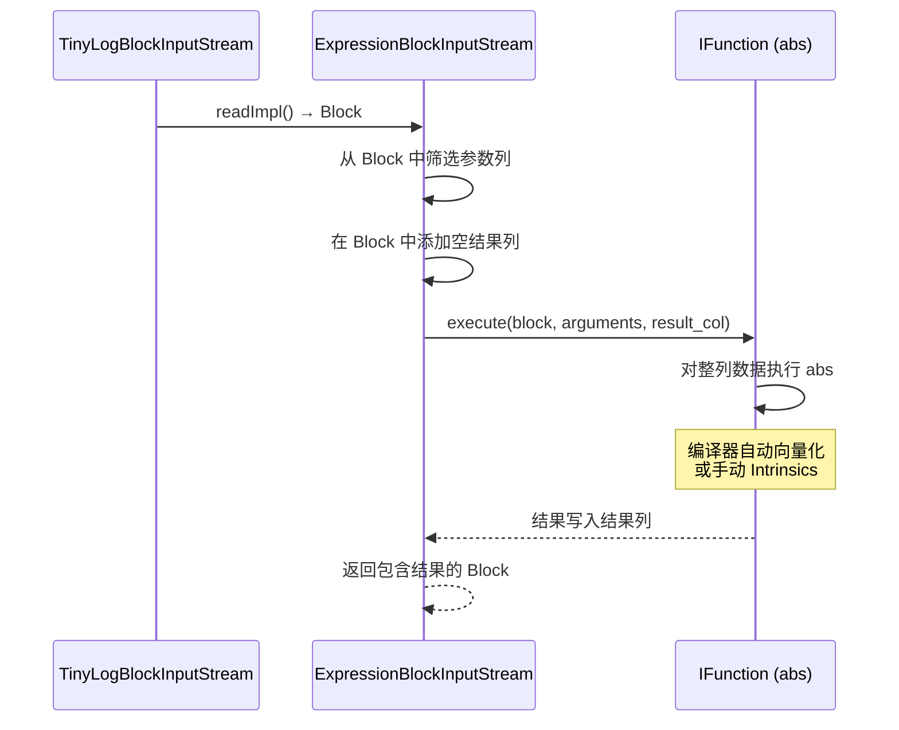
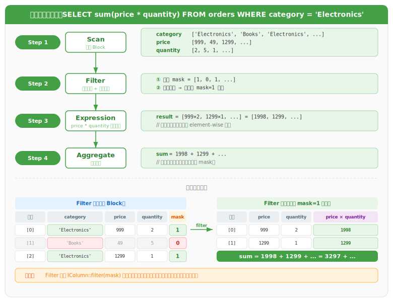
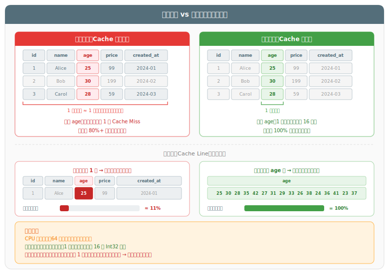

# 向量化执行技术详解

## 一、概述

### 1.1 什么是向量化执行？

向量化执行（Vectorized Execution）是一种将数据组织为向量（数组）形式，通过单指令多数据（SIMD）指令集实现并行计算的技术。其核心思想在于：将传统逐元素操作（循环迭代）转化为对向量数据的批量处理，从而最大化硬件并行计算能力。



### 1.2 向量化执行 vs 列式存储

向量化执行与列式存储是两个不同层面的概念，常被混淆：

| 概念 | 层面 | 含义 |
|------|------|------|
| **列式存储** | 存储层 | 数据按列而非按行存储在磁盘上 |
| **向量化执行** | 计算层 | 数据以批量（向量）方式在内存中处理 |

列式存储是向量化的数据基石——同列数据类型一致、连续存储，天然适合 SIMD 批量加载和计算。但列式存储 ≠ 必然向量化，向量化也不依赖列式存储（只是行式存储下很难实现）。

### 1.3 历史渊源

向量化思想并非新生事物，其历史可追溯至：

| 时间 | 里程碑 |
|------|--------|
| **1957 年** | APL 语言提出数组编程理念 |
| **1990 年** | J 语言继承 APL 思想 |
| **2000s** | VectorWise 系统将向量化引入关系型数据库 |
| **2010s** | ClickHouse、Doris 等 OLAP 系统深度集成向量化执行 |

---

## 二、SIMD：向量化的硬件基础

### 2.1 SIMD 原理

SIMD（Single Instruction, Multiple Data，单指令多数据）是向量化执行的底层硬件支撑。其核心思想是：**一条 CPU 指令同时操作多个数据元素**。

以 32 位整数加法为例：

```
标量执行（4 次加法，4 条指令）：
  ADD R1, R5    →  a[0] + b[0]
  ADD R2, R6    →  a[1] + b[1]
  ADD R3, R7    →  a[2] + b[2]
  ADD R4, R8    →  a[3] + b[3]

SIMD 执行（1 次加法，1 条指令）：
  VPADDD ZMM0, ZMM1, ZMM2    →  a[0..15] + b[0..15]（AVX-512，16 个 Int32 同时计算）
```

### 2.2 SIMD 指令集演进

| 指令集 | 发布年份 | 寄存器宽度 | 寄存器数量 | 典型吞吐 |
|--------|----------|------------|------------|----------|
| **MMX** | 1996 | 64 位 | 8 | 2 个 Int32 |
| **SSE** | 1999 | 128 位 | 8/16 | 4 个 Int32 / 4 个 Float32 |
| **SSE2** | 2001 | 128 位 | 16 | 4 个 Int32 / 2 个 Float64 |
| **AVX** | 2011 | 256 位 | 16 | 8 个 Int32 / 8 个 Float32 |
| **AVX2** | 2013 | 256 位 | 16 | 8 个 Int32 + 整数向量运算 |
| **AVX-512** | 2013+ | 512 位 | 32 | 16 个 Int32 / 16 个 Float32 |
| **ARM NEON** | 2005 | 128 位 | 32 | 4 个 Int32 |
| **ARM SVE2** | 2019 | 128~2048 位 | 32 | 可变长度 |

### 2.3 AVX-512 关键特性

AVX-512 在前代指令集基础上引入了多项重要能力：

| 特性 | 说明 | 作用 |
|------|------|------|
| **掩码（Masking）** | 几乎所有操作支持谓词变体，仅对掩码指定的通道执行 | 避免无效计算，处理非对齐数据 |
| **置换（Permute）** | 根据索引向量在输入向量中复制元素 | 无需写回内存即可重排数据 |
| **选择性加载（Selective Load）** | 使用掩码从内存加载指定元素 | 减少不必要的内存读取 |
| **选择性存储（Selective Store）** | 使用掩码将指定元素写回内存 | 减少不必要的内存写入 |
| **压缩（Compress）** | 根据掩码将选中元素紧凑排列 | 高效实现过滤操作 |

### 2.4 SIMD 编程方式

| 方式 | 原理 | 优势 | 劣势 |
|------|------|------|------|
| **自动向量化** | 编译器识别可向量化的循环并自动转换 | 零开发成本 | 仅适用于简单循环，编译器保守 |
| **编译器提示** | 通过 `restrict` 关键字、`#pragma omp simd` 等辅助编译器 | 低成本，效果较好 | 需开发者保证正确性 |
| **显式向量化** | 使用 CPU Intrinsics 手动编写 SIMD 代码 | 性能最优，完全控制 | 不可移植，代码复杂 |
| **混合方式** | 编译器提示 + 关键路径手动优化 | 兼顾开发效率与性能 | 需要经验判断优化点 |

---

## 三、数据库执行模型演进

> **算子（Operator）** 是数据库查询执行引擎中的基本处理单元。一条 SQL 语句经过解析和优化后，被编译为一个由多个算子组成的执行计划（Query Plan），每个算子负责一种特定的数据处理操作。常见算子包括：
>
> | 算子 | 英文 | 对应 SQL 语义 |
> |------|------|--------------|
> | 扫描 | Scan | FROM（读取表数据） |
> | 过滤 | Filter | WHERE（行级筛选） |
> | 投影 | Project | SELECT（列裁剪/表达式计算） |
> | 聚合 | Aggregate | GROUP BY / SUM / COUNT 等 |
> | 排序 | Sort | ORDER BY |
> | 连接 | Join | JOIN |
> | 限制 | Limit | LIMIT |
>
> 算子之间通过数据管道串联，上游算子的输出作为下游算子的输入，形成流水线式的执行链路。执行模型的差异（火山模型 vs 向量化模型）本质上就是算子之间数据传递方式的不同。

### 3.1 火山模型（Volcano Iterator Model）

传统数据库采用火山模型（又称迭代模型），查询计划由多个算子组成，每个算子实现 `next()` 接口，每次调用返回一行数据。



**火山模型的性能瓶颈**：

| 问题 | 原因 | 影响 |
|------|------|------|
| **虚函数调用开销** | 每次 `next()` 是虚函数派发，需查虚函数表 | CPU 分支预测失败率高 |
| **指令流水线中断** | 每步数据量太小，控制逻辑远多于实际计算 | CPU 流水线无法充分利用 |
| **无法利用 SIMD** | 逐行处理，数据不连续 | 硬件并行能力浪费 |
| **缓存利用率低** | 行式访问不同列数据，随机访问 | Cache Miss 频繁 |

### 3.2 向量化执行模型（Vectorized Execution Model）

向量化执行将 `next()` 接口从返回一行改为返回一个**数据块（Block/Chunk）**，数据以列式组织。



### 3.3 两种模型对比

| 维度 | 火山模型 | 向量化执行 |
|------|----------|------------|
| **处理单位** | 单行 | 数据块（数千行） |
| **函数调用** | 每行一次虚函数调用 | 每列一次批量调用 |
| **CPU 分支** | 频繁 if 判断 | 紧凑循环，极少分支 |
| **缓存命中** | 低（随机访问） | 高（顺序访问连续内存） |
| **SIMD 利用** | 几乎不可用 | 可大量使用 |
| **中间结果** | 无额外开销 | 需写回临时向量 |

---

## 四、ClickHouse 向量化执行实现

### 4.1 核心抽象

ClickHouse 的向量化执行建立在以下核心抽象之上：



#### IColumn

`IColumn` 是内存中列数据的表示接口（严格说是列的分块），提供了关系运算的辅助方法：

| 方法 | 用途 | 对应 SQL |
|------|------|----------|
| `IColumn::filter` | 接受字节掩码过滤列 | `WHERE` / `HAVING` |
| `IColumn::permute` | 按指定排序重排列 | `ORDER BY` |
| `IColumn::cut` | 截取列的前 N 个元素 | `LIMIT` |

**内存布局**：

| 列类型 | 内存布局 | 特点 |
|--------|----------|------|
| **数值列**（ColumnVector\<T\>） | 连续数组，类似 `std::vector` | 内存连续，SIMD 友好；支持 UInt8/16/32/64、Int8/16/32/64、Float32/64 |
| **定点数列**（ColumnDecimal\<T\>） | 连续数组 | 支持 Decimal32/64/128/256，高精度数值 |
| **字符串列**（ColumnString） | 字符数据向量 + 偏移量向量 | 两个连续数组，变长字符串 |
| **定长字符串列**（ColumnFixedString） | 扁平字节数组，每行等长 | 固定长度，无偏移量开销 |
| **可空列**（ColumnNullable） | nested_col + null_map 双列结构 | null_map 为字节掩码，标识空值位置 |
| **数组列**（ColumnArray） | 元素向量 + 偏移量向量 | 嵌套数据连续存储 |
| **元组列**（ColumnTuple） | 多个子列并排 | 每个子列独立为 IColumn |
| **Map 列**（ColumnMap） | 近似 Array\<Tuple\> 结构 | 键值对以数组嵌套元组表示 |
| **低基数列**（ColumnLowCardinality） | 字典 + 索引向量 | 去重字典 + 位置索引，节省内存 |
| **稀疏列**（ColumnSparse） | 默认值 + 异常值 | 多数为默认值时仅存储少数异常值 |
| **常量列**（ColumnConst） | 仅存储一个值 | 对外表现为完整列，避免重复存储 |
| **聚合函数列**（ColumnAggregateFunction） | 聚合中间状态 | 存储 GROUP BY 的部分聚合结果 |
| **变体列**（ColumnVariant） | 多态变体 | 同一列存储不同类型值 |

#### Field

`Field` 用于表示单个值，是 `UInt64`、`Int64`、`Float64`、`String`、`Array` 的可判别联合类型。

> **Field 与 IColumn 的关系**：IColumn 的各实现类有各自优化的内部布局（连续数组、chars+offsets 等），Field 并不参与其中——它是一个独立的通用值包装器。通过 `IColumn::operator[]` 获取第 n 个值时，会从 IColumn 内部布局**拷贝**出一个值包装成 Field，Field 不持有对 IColumn 内部数据的引用。因此，Field 与 IColumn 之间没有结构绑定，仅作为逐值访问时的统一类型接口。
>
> 正因如此，向量化执行应尽量避免使用 `Field`（每次构造 Field 都有拷贝开销，且丢失批量处理优势），转而使用 `insertFrom`、`insertRangeFrom` 等批量方法。

#### Block

`Block` 是查询执行流水线中流动的数据单元，由多个 `IColumn` 及其对应的 `IDataType` 和列名组成。ClickHouse 的最小执行单元不是行，而是 Block，默认包含 `max_block_size`（通常 8192）行数据。



### 4.2 抽象泄漏（Leaky Abstractions）

ClickHouse 的一个关键设计哲学是**抽象泄漏**：虽然 `IColumn` 提供了通用接口，但性能关键路径鼓励绕过通用接口，直接将 `IColumn` 强制转换为具体实现（如 `ColumnUInt64`），通过 `getData()` 方法获取内部数组的引用，直接操作连续内存。

```cpp
// 通用方式（低效）
Field val = column[i];  // 每次构造临时 Field 对象

// 抽象泄漏方式（高效）
auto & data = static_cast<const ColumnUInt64 &>(column).getData();
// 直接操作连续数组，编译器可自动向量化
for (size_t i = 0; i < data.size(); ++i) {
    result[i] = data[i] * factor;
}
```

这种设计牺牲了封装性，换取了极致性能——使得专门化例程可以充分利用内存布局和 SIMD 指令。

### 4.3 向量化函数执行流程

以 `SELECT a, abs(b) FROM test` 为例，ClickHouse 的执行流程如下：



**关键步骤**：

1. 从底层存储流读取一个 Block
2. 筛选出函数参数对应的列
3. 在 Block 中添加一个空的结果列
4. 调用函数对整列数据执行计算
5. 结果写入结果列，Block 向上传递

### 4.4 向量化算子实现

ClickHouse 几乎在所有核心算子中应用了向量化执行：

| 算子 | 向量化实现方式 | 说明 |
|------|----------------|------|
| **WHERE 过滤** | 对整列生成字节掩码（Byte Mask） | `IColumn::filter(mask)` |
| **表达式计算** | 对列数组批量执行逐元素运算（element-wise） | 编译器自动向量化 + 手动 Intrinsics |
| **GROUP BY** | 向量化哈希聚合 | 批量插入哈希表 |
| **聚合函数** | 批量累加 | `vec_sum`、`vec_avg` 等 |
| **ORDER BY** | 部分阶段向量化 | `IColumn::permute` |
| **JOIN** | Build/Probe 阶段向量化 | 批量构建/探测哈希表 |

### 4.5 向量化执行示例

以 `SELECT sum(price * quantity) FROM orders WHERE category = 'Electronics'` 为例：



---

## 五、向量化执行 vs 运行时代码生成

### 5.1 两种加速方式

数据库查询加速有两种核心方法：

| 方式 | 原理 | 优势 | 劣势 |
|------|------|------|------|
| **向量化执行** | 以 Block 为单位批量处理，利用 SIMD | 易利用 SIMD，实现简单 | 产生临时向量，需写回缓存再读取 |
| **运行时代码生成（JIT）** | 运行时将多个算子融合为一段机器码 | 消除虚函数调用，融合操作减少中间结果 | 难以利用 SIMD，编译开销 |

### 5.2 详细对比

| 维度 | 向量化执行 | 运行时代码生成 |
|------|------------|----------------|
| **中间结果** | 需要写回临时向量到缓存 | 算子融合，中间结果留在寄存器 |
| **SIMD 利用** | 天然友好 | 较难利用 |
| **缓存压力** | 临时数据超出 L2 缓存时性能下降 | 无中间数据，缓存友好 |
| **实现复杂度** | 相对简单 | 需要嵌入编译器（如 LLVM） |
| **编译开销** | 无 | 首次查询有 JIT 编译延迟 |
| **适用场景** | 通用 OLAP 查询 | 复杂表达式、长算子链 |

### 5.3 ClickHouse 的选择

ClickHouse **以向量化执行为主**，对运行时代码生成提供有限支持。原因如下：

1. 向量化执行更容易利用 SIMD，而 SIMD 带来的加速是确定性的
2. 实现复杂度更低，维护成本更小
3. 研究表明，两种方式结合效果最佳，但向量化是基础

---

## 六、向量化执行为何高效

### 6.1 CPU Cache 友好

**背景**：CPU 访问内存的速度远慢于执行运算（相差约 100 倍），为此 CPU 内置了多级高速缓存（L1/L2/L3 Cache）作为内存与寄存器之间的缓冲。CPU 读取数据时并非逐字节读取，而是以**缓存行（Cache Line，通常 64 字节）**为单位整块加载——即使只需 1 个 Int32（4 字节），也会将相邻的 60 字节一并载入缓存。如果后续访问的数据恰好在已加载的缓存行中，就能直接从缓存读取（Cache Hit），避免昂贵的内存访问（Cache Miss）。

**行式 vs 列式的缓存表现**：



**核心原理**：列式存储中同一列数据在内存中紧密排列，向量化执行顺序访问整列数组，每次缓存行加载都能获取 16 个有效数据（Int32 场景），缓存利用率接近 100%。而行式存储中，一行跨越多列，单个缓存行中只有少量数据是查询需要的，大部分被无关列占据，缓存利用率极低。

### 6.2 SIMD 并行加速

以 `price > 100` 过滤为例：

```
标量执行：逐个比较，N 次指令
  for (int i = 0; i < N; i++)
      if (price[i] > 100) mask[i] = 1;

AVX-512 向量化：一次比较 16 个 Int32，N/16 次指令
  for (int i = 0; i < N; i += 16)
      zmm = _mm512_loadu_ps(&price[i]);
      mask = _mm512_cmpgt_ps(zmm, threshold);
      _mm512_storeu_ps(&result[i], zmm);
```

| 指令集 | 单指令处理 Int32 数量 | 理论加速比 |
|--------|----------------------|------------|
| SSE | 4 | 4x |
| AVX2 | 8 | 8x |
| AVX-512 | 16 | 16x |

### 6.3 减少函数调用与分支

向量化执行通过两种机制显著降低 CPU 的控制开销：**减少虚函数调用**和**提高分支预测成功率**。

**虚函数调用开销**：在火山模型中，每个算子的 `next()` 方法是虚函数（通过基类指针调用子类实现）。每次虚函数调用需要：①查虚函数表（vtable）确定实际调用地址 → ②间接跳转到该地址。这个过程无法被编译器内联优化，且间接跳转会打断 CPU 的指令预取。向量化执行以列为单位批量调用，将 N 次虚函数调用降为 1 次，调用开销摊薄至接近零。

**分支预测与流水线**：现代 CPU 采用深度流水线（如 14~19 级），会提前预测分支走向并投机执行。如果预测正确，指令顺畅执行；如果预测失败（Branch Misprediction），CPU 必须丢弃已执行的投机结果并重新取指，代价约 15~20 个时钟周期。行式执行中每行数据都可能走不同分支（如 `WHERE price > 100`，不同行结果不同），预测失败率极高；向量化执行将条件判断转化为对整列的批量比较（生成掩码），循环体内部无分支，预测成功率接近 100%。

```
行式执行（分支频繁，预测失败率高）：
  for each row:          // 每行一次虚函数调用
      if price[i] > 100  // 每行一个 if 分支，CPU 难以预测
          ...            // 预测失败 → 流水线冲刷 → 15~20 周期惩罚

向量化执行（无分支，预测成功率高）：
  for each column batch: // 每列一次虚函数调用
      mask = price > 100 // 批量比较，生成掩码，无 if 分支
      ...                // 紧凑循环，CPU 流水线持续充满
```

| 维度 | 行式执行 | 向量化执行 |
|------|----------|------------|
| **虚函数调用** | 每行一次（N 次间接跳转） | 每列一次（1 次，开销摊薄至零） |
| **分支预测** | 每行 if 判断，预测失败率高 | 紧凑循环无分支，预测成功率≈100% |
| **流水线效率** | 频繁中断（预测失败冲刷流水线） | 持续充满（无分支，无冲刷） |

### 6.4 循环展开与指令调度

向量化执行的紧凑循环结构（对连续内存的简单重复操作）为编译器优化提供了理想条件，使其能够进行以下三种关键优化：

**循环展开（Loop Unrolling）**：循环每次迭代都需要执行"递增计数器 → 判断是否越界 → 条件跳转"等控制指令，这些指令本身不做有用计算。循环展开将多次迭代合并为一次，减少控制指令的比例。例如将 `for (i=0; i<N; i++) result[i] = a[i] + b[i]` 展开为 `result[i] = a[i]+b[i]; result[i+1] = a[i+1]+b[i+1]; ...`，4 次迭代只需 1 次循环判断而非 4 次。向量化循环体简单且无数据依赖，编译器可以激进展开。

**指令重排（Instruction Scheduling）**：CPU 并非逐条执行指令，而是尽可能同时发射多条独立指令到不同执行单元。向量化循环中，不同迭代的数据操作相互独立，编译器可以将后续迭代的内存加载指令提前到当前迭代之前发出，使 CPU 在等待当前数据从缓存返回的同时，已经开始加载下一批数据，从而隐藏内存访问延迟。此处"隐藏"而非"消除"：数据从内存到寄存器的物理延迟（约 4~300 个周期，取决于命中哪级缓存）是硬件固定的，指令重排无法缩短这一延迟——它做的是在等待期间插入其他独立的有用指令，使 CPU 不必空等，从程序总执行时间看延迟被覆盖而非消失。

**软件预取（Software Prefetch）**：编译器可以在循环中插入预取指令（如 x86 的 `_mm_prefetch`），提前通知 CPU "即将访问某个地址的数据"，让 CPU 在数据实际被使用之前就将其从内存加载到缓存。向量化循环的访问模式是可预测的顺序访问（每次递增固定偏移量），编译器可以精确计算未来需要的数据地址并提前预取。

```
原始循环（控制开销高，存在访存停顿）：
  for (i=0; i<N; i++) {
      result[i] = a[i] + b[i];          // 每次迭代：递增i → 判断 → 加载 → 计算 → 写回
  }                                     // 循环控制指令占比高，加载a[i]时CPU等待

编译器优化后（展开 + 重排 + 预取）：
  for (i=0; i<N; i+=4) {
      prefetch(a[i+8]);                 // 软件预取：提前通知CPU加载未来数据
      prefetch(b[i+8]);
      r0 = a[i] + b[i];                 // 展开4次：4次计算共享1次循环判断
      r1 = a[i+1] + b[i+1];             // 指令重排：加载和计算交替进行
      r2 = a[i+2] + b[i+2];             // CPU在计算r0的同时已在加载r2的数据
      r3 = a[i+3] + b[i+3];
      result[i..i+3] = {r0,r1,r2,r3};
  }
```

| 优化 | 原理 | 向量化为何有利 |
|------|------|----------------|
| **循环展开** | 合并多次迭代，减少循环控制指令 | 循环体简单无依赖，可激进展开 |
| **指令重排** | 将独立指令交错排列，隐藏访存延迟 | 不同迭代数据独立，可自由重排 |
| **软件预取** | 提前发出加载指令，数据到时已在缓存 | 顺序访问模式可预测，预取命中率高 |

---

## 七、向量化执行的局限性

### 7.1 性能退化场景

| 场景 | 原因 | 影响 |
|------|------|------|
| **复杂 UDF / Lambda** | 逐行逻辑无法批量处理 | 退化为标量执行 |
| **复杂条件分支** | 每行逻辑不同，掩码开销大 | SIMD 优势减弱 |
| **极小数据量** | 批量处理的优势无法体现 | 向量化开销 > 收益 |
| **大量 LIKE / 正则** | 字符串操作难以向量化 | CPU 成本上升 |
| **临时向量超出 L2 缓存** | 中间结果需写回内存再读取 | 缓存成为瓶颈 |

> **UDF（User-Defined Function，用户自定义函数）** 是用户编写的自定义计算逻辑，用于实现数据库内置函数无法覆盖的业务需求。与内置函数不同，UDF 的实现由用户控制，数据库引擎无法预知其内部逻辑，因此无法对 UDF 进行编译器自动向量化或手动 Intrinsics 优化。当查询中调用 UDF 时，数据库只能逐行传入参数、逐行获取结果，向量化执行的批量处理优势完全丧失。
>
> **Lambda 表达式** 是 SQL 中内联定义的匿名函数（如 ClickHouse 的 `x -> x * 2`），本质上是轻量级的 UDF。虽然语法上比独立 UDF 更简洁，但执行层面同样面临逐行调用的问题——数据库引擎无法将 Lambda 函数体融入向量化循环，只能在每行数据上单独求值，因此同样会退化为标量执行。

### 7.2 向量化失效的 SQL 模式

```sql
-- ❌ 复杂 UDF：无法向量化
SELECT custom_complex_udf(col1) FROM t;

-- ❌ 逐行条件分支：掩码开销大
SELECT CASE
    WHEN a > 100 AND b < 50 AND c LIKE '%test%' THEN ...
    WHEN a > 200 AND d IN (1,2,3) THEN ...
    ELSE ...
END FROM t;

-- ❌ 极小数据量：向量化开销大于收益
SELECT * FROM t LIMIT 10;
```

### 7.3 向量化友好的 SQL 模式

```sql
-- ✅ 等值 / IN / 范围过滤
SELECT count(*) FROM orders
WHERE category = 'Electronics'
  AND price BETWEEN 100 AND 500;

-- ✅ 聚合计算
SELECT category, sum(price), avg(quantity)
FROM orders
GROUP BY category;

-- ✅ 简单表达式
SELECT price * quantity AS total FROM orders;
```

---

## 八、ClickHouse 向量化最佳实践

### 8.1 充分利用向量化的查询原则

| 原则 | 说明 |
|------|------|
| **优先全表扫描** | ClickHouse 的性能策略是依赖向量化执行快速扫描大量数据，而非依赖索引跳过数据，因此无需刻意通过索引缩小扫描范围 |
| **减少查询列数** | 只 SELECT 需要的列，减少 I/O 和计算量 |
| **使用简单过滤条件** | 等值、IN、范围过滤最利于向量化 |
| **避免复杂 UDF** | 用内置函数替代自定义逻辑 |
| **合理设置 Block 大小** | `max_block_size` 默认 8192，大数据量场景可适当增大 |

### 8.2 关键配置参数

以下参数均为 ClickHouse 的**数据库级设置**（Settings），可在服务器配置（`config.xml`）、会话级别（`SET param = value`）或查询级别（`SETTINGS param = value`）指定，而非表定义时的引擎参数。

| 参数 | 默认值 | 说明 |
|------|--------|------|
| `max_block_size` | 8192 | 单个 Block 的最大行数，影响向量化批处理粒度。值越大，单次批量处理的数据越多，SIMD 利用率越高，但内存占用也越大 |
| `min_insert_block_size_rows` | 1048576 | INSERT 时 Block 的最小行数阈值。当插入的 Block 行数低于此值时，ClickHouse 会将多个小 Block 合并为更大的 Block 再写入存储，以减少碎片和提升后续查询的向量化效率 |
| `use_compact_format_in_distributed_parts_names` | 1 | 控制分布式表写入时数据分片目录的命名格式，紧凑格式可减少目录数量 |

### 8.3 性能验证方法

```sql
-- 查看查询执行计划
EXPLAIN PIPELINE SELECT sum(price) FROM orders WHERE category = 'Electronics';

-- 查看查询性能指标
SELECT
    query,
    read_rows,
    result_rows,
    memory_usage,
    query_duration_ms
FROM system.query_log
WHERE type = 'QueryFinish'
ORDER BY event_date DESC
LIMIT 10;
```

---

## 九、总结

### 9.1 核心要点

1. **向量化执行的本质**：从"一次一行"到"一次一批"，将列数据作为数组批量处理
2. **硬件基础**：SIMD 指令集（SSE/AVX/AVX-512）允许单条指令同时处理多个数据
3. **数据基础**：列式存储提供连续内存布局，天然适配 SIMD 加载
4. **ClickHouse 实现**：基于 IColumn/Block 抽象，通过抽象泄漏直接操作连续数组
5. **性能来源**：减少虚函数调用、提高缓存命中率、利用 SIMD 并行、优化分支预测

### 9.2 一句话总结

> ClickHouse 的向量化执行：以 Block 为单位，把列当数组，用 SIMD 和顺序内存访问对整批数据做计算，从而极大降低 CPU 指令数和 Cache Miss。

---

## 参考

- [ClickHouse Architecture Overview](https://clickhouse.com/docs/en/development/architecture)
- [CMU 15-721 Lecture #06: Vectorized Query Execution](https://15721.courses.cs.cmu.edu/spring2024/notes/06-vectorization.pdf)
- [ClickHouse 源码笔记：函数调用的向量化实现](https://cloud.tencent.com/developer/article/1790111)
- [OceanBase：什么是向量化](https://open.oceanbase.com/blog/22701646097)
