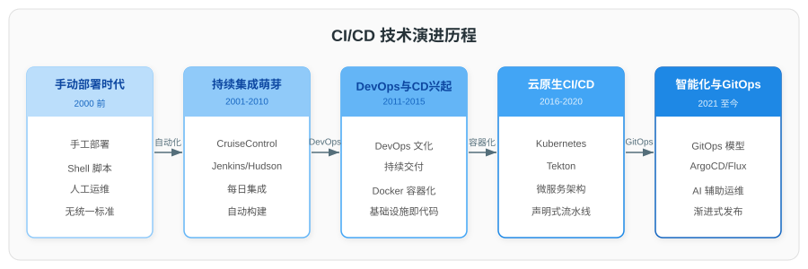
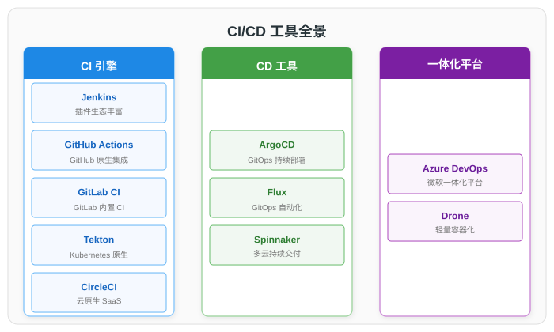
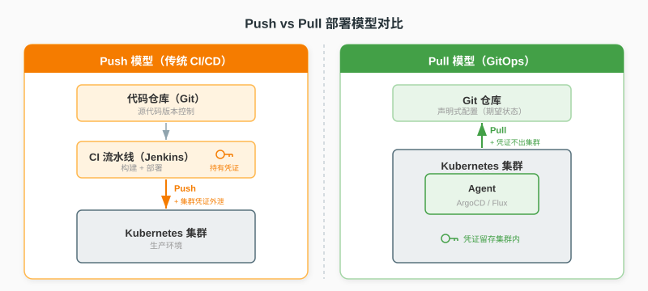
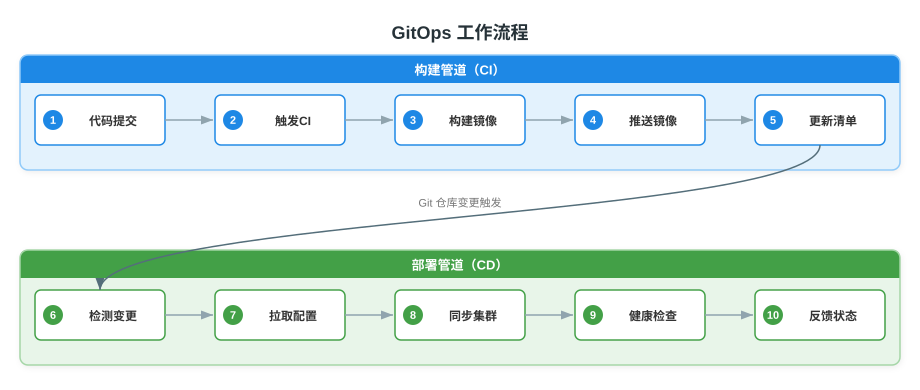
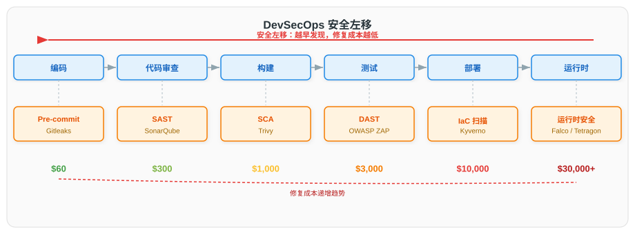
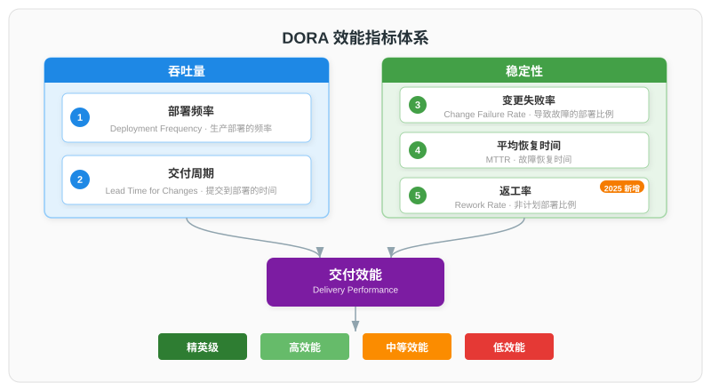

# CI/CD 持续集成与持续交付详解

> 本文系统梳理现代 CI/CD 技术体系，涵盖核心概念、演进历程、主流工具对比、GitOps 部署范式、DevSecOps 安全实践、DORA 效能度量及未来趋势。文档分为七个部分：一、概述；二、技术演进历程；三、主流工具对比；四、GitOps 部署范式；五、DevSecOps 安全实践；六、DORA 效能度量；七、未来展望。

---

## 一、概述

### 1.1 CI/CD 的定义

CI/CD 是持续集成（Continuous Integration）、持续交付（Continuous Delivery）和持续部署（Continuous Deployment）的统称，是现代软件工程中实现自动化交付的核心实践。三者构成逐层递进的交付链路：

| 实践 | 全称 | 核心目标 | 触发方式 | 关键环节 |
|------|------|----------|----------|----------|
| CI | Continuous Integration | 快速发现集成问题 | 代码提交/合并请求 | 编译、单元测试、静态扫描 |
| 持续交付 | Continuous Delivery | 保证随时可发布 | CI 通过后触发 | 构建产物、集成测试、部署到预发布 |
| 持续部署 | Continuous Deployment | 自动发布到生产 | 持续交付通过后自动触发 | 生产部署、健康检查、回滚机制 |

> **持续交付与持续部署的区别**：持续交付确保软件处于"随时可发布"状态，但生产部署需人工审批；持续部署则将通过所有验证的变更自动部署到生产环境，无需人工干预。选择哪种模式取决于业务对发布频率和风险控制的要求。

### 1.2 核心价值

CI/CD 通过自动化软件交付流程，为团队带来以下核心价值：

| 维度 | 传统手动流程 | CI/CD 自动化流程 |
|------|-------------|------------------|
| 交付周期 | 周/月级 | 分钟/小时级 |
| 人为错误 | 高（手动操作多） | 低（自动化执行） |
| 反馈速度 | 慢（问题滞后发现） | 快（提交即验证） |
| 环境一致性 | 差（开发/测试/生产漂移） | 好（不可变制品） |
| 回滚能力 | 复杂且不可靠 | 一键回滚（Git revert） |
| 可审计性 | 弱（操作记录分散） | 强（全流程留痕） |

根据 Google DORA 团队的研究，实施成熟 CI/CD 实践的团队在部署频率、交付周期、变更失败率和恢复时间上显著优于传统团队。

### 1.3 核心概念

| 概念 | 说明 |
|------|------|
| 流水线（Pipeline） | 由多个阶段（Stage）串联组成的自动化流程，定义从代码提交到部署的完整路径 |
| 制品（Artifact） | 构建过程的输出物，如 JAR 包、Docker 镜像、二进制文件 |
| 不可变制品（Immutable Artifact） | 同一制品在开发、测试、生产环境中保持不变，环境差异通过配置注入 |
| 基础设施即代码（IaC） | 使用代码声明式定义基础设施，如 Terraform、Ansible |
| 质量门禁（Quality Gate） | 流水线中的检查点，未通过则阻断后续流程 |
| 蓝绿部署（Blue-Green） | 维护两套环境，切换流量实现零停机部署 |
| 金丝雀发布（Canary） | 小比例流量验证新版本，逐步扩大范围 |

---

## 二、技术演进历程

### 2.1 演进概述

CI/CD 技术经历了从手动部署到智能化的五个发展阶段，每个阶段都以前一阶段的瓶颈为驱动，在自动化程度、交付速度和可靠性上实现代际提升。



### 2.2 手动部署时代（2000 年以前）

早期软件开发采用瀑布模型，开发与运维完全分离。发布过程依赖手动操作：

- 开发人员将代码打包后通过 FTP 上传到服务器
- 运维人员手动执行 SQL 脚本、修改配置文件
- 缺乏版本控制和回滚机制

**主要问题**：部署错误率高、环境不一致、回滚困难、交付周期长。

### 2.3 持续集成萌芽（2001—2010）

2001 年，Martin Fowler 和 Matthew Foemmel 发表《Continuous Integration》一文，确立了 CI 的核心实践。同期，Jenkins 的前身 Hudson（2004 年）诞生，标志着 CI 工具的兴起。

**核心技术特征**：自动化构建和测试，每日多次集成。

| 里程碑 | 时间 | 意义 |
|--------|------|------|
| Martin Fowler 发表 CI 文章 | 2001 | 确立 CI 理论基础 |
| Hudson（Jenkins 前身）发布 | 2004 | 首个主流 CI 服务器 |
| CruiseControl 开源 | 2001 | 早期 CI 框架 |
| Jez Humble 出版《持续交付》 | 2010 | 系统阐述 CD 理论 |

### 2.4 DevOps 与 CD 兴起（2011—2015）

2011 年，Patrick Debois 发起第一个 DevOpsDays 会议，DevOps 运动正式兴起。CI 与 CD 的边界逐渐清晰，工具链从单一 CI 服务器向全流程交付平台演进。

**核心技术特征**：基础设施即代码（IaC）、配置管理、部署自动化。

| 工具 | 类型 | 说明 |
|------|------|------|
| Jenkins | CI/CD 服务器 | 插件生态丰富，成为事实标准 |
| Chef / Puppet | 配置管理 | 自动化服务器配置 |
| Docker | 容器化 | 解决环境一致性问题（2013 年） |
| Ansible | 配置管理 | 声明式、无代理架构 |
| Terraform | IaC | 声明式基础设施管理 |

### 2.5 云原生 CI/CD（2016—2020）

随着 Kubernetes 成为容器编排标准，CI/CD 向云原生架构演进。流水线以容器为执行单元，动态创建、用完即销。

**核心技术特征**：容器化构建、Kubernetes 原生、微服务友好。

| 工具 | 类型 | 说明 |
|------|------|------|
| GitLab CI | CI/CD 平台 | 与 GitLab 代码托管深度集成 |
| GitHub Actions | CI/CD 平台 | 与 GitHub 原生集成，2018 年推出 |
| Tekton | CI/CD 框架 | Kubernetes 原生，CRD 定义流水线 |
| ArgoCD | CD 工具 | GitOps 范式的代表性实现 |
| Spinnaker | CD 平台 | 多云部署、渐进式交付 |

### 2.6 智能化与 GitOps（2021 至今）

CI/CD 进入智能化时代，GitOps 成为云原生部署的事实标准，AI 技术开始融入交付流程。

**核心技术特征**：GitOps 声明式部署、DevSecOps 安全内建、AI 辅助优化。

| 趋势 | 说明 |
|------|------|
| GitOps 标准化 | Git 作为唯一可信源，拉取式部署 |
| DevSecOps | 安全左移，安全检查内建到流水线 |
| 渐进式交付 | 金丝雀发布、蓝绿部署自动化 |
| AI 辅助 | 智能测试选择、风险预测、自动回滚 |
| 平台工程 | 内部开发者平台，自助式 CI/CD |

---

## 三、主流工具对比

### 3.1 工具全景



现代 CI/CD 工具按功能定位可分为 CI 引擎、CD 工具和一体化平台三类：

| 类别 | 工具 | 定位 | 核心特点 |
|------|------|------|----------|
| CI 引擎 | Jenkins | 自托管 CI 服务器 | 插件生态庞大（1800+），高度可定制 |
| CI 引擎 | GitHub Actions | SaaS CI 平台 | GitHub 原生集成，Marketplace 生态 |
| CI 引擎 | GitLab CI | SaaS + 自托管 | GitLab 一体化 DevOps 平台 |
| CI 引擎 | Tekton | Kubernetes 原生 | CRD 定义流水线，无服务器架构 |
| CI 引擎 | CircleCI | SaaS | 构建速度快，Docker 支持好 |
| CD 工具 | ArgoCD | GitOps 控制器 | 声明式部署，Kubernetes 深度集成 |
| CD 工具 | Flux | GitOps 工具包 | 模块化设计，与 ArgoCD 互补 |
| CD 工具 | Spinnaker | 多云 CD 平台 | 支持多云多环境渐进式交付 |
| 一体化 | Azure DevOps | SaaS | Microsoft 生态，企业级 |
| 一体化 | Drone | 自托管 | 轻量级，容器原生 |

### 3.2 三大主流 CI 工具深度对比

Jenkins、GitLab CI 和 GitHub Actions 是当前企业最广泛使用的三种 CI/CD 方案，以下从多个维度进行系统对比：

| 对比维度 | Jenkins | GitLab CI | GitHub Actions |
|----------|---------|-----------|----------------|
| **架构** | 中心服务器 + Agent | SaaS 或自托管 Runner | SaaS + 可选自托管 Runner |
| **配置方式** | Jenkinsfile（Groovy DSL） | `.gitlab-ci.yml`（YAML） | `.github/workflows/*.yml`（YAML） |
| **代码托管集成** | 需插件对接各平台 | GitLab 原生集成 | GitHub 原生集成 |
| **插件生态** | 1800+ 插件 | 内建 + 少量扩展 | Marketplace 12000+ Actions |
| **容器原生** | 需插件支持 | 内建支持 | 内建支持 |
| **Kubernetes 集成** | 通过插件 | 原生支持 | 原生支持 |
| **安全扫描** | 需逐个插件 | 内建 SAST/DAST/依赖扫描 | Marketplace Actions |
| **容器镜像仓库** | 需插件 | 内建 | 内建 GHCR |
| **维护成本** | 高（需专职运维） | 中 | 低（SaaS 免运维） |
| **学习曲线** | 陡（Groovy DSL） | 平缓（YAML） | 平缓（YAML） |
| **企业可控性** | 高（完全自托管） | 中高（可选自托管） | 中（企业版支持有限自托管） |
| **适用规模** | 大型企业/复杂场景 | 中大型企业 | 中小团队/开源项目 |

> **配置方式对比**：Jenkins 使用 Groovy 编写 Jenkinsfile，表达力强但学习曲线陡峭；GitLab CI 和 GitHub Actions 均采用 YAML 配置，更易上手。以下是三种工具的流水线定义示例：
>
> **Jenkinsfile（Groovy DSL）**：
> ```groovy
> pipeline {
>     agent any
>     stages {
>         stage('Build') {
>             steps {
>                 sh 'mvn clean package'
>             }
>         }
>         stage('Test') {
>             steps {
>                 sh 'mvn test'
>             }
>         }
>         stage('Deploy') {
>             steps {
>                 sh './deploy.sh'
>             }
>         }
>     }
> }
> ```
>
> **GitLab CI（YAML）**：
> ```yaml
> stages:
>   - build
>   - test
>   - deploy
> 
> build:
>   stage: build
>   script:
>     - mvn clean package
> 
> test:
>   stage: test
>   script:
>     - mvn test
> 
> deploy:
>   stage: deploy
>   script:
>     - ./deploy.sh
>   only:
>     - main
> ```
>
> **GitHub Actions（YAML）**：
> ```yaml
> name: CI/CD Pipeline
> on:
>   push:
>     branches: [main]
> 
> jobs:
>   build:
>     runs-on: ubuntu-latest
>     steps:
>       - uses: actions/checkout@v4
>       - name: Build
>         run: mvn clean package
>       - name: Test
>         run: mvn test
>       - name: Deploy
>         run: ./deploy.sh
> ```

### 3.3 CD 工具对比：ArgoCD vs Flux

ArgoCD 和 Flux 是 GitOps 部署范式的两大主流工具，均已成为 CNCF 项目：

| 对比维度 | ArgoCD | Flux |
|----------|--------|------|
| **架构** | 单体控制器 + UI | 模块化工具包（多控制器） |
| **UI** | 内建 Web UI | 无内建 UI（需第三方） |
| **配置方式** | Application CRD | Kustomization/HelmRelease CRD |
| **多集群管理** | 原生支持 | 需额外配置 |
| **Helm 支持** | 原生支持 | 原生支持（Helm Controller） |
| **Kustomize 支持** | 原生支持 | 原生支持（Kustomize Controller） |
| **RBAC** | 内建细粒度 RBAC | 依赖 Kubernetes RBAC |
| **市场占有率** | 约 60%（CNCF 2025 调查） | 约 11%（CNCF 2025 调查） |
| **适用场景** | 需要可视化管理、多集群 | 偏好命令行、模块化组合 |

> 根据 CNCF 2025 年度调查，ArgoCD 以约 60% 的市场份额成为 GitOps 部署的主导工具，Flux 约 11%。两者均为 CNCF 毕业项目，可根据团队偏好选择。

### 3.4 选型建议

根据团队规模和场景的选型建议：

| 场景 | 推荐方案 | 选型理由 |
|------|----------|----------|
| 初创团队/开源项目 | GitHub Actions + ArgoCD | 免运维、快速上手、GitHub 生态 |
| 中大型企业 | GitLab CI + ArgoCD | 一体化平台、内建安全扫描、自托管可控 |
| 大型复杂组织 | Jenkins + ArgoCD | 插件生态覆盖广、高度定制化 |
| 强监管行业（金融/国企） | Jenkins + 自建镜像仓库 | 完全自托管、审计合规可控 |
| 云原生原住民 | Tekton + ArgoCD | Kubernetes 原生、声明式全链路 |
| 多云混合部署 | Spinnaker + Terraform | 多云抽象层、渐进式交付 |

---

## 四、GitOps 部署范式

### 4.1 GitOps 核心原则

GitOps 由 Weaveworks CEO Alexis Richardson 于 2017 年提出，是一种以 Git 作为唯一可信源的运维框架。根据 CNCF 2025 年调查，91% 的云原生组织已采用 GitOps。



GitOps 的四项核心原则：

| 原则 | 说明 |
|------|------|
| 声明式配置 | 系统的期望状态以声明式描述（YAML/HCL），而非命令式脚本 |
| Git 作为唯一可信源 | 所有配置存储在 Git 中，版本化、可审计，禁止集群内手动修改 |
| 通过 Pull Request 变更 | 所有变更通过 PR/MR 提交，经审查合并后自动应用 |
| 持续协调 | 集群内 Agent 持续监控 Git 仓库，自动将实际状态同步至期望状态 |

### 4.2 Push vs Pull 部署模型

传统 CI/CD 采用推送（Push）模型，GitOps 采用拉取（Pull）模型，两者在安全性和可靠性上有本质区别：

| 对比维度 | Push 模型（传统 CI/CD） | Pull 模型（GitOps） |
|----------|------------------------|---------------------|
| **触发方式** | CI 流水线主动推送至集群 | 集群内 Agent 拉取 Git 变更 |
| **凭证位置** | CI 系统持有集群凭证 | 凭证留在集群内，不外泄 |
| **状态一致性** | 可能产生配置漂移 | 持续协调，自动纠偏 |
| **回滚方式** | 重新执行旧流水线 | Git revert 即可回滚 |
| **审计能力** | 流水线日志（非持久） | Git 提交历史（永久可查） |
| **灾难恢复** | 复杂（需重建配置） | 简单（新集群指向 Git 仓库即可） |
| **多集群部署** | 需管理多套凭证 | 各集群独立拉取，天然支持 |

> **Pull 模型的安全优势**：在 Push 模型中，CI 系统（如 Jenkins）需要持有 Kubernetes 集群的管理凭证，一旦 CI 系统被入侵，集群将面临直接威胁。Pull 模型中，集群凭证不离开集群，Git 仓库无需感知集群 API，显著缩小了攻击面。

### 4.3 GitOps 工作流程



GitOps 的典型工作流程分为构建和部署两个独立管道：

| 阶段 | 步骤 | 说明 |
|------|------|------|
| **构建管道（CI）** | 1. 代码提交 | 开发者推送代码到应用仓库 |
| | 2. 触发 CI | CI 引擎自动触发构建流水线 |
| | 3. 构建镜像 | 编译代码、构建 Docker 镜像 |
| | 4. 推送镜像 | 镜像推送到容器镜像仓库 |
| | 5. 更新清单 | 自动更新配置仓库中的镜像版本 |
| **部署管道（CD）** | 6. 检测变更 | ArgoCD/Flux 检测到 Git 仓库变更 |
| | 7. 拉取配置 | Agent 从 Git 拉取最新配置 |
| | 8. 同步集群 | 将期望状态应用到 Kubernetes 集群 |
| | 9. 健康检查 | 验证应用是否正常运行 |
| | 10. 反馈状态 | 同步状态写回 Git 或通知系统 |

> **构建与部署分离**：GitOps 强调将构建管道和部署管道分离。构建管道负责生成不可变制品（镜像），部署管道负责将配置同步到集群。这种分离确保了构建失败不会阻塞生产回滚，部署问题也不会影响构建流程。

### 4.4 仓库结构模式

GitOps 实践中，仓库结构主要有三种模式：

| 模式 | 结构 | 优势 | 劣势 |
|------|------|------|------|
| 单仓库（Monorepo） | 应用代码 + 配置在同一仓库 | 简单直接、变更原子性 | 权限控制粗、仓库膨胀 |
| 多仓库（Polyrepo） | 应用仓库 + 独立配置仓库 | 权限分离、职责清晰 | 跨仓库协调成本 |
| App-of-Apps | 配置仓库中嵌套应用定义 | 支持多集群、多环境 | 复杂度高 |

典型多仓库结构示例：

```
# 应用仓库（app-repo）
├── src/
├── Dockerfile
├── .github/workflows/ci.yml    # CI 流水线定义
└── pom.xml

# 配置仓库（gitops-repo）
├── base/
│   ├── deployment.yaml
│   ├── service.yaml
│   └── kustomization.yaml
├── overlays/
│   ├── dev/
│   │   ├── kustomization.yaml
│   │   └── patches.yaml
│   ├── staging/
│   │   ├── kustomization.yaml
│   │   └── patches.yaml
│   └── production/
│       ├── kustomization.yaml
│       └── patches.yaml
└── argocd/
    └── app.yaml                # ArgoCD Application 定义
```

---

## 五、DevSecOps 安全实践

### 5.1 安全左移理念

DevSecOps（Development + Security + Operations）是将安全实践深度融入软件开发生命周期（SDLC）的方法论。其核心理念是"安全左移"（Shift-Left Security）——在开发早期阶段引入安全检查，而非等到部署前才进行安全审计。



> **安全左移的经济学依据**：根据 IBM 系统科学报告，在需求阶段发现并修复安全缺陷的成本约为 60 美元，到测试阶段升至约 1000 美元，到生产阶段则高达约 10000 美元。越早发现安全问题，修复成本越低。

### 5.2 安全检查分层

DevSecOps 在 SDLC 各阶段嵌入不同的安全检查工具：

| SDLC 阶段 | 安全检查 | 工具示例 | 说明 |
|-----------|----------|----------|------|
| 编码 | Pre-commit Hook | Gitleaks、TruffleHog | 提交前检测硬编码密钥 |
| 编码 | IDE 插件 | SonarLint、Snyk Plugin | 实时代码安全提示 |
| 代码审查 | SAST | SonarQube、Semgrep、CodeQL | 静态分析代码漏洞 |
| 构建 | SCA | Snyk、Dependabot、Trivy | 依赖组件漏洞扫描 |
| 构建 | 镜像扫描 | Trivy、Grype、Clair | 容器镜像漏洞扫描 |
| 构建 | SBOM 生成 | Syft、CycloneDX | 软件物料清单 |
| 测试 | DAST | OWASP ZAP、Burp Suite | 运行时动态安全测试 |
| 部署 | IaC 扫描 | Checkov、Terrascan | 基础设施配置审计 |
| 部署 | 策略即代码 | Kyverno、OPA/Gatekeeper | 准入控制策略校验 |
| 部署 | 镜像签名 | Cosign、Notation | 制品签名与验证 |
| 运行时 | 运行时安全 | Falco、Tetragon | 运行时行为监控 |

### 5.3 安全工具详解

**SAST（静态应用安全测试）**：在不运行代码的情况下，通过分析源代码、字节码或二进制文件检测安全漏洞。适合在代码提交和代码审查阶段使用。

| 工具 | 特点 | 适用场景 |
|------|------|----------|
| SonarQube | 代码质量 + 安全一体化 | 企业级代码质量管理 |
| Semgrep | 轻量级、规则自定义 | 快速 CI 集成 |
| CodeQL | GitHub 原生、语义分析 | GitHub 项目深度分析 |

**SCA（软件成分分析）**：分析项目的第三方依赖组件，检测已知漏洞（CVE）和许可证合规问题。

| 工具 | 特点 | 适用场景 |
|------|------|----------|
| Snyk | 漏洞数据库全面 | 全栈依赖扫描 |
| Dependabot | GitHub 原生 | GitHub 项目自动修复 |
| Trivy | 容器镜像 + 文件系统 | 镜像和 IaC 扫描 |

**DAST（动态应用安全测试）**：在应用运行时模拟攻击，检测运行时安全漏洞，如 SQL 注入、XSS 等。

| 工具 | 特点 | 适用场景 |
|------|------|----------|
| OWASP ZAP | 开源、免费 | Web 应用安全测试 |
| Burp Suite | 商业、功能强大 | 专业渗透测试 |

### 5.4 供应链安全

软件供应链攻击（如 SolarWinds 事件、Log4j 漏洞）使供应链安全成为 DevSecOps 的重点领域：

| 实践 | 说明 | 相关标准/工具 |
|------|------|---------------|
| SBOM（软件物料清单） | 记录软件所有组件及其版本 | CycloneDX、SPDX |
| SLSA（软件构建级别） | 验证构建过程的完整性 | SLSA Framework |
| 制品签名 | 确保制品未被篡改 | Cosign、Sigstore |
| 依赖锁定 | 锁定依赖版本 | package-lock.json、go.sum |
| 可信镜像仓库 | 仅使用经过验证的镜像 | 私有镜像仓库 + 准入控制 |

> **SBOM（Software Bill of Materials）** 是软件组件的完整清单，记录所有依赖及其版本、来源和许可证信息。在 Log4j 漏洞（CVE-2021-44228）事件中，拥有 SBOM 的组织能够在数小时内定位受影响系统，而缺乏 SBOM 的组织则耗时数周排查。SBOM 已被美国行政令 14028 列为政府采购软件的强制要求。

---

## 六、DORA 效能度量

### 6.1 DORA 指标体系

DORA（DevOps Research and Assessment）是 Google Cloud 旗下的研究团队，通过对数万名从业者的长期研究，确立了衡量软件交付效能的四项关键指标。2025 年新增第五项指标"返工率"：



| 指标 | 全称 | 说明 | 衡量方式 |
|------|------|------|----------|
| 部署频率 | Deployment Frequency | 生产环境部署的频率 | 次/天/周/月 |
| 交付周期 | Lead Time for Changes | 从代码提交到生产部署的时间 | 小时/天/周 |
| 变更失败率 | Change Failure Rate | 导致生产故障的部署比例 | 百分比 |
| 平均恢复时间 | Mean Time to Restore | 从生产故障到恢复的时间 | 分钟/小时 |
| 返工率 | Rework Rate | 因生产事件触发的非计划部署比例 | 百分比（2025 年新增） |

### 6.2 团队效能分级

DORA 根据上述指标将团队分为四个效能等级：

| 等级 | 部署频率 | 交付周期 | 变更失败率 | 恢复时间 |
|------|----------|----------|-----------|----------|
| 精英级 | 多次/天 | <1 小时 | 0-5% | <1 小时 |
| 高效能 | 每日-每周 | 1 天-1 周 | 5-10% | <1 天 |
| 中等效能 | 每周-每月 | 1 周-1 月 | 10-15% | 1 天-1 周 |
| 低效能 | 每月-每半年 | 1-6 月 | 15-20% | >1 周 |

> 根据 2025 年 DORA 报告，约 16.2% 的团队达到了持续按需发布的精英级部署频率，另有 22.7% 的团队达到每小时部署。交付效能与组织绩效（如营收增长、市场份额、客户满意度）存在正相关。

### 6.3 指标关联分析

DORA 指标并非孤立，它们反映了交付系统的两个维度——**吞吐量**和**稳定性**：

| 维度 | 指标 | 说明 |
|------|------|------|
| 吞吐量 | 部署频率、交付周期 | 衡量交付速度 |
| 稳定性 | 变更失败率、恢复时间 | 衡量交付质量 |

> **吞吐量与稳定性的关系**：高效能团队并非在速度和稳定性之间取舍，而是同时实现两者。成熟的 CI/CD 实践（自动化测试、渐进式发布、快速回滚）使高频部署与低失败率共存成为可能。低效能团队往往陷入"慢且不稳"的困境——部署频率低但失败率高。

---

## 七、未来展望

### 7.1 发展趋势

| 趋势 | 说明 |
|------|------|
| AI 辅助 CI/CD | AI 模型预测高风险变更、智能选择测试用例、自动生成流水线配置 |
| 平台工程 | 内部开发者平台（IDP）提供自助式 CI/CD，降低开发者认知负荷 |
| 渐进式交付标准化 | 金丝雀发布、蓝绿部署成为默认能力，集成可观测性指标自动决策 |
| 供应链安全强化 | SBOM、SLSA 成为强制要求，制品签名验证普及 |
| 多集群 GitOps | GitOps 扩展至多集群、多云场景，统一配置管理 |
| Serverless CI/CD | 完全按需分配计算资源，无固定基础设施 |

### 7.2 技术演进规律

回顾 CI/CD 二十年的发展历程，可总结出以下演进规律：

1. **从手动到自动**：每个阶段都在扩大自动化覆盖范围，从构建到测试到部署到安全
2. **从推送到拉取**：部署模型从 CI 主动推送演变为集群主动拉取，安全性和可靠性提升
3. **从割裂到统一**：CI 与 CD 分离又统一，构建与部署解耦但流程贯通
4. **从经验到度量**：从凭经验判断交付效能到 DORA 指标量化度量
5. **从工具到文化**：CI/CD 从工具选型上升到 DevOps 文化变革，技术实践与组织文化协同演进

> CI/CD 的每一次演进，都是对前一代系统性瓶颈的突破。Jenkins 被云原生工具挑战是因为单体架构难扩展，Push 模型被 GitOps 取代是因为凭证外泄风险，安全后置被 DevSecOps 替代是因为修复成本指数增长。当软件交付从"手动仪式"演进为"自动化流水线"，CI/CD 正在从"工程实践"演进为"组织能力"。

---

## 参考资料

- Martin Fowler, Matthew Foemmel. [Continuous Integration](https://martinfowler.com/articles/originalContinuousIntegration.html)
- Jez Humble, David Farley. 《Continuous Delivery: Reliable Software Releases through Build, Test, and Deployment Automation》
- Google DORA. [State of DevOps Report 2025](https://dora.dev/research/2025/dora-report/)
- CNCF. [GitOps in 2025: From Old-School Updates to the Modern Way](https://www.cncf.io/blog/2025/06/09/gitops-in-2025-from-old-school-updates-to-the-modern-way/)
- CNCF. [Annual Cloud Native Survey 2025](https://www.cncf.io/announcements/2026/01/20/kubernetes-established-as-the-de-facto-operating-system-for-ai-as-production-use-hits-82-in-2025-cncf-annual-cloud-native-survey/)
- ArgoCD 官方文档. [https://argo-cd.readthedocs.io/](https://argo-cd.readthedocs.io/en/stable/)
- Flux 官方文档. [https://fluxcd.io/](https://fluxcd.io/)
- Tekton 官方文档. [https://tekton.dev/](https://tekton.dev/)
- GitHub Actions 官方文档. [https://docs.github.com/en/actions](https://docs.github.com/en/actions)
- GitLab CI/CD 官方文档. [https://docs.gitlab.com/ci/](https://docs.gitlab.com/ci/)
- Jenkins 官方文档. [https://www.jenkins.io/doc/](https://www.jenkins.io/doc/)
- Microsoft. [Azure DevOps Security (MCSB v2)](https://learn.microsoft.com/security/benchmark/azure/mcsb-v2-devop-security)
- SLSA Framework. [https://slsa.dev/](https://slsa.dev/)
- CNCF. [Argo CD as Majority-Adopted GitOps Solution](https://www.cncf.io/announcements/2025/07/24/cncf-end-user-survey-finds-argo-cd-as-majority-adopted-gitops-solution-for-kubernetes/)
