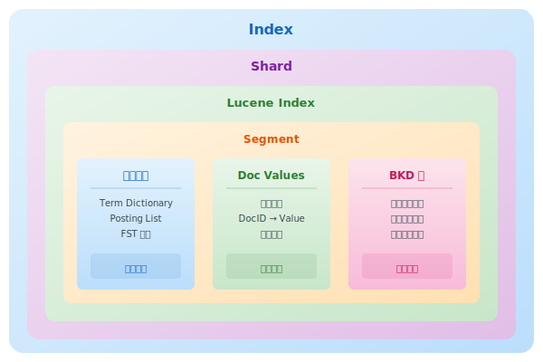
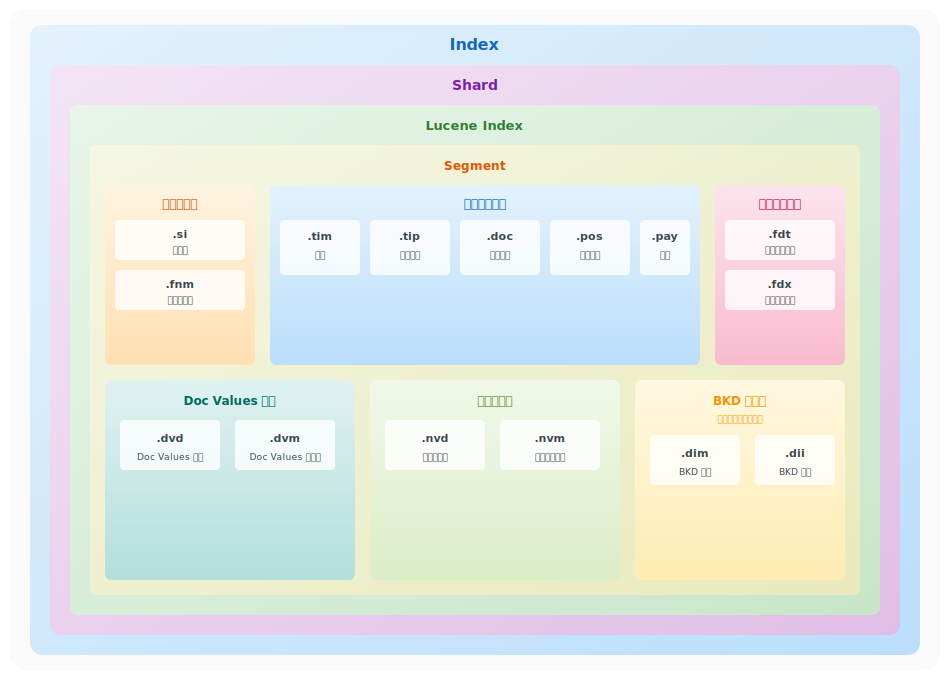
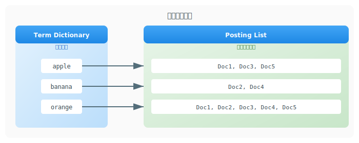
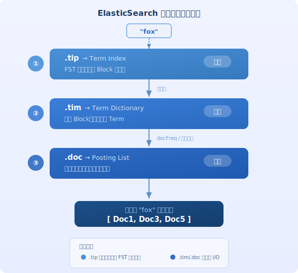
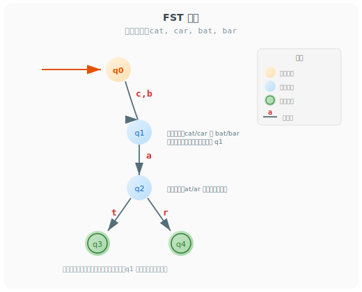
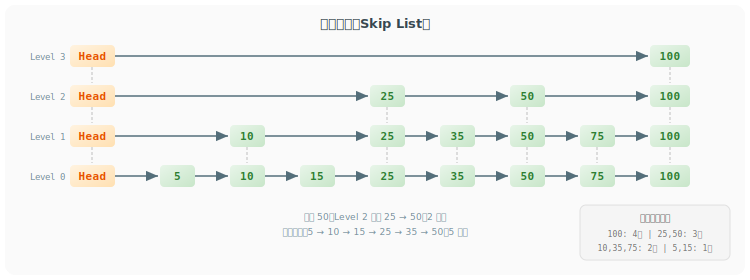
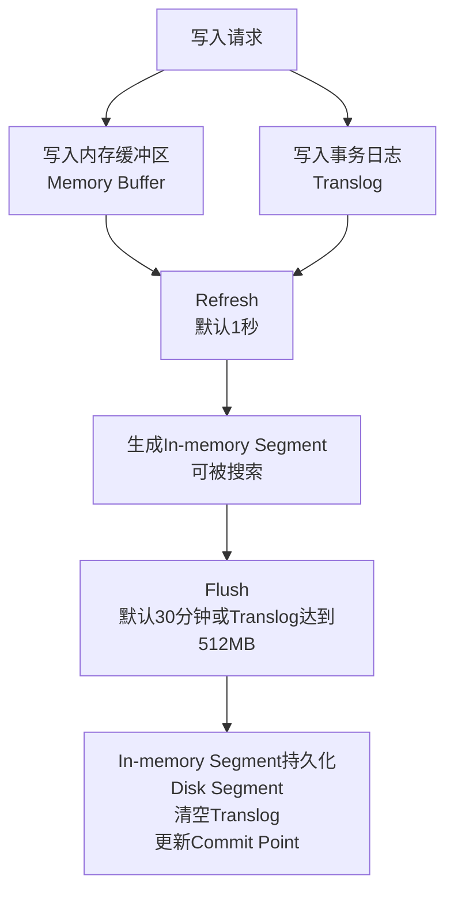
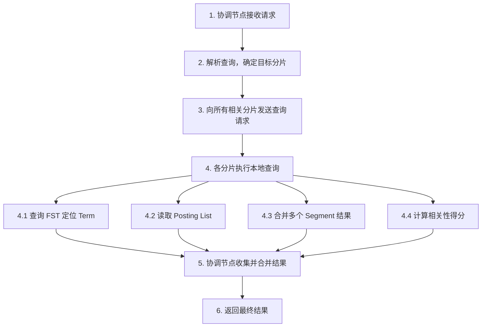
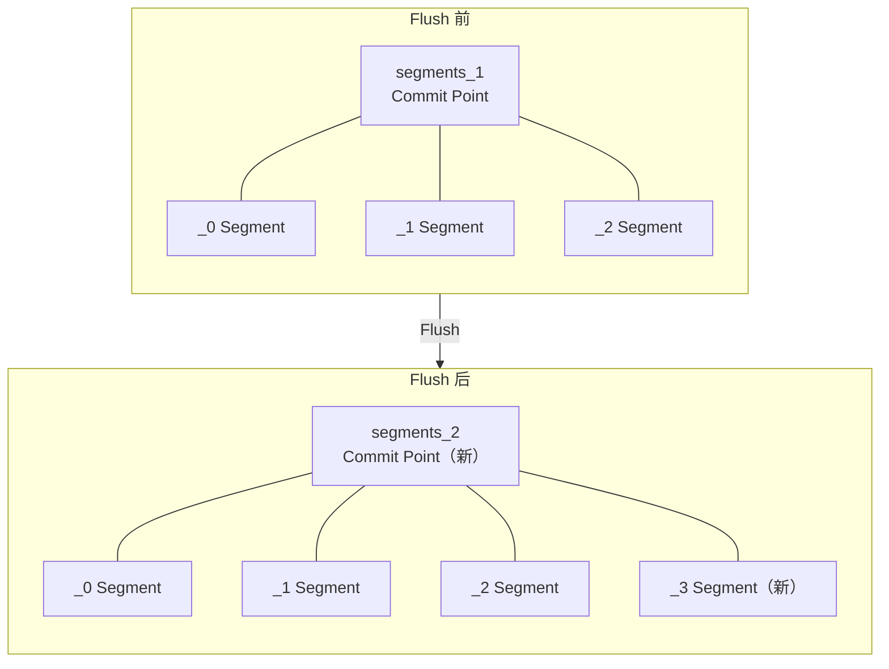

# ElasticSearch 底层存储原理详解

## 概述

ElasticSearch 基于 Apache Lucene 构建，其底层存储围绕 Segment（段）展开。Segment 是 Lucene 中最小的存储和搜索单元，内部集成了倒排索引、Doc Values、BKD 树、存储字段、归一化因子等多种组件，共同支撑搜索、排序、聚合等功能。

本文档以 Segment 为主线，从存储架构出发，依次介绍其内部数据结构、压缩与加速技术、写入与查询流程，最后给出存储优化建议。



---

## 一、存储架构

### 1.1 存储层次

ElasticSearch 的存储按照 `Index → Shard → Lucene Index → Segment` 的层次组织：

| 层次 | 说明 |
|------|------|
| Index | 逻辑命名空间，对应一个或多个 Shard |
| Shard | 索引的分片，是一个独立的 Lucene Index |
| Lucene Index | 由一个或多个 Segment 组成 |
| Segment | 最小存储和搜索单元，不可变 |

### 1.2 Segment（段）

Segment 是 Lucene 中最小的存储和搜索单元，一旦创建便不可修改。这种不可变性带来了几个重要优势：追加写入性能高、可被文件系统缓存加速、无需加锁即可并发读取。当文档需要更新或删除时，Lucene 不会修改已有 Segment，而是通过标记删除 + 新增 Segment 的方式实现。

| 特性 | 说明 |
|------|------|
| 不可变性 | 一旦创建不可修改，更新通过标记删除+新增实现 |
| 独立完整 | 每个 Segment 包含完整的索引数据，可被独立搜索 |
| 写入优化 | 追加写入，性能高 |
| 合并机制 | 后台自动合并小 Segment，优化存储和查询性能 |
| 缓存友好 | 可被文件系统缓存，加速查询 |

> **注意**：虽然常说"Segment 是独立的倒排索引"，但这只是从"可独立搜索"的角度描述。实际上 Segment 包含多种组件（倒排索引、存储字段、Doc Values、BKD 树等），共同支撑搜索、排序、聚合等功能。

### 1.3 Segment 文件类型



Segment 包含以下文件类型，按功能分组：

| 类型 | 扩展名 | 名称 | 说明 |
|------|--------|------|------|
| **元数据** | .si | Segment Info | 段元数据，包含文档数、删除文档数等 |
| | .fnm | Fields Metadata | 字段元数据，包含字段名称、类型、属性等 |
| **倒排索引** | .tim | Term Dictionary | 词典，存储所有 Term |
| | .tip | Term Index | 词典索引，FST 结构，快速定位 Term |
| | .doc | Posting List | 倒排列表，包含 DocID、词频 |
| | .pos | Positions | 位置信息，用于短语查询 |
| | .pay | Payloads | 负载信息，自定义元数据 |
| **存储字段** | .fdt | Stored Fields Data | 存储字段数据，保存原始文档内容 |
| | .fdx | Stored Fields Index | 存储字段索引，快速定位文档 |
| **Doc Values** | .dvd | Doc Values Data | Doc Values 数据，列式存储 |
| | .dvm | Doc Values Metadata | Doc Values 元数据 |
| **归一化** | .nvd | Norms Data | 归一化数据，用于相关性评分 |
| | .nvm | Norms Metadata | 归一化元数据 |
| **BKD 树** | .dim | BKD Dimensions | BKD 树维度信息 |
| | .dii | BKD Index | BKD 树索引，支持范围查询 |

---

## 二、Segment 核心数据结构

### 2.1 倒排索引（Inverted Index）

倒排索引是 ElasticSearch 实现全文搜索的核心数据结构，它通过"词项→文档"的映射关系，将查找过程从遍历文档转变为直接定位，从而实现毫秒级检索。

#### 结构原理



倒排索引由三个紧密协作的组件构成：

| 组件 | 文件 | 说明 |
|------|------|------|
| Term Index（词典索引） | .tip | FST 结构，常驻内存，快速定位 Term 在词典中的位置 |
| Term Dictionary（词典） | .tim | 存储所有不重复的词项及其统计信息（文档频率、总词频） |
| Posting List（倒排列表） | .doc | 每个词项对应的文档列表，包含 DocID、词频 |

**查询协作流程**：



> Term Index 使用 FST 结构压缩（详见 3.1 节），Posting List 使用 FOR 结构压缩和跳表结构加速（详见 3.2 和 3.3 节）。

#### 存储内容

倒排列表中每个词项记录了以下信息：

| 内容 | 说明 |
|------|------|
| Document ID | 文档编号 |
| TF（Term Frequency） | 词频，该词在文档中出现次数 |
| Position | 词在文档中的位置（词序号，从0开始计数） |
| Offset | 词在文档中的偏移量（字符级别的起始和结束位置） |
| Payload | 自定义元数据 |

#### 适用场景

- 全文搜索（text 类型字段）
- 精确匹配查询（keyword 类型字段）
- 前缀查询、通配符查询
- 模糊查询

#### 示例

文档内容：
- Doc1: "Elasticsearch is powerful"
- Doc2: "Elasticsearch is fast"

倒排索引：

| Term | Posting List |
|------|--------------|
| elasticsearch | [(Doc1, TF=1, Pos=0), (Doc2, TF=1, Pos=0)] |
| is | [(Doc1, TF=1, Pos=1), (Doc2, TF=1, Pos=1)] |
| powerful | [(Doc1, TF=1, Pos=2)] |
| fast | [(Doc2, TF=1, Pos=2)] |

---

### 2.2 Doc Values（列式存储）

Doc Values 采用与倒排索引相反的映射方向——"文档→值"，专为排序、聚合和脚本访问而设计。它在索引时与倒排索引同时生成，以列式方式存储同一字段的值，使得压缩和顺序读取都更加高效。

#### 结构原理

| 特性 | 说明 |
|------|------|
| 列式存储 | 同一字段的值连续存储，便于压缩和顺序读取 |
| 压缩算法 | 使用最大公约数、偏移编码、顺序表等多种压缩技巧 |
| 内存映射 | 通过操作系统文件系统缓存管理内存，而非 JVM Heap |
| 不可变 | 基于 Segment 生成，不可修改 |

Doc Values 针对数值类型使用多种压缩技巧：

1. **最大公约数压缩**：检测所有值是否共享公约数，提取后减少存储位数
2. **偏移编码**：从最小值开始计算偏移量
3. **顺序表编码**：字符串去重后分配 ID，转为数值类型存储

#### 与倒排索引对比

| 对比项 | 倒排索引 | Doc Values |
|--------|----------|------------|
| 存储方式 | Term → DocID | DocID → Value |
| 查询方式 | 通过词找文档 | 通过文档找值 |
| 适用场景 | 全文搜索、精确匹配 | 排序、聚合、脚本 |
| 压缩方式 | FST、FOR | 列式压缩 |

#### 适用场景

- 排序操作（sort）
- 聚合操作（aggregation）
- 脚本访问字段值
- 字段值高亮

#### 示例

```
文档数据：
Doc1: { "name": "张三", "age": 25 }
Doc2: { "name": "李四", "age": 30 }
Doc3: { "name": "王五", "age": 28 }

Doc Values 列式存储（省去 DocID）：
name 列: [张三, 李四, 王五]
age 列: [25, 30, 28]
```

---

### 2.3 BKD 树（Block K-Dimensional Tree）

BKD 树专为数值类型和地理坐标类型设计，通过多维空间分割实现高效的范围查询。它是对传统 K-D 树的改进，针对磁盘存储做了优化：数据按块组织，内部节点常驻内存，叶子块存储在磁盘，查询时通过剪枝跳过无关数据块。

#### 结构原理

| 特性 | 说明 |
|------|------|
| 块存储 | 数据划分为固定大小的块（默认512个值），磁盘连续存储 |
| 两级索引 | 内部节点在内存，叶子块在磁盘 |
| 维度轮换 | 按 X→Y→Z→X 顺序循环选择分割维度 |
| 查询复杂度 | O(log N)，通过剪枝跳过无关数据块 |

#### 与倒排索引对比

| 对比项 | 倒排索引 | BKD 树 |
|--------|----------|--------|
| 数据类型 | 文本、keyword | 数值、地理坐标 |
| 查询方式 | 精确匹配、全文搜索 | 范围查询、空间查询 |
| 存储结构 | Term → DocID | 多维空间划分 |
| 查询复杂度 | O(1) 精确匹配 | O(log N) 范围查询 |

#### 适用场景

- 数值范围查询（range query）
- 地理空间搜索（geo_bounding_box、geo_distance）
- 多维数据查询
- 距离排序

#### 示例

```
数值范围查询：
查询价格在 [500, 1500] 区间的商品

BKD 树查询过程：
1. 根节点分割点 800，区间与左右子树均重叠
2. 左子树最大值 350 < 500，剪枝跳过
3. 右子树最小值 1200 ∈ [500,1500]，加载叶子块
4. 返回符合条件的文档 ID
```

---

## 三、压缩与加速技术

Segment 内部的数据结构使用了多种压缩和加速技术来优化存储空间和查询性能。

### 3.1 FST（Finite State Transducer）— 词典索引压缩

FST（Finite State Transducer，有限状态转换器）用于压缩词典索引（Term Index，.tip 文件），是 Lucene 从 4+ 版本开始使用的核心数据结构。

#### 原理

FST 是一种确定性的有穷自动机（DFA），将大量字符串压缩成一张**有向无环图**：
- **前缀共享**：相同前缀的词项只存储一次
- **后缀共享**：相同后缀也只存储一次（区别于普通 Trie 树）
- **边存储字符**：与 Trie 树将字符存储在节点上不同，FST 将字符存储在节点之间的有向边上。从起始节点沿边走到终止节点，依次经过的边上的字符拼接起来，就构成一个完整的词项

示例词项：cat, car, bat, bar
- 前缀共享：cat/car 共享 c→a，bat/bar 共享 b→a
- 后缀共享：cat/bat 共享 a→t，car/bar 共享 a→r

**特点**：
- 压缩率高：内存占用降低 70%+，相比 HashMap 减少 3-10 倍
- 查找快速：O(term length) 时间复杂度
- 支持前缀查询、通配符查询、范围查询
- 结构紧凑，可常驻内存

**在 ES 中的作用**：作为 Term Index 的存储结构，无需将整个 Term Dictionary 加载到内存，仅通过 FST 即可快速定位 Term 在磁盘中的位置，将随机磁盘 IO 转为顺序 IO。


#### 示例



### 3.2 FOR（Frame Of Reference）— 倒排列表 DocID 压缩

FOR（Frame Of Reference，帧引用）用于压缩倒排列表（Posting List，.doc 文件）中的 DocID 序列。

#### 原理

- 将文档 ID 分组（每 128 个一组）
- 每组使用最小位数存储
- 差值编码（存储与前一个 ID 的差值）

#### 示例

```
原始 DocID: [12560, 12561, 12565, 12569, 12570, 12580]

差值编码: 12560[0, 1, 5, 9, 10, 20]

压缩效果:
12560 → 需要 14 bits，实际存储 2 byte
[0, 1, 5, 9, 10, 20] → 最大值 20，需要 5 bits，实际存储 1 byte
```

### 3.3 跳表（Skip List）— 倒排列表加速遍历与合并

跳表（Skip List）用于加速倒排列表（Posting List，.doc 文件）的遍历和合并。

#### 原理

- **多层索引结构**：在有序链表基础上建立多层索引，上层索引是下层索引的子集
- **随机层级**：插入节点时随机决定层级高度，期望高度为 O(log n)
- **查找效率**：从最高层开始，逐层向下逼近目标，时间复杂度 O(log n)

**在 ES 中的作用**：
- 加速倒排列表（Posting List）的遍历
- 多个倒排列表合并时快速跳过不匹配的文档 ID

#### 示例



### 3.4 位图（Bitset）— Filter 缓存与结果合并

位图用于 Filter 查询缓存和快速合并多个查询结果。

#### 原理

- 每个位对应一个文档 ID，1 表示匹配，0 表示不匹配
- 通过位运算（AND、OR、NOT）快速计算交集、并集、差集
- Lucene 5+ 使用 **Roaring Bitmap** 优化：稀疏数据用数组存储，稠密数据用位图存储

**在 ES 中的作用**：
- Filter 查询结果缓存为 bitset，下次相同条件直接复用，速度提升 10x+
- 联合查询（bool query）通过位运算快速合并多个 filter 结果

#### 示例

```
DocID 集合: {1, 3, 5, 7, 9}

Bitset: 0 1 0 1 0 1 0 1 0 1
        0 1 2 3 4 5 6 7 8 9  (DocID)

交集运算 (AND):
  Filter A: 0 1 0 1 0 1 0 1 0 1  → {1,3,5,7,9}
  Filter B: 0 0 1 1 0 0 1 1 0 0  → {2,3,6,7}
  A AND B:  0 0 0 1 0 0 0 1 0 0  → {3,7}
```

---

## 四、写入流程

### 4.1 写入流程图



### 4.2 写入步骤详解

#### Step 1：写入内存缓冲区和事务日志

数据同时写入内存缓冲区和事务日志，两者各司其职：内存缓冲区快速接收写入，等待 Refresh 构建倒排索引；事务日志保证持久化，防止节点宕机导致数据丢失。此时数据尚未构建倒排索引，需等待 Refresh 才可被搜索。

#### Step 2：Refresh（刷新）

默认每 1 秒执行一次 Refresh，将内存缓冲区中的数据生成一个新的 Segment。Refresh 之后数据即可被搜索，但此时 Segment 仍在内存中，尚未持久化到磁盘。

```json
// 修改 refresh 间隔
PUT /my_index/_settings
{
  "index": {
    "refresh_interval": "5s"
  }
}
```

#### Step 3：Flush（刷盘）

Flush 将内存中的 Segment 持久化到磁盘，同时清空 Translog 并更新 Commit Point。触发条件为默认每 30 分钟，或 Translog 达到 512MB。

#### Step 4：Segment Merge（段合并）

随着写入持续进行，Segment 数量不断增长，过多的小 Segment 会影响查询性能。Lucene 在后台自动执行段合并，将多个小 Segment 合并为大 Segment，合并策略为 TieredMergePolicy（分层合并策略）。

---

## 五、Translog（事务日志）

### 5.1 作用

| 作用 | 说明 |
|------|------|
| 数据持久化 | 保证写入数据不丢失 |
| 崩溃恢复 | 节点重启后可从 Translog 恢复 |
| 实时性 | 写入即可返回成功 |

### 5.2 配置

**刷盘含义**：将 Translog 内存缓冲区中的数据 fsync 到磁盘文件，确保节点宕机后可从磁盘恢复。

```yaml
# elasticsearch.yml

# Translog 持久化策略
index.translog.durability: request  # 同步刷盘，每次请求都刷盘（安全但慢）
# index.translog.durability: async  # 异步刷盘，每隔 sync_interval 刷盘（快但有风险）

# Translog 异步刷盘间隔
# index.translog.sync_interval: 5s

# Translog 大小阈值
index.translog.flush_threshold_size: 512mb
```

### 5.3 持久化策略对比

| 策略 | 说明 | 性能 | 安全性 |
|------|------|------|--------|
| `request` | 每次请求都 fsync | 低 | 高 |
| `async` | 每隔 sync_interval fsync | 高 | 较低 |

---

## 六、查询流程

### 6.1 查询执行过程



### 6.2 查询类型

| 查询类型 | 说明 | 使用的数据结构 |
|----------|------|----------------|
| 全文搜索 | match, match_phrase | 倒排索引 |
| 精确匹配 | term, terms | 倒排索引 |
| 范围查询 | range | BKD 树 |
| 地理查询 | geo_distance | BKD 树 |
| 排序 | sort | Doc Values |
| 聚合 | aggregation | Doc Values |

---

## 七、磁盘文件结构

### 7.1 磁盘文件目录

```
/var/lib/elasticsearch/nodes/0/indices/
└── my_index/
    └── 0/                          # 分片编号
        ├── index/
        │   ├── segments_1          # Commit Point 文件
        │   ├── segments_2
        │   ├── _0.cfe              # 复合文件入口
        │   ├── _0.cfs              # 复合文件（包含多个段文件）
        │   ├── _0.si               # 段信息
        │   ├── _1.cfe
        │   ├── _1.cfs
        │   └── _1.si
        ├── translog/
        │   ├── translog-1.tlog     # Translog 文件
        │   └── translog-1.ckp      # Checkpoint
        └── _state/
            └── state-1.st          # 分片状态
```

### 7.2 Commit Point

Commit Point 是 Lucene 索引中的关键元数据文件（`segments_N`），记录当前所有有效 Segment 的清单。每次 Flush 操作都会生成一个新的 Commit Point 文件，其中 N 为递增的版本号，版本号最大的文件即为当前有效的 Commit Point。

**核心作用**：

- **数据恢复**：节点启动时，根据最新的 Commit Point 确定哪些 Segment 属于当前分片，再重放 Translog 中尚未 Flush 的操作
- **查询依据**：查询时遍历 Commit Point 中列出的所有有效 Segment，忽略已被合并或删除的旧 Segment
- **一致性保障**：Flush 时先写入新的 Segment 文件，再写入新的 Commit Point 并 fsync，确保即使宕机也不会引用不完整的 Segment

**与 Flush 的关系**：每次 Flush 会将内存缓冲区中的数据写入新的 Segment，然后生成新的 Commit Point 并 fsync 到磁盘，最后清除旧的 Translog。

**旧 Commit Point 的清理**：新的 `segments_N` 写入后，旧的 `segments_N-1` 不会立即删除。Lucene 会在下次 Flush 或 Segment Merge 时检查并删除不再被引用的旧 Commit Point 文件和旧 Segment 文件。如果有正在进行的搜索仍持有旧 Commit Point 的引用，则旧文件会保留直到所有读取器释放。



---

## 八、存储优化建议

### 8.1 索引设计优化

| 优化项 | 建议 |
|--------|------|
| 分片数 | 每个节点总分片数 ≤ 堆内存(GB) × 20。例：30GB 堆内存最多 600 个分片 |
| 副本数 | 生产环境至少 1 个副本 |
| refresh_interval | 批量写入时设置为 30s 或 -1 |
| 批量写入 | 使用 Bulk API，每批 5-15MB |

**分片数限制说明**：每个分片需要占用 JVM 堆内存来维护状态和元数据。过多的分片会导致堆内存压力增大、集群管理开销增加、性能下降。此建议旨在避免"过多分片问题"（gazillion shards problem）。

### 8.2 存储配置优化

**配置位置**：索引创建时通过 settings 和 mappings 配置，或在索引使用时动态更新。

```yaml
# 创建索引时配置
PUT /my_index
{
  "settings": {
    "number_of_replicas": 1,
    "refresh_interval": "30s"
  },
  "mappings": {
    "properties": {
      "content": {
        "type": "text",
        "index": true,
        "norms": false,
        "doc_values": false
      },
      "timestamp": {
        "type": "date",
        "doc_values": true
      }
    }
  }
}
```

### 8.3 Segment 合并配置优化

**配置位置**：索引创建时通过 settings 配置，或在索引使用时动态更新。

```yaml
# 动态更新合并配置
PUT /my_index/_settings
{
  "index": {
    "merge": {
      "policy": {
        "type": "tiered",
        "segments_per_tier": 10,
        "max_merged_segment": "5gb"
      },
      "scheduler": {
        "max_thread_count": 1
      }
    }
  }
}
```

---

## 九、总结

### 核心存储组件

| 组件 | 作用 | 数据结构 |
|------|------|----------|
| 倒排索引 | 全文搜索 | Term Index + Term Dictionary + Posting List |
| Doc Values | 排序、聚合 | 列式存储 |
| BKD 树 | 范围查询 | 多维空间划分 |
| 存储字段 | 返回文档内容 | 行式存储 |
| 归一化因子 | 相关性评分 | 文档长度归一化 |
| Segment | 存储单元 | 不可变文件 |
| Translog | 数据持久化 | 事务日志 |
| FST | 词典索引压缩 | 有限状态转换器 |

### 写入流程总结


---

## 参考资料

- [Elasticsearch底层存储原理](https://blog.csdn.net/HTTP404_CN/article/details/150638739)
- [Elasticsearch 写入全链路:从单机到集群](https://blog.csdn.net/Daoxifu/article/details/150558953)
- [Elasticsearch 倒排索引原理](https://blog.csdn.net/qq_41187124/article/details/154542166)
- [Elasticsearch数据类型及其底层Lucene数据结构](https://blog.csdn.net/qq_29328443/article/details/151290494)
- [Elasticsearch 完全指南:原理、优势与应用场景](https://blog.csdn.net/u011265143/article/details/155396183)
