# Java WebSocket 开发详解

## 一、WebSocket 协议原理

### 1.1 为什么需要 WebSocket？

HTTP 协议存在以下局限性：

| 问题 | 说明 |
|------|------|
| 单向通信 | 客户端发起请求，服务端被动响应 |
| 无法主动推送 | 服务端无法主动向客户端发送消息 |
| 轮询开销大 | 为获取实时数据，客户端需频繁轮询 |

WebSocket 解决了这些问题，提供**全双工、双向实时通信**能力。

### 1.2 WebSocket 协议概述

WebSocket 是基于 TCP 的独立协议，标准为 **RFC 6455**。

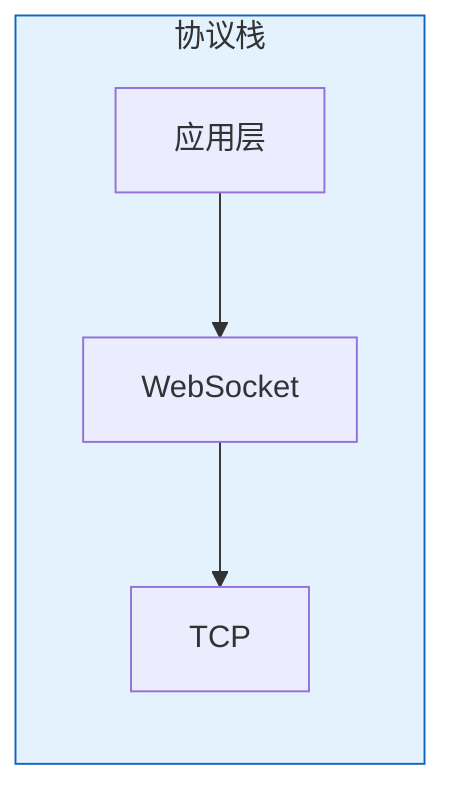

**核心特性**：

| 特性 | 说明 |
|------|------|
| 全双工通信 | 客户端和服务端可同时收发消息 |
| 持久连接 | 一次握手，长期保持连接 |
| 低开销 | 握手后消息帧头仅 2-14 字节 |
| 双向推送 | 服务端可主动推送消息 |

### 1.3 握手过程

WebSocket 连接通过 **HTTP Upgrade** 机制建立。

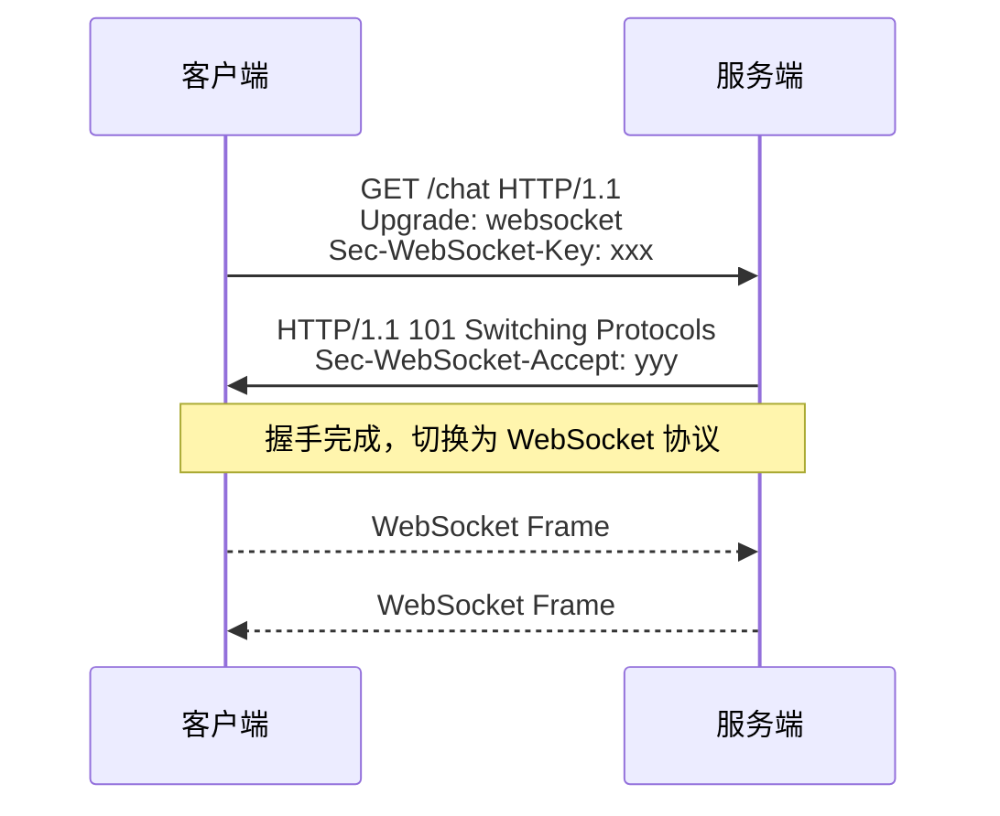

#### 客户端请求

```http
GET /chat HTTP/1.1
Host: example.com
Upgrade: websocket
Connection: Upgrade
Sec-WebSocket-Key: dGhlIHNhbXBsZSBub25jZQ==
Sec-WebSocket-Version: 13
```

**关键字段**：

| 字段 | 说明 |
|------|------|
| `Upgrade: websocket` | 声明升级到 WebSocket 协议 |
| `Connection: Upgrade` | 标识这是协议升级请求 |
| `Sec-WebSocket-Key` | 16 字节随机数的 Base64 编码 |
| `Sec-WebSocket-Version` | 协议版本，当前为 13 |

#### 服务端响应

```http
HTTP/1.1 101 Switching Protocols
Upgrade: websocket
Connection: Upgrade
Sec-WebSocket-Accept: s3pPLMBiTxaQ9kYGzzhZRbK+xOo=
```

**Sec-WebSocket-Accept 计算规则**：

```
1. 将 Sec-WebSocket-Key 与固定 GUID 拼接
   GUID = 258EAFA5-E914-47DA-95CA-C5AB0DC85B11

2. 对拼接结果进行 SHA-1 哈希

3. 将哈希结果 Base64 编码
```

### 1.4 数据帧格式

WebSocket 消息以 **帧（Frame）** 为单位传输。每个帧由**帧头**和**负载数据**组成。

#### 1.4.1 帧结构总览

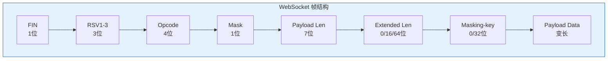

#### 1.4.2 帧头字段详解

**基本帧头（前 2 字节，16 位）**：

```
字节1                    字节2
+--------+--------+    +--------+--------+
|FIN|RSV| Opcode |    |M| Payload Length |
| 1 | 3 |   4    |    |1|       7         |
+--------+--------+    +--------+--------+
```

| 字段 | 位置 | 位数 | 说明 |
|------|------|------|------|
| **FIN** | 第1字节最高位 | 1位 | **Final**：是否为消息最后一帧。1=最后一帧，0=还有后续帧（分片传输） |
| **RSV1-3** | 第1字节次高位 | 3位 | **Reserved**：保留位。无扩展时必须为0；用于协议扩展（如压缩） |
| **Opcode** | 第1字节低4位 | 4位 | **Operation Code**：帧类型，决定如何解析负载数据 |
| **MASK** | 第2字节最高位 | 1位 | **Mask**：是否使用掩码。客户端→服务端必须为1，服务端→客户端必须为0 |
| **Payload Length** | 第2字节低7位 | 7位 | 负载长度。特殊值：126表示后续2字节为长度，127表示后续8字节为长度 |

#### 1.4.3 Opcode 帧类型

| Opcode | 十六进制 | 类型 | 说明 |
|--------|---------|------|------|
| 0 | 0x0 | Continuation | 分片消息的后续帧，承接上一帧 |
| 1 | 0x1 | Text | 文本帧，负载为 UTF-8 编码文本 |
| 2 | 0x2 | Binary | 二进制帧，负载为任意二进制数据 |
| 8 | 0x8 | Close | 关闭连接帧，用于优雅关闭连接 |
| 9 | 0x9 | Ping | 心跳检测帧，发起方发起 Ping，接收方回复 Pong |
| 10 | 0xA | Pong | 心跳响应帧，发起方发起 Ping，接收方回复 Pong |

> **注意**：Opcode 3-7、11-15 为保留值，暂未定义用途。

#### 1.4.4 负载长度编码规则

Payload Length 字段（7位）使用变长编码：

| Payload Length 值 | 实际负载长度 | 说明 |
|------------------|-------------|------|
| 0-125 | 0-125 字节 | 长度值即实际长度，无需扩展字段 |
| 126 | 126-65535 字节 | 后续 **2 字节**（16位）存储实际长度 |
| 127 | 65536+ 字节 | 后续 **8 字节**（64位）存储实际长度 |

**示例**：

```
负载长度 = 100 字节：
+--------+--------+
|...| 100 |      ← Payload Length = 100，无需扩展
+--------+--------+

负载长度 = 1000 字节：
+--------+--------+--------+--------+
|...| 126 |  0x03 |  0xE8 |       ← Payload Length = 126，后续2字节 = 1000
+--------+--------+--------+--------+

负载长度 = 100000 字节：
+--------+--------+--------+--------+--------+--------+--------+--------+--------+--------+
|...| 127 | 0x00 | 0x00 | 0x00 | 0x00 | 0x00 | 0x01 | 0x86 | 0xA0 |  ← 后续8字节 = 100000
+--------+--------+--------+--------+--------+--------+--------+--------+--------+--------+
```

#### 1.4.5 掩码机制

**为什么需要掩码？**

客户端发送的消息必须使用掩码，这是为了防止**缓存投毒攻击**。恶意客户端可能构造特定数据，欺骗中间缓存代理服务器将恶意内容缓存为正常响应。

**缓存投毒攻击原理**：

攻击目标是位于客户端和服务端之间的**缓存代理服务器**。

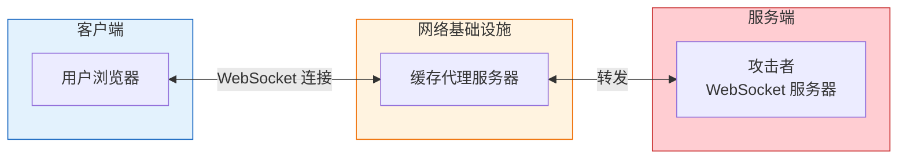

**无掩码时的攻击流程**：

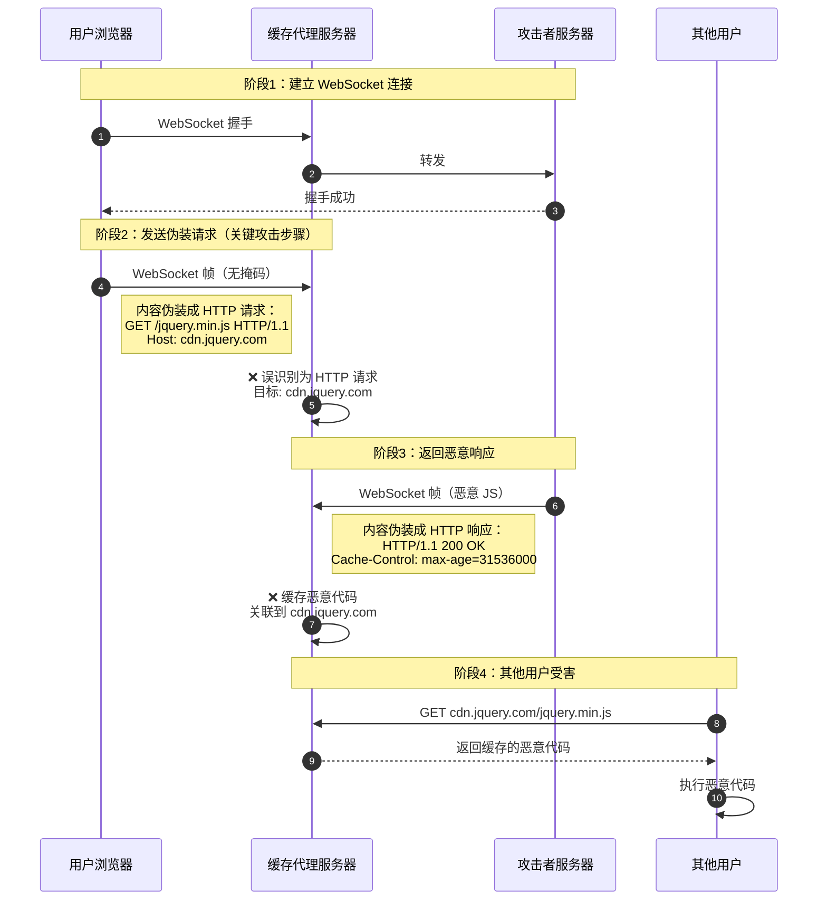

**为什么能攻击成功？**：

| 条件 | 说明 |
|------|------|
| 代理不理解 WebSocket 协议 | 将 WebSocket 帧的负载数据误识别为 HTTP 请求/响应报文 |
| 无掩码明文传输 | 攻击者可控制负载数据的字节内容，构造特定格式 |
| 代理启用缓存 | 恶意响应被缓存到错误的目标域名下 |

**有掩码时的防御效果**：

```
攻击者想发送:     GET /jquery.min.js HTTP/1.1...
                        ↓
浏览器随机掩码:   Key = [0x37, 0xFA, 0x21, 0x3B]
                        ↓
实际传输内容:     0x70 0xBF 0x75 0x1B 0x18...（乱码）
                        ↓
代理服务器判断:   "不是 HTTP 请求，正常转发"
                        ↓
结果:             ✅ 攻击失败，无缓存污染
```

**为什么不怕被解掩码？**

| 问题 | 答案 |
|------|------|
| 掩码是加密吗？ | 不是，密钥随帧发送，任何人可解掩码 |
| 为什么安全？ | 掩码密钥由浏览器随机生成，攻击者无法控制最终字节 |
| 保护对象是谁？ | 网络基础设施（代理服务器），而非数据机密性 |

**掩码工作原理**：

```
原始数据:    [D0, D1, D2, D3, D4, D5, ...]
掩码密钥:    [M0, M1, M2, M3]
掩码后数据:  [D0^M0, D1^M1, D2^M2, D3^M3, D4^M0, D5^M1, ...]
```

掩码密钥（32位）循环与负载数据进行 **XOR** 运算。

**示例**：

```
原始数据:     "Hello" → [0x48, 0x65, 0x6C, 0x6C, 0x6F]
掩码密钥:     [0x37, 0xFA, 0x21, 0x3B]
掩码后数据:   [0x7F, 0x9F, 0x4D, 0x57, 0x58]

计算过程：
0x48 XOR 0x37 = 0x7F
0x65 XOR 0xFA = 0x9F
0x6C XOR 0x21 = 0x4D
0x6C XOR 0x3B = 0x57
0x6F XOR 0x37 = 0x58  ← 循环使用掩码
```

#### 1.4.6 完整帧示例

**客户端发送文本 "Hello"**：

```
 0                   1                   2                   3
 0 1 2 3 4 5 6 7 8 9 0 1 2 3 4 5 6 7 8 9 0 1 2 3 4 5 6 7 8 9 0 1
+-+-+-+-+-------+-+-------------+-------------------------------+
|1|0|0|0|   1   |1|     5       |    Masking-key (32位)         |
| | | | | (Text)| |  (len=5)    |   0x37 0xFA 0x21 0x3B        |
+-+-+-+-+-------+-+-------------+-------------------------------+
|                   Masked Payload Data                         |
|                   0x7F 0x9F 0x4D 0x57 0x58                    |
+---------------------------------------------------------------+

解析：
- FIN=1：这是最后一帧（也是唯一一帧）
- RSV=000：无扩展
- Opcode=1：文本帧
- MASK=1：使用掩码（客户端发送必须为1）
- Payload Length=5：负载长度5字节
- Masking-key：4字节掩码密钥
- Payload：掩码后的 "Hello"
```

**服务端发送文本 "Hi"**：

```
 0                   1                   2                   
 0 1 2 3 4 5 6 7 8 9 0 1 2 3 4 5 6 7 8 9 0 1 2 3 4 5 6 7 8 9 
+-+-+-+-+-------+-+-------------+-------------------------------+
|1|0|0|0|   1   |0|     2       | 'H'   | 'i'                 |
| | | | | (Text)| |  (len=2)    | 0x48  | 0x69                |
+-+-+-+-+-------+-+-------------+-------------------------------+

解析：
- MASK=0：服务端发送不使用掩码
- 无 Masking-key 字段
- Payload 直接是原始数据
```

### 1.5 与 HTTP 对比

| 对比维度 | HTTP | WebSocket |
|---------|------|-----------|
| 通信模式 | 请求-响应（半双工） | 全双工 |
| 连接方式 | 短连接为主 | 持久连接 |
| 推送能力 | 不支持 | 原生支持 |
| 协议开销 | 每次请求携带完整头部 | 握手后仅帧头（2-14字节） |
| URI 方案 | http:// 或 https:// | ws:// 或 wss:// |

---

## 二、Java WebSocket 实现方案对比

### 2.1 方案概览

| 方案 | 说明 | 适用场景 |
|------|------|---------|
| **JSR-356** | Java 标准 WebSocket API | 轻量级应用、Servlet 容器 |
| **Spring WebSocket** | Spring 生态集成方案 | Spring Boot 项目 |
| **Netty WebSocket** | 高性能网络框架 | 高并发、定制化需求 |

### 2.2 特性对比

| 特性 | JSR-356 | Spring WebSocket | Netty |
|------|---------|-----------------|-------|
| 学习成本 | 低 | 中 | 高 |
| 性能 | 中 | 中 | 高 |
| Spring 集成 | 需手动 | 原生支持 | 需手动 |
| STOMP 支持 | 无 | 原生支持 | 需实现 |
| 可定制性 | 低 | 中 | 高 |

---

## 三、JSR-356 标准实现

### 3.1 概述

JSR-356 是 Java WebSocket API 的标准规范，包含在 Java EE 7 中。Servlet 容器（Tomcat 7+、Jetty 9+）原生支持。

### 3.2 服务端实现

#### 3.2.1 端点类

```java
package com.example.websocket;

import javax.websocket.*;
import javax.websocket.server.PathParam;
import javax.websocket.server.ServerEndpoint;
import java.io.IOException;
import java.util.Map;
import java.util.concurrent.ConcurrentHashMap;

@ServerEndpoint(value = "/ws/chat/{roomId}")
public class ChatEndpoint {

    private static final Map<String, Map<String, Session>> roomSessions = new ConcurrentHashMap<>();

    @OnOpen
    public void onOpen(Session session, @PathParam("roomId") String roomId) {
        String userId = session.getId();
        
        roomSessions.computeIfAbsent(roomId, k -> new ConcurrentHashMap<>())
                    .put(userId, session);
        
        broadcast(roomId, "用户 " + userId + " 加入房间，当前人数: " + 
                  roomSessions.get(roomId).size());
    }

    @OnMessage
    public void onMessage(String message, Session session, @PathParam("roomId") String roomId) {
        String userId = session.getId();
        broadcast(roomId, userId + ": " + message);
    }

    @OnClose
    public void onClose(Session session, @PathParam("roomId") String roomId) {
        String userId = session.getId();
        
        Map<String, Session> sessions = roomSessions.get(roomId);
        if (sessions != null) {
            sessions.remove(userId);
            if (sessions.isEmpty()) {
                roomSessions.remove(roomId);
            }
        }
        
        broadcast(roomId, "用户 " + userId + " 离开房间");
    }

    @OnError
    public void onError(Session session, Throwable error) {
        error.printStackTrace();
        try {
            if (session.isOpen()) {
                session.close();
            }
        } catch (IOException e) {
            e.printStackTrace();
        }
    }

    private void broadcast(String roomId, String message) {
        Map<String, Session> sessions = roomSessions.get(roomId);
        if (sessions == null) return;
        
        sessions.values().forEach(session -> {
            try {
                if (session.isOpen()) {
                    session.getBasicRemote().sendText(message);
                }
            } catch (IOException e) {
                e.printStackTrace();
            }
        });
    }
}
```

#### 3.2.2 核心注解说明

| 注解 | 说明 |
|------|------|
| `@ServerEndpoint` | 声明服务端端点，指定 URL 路径 |
| `@OnOpen` | 连接建立时触发 |
| `@OnMessage` | 收到消息时触发 |
| `@OnClose` | 连接关闭时触发 |
| `@OnError` | 发生错误时触发 |
| `@PathParam` | 获取 URL 路径参数 |

### 3.3 客户端实现

```java
package com.example.websocket;

import javax.websocket.*;
import java.io.IOException;
import java.net.URI;
import java.util.Scanner;

@ClientEndpoint
public class WebSocketClient {

    private Session session;

    @OnOpen
    public void onOpen(Session session) {
        this.session = session;
        System.out.println("连接成功");
    }

    @OnMessage
    public void onMessage(String message) {
        System.out.println("收到消息: " + message);
    }

    @OnClose
    public void onClose(Session session, CloseReason reason) {
        System.out.println("连接关闭: " + reason);
    }

    @OnError
    public void onError(Session session, Throwable error) {
        System.err.println("连接错误: " + error.getMessage());
    }

    public void send(String message) throws IOException {
        if (session != null && session.isOpen()) {
            session.getBasicRemote().sendText(message);
        }
    }

    public void close() throws IOException {
        if (session != null) {
            session.close();
        }
    }

    public static void main(String[] args) throws Exception {
        WebSocketContainer container = ContainerProvider.getWebSocketContainer();
        WebSocketClient client = new WebSocketClient();
        
        container.connectToServer(client, URI.create("ws://localhost:8080/ws/chat/room1"));
        
        Scanner scanner = new Scanner(System.in);
        while (scanner.hasNextLine()) {
            String line = scanner.nextLine();
            if ("exit".equals(line)) {
                client.close();
                break;
            }
            client.send(line);
        }
    }
}
```

### 3.4 配置参数

```java
@ServerEndpoint(value = "/ws/chat", 
    configurator = CustomConfigurator.class,
    encoders = {MessageEncoder.class},
    decoders = {MessageDecoder.class})
public class ChatEndpoint {
    // ...
}
```

| 配置项 | 说明 |
|--------|------|
| `configurator` | 自定义配置器，可用于获取 HTTP 会话 |
| `encoders` | 消息编码器，将对象转为 WebSocket 消息 |
| `decoders` | 消息解码器，将 WebSocket 消息转为对象 |

---

## 四、Spring WebSocket 实现

Spring 提供两种 WebSocket 使用方式：

| 方式 | 说明 | 适用场景 |
|------|------|---------|
| 原生 WebSocket | 实现 WebSocketHandler 接口 | 简单场景、需要精细控制 |
| STOMP 协议 | 基于 WebSocketMessageBroker 机制 | 复杂业务、订阅/发布模式 |

### 4.1 依赖配置

```xml
<dependency>
    <groupId>org.springframework.boot</groupId>
    <artifactId>spring-boot-starter-websocket</artifactId>
</dependency>
```

### 4.2 方式一：原生 WebSocket

#### 4.2.1 实现原理

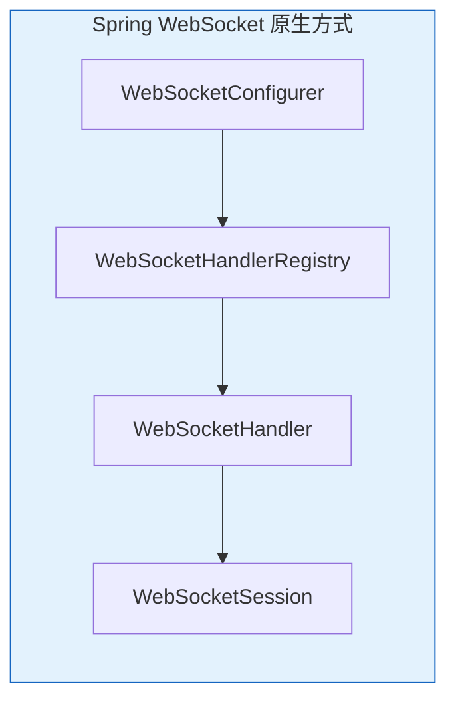

Spring 原生 WebSocket 方式通过 `WebSocketHandler` 接口处理 WebSocket 连接，Spring 负责管理 WebSocket 连接生命周期。

#### 4.2.2 配置类

```java
package com.example.websocket.config;

import com.example.websocket.handler.ChatWebSocketHandler;
import com.example.websocket.interceptor.AuthHandshakeInterceptor;
import org.springframework.context.annotation.Configuration;
import org.springframework.web.socket.config.annotation.EnableWebSocket;
import org.springframework.web.socket.config.annotation.WebSocketConfigurer;
import org.springframework.web.socket.config.annotation.WebSocketHandlerRegistry;

@Configuration
@EnableWebSocket
public class WebSocketConfig implements WebSocketConfigurer {

    private final ChatWebSocketHandler chatWebSocketHandler;
    private final AuthHandshakeInterceptor authHandshakeInterceptor;

    public WebSocketConfig(ChatWebSocketHandler chatWebSocketHandler,
                          AuthHandshakeInterceptor authHandshakeInterceptor) {
        this.chatWebSocketHandler = chatWebSocketHandler;
        this.authHandshakeInterceptor = authHandshakeInterceptor;
    }

    @Override
    public void registerWebSocketHandlers(WebSocketHandlerRegistry registry) {
        registry.addHandler(chatWebSocketHandler, "/ws/chat")
                .addInterceptors(authHandshakeInterceptor)
                .setAllowedOrigins("*");
    }
}
```

#### 4.2.3 消息处理器

```java
package com.example.websocket.handler;

import com.fasterxml.jackson.databind.ObjectMapper;
import org.springframework.stereotype.Component;
import org.springframework.web.socket.CloseStatus;
import org.springframework.web.socket.TextMessage;
import org.springframework.web.socket.WebSocketSession;
import org.springframework.web.socket.handler.TextWebSocketHandler;

import java.io.IOException;
import java.util.Map;
import java.util.concurrent.ConcurrentHashMap;

@Component
public class ChatWebSocketHandler extends TextWebSocketHandler {

    private final Map<String, WebSocketSession> sessions = new ConcurrentHashMap<>();
    private final ObjectMapper objectMapper = new ObjectMapper();

    @Override
    public void afterConnectionEstablished(WebSocketSession session) throws Exception {
        String userId = (String) session.getAttributes().get("userId");
        sessions.put(userId, session);
        broadcast("用户 " + userId + " 上线，当前在线: " + sessions.size());
    }

    @Override
    protected void handleTextMessage(WebSocketSession session, TextMessage message) throws Exception {
        String payload = message.getPayload();
        ChatMessage chatMessage = objectMapper.readValue(payload, ChatMessage.class);
        
        switch (chatMessage.getType()) {
            case "CHAT":
                broadcast(chatMessage.getContent());
                break;
            case "PING":
                session.sendMessage(new TextMessage("{\"type\":\"PONG\"}"));
                break;
        }
    }

    @Override
    public void afterConnectionClosed(WebSocketSession session, CloseStatus status) throws Exception {
        String userId = (String) session.getAttributes().get("userId");
        sessions.remove(userId);
        broadcast("用户 " + userId + " 下线");
    }

    @Override
    public void handleTransportError(WebSocketSession session, Throwable exception) throws Exception {
        String userId = (String) session.getAttributes().get("userId");
        sessions.remove(userId);
        if (session.isOpen()) {
            session.close();
        }
    }

    private void broadcast(String message) {
        TextMessage textMessage = new TextMessage(message);
        sessions.values().forEach(session -> {
            try {
                if (session.isOpen()) {
                    session.sendMessage(textMessage);
                }
            } catch (IOException e) {
                e.printStackTrace();
            }
        });
    }

    public void sendToUser(String userId, String message) throws IOException {
        WebSocketSession session = sessions.get(userId);
        if (session != null && session.isOpen()) {
            session.sendMessage(new TextMessage(message));
        }
    }
}
```

#### 4.2.4 握手拦截器

```java
package com.example.websocket.interceptor;

import org.springframework.http.server.ServerHttpRequest;
import org.springframework.http.server.ServerHttpResponse;
import org.springframework.stereotype.Component;
import org.springframework.web.socket.WebSocketHandler;
import org.springframework.web.socket.server.HandshakeInterceptor;

import java.util.Map;

@Component
public class AuthHandshakeInterceptor implements HandshakeInterceptor {

    @Override
    public boolean beforeHandshake(ServerHttpRequest request, ServerHttpResponse response,
                                   WebSocketHandler wsHandler, Map<String, Object> attributes) {
        String token = extractToken(request);
        
        if (!validateToken(token)) {
            return false;
        }
        
        String userId = parseUserId(token);
        attributes.put("userId", userId);
        return true;
    }

    @Override
    public void afterHandshake(ServerHttpRequest request, ServerHttpResponse response,
                               WebSocketHandler wsHandler, Exception exception) {
    }

    private String extractToken(ServerHttpRequest request) {
        String query = request.getURI().getQuery();
        if (query != null && query.contains("token=")) {
            return query.split("token=")[1].split("&")[0];
        }
        return null;
    }

    private boolean validateToken(String token) {
        return token != null && token.length() > 0;
    }

    private String parseUserId(String token) {
        return "user_" + token.hashCode();
    }
}
```

### 4.3 方式二：STOMP 协议

#### 4.3.1 STOMP 协议原理

STOMP（Simple Text Oriented Messaging Protocol）是在 WebSocket 之上的消息协议，提供**订阅/发布**语义。

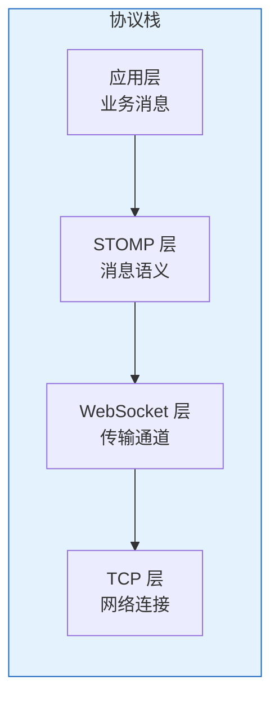

**STOMP 核心概念**：

| 概念 | 说明 |
|------|------|
| Frame（帧） | 消息的基本单位 |
| Command（命令） | 操作类型，如 CONNECT、SEND、SUBSCRIBE |
| Header（头信息） | 元数据，如 destination、content-type |
| Body（消息体） | 实际数据内容 |

**STOMP 帧格式**：

```
COMMAND
header1:value1
header2:value2

Body^@
```

**示例**：

```
SEND
destination:/app/chat
content-type:application/json

{"content":"Hello World"}^@
```

**STOMP 命令类型**：

| 命令 | 方向 | 说明 |
|------|------|------|
| CONNECT | 客户端→服务端 | 建立连接 |
| CONNECTED | 服务端→客户端 | 连接确认 |
| SEND | 客户端→服务端 | 发送消息 |
| SUBSCRIBE | 客户端→服务端 | 订阅目的地 |
| UNSUBSCRIBE | 客户端→服务端 | 取消订阅 |
| MESSAGE | 服务端→客户端 | 推送消息 |
| ACK/NACK | 客户端→服务端 | 消息确认 |
| DISCONNECT | 客户端→服务端 | 断开连接 |

**目的地类型**：

| 前缀 | 类型 | 说明 |
|------|------|------|
| `/topic/*` | 广播 | 所有订阅者都会收到 |
| `/queue/*` | 队列 | SimpleBroker 中其行为与 `/topic` 相同；外部消息代理中其行为可配置为点对点 |
| `/user/*` | 用户专属 | 特定用户收到 |
| `/app/*` | 应用处理 | 触发 @MessageMapping 方法 |

> **重要说明**：
> - **SimpleBroker（内存消息代理）**：`/topic` 和 `/queue` 的行为**完全相同**，都是广播给所有订阅者
> - **外部消息代理（如 RabbitMQ）**：`/topic` 为广播（发布/订阅），`/queue` 为点对点（竞争消费）
> - **真正的点对点**：需要使用外部消息代理或 `convertAndSendToUser` 方法

#### 4.3.2 配置类

Spring WebSocket 支持两种消息代理：**内存消息代理（SimpleBroker）** 和 **外部消息代理（StompBrokerRelay）**。

---

**方式一：内存消息代理（SimpleBroker）**

```java
@Configuration
@EnableWebSocketMessageBroker
public class SimpleBrokerConfig implements WebSocketMessageBrokerConfigurer {

    @Override
    public void registerStompEndpoints(StompEndpointRegistry registry) {
        registry.addEndpoint("/ws")
                .setAllowedOriginPatterns("*")
                .withSockJS();
    }

    @Override
    public void configureMessageBroker(MessageBrokerRegistry registry) {
        registry.enableSimpleBroker("/topic", "/queue");
        registry.setApplicationDestinationPrefixes("/app");
        registry.setUserDestinationPrefix("/user");
    }
}
```

**配置方法说明**：

| 方法 | 参数 | 作用 |
|------|------|------|
| `enableSimpleBroker()` | 可变参数 | 指定消息代理目的地前缀，消息代理将消息广播给所有订阅者 |
| `setApplicationDestinationPrefixes()` | 可变参数 | 指定应用处理目的地前缀，消息路由到 `@MessageMapping` 方法 |
| `setUserDestinationPrefix()` | 单个参数 | 指定用户目的地前缀，配合 `convertAndSendToUser()` 实现用户专属消息 |

**SimpleBroker 特性**：

| 特性 | 说明 |
|------|------|
| 消息存储 | 内存 |
| `/topic` 行为 | 广播 |
| `/queue` 行为 | **广播**（与 `/topic` 行为相同） |
| 可靠性 | 低（重启丢失） |
| 集群支持 | 不支持 |
| 适用场景 | 开发测试、单机应用 |

---

**方式二：外部消息代理（StompBrokerRelay）**

```java
@Configuration
@EnableWebSocketMessageBroker
public class ExternalBrokerConfig implements WebSocketMessageBrokerConfigurer {

    @Override
    public void registerStompEndpoints(StompEndpointRegistry registry) {
        registry.addEndpoint("/ws")
                .setAllowedOriginPatterns("*")
                .withSockJS();
    }

    @Override
    public void configureMessageBroker(MessageBrokerRegistry registry) {
        registry.enableStompBrokerRelay("/topic", "/queue")
                .setRelayHost("localhost")
                .setRelayPort(61613)
                .setClientLogin("guest")
                .setClientPasscode("guest")
                .setSystemLogin("guest")
                .setSystemPasscode("guest");
        
        registry.setApplicationDestinationPrefixes("/app");
        registry.setUserDestinationPrefix("/user");
    }
}
```

**配置方法说明**：

| 方法 | 参数 | 作用 |
|------|------|------|
| `enableStompBrokerRelay()` | 可变参数 | 指定消息代理目的地前缀，消息转发给外部消息代理处理 |
| `setRelayHost()` | 主机地址 | 外部消息代理地址 |
| `setRelayPort()` | 端口号 | 外部消息代理 STOMP 端口（RabbitMQ 默认 61613） |
| `setClientLogin/Passcode()` | 用户名/密码 | 代表客户端连接外部代理的凭据 |
| `setSystemLogin/Passcode()` | 用户名/密码 | Spring 应用连接外部代理的凭据 |

**外部消息代理特性**：

| 特性 | 说明 |
|------|------|
| 消息存储 | 持久化 |
| `/topic` 行为 | 广播（发布/订阅），**具体语义由外部消息代理决定** |
| `/queue` 行为 | 点对点（竞争消费），**具体语义由外部消息代理决定** |
| 可靠性 | 高 |
| 集群支持 | 支持 |
| 适用场景 | 生产环境、分布式应用 |

> **重要**：`/topic` 和 `/queue` 的路由语义由**外部消息代理**决定，Spring 只负责转发消息。不同代理的映射规则：
> - **RabbitMQ**：`/topic` → Fanout Exchange（广播），`/queue` → Direct Queue（点对点）
> - **ActiveMQ**：`/topic` → Topic（发布/订阅），`/queue` → Queue（点对点）

---

**两种消息代理对比**：

| 对比项 | SimpleBroker | 外部消息代理 |
|--------|-------------|-------------|
| 实现方式 | Spring 内置内存实现 | 转发到 RabbitMQ/ActiveMQ |
| `/topic` 行为 | 广播 | 广播（发布/订阅） |
| `/queue` 行为 | **广播** | **点对点（竞争消费）** |
| 消息持久化 | 不支持 | 支持 |
| 集群支持 | 不支持 | 支持 |
| 适用场景 | 开发测试 | 生产环境 |

#### 4.3.3 消息处理器

```java
package com.example.websocket.controller;

import org.springframework.messaging.handler.annotation.DestinationVariable;
import org.springframework.messaging.handler.annotation.MessageMapping;
import org.springframework.messaging.handler.annotation.Payload;
import org.springframework.messaging.handler.annotation.SendTo;
import org.springframework.messaging.simp.SimpMessagingTemplate;
import org.springframework.messaging.simp.annotation.SendToUser;
import org.springframework.stereotype.Controller;

import java.security.Principal;

@Controller
public class ChatController {

    private final SimpMessagingTemplate messagingTemplate;

    public ChatController(SimpMessagingTemplate messagingTemplate) {
        this.messagingTemplate = messagingTemplate;
    }

    @MessageMapping("/chat")
    @SendTo("/topic/messages")
    public ChatMessage broadcast(ChatMessage message) {
        message.setTimestamp(System.currentTimeMillis());
        return message;
    }

    @MessageMapping("/chat/{roomId}")
    @SendTo("/topic/room/{roomId}")
    public ChatMessage roomChat(@DestinationVariable String roomId, ChatMessage message) {
        message.setTimestamp(System.currentTimeMillis());
        return message;
    }

    @MessageMapping("/private")
    public void sendPrivate(@Payload ChatMessage message, Principal principal) {
        messagingTemplate.convertAndSendToUser(
            message.getToUser(),
            "/queue/messages",
            message
        );
    }

    @MessageMapping("/notification")
    @SendToUser("/queue/notifications")
    public Notification notify(@Payload Notification notification) {
        return notification;
    }
}
```

**核心注解说明**：

| 注解 | 说明 |
|------|------|
| `@MessageMapping` | 映射消息目的地（加 /app 前缀） |
| `@SendTo` | 将返回值发送到指定目的地 |
| `@SendToUser` | 将返回值发送给当前用户 |
| `@Payload` | 获取消息体内容 |
| `@DestinationVariable` | 获取目的地路径变量 |

#### 4.3.4 客户端示例

```javascript
const socket = new SockJS('/ws');
const stompClient = Stomp.over(socket);

stompClient.connect(
    { Authorization: 'Bearer ' + token },
    function(frame) {
        console.log('连接成功');
        
        stompClient.subscribe('/topic/messages', function(message) {
            console.log('广播消息:', JSON.parse(message.body));
        });
        
        stompClient.subscribe('/user/queue/messages', function(message) {
            console.log('私信:', JSON.parse(message.body));
        });
    }
);

function sendBroadcast(content) {
    stompClient.send("/app/chat", {}, JSON.stringify({
        from: 'user1',
        content: content
    }));
}

function sendPrivate(toUser, content) {
    stompClient.send("/app/private", {}, JSON.stringify({
        toUser: toUser,
        content: content
    }));
}
```

### 4.4 原生方式 vs STOMP 方式

| 对比维度 | 原生 WebSocket | STOMP 协议 |
|---------|---------------|-----------|
| 开发复杂度 | 较高 | 较低 |
| 消息路由 | 手动实现 | 框架自动 |
| 订阅管理 | 手动维护 | 框架管理 |
| 消息格式 | 自定义 | 标准帧格式 |
| 适用场景 | 简单场景 | 复杂业务 |

---

## 五、Netty WebSocket 实现

### 5.1 实现原理

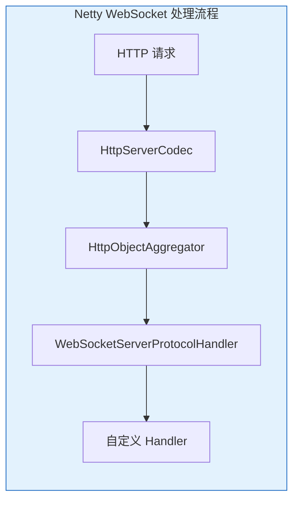

Netty 通过 Pipeline 中的 Handler 链处理 WebSocket：

1. **HttpServerCodec**：HTTP 编解码
2. **HttpObjectAggregator**：聚合 HTTP 消息
3. **WebSocketServerProtocolHandler**：处理 WebSocket 握手和帧
4. **自定义 Handler**：处理业务逻辑

### 5.2 依赖配置

```xml
<dependency>
    <groupId>io.netty</groupId>
    <artifactId>netty-all</artifactId>
    <version>4.1.100.Final</version>
</dependency>
```

### 5.3 服务端实现

#### 5.3.1 服务器启动类

```java
package com.example.websocket.netty;

import io.netty.bootstrap.ServerBootstrap;
import io.netty.channel.ChannelFuture;
import io.netty.channel.ChannelInitializer;
import io.netty.channel.ChannelPipeline;
import io.netty.channel.EventLoopGroup;
import io.netty.channel.nio.NioEventLoopGroup;
import io.netty.channel.socket.SocketChannel;
import io.netty.channel.socket.nio.NioServerSocketChannel;
import io.netty.handler.codec.http.HttpObjectAggregator;
import io.netty.handler.codec.http.HttpServerCodec;
import io.netty.handler.codec.http.websocketx.WebSocketServerProtocolHandler;
import io.netty.handler.stream.ChunkedWriteHandler;

public class WebSocketServer {

    private final int port;

    public WebSocketServer(int port) {
        this.port = port;
    }

    public void start() throws InterruptedException {
        EventLoopGroup bossGroup = new NioEventLoopGroup(1);
        EventLoopGroup workerGroup = new NioEventLoopGroup();

        try {
            ServerBootstrap bootstrap = new ServerBootstrap();
            bootstrap.group(bossGroup, workerGroup)
                    .channel(NioServerSocketChannel.class)
                    .childHandler(new ChannelInitializer<SocketChannel>() {
                        @Override
                        protected void initChannel(SocketChannel ch) {
                            ChannelPipeline pipeline = ch.pipeline();
                            
                            pipeline.addLast(new HttpServerCodec());
                            pipeline.addLast(new HttpObjectAggregator(65536));
                            pipeline.addLast(new ChunkedWriteHandler());
                            pipeline.addLast(new WebSocketServerProtocolHandler("/ws"));
                            pipeline.addLast(new WebSocketMessageHandler());
                        }
                    });

            ChannelFuture future = bootstrap.bind(port).sync();
            System.out.println("WebSocket 服务器启动，端口: " + port);
            future.channel().closeFuture().sync();
        } finally {
            bossGroup.shutdownGracefully();
            workerGroup.shutdownGracefully();
        }
    }

    public static void main(String[] args) throws InterruptedException {
        new WebSocketServer(8080).start();
    }
}
```

#### 5.3.2 消息处理器

```java
package com.example.websocket.netty;

import io.netty.channel.Channel;
import io.netty.channel.ChannelHandler;
import io.netty.channel.ChannelHandlerContext;
import io.netty.channel.SimpleChannelInboundHandler;
import io.netty.handler.codec.http.websocketx.CloseWebSocketFrame;
import io.netty.handler.codec.http.websocketx.PingWebSocketFrame;
import io.netty.handler.codec.http.websocketx.PongWebSocketFrame;
import io.netty.handler.codec.http.websocketx.TextWebSocketFrame;
import io.netty.handler.codec.http.websocketx.WebSocketFrame;

import java.util.Map;
import java.util.concurrent.ConcurrentHashMap;

@ChannelHandler.Sharable
public class WebSocketMessageHandler extends SimpleChannelInboundHandler<WebSocketFrame> {

    private static final Map<String, Channel> channels = new ConcurrentHashMap<>();

    @Override
    public void handlerAdded(ChannelHandlerContext ctx) {
        String channelId = ctx.channel().id().asShortText();
        channels.put(channelId, ctx.channel());
        System.out.println("客户端连接: " + channelId + ", 当前连接数: " + channels.size());
    }

    @Override
    public void handlerRemoved(ChannelHandlerContext ctx) {
        String channelId = ctx.channel().id().asShortText();
        channels.remove(channelId);
        System.out.println("客户端断开: " + channelId + ", 当前连接数: " + channels.size());
    }

    @Override
    protected void channelRead0(ChannelHandlerContext ctx, WebSocketFrame frame) {
        if (frame instanceof TextWebSocketFrame) {
            String message = ((TextWebSocketFrame) frame).text();
            System.out.println("收到消息: " + message);
            broadcast("Echo: " + message);
        } else if (frame instanceof PingWebSocketFrame) {
            ctx.writeAndFlush(new PongWebSocketFrame(frame.content().retain()));
        } else if (frame instanceof CloseWebSocketFrame) {
            // 关闭连接后，Netty 会自动调用 handlerRemoved() 从 channels 中移除
            ctx.close();
        }
    }

    @Override
    public void exceptionCaught(ChannelHandlerContext ctx, Throwable cause) {
        cause.printStackTrace();
        // 异常时 handlerRemoved 可能不会被调用，需要手动移除
        channels.remove(ctx.channel().id().asShortText());
        ctx.close();
    }

    private void broadcast(String message) {
        TextWebSocketFrame frame = new TextWebSocketFrame(message);
        channels.values().forEach(channel -> {
            if (channel.isActive()) {
                channel.writeAndFlush(frame.copy());
            }
        });
    }

    public void sendToChannel(String channelId, String message) {
        Channel channel = channels.get(channelId);
        if (channel != null && channel.isActive()) {
            channel.writeAndFlush(new TextWebSocketFrame(message));
        }
    }
}
```

### 5.4 Pipeline 处理链说明

| Handler | 作用 |
|---------|------|
| `HttpServerCodec` | HTTP 编解码器 |
| `HttpObjectAggregator` | 聚合 HTTP 消息片段 |
| `ChunkedWriteHandler` | 支持大文件传输 |
| `WebSocketServerProtocolHandler` | 处理握手、Ping/Pong、Close 帧 |
| 自定义 Handler | 处理业务逻辑 |

---

## 六、心跳与断线重连

### 6.1 心跳机制原理

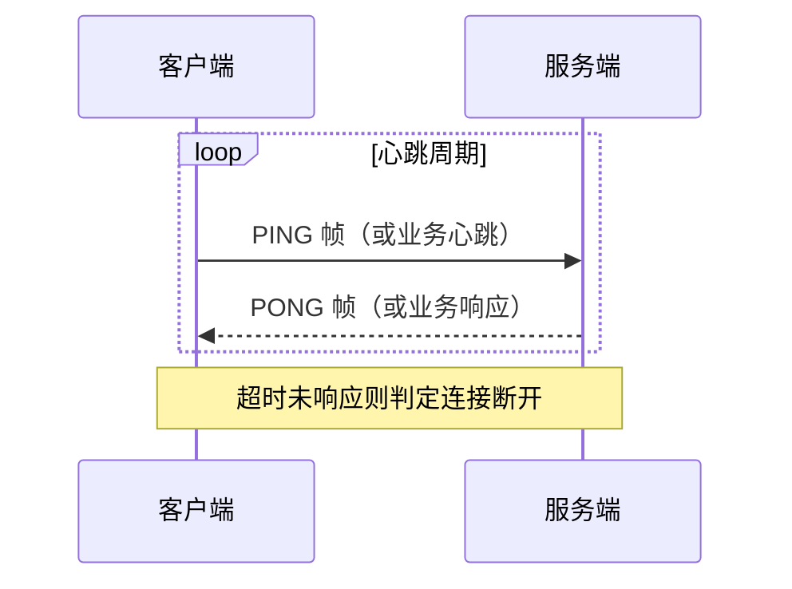

**心跳的作用**：

| 作用 | 说明 |
|------|------|
| 检测连接状态 | 及时发现断连 |
| 保持 NAT 映射 | 防止防火墙断开空闲连接 |
| 僵尸连接清理 | 清理已断开但未正常关闭的连接 |

### 6.2 协议级心跳（Ping/Pong 帧）

WebSocket 协议内置 Ping/Pong 帧用于心跳检测。

**服务端自动响应**：大多数 WebSocket 框架会自动响应 Pong。

**Netty 示例**：

```java
@Override
protected void channelRead0(ChannelHandlerContext ctx, WebSocketFrame frame) {
    if (frame instanceof PingWebSocketFrame) {
        ctx.writeAndFlush(new PongWebSocketFrame(frame.content().retain()));
    }
}
```

### 6.3 应用级心跳（业务实现）

当协议级心跳不可用时（如浏览器 WebSocket API 不暴露 Ping/Pong），使用业务消息实现心跳。

#### 6.3.1 Spring WebSocket STOMP 心跳

**配置心跳**：

```java
@Configuration
@EnableWebSocketMessageBroker
public class StompWebSocketConfig implements WebSocketMessageBrokerConfigurer {

    @Override
    public void configureMessageBroker(MessageBrokerRegistry registry) {
        registry.enableSimpleBroker("/topic", "/queue")
                .setHeartbeatValue(new long[]{10000, 10000}); // 10秒心跳
    }
}
```

#### 6.3.2 Spring 原生 WebSocket 心跳

**服务端心跳检测**：

```java
@Component
public class HeartbeatHandler {

    private final Map<String, Long> lastHeartbeat = new ConcurrentHashMap<>();
    // 心跳配置（推荐）：超时时间 ≥ 心跳周期 × 2 + 检测周期
    // 基于以上心跳配置，允许 2 次心跳丢失，适用于互联网环境
    private static final long HEARTBEAT_INTERVAL = 30000;                         // 客户端心跳周期 30秒
    private static final long CHECK_INTERVAL = 30000;                             // 服务端检测周期 30秒
    private static final long TIMEOUT = HEARTBEAT_INTERVAL * 2 + CHECK_INTERVAL;  // 超时时间 90秒

    @Scheduled(fixedRate = 30000)
    public void checkHeartbeat() {
        long now = System.currentTimeMillis();
        lastHeartbeat.forEach((userId, time) -> {
            if (now - time > TIMEOUT) {
                // 超时，关闭连接
                closeConnection(userId);
            }
        });
    }

    public void updateHeartbeat(String userId) {
        lastHeartbeat.put(userId, System.currentTimeMillis());
    }

    public void removeUser(String userId) {
        lastHeartbeat.remove(userId);
    }
}
```

**消息处理器集成**：

```java
@Component
public class ChatWebSocketHandler extends TextWebSocketHandler {

    private final HeartbeatHandler heartbeatHandler;

    @Override
    protected void handleTextMessage(WebSocketSession session, TextMessage message) throws Exception {
        JSONObject json = JSON.parseObject(message.getPayload());
        
        if ("PING".equals(json.getString("type"))) {
            String userId = (String) session.getAttributes().get("userId");
            heartbeatHandler.updateHeartbeat(userId);
            session.sendMessage(new TextMessage("{\"type\":\"PONG\"}"));
        }
    }
}
```

### 6.4 客户端断线重连

```javascript
class WebSocketClient {
    constructor(url, options = {}) {
        this.url = url;
        this.heartbeatInterval = options.heartbeatInterval || 30000;
        this.reconnectDelay = options.reconnectDelay || 1000;
        this.maxReconnect = options.maxReconnect || 5;
        this.reconnectCount = 0;
        this.ws = null;
        this.heartbeatTimer = null;
    }

    connect() {
        this.ws = new WebSocket(this.url);

        this.ws.onopen = () => {
            console.log('连接成功');
            this.reconnectCount = 0;
            this.startHeartbeat();
        };

        this.ws.onmessage = (event) => {
            const data = JSON.parse(event.data);
            if (data.type === 'PONG') {
                return; // 心跳响应，不处理
            }
            this.onMessage && this.onMessage(data);
        };

        this.ws.onclose = (event) => {
            console.log('连接关闭:', event.code, event.reason);
            this.stopHeartbeat();
            this.reconnect();
        };

        this.ws.onerror = (error) => {
            console.error('连接错误:', error);
        };
    }

    startHeartbeat() {
        this.heartbeatTimer = setInterval(() => {
            if (this.ws.readyState === WebSocket.OPEN) {
                this.ws.send(JSON.stringify({ type: 'PING' }));
            }
        }, this.heartbeatInterval);
    }

    stopHeartbeat() {
        if (this.heartbeatTimer) {
            clearInterval(this.heartbeatTimer);
            this.heartbeatTimer = null;
        }
    }

    reconnect() {
        if (this.reconnectCount >= this.maxReconnect) {
            console.error('重连次数超限');
            this.onReconnectFailed && this.onReconnectFailed();
            return;
        }

        this.reconnectCount++;
        const delay = this.reconnectDelay * Math.pow(2, this.reconnectCount - 1);
        console.log(`第 ${this.reconnectCount} 次重连，${delay}ms 后执行`);

        setTimeout(() => this.connect(), delay);
    }

    send(data) {
        if (this.ws && this.ws.readyState === WebSocket.OPEN) {
            this.ws.send(JSON.stringify(data));
        }
    }

    close() {
        this.stopHeartbeat();
        if (this.ws) {
            this.ws.close();
        }
    }
}

// 使用示例
const client = new WebSocketClient('ws://localhost:8080/ws/chat', {
    heartbeatInterval: 30000,
    reconnectDelay: 1000,
    maxReconnect: 5
});

client.onMessage = (data) => {
    console.log('收到消息:', data);
};

client.onReconnectFailed = () => {
    alert('连接断开，请刷新页面');
};

client.connect();
```

### 6.5 重连策略

| 策略 | 说明 | 适用场景 |
|------|------|---------|
| 固定间隔 | 每次重连间隔固定 | 简单场景 |
| 指数退避 | 间隔指数增长（1s→2s→4s...） | 生产环境推荐 |
| 随机抖动 | 避免大量客户端同时重连 | 高并发场景 |

---

## 七、集群方案

### 7.1 核心问题

WebSocket 是**有状态连接**，Session 绑定在具体服务器节点上。集群环境下必须解决以下问题：

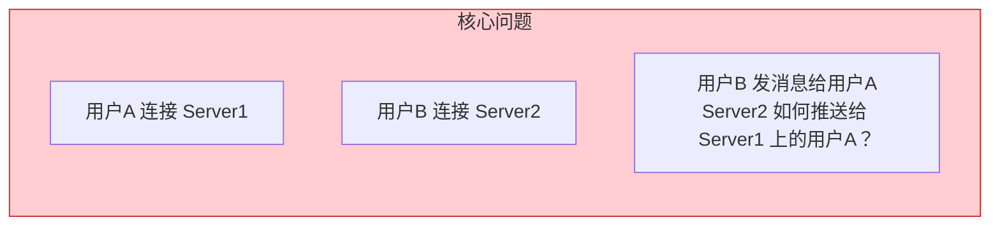

**问题本质**：消息发送方和接收方可能连接在不同的服务器节点上，需要跨节点消息通信。

### 7.2 解决方案

**WebSocket 集群方案 = 负载均衡层 + 服务集群层 + 消息中间件层**

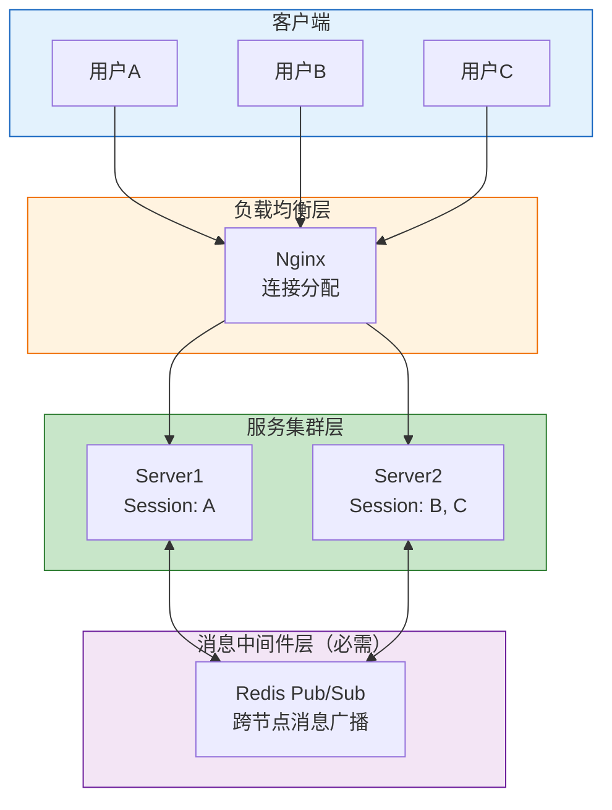

**三层架构说明**：

| 层级 | 组件 | 作用 | 是否必需 |
|------|------|------|---------|
| 负载均衡层 | Nginx | 分配客户端连接 | 必需 |
| 服务集群层 | 多个 WebSocket 服务节点 | 处理连接和消息 | 必需 |
| 消息中间件层 | Redis Pub/Sub | 跨节点消息广播 | **必需** |

> **重要**：消息中间件是 WebSocket 集群的**必需组件**，不是可选项。没有消息中间件，跨节点消息无法通信。

### 7.3 消息通信流程

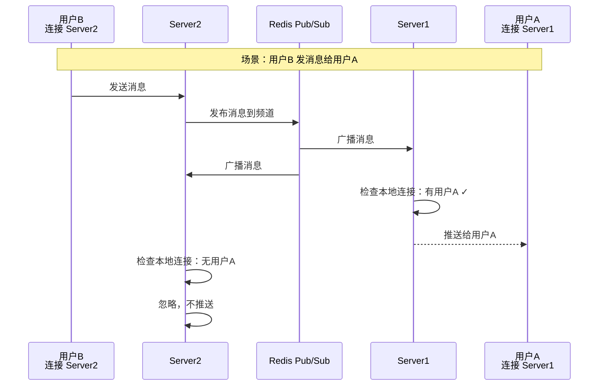

**流程说明**：

1. 用户B 发送消息到 Server2
2. Server2 发布消息到 Redis Pub/Sub
3. Redis 广播消息到所有订阅的服务节点
4. 各服务节点检查本地是否有目标用户的连接
5. 有则推送，无则忽略

### 7.4 负载均衡策略

负载均衡层负责分配客户端连接，有以下策略可选：

| 策略 | Nginx 配置 | 说明 | 特点 |
|------|-----------|------|------|
| Sticky Session | `ip_hash;` | 同一客户端固定到同一服务器 | 可能负载不均衡 |
| 轮询 | 默认 | 依次分配到各服务器 | 负载均衡 |
| 最少连接 | `least_conn;` | 分配到连接最少的服务器 | 动态均衡 |

**Nginx 配置示例**：

```nginx
upstream websocket {
    # 策略一：Sticky Session（同一用户固定到同一服务器）
    # ip_hash;
    
    # 策略二：最少连接（分配到连接最少的服务器）
    least_conn;
    
    # 策略三：轮询（默认，无需配置）
    
    server 192.168.1.1:8080;
    server 192.168.1.2:8080;
}

server {
    location /ws {
        proxy_pass http://websocket;
        proxy_http_version 1.1;
        proxy_set_header Upgrade $http_upgrade;
        proxy_set_header Connection "upgrade";
        proxy_set_header Host $host;
        proxy_set_header X-Real-IP $remote_addr;
    }
}
```

**策略选择建议**：

| 场景 | 推荐策略 | 原因 |
|------|---------|------|
| 用户连接时长差异大 | 最少连接 | 动态均衡，避免某些服务器过载 |
| 用户连接时长相近 | 轮询 | 简单有效 |
| 需要用户重连后保持同一节点 | Sticky Session | 但可能导致负载不均衡 |

> **注意**：无论选择哪种负载均衡策略，消息中间件都是必需的。

### 7.5 消息中间件实现

#### 方式一：STOMP Broker Relay（推荐）

Spring 内置支持，配置简单，适合标准 STOMP 场景。

```xml
<dependency>
    <groupId>org.springframework.boot</groupId>
    <artifactId>spring-boot-starter-data-redis</artifactId>
</dependency>
```

```java
@Configuration
@EnableWebSocketMessageBroker
public class RedisWebSocketConfig implements WebSocketMessageBrokerConfigurer {

    @Override
    public void configureMessageBroker(MessageBrokerRegistry registry) {
        registry.enableStompBrokerRelay("/topic", "/queue")
                .setRelayHost("localhost")
                .setRelayPort(6379);
        
        registry.setApplicationDestinationPrefixes("/app");
        registry.setUserDestinationPrefix("/user");
    }
}
```

**说明**：
- `enableStompBrokerRelay()` 参数：可变参数，支持多个前缀
- Redis 作为 STOMP 消息代理，自动处理消息路由和订阅管理
- 无需手动编写消息广播代码

#### 方式二：手动实现 Pub/Sub

适合需要自定义消息路由逻辑的场景。

```java
@Configuration
public class RedisPubSubConfig {

    @Bean
    public RedisMessageListenerContainer redisContainer(
            RedisConnectionFactory connectionFactory,
            MessageListenerAdapter listenerAdapter) {
        RedisMessageListenerContainer container = new RedisMessageListenerContainer();
        container.setConnectionFactory(connectionFactory);
        container.addMessageListener(listenerAdapter, new ChannelTopic("websocket:broadcast"));
        return container;
    }

    @Bean
    public MessageListenerAdapter listenerAdapter(RedisMessageReceiver receiver) {
        return new MessageListenerAdapter(receiver, "receiveMessage");
    }
}
```

```java
@Component
public class RedisMessageReceiver {

    @Autowired
    private SimpMessagingTemplate messagingTemplate;

    public void receiveMessage(String message) {
        JSONObject json = JSON.parseObject(message);
        String destination = json.getString("destination");
        Object payload = json.get("payload");
        messagingTemplate.convertAndSend(destination, payload);
    }
}
```

```java
@Service
public class MessageBroadcastService {

    @Autowired
    private StringRedisTemplate redisTemplate;

    private static final String BROADCAST_CHANNEL = "websocket:broadcast";

    public void broadcast(String destination, Object payload) {
        JSONObject message = new JSONObject();
        message.put("destination", destination);
        message.put("payload", payload);
        redisTemplate.convertAndSend(BROADCAST_CHANNEL, message.toJSONString());
    }
}
```

```java
@Service
public class ChatService {

    @Autowired
    private MessageBroadcastService messageBroadcastService;

    public void sendBroadcast(String roomId, ChatMessage message) {
        messageBroadcastService.broadcast("/topic/room/" + roomId, message);
    }
}
```

**职责划分**：

| 类 | 职责 |
|---|------|
| `RedisPubSubConfig` | 配置 Redis 监听容器 |
| `RedisMessageReceiver` | 接收 Redis 消息，转发给 WebSocket 客户端 |
| `MessageBroadcastService` | 发布消息到 Redis 频道 |
| `ChatService` | 业务逻辑，调用广播服务 |

**方式一 vs 方式二对比**：

| 对比项 | 方式一：STOMP Broker Relay | 方式二：手动 Pub/Sub |
|------|---------------------------|----------------------|
| 实现复杂度 | 简单 | 较复杂 |
| 灵活性 | 低 | 高 |
| 订阅管理 | Redis 自动处理 | 需手动实现 |
| 适用场景 | 标准 STOMP 场景 | 自定义路由逻辑 |

### 7.6 高可用保障

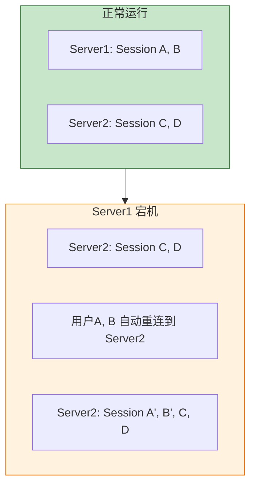

**高可用机制**：

| 场景 | 处理方式 |
|------|---------|
| 服务器节点宕机 | 客户端自动重连，负载均衡分配到其他节点 |
| 消息中间件宕机 | 需要部署 Redis 哨兵或集群模式 |
| 负载均衡器宕机 | 部署多个 Nginx，使用 Keepalived 实现高可用 |

### 7.7 总结

| 问题 | 答案 |
|------|------|
| WebSocket 集群方案有几种？ | **一种**：负载均衡 + 服务集群 + 消息中间件 |
| 消息中间件是可选的吗？ | **不是**，是必需组件 |
| Sticky Session 是独立方案吗？ | **不是**，只是负载均衡策略的一种 |
| 为什么必须要有消息中间件？ | 解决跨节点消息通信问题 |

---

## 八、最佳实践

### 8.1 安全配置

#### 8.1.1 STOMP 认证拦截器

```java
@Configuration
public class WebSocketSecurityConfig implements WebSocketMessageBrokerConfigurer {

    @Override
    public void configureClientInboundChannel(ChannelRegistration registration) {
        registration.interceptors(new ChannelInterceptor() {
            @Override
            public Message<?> preSend(Message<?> message, MessageChannel channel) {
                StompHeaderAccessor accessor = StompHeaderAccessor.wrap(message);

                if (StompCommand.CONNECT.equals(accessor.getCommand())) {
                    String token = accessor.getFirstNativeHeader("Authorization");
                    if (token == null || !validateToken(token)) {
                        throw new IllegalArgumentException("认证失败");
                    }
                    accessor.setUser(new UserPrincipal(parseUserId(token)));
                }

                return message;
            }
        });
    }
}
```

#### 8.1.2 跨域配置

```java
@Override
public void registerStompEndpoints(StompEndpointRegistry registry) {
    registry.addEndpoint("/ws")
            .setAllowedOriginPatterns("https://example.com")
            .withSockJS();
}
```

### 8.2 性能优化

| 优化点 | 说明 |
|--------|------|
| 异步消息处理 | 使用 `@Async` 异步处理消息 |
| 消息压缩 | 启用 `permessage-deflate` 扩展 |
| 连接数限制 | 限制单机最大连接数 |
| 消息大小限制 | 限制单条消息大小 |

```java
@Configuration
public class WebSocketConfig implements WebSocketMessageBrokerConfigurer {

    @Override
    public void configureMessageBroker(MessageBrokerRegistry registry) {
        registry.enableSimpleBroker("/topic", "/queue")
                .setHeartbeatValue(new long[]{10000, 10000});
    }

    @Override
    public void configureClientInboundChannel(ChannelRegistration registration) {
        registration.taskExecutor().corePoolSize(4).maxPoolSize(8);
    }
}
```

### 8.3 异常处理

```java
@ControllerAdvice
public class WebSocketExceptionHandler {

    @MessageExceptionHandler
    public void handleException(Exception e) {
        log.error("WebSocket 异常", e);
    }

    @MessageExceptionHandler(MethodArgumentNotValidException.class)
    public void handleValidation(MethodArgumentNotValidException e) {
        log.warn("消息格式错误: {}", e.getMessage());
    }
}
```

---

## 九、面试高频问题

| 问题 | 答案要点 |
|------|---------|
| WebSocket 与 HTTP 长轮询区别？ | WebSocket 全双工、低延迟、持久连接；长轮询半双工、延迟高、资源消耗大 |
| JSR-356 与 Spring WebSocket 如何选择？ | JSR-356 轻量标准；Spring 集成度高、支持 STOMP 协议 |
| STOMP 协议作用？ | 在 WebSocket 之上提供消息语义，支持订阅/发布、消息路由 |
| 为什么需要心跳？ | 检测连接状态、保持 NAT 映射、清理僵尸连接 |
| 集群如何实现消息同步？ | 通过消息中间件广播（Redis Pub/Sub） |
| 如何保证消息可靠性？ | ACK 确认机制、消息持久化、重试机制 |
| WebSocket 连接数限制？ | 受服务器资源、文件描述符限制，需合理配置 |
