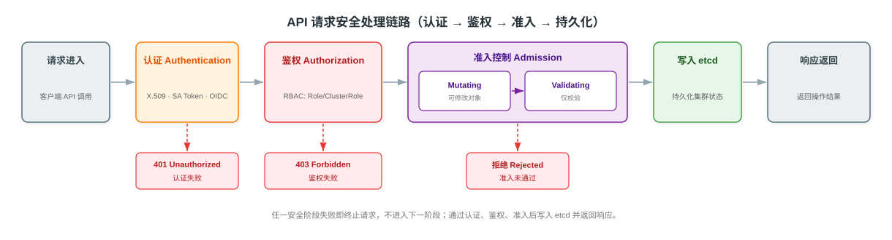

# Kubernetes 安全与访问控制详解

> 本文系统阐述 Kubernetes 的安全与访问控制体系。每个 API 请求从进入 kube-apiserver 到持久化需依次通过认证（Authentication）、鉴权（Authorization）与准入控制（Admission Control）三个阶段；在此基础上，RBAC 提供基于角色的权限管理，Secret 保护敏感数据，Pod Security Admission 强制工作负载安全基线，NetworkPolicy 控制网络流量隔离。本文分为九个部分：概述、API 请求安全链路、认证、RBAC 鉴权、准入控制、Secret、Pod Security Admission、NetworkPolicy 与参考资料，并辅以一张端到端的 API 请求安全处理链路图，帮助建立完整的安全认知。

---

## 一、概述

Kubernetes 通过 kube-apiserver 作为统一入口接收所有 API 请求。无论请求来自 kubectl、应用程序、控制器还是 kubelet，都必须通过一套分层安全机制。其核心思想是"默认拒绝"：在未通过校验前，请求不会被持久化。

每个 API 请求经过三个安全阶段，按顺序执行：

1. **认证（Authentication）**：校验调用者身份，回答"你是谁"。请求必须携带一种或多种凭证，认证模块将其解析为用户/组信息。
2. **鉴权（Authorization）**：校验调用者是否具备对目标资源的操作权限，回答"你能做什么"。默认模式为 RBAC。
3. **准入控制（Admission Control）**：在请求通过认证与鉴权后、写入 etcd 前，对对象进行校验或修改。先执行变更类（Mutating）准入，再执行校验类（Validating）准入。

只有全部通过，请求才会被写入 etcd 并返回成功响应；任一阶段失败即被拒绝，不会进入下一阶段。

---

## 二、API 请求安全链路

API 请求在 kube-apiserver 内部的处理顺序如下：

1. **认证（Authentication）**：校验"你是谁"。kube-apiserver 依次尝试已配置的认证插件，首个成功识别身份的插件终止流程；全部失败则返回 401。
2. **鉴权（Authorization）**：校验"你能做什么"。请求被转化为 `user/verb/resource/namespace` 等属性提交给鉴权模块（默认 RBAC）；任一策略允许即放行，全部拒绝则返回 403。
3. **准入控制（Admission Control）**：校验/修改请求内容。先执行 Mutating Admission Webhook（可修改对象，如注入 sidecar、补全默认字段），再执行 Validating Admission Webhook（仅校验，不可修改）。
4. **写入 etcd**：通过全部校验后，对象被序列化并持久化到 etcd，kube-apiserver 返回成功响应。

下图展示了一个 API 请求从进入 kube-apiserver 到写入 etcd 并返回响应的完整安全处理链路，以及各阶段的失败分支。



> 说明：Mutating 必须先于 Validating 执行，否则 Validating 校验的对象可能被后续 Mutating 修改，导致校验结果与最终持久化对象不一致。

---

## 三、认证（Authentication）

认证模块负责将请求中的凭证解析为 Kubernetes 可识别的用户身份。Kubernetes 区分两类用户：**普通用户（User）**（由外部系统管理，集群不存储其信息）与 **ServiceAccount**（集群内管理，通过 Token 关联）。

kube-apiserver 支持多种认证方式，可同时启用多个，依次尝试，首个成功即终止：

| 认证方式 | 凭证形态 | 适用场景 | 说明 |
|----------|----------|----------|------|
| 客户端证书（X.509） | 集群 CA 签发的证书 | 组件间通信、管理员访问 | 通过 `--client-ca-file` 配置；CN 作为用户名，Organization 作为组 |
| ServiceAccount Token | JWT 形式的 Bearer Token | Pod 内访问 API | 自动挂载到 Pod；1.24 起基于 ProjectedServiceAccountToken，token 不再长期存于 Secret，支持过期轮转 |
| OIDC（OpenID Connect） | ID Token | 对接企业 SSO（如 Google、Azure AD） | 将外部身份提供商与集群解耦，推荐的生产方案 |
| 静态 Token 文件 | 文件中的明文 token | 一次性/测试 | 通过 `--token-auth-file` 配置，明文存储，不推荐生产使用 |
| 引导 Token（Bootstrap Token） | `abcdef.1234567890abcdef` 格式 | 节点加入集群（kubeadm） | 用于 `kubeadm join` 一次性认证，可过期 |

> 生产环境推荐组合：**X.509 证书**用于组件与运维访问，**ServiceAccount Token**用于 Pod 内应用，**OIDC**对接企业身份系统。静态 Token 文件因明文存储且无法轮转，应避免使用。

---

## 四、鉴权——RBAC

### 4.1 RBAC 概述

RBAC（Role-Based Access Control，基于角色的访问控制）是 Kubernetes 默认且推荐的鉴权模式（`--authorization-mode=Node,RBAC`）。其核心思想：将权限授予角色，再将角色绑定到主体（Subject），主体通过角色间接获得权限，而非直接赋予。

RBAC 由四个核心对象组成：

| 对象 | 作用域 | 职责 | 是否可被复用 |
|------|--------|------|--------------|
| Role | 命名空间内 | 定义命名空间内的资源操作权限 | 可在同一命名空间内被多个 RoleBinding 引用 |
| ClusterRole | 集群级（含命名空间资源） | 定义集群级资源或跨命名空间复用的权限 | 可被任意命名空间的 RoleBinding 或 ClusterRoleBinding 引用 |
| RoleBinding | 命名空间内 | 将 Role（或 ClusterRole）绑定到 Subject，授予命名空间内权限 | 绑定关系存在于单一命名空间 |
| ClusterRoleBinding | 集群级 | 将 ClusterRole 绑定到 Subject，授予集群级权限 | 影响所有命名空间 |

### 4.2 Role 与 ClusterRole 对比

| 维度 | Role | ClusterRole |
|------|------|-------------|
| 作用域 | 单个命名空间 | 集群级（含集群范围资源如 nodes、namespaces） |
| 定义对象 | 命名空间内资源（pods、services 等） | 任意资源，含集群级资源与命名空间资源 |
| 复用性 | 仅限本命名空间 | 可被任意命名空间 RoleBinding 引用，实现权限复用 |
| 典型用途 | 授予开发者对某命名空间 Pod 的操作权 | 定义通用角色（如 view、edit、admin）供全集群复用 |

### 4.3 RoleBinding 与 ClusterRoleBinding 对比

| 维度 | RoleBinding | ClusterRoleBinding |
|------|-------------|---------------------|
| 作用域 | 单个命名空间 | 集群级 |
| 可绑定的角色 | Role 或 ClusterRole | 仅 ClusterRole |
| 权限范围 | 授予目标命名空间内权限 | 授予所有命名空间的对应权限 |
| 典型用途 | 将 ClusterRole "view" 绑定给某命名空间的开发者 | 将 ClusterRole "cluster-admin" 绑定给运维组 |

> ClusterRole 通过 RoleBinding 绑定时，权限被限制在该 RoleBinding 所在命名空间内，这是实现"通用角色定义、命名空间级授权"的常用模式。

### 4.4 Subject 与 verbs

Subject（主体）指被授予权限的对象，分三类：

| Subject 类型 | 标识 | 说明 |
|--------------|------|------|
| User | 用户名（字符串） | 普通用户，由外部认证系统提供，Kubernetes 不存储 |
| Group | 组名（字符串） | 用户集合，证书中的 Organization 或 OIDC 的 group claim |
| ServiceAccount | `<namespace>/<name>` | 集群内管理的服务账号，用于 Pod 内进程 |

verbs（操作动词）定义对资源的具体操作权限，常用取值：

| verb | 对应操作 | HTTP 动词 |
|------|----------|-----------|
| get | 读取单个资源 | GET |
| list | 列出资源集合 | GET（集合） |
| watch | 监听资源变更 | GET（流式） |
| create | 创建资源 | POST |
| update | 整体更新资源 | PUT |
| patch | 局部更新资源 | PATCH |
| delete | 删除资源 | DELETE |
| deletecollection | 删除资源集合 | DELETE（集合） |

> 通配符 `*` 表示匹配所有 verbs 或 resources；`get/list/watch` 常用于只读角色，`*` 表示全部权限。

---

## 五、准入控制（Admission Control）

### 5.1 准入控制器的作用

准入控制器（Admission Controller）是一段在请求通过认证与鉴权后、持久化到 etcd 前执行的代码，用于对对象进行额外校验或默认值注入。准入控制器可读取请求内容、修改对象字段，甚至拒绝请求。

准入控制器分为两类，按固定顺序执行：

1. **Mutating Admission**（变更类）：可修改对象，用于注入默认值（如默认 StorageClass、sidecar 注入）。
2. **Validating Admission**（校验类）：仅校验对象，不可修改，用于策略执行（如要求必须设置资源配额）。

| 维度 | Mutating Admission Webhook | Validating Admission Webhook |
|------|------------------------------|--------------------------------|
| 是否修改对象 | 是（注入、补全默认字段） | 否（仅校验） |
| 执行顺序 | 先执行 | 后执行 |
| 调用方式 | 串行调用，保证修改顺序可预期 | 并行调用，提升校验吞吐 |
| 典型用途 | 注入 sidecar、默认标签、补全字段 | 强制策略（资源配额、镜像来源校验、命名规范） |
| 失败行为 | 可拒绝请求 | 拒绝请求 |

### 5.2 执行顺序的原因

Mutating 必须先于 Validating 执行。原因：准入控制对同一对象的处理是一次性串行的，若 Validating 先执行并校验通过，随后 Mutating 修改了对象，则最终持久化的对象与被校验的对象不一致，校验形同虚设。因此先让所有 Mutating 完成修改，再让 Validating 基于最终对象校验，确保写入 etcd 的对象既被充分变更也被完整校验。

### 5.3 内置准入控制器

Kubernetes 内置大量准入控制器，常用示例如下（通过 kube-apiserver `--enable-admission-plugins` 启用）：

| 准入控制器 | 作用 |
|------------|------|
| AlwaysPullImages | 将镜像拉取策略强制改为 Always，确保节点使用最新镜像 |
| NamespaceLifecycle | 拒绝在不存在的命名空间创建对象，终止删除中的命名空间 |
| ServiceAccount | 为未指定 ServiceAccount 的 Pod 自动注入默认 ServiceAccount |
| DefaultStorageClass | 为未指定 StorageClass 的 PVC 自动注入默认 StorageClass |
| DefaultTolerationSeconds | 为 Pod 设置默认的节点容忍时间 |
| MutatingAdmissionWebhook | 串行调用已配置的变更类 Webhook |
| ValidatingAdmissionWebhook | 并行调用已配置的校验类 Webhook |

> 自 Kubernetes 1.13 起，`MutatingAdmissionWebhook` 与 `ValidatingAdmissionWebhook` 默认启用，是动态准入控制（Dynamic Admission Control）的实现基础，允许集群管理员在不修改 kube-apiserver 的前提下扩展校验逻辑。

---

## 六、Secret

### 6.1 Secret 概述

Secret 用于存储敏感数据（如密码、令牌、密钥），避免将其明文写入 Pod 或镜像。Secret 的值经 base64 编码存储，**base64 是编码而非加密**，任何能访问 etcd 的人都可解码。生产环境应启用 etcd 静态加密（EncryptionConfiguration）以保护静态 Secret。

### 6.2 Secret 类型

| 类型 | 用途 | 关键字段 |
|------|------|----------|
| Opaque（默认） | 通用键值对，存储任意敏感数据 | `data`（base64）/ `stringData`（明文） |
| kubernetes.io/dockerconfigjson | 镜像仓库拉取凭证（私有 registry） | `.dockerconfigjson`（base64 编码的 `~/.docker/config.json`） |
| kubernetes.io/tls | TLS 证书与私钥 | `tls.crt`、`tls.key` |
| kubernetes.io/service-account-token | ServiceAccount Token（1.24 前由控制器自动生成） | `token`、`ca.crt`、`namespace` |

### 6.3 Secret 的注入方式

Secret 通过两种方式注入 Pod：

1. **Volume 挂载**：将 Secret 作为文件挂载到容器，每个键对应一个文件，适合证书、配置文件。
2. **环境变量**：将 Secret 值作为环境变量注入，适合密码、连接串。

> 推荐使用 Volume 挂载，避免环境变量意外泄露（如 `env` 输出、子进程继承）。Volume 挂载的 Secret 默认以 tmpfs 形式存于内存，不写入节点磁盘。

---

## 七、Pod Security Admission（PSA）

### 7.1 PSA 概述

Pod Security Admission（PSA）是 Kubernetes 1.25 起 GA 的内置准入控制器，**替代已废弃的 PodSecurityPolicy（PSP，于 1.25 移除）**。PSA 基于 Pod Security Standards（PSS）为命名空间提供声明式的 Pod 安全策略，无需用户部署额外 Webhook。

### 7.2 Pod Security Standards 三级别

PSS 定义了三档安全级别，从宽松到严格：

| 级别 | 限制程度 | 说明 | 典型场景 |
|------|----------|------|----------|
| privileged | 无限制 | 不做任何限制，可使用所有特权能力 | 系统组件、需要内核访问的守护进程 |
| baseline | 防提权基线 | 阻止已知的提权途径（如 hostPath、hostNetwork、特权容器、共享进程命名空间） | 一般业务应用 |
| restricted | 最严格 | 在 baseline 基础上进一步限制（必须非 root、drop ALL capabilities、限制 runAsUser/runAsGroup） | 安全敏感应用、合规要求场景 |

### 7.3 PSA 配置

PSA 通过命名空间标签启用，标签格式为：

```
pod-security.kubernetes.io/<level> = <mode>
```

| mode | 行为 |
|------|------|
| enforce | 违规 Pod 被拒绝创建 |
| audit | 违规 Pod 被允许创建，但记录审计事件 |
| warn | 违规 Pod 被允许创建，但向用户返回警告 |

> 可对同一命名空间同时设置不同 mode 组合，如对 restricted 同时启用 `enforce=baseline`（拒绝提权）与 `audit=restricted`（审计更严格策略），实现渐进式收紧。

---

## 八、NetworkPolicy

### 8.1 NetworkPolicy 概述

NetworkPolicy 是用于控制 Pod 间网络流量的资源对象。默认情况下，集群内所有 Pod 网络互通；NetworkPolicy 通过 Label 选择器限定特定 Pod 的进出流量，实现网络层隔离。

### 8.2 关键字段

| 字段 | 作用 |
|------|------|
| podSelector | 选择策略作用的 Pod（目标 Pod） |
| ingress | 定义允许入站的流量来源（基于 namespaceSelector/podSelector/ipBlock） |
| egress | 定义允许出站的流量目标 |
| policyTypes | 声明策略方向：Ingress、Egress 或两者 |

> NetworkPolicy 的语义是"默认拒绝"：一旦某 Pod 被 policyTypes 覆盖，未被规则显式允许的流量将被拒绝。

### 8.3 实现依赖

NetworkPolicy 仅定义策略规则，实际流量过滤由 CNI（Container Network Interface）插件在数据平面实现。并非所有 CNI 插件都支持 NetworkPolicy，Calico、Cilium、Weave Net 等主流插件支持，Flannel 默认不支持。

> NetworkPolicy 属于 L3/L4 层流量控制，基于 IP 与端口。L7 流量治理（如按 HTTP 路由、灰度发布）需借助 Service Mesh。关于 CNI 数据平面实现、kube-proxy 模式与 Service Mesh 的深入内容，已在 [云原生网络技术详解](../计算机网络/现代网络技术/云原生网络技术详解.md) 中覆盖。

---

## 参考资料

- [Kubernetes 安全概述](https://kubernetes.io/zh-cn/docs/concepts/security/)
- [Kubernetes 身份认证](https://kubernetes.io/zh-cn/docs/reference/access-authn-authz/authentication/)
- [Kubernetes 鉴权概述](https://kubernetes.io/zh-cn/docs/reference/access-authn-authz/authorization/)
- [Kubernetes 使用 RBAC 鉴权](https://kubernetes.io/zh-cn/docs/reference/access-authn-authz/rbac/)
- [Kubernetes 准入控制器](https://kubernetes.io/zh-cn/docs/reference/access-authn-authz/admission-controllers/)
- [Kubernetes 动态准入控制](https://kubernetes.io/zh-cn/docs/reference/access-authn-authz/extensible-admission-controllers/)
- [Kubernetes Secret](https://kubernetes.io/zh-cn/docs/concepts/configuration/secret/)
- [Kubernetes Pod Security Admission](https://kubernetes.io/zh-cn/docs/concepts/security/pod-security-admission/)
- [Kubernetes Pod Security Standards](https://kubernetes.io/zh-cn/docs/concepts/security/pod-security-standards/)
- [Kubernetes NetworkPolicy](https://kubernetes.io/zh-cn/docs/concepts/services-networking/network-policies/)
