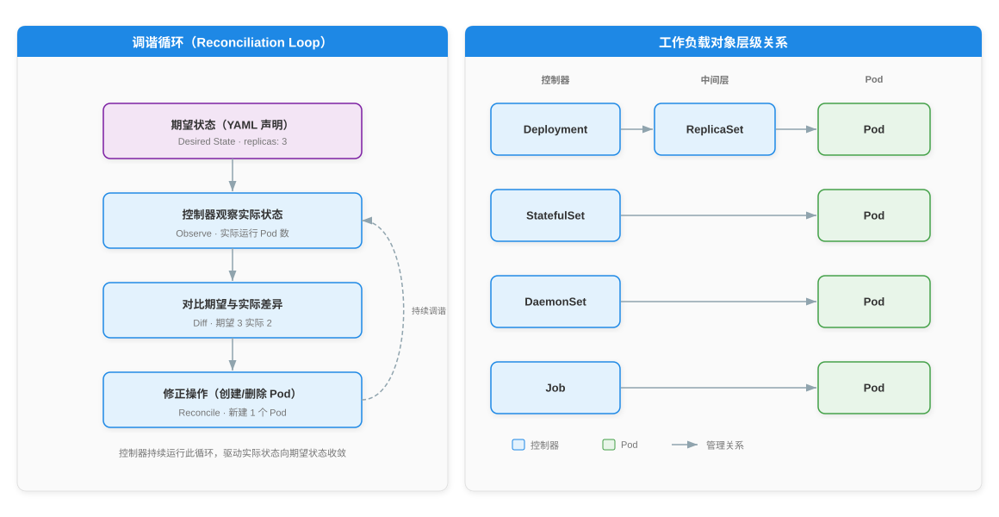

# Kubernetes 工作负载与核心对象详解

> 本文系统阐述 Kubernetes 工作负载体系，涵盖最小调度单元 Pod 的结构与生命周期、Init 容器与 Sidecar 容器的差异、以 ReplicaSet 为代表的控制器调谐模式，以及 Deployment、StatefulSet、DaemonSet、Job、CronJob 五类工作负载对象的职责与适用场景，最后梳理 Label、Selector 与 Namespace 三类组织机制。全文共九个部分：先建立 Pod 与控制器的基础认知，再逐类解析工作负载对象，最后归纳资源组织方式。

---

## 一、概述

工作负载（Workload）是运行于 Kubernetes 上的应用。Kubernetes 提供多种工作负载对象对应不同应用形态：无状态应用用 Deployment，有状态应用用 StatefulSet，节点级守护进程用 DaemonSet，批处理任务用 Job 与 CronJob。这些对象均以 Pod 为最小调度单元，通过控制器（Controller）持续驱动实际状态向期望状态收敛。

| 工作负载对象 | 应用形态 | 核心能力 |
|---|---|---|
| Deployment | 无状态应用 | 滚动更新与回滚，管理 ReplicaSet |
| StatefulSet | 有状态应用 | 稳定网络标识与持久存储，有序部署 |
| DaemonSet | 节点级守护进程 | 每节点运行一个副本 |
| Job | 批处理任务 | 运行至完成 |
| CronJob | 定时任务 | 按 cron 表达式定时运行 Job |

---

## 二、Pod——最小可调度单元

### 2.1 Pod 定义

Pod 是 Kubernetes 中最小可调度单元，由一个或多个共享网络与存储的容器组成。同一个 Pod 内的容器始终协同调度到同一节点，共享上下文，形成一个逻辑主机。

Pod 内容器共享三类资源：

| 共享资源 | 说明 |
|---|---|
| 网络命名空间（Network Namespace） | 所有容器共享同一 IP 与端口空间，可通过 localhost 互访 |
| IPC | 容器间可通过 SystemV 信号量或 POSIX 共享内存通信 |
| Volume | Pod 定义的存储卷可挂载到每个容器的文件系统中 |

### 2.2 pause 容器

每个 Pod 创建时，容器运行时会首先启动一个 pause 容器（又称基础设施容器）。pause 容器持有 Pod 的网络命名空间与 IPC 命名空间，Pod 内其他容器启动时共享该命名空间。pause 容器的生命周期与 Pod 一致，其存在保证了 Pod 内网络环境的稳定性。

### 2.3 Pod 生命周期

Pod 的生命周期由阶段（Phase）表示，共五种取值：

| 阶段 | 说明 |
|---|---|
| Pending | Pod 已创建，容器尚未全部就绪；可能正在调度或拉取镜像 |
| Running | Pod 已绑定节点，所有容器已创建且至少一个正在运行 |
| Succeeded | Pod 内所有容器成功终止且不会重启 |
| Failed | Pod 内所有容器已终止，且至少一个容器失败终止 |
| Unknown | 无法确定 Pod 状态，通常因控制面与节点通信中断 |

### 2.4 Init 容器

Init 容器在应用容器之前按声明顺序依次运行。每个 Init 容器必须成功退出后，下一个 Init 容器才会启动；全部 Init 容器完成后，应用容器才会启动。Init 容器常用于初始化环境、等待依赖服务就绪或准备配置文件。

### 2.5 Sidecar 容器

Sidecar 容器是与主应用容器在同一 Pod 内共同运行的辅助容器，提供日志转发、监控代理、服务网格代理等增强功能。Kubernetes 对 Sidecar 的原生支持经历了三个阶段：v1.28 引入 Alpha，v1.29 进入 Beta 并默认启用，v1.33 转为 Stable（GA）。

原生 Sidecar 通过在 initContainers 中声明 restartPolicy: Always 实现。此类容器在应用容器之前启动并持续运行，其就绪状态参与 Pod 就绪判定，且在应用容器退出后才终止，解决了传统 Sidecar 启动顺序不可控与 Job 无法完成的问题。

### 2.6 重启策略

Pod 级别的 restartPolicy 控制容器退出后的重启行为：

| 取值 | 说明 |
|---|---|
| Always（默认） | 容器退出后总是重启 |
| OnFailure | 容器以非零状态退出时重启 |
| Never | 容器退出后不重启 |

### 2.7 Init 容器与 Sidecar 容器对比

| 维度 | Init 容器 | Sidecar 容器 |
|---|---|---|
| 声明位置 | initContainers | initContainers（restartPolicy: Always） |
| 运行时机 | 应用容器前，按序运行 | 应用容器前启动，与应用容器并行持续运行 |
| 退出行为 | 必须成功退出才继续 | 持续运行，不因成功退出而结束 |
| 重启策略 | 继承 Pod restartPolicy | 固定 restartPolicy: Always |
| 典型用途 | 初始化配置、等待依赖 | 日志转发、监控代理、mTLS 代理 |
| GA 版本 | 早期稳定特性 | v1.33 Stable |

---

## 三、控制器模式与 ReplicaSet

### 3.1 控制器与 Label Selector

控制器是 Kubernetes 调谐循环的执行者。每类工作负载对象背后都有一个控制器，它通过标签选择器（Label Selector）筛选出自己管理的 Pod 集合，持续观察这些 Pod 的实际数量与状态，并与期望状态对比，差异驱动修正操作。

### 3.2 ReplicaSet

ReplicaSet 的核心职责是维持期望副本数：当实际运行的 Pod 少于期望值时创建新 Pod，多于期望值时删除多余 Pod。ReplicaSet 通过 spec.selector 匹配 Pod 标签，通过 spec.replicas 声明期望副本数。

### 3.3 调谐循环

控制器的调谐循环（Reconciliation Loop）遵循"观察—对比—修正"的固定模式，驱动副本数持续向期望值收敛：

1. 控制器通过 Label Selector 观察实际运行的 Pod 数量
2. 将实际数量与 spec.replicas 声明的期望值对比
3. 若实际少于期望，创建新 Pod；若实际多于期望，删除多余 Pod
4. 回到观察步骤，持续循环

---

## 四、Deployment

### 4.1 Deployment 与 ReplicaSet 的关系

Deployment 管理 ReplicaSet，ReplicaSet 管理 Pod。用户声明 Deployment 后，Deployment 控制器自动创建 ReplicaSet，由 ReplicaSet 维持 Pod 副本数。更新 Pod 模板时，Deployment 创建新 ReplicaSet 并逐步替换旧 ReplicaSet 管理的 Pod，从而实现滚动更新。

### 4.2 更新策略

Deployment 通过 spec.strategy.type 指定更新策略：

| 策略 | 说明 |
|---|---|
| RollingUpdate（默认） | 逐步创建新 Pod 并删除旧 Pod，更新过程中保持可用 |
| Recreate | 先删除全部旧 Pod，再创建新 Pod，更新期间存在停机 |

RollingUpdate 策略通过两个参数控制滚动节奏：

| 参数 | 说明 | 默认值 |
|---|---|---|
| maxSurge | 滚动过程中允许超出期望副本数的最大值或百分比 | 25% |
| maxUnavailable | 滚动过程中允许不可用副本数的最大值或百分比 | 25% |

### 4.3 历史版本与回滚

Deployment 通过 revisionHistoryLimit 控制保留的历史 ReplicaSet 数量，默认为 10。每个 ReplicaSet 对应一次 Pod 模板修订，可用于回滚。回滚通过 kubectl rollout undo 命令执行，将 Pod 模板恢复到上一修订或指定修订。

### 4.4 RollingUpdate 与 Recreate 对比

| 维度 | RollingUpdate | Recreate |
|---|---|---|
| 停机时间 | 无（新旧 Pod 共存） | 有（旧 Pod 全部删除后才开始创建新 Pod） |
| 资源占用 | 更新期间需额外资源运行新 Pod | 无额外资源占用 |
| 适用场景 | 可容忍多版本并存的在线服务 | 不兼容多版本并存的应用（如单实例数据存储） |

---

## 五、StatefulSet

### 5.1 有状态应用需求

StatefulSet 面向有状态应用，提供三项核心保证：有序部署与扩缩、稳定网络标识、稳定持久存储。适用于数据库、消息队列等需要稳定标识与独立存储的应用。

### 5.2 稳定网络标识

StatefulSet 管理的 Pod 具有稳定的命名规则：&lt;statefulset-name&gt;-&lt;序号&gt;，从 0 开始递增。配合 Headless Service，每个 Pod 获得独立的 DNS 记录，即使 Pod 被重新调度到其他节点，DNS 名称仍指向该 Pod。

### 5.3 稳定持久存储

StatefulSet 通过 volumeClaimTemplates 为每个 Pod 自动创建独立的 PVC。当 Pod 被重新调度时，PVC 不会删除，新 Pod 会重新挂载同一 PVC，从而保留数据。

### 5.4 Pod 管理策略

StatefulSet 通过 spec.podManagementPolicy 控制 Pod 的创建与删除顺序：

| 策略 | 说明 |
|---|---|
| OrderedReady（默认） | Pod 按序号顺序创建与删除，前一个就绪后才创建下一个 |
| Parallel | Pod 并行创建与删除，不等待前一个就绪 |

### 5.5 Deployment 与 StatefulSet 适用场景对比

| 维度 | Deployment | StatefulSet |
|---|---|---|
| 应用类型 | 无状态应用 | 有状态应用 |
| Pod 标识 | 随机名称，可替换 | 稳定名称 &lt;sts&gt;-&lt;序号&gt;，不可互换 |
| 网络标识 | 通过 Service 负载均衡 | 通过 Headless Service 提供独立 DNS |
| 存储 | 共享或无存储 | 每个 Pod 绑定独立 PVC |
| 部署顺序 | 并行 | 默认有序，可配置并行 |
| 典型场景 | Web 服务、API 服务 | 数据库、消息队列、分布式存储 |

---

## 六、DaemonSet

### 6.1 节点级守护进程

DaemonSet 确保每个节点上运行一个 Pod 副本（默认行为）。当集群新增节点时，DaemonSet 自动在其上调度 Pod；当节点移除时，DaemonSet 自动清理对应 Pod。常用于日志采集、监控 Agent、容器网络插件（CNI）等节点级守护进程。

### 6.2 调度范围控制

DaemonSet 可通过 nodeSelector 或节点亲和性规则限制 Pod 仅运行在符合条件的节点上，而非全部节点。

---

## 七、Job 与 CronJob

### 7.1 Job

Job 负责运行至完成的任务，适用于批处理、数据迁移、计算任务等。Job 通过以下参数控制执行行为：

| 参数 | 说明 |
|---|---|
| completions | 任务完成所需的成功 Pod 数 |
| parallelism | 并行运行的 Pod 数 |
| backoffLimit | 失败重试上限，达到后 Job 标记为失败 |

### 7.2 CronJob

CronJob 基于 cron 表达式定时创建 Job，适用于定期备份、报表生成、清理任务等周期性作业。CronJob 通过 spec.schedule 字段指定 cron 表达式，通过 spec.jobTemplate 定义 Job 模板。

### 7.3 适用场景

| 对象 | 适用场景 |
|---|---|
| Job | 一次性批处理、数据迁移、离线计算 |
| CronJob | 定期备份、定时报表、周期性清理 |

---

## 八、Label、Selector 与 Namespace

### 8.1 Label

标签（Label）是附加在 Kubernetes 资源上的键值对，用于标识与组织资源。Label 不提供唯一性，同一 Label 可附加在多个资源上，同一资源也可拥有多个 Label。

### 8.2 Selector

选择器（Selector）用于根据 Label 筛选资源，支持两种匹配方式：

| 匹配方式 | 语法 | 示例 |
|---|---|---|
| 等值匹配 | key = value / key != value | app = nginx |
| 集合匹配 | key in (v1, v2) / key notin (v1, v2) | tier in (frontend, backend) |

### 8.3 Namespace

命名空间（Namespace）是集群内的逻辑分区，用于资源隔离与配额管理。Kubernetes 默认提供以下命名空间：

| Namespace | 用途 |
|---|---|
| default | 未指定 Namespace 时默认使用 |
| kube-system | Kubernetes 系统组件运行 |
| kube-public | 公共资源，所有用户可读 |
| kube-node-lease | 节点心跳租约 |

### 8.4 工作负载对象适用场景汇总

| 对象 | 应用形态 | 是否有状态 | 典型场景 |
|---|---|---|---|
| Deployment | 无状态在线服务 | 否 | Web 服务、API 服务 |
| StatefulSet | 有状态应用 | 是 | 数据库、消息队列 |
| DaemonSet | 节点级守护进程 | 否 | 日志采集、监控 Agent |
| Job | 批处理任务 | 否 | 数据迁移、离线计算 |
| CronJob | 定时任务 | 否 | 定期备份、定时报表 |

---

## 参考资料

- [Kubernetes 官方文档 - Pod](https://kubernetes.io/zh-cn/docs/concepts/workloads/pods/)
- [Kubernetes 官方文档 - 工作负载](https://kubernetes.io/zh-cn/docs/concepts/workloads/)
- [Kubernetes 官方文档 - Deployment](https://kubernetes.io/zh-cn/docs/concepts/workloads/controllers/deployment/)
- [Kubernetes 官方文档 - StatefulSet](https://kubernetes.io/zh-cn/docs/concepts/workloads/controllers/statefulset/)
- [Kubernetes 官方文档 - DaemonSet](https://kubernetes.io/zh-cn/docs/concepts/workloads/controllers/daemonset/)
- [Kubernetes 官方文档 - Job](https://kubernetes.io/zh-cn/docs/concepts/workloads/controllers/job/)
- [Kubernetes 官方文档 - CronJob](https://kubernetes.io/zh-cn/docs/concepts/workloads/controllers/cron-jobs/)
- [Kubernetes 官方文档 - Init 容器](https://kubernetes.io/zh-cn/docs/concepts/workloads/pods/init-containers/)
- [Kubernetes 官方文档 - Sidecar 容器](https://kubernetes.io/zh-cn/docs/concepts/workloads/pods/sidecar-containers/)
- [KEP-753: Sidecar Containers](https://github.com/kubernetes/enhancements/blob/master/keps/sig-node/753-sidecar-containers/README.md)
