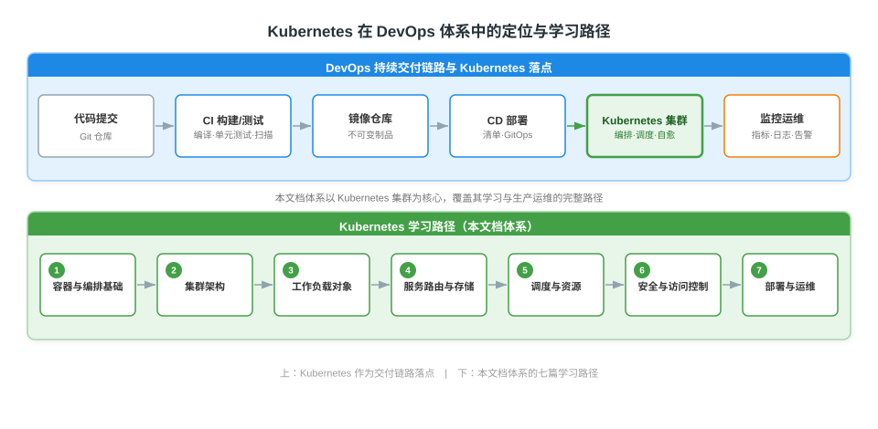
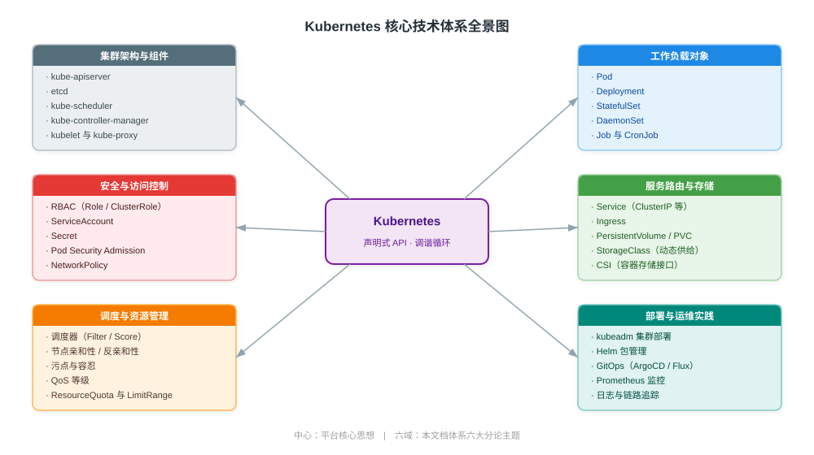

# Kubernetes 技术体系总论

> 本文为 Kubernetes 系列文档的总论篇，系统阐述容器编排的由来、Kubernetes 在 DevOps 体系中的定位、核心设计思想、技术体系全景及学习路径。后续六篇分论将围绕集群架构、工作负载、服务路由与存储、调度与资源、安全与访问控制、部署与运维逐项展开。阅读本文可建立整体认知框架，为深入学习各分论奠定基础。

---

## 一、容器编排的由来

### 1.1 从单机容器到编排需求

Docker 通过 Linux 命名空间（Namespaces）与控制组（Cgroups）将应用及其依赖打包成可移植的容器，解决了"开发可用、生产不可用"的环境一致性问题。但单机容器无法解决生产环境面临的三类规模化挑战：

| 挑战 | 单机容器的能力局限 | 编排系统的职责 |
|------|--------------------|----------------|
| 规模调度 | 一台宿主机上手动 `docker run`，无法跨节点选择最优落点 | 按资源需求与约束跨节点自动调度 |
| 故障自愈 | 容器退出即停止，需人工重启 | 节点宕机或副本失效时自动重新调度与重建 |
| 服务发现 | 容器迁移后 IP 变化，调用方无法感知 | 提供稳定虚拟 IP 与 DNS，屏蔽后端变化 |

> **编排（Orchestration）**：协调多个容器在集群中的部署位置、生命周期、网络通信与存储挂载，使其作为一个整体协同工作的能力。Kubernetes 是这一领域的工业级标准实现。

### 1.2 Kubernetes 的定位

Kubernetes（简称 K8s）源于 Google 内部运行了 15 年的 Borg 系统，于 2014 年开源并捐献给 CNCF（Cloud Native Computing Foundation），2015 年发布 1.0。它是一个**生产级、开源的容器编排系统**，用于自动化容器化应用的部署、扩缩容与运维。

其核心价值不在于"运行容器"（这是容器运行时的职责），而在于围绕容器构建一套**声明式的集群管理系统**：用户描述"期望状态"，系统持续驱动"实际状态"向"期望状态"收敛。

---

## 二、Kubernetes 在 DevOps 体系中的定位

DevOps 通过持续集成（CI）与持续交付（CD）打通开发与运维，形成"代码提交 → 构建 → 测试 → 部署 → 运行 → 监控 → 反馈"的闭环。Kubernetes 在这条链路中承担"交付落点"与"运行平台"双重角色：CI 产出的不可变镜像经 CD 部署到 Kubernetes 集群，集群负责后续的运行、调度、自愈与可观测。



### 2.1 与既有文档的关系

本文档体系聚焦 Kubernetes 本身，并与项目中既有文档形成互补，避免概念重复：

| 既有文档 | 覆盖范围 | 与本体系的关系 |
|----------|----------|------------------|
| [Docker 容器技术详解](../Docker/Docker%20容器技术详解.md) | 容器原理、镜像、Docker Engine | 本体系的容器技术前置基础 |
| [CI/CD 持续集成与持续交付详解](../DevOps/CI-CD%20持续集成与持续交付详解.md) | CI/CD 演进、GitOps、DORA 指标 | 本体系 CD 链路的上游 |
| [云原生网络技术详解](../计算机网络/现代网络技术/云原生网络技术详解.md) | CNI、kube-proxy 模式、NetworkPolicy、Service Mesh | 本体系服务路由分论的深入网络参考 |

---

## 三、核心设计思想

Kubernetes 的一切机制都围绕三个核心思想展开，理解它们比记忆任何命令都重要。

### 3.1 声明式 API

用户通过 YAML/JSON 描述资源的**期望状态**（Desired State），而非下达"执行某操作"的命令。例如声明"运行 3 个 Nginx 副本"，而非"启动 3 个容器"。系统据此持续工作，直到实际状态与声明一致。

| 维度 | 命令式（Imperative） | 声明式（Declarative） |
|------|----------------------|------------------------|
| 交互方式 | 下达具体操作指令 | 描述期望结果 |
| 状态来源 | 系统状态由历史操作累积 | 系统状态由声明文件唯一确定 |
| 可审计性 | 操作记录分散 | 声明即事实，可版本化 |
| 幂等性 | 重复执行可能产生副作用 | 重复应用结果一致 |

### 3.2 调谐循环（Reconciliation Loop）

控制器（Controller）持续运行"观察实际状态 → 对比期望状态 → 施加修正操作"的循环，驱动系统收敛。这一模式使系统具备**自愈**能力：副本被删除则重建，节点宕机则迁移，配置变更则滚动更新。

```
期望状态（YAML 声明）
        │
        ▼
   ┌──────────┐    观察实际状态
   │ 控制器   │ ◄────────────── 集群实际状态
   │ Controller│ ──────────────► 修正操作（创建/删除/更新）
   └──────────┘
        ▲
        │ 对比差异
```

### 3.3 不可变基础设施（Immutable Infrastructure）

容器镜像一旦构建即不可修改，环境差异通过配置注入而非登录修改。这使得部署可回滚、可重现，环境漂移被根本性消除。

> 这三者的关系：**声明式 API** 定义"要什么"，**调谐循环**保证"实际符合声明"，**不可变基础设施**确保"运行之物稳定一致"。三者共同构成 Kubernetes 自愈、自洽运行的基础。

---

## 四、技术体系全景

Kubernetes 的技术能力可归为六大领域，对应本系列的六篇分论。下图以"声明式 API + 调谐循环"为核心，向外辐射六大能力域。



### 4.1 六大领域概览

| 领域 | 核心问题 | 关键对象 | 对应分论 |
|------|----------|----------|----------|
| 集群架构 | 集群由哪些组件构成、如何协作 | 控制平面、节点组件、etcd | 集群架构与核心组件详解 |
| 工作负载 | 如何描述与运行应用 | Pod、Deployment、StatefulSet、DaemonSet、Job | 工作负载与核心对象详解 |
| 服务路由与存储 | 如何被访问、如何持久化数据 | Service、Ingress、PV、PVC、StorageClass | 服务路由与存储体系详解 |
| 调度与资源 | 应用运行在哪里、用多少资源 | Scheduler、Affinity、Taint、QoS、Quota | 调度与资源管理详解 |
| 安全与访问控制 | 谁能做什么、如何隔离 | RBAC、ServiceAccount、Secret、PSA | 安全与访问控制详解 |
| 部署与运维 | 如何交付与运维 | kubeadm、Helm、GitOps、Prometheus | 集群部署与生产运维实践详解 |

---

## 五、核心术语

| 术语 | 说明 |
|------|------|
| **集群（Cluster）** | 一组协同工作的机器集合，由控制平面与若干节点组成 |
| **控制平面（Control Plane）** | 集群的"大脑"，负责全局决策与响应集群事件，包括 kube-apiserver、etcd、kube-scheduler、kube-controller-manager |
| **节点（Node）** | 集群的工作机器（旧称 Minion），运行 kubelet、kube-proxy 与容器运行时，承载实际工作负载 |
| **Pod** | Kubernetes 最小可调度单元，内含一个或多个共享网络与存储的容器 |
| **调度（Scheduling）** | 决定 Pod 运行在哪个节点的决策过程 |
| **标签与选择器（Label / Selector）** | 附加在资源上的键值对，用于过滤与关联资源 |
| **命名空间（Namespace）** | 集群内的逻辑分区，用于资源隔离与配额管理 |
| **声明式 API（Declarative API）** | 通过描述期望状态而非操作步骤来管理系统 |
| **控制器（Controller）** | 运行调谐循环、驱动实际状态向期望状态收敛的组件 |

---

## 六、学习路径与文档体系

本系列按"由架构到对象、由对象到访问、由访问到调度、由调度到安全、由安全到运维"的认知顺序组织。建议按序学习，每篇分论聚焦一个领域，前后呼应。

| 顺序 | 文档 | 学习重点 | 前置依赖 |
|------|------|----------|----------|
| 1 | Kubernetes 技术体系总论（本文） | 建立整体框架与核心思想 | 容器基础 |
| 2 | Kubernetes 集群架构与核心组件详解 | 控制平面与节点组件、请求链路 | 本文 |
| 3 | Kubernetes 工作负载与核心对象详解 | Pod 与各类控制器、调谐循环 | 架构篇 |
| 4 | Kubernetes 服务路由与存储体系详解 | Service/Ingress 与 PV/PVC/CSI | 工作负载篇 |
| 5 | Kubernetes 调度与资源管理详解 | 调度决策、QoS、亲和性、配额 | 工作负载篇 |
| 6 | Kubernetes 安全与访问控制详解 | 认证/鉴权/准入、RBAC、PSA | 架构篇、工作负载篇 |
| 7 | Kubernetes 集群部署与生产运维实践详解 | kubeadm、Helm、GitOps、可观测性 | 全部前序 |

---

## 参考资料

- [Kubernetes 官方文档 - 概念总览](https://kubernetes.io/zh-cn/docs/concepts/)
- [Kubernetes 官方文档 - 架构](https://kubernetes.io/zh-cn/docs/concepts/overview/components/)
- [CNCF Cloud Native Definition v1.0](https://github.com/cncf/foundation/blob/main/charter.md)
- [Kubernetes 站点 - 什么是 Kubernetes](https://kubernetes.io/zh-cn/docs/concepts/overview/)
- [Google - Borg, Omega, and Kubernetes（ACM Queue）](https://queue.acm.org/detail.cfm?id=2898444)
