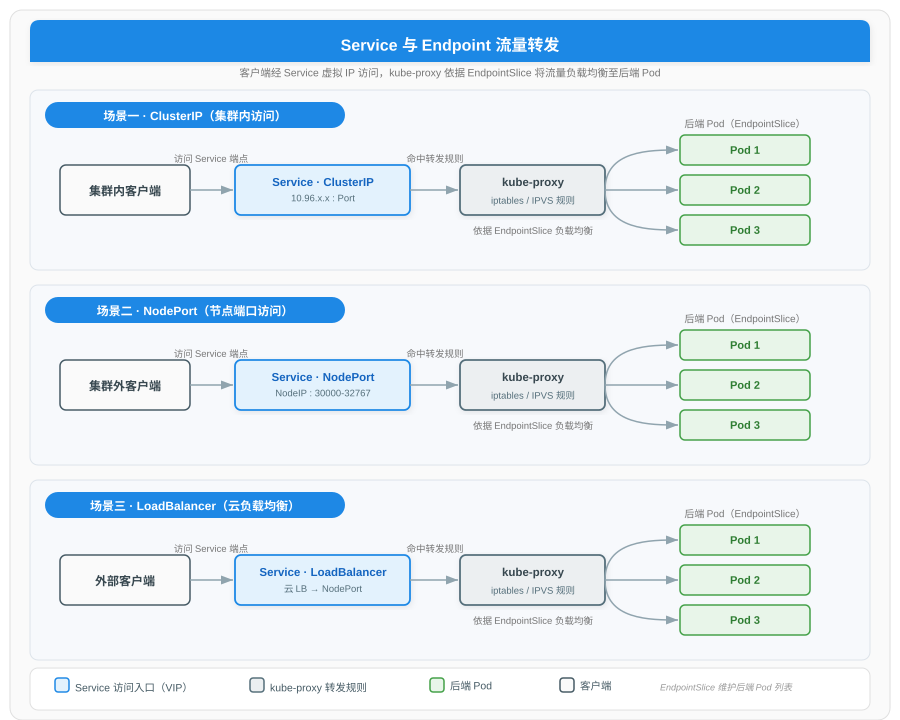
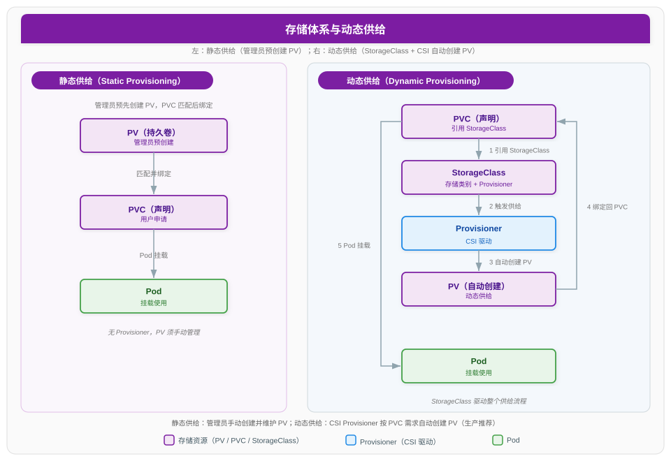

# Kubernetes 服务路由与存储体系详解

> 本文为 Kubernetes 系列文档的第四篇分论，聚焦"如何被访问"与"如何持久化"两大主题。服务侧覆盖 Service 的四种类型（ClusterIP、NodePort、LoadBalancer、ExternalName）、Endpoints/EndpointSlice 机制、CoreDNS 服务发现、Headless Service，以及七层入口 Ingress 与 IngressClass；存储侧覆盖 Volume 体系、PersistentVolume/PVC 的静态供给、accessModes 与 reclaimPolicy，再到 StorageClass 动态供给与 CSI 标准化接口。kube-proxy 数据平面细节、NetworkPolicy 与 Service Mesh 已在 [云原生网络技术详解](../计算机网络/现代网络技术/云原生网络技术详解.md) 中深入展开，本文仅做必要衔接。

---

## 一、概述

Pod 是临时的：被调度、被重建、IP 随之变化。若调用方直接持有 Pod IP，一旦后端 Pod 重组，通信即断裂。Kubernetes 以 **Service** 抽象解决这一问题——为一组具备相同 Label 的 Pod 提供稳定的虚拟 IP（VIP）与 DNS 名，屏蔽后端变化。

与此对应，容器重启后本地文件丢失，业务数据需要持久化。Kubernetes 以 **Volume** 体系解决存储问题：从 Pod 内共享目录，到集群级的 PersistentVolume（PV）与用户声明 PersistentVolumeClaim（PVC），再到 StorageClass 驱动的动态供给与 CSI 标准接口，形成一条从"声明需求"到"自动供给"的完整链路。

服务路由负责"流量如何到达 Pod"，存储体系负责"数据如何留存"，二者共同构成 Pod 之上不可或缺的运行支撑。

---

## 二、Service 与服务发现

Service 是一层四层（TCP/UDP）负载均衡抽象。它通过 Label Selector 选定一组后端 Pod，由集群中的 kube-proxy 在每个节点上编程转发规则，将到达 Service VIP 的流量分发到健康的后端 Pod。



### 2.1 Service 的四种类型

Service 通过 `spec.type` 字段区分暴露方式。四种类型自底向上递进：ClusterIP 是基础，NodePort 在其上开放节点端口，LoadBalancer 进一步借助云平台负载均衡器，ExternalName 则走向外部域名映射。

| 类型 | 访问范围 | 端口/地址特征 | 典型场景 |
|------|----------|----------------|----------|
| ClusterIP | 集群内部 | 默认类型，分配集群虚拟 IP（如 10.96.x.x） | 内部服务互访 |
| NodePort | 集群外部（经节点 IP） | 在每个节点开放端口，默认范围 30000-32767 | 测试或裸金属集群对外暴露 |
| LoadBalancer | 集群外部（经云负载均衡器） | 云提供商分配外部 IP，并自动创建 NodePort | 云上生产环境对外发布 |
| ExternalName | 集群内部 → 外部域名 | 返回 CNAME 记录，不分配 VIP，无代理转发 | 将外部服务映射为集群内 Service |

> NodePort 默认端口范围由 kube-apiserver 的 `--service-node-port-range` 标志控制，默认值为 `30000-32767`。LoadBalancer 类型依赖集群运行的云控制器管理器（Cloud Controller Manager）调用云厂商 API 创建外部负载均衡器；在非云环境中通常配合 MetalLB 等替代实现。

### 2.2 Endpoints 与 EndpointSlice

Service 通过 Label Selector 关联后端 Pod，但 Selector 本身不存储"当前有哪些 Pod 健康"。这一职责由 **Endpoints** 与其演进版本 **EndpointSlice** 承担。

- **Endpoints**：早期的端点表示，一个 Service 对应一个 Endpoints 对象，集中存放所有后端 Pod IP。
- **EndpointSlice**：将端点分片存储，每个 Slice 默认最多容纳 100 个端点。当后端 Pod 规模较大时，分片使得端点变更只需下发局部更新，显著降低 kube-proxy 与 apiserver 的同步开销，是当前推荐机制。

EndpointSlice 由集群中的端点控制器根据 Pod 状态自动维护，kube-proxy 监听 EndpointSlice 并据此重写节点上的转发规则。

### 2.3 Service DNS

Kubernetes 集群默认部署 **CoreDNS**，为 Service 提供集群内 DNS 解析。普通 Service 会解析到其 ClusterIP，DNS 记录格式为：

```
<service>.<namespace>.svc.cluster.local
```

例如 namespace `prod` 中的 Service `order-svc`，集群内任意 Pod 都可通过 `order-svc.prod.svc.cluster.local`（或简写 `order-svc.prod`、`order-svc`）访问，DNS 返回该 Service 的 ClusterIP。

### 2.4 Headless Service

当 Service 设置 `clusterIP: None` 时，称为 **Headless Service**。它不分配虚拟 IP，DNS 查询直接返回后端每个 Pod 的 IP，客户端自行选择目标并直连。

Headless Service 的典型用途是配合 **StatefulSet**：StatefulSet 为每个 Pod 生成稳定且有序的 DNS 名（如 `pod-0.svc.namespace.svc.cluster.local`），使得每个有状态副本都能被独立寻址，常用于数据库主从、分布式一致性集群等需要稳定标识的场景。

---

## 三、Ingress 与 Ingress Controller

Service 工作在四层，对外发布 HTTP 服务时缺乏按域名、路径路由的能力。**Ingress** 提供 七层（HTTP/HTTPS）入口抽象，可基于主机名与路径将外部流量路由到集群内的不同 Service。

### 3.1 Ingress 资源

Ingress 是一组路由规则的声明，典型能力包括：

- 基于主机名（host）的虚拟主机路由
- 基于 URL 路径（path）转发到不同 Service
- 配置 TLS 终结（HTTPS）

Ingress 本身只是 API 对象，不会自行处理流量，必须依赖实际运行的 Ingress Controller 才能生效。

### 3.2 Ingress Controller

**Ingress Controller** 是 Ingress 规则的实际实现者，通常以 Pod 形式部署在集群中，监听 Ingress 资源变化并据此配置底层数据平面（如 Nginx、Envoy、HAProxy）。常见实现包括 ingress-nginx、Traefik、HAProxy Ingress 等，云厂商也提供各自的入口控制器。

### 3.3 IngressClass

自 Kubernetes 1.18 起引入 **IngressClass**，用于标识一个 Ingress 资源由哪个 Ingress Controller 处理。一个集群可同时运行多个控制器，每个控制器关联一个 IngressClass；Ingress 通过 `spec.ingressClassName` 字段引用所属的 IngressClass。IngressClass 在 1.19 进入 GA。

### 3.4 ingress-nginx 退役与 Gateway API

历史上最流行的 ingress-nginx 控制器已进入退役流程：Kubernetes SIG Network 与安全响应委员会于 2025 年 11 月正式宣布其退役，2026 年 3 月起停止维护并将仓库归档为只读，不再发布新版本与安全补丁。现有部署可继续运行，但社区推荐迁移至 **Gateway API**——这是 Kubernetes 官方主导的下一代七层流量管理标准，通过 GatewayClass、Gateway、HTTPRoute 等 CRD 提供比 Ingress 更强的多协议、流量切分与多租户能力。

> Gateway API 的资源模型、ingress-nginx 退役细节与迁移路径，已在 [云原生网络技术详解](../计算机网络/现代网络技术/云原生网络技术详解.md) 中完整覆盖，本文不再展开。

---

## 四、kube-proxy 工作模式（简述）

kube-proxy 是 Service 抽象在节点上的数据平面实现，负责将到达 Service VIP 的流量转发到后端 Pod。其主要工作模式包括：

- **iptables 模式**（默认）：通过 iptables 规则做 DNAT 与随机负载均衡，规则链在大规模 Service 下线性增长。
- **ipvs 模式**：基于内核 IPVS，支持 rr、lc、sh 等多种调度算法，在大规模集群下性能与扩展性更优。

> kube-proxy 各模式的底层数据路径、iptables/IPVS 规则细节、eBPF 替代方案以及 Service Mesh 的演进，已在 [云原生网络技术详解](../计算机网络/现代网络技术/云原生网络技术详解.md) 中深入剖析，此处仅作衔接。

---

## 五、Volume 体系

Kubernetes 的 **Volume** 是 Pod 内容器共享的存储目录，其生命周期与 Pod 绑定（Pod 删除则 Volume 一并释放）。Volume 在 Pod 规约的 `spec.volumes` 中定义，并在容器的 `volumeMounts` 中挂载到指定路径，同 Pod 内多个容器可共享同一 Volume。

不同 Volume 类型对应不同的数据来源与生命周期，选型取决于是否需要持久化、是否跨节点共享、数据来自何处。

| Volume 类型 | 生命周期 | 数据来源 | 典型用途 |
|-------------|----------|----------|----------|
| emptyDir | 随 Pod，Pod 删除即消失 | 临时空目录 | 容器间共享临时缓存 |
| hostPath | 随节点 | 节点主机目录 | 访问节点级系统资源（需谨慎，有安全风险） |
| configMap | 随 Pod | ConfigMap 数据 | 注入配置文件 |
| secret | 随 Pod | Secret 数据 | 注入证书、密钥等敏感信息 |
| nfs | 随 Pod | NFS 共享存储 | 跨节点共享文件 |
| persistentVolumeClaim | 随 Pod（但底层数据持久） | 绑定的 PersistentVolume | 持久化业务数据 |

> 上表中前几类 Volume 数据随 Pod 消亡而丢失或仅节点本地，无法满足跨 Pod 重建后的数据持久化需求，因此生产场景的持久化存储通常使用 `persistentVolumeClaim` 类型，对接下文的 PV/PVC 体系。

---

## 六、PersistentVolume 与 PVC

当数据需要跨 Pod 生命周期持久化时，需引入集群级的存储资源抽象。**PersistentVolume（PV）** 与 **PersistentVolumeClaim（PVC）** 将"存储供给"与"存储消费"解耦：PV 是集群管理员提供的存储资源，PVC 是用户对存储的声明（申请），二者通过容量与访问模式匹配后绑定。

### 6.1 静态供给

**静态供给（Static Provisioning）** 是最基础的供给方式：

1. 集群管理员手动创建 PV，声明其容量、访问模式与底层存储后端（如 NFS、iSCSI）。
2. 用户创建 PVC，声明所需容量与访问模式。
3. Kubernetes 控制器寻找满足 PVC 要求的 PV，找到后完成绑定。

静态供给要求管理员预先估算并创建 PV，无法按需自动扩容，运维成本较高。

### 6.2 访问模式（accessModes）

accessModes 描述 PV 可被多少节点/Pod 以何种方式挂载，是 PV 与 PVC 匹配的关键维度之一。

| 模式 | 缩写 | 含义 |
|------|------|------|
| ReadWriteOnce | RWO | 单节点读写 |
| ReadOnlyMany | ROX | 多节点只读 |
| ReadWriteMany | RWX | 多节点读写 |
| ReadWriteOncePod | RWOP | 单 Pod 读写（Kubernetes 1.27 起 GA） |

> 某种访问模式是否被支持取决于底层存储后端能力。例如 RWX 通常需要 NFS、CephFS 等共享文件系统，块存储一般仅支持 RWO。

### 6.3 回收策略（reclaimPolicy）

当 PVC 被删除后，与之绑定的 PV 如何处理由 reclaimPolicy 决定。

| 策略 | 行为 | 说明 |
|------|------|------|
| Retain | 保留 PV 与底层数据 | PVC 删除后 PV 进入 Released 状态，数据保留，需管理员手动回收后才能再次绑定 |
| Delete | 删除 PV 及底层存储资源 | 依赖存储插件删除对应卷，常用于动态供给的云盘 |
| Recycle | 清空数据后保留 PV | 已废弃，不再推荐，可用作业替代 |

> 生产环境中，对重要数据通常选用 Retain 以防误删；动态供给的云原生存储多默认 Delete。Recycle 已被废弃，新场景不应使用。

---

## 七、StorageClass 与动态供给

静态供给难以应对规模与按需诉求。**StorageClass** 引入"存储类别"抽象，配合 **CSI** 驱动实现 PV 的自动创建，即动态供给。



### 7.1 StorageClass

**StorageClass** 用于定义存储的"类别"与供给方式，核心字段包括：

- `provisioner`：决定由哪个存储插件（CSI 驱动）创建 PV。
- `parameters`：传递给 provisioner 的参数，如磁盘类型、副本数、性能等级。
- `reclaimPolicy`：动态创建的 PV 默认回收策略（Retain 或 Delete）。
- `volumeBindingMode`：绑定时机，`Immediate` 立即绑定，`WaitForFirstConsumer` 延迟到 Pod 调度时再绑定（便于拓扑感知）。

集群中可定义多个 StorageClass，其中一个可标记为默认（`is-default-class: "true"`），未显式指定 StorageClass 的 PVC 将使用默认类。

### 7.2 动态供给流程

**动态供给（Dynamic Provisioning）** 的完整流转如下：

1. 用户创建 PVC，通过 `spec.storageClassName` 指定目标 StorageClass。
2. StorageClass 关联的 provisioner 监听到该 PVC，校验并准备供给。
3. provisioner 调用底层存储接口创建实际存储卷，并在集群中生成对应的 PV。
4. Kubernetes 将该 PV 与发起请求的 PVC 自动绑定。
5. Pod 通过 `persistentVolumeClaim` 卷类型引用该 PVC，kubelet 将底层存储挂载到 Pod 内。

动态供给无需管理员逐个预创建 PV，按需创建、即用即生，是生产环境推荐方式。

### 7.3 CSI（Container Storage Interface）

**CSI（容器存储接口）** 是一个标准化规范，定义了容器编排系统与存储插件之间的统一接口，目标是解耦 Kubernetes 与存储厂商实现。

- 在 CSI 之前，存储插件需编译进 Kubernetes 核心代码（in-tree 插件），导致厂商耦合、发布受限。
- CSI 将存储能力以独立容器化组件（Sidecar + 驱动）形式部署，通过 gRPC 与 kubelet 通信，提供卷的创建、附加、挂载、快照、扩容等能力。
- Kubernetes 自 1.13 起 CSI 进入 GA，in-tree 插件逐步迁移至 CSI（CSIMigration），新存储后端均以 CSI 形式接入。

> 至此，存储体系从"Pod 内临时目录"演进到"声明式 PVC + CSI 自动供给"，形成与 Service 路由对称的声明式资源管理范式：用户声明需求（PVC），系统驱动供给（StorageClass + CSI），最终挂载到 Pod 使用。

---

## 参考资料

- [Kubernetes 官方文档 - Service](https://kubernetes.io/zh-cn/docs/concepts/services-networking/service/)
- [Kubernetes 官方文档 - EndpointSlice](https://kubernetes.io/zh-cn/docs/concepts/services-networking/endpoint-slices/)
- [Kubernetes 官方文档 - Service 与 Pod 的 DNS](https://kubernetes.io/zh-cn/docs/concepts/services-networking/dns-pod-service/)
- [Kubernetes 官方文档 - Ingress](https://kubernetes.io/zh-cn/docs/concepts/services-networking/ingress/)
- [Kubernetes 官方文档 - IngressClass](https://kubernetes.io/zh-cn/docs/concepts/services-networking/ingress/#ingress-class)
- [Kubernetes 官方文档 - Ingress 控制器](https://kubernetes.io/zh-cn/docs/concepts/services-networking/ingress-controllers/)
- [Kubernetes 官方博客 - Ingress NGINX Retirement](https://kubernetes.io/blog/2025/11/11/ingress-nginx-retirement/)
- [Kubernetes 官方文档 - Gateway API](https://kubernetes.io/zh-cn/docs/concepts/services-networking/gateway/)
- [Kubernetes 官方文档 - Volume](https://kubernetes.io/zh-cn/docs/concepts/storage/volumes/)
- [Kubernetes 官方文档 - PersistentVolume](https://kubernetes.io/zh-cn/docs/concepts/storage/persistent-volumes/)
- [Kubernetes 官方文档 - StorageClass](https://kubernetes.io/zh-cn/docs/concepts/storage/storage-classes/)
- [Kubernetes 官方文档 - 容器存储接口 CSI](https://kubernetes.io/zh-cn/docs/concepts/storage/volumes/#csi)
- [Kubernetes 官方文档 - 存储架构与 CSI 迁移](https://kubernetes-csi.github.io/docs/)
