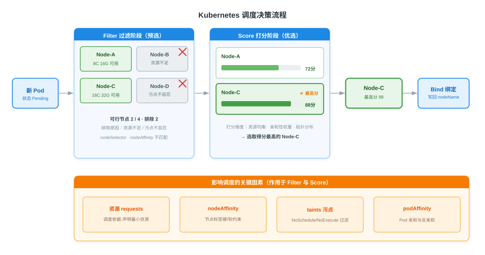

# Kubernetes 调度与资源管理详解

> 本文系统阐述 Kubernetes 调度器的工作机制与资源管理体系。调度（Scheduling）决定 Pod 运行在哪个节点，由 kube-scheduler 通过"过滤（Filter）—打分（Score）—绑定（Bind）"两阶段一绑定完成；资源配置以 requests 声明调度依据、以 limits 约束运行上限，并据此划分 Guaranteed/Burstable/BestEffort 三级 QoS；节点亲和性、Pod 亲和反亲和、污点与容忍从不同维度约束调度决策；ResourceQuota 与 LimitRange 在命名空间层面实现多租户资源治理。全文共八个部分，覆盖从单 Pod 落点选择到集群级配额控制的完整链路。

---

## 一、概述

调度（Scheduling）是 Kubernetes 将 Pod 分配到合适节点运行的过程。集群中每个待调度的 Pod 处于 Pending 状态，调度器为其选择一个节点后写入 `spec.nodeName`，节点上的 kubelet 随后拉起容器。

### 1.1 调度器的角色

kube-scheduler 是 Kubernetes 默认调度器，作为控制平面的组件以独立进程运行。它监听 API Server 上未绑定节点（`nodeName` 为空）的新建 Pod，依据资源可用性与多种约束策略为其挑选最优节点。调度器是"无状态"的——决策所需信息全部来自集群状态（节点资源、标签、污点、已有 Pod 分布），因此可多副本水平扩展，通过领导者选举保证同一时刻只有一个实例生效。

### 1.2 调度的位置

调度处于控制器调谐循环与节点执行之间：控制器创建 Pod 副本 → 调度器选定节点 → kubelet 启动容器。一旦 Pod 被绑定到某节点，默认不再重新调度，除非该节点失效触发驱逐（Eviction）与重建。

> **节点（Node）**：Kubernetes 的工作机，可以是虚拟机或物理机，运行 kubelet 与容器运行时。每个节点带有描述其属性的标签（Labels）与可能排斥 Pod 的污点（Taints）。

---

## 二、调度器两阶段决策

kube-scheduler 为每个待调度 Pod 执行"过滤—打分—绑定"流程：先排除不满足硬性条件的节点，再对剩余可行节点打分排序，最后将 Pod 绑定到得分最高的节点。

### 2.1 决策流程

1. **Filter（预选/过滤）**：遍历所有节点，排除不满足条件的节点。常见排除原因包括节点可用资源不足（无法满足 requests）、节点存在不容忍的污点、nodeSelector/nodeAffinity 标签不匹配、端口冲突等。若所有节点都被排除，Pod 保持 Pending。
2. **Score（优选/打分）**：对过滤后剩余的可行节点逐一打分（0–100 区间）。打分维度包括资源均衡度（LeastAllocated/MostAllocated）、节点亲和性权重、Pod 亲和性权重、拓扑分布均衡、镜像已存在优先等，各维度按权重加权求和。
3. **Bind（绑定）**：选取得分最高的节点，调度器将绑定决策（Pod 名与目标节点名）写回 API Server，Pod 的 `spec.nodeName` 被设置，调度完成。

### 2.2 扩展机制

调度框架（Scheduling Framework）将上述流程拆分为可插拔的扩展点（Filter、Score、Bind、Reserve、Permit 等），允许通过自定义插件替换或追加默认策略，无需修改调度器源码。

---

## 三、资源 requests 与 limits

Kubernetes 通过 requests 与 limits 两个维度声明容器对计算资源的需求，是调度与运行时约束的基础。

### 3.1 requests：调度依据

requests 声明容器运行所需的最小资源量。调度器在 Filter 阶段检查节点是否仍有足够的可分配资源（Allocatable 减去已调度 Pod 的 requests 之和）来容纳新 Pod。requests 不限制运行时实际用量，仅用于调度决策与 QoS 判定。

### 3.2 limits：运行上限

limits 声明容器最多能使用的资源量，由节点上的 cgroups 在运行时强制执行：

- **CPU**：可压缩资源（Compressible Resource）。超限时容器被限流（CPU Throttling），不会被杀死。
- **内存**：不可压缩资源（Incompressible Resource）。超限时容器触发 OOMKilled（Out Of Memory Killed），被内核强制终止。

### 3.3 requests 与 limits 的区别

| 维度 | requests | limits |
|------|----------|--------|
| 作用阶段 | 调度阶段（Filter） | 运行时（cgroups） |
| 语义 | 最小保证资源量 | 最大使用上限 |
| 影响调度 | 是，决定 Pod 能否落到某节点 | 否 |
| 运行时约束 | 否 | 是，CPU 限流、内存 OOM |
| QoS 判定 | 参与 | 参与 |
| 资源单位 | CPU：核/millicores（如 500m）；内存：字节（如 256Mi） | 同 requests |

> 资源单位：CPU 一单位等于 1 核（即 1000 millicores，1m = 0.001 核）；内存可用 Ki/Mi/Gi/Ti 等二进制后缀。`1Mi = 1024×1024 字节`，注意与十进制 `M = 1000×1000 字节` 区分。

---

## 四、QoS 服务质量等级

Kubernetes 根据 Pod 内所有容器的 requests/limits 配置自动为其划分服务质量等级（Quality of Service, QoS）。QoS 决定节点资源紧张时 Pod 被驱逐的优先级。

### 4.1 三级判定规则

| 等级 | 判定条件 | 典型配置 |
|------|----------|----------|
| Guaranteed | Pod 内**每个**容器都设置了 CPU 和内存的 requests 与 limits，且 requests == limits | 生产关键服务，固定资源 |
| Burstable | 至少有一个容器设置了 requests 或 limits，但不满足 Guaranteed | 弹性服务，可超用 |
| BestEffort | Pod 内**所有**容器都未设置 requests 与 limits | 非关键任务，无资源保证 |

### 4.2 驱逐顺序

当节点面临内存压力等资源紧张时，kubelet 按以下顺序驱逐 Pod 以释放资源：

1. **BestEffort**：最先被驱逐，无资源保证。
2. **Burstable**：超出 requests 用量的部分优先被回收。
3. **Guaranteed**：最后被驱逐，只有在系统级紧急情况（如系统守护进程 OOM）下才被终止。

> QoS 是 kubelet 驱逐的依据之一，与调度器的调度决策不直接相关——调度器只看 requests。QoS 等级不可手动指定，由 requests/limits 配置自动推导，可在 `kubectl describe pod` 的 QoS Class 字段查看。

---

## 五、节点亲和性

节点亲和性（Node Affinity）基于节点标签（Node Labels）约束 Pod 可被调度到的节点，是 nodeSelector 的增强版。

### 5.1 常用节点标签

| 标签 | 含义 | 示例值 |
|------|------|--------|
| `kubernetes.io/arch` | 节点 CPU 架构 | amd64、arm64 |
| `kubernetes.io/os` | 节点操作系统 | linux、windows |
| `topology.kubernetes.io/zone` | 拓扑域（可用区） | us-east-1a |
| `topology.kubernetes.io/region` | 拓扑域（地域） | us-east-1 |
| `node-role.kubernetes.io/control-plane` | 控制平面节点角色 | （存在即表示控制平面） |

### 5.2 nodeSelector 与 nodeAffinity 对比

| 维度 | nodeSelector | nodeAffinity |
|------|--------------|--------------|
| 匹配方式 | 简单等值匹配 | 支持等值、范围（In/NotIn/Exists/Gt/Lt）等多种运算符 |
| 约束强度 | 仅硬性约束 | 分硬性（required）与软性（preferred，带权重）两种 |
| 表达能力 | 单组标签 | 多组规则，可组合 matchExpressions 与 matchFields |
| 状态 | 已过时但仍可用，不推荐新用 | 推荐方式 |

### 5.3 两种约束强度

- **requiredDuringSchedulingIgnoredDuringExecution**：硬性约束，Filter 阶段必须满足，否则 Pod 无法调度（保持 Pending）。
- **preferredDuringSchedulingIgnoredDuringExecution**：软性约束，Score 阶段作为加权偏好，满足则加分，不满足也能调度。

> 名称中的 `IgnoredDuringExecution` 表示：Pod 已运行后节点标签变化不会主动驱逐已调度 Pod（节点亲和性仅在调度时生效）。`RequiredDuringExecution` 变体在标准实现中尚未启用。

---

## 六、Pod 亲和性与反亲和性

Pod 亲和性（Pod Affinity）与反亲和性（Pod Anti-Affinity）基于**已有 Pod** 的分布而非节点标签来约束新 Pod 的落点，以拓扑域（topologyKey）为单位计算。

### 6.1 两类方向

- **podAffinity（亲和）**：把新 Pod 调度到与某些目标 Pod 相同的拓扑域（同节点/同 zone），用于"聚拢"协同部署。
- **podAntiAffinity（反亲和）**：把新 Pod 调度到与目标 Pod 不同的拓扑域，用于"分散"避免单点。

### 6.2 required 与 preferred 两种强度

与节点亲和性一致，Pod 亲和/反亲和也分硬性（required）与软性（preferred，带权重）两种。required 通过 Filter 强制，preferred 通过 Score 加权。

### 6.3 典型场景

| 场景 | 策略 | 目标 |
|------|------|------|
| 同应用多副本分散 | podAntiAffinity + preferred，topologyKey 为节点名 | 避免副本集中单节点，提升可用性 |
| 缓存与计算同节点 | podAffinity + required，topologyKey 为节点名 | 减少网络开销，就近访问 |
| 跨可用区分散 | podAntiAffinity + required，topologyKey 为 zone | 容灾，单 zone 故障不影响整体 |

> Pod 亲和/反亲和的计算依赖集群中已有 Pod 的标签与拓扑分布，大规模集群下开销较大。生产中常以更轻量的 `podTopologySpread` 约束替代反亲和实现均匀分布。

---

## 七、污点与容忍（Taints & Tolerations）

污点（Taint）与容忍（Toleration）是一对互补机制：污点作用于节点排斥 Pod，容忍作用于 Pod 允许被调度到带污点的节点。

### 7.1 污点（Taint）

污点格式为 `key=value:effect`，给节点打上"排斥标记"。只有声明了对应容忍的 Pod 才能被调度到该节点（视 effect 而定）。

### 7.2 三种 effect

| effect | 对新 Pod | 对已有不容忍 Pod | 典型用途 |
|--------|----------|------------------|----------|
| NoSchedule | 不调度到该节点 | 不影响（已运行的不驱逐） | 专用节点，仅允许特定 Pod |
| PreferNoSchedule | 尽量不调度，仍可能调度 | 不影响 | 软性排斥，尽力避免 |
| NoExecute | 不调度到该节点 | 驱逐已有不容忍 Pod | 节点维护、问题节点清退 |

### 7.3 容忍（Toleration）与典型场景

容忍声明在 Pod 上，格式与污点对应（key、value、effect、operator）。控制平面节点默认带 `node-role.kubernetes.io/control-plane:NoSchedule` 污点，阻止普通业务 Pod 调度上去；只有显式容忍该污点的 Pod（如网络插件、监控 Agent）才会被调度到控制平面。

> NoExecute 污点可配合 `tolerationSeconds` 字段：Pod 容忍该污点但仅在指定秒数内有效，超时后仍被驱逐，用于优雅迁移。污点与容忍是"节点主动排斥"，与节点亲和性"Pod 主动选择"方向相反，二者配合可实现精细的节点分配。

---

## 八、ResourceQuota 与 LimitRange

ResourceQuota 与 LimitRange 在命名空间（Namespace）层面提供资源治理能力，二者配合实现多租户场景下的资源隔离与配额控制。

### 8.1 ResourceQuota：命名空间级配额

ResourceQuota 限制一个命名空间内各类资源的总量上限，可覆盖：

- 计算资源总量：CPU/内存的 requests 与 limits 总和
- 存储资源总量：PVC 数量、请求容量、按 StorageClass 的配额
- 对象数量：Pod、Service、ConfigMap、Secret 等的数量上限

> 命名空间启用 ResourceQuota 后，新建 Pod 必须设置 requests/limits（受 LimitRange 默认值机制保护），否则被 API Server 拒绝，从而强制租户显式声明资源需求。

### 8.2 LimitRange：命名空间级默认值与上下限

LimitRange 为单个容器或 Pod 设置默认值与边界：

- **default**：未设 limits 的容器自动注入的默认 limits
- **defaultRequest**：未设 requests 的容器自动注入的默认 requests
- **max/min**：容器 requests/limits 的上下限，超出范围的提交被拒绝
- **maxLimitRequestRatio**：limits 与 requests 的最大比值，限制超用倍数

### 8.3 两者协作

| 治理维度 | ResourceQuota | LimitRange |
|----------|---------------|------------|
| 作用对象 | 命名空间总量 | 单个容器/Pod |
| 治理目标 | 限制租户整体用量 | 保证每个工作负载有合理配置 |
| 配合关系 | 强制声明 requests/limits | 为未声明的容器注入默认值 |

二者配合形成"总量上限 + 单元约束"的多租户资源治理体系：LimitRange 保证每个容器都有合规的资源声明，ResourceQuota 保证命名空间整体用量不超限。

---

## 参考资料

- [kube-scheduler 调度器](https://kubernetes.io/zh-cn/docs/reference/command-line-tools-reference/kube-scheduler/)
- [调度框架（Scheduling Framework）](https://kubernetes.io/zh-cn/docs/concepts/scheduling-eviction/scheduling-framework/)
- [为 Pods 和容器管理资源](https://kubernetes.io/zh-cn/docs/concepts/configuration/manage-resources-containers/)
- [配置 Pod 的服务质量（QoS）](https://kubernetes.io/zh-cn/docs/tasks/configure-pod-container/quality-service-pod/)
- [将 Pod 分配给节点（nodeSelector/nodeAffinity）](https://kubernetes.io/zh-cn/docs/concepts/scheduling-eviction/assign-pod-node/)
- [Pod 亲和性与反亲和性](https://kubernetes.io/zh-cn/docs/concepts/scheduling-eviction/assign-pod-node/#inter-pod-affinity-and-anti-affinity)
- [污点和容忍（Taints and Tolerations）](https://kubernetes.io/zh-cn/docs/concepts/scheduling-eviction/taint-and-toleration/)
- [资源配额（Resource Quotas）](https://kubernetes.io/zh-cn/docs/concepts/policy/resource-quotas/)
- [限制范围（Limit Range）](https://kubernetes.io/zh-cn/docs/concepts/policy/limit-range/)
- [Pod 开销（Pod Overhead）](https://kubernetes.io/zh-cn/docs/concepts/scheduling-eviction/pod-overhead/)
