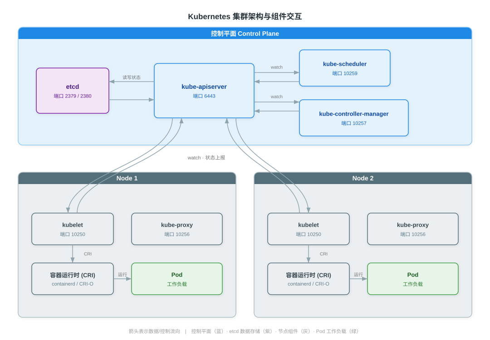

# Kubernetes 集群架构与核心组件详解

> 本文系统讲解 Kubernetes 集群的构成与协作机制，覆盖四个部分：一是控制平面与节点组件的职责、关键特性及监听端口；二是从 kubectl 发起请求到 Pod 运行的 API 请求全链路；三是支撑 Kubernetes 运转的声明式 API 与调谐循环设计；四是控制平面与 etcd 的高可用方案。阅读本文可建立集群架构与组件交互的整体认知，为后续工作负载、调度、安全等分论奠定基础。

---

## 一、概述

一个 Kubernetes 集群由**控制平面（Control Plane）**与若干**节点（Node）**两部分构成。控制平面负责集群的全局决策（调度、状态维护、故障响应），节点负责承载实际的工作负载（Pod）。所有组件围绕 kube-apiserver 协作：控制平面组件与节点组件均作为 kube-apiserver 的客户端，通过 watch 机制感知状态变化并执行各自职责。

| 组成 | 部署位置 | 核心职责 | 典型组件 |
|------|----------|----------|----------|
| 控制平面（Control Plane） | 一个或多个主节点 | 全局决策、集群状态维护、调度与故障自愈 | kube-apiserver、etcd、kube-scheduler、kube-controller-manager、cloud-controller-manager |
| 节点（Node） | 每个工作节点 | 运行并维护 Pod 生命周期 | kubelet、kube-proxy、容器运行时 |

---

## 二、控制平面组件

控制平面是集群的"大脑"，其组件既可全部运行在单一主节点上，也可多副本分布式部署以实现高可用。以下逐一说明各组件的职责、关键特性、监听端口与高可用考量。

### 2.1 kube-apiserver

kube-apiserver 是 Kubernetes API 的前端，是集群中**唯一与 etcd 直接交互的组件**。所有组件、kubectl、Dashboard 及外部系统的请求都经由它处理，它负责认证、鉴权与准入控制后再将数据写入 etcd。

- **关键特性**：无状态（状态全部存于 etcd），可水平扩展；前端通常配置负载均衡器，将请求分发到任一 apiserver 实例。
- **监听端口**：默认 HTTPS **6443**（可通过 `--secure-port` 配置）。

### 2.2 etcd

etcd 是一致性键值（key-value）数据库，是集群状态的**唯一持久化来源**。Pod、Service、ConfigMap、Secret 等所有资源对象均存储于此。

- **关键特性**：基于 **Raft 一致性算法**保证多副本数据一致；只有 kube-apiserver 被允许直接访问。
- **监听端口**：客户端 API **2379**，节点间通信 **2380**。
- **高可用考量**：生产环境建议部署奇数个节点（3 或 5 个），Raft 协议要求多数派（quorum）可用才能写入。

### 2.3 kube-scheduler

kube-scheduler 监听尚未被调度（`nodeName` 为空）的 Pod，根据资源需求与约束为其选择目标节点，并将绑定结果写回 apiserver。

- **关键特性**：采用两阶段调度——**Filter（预选）**过滤不满足约束的节点，**Score（优选）**对候选节点打分排序。
- **监听端口**：默认 **10259**，仅用于自身健康检查与指标（官方文档标注使用者仅为"自身"），调度决策通过与 apiserver 的 watch 通信完成，不向其他组件提供服务端口。

### 2.4 kube-controller-manager

kube-controller-manager 是运行内置控制器（Controller）的进程。每个控制器持续 watch 资源状态并通过调谐循环驱动实际状态向期望状态收敛。

- **关键控制器**：Deployment、ReplicaSet、Node、Endpoint、ServiceAccount、Garbage Collection 等。
- **监听端口**：默认 **10257**，仅用于自身健康检查与指标（官方文档标注使用者仅为"自身"），控制器操作均通过 apiserver 完成。
- **高可用考量**：多副本部署时，通过 leader election（选主）保证同一时刻仅一个实例生效，避免重复调谐。

### 2.5 cloud-controller-manager

cloud-controller-manager 将集群与云厂商能力解耦，使云特定逻辑独立演进。它运行若干与云厂商交互的控制器。

| 控制器 | 职责 |
|--------|------|
| 节点控制器（Node Controller） | 向云厂商 API 查询节点实例状态，更新 Node 对象 |
| 路由控制器（Route Controller） | 在云厂商底层配置子网与路由 |
| 服务控制器（Service Controller） | 管理 LoadBalancer 类型 Service 对应的云负载均衡器 |

### 2.6 控制平面组件汇总

| 组件 | 职责 | 默认端口 | 多副本与高可用 |
|------|------|----------|----------------|
| kube-apiserver | API 前端，唯一写 etcd | 6443（HTTPS） | 无状态，水平扩展，前置 LB |
| etcd | 键值数据库，集群状态唯一持久化 | 2379（客户端）/ 2380（节点间） | Raft 一致性，奇数节点 3/5 |
| kube-scheduler | Pod 调度（Filter/Score） | 10259（自身） | leader election |
| kube-controller-manager | 运行内置控制器 | 10257（自身） | leader election |
| cloud-controller-manager | 对接云厂商 | — | leader election |

> 说明：kube-scheduler 与 kube-controller-manager 的端口（10259、10257）在官方"端口和协议"文档中标注使用者仅为"自身"，仅监听本机用于健康检查与指标暴露；它们作为 kube-apiserver 的客户端完成 watch 与写回，不向其他集群组件提供服务端口。

---

## 三、节点组件

节点组件在每个工作节点上运行，负责 Pod 的运行、网络与状态上报。

### 3.1 kubelet

kubelet 是节点上的代理（Agent），与 kube-apiserver 通信，管理本节点上 Pod 的完整生命周期。

- **关键特性**：watch 分配到本节点的 Pod，通过 **CRI（Container Runtime Interface）**调用容器运行时启动容器，通过 **CNI** 配置网络、**CSI** 挂载存储；周期性上报节点与 Pod 状态。
- **监听端口**：默认 **10250**，提供 kubelet API，供 apiserver 与自身访问（如 exec、logs、健康检查）。

### 3.2 kube-proxy

kube-proxy 每个节点运行一个，维护 Service 的网络转发规则，使发往 Service 虚拟 IP 的流量能正确路由到后端 Pod。

- **关键特性**：支持 **iptables** 与 **ipvs** 两种模式（ipvs 在大量 Service 场景下性能更优）。
- **监听端口**：默认 **10256**（健康检查，官方标注使用者"自身、负载均衡器"），指标端口 10249。

### 3.3 容器运行时

容器运行时（Container Runtime）负责实际运行容器。kubelet 通过 **CRI** 接口与之交互，CRI 屏蔽了不同运行时的实现差异。

| 运行时 | 说明 |
|--------|------|
| containerd | 社区主流选择，CNCF 毕业项目，生产推荐 |
| CRI-O | 轻量级，OCI 参考实现，专为 Kubernetes 设计 |

> **dockershim 移除**：Kubernetes 自 **v1.24** 起移除了内置的 dockershim。此后 kubelet 不再直接支持 Docker Engine，须使用符合 CRI 的运行时（containerd、CRI-O）；如需继续使用 Docker Engine，需借助独立的 `cri-dockerd` 适配器。

### 3.4 节点组件汇总

| 组件 | 职责 | 默认端口 |
|------|------|----------|
| kubelet | 节点代理，管理 Pod 生命周期，调用 CRI/CNI/CSI | 10250 |
| kube-proxy | 维护 Service 转发规则（iptables/ipvs） | 10256 |
| 容器运行时 | 运行容器，实现 CRI 接口 | — |

---

## 四、API 请求全链路

以 `kubectl create -f pod.yaml` 为例，一次资源创建请求从发起到 Pod 运行的完整流程如下：

1. kubectl 读取 kubeconfig 中的证书与 API 地址，发起 HTTPS 请求到 `kube-apiserver:6443`。
2. **认证（Authentication）**：apiserver 校验调用方身份（客户端证书、Bearer Token、OIDC 等）。
3. **鉴权（Authorization）**：基于 RBAC 等策略，校验该身份是否有权对目标资源执行该操作。
4. **准入控制（Admission Control）**：依次执行 **Mutating Admission Webhook**（可修改对象）与 **Validating Admission Webhook**（仅校验），两阶段均通过才放行。
5. apiserver 将通过校验的对象序列化后写入 **etcd**——这是集群状态的唯一持久化点。
6. **kube-scheduler** 通过 watch 感知到新建且未调度的 Pod，按 Filter/Score 选定节点，将 `nodeName` 写回 apiserver。
7. 目标节点的 **kubelet** 通过 watch 感知到分配给自己的 Pod，开始创建。
8. kubelet 调用 **CRI** 启动容器、**CNI** 配置 Pod 网络、**CSI** 挂载所需存储卷。
9. Pod 运行后，kubelet 周期性向 apiserver 上报 Pod 与节点状态，驱动集群视图收敛。

---

## 五、声明式 API 与调谐循环

Kubernetes 的一切机制建立在两个核心设计之上：声明式 API 与调谐循环。

### 5.1 控制器模式

用户通过 YAML/JSON 描述资源的**期望状态（Desired State）**，控制器持续对比期望状态与**实际状态（Actual State）**，一旦发现差异即施加修正操作，驱动系统收敛。这一模式赋予系统自愈能力：副本缺失则补足，节点宕机则迁移，配置变更则滚动更新。

### 5.2 Informer / Watch 机制

控制器并不轮询 apiserver，而是通过 **Informer** 建立 **watch** 长连接，接收资源对象的增、删、改事件。Informer 内部维护本地缓存（Store）与事件分发（EventHandler），使控制器能高效响应变更而无需频繁全量拉取。

### 5.3 调谐循环驱动收敛

控制器的工作循环可概括为：watch 事件触发 → 从本地缓存读取期望与实际状态 → 对比差异 → 通过 apiserver 施加修正操作（创建/更新/删除） → 状态变更再次触发 watch 事件。如此循环，使实际状态持续逼近期望状态。

---

## 六、高可用集群架构

生产集群需消除控制平面单点故障。高可用主要体现在两个层面：控制平面组件多副本与 etcd 高可用。

### 6.1 控制平面多副本

部署多个 kube-apiserver 实例，前端配置负载均衡器（LB）统一接入。kube-scheduler 与 kube-controller-manager 通过 leader election 保证仅一个实例生效，避免重复决策。etcd 多副本通过 Raft 保证一致性。

### 6.2 etcd 高可用拓扑

etcd 集群有两种部署拓扑：

| 拓扑 | 部署方式 | 优点 | 缺点 |
|------|----------|------|------|
| 堆叠式（Stacked etcd） | etcd 与控制平面组件部署在同一主节点 | 节点少，部署简单 | 主节点故障同时影响 etcd 与控制平面，故障域耦合 |
| 外部式（External etcd） | etcd 集群独立于控制平面节点部署 | 故障域解耦，etcd 可独立运维 | 需更多机器，部署与运维成本更高 |

> kubeadm 默认采用堆叠式拓扑；对故障隔离要求更高的生产环境推荐外部式 etcd。

---

## 参考资料

- [Kubernetes 集群架构（官方文档）](https://kubernetes.io/zh-cn/docs/concepts/architecture/)
- [Kubernetes 组件](https://kubernetes.io/zh-cn/docs/concepts/overview/components/)
- [kube-apiserver](https://kubernetes.io/zh-cn/docs/reference/command-line-tools-reference/kube-apiserver/)
- [kubelet](https://kubernetes.io/zh-cn/docs/reference/command-line-tools-reference/kubelet/)
- [kube-scheduler](https://kubernetes.io/docs/reference/command-line-tools-reference/kube-scheduler/)
- [kube-controller-manager](https://kubernetes.io/docs/reference/command-line-tools-reference/kube-controller-manager/)
- [cloud-controller-manager](https://kubernetes.io/zh-cn/docs/concepts/architecture/cloud-controller/)
- [etcd 与 Kubernetes](https://kubernetes.io/zh-cn/docs/tasks/administer-cluster/configure-upgrade-etcd/)
- [端口和协议（Ports and Protocols）](https://kubernetes.io/zh-cn/docs/reference/networking/ports-and-protocols/)
- [容器运行时（Container Runtimes）](https://kubernetes.io/zh-cn/docs/setup/production-environment/container-runtimes/)
- [从 dockershim 迁移](https://kubernetes.io/zh-cn/docs/tasks/administer-cluster/migrating-from-dockershim/)
