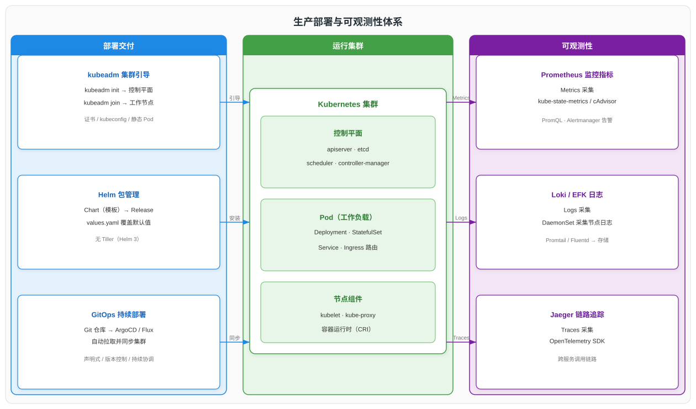

# Kubernetes 集群部署与生产运维实践详解

> 本文系统讲解 Kubernetes 生产环境的交付与日常运维实践，覆盖十个部分：一、概述；二、使用 kubeadm 引导集群部署与控制平面高可用；三、容器运行时接口（CRI）与运行时选型；四、Helm 包管理器架构与 Chart 模板；五、GitOps 持续部署范式与主流工具；六、可观测性三支柱（监控、日志、链路追踪）；七、Pod 健康检查探针机制；八、集群升级流程与版本偏差策略；九、kubectl 故障排查与常见异常状态；十、参考资料。阅读本文可建立从集群搭建到运行维护的完整工程实践认知。

---

## 一、概述

生产环境中的 Kubernetes 工作分为两条主线：一是**集群交付**（Cluster Delivery），即把一个高可用、可升级的集群搭建起来，并持续把应用部署进去；二是**日常运维**（Day-2 Operations），即保障集群稳定运行，通过监控、日志、链路追踪感知状态，并通过健康检查、升级、故障排查维持可用性。

本篇聚焦工程实践，串联从部署工具（kubeadm）、应用打包（Helm）、持续部署（GitOps）到可观测性、健康检查、升级与排错的全链路。前置的集群架构、工作负载、调度、服务路由与存储等基础知识分别在《Kubernetes 集群架构与核心组件详解》《Kubernetes 工作负载与核心对象详解》《Kubernetes 调度与资源管理详解》《Kubernetes 服务路由与存储体系详解》中详述。

---

## 二、集群部署——kubeadm

### 2.1 kubeadm 定位

kubeadm 是 Kubernetes 官方提供的集群引导（bootstrap）工具，负责把一台或多台机器快速组装成一个符合最佳实践的 Kubernetes 集群。它不负责基础设施供给（机器创建、网络配置、负载均衡器等），而是聚焦集群本身的初始化：证书签发、控制平面组件拉起、kubeconfig 生成与节点加入。

| 职责 | kubeadm | 不负责 |
|------|---------|--------|
| 证书与密钥 | 签发根 CA 及各组件证书 | 基础设施供给（机器、网络） |
| 控制平面 | 以静态 Pod 拉起 apiserver、etcd、scheduler、controller-manager | CNI 网络插件安装（需用户另行安装） |
| 节点加入 | `kubeadm join` 将工作节点接入集群 | 负载均衡器、外部 etcd 运维 |

### 2.2 初始化流程

kubeadm 的初始化分为控制平面初始化与节点加入两个阶段。

1. **`kubeadm init`（控制平面初始化）**：执行前需完成前置检查（禁用 swap、容器运行时已安装、端口可用）。命令依次生成根 CA 与各组件证书、写入 kubeconfig 文件、以静态 Pod 形式拉起 kube-apiserver、etcd、kube-scheduler、kube-controller-manager，并标记控制平面节点为 Ready/NoSchedule。完成后输出 `kubeadm join` 命令与 token，供工作节点加入。
2. **配置 CNI**：控制平面就绪后，需安装兼容 CNI 的网络插件（如 Calico、Cilium、Flannel），否则节点一直处于 NotReady（网络未就绪）。
3. **`kubeadm join`（节点加入）**：在工作节点上执行 `kubeadm join <api-server:6443> --token <token> --discovery-token-ca-cert-hash <hash>`，节点完成 TLS 引导、向 apiserver 注册并拉起本地 kubelet 与 kube-proxy。

> `kubeadm init` 产生的 join token 默认 24 小时过期；如需补充节点，可用 `kubeadm token create --print-join-command` 重新生成。

### 2.3 kubeadm config 关键字段

kubeadm 通过 `kubeadm-config` ConfigMap 与初始化配置文件（`kubeadm init --config`）描述集群期望状态。以下是 `InitConfiguration` 与 `ClusterConfiguration` 中的关键字段。

| 字段 | 所属配置 | 作用 |
|------|----------|------|
| `localAPIEndpoint.advertiseAddress` | InitConfiguration | apiserver 对外宣告地址 |
| `nodeRegistration.criSocket` | InitConfiguration / JoinConfiguration | 指定 CRI socket 路径 |
| `nodeRegistration.kubeletExtraArgs` | InitConfiguration / JoinConfiguration | 传递给 kubelet 的额外参数（如 cgroup driver） |
| `kubernetesVersion` | ClusterConfiguration | 目标集群版本 |
| `controlPlaneEndpoint` | ClusterConfiguration | 控制平面高可用的统一入口（LB 地址） |
| `imageRepository` | ClusterConfiguration | 组件镜像仓库（可改为私有仓库） |
| `etcd.local` / `etcd.external` | ClusterConfiguration | etcd 拓扑：堆叠式或外部式 |

### 2.4 控制平面高可用

生产环境控制平面需多副本部署以消除单点故障。kubeadm 支持两种 etcd 拓扑，两者的核心区别在于 etcd 是否与控制平面组件同节点。

| 拓扑 | 部署方式 | 优点 | 缺点 |
|------|----------|------|------|
| 堆叠式（Stacked etcd） | etcd 与控制平面组件运行在同一主节点 | 所需节点少，部署简单 | 主节点故障同时影响 etcd 与控制平面，故障域耦合 |
| 外部式（External etcd） | etcd 集群独立于控制平面节点部署 | 故障域解耦，etcd 可独立扩缩与运维 | 所需机器更多，部署与运维成本更高 |

> kubeadm 默认采用堆叠式拓扑；对故障隔离要求更高的生产环境推荐外部式 etcd。两种拓扑下，kube-apiserver 前端均需配置负载均衡器作为统一入口（`controlPlaneEndpoint`）。

### 2.5 节点最小要求

kubeadm 对节点的基础要求如下。

| 维度 | 要求 |
|------|------|
| CPU / 内存 | 控制平面节点建议 2 核 2 GB 及以上；工作节点按工作负载规划 |
| swap | 必须禁用（kubelet 默认不支持在开启 swap 的节点运行） |
| 容器运行时 | 已安装并正确配置 CRI（containerd 或 CRI-O） |
| 端口 | 控制平面 6443、2379/2380、10250/10257/10259 等端口可用 |
| 内核模块 | 加载 `br_netfilter`、`overlay` 等模块，开启 `net.bridge.bridge-nf-call-iptables` |

---

## 三、容器运行时接口（CRI）

### 3.1 CRI 定义

CRI（Container Runtime Interface，容器运行时接口）是 kubelet 与容器运行时之间的 gRPC 接口。kubelet 通过 CRI 调用运行时完成镜像拉取、容器创建/启停等操作，从而将 kubelet 与具体运行时实现解耦，使运行时可独立演进与替换。

| 角色 | 职责 |
|------|------|
| kubelet（CRI 客户端） | 通过 gRPC 调用运行时，管理 Pod 内容器生命周期 |
| 容器运行时（CRI 服务端） | 实现镜像与容器操作，对接底层 runc / 低层运行时 |

### 3.2 主流运行时

Kubernetes 支持所有符合 CRI 的运行时，主流选择如下。

| 运行时 | 说明 | 状态 |
|--------|------|------|
| containerd | 社区推荐运行时，轻量、稳定，是多数托管集群的默认选择 | 推荐 |
| CRI-O | Red Hat 主导，专为 Kubernetes 设计的最小化运行时 | 支持 |
| dockershim | Kubernetes 内置的 Docker 适配层 | 自 v1.24 起移除 |

> dockershim 在 Kubernetes v1.20 起被弃用，并于 v1.24 正式移除；使用 Docker 的集群需迁移至 containerd 或 CRI-O。底层均通过 runc 等符合 OCI 规范的低层运行时执行容器。

### 3.3 运行时配置：cgroup driver

容器运行时与 kubelet 必须使用**相同的 cgroup driver**，否则 kubelet 可能无法正确识别容器资源状态。systemd 是使用 systemd 初始化系统的 Linux 发行版（如 CentOS、RHEL）的推荐驱动。

| 组件 | 推荐 cgroup driver | 配置位置 |
|------|--------------------|----------|
| kubelet | systemd | `KubeletConfiguration.cgroupDriver` |
| containerd | systemd | `config.toml` 中 `SystemdCgroup = true` |
| CRI-O | systemd | `crio.conf` 中 `cgroup_manager = "systemd"` |

> kubeadm 在 `KubeletConfiguration` 中将 `cgroupDriver` 设为 `systemd`，并要求运行时同步配置；二者不一致是节点出现 `failed to get cgroup stats` 类错误的常见根因。

---

## 四、Helm 包管理

### 4.1 Helm 定位

Helm 是 Kubernetes 的应用包管理器（Package Manager），把一组相互关联的 Kubernetes 资源（Deployment、Service、ConfigMap 等）打包为一个可版本化、可参数化的"包"统一安装与升级，避免零散 apply 多个 YAML 文件。

### 4.2 Helm 3 核心概念

Helm 3 围绕三个核心概念组织应用交付。

| 概念 | 含义 |
|------|------|
| Chart（包模板） | 一组 Kubernetes 资源模板的集合，含模板文件与默认配置 |
| Release（实例） | 一次 Chart 安装在集群中产生的命名实例，可多次安装互不冲突 |
| Repository（仓库） | 存放与索引 Chart 的远程仓库，支持搜索与拉取 |

### 4.3 Helm 2 与 Helm 3 对比

Helm 2 采用服务端/客户端架构，引入了 Tiller；Helm 3 移除 Tiller，简化并加固了安全模型。

| 维度 | Helm 2 | Helm 3 |
|------|--------|--------|
| 架构 | 客户端 helm + 服务端 Tiller | 仅客户端，直接经 kube-apiserver 操作 |
| 权限 | Tiller 拥有集群内权限，需单独配置 RBAC | 继承当前 kubeconfig 用户权限，无额外服务端 |
| Release 存储 | Tiller 所在命名空间（默认 kube-system） | Release 所在命名空间，命名空间隔离 |
| Release 命名 | 全局唯一 | 命名空间内唯一，可重名 |
| 状态 | 已停止维护 | 推荐版本 |

### 4.4 Chart 结构与模板渲染

Chart 以目录形式组织，核心文件如下。

| 文件 / 目录 | 作用 |
|-------------|------|
| `Chart.yaml` | Chart 元信息：名称、版本（version）、appVersion、描述 |
| `values.yaml` | 默认配置值，模板渲染时引用 |
| `templates/` | Go template 模板文件，渲染为 Kubernetes 资源清单 |
| `charts/` | 依赖的子 Chart |
| `_helpers.tpl` | 可复用的命名模板片段 |

模板渲染基于 Go template 语法：`templates/` 下的模板引用 `values.yaml` 中的值，安装时可用 `--set` 或 `-f values-prod.yaml` 覆盖默认值，最终生成标准 Kubernetes 清单提交给 apiserver。

---

## 五、GitOps 持续部署

### 5.1 GitOps 四原则

GitOps 是一种以 Git 作为唯一可信源的运维范式，其核心原则如下。

| 原则 | 含义 |
|------|------|
| 声明式 | 系统期望状态以声明式描述（Kubernetes 清单） |
| 版本控制 | Git 仓库是期望状态的唯一来源（Single Source of Truth） |
| 自动拉取（Pull） | 集群内 Agent 主动从 Git 拉取变更，而非外部推送 |
| 持续协调 | Agent 持续比对集群实际状态与 Git 期望状态，发生漂移自动收敛 |

### 5.2 Push 模型与 Pull 模型

传统 CI/CD 与 GitOps 在部署触发方向上有本质区别。

| 维度 | Push 模型（传统 CI/CD） | Pull 模型（GitOps） |
|------|--------------------------|----------------------|
| 触发方 | 集群外的 CI/CD 工具主动推送 | 集群内 Agent 主动拉取 |
| 凭证 | 集群凭证需暴露给外部工具 | 集群凭证不出集群，Agent 持有 Git 凭证 |
| 状态感知 | 推送后不持续比对 | 持续协调，漂移自动纠正 |
| 适用 | 通用部署场景 | 云原生、Kubernetes 声明式部署 |

### 5.3 ArgoCD 与 Flux 对比

ArgoCD 和 Flux 是 GitOps 的两大主流实现，均为 CNCF 项目。

| 维度 | ArgoCD | Flux |
|------|--------|------|
| 部署模型 | Pull，集群内 Controller | Pull，集群内 Controller |
| 界面 | 提供 Web UI 与 CLI | 以 CLI 为主，UI 为可选增强 |
| 多集群 | 单集群为主，多集群需额外方案 | 原生支持多集群（Flux 与 Fleet 结合） |
| 配置方式 | Application CRD 声明 | GitRepository/Kustomization 等 CRD 声明 |
| 模块化 | 一体化 | 工具包（Toolkit）模块化组合 |

> 关于 GitOps 的完整工作流程（构建管道与部署管道分离、仓库结构模式）与部署模型图，已在《[CI-CD 持续集成与持续交付详解](../DevOps/CI-CD%20持续集成与持续交付详解.md)》第四章节详述，对应图示见 [GitOps 工作流程](../DevOps/images/GitOps工作流程.svg) 与 [GitOps 部署模型](../DevOps/images/GitOps部署模型.svg)。本篇不重复展开，仅在体系图中标注其在交付链路中的位置。

---

## 六、可观测性（Observability）

可观测性（Observability）通过三支柱（Three Pillars）从不同维度感知系统状态：监控指标反映"发生了什么"、日志记录"细节是什么"、链路追踪刻画"请求经过了哪里"。三者互为补充，共同支撑告警与故障定位。

| 支柱 | 回答的问题 | 典型工具 | 采集方式 |
|------|------------|----------|----------|
| 监控（Metrics） | 系统当前是否健康？资源使用多少？ | Prometheus + Grafana | 拉取（Pull）指标端点 |
| 日志（Logs） | 具体事件/错误细节是什么？ | Loki / Elasticsearch | 采集节点与容器日志 |
| 链路追踪（Traces） | 一个请求跨服务经过了哪里、耗时多少？ | Jaeger | SDK 注入上下文并上报 |

### 6.1 监控（Metrics）——Prometheus

Prometheus 是云原生监控的事实标准，其架构由以下组件构成。

| 组件 | 职责 |
|------|------|
| Prometheus Server | 拉取并存储时序指标，提供 PromQL 查询 |
| Exporter | 暴露被监控对象的指标端点（如 node-exporter） |
| Pushgateway | 支持短生命周期任务推送指标（再被 Server 拉取） |
| Alertmanager | 接收告警规则触发，去重、分组并路由通知 |

Kubernetes 场景下关键指标来源与扩展如下。

| 来源 | 提供内容 |
|------|----------|
| kube-state-metrics | Kubernetes 对象状态指标（Deployment 副本数、Pod 状态等） |
| cAdvisor | 容器级 CPU、内存、网络、文件系统指标（kubelet 内嵌暴露） |
| node-exporter | 节点主机级指标（CPU、内存、磁盘） |
| Prometheus Operator | 以 CRD（如 ServiceMonitor）声明式管理监控目标与告警规则 |

PromQL（Prometheus Query Language）用于查询与聚合指标，例如 `rate(http_requests_total[5m])` 计算每秒请求速率。Prometheus Operator 通过 ServiceMonitor CRD 声明"监控哪些 Service 的端口"，自动生成抓取配置，避免手写大段 prometheus.yml。

### 6.2 日志（Logs）——EFK 与 PLG

日志系统负责采集节点与容器 stdout/stderr 日志并集中存储查询。主流有两套技术栈。

| 技术栈 | 采集 | 存储 | 查询/展示 |
|--------|------|------|-----------|
| EFK | Fluentd（或 Fluent Bit） | Elasticsearch | Kibana |
| PLG | Promtail | Loki | Grafana |

无论哪种技术栈，Kubernetes 场景普遍采用 **DaemonSet 采集模式**：在每个节点运行一个采集 Agent Pod，读取节点上 `/var/log/containers/` 与 `/var/log/pods/` 下的容器日志文件，打标（Pod 名、命名空间、容器名）后发送到后端存储。相比 Sidecar 模式，DaemonSet 模式每节点仅一个采集进程，资源开销更低。

> EFK 栈成熟、全文检索能力强，但 Elasticsearch 资源占用高；PLG 栈中 Loki 仅索引标签而不索引日志正文，存储成本低，与 Grafana 深度集成，适合云原生场景。

### 6.3 链路追踪（Traces）——OpenTelemetry 与 Jaeger

链路追踪用于刻画一个请求在微服务间的调用路径与各段耗时。

| 组件 | 职责 |
|------|------|
| OpenTelemetry | 提供 SDK 与 Collector，标准化埋点与上下文传播（TraceContext/W3C） |
| Jaeger | 分布式追踪后端，存储与查询 trace、展示调用链路火焰图 |

应用通过 OpenTelemetry SDK 在请求入口创建 span，并通过请求头传播 trace 上下文；各服务继续 span 并上报至 Collector，最终汇入 Jaeger 后端。一次请求形成由多个 span 组成的有向无环树，可定位慢调用与错误环节。

---

## 七、健康检查（Probe）

Probe（探针）是 kubelet 对容器进行周期性健康检测的机制，决定容器是否被重启、是否接收流量。Kubernetes 提供三种探针。

| 探针 | 作用 | 失败后果 | 适用场景 |
|------|------|----------|----------|
| livenessProbe（存活探针） | 判断容器是否存活 | 失败则重启容器 | 检测死锁、进程挂起等不可恢复状态 |
| readinessProbe（就绪探针） | 判断容器是否就绪可接收流量 | 失败则从 Service Endpoints 移除（不接收流量，不重启） | 依赖外部服务就绪、预热未完成时摘除流量 |
| startupProbe（启动探针） | 判断容器是否已启动完成 | 启动期间禁用 liveness/readiness；启动成功后二者接管 | 慢启动应用，避免被 liveness 误杀 |

三种探针均支持三种检测机制：`httpGet`（HTTP 请求，2xx/3xx 视为成功）、`tcpSocket`（TCP 连接成功即成功）、`exec`（执行命令，退出码 0 视为成功）。

> startupProbe 自 Kubernetes v1.16 起进入 beta、v1.18 起稳定。对启动耗时较长的应用（如需加载大模型或预热缓存），配置 startupProbe 可避免因 livenessProbe 在启动期超时而被反复重启；启动成功后，liveness/readiness 才开始接管。

---

## 八、集群升级与版本偏差

### 8.1 kubeadm 升级流程

Kubernetes 建议每次只跨越一个小版本升级，不跳级。kubeadm 的升级遵循"先控制平面、后工作节点"的顺序。

1. **升级 kubeadm**：在首个控制平面节点安装目标版本的 kubeadm。
2. **`kubeadm upgrade apply`**：执行升级计划，拉取新版本控制平面镜像并升级静态 Pod 配置（apiserver、scheduler、controller-manager、etcd）。
3. **升级 kubelet 与 kubectl**：手动升级该节点 kubelet 并重启，使其与控制平面对齐。
4. **其余控制平面节点**：执行 `kubeadm upgrade node` 完成加入式升级。
5. **升级工作节点**：依次 drain 节点（驱逐 Pod）→ `kubeadm upgrade node` → 升级 kubelet → uncordon 节点（恢复调度）。

> 升级前务必备份 etcd（集群状态唯一持久化来源），并确认目标版本无已废弃 API 影响现有资源；升级过程中应逐节点进行，保证始终有一定数量的节点承载流量。

### 8.2 版本偏差策略

Kubernetes 各组件之间存在官方版本偏差（Version Skew）约束，以允许滚动升级期间新旧版本短暂共存。以 kube-apiserver 为基准，其他组件的允许偏差如下。

| 组件 | 相对 kube-apiserver 的偏差 |
|------|----------------------------|
| kubelet | 不得更新；可低至 3 个小版本（kubelet < 1.25 时仅允许低 2 个） |
| kube-proxy | 不得更新；可低至 3 个小版本（kube-proxy < 1.25 时仅允许低 2 个） |
| kube-controller-manager / kube-scheduler / cloud-controller-manager | 不得更新；应与 apiserver 同版本，最多低 1 个小版本（用于滚动升级） |
| kubectl | 可新或旧 1 个小版本 |
| kube-apiserver（HA 集群内） | 各实例之间最多偏差 1 个小版本 |

> 高可用集群中，若多个 kube-apiserver 实例存在版本偏差，会进一步缩小 kubelet 与 kube-proxy 的允许范围（取最旧 apiserver 为基准）。etcd 版本需与 Kubernetes 版本匹配，升级时应参照 kubeadm 对应版本推荐的 etcd 版本。

---

## 九、故障排查

### 9.1 kubectl 常用排错命令

kubectl 是排错的核心工具，常用命令覆盖资源查看、事件、日志与进入容器等场景。

| 命令 | 用途 |
|------|------|
| `kubectl get` | 列出资源及其状态（Pod、Node、Service 等） |
| `kubectl describe` | 查看资源详情与关联事件（Events），定位调度/启动失败原因 |
| `kubectl logs` | 查看容器 stdout/stderr 日志（`-p` 查看上次崩溃日志） |
| `kubectl exec` | 进入容器执行命令，排查运行时环境 |
| `kubectl top` | 查看节点/Pod 实时 CPU、内存使用（需 Metrics Server） |

### 9.2 Pod 常见异常状态

Pod 异常状态直接反映问题类型，是排错的切入点。

| 状态 | 含义 | 排查方向 |
|------|------|----------|
| CrashLoopBackOff | 容器启动后反复崩溃退出并被重启 | 查 `kubectl logs` 应用日志；检查配置错误、依赖缺失、入口命令错误 |
| ImagePullBackOff | 镜像拉取失败并退避重试 | 检查镜像名/标签、仓库凭证（imagePullSecrets）、网络与仓库可达性 |
| Pending | Pod 已创建但未被调度到节点 | 查 `kubectl describe pod` 的 Events；检查资源不足、节点污点/亲和性、PVC 未绑定 |
| OOMKilled | 容器因内存超限被内核杀死 | 查 `kubectl describe pod` 的 Last State；调高 resources.limits.memory 或排查内存泄漏 |

> 排查的一般顺序：`kubectl get pod` 看状态 → `kubectl describe pod` 看 Events → `kubectl logs` 看应用日志 → `kubectl exec` 进入容器验证环境；资源类问题用 `kubectl top` 与节点容量对照。

---

## 参考资料

- [kubeadm 概述（官方文档）](https://kubernetes.io/zh-cn/docs/setup/production-environment/tools/kubeadm/)
- [使用 kubeadm 创建集群](https://kubernetes.io/zh-cn/docs/setup/production-environment/tools/kubeadm/create-cluster-kubeadm/)
- [kubeadm 配置（kubeadm config）](https://kubernetes.io/zh-cn/docs/reference/config-api/kubeadm-config.v1beta3/)
- [高可用拓扑（kubeadm）](https://kubernetes.io/zh-cn/docs/setup/production-environment/tools/kubeadm/high-availability/)
- [容器运行时接口（CRI）](https://kubernetes.io/zh-cn/docs/concepts/architecture/cri/)
- [容器运行时（Container Runtimes）](https://kubernetes.io/zh-cn/docs/setup/production-environment/container-runtimes/)
- [从 dockershim 迁移](https://kubernetes.io/zh-cn/docs/tasks/administer-cluster/migrating-from-dockershim/)
- [Helm 官方文档](https://helm.sh/zh/docs/)
- [Helm Chart 模板指南](https://helm.sh/zh/docs/chart_template_guide/)
- [ArgoCD 官方文档](https://argo-cd.readthedocs.io/)
- [Flux 官方文档](https://fluxcd.io/docs/)
- [Prometheus 官方文档](https://prometheus.io/docs/introduction/overview/)
- [kube-state-metrics](https://github.com/kubernetes/kube-state-metrics)
- [Loki 官方文档](https://grafana.com/docs/loki/latest/)
- [OpenTelemetry 官方文档](https://opentelemetry.io/docs/)
- [Jaeger 官方文档](https://www.jaegertracing.io/docs/)
- [配置存活、就绪和启动探针](https://kubernetes.io/zh-cn/docs/tasks/configure-pod-container/configure-liveness-readiness-startup-probes/)
- [Pod 生命周期](https://kubernetes.io/zh-cn/docs/concepts/workloads/pods/pod-lifecycle/)
- [kubeadm 升级集群](https://kubernetes.io/zh-cn/docs/tasks/administer-cluster/kubeadm/kubeadm-upgrade/)
- [版本偏差策略（Version Skew Policy）](https://kubernetes.io/zh-cn/releases/version-skew-policy/)
- [kubectl 概述与命令](https://kubernetes.io/zh-cn/docs/reference/kubectl/)
- [排查集群与 Pod 问题](https://kubernetes.io/zh-cn/docs/tasks/debug/debug-cluster/)
