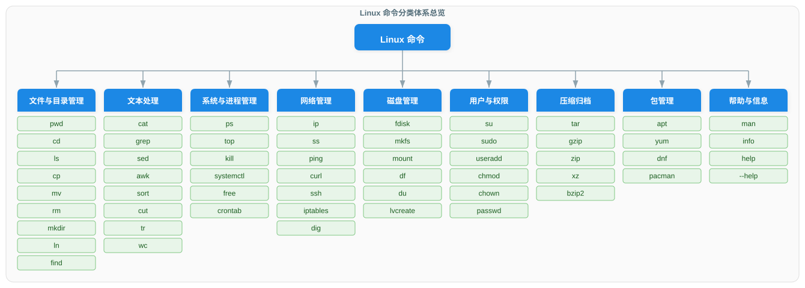
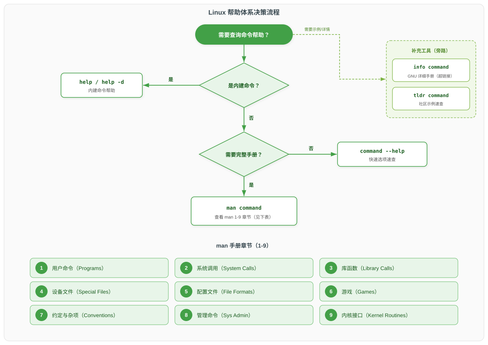
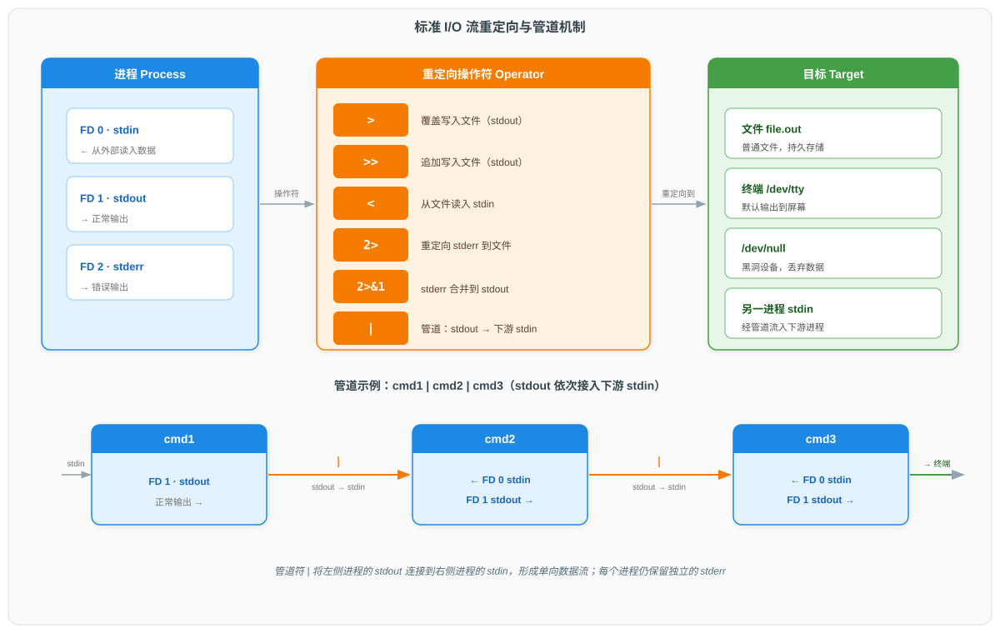
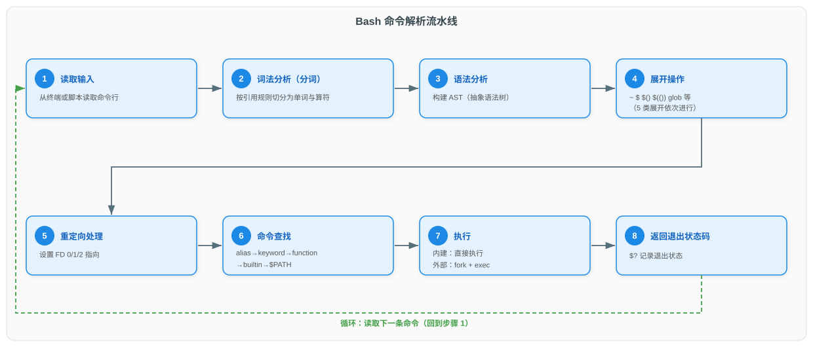

# Linux 命令体系总论

> 本文档为 Linux 常用命令系列的总论篇，系统梳理 Shell 运行机制、命令分类体系、帮助系统、标准 I/O 与重定向管道、通配符与正则、环境变量与 FHS 目录结构，为后续分论篇奠定基础。

Linux 命令并非孤立存在的工具集合，而是由 Shell（命令解释器）统一调度、按固定语法组织、并通过标准 I/O 与文件系统协作的完整体系。理解这套体系的运行机制，远比记忆单个命令的参数更重要——它决定了命令如何被解析、查找、执行以及如何相互组合。本文以"总论"视角，先建立整体框架，再逐项展开各个子系统，最后给出学习路径建议。

---

## 一、Shell 类型与运行模式

Shell 是用户与 Linux 内核之间的命令解释器，它读取输入、解析命令、调用程序并返回结果。不同 Shell 在语法兼容性、交互体验和资源占用上差异显著，理解这些差异是合理选择 Shell 的前提。

### 1.1 主流 Shell 对比

| Shell 名称 | 默认交互 Shell | 脚本兼容性 | 特色功能 | 常见发行版默认 |
|------------|----------------|------------|----------|----------------|
| **bash** | 是（多数发行版） | POSIX 兼容，向后兼容 Bourne shell | 命令历史、可编程补全、`[[ ]]` 测试、数组 | Debian/Ubuntu/RHEL/CentOS 默认交互 Shell |
| **zsh** | 否（需手动切换） | 高度兼容 bash，扩展 Korn shell 特性 | 智能补全、拼写纠正、主题与插件生态（Oh My Zsh） | macOS Catalina 起默认；Kali Linux 默认 |
| **fish** | 否 | 不兼容 POSIX，自成体系 | 开箱即用的语法高亮、自动建议、基于历史的补全 | 默认不预装，需手动安装 |
| **dash** | 否（多用作 `/bin/sh`） | 严格 POSIX，轻量 | 启动快、内存占用低，专为系统脚本设计 | Debian/Ubuntu 的 `/bin/sh` 默认指向 dash |
| **ksh** | 否 | POSIX 兼容，扩展 Bourne shell | 高级模式匹配、关联数组、内置算术 | 商业 Unix（AIX/Solaris）常用，Linux 需安装 |

> **关键点**：`/bin/sh` 在不同发行版中可能指向 bash、dash 或其他 Shell。编写可移植脚本时，应以 POSIX `sh` 语法为准，并在脚本首行用 `#!/bin/sh` 声明，避免依赖 bash 扩展。

### 1.2 登录 Shell 与非登录 Shell

按启动方式不同，Shell 分为登录 Shell 与非登录 Shell，二者加载的启动文件顺序不同，直接影响环境变量与别名的初始化。

| 类型 | 触发方式 | bash 启动文件加载顺序 |
|------|----------|----------------------|
| **登录 Shell** | `ssh` 登录、`su -`、`bash --login` | 登录时加载/etc/profile <br/> →~/.bash_profile <br/> →~/.bash_login（前者不存在时） <br/> →~/.profile（前者不存在时） <br/> 退出时加载 ~/.bash_logout |
| **非登录交互 Shell** | 桌面终端窗口打开、`su`、`bash` | `/etc/bash.bashrc` → `~/.bashrc` |
| **非交互 Shell** | 执行脚本 `bash script.sh` | 继承父 Shell 环境，并加载 `$BASH_ENV` 指向的文件 |

### 1.3 交互式与非交互式 Shell

按是否与用户交互，Shell 又可分为交互式与非交互式，这决定了提示符、命令历史、作业控制等特性是否启用。

| 类型 | 判定方式 | 特征 |
|------|----------|------|
| **交互式 Shell** | 启动参数无 `-c` 且输入输出连接终端 | 显示提示符、记录历史、支持作业控制（Ctrl+Z/Ctrl+C） |
| **非交互式 Shell** | 执行脚本或 `bash -c "cmd"` | 无提示符、默认不读 `~/.bashrc`、选项 `$-` 不含 `i` |

> 判断当前是否为交互式 Shell，可检查特殊参数 `$-` 是否包含字母 `i`：`[[ $- == *i* ]] && echo interactive`。

---

## 二、命令类型与查找机制

Shell 在执行一条命令前，必须先确定该命令"是什么"以及"在哪里"。Bash 按固定优先级顺序查找命令，理解这一机制能解释许多看似异常的行为。

### 2.1 命令查找优先级

当输入一个命令名（不含 `/`）时，Bash 按以下顺序依次匹配，命中即停止：

1. **别名（alias）**：如 `ll` 可能是 `ls -alF` 的别名。
2. **关键字（keyword）**：如 `if`、`for`、`while` 等 Shell 语法关键字。
3. **函数（function）**：用户自定义的 Shell 函数。
4. **内建命令（builtin）**：Shell 内部实现的命令，如 `cd`、`echo`、`export`。
5. **外部命令（external）**：在 `$PATH` 目录中搜索的可执行文件，如 `/usr/bin/grep`。

> 若搜索失败，Shell 返回退出状态码 127（command not found）。可通过 `command_not_found_handle` 函数自定义未找到命令时的行为。

### 2.2 命令类型判定

使用 `type` 与 `command` 命令可查看一条命令在上述优先级中的实际归属：

| 命令 | `type cd` 输出 | `type grep` 输出 | `type ll`（已定义别名）输出 |
|------|----------------|------------------|------------------------------|
| `type` | `cd is a shell builtin` | `grep is /usr/bin/grep` | `ll is aliased to 'ls -alF'` |
| `type -a` | 列出所有匹配（内建 + 外部命令） | 列出所有匹配（多个路径下的同名外部命令） | 列出所有匹配（别名 + 底层命令） |
| `command -v` | `cd`（仅返回名字） | `/usr/bin/grep` | `alias ll='ls -alF'` |

### 2.3 内建命令与外部命令对比

| 维度 | 内建命令（builtin） | 外部命令（external） |
|------|---------------------|----------------------|
| **实现位置** | Shell 进程内部 | 磁盘上的独立可执行文件 |
| **执行方式** | 直接在当前 Shell 进程执行 | `fork` 子进程后 `exec` 加载 |
| **性能** | 无进程创建开销，速度快 | 需创建子进程，开销较大 |
| **能否改变 Shell 状态** | 能（如 `cd` 改变当前目录、`export` 设置环境变量） | 不能（子进程的修改不影响父 Shell） |
| **典型例子** | `cd`、`echo`、`export`、`source`、`alias` | `grep`、`ls`、`awk`、`vim`、`python` |
| **帮助方式** | `help <命令>` | `man <命令>` 或 `<命令> --help` |

> 这就是为什么 `cd` 必须是内建命令——若由子进程执行，目录切换无法影响当前 Shell。同理 `exit`、`export`、`source` 也必须是内建。

---

## 三、Linux 命令分类体系

Linux 命令数量庞大，按功能领域分类有助于建立整体认知。下图按 9 大功能域组织，每个分类下列出最具代表性的命令。



### 3.1 九大分类总览

| 分类 | 代表性命令 | 核心职责 |
|------|------------|----------|
| **文件与目录管理** | pwd cd ls cp mv rm mkdir ln find | 浏览、创建、复制、移动、删除、查找文件与目录 |
| **文本处理** | cat grep sed awk sort cut tr wc | 查看、过滤、编辑、分析、统计文本内容 |
| **系统与进程管理** | ps top kill systemctl free crontab | 查看进程、监控资源、终止进程、管理服务、定时任务 |
| **网络管理** | ip ss ping curl ssh iptables dig | 配置网络、测试连通、传输数据、远程登录、防火墙、DNS 查询 |
| **磁盘管理** | fdisk mkfs mount df du lvcreate | 分区、格式化、挂载、查看空间、LVM 逻辑卷管理 |
| **用户与权限** | su sudo useradd chmod chown passwd | 切换用户、提权、建用户、改权限、改属主、改密码 |
| **压缩归档** | tar gzip zip xz bzip2 | 打包归档与压缩解压 |
| **包管理** | apt yum dnf pacman | 安装、更新、卸载软件包 |
| **帮助与信息** | man info help --help | 查阅命令手册与用法 |

> 后续分论篇将按此分类逐篇展开。本系列后续文档涵盖文件与目录管理、文本处理等主题。

---

## 四、命令语法结构

Linux 命令遵循统一的语法格式，理解该格式是正确组合选项与参数的前提。

### 4.1 通用格式

```
command [options] [arguments]
```

- `command`：命令名，可为内建命令、函数或外部可执行文件。
- `[options]`：选项，用于修改命令行为，可选。
- `[arguments]`：参数，命令操作的对象（文件名、目录、字符串等），可选。

示例：`ls -l -a /home` 中，`ls` 为命令，`-l -a` 为选项，`/home` 为参数。

### 4.2 选项的三种形式

| 形式 | 语法 | 示例 | 说明 |
|------|------|------|------|
| **短选项** | `-字母` | `ls -l` | 单个字母，前导一个连字符 |
| **长选项** | `--单词` | `ls --all` | 完整单词，前导两个连字符，更易读 |
| **组合选项** | `-abc` | `ls -al` | 多个短选项合并，等价于 `-a -l` |

部分选项需要额外接收一个参数值，写法因短选项与长选项而异：

| 形式 | 写法 | 示例 | 说明 |
|------|------|------|------|
| **短选项带参数** | `-X参数值` 或 `-X 参数值` | `head -n10` / `head -n 10` | 参数紧跟字母或用空格隔开均可；`-n` 的参数是 `10` |
| **长选项带参数** | `--选项=参数值` 或 `--选项 参数值` | `head --lines=10` / `head --lines 10` | 用 `=` 连接或用空格隔开均可 |

### 4.3 语法中的特殊位置

管道与重定向可出现在命令行任意位置（由 Shell 解析，不传递给命令本身）：

```
command1 [opts] arg1 | command2 [opts] > output.txt 2>&1
```

其中 `|` 与 `>` 由 Shell 解释，`command` 本身接收的是展开后的参数。

---

## 五、帮助体系

Linux 提供多层级的帮助系统，从快速速查到完整手册各有侧重，掌握其决策路径能显著提升排错效率。



### 5.1 man 命令详解

`man` 是系统的手册分页器，按章节组织内容。完整语法为 `man [section] name`。

| 章节 | 内容类型 | 典型条目 |
|------|----------|----------|
| **1** | 用户命令（Programs） | `ls(1)`、`grep(1)`、`man(1)` |
| **2** | 系统调用（System Calls） | `open(2)`、`read(2)`、`fork(2)` |
| **3** | 库函数（Library Calls） | `printf(3)`、`malloc(3)`、`strcpy(3)` |
| **4** | 设备文件（Special Files） | `null(4)`、`random(4)`、`tty(4)` |
| **5** | 配置文件（File Formats） | `passwd(5)`、`fstab(5)`、`crontab(5)` |
| **6** | 游戏（Games） | `nethack(6)` |
| **7** | 约定与杂项（Conventions） | `man(7)`、`man-pages(7)`、`signal(7)` |
| **8** | 管理命令（System Admin） | `mount(8)`、`fdisk(8)`、`useradd(8)` |
| **9** | 内核接口（Kernel Routines） | 非标准，部分系统提供 |

> **重要**：同名条目可能出现在多个章节。例如 `man printf` 默认显示第 1 章的命令，而 `man 3 printf` 才是 C 库函数。查询时应按需指定章节号。

手册页内的标准章节包括：`NAME`（名称）、`SYNOPSIS`（语法概要）、`DESCRIPTION`（描述）、`OPTIONS`（选项）、`EXIT STATUS`（退出状态）、`FILES`（相关文件）、`EXAMPLES`（示例）、`SEE ALSO`（参见）。

### 5.2 五种帮助方式对比

| 方式 | 适用对象 | 内容特点 | 典型用法 |
|------|----------|----------|----------|
| `man` | 外部命令、系统调用、库函数、配置文件 | 完整权威手册，结构化 | `man ls` / `man 5 passwd` |
| `info` | GNU 工具 | 超链接式详细手册，比 man 更详尽 | `info coreutils` / `info grep` |
| `help` | 内建命令 | 简短用法说明 | `help cd` / `help -d`（仅显示摘要） |
| `--help` | 多数外部命令 | 快速选项速查，输出到 stdout | `ls --help` / `grep --help` |
| `tldr` | 常用命令（社区维护） | 简洁示例集合，适合速查 | `tldr tar` / `tldr find` |

> `help` 仅对内建命令有效；对外部命令使用 `help grep` 会报错。判断命令是否内建可用 `type command`。

---

## 六、标准 I/O 流与重定向管道

几乎所有 Linux 命令都通过三个标准 I/O 流与外界交换数据，重定向与管道是组合命令的核心机制。



### 6.1 三个标准流与文件描述符

| 流 | 名称 | 文件描述符（FD） | 默认指向 | 用途 |
|----|------|------------------|----------|------|
| stdin | 标准输入 | 0 | 终端键盘 | 命令读取输入 |
| stdout | 标准输出 | 1 | 终端屏幕 | 命令正常输出 |
| stderr | 标准错误 | 2 | 终端屏幕 | 命令错误输出 |

### 6.2 重定向操作符

| 操作符 | 含义 | 示例 |
|--------|------|------|
| `>` | 将 stdout 覆盖写入文件 | `ls > list.txt` |
| `>>` | 将 stdout 追加写入文件 | `date >> log.txt` |
| `<` | 从文件读入 stdin | `wc -l < file.txt` |
| `2>` | 将 stderr 重定向到文件 | `cmd 2> err.log` |
| `2>&1` | 将 stderr 合并到 stdout | `cmd > all.log 2>&1` |
| `&>` | 将 stdout 与 stderr 合并到文件（bash 扩展） | `cmd &> all.log` |
| `<<` | Here Document，多行输入 | `cat <<'EOF' ... EOF` |
| `<<<` | Here String，单行输入（bash 扩展） | `cat <<< "hello"` |

> **顺序敏感**：重定向按从左到右的顺序依次生效，`2>&1` 使 fd 2 指向 fd 1 **当时**所指向的位置（快照，非动态绑定）。
>
> - `cmd > f 2>&1`：① fd 1 → 文件 f；② fd 2 → fd 1 当前指向（即文件 f）→ **stdout 和 stderr 均写入 f**
> - `cmd 2>&1 > f`：① fd 2 → fd 1 当前指向（即终端）；② fd 1 → 文件 f → **stderr 输出到终端，stdout 写入 f**

### 6.3 管道与命名管道

管道符 `|` 将左侧命令的 stdout 连接到右侧命令的 stdin，形成单向数据流：

```
cmd1 | cmd2 | cmd3
```

- 管道只传递 stdout，stderr 默认不参与（需用 `2>&1` 合并）。
- 管道在内核中通过匿名管道（pipe）实现，进程间为父子关系。
- **命名管道（FIFO）**：用 `mkfifo` 创建，存在于文件系统中，允许无亲缘关系进程通信。

```bash
mkfifo mypipe        # 创建命名管道
ls -l > mypipe &     # 一个终端写入
cat < mypipe         # 另一个终端读取
```

### 6.4 /dev/null 的用途

`/dev/null` 是特殊设备文件，写入的数据被丢弃，读取时立即返回 EOF。常见用途：

- 丢弃 stdout：`cmd > /dev/null`
- 丢弃 stderr：`cmd 2> /dev/null`
- 丢弃所有输出：`cmd &> /dev/null`（常用于只关心退出状态的脚本）
- 清空文件：`cat /dev/null > file.txt`

---

## 七、通配符与正则表达式

通配符（glob）与正则表达式（regex）都用于模式匹配，但二者语法不同、作用场景不同，混淆是常见错误来源。

### 7.1 通配符（glob）

通配符由 Shell 在命令执行前展开，匹配文件名。

| 通配符 | 含义 | 示例 | 匹配 |
|--------|------|------|------|
| `*` | 任意长度任意字符 | `*.txt` | 所有 .txt 文件 |
| `?` | 单个任意字符 | `file?.log` | file1.log、fileA.log |
| `[abc]` | 方括号内任一字符 | `file[abc].txt` | filea.txt、fileb.txt、filec.txt |
| `[!abc]` 或 `[^abc]` | 不在方括号内的字符 | `file[!0-9].txt` | filea.txt（非数字开头） |
| `{a,b,c}` | 逐项展开为多个字符串 | `file{.txt,.log}` | file.txt、file.log |

> 花括号 `{}` 与其余通配符的本质区别：`*`、`?`、`[]` 是文件名匹配——Shell 在文件系统中查找匹配的文件，无匹配时原样传递；`{}` 是纯字符串生成——Shell 直接将花括号内的每一项与前后的文本拼接，不检查文件是否存在。例如 `file{.txt,.log}` 展开为 `file.txt file.log` 两个字符串，无论这两个文件是否存在。

### 7.2 正则表达式分类

正则表达式由命令工具（grep、sed、awk 等）解析，用于文本内容匹配。

| 类型 | 全称 | 支持工具 | 元字符支持 |
|------|------|----------|------------|
| **BRE** | 基本正则 | `grep`、`sed` 默认 | `.` `*` `^` `$` `[]`直接使用；`()` `{}` `\|` 需转义使用 |
| **ERE** | 扩展正则 | `grep -E`、`sed -E`、`awk` | `.` `*` `+` `?` `^` `$` `[]` `()` `{}` `\|` 直接使用 |
| **PCRE** | Perl 兼容正则 | `grep -P` | 全部 ERE 加上前瞻/后顾、命名捕获等高级特性 |

### 7.3 通配符与正则的区别

| 维度 | 通配符（glob） | 正则表达式（regex） |
|------|----------------|---------------------|
| **处理者** | Shell | grep/sed/awk 等工具 |
| **作用对象** | 文件名 | 文本行内容 |
| **`*` 含义** | 任意长度字符 | 前一字符重复 0 次或多次 |
| **`?` 含义** | 单个字符 | 前一字符重复 0 次或 1 次 |
| **`.` 含义** | 普通点号 | 任意单个字符 |
| **典型场景** | `ls *.txt` | `grep '^error' log.txt` |

> 经典陷阱：`grep file*` 中的 `*` 会被 Shell 先展开为文件名，而非正则。要匹配正则需加引号 `grep 'file*' log.txt`。

---

## 八、环境变量与 PATH

环境变量是进程环境的组成部分，子进程继承父进程的环境变量。`PATH` 变量决定了 Shell 查找外部命令的路径。

### 8.1 常见环境变量

| 变量 | 含义 | 示例值 |
|------|------|--------|
| `PATH` | 外部命令搜索路径（冒号分隔目录列表） | `/usr/local/bin:/usr/bin:/bin` |
| `HOME` | 当前用户家目录 | `/home/alice` |
| `USER` | 当前用户名 | `alice` |
| `SHELL` | 当前登录 Shell 路径 | `/bin/bash` |
| `PWD` | 当前工作目录 | `/var/log` |
| `LANG` | 系统语言与编码 | `en_US.UTF-8` |
| `TERM` | 终端类型 | `xterm-256color` |

### 8.2 export / source / unset 的用法与区别

| 命令 | 作用 | 示例 | 影响范围 |
|------|------|------|----------|
| `export` | 将 Shell 变量提升为环境变量，使子进程可见 | `export MYVAR=value` | 当前 Shell 及其子进程 |
| `source`（或 `.`） | 在当前 Shell 中执行脚本，不创建子进程 | `source ~/.bashrc` | 当前 Shell（用于重新加载配置） |
| `unset` | 删除变量或函数 | `unset MYVAR` | 当前 Shell 及子进程 |

> 仅 `VAR=value` 不加 `export` 时，变量只在当前 Shell 可见，子进程无法继承。这是 Shell 变量与环境变量的本质区别。

### 8.3 PATH 修改与安全注意事项

临时修改 PATH（仅当前会话有效）：

```bash
export PATH="$PATH:/opt/myapp/bin"   # 追加到末尾
export PATH="/opt/myapp/bin:$PATH"   # 前置（优先级更高）
```

永久修改需写入 `~/.bashrc`（非登录交互）或 `~/.bash_profile`（登录 Shell），随后 `source` 生效。

**安全注意**：

- 不要将 `.`（当前目录）放入 PATH 前部，否则恶意脚本可能伪装成系统命令被提权执行（木马攻击）。
- 不要将权限宽松的可写目录加入 PATH。
- 执行不可信脚本应使用绝对路径，避免依赖 PATH 查找。

---

## 九、退出状态码

每条命令执行完毕都会返回一个 0–255 的退出状态码，`$?` 变量保存最近一条命令的状态码，这是 Shell 脚本流程控制的基础。

### 9.1 状态码含义

| 状态码 | 含义 | 典型场景 |
|--------|------|----------|
| **0** | 成功 | 命令正常执行 |
| **1** | 通用失败 | 命令执行出错（如权限不足、文件不存在） |
| **2** | 误用 shell 内建命令 | 选项或参数错误（部分命令） |
| **126** | 命令不可执行 | 文件存在但无执行权限 |
| **127** | 命令未找到 | 命令名拼写错误或不在 PATH 中 |
| **128** | 无效退出参数 | `exit` 接收了非数字参数 |
| **128+N** | 被信号 N 终止 | 如被 `kill -9` 杀死 → 137（128+9） |
| **130** | 被 Ctrl+C 终止 | 128+2（SIGINT） |
| **137** | 被 SIGKILL 杀死 | 128+9（`kill -9` 或 OOM Killer） |
| **255** | 超出范围 | `exit -1` 会被解释为 255 |

### 9.2 状态码的组合使用

```bash
cmd1 && cmd2     # cmd1 成功（0）时才执行 cmd2
cmd1 || cmd2     # cmd1 失败（非 0）时才执行 cmd2
cmd1 && cmd2 || cmd3   # 短路组合，注意优先级
```

`exit [n]` 命令使脚本以状态码 `n` 退出；未指定时使用最后一条命令的状态码。

---

## 十、命令历史与别名

命令历史与别名是提升交互效率的两大特性，但别名也存在局限与安全隐患。

### 10.1 命令历史

| 操作 | 含义 |
|------|------|
| `history` | 列出历史命令（带编号） |
| `!!` | 重新执行上一条命令 |
| `!n` | 重新执行编号为 n 的命令 |
| `!string` | 重新执行最近一条以 string 开头的命令 |
| `!$` | 上一条命令的最后一个参数 |
| `Ctrl+R` | 反向增量搜索历史（输入片段即匹配） |
| `Ctrl+P` / `Ctrl+N` | 上一条 / 下一条历史（等同方向键） |

历史记录存储于 `~/.bash_history`，条数由 `HISTSIZE`（内存）与 `HISTFILESIZE`（文件）控制。

### 10.2 别名

```bash
alias ll='ls -alF'        # 定义别名
alias                     # 列出所有别名
unalias ll                # 删除别名
```

**局限性与安全注意**：

- 别名仅在交互式 Shell 生效，脚本中默认不展开别名（除非 `shopt -s expand_aliases`）。
- 别名不能接收位置参数，复杂逻辑应改用函数。
- 危险别名可能掩盖真实命令：如将 `rm` 别名为 `rm -i` 虽能在当前交互式 Shell 中防误删，但养成依赖后，在无别名的环境（如脚本、其他用户、新 Shell）中习惯性操作反而更易出事故。用同名函数包装危险命令也存在相同问题——函数定义同样只存在于定义它的 Shell 中。建议不对危险命令设置别名或同名函数，避免养成"有保护"的心理依赖。

---

## 十一、Bash 命令解析流程

Bash 解析一条命令需经过多个阶段，从读取输入到返回状态码构成完整流水线。理解该流程能解释引用、展开、查找等行为的先后关系。



完整流程如下：

1. **读取输入**：从终端或脚本读取一行命令。若以 `#` 开头视为注释，直接忽略。
2. **词法分析（分词）**：按引用规则（单引号、双引号、反斜杠）将输入切分为单词（word）与算符（operator），引用部分保持原样。
3. **语法分析（构建 AST）**：将单词序列解析为命令、管道、列表等语法结构，构建抽象语法树。
4. **展开操作**：依次执行 5 类展开（顺序固定）：
   - 花括号展开：`a{b,c}d` → `abd acd`
   - 波浪号展开：`~` → `$HOME`
   - 变量与参数展开：`$VAR`、`${VAR}`
   - 命令替换：`$(cmd)` 或 `` `cmd` ``
   - 算术展开：`$((expr))`
   - 随后进行**单词拆分**（按 `$IFS`）、**路径名展开**（glob）、**引号移除**。
5. **重定向处理**：解析 `>`、`<`、`|` 等算符，设置文件描述符指向。
6. **命令查找**：按优先级 `alias → keyword → function → builtin → 外部命令（$PATH）` 查找命令。
7. **执行**：内建命令在当前 Shell 直接执行；外部命令 `fork` 子进程后 `exec` 加载。
8. **返回退出状态码**：将命令退出状态写入 `$?`，随后回到步骤 1 读取下一条命令。

> **关键**：上述步骤按固定顺序执行，理解两个要点有助于避免常见陷阱：
>
> 1. **展开在命令查找之前完成**：Shell 先将所有 `$VAR` 替换为实际值，再去查找命令。例如 `CMD=ls; $CMD -l` 等效于 `ls -l`，因为 `$CMD` 先被展开为 `ls`，再按优先级查找该命令。若不希望变量被展开，需用引号阻止。
> 2. **单引号与双引号的展开限制不同**：
>    - 单引号 `'...'`：阻止所有展开，内容原样保留。如 `echo '$HOME'` 输出 `$HOME`（不展开）
>    - 双引号 `"..."`：允许变量展开与命令替换，仅阻止单词拆分与路径名展开。如 `echo "$HOME"` 输出 `/home/alice`（展开），但 `echo "*.txt"` 输出 `*.txt`（不进行路径名展开）

---

## 十二、FHS 目录结构

文件系统层次标准（Filesystem Hierarchy Standard，FHS）由 Linux 基金会维护，当前版本为 3.0（2015 年发布），定义了 Linux 目录结构与内容约定。遵守 FHS 保证了软件与脚本在不同发行版间的可移植性。

### 12.1 FHS 3.0 标准目录

| 目录 | 用途说明 | 典型内容 |
|------|----------|----------|
| `/` | 根目录，文件系统顶层 | 所有目录的起点，必须存在 |
| `/bin` | 基本用户命令二进制 | `ls`、`cp`、`cat`、`bash`（启动必需） |
| `/sbin` | 系统管理命令二进制 | `fsck`、`reboot`、`mount`（root 使用） |
| `/etc` | 主机特定配置文件 | `passwd`、`fstab`、`ssh/sshd_config` |
| `/home` | 普通用户家目录 | `/home/alice`、`/home/bob` |
| `/root` | root 用户家目录 | root 的个人文件 |
| `/var` | 可变数据 | 日志 `/var/log`、邮件 `/var/mail`、缓存 `/var/cache` |
| `/usr` | 只读用户数据（二级层次） | `/usr/bin`、`/usr/lib`、`/usr/share` |
| `/tmp` | 临时文件 | 重启后可能清空，所有用户可写 |
| `/proc` | 内核与进程信息虚拟文件系统 | `/proc/cpuinfo`、`/proc/<pid>/` |
| `/sys` | 设备与内核子系统虚拟文件系统 | `/sys/class/`、`/sys/devices/` |
| `/dev` | 设备文件 | `/dev/null`、`/dev/sda`、`/dev/tty` |
| `/opt` | 附加应用软件包 | 第三方自包含应用 |
| `/mnt` | 临时挂载点 | 管理员手动挂载 |
| `/media` | 可移动介质挂载点 | U 盘、光盘自动挂载 |

### 12.2 文件分类维度

FHS 按两个维度对文件分类，决定了它们的存放位置：

- **可共享 vs 不可共享**：可共享文件（如 `/usr/lib`、`/usr/share/doc`）可被多主机共用；不可共享文件（如 `/etc`、`/home`）仅限本机。
- **静态 vs 可变**：静态文件（如 `/usr/bin`、`/usr/lib`）不经管理员干预不变化，可只读挂载；可变文件（如 `/var/log`、`/tmp`）在运行中持续变化。

> `/var` 的引入正是为了将可变数据从静态的 `/usr` 中分离，使 `/usr` 可安全地以只读方式挂载或网络共享。

> 现代 systemd 发行版中，`/bin`、`/sbin`、`/lib` 通常软链接到 `/usr/bin`、`/usr/sbin`、`/usr/lib`（usrmerge 趋势），但 FHS 的逻辑分区仍然成立。

---

## 十三、学习路径建议

Linux 命令学习应循序渐进，从日常操作到系统管理再到脚本编程，分阶段构建能力。

| 阶段 | 目标 | 重点掌握 | 验证标志 |
|------|------|----------|----------|
| **初学者** | 熟练日常文件操作与帮助查阅 | 文件目录命令（cd/ls/cp/mv/rm）、man/help、通配符、管道重定向 | 能独立完成文件整理、查找内容、查阅手册 |
| **中级** | 掌握文本处理与系统管理 | 文本三剑客（grep/sed/awk）、进程管理（ps/top/kill）、权限管理、正则表达式、systemd 服务 | 能编写中等复杂度脚本、分析日志、排查进程问题 |
| **高级** | 精通 Shell 编程与系统运维 | Shell 脚本（函数/数组/信号处理）、Bash 解析机制、网络与磁盘管理、性能分析（strace/lsof/perf） | 能编写健壮的生产级脚本、优化系统性能、定位底层问题 |

> **核心建议**：始终优先理解机制而非记忆参数。`man`、`--help`、`type`、`strace` 是最可靠的随用随查工具；编写脚本时遵循 POSIX 标准、加 `set -euo pipefail`、对所有变量加引号，是写出健壮脚本的基本功。

---

## 参考资料

- [Linux man-pages 项目（man7.org）](https://www.man7.org/linux/man-pages/index.html)
- [man(1) — Linux manual page](https://www.man7.org/linux/man-pages/man1/man.1.html)
- [man-pages(7) — 手册章节约定](https://www.man7.org/linux/man-pages/man7/man-pages.7.html)
- [GNU Bash Manual — Shell Syntax](https://www.gnu.org/software/bash/manual/html_node/Shell-Syntax.html)
- [GNU Bash Manual — Shell Expansions](https://www.gnu.org/software/bash/manual/html_node/Shell-Expansions.html)
- [GNU Bash Manual — Redirections](https://www.gnu.org/software/bash/manual/html_node/Redirections.html)
- [GNU Bash Manual — Shell Operation](https://www.gnu.org/software/bash/manual/html_node/Shell-Operation.html)
- [Filesystem Hierarchy Standard 3.0（PDF）](https://refspecs.linuxfoundation.org/FHS_3.0/fhs-3.0.pdf)
- [Filesystem Hierarchy Standard 2.3（HTML）](https://refspecs.linuxbase.org/FHS_2.3/fhs-2.3.html)
- [Ubuntu Documentation — Filesystem Hierarchy Standard](https://documentation.ubuntu.com/project/how-ubuntu-is-made/concepts/filesystem-hierarchy-standard/)
- [fish shell — Fish for bash users](https://fishshell.com/docs/current/fish_for_bash_users.html)
