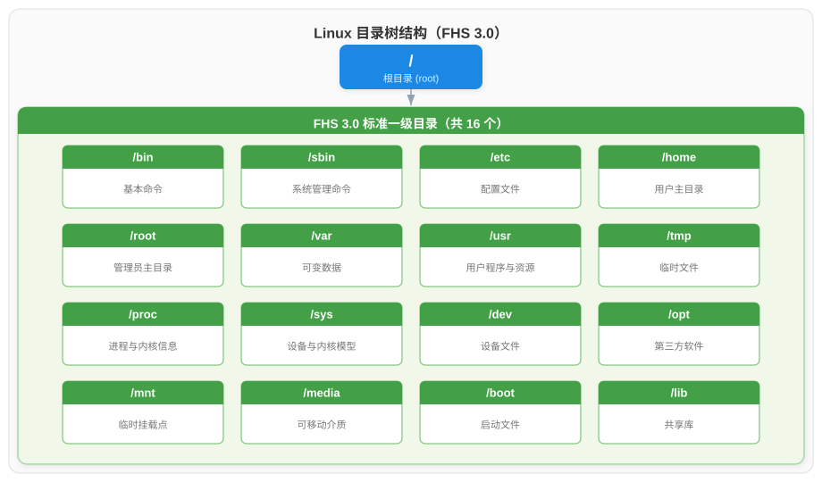
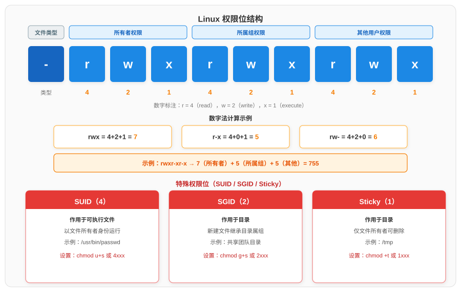
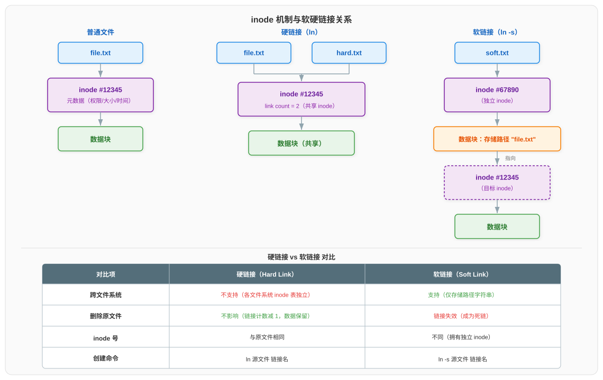

# 文件与目录管理命令

> 本文档为 Linux 常用命令系列分论篇之一，系统讲解文件系统层次标准、目录导航、文件操作、文件查找、权限管理、磁盘空间、归档压缩及 inode 原理。

## 一、文件系统层次标准（FHS）

文件系统层次标准（Filesystem Hierarchy Standard，FHS）规定了 Linux 系统中各目录的用途与组织方式，使不同发行版具备一致的目录结构。FHS 3.0 将目录分为一级目录（根 `/` 下的直接子目录）与二级目录，下表列出 FHS 3.0 定义的核心一级目录及其用途。

| 一级目录 | 用途说明 |
|---------|---------|
| `/bin` | 存放所有用户都可使用的基本命令（如 `ls`、`cp`、`cat`），在单用户模式下可用 |
| `/sbin` | 存放系统管理员使用的系统管理命令（如 `fsck`、`reboot`、`mount`） |
| `/etc` | 存放系统与各程序的配置文件，全为文本文件，不含可执行二进制 |
| `/home` | 普通用户家目录的根，每个用户对应 `/home/用户名` |
| `/root` | root 超级用户的家目录，与 `/home` 分开以保证单用户模式可用 |
| `/var` | 存放在运行中不断变化的数据，如日志（`/var/log`）、缓存、邮件、 spool |
| `/usr` | 存放用户程序与只读资源，含 `/usr/bin`、`/usr/lib`、`/usr/share` 等二级目录 |
| `/tmp` | 存放临时文件，所有用户可写，通常在重启后清空 |
| `/proc` | 虚拟文件系统，反映内核与进程信息（如 `/proc/cpuinfo`），不占磁盘 |
| `/sys` | 虚拟文件系统，反映设备与内核子系统模型（sysfs），用于设备管理 |
| `/dev` | 存放设备文件，如 `/dev/sda`、`/dev/null`、`/dev/tty` |
| `/opt` | 存放第三方安装的可选软件包，每个软件通常独占一个子目录 |
| `/mnt` | 临时挂载点，供管理员手动挂载文件系统 |
| `/media` | 可移动介质（U 盘、光盘）的自动挂载点 |
| `/boot` | 存放系统启动所需文件，如内核（`vmlinuz`）与引导配置（`grub`） |
| `/lib` | 存放 `/bin` 与 `/sbin` 中命令依赖的共享库与内核模块 |



> 现代 Linux 发行版普遍将 `/bin`、`/sbin`、`/lib`、`/usr/bin` 等合并至 `/usr` 下（`/usr merge`），通过符号链接保持兼容。FHS 3.0 仍是理解目录语义的基础。

## 二、目录导航与浏览

目录导航与浏览是文件系统操作的基础，本节介绍 `pwd`、`cd`、`ls`、`tree` 四个核心命令，用于定位与查看目录结构。

### 2.1 pwd — 显示当前工作目录

`pwd`（print working directory）用于打印当前工作目录的绝对路径，是定位文件系统位置最直接的命令。

```bash
pwd        # 输出当前工作目录的绝对路径
pwd -P     # 显示物理路径（解析所有符号链接，得到真实路径）
pwd -L     # 显示逻辑路径（保留符号链接，默认行为）
```

当通过符号链接进入目录时，`pwd -L` 与 `pwd -P` 输出不同：前者保留符号链接路径，后者解析为真实物理路径。

### 2.2 cd — 切换目录

`cd`（change directory）用于切换当前工作目录，是使用频率最高的内建命令之一。

```bash
cd /etc          # 切换到绝对路径 /etc
cd ..            # 切换到上一级目录
cd .             # 保持当前目录（. 代表当前目录）
cd ~             # 切换到当前用户的家目录（~ 等价于 $HOME）
cd               # 不带参数，等价于 cd ~
cd -             # 切换到上一次所在目录，并输出该路径
cd ~/projects    # 切换到家目录下的 projects 子目录
```

`cd` 还可借助 `CDPATH` 环境变量实现快捷跳转。设置 `CDPATH=~/work:/etc` 后，执行 `cd logs` 会依次在 `~/work/logs`、`/etc/logs` 中查找并切换，无需输入完整路径。

### 2.3 ls — 列出目录内容

`ls`（list）用于列出目录下的文件与子目录，是查看目录内容的核心命令。通过不同选项可控制输出格式与显示信息。

| 选项 | 含义 |
|------|------|
| `-l` | 以长格式列出，显示权限、链接数、所有者、组、大小、时间、文件名 |
| `-a` | 显示所有文件，包括以 `.` 开头的隐藏文件 |
| `-h` | 以人类可读格式显示文件大小（如 `1.2K`、`3.4M`） |
| `-t` | 按修改时间（mtime）排序，最新在前 |
| `-r` | 反向排序 |
| `-R` | 递归列出所有子目录内容 |
| `-i` | 显示文件的 inode 号 |
| `-d` | 仅显示目录本身的属性，不列出其内容 |
| `-S` | 按文件大小排序 |
| `--color` | 以颜色区分文件类型 |

`ls -l` 长格式输出的字段结构如下表所示，理解每个字段是分析文件属性的基础。

| 字段位置 | 示例 | 含义 |
|---------|------|------|
| 第 1 列 | `-rwxr-xr-x` | 文件类型与权限位（共 10 字符） |
| 第 2 列 | `2` | 硬链接数（目录至少为 2） |
| 第 3 列 | `user` | 文件所有者 |
| 第 4 列 | `group` | 文件所属组 |
| 第 5 列 | `4096` | 文件大小（字节，`-h` 转为可读格式） |
| 第 6-8 列 | `Jul 11 10:30` | 修改时间（mtime） |
| 第 9 列 | `file.txt` | 文件名 |

```bash
ls -l /etc/passwd              # 查看单个文件的详细属性
ls -lah /var/log               # 以人类可读格式显示日志目录（含隐藏文件）
ls -lt /home --reverse         # 按时间反向排序（最旧在前）
ls -li /tmp                    # 显示 inode 号
ls -ld /etc                    # 仅显示 /etc 目录自身属性
```

### 2.4 tree — 树形显示目录

`tree` 以树形结构递归显示目录内容，比 `ls -R` 更直观，适合查看项目结构与目录层级。

```bash
tree /etc/nginx        # 以树形显示 nginx 目录
tree -L 2 /home        # 仅显示 2 层深度
tree -d /usr           # 只显示目录，不显示文件
tree -a /project       # 显示隐藏文件
tree -f /var/log       # 显示相对路径前缀
tree -p /opt           # 显示权限位
tree -h /boot          # 显示文件大小
```

| 选项 | 含义 |
|------|------|
| `-L n` | 限制显示深度为 n 层 |
| `-d` | 只显示目录 |
| `-a` | 显示隐藏文件 |
| `-f` | 显示完整路径前缀 |
| `-p` | 显示权限位 |
| `-h` | 显示文件大小 |
| `--dirsfirst` | 目录排在文件之前 |

## 三、文件创建与操作

文件创建与操作涵盖文件的时间戳管理、复制、移动、删除及目录的创建与删除，是日常文件系统维护的核心操作。

### 3.1 touch — 创建空文件与修改时间戳

`touch` 有两个主要用途：创建空文件，以及修改文件的时间戳。Linux 文件系统为每个文件维护三个时间，理解它们的区别是使用 `touch` 的前提。

| 时间 | 名称 | 含义 | `ls` 选项 |
|------|------|------|----------|
| atime | access time | 文件最近被读取的时间 | `ls -lu` |
| mtime | modification time | 文件内容最近被修改的时间 | `ls -l`（默认） |
| ctime | change time | 文件元数据（属性/权限）最近改变的时间 | `ls -lc` |

```bash
touch file.txt               # 创建空文件（若不存在），并更新 atime 与 mtime 为当前时间
touch -c file.txt            # 仅更新时间戳，若文件不存在则不创建
touch -a file.txt            # 仅更新 atime
touch -m file.txt            # 仅更新 mtime
touch -t 202501010000 file.txt   # 将 mtime 与 atime 设为指定时间（格式 YYYYMMDDhhmm）
touch -d "2025-01-01 12:00" file.txt  # 通过字符串指定时间
touch -r ref.txt file.txt    # 将 file.txt 的时间戳设为与 ref.txt 相同
```

### 3.2 cp — 复制文件与目录

`cp`（copy）用于复制文件或目录，源文件保持不变。复制目录时必须使用 `-r`（递归）选项，否则会报错。

| 选项 | 含义 |
|------|------|
| `-r` / `-R` | 递归复制目录及其内容 |
| `-i` | 覆盖前交互确认 |
| `-f` | 强制覆盖（默认行为，受 `-i` 反转） |
| `-p` | 保留权限、所有者、时间戳等属性 |
| `-d` | 保留符号链接本身（不复制其指向的文件） |
| `-a` | 归档模式，等价于 `-rpd`，常用于备份 |
| `-u` | 仅当源文件比目标新或目标不存在时才复制 |
| `-v` | 显示复制过程 |

```bash
cp file.txt /tmp/                    # 复制文件到 /tmp
cp -r project /backup/               # 递归复制目录
cp -a /home/user /backup/user        # 归档复制，保留所有属性
cp -u *.log /backup/                 # 仅复制更新过的日志文件
cp -i file.txt /tmp/file.txt         # 覆盖前确认
```

### 3.3 mv — 移动与重命名

`mv`（move）用于移动文件或目录，也可用于重命名。`mv` 在同分区内执行时仅修改目录项（不复制数据），速度极快；跨分区时则需复制数据并删除源文件。

```bash
mv old.txt new.txt          # 重命名文件
mv file.txt /tmp/           # 移动文件到 /tmp
mv -i a.txt b.txt           # 覆盖前确认
mv -f a.txt /tmp/           # 强制覆盖，不提示
mv -n a.txt /tmp/           # 不覆盖已存在文件
mv -u a.txt /tmp/           # 仅当源文件更新时才移动
```

| 选项 | 含义 |
|------|------|
| `-i` | 覆盖前交互确认 |
| `-f` | 强制覆盖（默认） |
| `-n` | 不覆盖已存在文件 |
| `-u` | 仅当源文件比目标新时才移动 |

> **同分区 vs 跨分区**：在同一文件系统内，`mv` 仅修改目录项的 inode 指针，数据块不移动，几乎是瞬时完成；跨文件系统时，`mv` 等价于 `cp` + `rm`，需要复制全部数据再删除源文件。

### 3.4 rm — 删除文件与目录

`rm`（remove）用于删除文件或目录，删除后不可恢复（不进回收站），使用时需格外谨慎。

| 选项 | 含义 |
|------|------|
| `-r` / `-R` | 递归删除目录及其内容 |
| `-f` | 强制删除，忽略不存在的文件，不提示 |
| `-i` | 删除前逐个确认 |
| `-d` | 删除空目录 |

```bash
rm file.txt                 # 删除文件
rm -i *.log                 # 删除前确认每个文件
rm -rf /tmp/old_build       # 递归强制删除目录（危险，需确认路径）
rm -d empty_dir             # 删除空目录
```

> **安全警告**：`rm -rf` 不可恢复，尤其避免对 `/`、`$HOME` 等关键路径使用。替代方案包括：使用 `trash-cli`（移到回收站）、先 `mv` 到临时目录确认后再删除、为 `rm` 设置 `alias rm='rm -i'`。

### 3.5 mkdir 与 rmdir — 创建与删除目录

`mkdir`（make directory）用于创建目录，`rmdir`（remove directory）用于删除空目录。

```bash
mkdir docs                  # 创建单个目录
mkdir -p a/b/c              # 递归创建多级目录（父目录不存在时一并创建）
mkdir -m 700 secret         # 创建目录时直接指定权限
rmdir empty_dir             # 删除空目录（非空则报错）
rmdir -p a/b/c              # 递归删除空目录链（仅当各级都为空）
```

| 命令选项 | 含义 |
|---------|------|
| `mkdir -p` | 递归创建父目录，目录已存在时不报错 |
| `mkdir -m` | 创建时指定权限（不受 umask 影响） |
| `rmdir -p` | 递归删除空目录链 |

## 四、文件查找

文件查找命令用于在文件系统中定位满足条件的文件，本节介绍 `find`、`locate`、`which`、`whereis`、`type` 等工具，各有适用场景。

### 4.1 find — 强大的文件查找工具

`find` 是功能最强大的文件查找工具，按指定路径递归遍历目录树，对每个文件评估表达式，支持按名称、类型、大小、时间、权限、所有者等多种条件查找，并可在结果上执行动作。

基本语法为 `find 路径 条件 动作`，路径默认为当前目录，动作默认为 `-print`。

| 查找条件 | 含义 |
|---------|------|
| `-name "*.log"` | 按文件名匹配（区分大小写，支持通配符） |
| `-iname "*.LOG"` | 按文件名匹配（不区分大小写） |
| `-type f` | 按类型查找：`f` 普通文件、`d` 目录、`l` 符号链接、`b` 块设备、`c` 字符设备 |
| `-size +10M` | 按大小查找：`+` 大于、`-` 小于、无符号等于；单位 `c/k/M/G` |
| `-mtime -7` | 按修改时间查找：`-7` 7 天内、`+7` 7 天前 |
| `-mmin -30` | 按修改时间（分钟）查找 |
| `-perm 644` | 按权限查找（精确匹配） |
| `-perm /u+s` | 按权限查找（任一权限位匹配，`/` 表示或） |
| `-user alice` | 按所有者查找 |
| `-group dev` | 按所属组查找 |
| `-newer ref.txt` | 查找比 ref.txt 修改时间更新的文件 |

```bash
find /var/log -name "*.log"                    # 查找所有 .log 文件
find . -type f -size +100M                     # 查找大于 100M 的普通文件
find /tmp -type f -mtime +7                    # 查找 7 天前修改的文件
find /home -type f -user alice                 # 查找 alice 的文件
find / -perm /4000 -type f 2>/dev/null         # 查找所有 SUID 文件
find . -name "*.tmp" -newer ref.txt            # 查找比 ref.txt 新的 .tmp 文件
```

查找结果可通过动作进行处理，常用动作如下表。

| 动作 | 含义 |
|------|------|
| `-print` | 打印文件名（默认动作） |
| `-print0` | 以 null 分隔打印（配合 `xargs -0` 处理含空格文件名） |
| `-delete` | 删除查找到的文件 |
| `-exec 命令 {} \;` | 对每个文件执行命令，`{}` 代表文件名 |
| `-exec 命令 {} +` | 对多个文件批量执行命令（效率更高） |
| `-ok 命令 {} \;` | 与 `-exec` 相同，但执行前逐个确认 |

```bash
find . -name "*.log" -exec gzip {} \;          # 对每个日志文件单独执行 gzip
find . -name "*.log" -exec gzip {} +           # 批量执行 gzip（效率更高）
find . -name "*.log" | xargs gzip              # 通过 xargs 批量执行
find . -name "*.log" -print0 | xargs -0 gzip   # 安全处理含空格文件名
find /tmp -type f -mtime +7 -delete            # 删除 7 天前的临时文件
find . -name "*.conf" -ok rm {} \;             # 删除前逐个确认
```

> **`-exec` 与 `xargs` 效率对比**：`-exec ... \;` 对每个文件 fork 一个进程，文件多时开销大；`-exec ... +` 与 `xargs` 将多个文件作为参数传给一次命令调用，进程数少，效率高。处理含空格或特殊字符的文件名时，应使用 `-print0` 配合 `xargs -0`，避免参数分割错误。

### 4.2 locate — 快速文件查找

`locate` 通过查询预先构建的文件名数据库（由 `updatedb` 维护）快速查找文件，不实时遍历目录树，速度远快于 `find`，但结果可能滞后（数据库通常每天更新一次）。

```bash
locate passwd                # 查找路径中包含 passwd 的文件
locate -i README             # 忽略大小写查找
locate -c "*.conf"           # 仅统计匹配数量
locate -r "^/etc/.*\.conf$"  # 使用正则表达式匹配
sudo updatedb                # 手动更新数据库
```

| 特性 | find | locate |
|------|------|--------|
| 查找方式 | 实时遍历目录树 | 查询预建数据库 |
| 速度 | 较慢（依赖磁盘 IO） | 极快（查内存数据库） |
| 实时性 | 实时反映当前状态 | 滞后（数据库更新周期） |
| 查找条件 | 丰富（名称/类型/大小/时间/权限等） | 仅文件名（路径）匹配 |
| 资源消耗 | 高（遍历磁盘） | 低（查数据库） |

### 4.3 which / whereis / type — 命令查找

这三条命令用于定位可执行命令的位置，但查找范围与用途不同。

| 命令 | 查找范围 | 用途 |
|------|---------|------|
| `which` | `PATH` 环境变量中的目录 | 查找可执行文件的路径 |
| `whereis` | 标准目录（二进制、源码、man 手册） | 查找二进制、源码、man 页位置 |
| `type` | Shell 内建命令、别名、函数、`PATH` | 查询命令的类型与来源 |

```bash
which python3                # 输出 /usr/bin/python3
whereis ls                   # 输出 ls: /bin/ls /usr/share/man/man1/ls.1.gz
type cd                      # 输出 cd is a shell builtin（内建命令）
type ll                      # 输出 ll is aliased to 'ls -l'
type -a grep                 # 显示所有匹配（含别名与可执行文件）
```

`type` 是 Bash 内建命令，能区分命令是内建命令、别名、函数还是外部可执行文件，是排查命令来源的首选工具。

## 五、文件权限与属性

Linux 文件权限是系统安全的基础机制，通过权限位控制用户对文件的访问能力。每个文件有三类用户（所有者、所属组、其他用户）与三种基本权限（读 r、写 w、执行 x），此外还有三种特殊权限位（SUID、SGID、Sticky）。

### 5.1 chmod — 修改文件权限

权限位结构如下图所示，文件类型占 1 位，其后三组 `rwx` 分别对应所有者、所属组与其他用户：



`chmod`（change mode）支持符号法与数字法两种方式修改权限。

**符号法**：用 `u`（所有者）、`g`（所属组）、`o`（其他用户）、`a`（全部）配合 `+`/`-`/`=` 增减或设定权限。

```bash
chmod u+x script.sh          # 所有者增加执行权限
chmod g-w file.txt           # 所属组去掉写权限
chmod o=r file.txt           # 其他用户设为只读
chmod a=rwx file.txt         # 全部用户设为读写执行
chmod ug+x,o-w file.txt      # 多组同时操作
```

**数字法**：将 `r=4`、`w=2`、`x=1` 求和，三位数字分别对应三类用户。

```bash
chmod 755 script.sh          # rwxr-xr-x（所有者读写执行，组与其他只读执行）
chmod 644 file.txt           # rw-r--r--（所有者读写，组与其他只读）
chmod 600 ~/.ssh/id_rsa      # rw-------（仅所有者读写，私钥必须如此）
chmod -R 755 /var/www        # 递归修改目录及子内容
```

| 常用选项 | 说明 |
|---------|------|
| `-R` | 递归修改目录及目录下所有文件 |
| `-v` | 显示权限变更详情 |
| `-c` | 仅显示发生变更的信息 |

> 数字法无法对单类用户做增量操作（如仅 `+x`），必须同时给出三组完整值；符号法适合增量调整，数字法适合设定确定权限。

### 5.2 chown 与 chgrp — 修改所有者与所属组

`chown`（change owner）修改文件所有者，也可同时修改所属组；`chgrp`（change group）仅修改所属组。

```bash
chown alice file.txt              # 将所有者改为 alice
chown alice:devs file.txt         # 同时修改所有者与所属组
chown :devs file.txt              # 仅修改所属组（等同 chgrp devs file.txt）
chgrp devs file.txt               # 修改所属组为 devs
chown -R alice:devs /project      # 递归修改目录
chown --reference=ref.txt dst.txt # 以 ref.txt 为参照复制属主属组
```

| 命令 | 功能 | 是否需 root |
|------|------|------------|
| `chown` | 修改所有者（可同时改组） | 是 |
| `chgrp` | 仅修改所属组 | 是（或文件所有者且属于目标组） |

> 修改文件所有者需要 root 权限；普通用户只能将自己拥有的文件改到自己所属于的组。

### 5.3 umask — 默认权限掩码

`umask` 决定新建文件与目录的默认权限。其计算原理为最大权限减去掩码值得到默认权限：

| 类型 | 最大权限 | 减去 umask（如 022） | 默认权限 |
|------|---------|---------------------|---------|
| 文件 | 666（rw-rw-rw-） | 022 | 644（rw-r--r--） |
| 目录 | 777（rwxrwxrwx） | 022 | 755（rwxr-xr-x） |

> 文件最大权限为 666 而非 777，因为默认不应赋予执行权限（避免意外执行文本文件）。

```bash
umask                       # 查看当前掩码（如 0022）
umask 027                   # 设置掩码：文件 640，目录 750
umask -S                    # 以符号形式显示（u=rwx,g=rx,o=）
```

umask 值在 Shell 配置文件（`~/.bashrc` 或 `/etc/profile`）中设定，持久生效需写入配置文件。

### 5.4 特殊权限：SUID / SGID / Sticky

除基本 rwx 权限外，Linux 提供三种特殊权限位，用于实现特定安全场景。特殊权限位以数字前缀表示：SUID=4，SGID=2，Sticky=1。

| 特殊权限 | 数字值 | 作用对象 | 功能说明 | 典型示例 |
|---------|--------|---------|---------|---------|
| SUID | 4 | 可执行文件 | 执行时以文件所有者身份运行 | `/usr/bin/passwd`（所有者 root） |
| SGID | 2 | 目录 | 目录下新建文件继承目录属组 | 共享团队目录 |
| Sticky | 1 | 目录 | 仅文件所有者与 root 可删除该目录下文件 | `/tmp` |

```bash
chmod u+s /usr/bin/myapp        # 设置 SUID（符号法）
chmod 4755 /usr/bin/myapp       # 设置 SUID（数字法，前缀 4）
chmod g+s /shared/project       # 设置 SGID（目录）
chmod 2755 /shared/project      # 设置 SGID（数字法，前缀 2）
chmod +t /tmp                   # 设置 Sticky 位
chmod 1755 /tmp                 # 设置 Sticky（数字法，前缀 1）
```

> SUID 仅对可执行文件有效，不能作用于脚本文件（现代 Linux 内核出于安全考虑忽略脚本的 SUID）。`passwd` 命令是 SUID 的经典案例：普通用户执行 passwd 时以 root 身份修改 `/etc/shadow`。

### 5.5 chattr 与 lsattr — 文件系统属性

`chattr`（change attribute）与 `lsattr`（list attribute）管理 ext2/ext3/ext4 文件系统层的扩展属性，与 chmod 权限是不同层次的机制。属性权限高于传统权限：即使 root 也受属性限制。

| 属性 | 说明 | 典型用途 |
|------|------|---------|
| `+i` | 不可变（immutable）：禁止修改、删除、重命名、链接 | 保护关键配置文件 |
| `+a` | 仅追加（append-only）：只能追加内容，不能修改删除 | 保护日志文件 |
| `-i` / `-a` | 取消对应属性 | 解除限制 |

```bash
chattr +i /etc/resolv.conf      # 设置不可变属性（防止误修改 DNS 配置）
chattr +a /var/log/app.log      # 设置仅追加（日志只能追加不能删改）
lsattr /etc/resolv.conf         # 查看属性（输出 ----i-------- /etc/resolv.conf）
chattr -i /etc/resolv.conf      # 取消不可变属性（需先解除才能修改）
```

> 设置 `+i` 属性后，即使是 root 用户也无法删除或修改该文件，必须先用 `chattr -i` 解除。这一机制常用于防止关键系统文件被恶意篡改。

## 六、磁盘空间

磁盘空间管理命令用于查看文件系统使用情况与目录占用大小，是运维排查磁盘告警的核心工具。

### 6.1 df — 查看文件系统磁盘使用情况

`df`（disk free）报告文件系统的整体磁盘使用情况，以文件系统为单位统计已用空间、可用空间与挂载点。

```bash
df -h                        # 以人类可读格式显示（KB/MB/GB）
df -i                        # 显示 inode 使用情况（而非块空间）
df -T                        # 显示文件系统类型（ext4/xfs/tmpfs 等）
df -x tmpfs                  # 排除 tmpfs 类型的文件系统
df -h /home                  # 查看指定挂载点的使用情况
```

| 常用选项 | 说明 |
|---------|------|
| `-h` | 人类可读格式（1024 进制） |
| `-H` | 人类可读格式（1000 进制，与磁盘厂商标称一致） |
| `-i` | 显示 inode 使用情况而非磁盘块 |
| `-T` | 显示文件系统类型列 |
| `-t <类型>` | 仅显示指定类型 |
| `-x <类型>` | 排除指定类型 |

> `df -i` 用于排查 inode 耗尽问题：当磁盘还有空间但无法创建文件时，通常是 inode 被大量小文件耗尽。

### 6.2 du — 查看目录或文件占用空间

`du`（disk usage）估算文件或目录的磁盘占用，以目录为单位递归统计。

```bash
du -h /var/log               # 以人类可读格式显示 /var/log 下各子目录大小
du -sh /var/log              # 仅显示总计大小（-s 汇总，不列子目录）
du -ah /var/log              # 显示所有文件与目录（含普通文件）
du --max-depth=1 -h /home    # 限制递归深度为 1（仅显示一级子目录）
du -sh *                     # 显示当前目录下每个条目的大小
du -h --time /var/log        # 同时显示修改时间
```

| 常用选项 | 说明 |
|---------|------|
| `-h` | 人类可读格式 |
| `-s` | 仅显示汇总总计 |
| `-a` | 显示所有文件（含普通文件，默认仅目录） |
| `--max-depth=N` | 限制递归深度为 N |
| `-c` | 在末尾显示总计行 |

> `df` 统计文件系统整体空间，`du` 统计目录或文件实际占用。两者结果可能不一致：`df` 反映文件系统块级别使用量（含已删除但未释放的句柄），`du` 反映可见文件占用。

## 七、归档与压缩

归档（archive）是将多个文件打包为单个文件，压缩（compress）是减小文件体积。Linux 中 `tar` 常同时完成归档与压缩，也可用 gzip、bzip2、xz 单独压缩。

### 7.1 tar — 归档与压缩

`tar`（tape archive）是 Linux 归档压缩的核心工具，通过选项指定操作模式与压缩算法。

| 选项 | 说明 |
|------|------|
| `-c` | 创建归档（create） |
| `-x` | 解开归档（extract） |
| `-t` | 列出归档内容（list） |
| `-v` | 显示处理过程（verbose） |
| `-f <文件>` | 指定归档文件名（必须放最后） |
| `-z` | 使用 gzip 压缩/解压（.tar.gz / .tgz） |
| `-j` | 使用 bzip2 压缩/解压（.tar.bz2） |
| `-J` | 使用 xz 压缩/解压（.tar.xz） |
| `-C <目录>` | 解压到指定目录 |

```bash
# 创建归档
tar -czvf archive.tar.gz /path/to/dir    # gzip 压缩（最常用）
tar -cjvf archive.tar.bz2 /path/to/dir   # bzip2 压缩（压缩率更高）
tar -cJvf archive.tar.xz /path/to/dir    # xz 压缩（压缩率最高）

# 查看归档内容（不解压）
tar -tzvf archive.tar.gz                 # 列出 gzip 归档内容
tar -tjvf archive.tar.bz2                # 列出 bzip2 归档内容

# 解开归档
tar -xzvf archive.tar.gz                 # 解压到当前目录
tar -xjvf archive.tar.bz2                # 解压 bzip2 归档
tar -xJvf archive.tar.xz                 # 解压 xz 归档
tar -xzvf archive.tar.gz -C /opt         # 解压到指定目录 /opt

# 追加与排除
tar -rvf archive.tar newfile.txt         # 向归档追加文件（仅未压缩 tar）
tar -czvf backup.tar.gz --exclude='*.log' /var  # 排除 .log 文件
```

三种压缩算法的对比如下：

| 算法 | 选项 | 扩展名 | 压缩率 | 压缩速度 | 解压速度 | 适用场景 |
|------|------|--------|--------|---------|---------|---------|
| gzip | `-z` | `.tar.gz` | 中 | 快 | 快 | 日常使用，兼容性最好 |
| bzip2 | `-j` | `.tar.bz2` | 较高 | 慢 | 中 | 需要更高压缩率 |
| xz | `-J` | `.tar.xz` | 最高 | 最慢 | 中 | 分发软件包、长期归档 |

> `-f` 选项后必须紧跟归档文件名，因此 `tar -czvf archive.tar.gz dir` 中 `f` 之后就是文件名。`-v` 在处理大量文件时会产生大量输出，脚本中通常省略。

### 7.2 gzip / bzip2 / xz / zip — 单独压缩工具

除 `tar` 集成调用外，这些工具也可单独使用压缩单个文件。gzip、bzip2、xz 压缩后会删除原文件，zip 保留原文件。

```bash
gzip file.txt                # 压缩为 file.txt.gz（删除原文件）
gzip -k file.txt             # 压缩并保留原文件（-k keep）
gzip -d file.txt.gz          # 解压（等同 gunzip file.txt.gz）
gzip -9 file.txt             # 最高压缩级别（1 最快，9 最高）

bzip2 file.txt               # 压缩为 file.txt.bz2
bzip2 -d file.txt.bz2        # 解压（等同 bunzip2）

xz file.txt                  # 压缩为 file.txt.xz
xz -d file.txt.xz            # 解压（等同 unxz）

zip -r archive.zip dir/      # 压缩目录（-r 递归，保留原文件）
unzip archive.zip            # 解压 zip 文件
unzip -l archive.zip         # 列出 zip 内容
```

| 工具 | 压缩后扩展名 | 是否保留原文件 | 特点 |
|------|------------|--------------|------|
| gzip | `.gz` | 否（`-k` 可保留） | 速度最快，使用最广 |
| bzip2 | `.bz2` | 否（`-k` 可保留） | 压缩率高于 gzip |
| xz | `.xz` | 否（`-k` 可保留） | 压缩率最高 |
| zip | `.zip` | 是 | 跨平台兼容（Windows/macOS） |

> `zip` 是跨平台兼容性最好的格式，Windows 与 macOS 原生支持；gzip、bzip2、xz 主要用于 Unix/Linux 生态。软件包分发中 `.tar.gz` 最通用，`.tar.xz` 因高压缩率被越来越多的发行版采用（如 Linux 内核源码包）。

## 八、inode 与软硬链接原理

理解 inode 机制是掌握 Linux 文件系统的关键，也是区分硬链接与软链接本质差异的基础。

### 8.1 inode 机制

在 Linux 文件系统（如 ext4、xfs）中，文件由两部分组成：

| 组成部分 | 存储内容 | 位置 |
|---------|---------|------|
| 目录项（dentry） | 文件名与 inode 号的映射 | 目录文件的数据块中 |
| inode（索引节点） | 文件元数据与数据块指针 | inode 表中 |

inode 存储文件的元数据，但不包含文件名。元数据包括：

- 文件类型与权限
- 所有者 UID 与所属组 GID
- 文件大小
- 三时间戳（atime / mtime / ctime）
- 硬链接计数（指向此 inode 的目录项数量）
- 数据块指针（直接块、间接块、双重间接块）

```bash
ls -i file.txt              # 查看文件的 inode 号
stat file.txt               # 查看文件完整 inode 信息（含 inode 号、时间戳、硬链接数）
df -i                       # 查看文件系统 inode 使用情况
```

> 文件名存在目录项中而非 inode 中，这是硬链接得以实现的基础：多个文件名可指向同一 inode。

### 8.2 硬链接 — ln

硬链接是目录项级别的新增条目，使多个文件名指向同一个 inode。创建硬链接后，inode 的硬链接计数加 1。

```bash
ln original.txt hardlink.txt    # 创建硬链接
ls -li original.txt hardlink.txt  # 两个文件名 inode 号相同
```

硬链接的特征：

- 硬链接与原文件共享同一 inode 与数据块，无主次之分
- 删除原文件，硬链接仍可正常访问（inode 引用计数减 1，归零时才释放数据块）
- 修改任一链接的内容，所有链接同步变化（因为指向同一数据块）
- 不能跨文件系统创建硬链接（inode 号仅在单个文件系统内唯一）
- 不能对目录创建硬链接（避免文件系统形成环，仅 root 可通过特殊手段操作）

### 8.3 软链接 — ln -s

软链接（symbolic link，又称符号链接）是一个独立文件，其内容存储的是目标文件的路径。软链接有独立的 inode，与目标文件是两个不同的文件。

```bash
ln -s original.txt softlink.txt  # 创建软链接
ls -li original.txt softlink.txt  # 两个文件 inode 号不同
readlink softlink.txt            # 查看软链接指向的目标路径
```

软链接的特征：

- 软链接是独立文件，有自己的 inode 与数据块（存储目标路径字符串）
- 删除原文件后，软链接变为悬空链接（dangling link），访问时报 "No such file"
- 可跨文件系统创建（因为存储的是路径字符串）
- 可对目录创建软链接
- 软链接与原文件的 inode 号不同

普通文件、硬链接与软链接的关系如下图所示：



硬链接与软链接的对比如下：

| 对比维度 | 硬链接（ln） | 软链接（ln -s） |
|---------|------------|---------------|
| 本质 | 目录项新增条目，指向同一 inode | 独立文件，存储目标路径 |
| inode 号 | 与原文件相同 | 与原文件不同 |
| 跨文件系统 | 不支持 | 支持 |
| 链接目录 | 不支持 | 支持 |
| 删除原文件 | 不受影响（引用计数减 1） | 变为悬空链接，无法访问 |
| 磁盘占用 | 几乎不占额外空间（仅目录项） | 占用少量空间（存储路径字符串） |
| 创建命令 | `ln 原文件 链接名` | `ln -s 原文件 链接名` |

> 硬链接适合在同一文件系统内做文件的多入口访问与防误删保护；软链接适合跨文件系统引用与目录链接。配置文件管理中常以软链接切换版本（如 `/etc/alternatives` 机制）。

## 九、实用命令组合

实际运维与开发中，文件管理命令常通过管道与选项组合实现复杂任务。以下列出十个高频实用组合。

**1. 查找并压缩 7 天前的日志文件**

```bash
find /var/log -name "*.log" -mtime +7 -exec gzip {} \;
```

查找 `/var/log` 下修改时间超过 7 天的 `.log` 文件并逐个 gzip 压缩。`-exec ... \;` 对每个文件执行一次命令。

**2. 查找大文件并按大小排序**

```bash
find / -type f -size +100M -exec ls -lh {} \; | sort -k5 -hr | head -20
```

查找全盘大于 100MB 的文件，显示详细信息并按大小降序排列前 20 个。

**3. 批量修改目录权限（目录与文件分别处理）**

```bash
find /var/www -type d -exec chmod 755 {} \;   # 目录设为 755
find /var/www -type f -exec chmod 644 {} \;   # 文件设为 644
```

Web 目录的标准权限实践：目录需执行权限以进入，文件无需执行权限。

**4. 统计目录下各类型文件数量**

```bash
find /project -type f | sed 's/.*\.//' | sort | uniq -c | sort -rn
```

提取所有文件的扩展名，排序统计后按数量降序显示。

**5. 查找并删除空目录**

```bash
find /tmp -type d -empty -delete
```

`-empty` 匹配空目录，`-delete` 直接删除。比 `-exec rmdir` 更高效且安全。

**6. 查找无属主文件（排查已删除用户遗留）**

```bash
find / -nouser -o -nogroup 2>/dev/null
```

`-nouser` 与 `-nogroup` 匹配 UID/GID 不存在对应用户的文件，常用于系统迁移后清理。

**7. 备份目录并保留权限**

```bash
tar -czpf backup-$(date +%Y%m%d).tar.gz /home/alice
```

`-p` 保留原始权限与时间戳，`$(date +%Y%m%d)` 生成日期后缀的文件名。

**8. 查找 SUID 文件（安全审计）**

```bash
find / -perm -4000 -type f 2>/dev/null
```

`-perm -4000` 匹配设置了 SUID 位的文件，用于安全审计发现异常 SUID 程序。

**9. 比较两个目录的差异**

```bash
diff -rq dir1/ dir2/
```

`-r` 递归比较，`-q` 仅报告差异文件而不输出内容，快速定位两个目录的差异。

**10. 查找最近 24 小时内修改的文件**

```bash
find /etc -mtime -1 -type f
```

`-mtime -1` 表示修改时间在 1 天以内，用于排查配置变更或定位刚编辑的文件。

## 参考资料

- [GNU Coreutils Manual](https://www.gnu.org/software/coreutils/manual/coreutils.html) — chmod、chown、cp、mv、rm、df、du、touch 等命令的官方手册
- [GNU Findutils Manual](https://www.gnu.org/software/findutils/manual/html_node/find.html) — find、locate、xargs 命令的官方手册
- [GNU tar Manual](https://www.gnu.org/software/tar/manual/html_node/index.html) — tar 归档工具完整文档
- [Filesystem Hierarchy Standard 3.0](https://refspecs.linuxfoundation.org/FHS_3.0/fhs-3.0.pdf) — Linux 文件系统层次标准官方规范
- [man7.org Linux man pages](https://man7.org/linux/man-pages/) — Linux 在线 man 手册（含 inode、ln、chattr、umask 等）
- [Linux Documentation Project - File Permissions](https://tldp.org/LDP/intro-linux/html/sect_03_04.html) — 文件权限与特殊权限位详解
