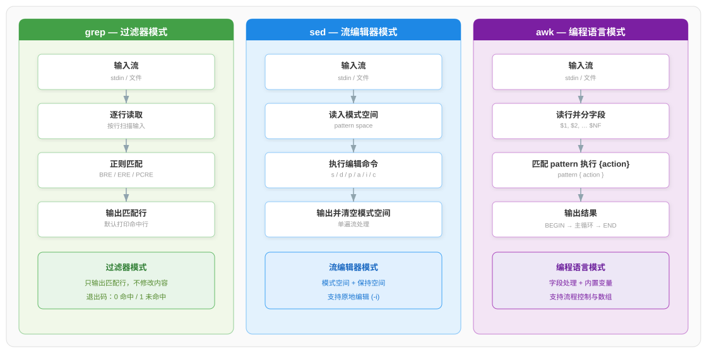
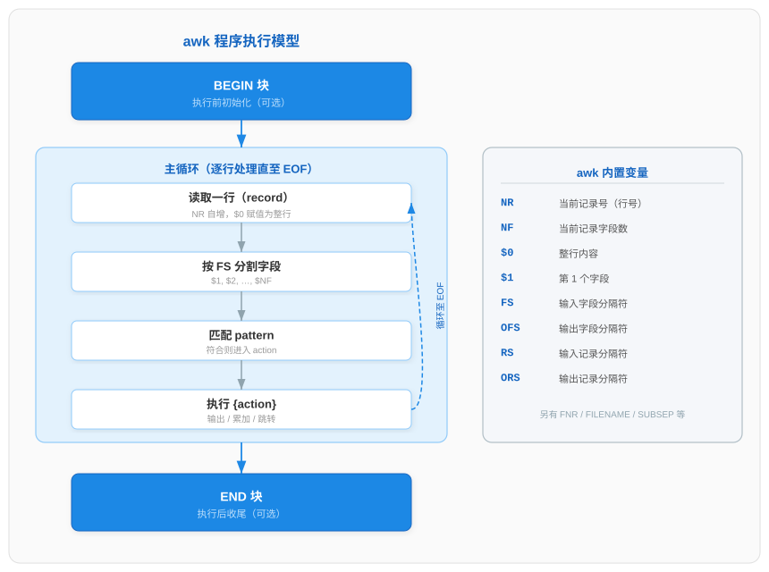
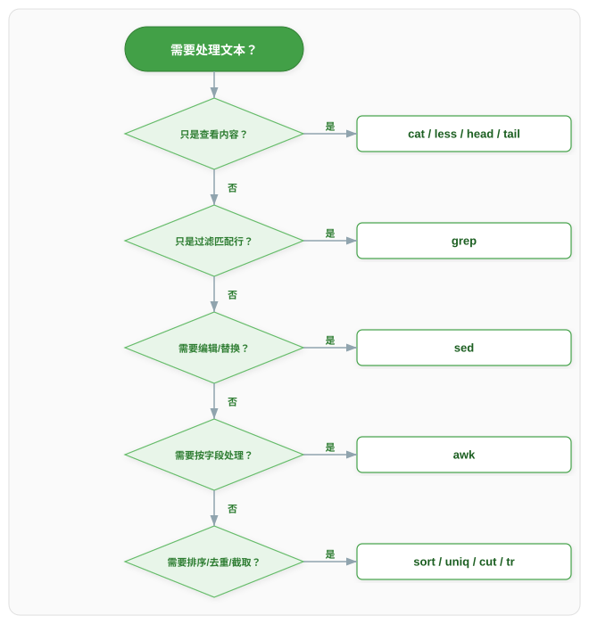

# 文本处理与查看命令

> 本文档为 Linux 常用命令系列分论篇之一，系统讲解文本查看工具、文本处理三剑客（grep/sed/awk）、排序去重与截取工具及正则表达式体系。配合 [Linux命令体系总论](./Linux命令体系总论.md) 中的标准 I/O 流与管道机制理解，可掌握 Linux 下文本流的完整处理链路。

文本是 Linux 系统中配置文件、日志、数据交换的主要载体，绝大多数文本处理工具都遵循"逐行读取输入流 → 处理 → 输出到标准输出"的过滤器模型，因此可以通过管道（`|`）灵活组合。本文按"查看 → 过滤 → 编辑 → 字段处理 → 排序去重"的能力递进组织，并在最后给出正则表达式体系与综合实战案例。

## 一、文本内容查看

文本查看命令用于读取文件内容到标准输出，本身不修改文件，是日志排查、配置确认的基础工具。

### 1.1 cat — 连接并显示文件

`cat`（concatenate）按顺序读取文件内容并输出到标准输出，既可查看单文件，也可拼接多文件。正序输出是其默认行为。

```bash
cat file.txt              # 显示文件内容
cat a.txt b.txt > c.txt   # 拼接 a.txt 与 b.txt 到 c.txt
cat -n file.txt           # 显示并加行号
```

常用选项：

| 选项 | 作用 |
|------|------|
| `-n` | 对所有行编号（含空行） |
| `-b` | 对非空行编号（空行不编号） |
| `-s` | 压缩连续多个空行为一个空行 |
| `-E` | 在每行末尾显示 `$` 标识 |
| `-A` | 等价于 `-vET`，显示所有非打印字符与行尾、制表符 |

> 提示：`cat` 适合小文件查看；大文件应使用 `less` 分页，避免一次性输出刷屏。

### 1.2 tac — 逆序显示

`tac` 是 `cat` 的反写，按行逆序输出（最后一行变第一行），行内字符顺序不变。

```bash
tac file.txt              # 行序倒置输出
tac -s ',' file.txt       # 以逗号为记录分隔符逆序
```

### 1.3 nl — 带行号显示

`nl`（number lines）为文件添加行号后输出，比 `cat -n` 提供更细粒度的编号控制。

```bash
nl file.txt               # 默认仅对非空行编号
nl -ba file.txt           # 对所有行编号（含空行）
nl -nrz file.txt          # 行号右对齐并用 0 填充
```

### 1.4 more 与 less — 分页查看

`more` 与 `less` 都用于分页查看大文件，避免内容一次性刷屏。`more` 是早期简单分页器，仅支持向下翻页；`less` 功能更强大，支持双向滚动、搜索、跳转，是 `more` 的增强替代（"less is more"）。

```bash
more file.txt             # 简单分页，空格下翻，q 退出
less file.txt             # 功能强大的分页器
```

`less` 常用快捷键：

| 快捷键 | 作用 |
|--------|------|
| `空格` / `f` | 向下翻一页 |
| `b` | 向上翻一页 |
| `g` | 跳到文件首行 |
| `G` | 跳到文件末行 |
| `/pattern` | 向下搜索 pattern |
| `?pattern` | 向上搜索 pattern |
| `n` / `N` | 重复搜索 / 反向重复搜索 |
| `q` | 退出 |

### 1.5 head 与 tail — 查看首尾

`head` 默认显示文件前 10 行，`tail` 默认显示后 10 行，常用于快速预览与日志追踪。

```bash
head -n 20 file.txt       # 显示前 20 行
tail -n 50 file.txt       # 显示后 50 行
tail -f /var/log/syslog   # 实时追踪文件追加内容
tail -n +5 file.txt       # 从第 5 行开始显示到末尾
```

| 选项 | 作用 |
|------|------|
| `-n N` | 显示 N 行（`head` 为前 N 行，`tail` 为后 N 行） |
| `-n +N` | `tail` 专用，从第 N 行开始输出到末尾 |
| `-c N` | 按字节取前/后 N 字节 |
| `-f` | `tail` 专用，持续追踪文件新增内容（follow） |
| `-F` | `tail` 专用，追踪并兼容文件轮转（文件被重建也能继续跟踪） |

> 说明：`tail -f` 通过持续读取文件末尾追加的内容实现实时追踪，常用于日志监控；当日志文件被 logrotate 轮转（重命名并新建）时，应使用 `-F` 以重新打开新文件。

### 1.6 stat / file / od

这三个命令用于查看文件的元数据与底层信息，是常规查看工具的补充。

```bash
stat file.txt             # 显示文件 inode、大小、时间戳等元数据
file file.txt             # 判断文件类型（文本/二进制/压缩包等）
od -c bin.dat             # 以字符方式查看二进制文件内容
```

| 命令 | 作用 |
|------|------|
| `stat` | 显示文件的 inode 号、大小、权限、访问/修改/变更时间等元数据 |
| `file` | 通过文件头魔法数字（magic number）判断文件真实类型 |
| `od` | 以八进制/十六进制/字符形式转储文件内容，查看二进制与不可见字符 |

## 二、文本处理三剑客

grep、sed、awk 并称"文本处理三剑客"，分别对应过滤、流编辑、字段编程三种范式。三者都逐行处理输入流，但能力边界与工作原理差异显著。



如上图所示：grep 是纯粹的过滤器，只输出匹配行不改内容；sed 引入"模式空间"对每行执行编辑命令；awk 则是完整的编程语言，支持字段切分、流程控制与 BEGIN/END 结构。

### 2.1 grep — 文本过滤

`grep`（global regular expression print）按正则模式逐行匹配输入，输出命中行，是文本过滤的核心工具。其工作模式为"输入流 → 逐行读取 → 正则匹配 → 输出匹配行"的过滤器模式。

```bash
grep "error" logfile.txt          # 输出含 error 的行
grep -i "warning" logfile.txt     # 忽略大小写匹配 warning
grep -rn "TODO" ./src             # 递归搜索目录并显示行号
grep -v "^#" config.conf          # 输出非注释行（取反）
```

常用选项：

| 选项 | 作用 |
|------|------|
| `-i` | 忽略大小写 |
| `-v` | 反向匹配，输出不匹配的行 |
| `-r` / `-R` | 递归搜索目录下所有文件 |
| `-n` | 显示匹配行在文件中的行号 |
| `-c` | 仅输出匹配行的计数 |
| `-l` | 仅输出含匹配行的文件名 |
| `-A N` | 输出匹配行及其后 N 行（After） |
| `-B N` | 输出匹配行及其前 N 行（Before） |
| `-C N` | 输出匹配行及其前后各 N 行（Context） |
| `-w` | 全词匹配 |
| `-x` | 整行匹配 |
| `-o` | 仅输出匹配到的部分（而非整行） |
| `-e` | 指定多个模式 |
| `-f` | 从文件读取模式（每行一个） |

正则模式变体：

| 调用形式 | 正则类型 | 说明 |
|----------|----------|------|
| `grep`（默认） | BRE | 基本正则，`?+{}()\|` 需反斜杠转义 |
| `grep -E` / `egrep` | ERE | 扩展正则，元字符直接生效 |
| `grep -F` / `fgrep` | 固定字符串 | 不解释元字符，按字面量匹配 |
| `grep -P` | PCRE | Perl 兼容正则，支持前瞻/后顾等高级特性（GNU 扩展） |

`grep` 退出状态码用于脚本判断：

| 退出码 | 含义 |
|--------|------|
| `0` | 找到匹配行 |
| `1` | 未找到匹配行 |
| `2` | 发生错误（如文件不存在） |

### 2.2 sed — 流编辑器

`sed`（stream editor）是对输入流执行基本文本变换的编辑器，仅对输入做一遍扫描（single pass），因此效率较高。其工作模式为"输入流 → 逐行读入模式空间 → 执行编辑命令 → 输出 → 清空模式空间"的流编辑器模式。

#### 工作原理：模式空间与保持空间

`sed` 维护两个缓冲区：

| 缓冲区 | 英文 | 作用 |
|--------|------|------|
| 模式空间 | pattern space | 当前正在处理的行，所有编辑命令默认作用于此处 |
| 保持空间 | hold space | 辅助暂存区，用于跨行保存数据，实现多行操作 |

每个处理周期（cycle）：读取一行到模式空间 → 依次执行脚本中的命令 →（默认）输出模式空间 → 清空模式空间，再读下一行。

#### 选项

| 选项 | 作用 |
|------|------|
| `-n` | 抑制自动输出模式空间，需配合 `p` 命令显式打印 |
| `-e` | 添加一段脚本，可拼接多段命令 |
| `-f` | 从文件读取脚本 |
| `-i[SUFFIX]` | 原地编辑文件（可选 SUFFIX 保留备份） |
| `-r` / `-E` | 使用扩展正则（ERE），`-E` 为 POSIX 推荐写法 |
| `-s` | 将多个输入文件视为独立文件而非单一长流 |

#### 地址形式

命令可带地址，决定对哪些行执行：

| 地址 | 含义 | 示例 |
|------|------|------|
| `N` | 第 N 行 | `5d` 删除第 5 行 |
| `N,M` | 第 N 到 M 行 | `5,10p` 打印 5-10 行 |
| `$` | 最后一行 | `$d` 删除最后一行 |
| `/regex/` | 匹配正则的行 | `/error/d` 删除含 error 的行 |
| `/r1/,/r2/` | 从匹配 r1 到匹配 r2 的行 | `/start/,/end/p` |
| `N~M` | 从 N 开始每 M 行（步长） | `0~2p` 打印偶数行 |

#### 命令表

| 命令 | 作用 |
|------|------|
| `s/old/new/` | 替换：将 old 替换为 new |
| `d` | 删除模式空间，进入下一周期 |
| `p` | 打印模式空间 |
| `n` | 读取下一行到模式空间 |
| `a \text` | 在当前行后追加 text |
| `i \text` | 在当前行前插入 text |
| `c \text` | 用 text 替换选中的行 |
| `y/abc/xyz/` | 字符级转换（类似 tr） |
| `q` | 退出 sed |
| `=` | 打印当前行号 |

#### s/// 替换标志

| 标志 | 作用 |
|------|------|
| `g` | 全局替换（一行内所有匹配） |
| `i` | 忽略大小写 |
| `n` | 替换第 n 个匹配 |
| `p` | 替换后打印模式空间 |
| `e` | 将替换结果作为 shell 命令执行（危险，慎用） |
| `w file` | 将替换后的行写入文件 |

```bash
sed 's/foo/bar/g' file.txt           # 全局替换 foo 为 bar
sed -i 's/localhost/127.0.0.1/g' config.conf   # 原地替换
sed -n '5,10p' file.txt              # 仅打印 5-10 行（配合 -n）
sed '/^#/d' file.txt                 # 删除以 # 开头的行
sed 's/[0-9]\{3\}/NUM/g' file.txt    # 将连续 3 位数字替换为 NUM（BRE）
```

#### 高级：模式空间与保持空间操作

以下命令操作保持空间，用于跨行处理（如合并行、倒序输出）：

| 命令 | 作用 |
|------|------|
| `h` | 将模式空间复制到保持空间（覆盖） |
| `H` | 将模式空间追加到保持空间 |
| `g` | 将保持空间复制到模式空间（覆盖） |
| `G` | 将保持空间追加到模式空间 |
| `x` | 交换模式空间与保持空间 |
| `N` | 追加下一行到模式空间（多行处理） |
| `D` | 删除模式空间第一行并重新启动周期 |
| `P` | 打印模式空间第一行 |

> 参考：sed 的模式空间机制说明详见 [GNU sed 手册 - Advanced sed: cycles and buffers](https://www.gnu.org/software/sed/manual/html_node/advanced-sed.html)。

### 2.3 awk — 字段处理与编程

`awk`（得名于作者 Aho、Weinberger、Kernighan）是一种数据驱动的扫描与处理语言，按字段（列）处理文本，支持变量、条件、循环、数组与函数，是三剑客中能力最强者。其工作模式为"输入流 → 读行 → 分字段 → 执行 BEGIN/pattern{action}/END → 输出"的编程语言模式。

#### 执行模型

awk 程序的执行分为三个阶段：



如上图所示，awk 先执行可选的 `BEGIN` 块完成初始化，再进入主循环逐行处理（读行 → 分字段 → 匹配 pattern → 执行 action），最后在所有输入读完后执行可选的 `END` 块收尾。

#### 字段与内置变量

awk 默认以空白（空格/制表符）分割每行为字段，并用 `$1`、`$2`… 引用，`$0` 表示整行：

| 变量 | 含义 |
|------|------|
| `$0` | 整行内容 |
| `$1`, `$2`, …, `$NF` | 第 1、2… 个字段；`$NF` 为最后一个字段 |
| `NR` | 当前记录号（行号，累计） |
| `NF` | 当前记录的字段数 |
| `FS` | 输入字段分隔符（默认空白） |
| `OFS` | 输出字段分隔符（默认空格） |
| `RS` | 输入记录分隔符（默认换行） |
| `ORS` | 输出记录分隔符（默认换行） |
| `FILENAME` | 当前输入文件名 |

#### 语法：pattern{action}

awk 程序由若干 `pattern { action }` 规则组成：当 pattern 为真时执行对应 action。pattern 可省略（匹配所有行），action 可省略（默认打印 `$0`）。

```bash
awk '{print $1, $3}' file.txt                  # 打印第 1、3 字段
awk -F',' '{print $1}' file.csv                # 以逗号分隔，打印第 1 字段
awk 'NR==3{print $0}' file.txt                 # 打印第 3 行
awk '$3 > 100 {print $1}' score.txt            # 第 3 字段大于 100 时打印第 1 字段
awk 'BEGIN{FS=":"} {print $1}' /etc/passwd     # BEGIN 中设置 FS
awk '{sum+=$1} END{print sum}' nums.txt        # 累加第 1 字段并输出总和
```

控制流与数组：

```bash
awk '{if($3>100) print $1,"high"; else print $1,"low"}' file.txt
awk '{for(i=1;i<=NF;i++) print $i}' file.txt          # 逐字段打印
awk '{count[$1]++} END{for(k in count) print k,count[k]}' log.txt  # 按 $1 计数
```

内置函数：

| 函数 | 作用 |
|------|------|
| `length(s)` | 返回字符串长度（无参时返回 `$0` 长度） |
| `substr(s,m,n)` | 从 s 第 m 位取 n 个字符的子串 |
| `split(s,arr,sep)` | 以 sep 分割 s 到数组 arr，返回字段数 |
| `gsub(r,s)` | 全局替换：将匹配 r 的部分替换为 s |
| `sub(r,s)` | 替换第一个匹配 |
| `index(s,t)` | 返回 t 在 s 中首次出现的位置 |

`printf` 格式化输出：

```bash
awk '{printf "%-10s %5d\n", $1, $2}' file.txt   # 左对齐 10 字符串，右对齐 5 整数
```

| 选项 | 作用 |
|------|------|
| `-F fs` | 设置输入字段分隔符（等价 `BEGIN{FS=fs}`） |
| `-f progfile` | 从文件读取 awk 程序 |
| `-v var=val` | 在 BEGIN 前为变量赋值 |

## 三、排序、去重与截取

当三剑客不足以独立完成统计、整理类任务时，需借助排序、去重、截取等专用工具。这些工具常与管道组合形成数据处理流水线。

### 3.1 sort — 排序

`sort` 对输入行排序后输出，支持数值、字典、按字段、逆序等多种排序方式，是多字段统计的前置步骤。

```bash
sort file.txt             # 默认按字典序升序
sort -n nums.txt          # 按数值排序
sort -rn nums.txt         # 按数值降序
sort -t: -k3 -n /etc/passwd   # 以冒号分隔，按第 3 字段数值排序
sort -u file.txt          # 排序并去重
```

| 选项 | 作用 |
|------|------|
| `-n` | 按数值排序（而非字典序） |
| `-r` | 降序 |
| `-k N` | 按第 N 个字段排序 |
| `-t C` | 指定字段分隔符为 C |
| `-u` | 排序后去重（等价 sort 后 uniq） |
| `-f` | 忽略大小写 |
| `-b` | 忽略行首空白 |

多字段排序示例：先按部门（第 1 字段）升序，部门相同再按薪资（第 3 字段）数值降序。

```bash
sort -t, -k1,1 -k3,3nr employees.csv
```

### 3.2 uniq — 去重

`uniq` 用于删除相邻的重复行，常配合 `sort` 使用。注意：`uniq` 只删除相邻重复行，因此对未排序的文件直接去重会遗漏不相邻的重复行，故通常需先 `sort` 再 `uniq`。

```bash
sort file.txt | uniq              # 排序后去重
sort file.txt | uniq -c           # 去重并统计每行出现次数
sort file.txt | uniq -d           # 仅输出重复的行
sort file.txt | uniq -u           # 仅输出未重复的行
```

| 选项 | 作用 |
|------|------|
| `-c` | 在行首显示该行出现次数 |
| `-d` | 仅输出重复行（各一次） |
| `-u` | 仅输出唯一行（不重复的行） |
| `-i` | 忽略大小写 |
| `-f N` | 跳过前 N 个字段后比较 |
| `-s N` | 跳过前 N 个字符后比较 |

### 3.3 cut — 截取字段

`cut` 按字段或字符位置从每行截取内容，适合结构化文本的列提取。

```bash
cut -d: -f1 /etc/passwd           # 以冒号分隔，取第 1 字段（用户名）
cut -c1-10 file.txt               # 取每行第 1-10 个字符
cut -d, -f2,3 data.csv            # 以逗号分隔，取第 2、3 字段
```

| 选项 | 作用 |
|------|------|
| `-d C` | 指定字段分隔符（默认制表符） |
| `-f N` | 取第 N 个字段（可逗号列多个，或 `-` 表范围） |
| `-c N-M` | 按字符位置截取 |
| `-b N-M` | 按字节位置截取 |
| `--complement` | 取补集（输出未指定的部分） |

### 3.4 paste — 合并行

`paste` 将多个文件按行横向合并（对应列拼接），默认以制表符分隔，与 `cat` 的纵向拼接互补。

```bash
paste a.txt b.txt                 # 横向合并，制表符分隔
paste -d',' a.txt b.txt           # 以逗号分隔
paste -s file.txt                 # 将文件的所有行合并为一行
```

### 3.5 tr — 字符转换

`tr` 从标准输入读取，按字符（非字符串）进行转换、删除或压缩，常用于大小写转换、删除控制字符、压缩重复字符。

```bash
echo "Hello" | tr 'a-z' 'A-Z'     # 小写转大写：HELLO
tr -d '\r' < dos.txt > unix.txt   # 删除回车符（DOS 转 Unix）
tr -s ' ' file.txt                # 压缩连续空格为单个
echo "abc123" | tr -dc 'a-z'      # 删除非小写字母字符
```

| 选项 | 作用 |
|------|------|
| `-d` | 删除指定字符 |
| `-s` | 压缩连续重复字符为一个 |
| `-c` | 取字符集补集 |
| `-C` | 取字符集补集（按字符） |

> 注意：`tr` 只能做单字符映射，不能替换多字符字符串；多字符替换需用 `sed`。

### 3.6 wc — 统计

`wc`（word count）统计文件的行数、单词数、字节数。

```bash
wc file.txt                       # 输出 行数 单词数 字节数
wc -l file.txt                    # 仅统计行数
wc -w file.txt                    # 仅统计单词数
wc -c file.txt                    # 仅统计字节数
```

| 选项 | 作用 |
|------|------|
| `-l` | 统计行数 |
| `-w` | 统计单词数 |
| `-c` | 统计字节数 |
| `-m` | 统计字符数（多字节字符与字节不同） |

### 3.7 split — 分割文件

`split` 将大文件分割为多个小文件，支持按行数或字节数分割。

```bash
split -l 1000 bigfile.txt part_   # 每 1000 行一个文件，生成 part_aa, part_ab...
split -b 10m bigfile.bin part_    # 每 10MB 一个文件
split -l 1000 -d bigfile.txt part_  # 使用数字后缀（part_00, part_01...）
```

| 选项 | 作用 |
|------|------|
| `-l N` | 每 N 行一个文件 |
| `-b N` | 每 N 字节一个文件（可加 k/m/g） |
| `-d` | 使用数字后缀而非字母 |
| `-a N` | 后缀长度为 N |

### 3.8 tee — 双向输出

`tee` 从标准输入读取数据，同时写入标准输出和一个或多个文件，相当于管道上的"三通"接头，用于在管道中间保存中间结果的同时继续向后传递。

```bash
command | tee output.log          # 输出到屏幕并写入 output.log
command | tee -a output.log       # 追加而非覆盖
command | tee f1.txt f2.txt       # 同时写入多个文件
```

| 选项 | 作用 |
|------|------|
| `-a` | 追加到文件而非覆盖 |
| `-i` | 忽略中断信号（SIGINT） |

### 3.9 xargs — 参数传递

`xargs` 从标准输入读取数据，将其作为参数拼接到指定命令后执行，是连接"产生数据的命令"与"接收参数的命令"的桥梁，常与 `find` 组合。

```bash
find . -name "*.log" | xargs rm               # 删除所有 .log 文件
find . -name "*.log" -print0 | xargs -0 rm    # 安全处理含空格/特殊字符的文件名
cat urls.txt | xargs -n 1 curl                # 每行一个 URL 调用 curl
find . -name "*.c" | xargs grep "main"        # 在找到的文件中搜索 main
```

| 选项 | 作用 |
|------|------|
| `-I {}` | 指定占位符，每行参数替换到命令中 |
| `-n N` | 每次取 N 个参数构造一条命令 |
| `-P N` | 并行执行 N 条命令 |
| `-L N` | 每次取 N 行构造一条命令 |
| `-0` | 以 NUL 字符分隔输入（配合 `find -print0`） |

> 重要：当文件名含空格、引号或换行时，`find | xargs` 会因按空白分词而错误拆分。正确做法是 `find -print0` 输出以 NUL 分隔，再用 `xargs -0` 读取，从而安全处理任意文件名。

## 四、正则表达式

正则表达式（regular expression）是 grep、sed、awk 共同的模式描述语言。Linux 下存在三种主流流派：BRE、ERE、PCRE，理解其差异是精准使用三剑客的前提。

### 4.1 BRE / ERE / PCRE 对比

| 元字符 | BRE（基本） | ERE（扩展） | PCRE（Perl 兼容） |
|--------|-------------|-------------|-------------------|
| `.` `*` `^` `$` `[]` | 直接支持 | 直接支持 | 直接支持 |
| `+` `?` | 需 `\+` `\?` | 直接支持 | 直接支持 |
| `{n,m}` | 需 `\{n,m\}` | 直接支持 | 直接支持 |
| `( )` 分组 | 需 `\( \)` | 直接支持 | 直接支持 |
| `\|` 或 | 需 `\|` | 直接支持 | 直接支持 |
| `\d` `\w` `\s` | 不支持 | 不支持 | 支持 |
| 前瞻/后顾 | 不支持 | 不支持 | 支持 |
| 非贪婪 `*?` | 不支持 | 不支持 | 支持 |

各工具默认使用的正则类型：

| 工具 | 默认 | 切换方式 |
|------|------|----------|
| `grep` | BRE | `-E` 切 ERE，`-P` 切 PCRE |
| `sed` | BRE | `-E` / `-r` 切 ERE |
| `awk` | ERE | 默认即为 ERE |

> 说明：在 GNU `grep` 中 BRE 与 ERE 功能等价，区别仅在于元字符是否需反斜杠转义；PCRE 才引入前瞻、后顾、非贪婪等高级特性。

### 4.2 POSIX 字符类

POSIX 字符类在方括号内使用，跨语言环境（locale）可移植，推荐替代 `[a-z]` 等硬编码范围：

| 字符类 | 含义 |
|--------|------|
| `[:alpha:]` | 字母字符 |
| `[:digit:]` | 数字字符 |
| `[:alnum:]` | 字母与数字 |
| `[:upper:]` | 大写字母 |
| `[:lower:]` | 小写字母 |
| `[:space:]` | 空白字符（空格、制表符、换行等） |
| `[:punct:]` | 标点符号 |
| `[:blank:]` | 空格与制表符 |

用法示例：`grep '[[:digit:]]\{3\}' file.txt`（BRE，匹配连续 3 位数字）。

### 4.3 常见正则示例

| 需求 | 正则（ERE） | 说明 |
|------|-------------|------|
| 行首以 error 开头 | `^error` | `^` 锚定行首 |
| 行尾以 done 结尾 | `done$` | `$` 锚定行尾 |
| 空行 | `^$` | 行首紧接行尾 |
| 连续 3 位数字 | `[0-9]{3}` 或 `[[:digit:]]{3}` | 量词 |
| IP 地址（简化） | `[0-9]{1,3}(\.[0-9]{1,3}){3}` | 分组与量词 |
| 邮箱（简化） | `[[:alnum:]._]+@[[:alnum:]]+\.[[:alpha:]]+` | 字符类组合 |
| 以大写字母开头的单词 | `\b[A-Z][a-z]*` | PCRE 单词边界 |

## 五、命令决策指南

面对文本处理需求时，可按"能力递进"的顺序选择工具：先判断是否只需查看，再依次考虑过滤、编辑、字段处理、排序去重。



如上图所示，决策树按"查看 → 过滤 → 编辑 → 字段 → 排序去重"逐层筛选：只看内容用 `cat/less/head/tail`；只过滤匹配行用 `grep`；需要编辑替换用 `sed`；需要按字段处理用 `awk`；需要排序去重截取用 `sort/uniq/cut/tr`。

## 六、综合实战案例

以下案例通过管道组合多个工具，展示文本处理流水线的典型用法。

1. 统计文件中每个单词的出现频率（词频统计）：

```bash
tr -s ' ' '\n' < file.txt | sort | uniq -c | sort -rn
```

2. 提取日志中 IP 并按访问次数排序取前 10：

```bash
grep -oE '([0-9]{1,3}\.){3}[0-9]{1,3}' access.log | sort | uniq -c | sort -rn | head -n 10
```

3. 提取 CSV 第 1、3 列并格式化输出：

```bash
awk -F',' '{printf "%-15s %s\n", $1, $3}' data.csv
```

4. 批量替换文件中的字符串并原地保存：

```bash
sed -i 's/old_domain/new_domain/g' *.conf
```

5. 删除配置文件中的注释行与空行：

```bash
grep -v '^#' config.conf | grep -v '^$' > clean.conf
```

6. 统计文件行数、单词数、字节数：

```bash
wc file.txt
```

7. 将目录下所有 `.log` 文件按修改时间排序：

```bash
find . -name "*.log" -printf '%T+ %p\n' | sort
```

8. 查找并删除 7 天前的日志文件（安全处理空格文件名）：

```bash
find /var/log -name "*.log" -mtime +7 -print0 | xargs -0 rm -f
```

9. 实时监控日志中含 error 的行并高亮：

```bash
tail -f /var/log/app.log | grep --color=always "error"
```

10. 将第 2 列大于 100 的行的第 1 列累加求和：

```bash
awk '$2 > 100 {sum += $1} END {print sum}' data.txt
```

11. 合并两个文件的对应行并按制表符对齐：

```bash
paste name.txt score.txt
```

12. 将 DOS 换行（CRLF）转为 Unix 换行（LF）：

```bash
tr -d '\r' < dos.txt > unix.txt
```

## 参考资料

- [GNU Grep Manual](https://www.gnu.org/software/grep/manual/html_node/) — grep 官方手册（GNU 项目）
- [GNU sed Manual](https://www.gnu.org/software/sed/manual/html_node/) — sed 官方手册（GNU 项目）
- [GAWK: Effective AWK Programming](https://www.gnu.org/software/gawk/manual/) — gawk 官方手册（GNU 项目）
- [grep(1) — Linux manual page](https://man7.org/linux/man-pages/man1/grep.1.html) — man7.org grep 手册页
- [sed(1) — Linux manual page](https://man7.org/linux/man-pages/man1/sed.1.html) — man7.org sed 手册页
- [regex(7) — Linux manual page](https://man7.org/linux/man-pages/man7/regex.7.html) — man7.org 正则表达式手册页
- [The Differences Between BRE, ERE, and PCRE Syntax in Linux](https://www.baeldung.com/linux/bre-ere-pcre-syntax) — Baeldung 正则流派对比
