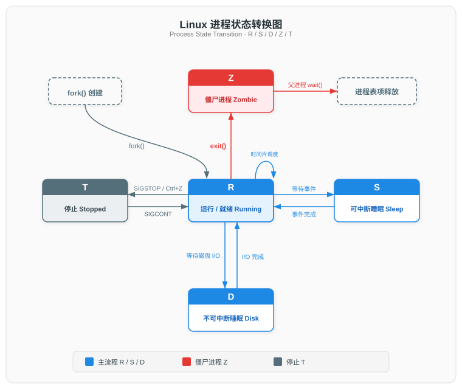
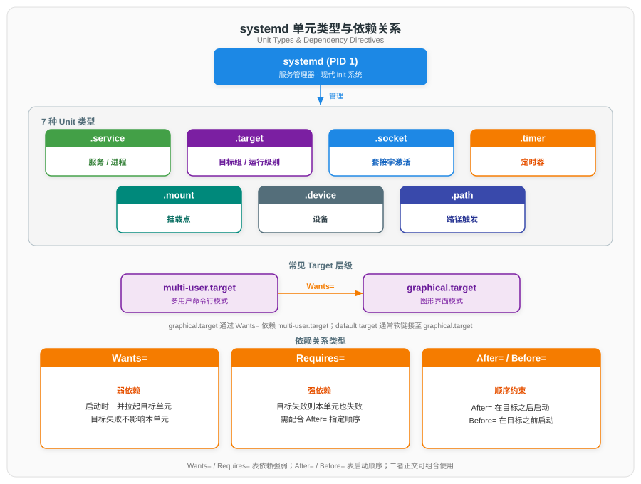

# 系统与进程管理命令

> 本文档为 Linux 常用命令系列分论篇之一，系统讲解进程基础概念、进程查看与控制、信号机制、定时任务、systemd 服务管理、系统资源监控、用户管理及进程诊断工具。命令行为 Linux 运维与后端开发的必备核心能力，理解进程状态机与服务管理模型是排查系统故障、优化资源使用的基础。

## 一、进程基础概念

进程是程序在操作系统中的运行实例，是资源分配与调度的基本单位。程序是磁盘上的静态可执行文件，而进程是动态的、占用内存与 CPU 的执行实体。Linux 内核使用 `task_struct` 结构体（定义于 `include/linux/sched.h`）描述每个进程，其中包含状态、PID、调度信息、打开的文件等字段。

### 1.1 进程与线程

- **进程（Process）**：拥有独立的虚拟地址空间、文件描述符表、信号处理器等资源。Linux 通过 `fork()` 系统调用创建子进程，子进程获得父进程数据的副本（写时复制 COW）。
- **线程（Thread）**：同一进程内的执行单元，共享地址空间与大部分资源，仅各自拥有独立的栈、寄存器与程序计数器。Linux 内核层面线程与进程统一为 `task_struct`，线程即"轻量级进程"（LWP），同一线程组共享 `tgid`（线程组 ID，即主线程的 PID）。

### 1.2 进程标识符

| 标识符 | 含义 | 说明 |
|--------|------|------|
| PID | 进程 ID | 内核唯一标识，`/proc/<pid>/` 对应其信息 |
| PPID | 父进程 ID | 创建该进程的进程 PID；父进程退出后由 init（PID 1，现代系统为 systemd）收养 |
| UID / EUID | 实际 / 有效用户 ID | EUID 决定进程当前访问权限，setuid 程序会临时切换 EUID |
| GID / EGID | 实际 / 有效组 ID | 同理，决定组权限 |
| PGID | 进程组 ID | 用于作业控制与信号投递 |
| SID | 会话 ID | 会话通常关联控制终端，守护进程通过 `setsid()` 创建新会话以脱离控制终端 |

### 1.3 进程状态

Linux 进程在其生命周期中处于以下五种核心状态之一，`ps` 与 `top` 的 STAT 列以单字母表示：

| 字母 | 状态 | 内核常量 | 说明 |
|------|------|----------|------|
| R | 运行 / 就绪 | TASK_RUNNING | 正在 CPU 上执行，或在运行队列中等待调度；`ps` 中两者合并为 R |
| S | 可中断睡眠 | TASK_INTERRUPTIBLE | 等待事件（如 I/O、信号量），可被信号唤醒 |
| D | 不可中断睡眠 | TASK_UNINTERRUPTIBLE | 等待磁盘 I/O 等内核事件，**不响应信号**，通常短暂存在 |
| Z | 僵尸进程 | EXIT_ZOMBIE | 进程已终止退出，但父进程尚未调用 `wait()` 回收，PID 与 `task_struct` 仍保留 |
| T | 停止 | TASK_STOPPED | 被 SIGSTOP / SIGTSTP / Ctrl+Z 暂停，需 SIGCONT 恢复 |

> **僵尸进程（Zombie）**：子进程退出后，父进程需通过 `wait()`/`waitpid()` 读取其退出状态；在此之前子进程占用 PID 且无法完全释放，成为僵尸进程。大量僵尸进程会耗尽 PID 表。若父进程未调用 wait()，需 kill 父进程使其子进程被 init 收养并回收。

`ps` 的 STAT 列在状态字母后可能附加以下修饰符（BSD 风格）：

| 修饰符 | 含义 |
|--------|------|
| `<` | 高优先级（nice 值为负） |
| `N` | 低优先级（nice 值为正） |
| `L` | 有内存页被锁定在 RAM |
| `s` | 会话首进程（session leader） |
| `l` | 多线程（含多个 LWP） |
| `+` | 位于前台进程组 |

> **会话（session）**：进程组的容器。一个会话包含一个或多个进程组，每个进程组只属于一个会话。会话为作业控制提供隔离边界——同一会话的进程组共享至多一个控制终端，shell 进程通过前台/后台进程组控制谁能读写终端。
>
> **会话首进程（session leader）**：调用 `setsid()` 的进程创建新会话并成为会话首进程，其 PID 即为 SID；调用 `setsid()` 同时使调用者脱离原会话（如有），并新建一个进程组由其担任组长。
>
> **典型场景**：
> - **终端登录**：login 进程调用 `setsid()` 创建新会话并关联控制终端，随后通过 `exec()` 将自身进程映像替换为 shell 程序而成为 shell 进程，因为前后 PID 不变，因此后面的 Shell 进程继承了前面的 login 进程的会话首进程身份；用户通过 shell 进程执行的每条命令或管道都会构成一个新的进程组，加入当前会话。
> - **守护进程**：进程调用 `setsid()` 创建无控制终端的新会话，脱离原终端独立运行。

进程状态转换关系如下图所示：



### 1.4 前台进程、后台进程与守护进程

- **前台进程**：与终端关联，占用终端输入，Ctrl+C 可终止。
- **后台进程**：以 `&` 结尾启动，不占用终端，但仍在该终端会话下，终端关闭时可能被发送 SIGHUP 而退出。
- **守护进程（Daemon）**：脱离任何控制终端、在后台长期运行的系统服务。手动创建守护进程的典型步骤：
  1. `fork()` 后父进程退出——子进程在后台运行
  2. 子进程调用 `setsid()` 创建新会话，成为会话首进程并脱离控制终端
  3. 再次 `fork()`——第一代子进程（会话首进程）退出，孙进程继续运行。孙进程不再是会话首进程，而会话首进程是唯一能关联控制终端的角色，因此孙进程无法重新获取终端
  4. `chdir("/")` 切换工作目录至根目录，避免占用可卸载文件系统
  5. `umask(0)` 重设文件创建掩码，确保后续创建文件的权限不受父进程继承值影响
  6. 将标准 I/O（fd 0/1/2）重定向至 `/dev/null`，防止读写已脱离的终端

  现代 Linux 中，systemd 直接管理大多数守护进程，无需手动执行上述步骤。

> **二次 fork 后会话为何不消失**：会话的生命周期不与会话首进程绑定——只要会话中仍有进程存在，会话就继续存在。步骤 2 的 `setsid()` 已创建无控制终端的新会话，因此首进程退出时不会触发 SIGHUP。首进程退出后孙进程被 init（PID 1）收养，但 SID 不变，会话归属不变。

## 二、进程查看

进程查看用于获取系统当前运行的进程快照或实时状态，是排查 CPU 占用、内存泄漏、僵死进程等问题的第一步。

### 2.1 ps — 进程快照

`ps` 报告当前进程的静态快照。它支持三种选项风格：UNIX 风格（`-e`、`-f`，带短横）、BSD 风格（`aux`，不带短横）、GNU 长选项（`--sort`）。最常用的是 BSD 风格 `ps aux` 与 UNIX 风格 `ps -ef`：

```bash
# BSD 风格：列出所有进程，显示 STAT 与 %CPU/%MEM
ps aux

# UNIX 风格：列出所有进程，显示 PPID 与完整启动时间
ps -ef

# 树形结构，展示父子关系
ps -ejH
ps axjf
```

`ps aux` 输出字段含义：

| 字段 | 含义 |
|------|------|
| USER | 进程属主 |
| PID | 进程 ID |
| %CPU | CPU 占用率 |
| %MEM | 物理内存占用率 |
| VSZ | 虚拟内存大小（KB），含交换区 |
| RSS | 常驻物理内存集（KB），实际占用 |
| TTY | 关联终端，`?` 表示无终端（守护进程） |
| STAT | 进程状态（见 1.3 节） |
| START | 进程启动时间 |
| TIME | 累计 CPU 时间 |
| COMMAND | 启动命令与参数 |

```bash
# 自定义输出字段
ps -eo pid,ppid,user,%cpu,%mem,stat,ni,pri,start,time,comm

# 按 CPU 占用降序取前 10
ps aux --sort=-%cpu | head -n 11

# 按内存占用降序取前 10
ps aux --sort=-%mem | head -n 11

# 查看指定进程的线程
ps -L -p <PID> -o pid,tid,pcpu,stat,comm

# 查看进程树（指定 PID 的子树）
pstree -p <PID>
```

### 2.2 top / htop — 实时进程监控

`top` 提供交互式实时进程视图，默认每 3 秒刷新。`htop` 是其增强版，支持鼠标、彩色、横向滚动与更直观的操作。

`top` 顶部系统摘要行解读：

- **load average**：1 / 5 / 15 分钟平均负载，反映运行队列长度。经验上超过 CPU 核数即过载。
- **CPU 行**：`us` 用户态、`sy` 内核态、`ni` nice 值为正的进程、`id` 空闲、`wa` 等待 I/O、`hi` 硬中断、`si` 软中断、`st` 被虚拟化偷走的时间。
- **内存行**：total / free / used / buff / cache（`top` 中 buff 与 cache 分列）。

`top` 常用交互快捷键：

| 快捷键 | 功能 |
|--------|------|
| P | 按 %CPU 排序 |
| M | 按 %MEM 排序 |
| N | 按 PID 排序 |
| T | 按累计 CPU 时间排序 |
| 1 | 展开每个 CPU 核心详情 |
| k | 输入 PID 发送信号（默认 SIGTERM） |
| r | 重置（renice）进程优先级 |
| u | 按用户过滤 |
| c | 切换显示完整命令行 |
| q | 退出 |

`htop` 在 `top` 基础上提供彩色进度条、F5 进程树视图、F6 排序、F9 发送信号、F7/F8 调整 nice 值、鼠标点击操作等增强能力，安装后建议作为日常首选。

## 三、进程控制与信号

进程控制的核心是向进程发送信号（signal），以实现终止、暂停、恢复、重载配置等操作。信号是 UNIX 系统最古老的进程间通信机制之一。

### 3.1 信号机制

信号（signal）是一种异步通知机制：内核或其他进程向目标进程发送信号后，目标进程在下次返回用户态时执行该信号的默认动作、自定义处理器或忽略它。信号的默认动作（disposition）分为 Term（终止）、Core（终止并转储核心）、Ign（忽略）、Stop（停止）、Cont（继续）。

下表列出常见信号（编号以 Linux x86/x86_64 为准，不同架构可能不同，详见 `man 7 signal`）：

| 信号 | 编号 | 默认动作 | 触发来源 | 说明 |
|------|------|----------|----------|------|
| SIGHUP | 1 | Term | 终端挂断 | 常被复用为通知守护进程重载配置 |
| SIGINT | 2 | Term | Ctrl+C | 键盘中断 |
| SIGQUIT | 3 | Core | Ctrl+\\ | 键盘退出，产生核心转储 |
| SIGABRT | 6 | Core | `abort()` | 通常由 assert 失败引发 |
| SIGKILL | 9 | Term | `kill -9` | **不可捕获、阻塞或忽略**，强制终止 |
| SIGSEGV | 11 | Core | 内核 | 非法内存访问（段错误） |
| SIGPIPE | 13 | Term | 内核 | 向无读取端的管道写数据 |
| SIGALRM | 14 | Term | `alarm()` | 定时器到期 |
| SIGTERM | 15 | Term | `kill`（默认） | 可被捕获以清理资源后再退出 |
| SIGCHLD | 17 | Ign | 内核 | 子进程退出 / 停止 / 继续时通知父进程 |
| SIGCONT | 18 | Cont | `kill -18` | 恢复被停止的进程 |
| SIGSTOP | 19 | Stop | `kill -19` | **不可捕获、阻塞或忽略**，强制停止 |
| SIGTSTP | 20 | Stop | Ctrl+Z | 终端停止，可被捕获 |
| SIGUSR1 / SIGUSR2 | 10 / 12 | Term | 应用程序 | 用户自定义信号 |

> **SIGKILL(9) 与 SIGTERM(15) 的区别**：SIGTERM 是 `kill` 的默认信号，进程可捕获并在处理器中执行清理（关闭文件、保存状态）后再退出，因此是优雅终止的首选；SIGKILL(9) 由内核直接终结进程，**不能被捕获、阻塞或忽略**，进程立即消失，可能造成文件损坏或临时数据丢失，仅当进程无响应时才作为最后手段。同样地，SIGSTOP(19) 不可被捕获，而 SIGTSTP(20) 可被捕获。

### 3.2 kill / pkill / killall

```bash
# kill：按 PID 发送信号（默认 SIGTERM）
kill <PID>            # 发送 SIGTERM
kill -15 <PID>        # 显式 SIGTERM，等价于上一行
kill -9 <PID>         # 强制终止（SIGKILL）
kill -SIGHUP <PID>    # 按名称发送
kill -l               # 列出所有信号名称与编号

# pkill：按名称或其他属性匹配并发送信号
pkill nginx           # 按进程名匹配，发送 SIGTERM
pkill -9 -f "python train.py"   # -f 匹配完整命令行
pkill -u alice        # 按 UID 匹配
pkill -P <PPID>       # 杀死指定父进程的所有子进程

# killall：按进程名精确匹配（名称必须完全等于）
killall nginx
killall -9 nginx
killall -u alice      # 杀死 alice 的所有进程
killall -i nginx      # 交互式确认
```

> `pkill -f` 与 `killall` 的区别：`pkill -f pattern` 默认匹配完整命令行（含参数），支持正则；`killall name` 默认仅匹配进程名（comm 字段，即可执行文件名），不支持正则。误用 `killall` 在某些系统（如 Solaris）会杀死所有进程，需谨慎。

### 3.3 作业控制

作业（Job）是 Shell 层面的概念，指一条管道或命令在当前 Shell 中的执行单元。作业控制允许在前后台之间切换。

```bash
# 后台运行：命令末尾加 &
./long_task.sh &

# Ctrl+Z：将前台作业挂起（发送 SIGTSTP），进入停止状态
# 查看当前 Shell 的作业列表
jobs
jobs -l               # 显示 PID

# bg / fg：后台 / 前台切换
bg %1                 # 让 1 号作业在后台继续运行（发送 SIGCONT）
fg %2                 # 将 2 号作业调回前台

# nohup：忽略 SIGHUP，使进程在终端关闭后继续运行
nohup ./long_task.sh > out.log 2>&1 &

# disown：将已有作业从 Shell 作业表移除，使其免受 SIGHUP 影响
./long_task.sh &
disown %1
disown -h %1          # -h 标记不向该作业发送 SIGHUP（更安全）
```

`nohup`、`&` 与 `disown` 的对比：

| 方式 | 是否后台 | 是否忽略 SIGHUP | 是否脱离 Shell 作业表 | 典型场景 |
|------|----------|-----------------|----------------------|----------|
| `&` | 是 | 否 | 否 | 临时后台运行，终端关闭即退出 |
| `nohup ... &` | 是 | 是 | 否 | 终端关闭后仍需运行的长期任务 |
| `disown` | 已是后台 | 是（标记不发送） | 是 | 对已在后台的作业补救，使其脱离 Shell |

> 持久化运行服务的现代做法是交给 systemd（参见第五章）或 tmux/screen 会话，而非依赖 `nohup`。

## 四、定时任务

定时任务用于在指定时间点或周期性执行命令脚本，是自动化运维（备份、清理、报表生成）的基础工具。Linux 提供 `at`（一次性）与 `crontab`（周期性）两套机制，现代 systemd 亦可通过 `.timer` 单元替代部分 crontab 场景（参见第五章）。

### 4.1 at — 一次性定时任务

`at` 在指定时间执行一次命令，适用于临时调度。需 `atd` 守护进程运行。

```bash
# 交互式：在今晚 23:30 执行
at 23:30
at> /home/user/backup.sh
at> <Ctrl+D>           # 按 Ctrl+D 结束输入

# 从文件读取命令
at -f /home/user/backup.sh 23:30

# 相对时间
at now + 30 minutes
at now + 2 hours
at tomorrow + 1 hour

# 查看当前用户的待执行任务队列
atq

# 删除 3 号任务
atrm 3
```

时间表达式支持 `HH:MM`、`midnight`、`noon`、`tomorrow`、`now + N units`（units 为 minutes/hours/days/weeks）等格式。

### 4.2 crontab — 周期性定时任务

`crontab` 管理 cron 守护进程的定时任务表，按固定周期（最小粒度 1 分钟）重复执行。每个用户拥有独立的 crontab 文件，存储于 `/var/spool/cron/` 下。

```bash
# 编辑当前用户的 crontab
crontab -e

# 查看当前用户的 crontab
crontab -l

# 删除当前用户的所有定时任务
crontab -r

# 以 root 身份编辑指定用户的 crontab
crontab -u alice -e
```

crontab 文件中每行是一条任务，由 5 个时间字段与命令组成，字段间以空格分隔：

```
# ┌──────── 分钟 (0-59)
# │ ┌────── 小时 (0-23)
# │ │ ┌──── 日 (1-31)
# │ │ │ ┌── 月 (1-12)
# │ │ │ │ ┌ 星期 (0-7，0 与 7 均为周日)
# │ │ │ │ │
  * * * * * command
```

| 字段 | 含义 | 取值范围 |
|------|------|----------|
| 第 1 字段 | 分钟 | 0–59 |
| 第 2 字段 | 小时 | 0–23 |
| 第 3 字段 | 日 | 1–31 |
| 第 4 字段 | 月 | 1–12 |
| 第 5 字段 | 星期 | 0–7（0 与 7 均为周日） |

时间字段支持以下特殊字符：

| 特殊字符 | 含义 | 示例 |
|----------|------|------|
| `*` | 任意值（该字段所有合法值） | `* * * * *` 每分钟执行 |
| `,` | 列举多个离散值 | `0,15,30,45 * * * *` 每 15 分钟 |
| `-` | 连续范围 | `0 9-18 * * 1-5` 工作日每小时 |
| `/` | 步长频率 | `*/5 * * * *` 每 5 分钟 |

crontab 任务示例：

```bash
# 每天凌晨 2:30 执行备份脚本，输出重定向到日志文件
30 2 * * * /home/user/backup.sh >> /var/log/backup.log 2>&1

# 每周一上午 9:00 清理临时文件
0 9 * * 1 find /tmp -type f -mtime +7 -delete

# 每 10 分钟检查服务状态
*/10 * * * * /home/user/check_service.sh
```

> **注意事项**：
> - cron 执行环境的 `PATH` 通常仅包含 `/usr/bin:/bin`，脚本中使用非标准路径命令时需写绝对路径或在脚本内显式 `export PATH`。
> - cron 任务默认无终端，标准输出与标准错误会通过邮件发送给任务属主；建议显式重定向到日志文件以避免邮件堆积。
> - 日与星期字段同时指定时，二者为**或**关系（满足任一即执行），而非与关系。
> - `%` 在 crontab 中为换行符，命令中的 `%` 需转义为 `\%`。

## 五、systemd 服务管理

systemd 是现代 Linux（CentOS 7+、Ubuntu 16.04+、Debian 8+）的默认 init 系统与服务管理器，以 PID 1 运行，取代了传统的 SysV init 与 Upstart。它通过"单元（Unit）"统一管理服务、挂载点、套接字、定时器等资源，支持并行启动、依赖声明、按需激活与统一日志（journald）。

systemd 的单元类型与依赖关系如下图所示：



### 5.1 Unit 类型

systemd 以 Unit 为管理基本单位，不同后缀对应不同资源类型：

| Unit 类型 | 后缀 | 说明 |
|-----------|------|------|
| Service | `.service` | 系统服务 / 守护进程，最常用类型 |
| Target | `.target` | 一组 Unit 的集合，用于分组与运行级别对齐 |
| Socket | `.socket` | 套接字激活，按需启动对应 .service |
| Timer | `.timer` | 定时器，可替代 crontab 实现周期任务 |
| Mount | `.mount` | 文件系统挂载点 |
| Device | `.device` | 内核识别的设备 |
| Path | `.path` | 路径变化触发（文件创建、修改等） |

### 5.2 Unit 文件结构

Unit 文件存放于三处，优先级从高到低：`/etc/systemd/system/`（管理员自定义）> `/run/systemd/system/`（运行时）> `/usr/lib/systemd/system/`（软件包安装）。一个典型的 `.service` 文件分为 `[Unit]`、`[Service]`、`[Install]` 三个段：

```ini
[Unit]
Description=Nginx HTTP Server
Documentation=http://nginx.org/en/docs/
After=network.target
Wants=network-online.target

[Service]
Type=forking
PIDFile=/run/nginx.pid
ExecStartPre=/usr/sbin/nginx -t
ExecStart=/usr/sbin/nginx
ExecReload=/usr/sbin/nginx -s reload
ExecStop=/usr/sbin/nginx -s stop
Restart=on-failure
RestartSec=5s

[Install]
WantedBy=multi-user.target
```

`[Unit]` 段的依赖与顺序指令：

| 指令 | 类别 | 说明 |
|------|------|------|
| `Wants=` | 弱依赖 | 启动时一并拉起目标单元；目标失败不影响本单元 |
| `Requires=` | 强依赖 | 目标失败则本单元也失败；需配合 `After=` 指定顺序 |
| `After=` | 顺序约束 | 在指定单元之后启动 |
| `Before=` | 顺序约束 | 在指定单元之前启动 |
| `WantedBy=` | 安装映射 | `enable` 时在目标 target 的 `.wants/` 目录创建 symlink |

> `Wants=` / `Requires=` 表依赖强弱，`After=` / `Before=` 表启动顺序，二者正交可组合使用。`Requires=` 仅声明依赖，不保证顺序；若需目标先启动完成，需同时写 `Requires=` 与 `After=`。

`[Service]` 段的 `Type=` 决定 systemd 如何判定服务激活（即从 activating 转为 active）。所有类型均由 systemd fork 出服务进程，差异在于后续判定方式：

| Type | 激活标志 | 后续流程 | 适用场景 |
|------|---------|---------|----------|
| `simple`（默认） | 服务进程创建成功即激活 | 立即标记激活 | 前台运行的服务 |
| `forking` | 服务进程退出，子进程接管即激活 | 服务进程再 fork 出子进程后退出，systemd 跟踪子进程为主进程 | 传统守护进程（如 Nginx、MySQL） |
| `oneshot` | 服务进程执行完毕退出即激活 | 等待服务进程退出 | 一次性脚本任务 |
| `notify` | 收到服务就绪通知即激活 | 等待服务进程调用 `sd_notify()` 发送就绪信号 | 支持 systemd 通知协议的服务 |
| `dbus` | 服务进程获取 D-Bus 名称即激活 | 服务进程通过 D-Bus API `sd_bus_request_name()` 请求注册指定的名称，systemd 等待注册成功 | D-Bus 服务 |

### 5.3 systemctl — 服务控制

`systemctl` 是管理 systemd 单元的核心命令：

```bash
# 启动 / 停止 / 重启 / 重新加载配置
systemctl start nginx.service
systemctl stop nginx.service
systemctl restart nginx.service
systemctl reload nginx.service

# 查看服务状态
systemctl status nginx.service

# 开机自启管理
systemctl enable nginx.service      # 设置开机自启
systemctl disable nginx.service     # 取消开机自启
systemctl is-enabled nginx.service  # 查看是否开机自启
systemctl is-active nginx.service   # 查看是否正在运行

# 列出所有单元
systemctl list-units                # 所有已加载的活跃单元
systemctl list-units --type=service # 仅服务类型
systemctl list-unit-files           # 所有已安装的单元文件
systemctl list-units --failed       # 启动失败的单元

# 查看依赖关系
systemctl list-dependencies nginx.service

# 重新加载修改过的单元文件（修改 unit 文件后必须执行）
systemctl daemon-reload
```

常用 systemctl 子命令汇总：

| 子命令 | 作用 |
|--------|------|
| `start` | 启动单元 |
| `stop` | 停止单元 |
| `restart` | 重启单元（先 stop 再 start） |
| `reload` | 重新加载配置（不中断服务） |
| `status` | 查看运行状态与最近日志 |
| `enable` | 设置开机自启（创建 symlink） |
| `disable` | 取消开机自启（移除 symlink） |
| `is-active` | 检查是否正在运行 |
| `is-enabled` | 检查是否开机自启 |
| `list-units` | 列出已加载的单元 |
| `list-unit-files` | 列出已安装的单元文件 |
| `daemon-reload` | 重新加载 unit 文件 |

### 5.4 journalctl — 日志查询

`journalctl` 是 systemd 日志系统 journald 的查询工具。journald 收集内核日志与各服务进程的日志（二进制格式，存储于 `/var/log/journal/`），通过 `journalctl` 统一查询：

```bash
# 查看所有日志（最新在最后）
journalctl

# 查看指定服务的日志
journalctl -u nginx.service

# 实时跟踪日志（类似 tail -f）
journalctl -u nginx.service -f

# 按时间过滤
journalctl --since "2026-07-11 09:00" --until "2026-07-11 12:00"
journalctl --since "1 hour ago"

# 按优先级过滤（0 emerg ~ 7 debug）
journalctl -p err

# 查看本次系统启动以来的日志
journalctl -b

# 查看上一次系统启动期间的日志
journalctl -b -1

# 查看操作系统内核日志（类似 dmesg）
journalctl -k
```

### 5.5 service / chkconfig — 传统兼容命令

部分系统仍保留 `service` 与 `chkconfig` 命令作为 SysV init 的兼容接口，实际转发至 systemctl：

```bash
# 传统方式启动服务（内部调用 systemctl）
service nginx start
service nginx status

# 传统方式设置开机自启（内部调用 systemctl）
# chkconfig 为 Red Hat 系（RHEL/CentOS/Fedora）命令，Debian/Ubuntu 对应 update-rc.d
chkconfig nginx on
chkconfig --list nginx
```

> 在 systemd 系统上，推荐直接使用 `systemctl`，`service` 与 `chkconfig` 仅为向后兼容。

## 六、系统资源监控

系统资源监控用于实时观察内存、CPU、I/O 与负载等关键指标，是排查性能瓶颈与容量规划的基础。

### 6.1 free — 内存使用

`free` 显示系统物理内存与交换分区的使用情况：

```bash
# 以 KB 为单位（默认）
free

# 以人类可读单位显示
free -h

# 每隔 2 秒刷新，共 5 次
free -h -s 2 -c 5
```

输出字段说明：

| 字段 | 含义 |
|------|------|
| total | 总内存大小 |
| used | 已使用内存（不含 buffer/cache，计算式 `total - free - buff/cache`） |
| free | 完全空闲的内存 |
| shared | 共享内存（如 tmpfs） |
| buff/cache | 系统用作 buffer 与 cache 的内存 |
| available | 实际可供新进程使用的内存（已扣除 buffer/cache 不可回收部分） |

> **buffer 与 cache 的区别**：
> 
> - **buffer（缓冲区）**：面向块设备层，缓存磁盘块数据与文件系统元数据（如 inode、superblock），对应内核 `buffer cache`。
> - **cache（页缓存）**：面向文件层，缓存文件内容页，对应内核 `page cache`，读时避免磁盘 I/O、写时先暂存再异步刷盘（write-back）。
> 
> 两者均可在内存压力大时被内核回收，因此评估可用内存应以 `available` 而非 `free` 为准。
>
> 注：现代 Linux（内核 2.4+）已将两者统一，buffer cache 底层复用 page cache，`free` 仍分开统计仅因块 I/O 的 buffer head 机制保留。

### 6.2 vmstat — 虚拟内存统计

`vmstat` 报告进程、内存、I/O、CPU 等系统活动的综合统计信息：

```bash
# 每 1 秒采样一次，持续输出
vmstat 1

# 采样 5 次后退出
vmstat 1 5

# 显示活动与非活动内存
vmstat -a 1
```

输出字段说明：

| 类别 | 字段 | 含义 |
|------|------|------|
| procs | r | 运行队列中等待 CPU 的进程数（持续 > CPU 核心数表示 CPU 瓶颈） |
| procs | b | 处于 D 状态（不可中断睡眠）的进程数 |
| memory | swpd | 已使用的交换分区大小 |
| memory | free | 空闲内存 |
| memory | buff | buffer 缓冲区大小 |
| memory | cache | page cache 大小 |
| swap | si | 每秒从磁盘换入内存的数据量（KB/s） |
| swap | so | 每秒从内存换出至磁盘的数据量（KB/s） |
| io | bi | 每秒从块设备读入的块数（blocks/s） |
| io | bo | 每秒写入块设备的块数（blocks/s） |
| system | in | 每秒中断数 |
| system | cs | 每秒上下文切换数 |
| cpu | us | 用户态 CPU 时间百分比 |
| cpu | sy | 内核态 CPU 时间百分比 |
| cpu | id | 空闲 CPU 时间百分比 |
| cpu | wa | 等待 I/O 的 CPU 时间百分比（持续高表示磁盘瓶颈） |

### 6.3 uptime / w / who — 系统负载与登录用户

```bash
# 显示系统运行时间与平均负载
uptime
# 输出示例：10:30:00 up 5 days,  2:15,  3 users,  load average: 0.20, 0.15, 0.10

# 显示所有已登录用户及其活动
w

# 仅列出已登录用户名
who
```

`uptime` 的 load average 表示过去 1 分钟、5 分钟、15 分钟的平均负载（运行队列中的平均进程数）。该值不应超过 CPU 逻辑核心数；持续高于核心数表示系统过载。

## 七、用户管理

用户管理涉及身份切换、用户增删改与认证文件维护，是系统安全管理的基础。

### 7.1 su / sudo — 身份切换

| 维度 | `su` | `sudo` |
|------|------|--------|
| 机制 | 切换至目标用户（需输入目标用户密码，root 切换至任意用户免密） | 以目标用户身份执行单条命令（需输入当前用户密码） |
| 授权方式 | 知道目标用户密码即可 | 需在 `/etc/sudoers` 中授权 |
| 审计 | 仅记录用户切换事件，不记录后续执行的命令 | 记录每条命令到日志（`/var/log/secure`） |
| 最小权限 | 切换后获得目标用户全部权限 | 可限制可执行的命令（`sudoers` 中精确授权） |
| 推荐场景 | 已知 root 密码的运维场景 | 生产环境首选，符合最小权限原则 |

```bash
# su：切换至 root（非登录 Shell，不加载 root 的环境变量）
su

# su -：切换至 root 并启动登录 Shell（加载 root 的完整环境）
su -

# su -：切换至指定用户
su - alice

# sudo：以 root 身份执行单条命令
sudo cat /etc/shadow

# sudo：以指定用户身份执行
sudo -u bob ./script.sh

# 查看当前用户的 sudo 权限
sudo -l
```

> 生产环境推荐使用 `sudo` 而非 `su`：`sudo` 提供细粒度授权与完整审计日志，且无需共享 root 密码。`/etc/sudoers` 应使用 `visudo` 命令编辑（自带语法检查，避免配置错误导致 sudo 失效）。

### 7.2 useradd / usermod / userdel / passwd — 用户增删改

```bash
# 创建用户（创建家目录，指定 Shell）
useradd -m -s /bin/bash alice

# 设置密码
passwd alice

# 修改用户：加入附加组
usermod -aG docker alice

# 修改用户：更改登录 Shell
usermod -s /bin/zsh alice

# 修改用户：锁定 / 解锁账号
usermod -L alice          # 锁定（在密码哈希前加 !）
usermod -U alice          # 解锁

# 删除用户（同时删除家目录与邮箱）
userdel -r alice
```

| 命令 | 作用 | 关键选项 |
|------|------|----------|
| `useradd` | 创建用户 | `-m` 创建家目录；`-s` 指定 Shell；`-g` 指定主组；`-G` 指定附加组 |
| `usermod` | 修改用户属性 | `-aG` 追加附加组（不加 `-a` 会覆盖原有附加组）；`-L` 锁定；`-U` 解锁 |
| `userdel` | 删除用户 | `-r` 同时删除家目录与邮箱 |
| `passwd` | 设置 / 修改密码 | `passwd` 修改当前用户密码；`passwd alice` 以 root 修改指定用户密码 |

### 7.3 /etc/passwd 与 /etc/shadow

用户信息存储于两个核心文件中：

**`/etc/passwd`** — 用户基本信息（所有用户可读）：

```
alice:x:1001:1001:Alice:/home/alice:/bin/bash
```

每行 7 个字段，以 `:` 分隔：

| 字段位置 | 字段名 | 说明 |
|----------|--------|------|
| 1 | 用户名 | 登录名 |
| 2 | 密码占位 | 历史存放密码哈希，现为 `x`，实际哈希在 `/etc/shadow` |
| 3 | UID | 用户 ID（root 为 0） |
| 4 | GID | 主组 ID |
| 5 | GECOS | 用户全名 / 注释信息 |
| 6 | 家目录 | 用户登录后的工作目录 |
| 7 | Shell | 登录 Shell（设为 `/sbin/nologin` 或 `/bin/false` 可禁止登录） |

**`/etc/shadow`** — 密码哈希与过期策略（仅 root 可读）：

```
alice:$6$rounds=5000$salt...:19000:0:99999:7:::
```

| 字段位置 | 说明 |
|----------|------|
| 1 | 用户名 |
| 2 | 密码哈希，格式为 `$id$[rounds=N$]salt$hash`：`$id$` 标识算法（`$6$` 为 SHA-512、`$5$` 为 SHA-256、`$1$` 为 MD5）；`rounds=N$` 为可选的迭代次数（省略则用算法默认值）；`!` 或 `*` 表示禁用密码登录 |
| 3 | 密码最后修改日期（自 1970-01-01 的天数） |
| 4 | 密码最短使用天数（0 表示随时可改） |
| 5 | 密码最长使用天数（99999 表示不过期） |
| 6 | 密码过期前警告天数 |
| 7 | 密码过期后宽限天数 |
| 8 | 账号过期日期 |
| 9 | 保留字段 |

## 八、系统信息

系统信息命令用于查看内核版本、主机名与内核日志，是排查硬件兼容性与启动故障的常用工具。

### 8.1 uname — 内核信息

```bash
# 显示所有信息
uname -a
# 输出示例：Linux host01 5.15.0-76-generic #86-Ubuntu SMP x86_64 GNU/Linux

# 仅显示内核版本
uname -r

# 仅显示系统架构
uname -m
```

| 选项 | 输出内容 |
|------|----------|
| `-a` | 全部信息 |
| `-s` | 内核名称（Linux） |
| `-r` | 内核版本号 |
| `-m` | 硬件架构（x86_64、aarch64） |
| `-n` | 网络节点主机名 |

### 8.2 hostname — 主机名管理

```bash
# 查看当前主机名
hostname

# 查看全限定域名（FQDN）
hostname -f

# 临时修改主机名（重启后失效）
hostname web-server-01

# 永久修改主机名（systemd 系统）
hostnamectl set-hostname web-server-01
```

> `hostname` 修改为临时生效（仅写入内核运行时）；`hostnamectl set-hostname` 会持久化至 `/etc/hostname`，重启后仍然有效。

### 8.3 dmesg — 内核环缓冲日志

`dmesg` 打印内核环缓冲区（ring buffer）中的日志，其记录硬件检测、驱动加载、运行时错误等内核运行信息：

```bash
# 查看全部内核日志
dmesg

# 以人类可读时间戳显示
dmesg -T

# 仅查看错误级别以上日志
dmesg --level=err,warn

# 实时跟踪新日志
dmesg -w
```

> 在 systemd 系统上，`dmesg` 与 `journalctl -k` 输出内容一致，后者提供更强的过滤能力（按时间、优先级、单元等）。

## 九、进程诊断工具

进程诊断工具用于深入分析进程的运行时行为，包括打开的文件、系统调用与库函数调用，是排查"端口占用""进程卡死""资源泄漏"等疑难问题的利器。

### 9.1 lsof — 查看打开的文件

Linux 中"一切皆文件"，`lsof`（list open files）可查看进程打开的常规文件、目录、网络套接字、管道、设备等：

```bash
# 查看指定进程打开的所有文件
lsof -p 1234

# 查看哪个进程占用了 80 端口
lsof -i :80

# 查看所有 TCP 连接
lsof -i tcp

# 查看指定用户打开的文件
lsof -u alice

# 查看正在使用 /var/log 目录下文件的进程（排查"设备忙"无法卸载）
lsof +D /var/log
```

| 常用形式 | 作用 |
|----------|------|
| `lsof -p <PID>` | 指定进程打开的文件 |
| `lsof -i :<port>` | 占用指定端口的进程 |
| `lsof -i tcp` / `lsof -i udp` | 所有 TCP / UDP 连接 |
| `lsof -u <user>` | 指定用户打开的文件 |
| `lsof <file>` | 打开指定文件的进程 |
| `lsof +D <dir>` | 正在使用目录下文件的进程（递归查找） |

### 9.2 strace / ltrace — 系统调用与库函数追踪

`strace` 追踪进程发出的系统调用（syscall），`ltrace` 追踪动态库函数调用，两者均为排查进程卡死、权限错误、文件找不到等问题的终极工具：

```bash
# strace：追踪命令执行的所有系统调用
strace ./myapp

# strace：仅追踪文件相关系统调用
strace -e trace=file ./myapp

# strace：附加到正在运行的进程
strace -p 1234

# strace：统计每种系统调用的次数与耗时
strace -c ./myapp

# strace：显示时间戳（每个系统调用的时间）
strace -t ./myapp

# ltrace：追踪库函数调用
ltrace ./myapp
```

| 工具 | 追踪对象 | 典型场景 |
|------|----------|----------|
| `strace` | 内核系统调用（open、read、write、connect 等） | 进程卡在哪个 syscall、文件权限被拒、网络连接失败 |
| `ltrace` | 用户态动态库函数（malloc、printf、fopen 等） | 程序调用了哪个库函数、参数与返回值 |

> `strace -e trace=file` 仅追踪文件操作类系统调用（open、openat、stat、readlink 等），适用于排查"程序为什么读不到配置文件"或"访问了哪些路径"。`strace -c` 汇总统计适用于快速定位性能瓶颈 syscall。

## 参考资料

- [Linux man pages — ps(1)](https://man7.org/linux/man-pages/man1/ps.1.html)
- [Linux man pages — top(1)](https://man7.org/linux/man-pages/man1/top.1.html)
- [Linux man pages — kill(1)](https://man7.org/linux/man-pages/man1/kill.1.html)
- [Linux man pages — signal(7)](https://man7.org/linux/man-pages/man7/signal.7.html)
- [Linux man pages — crontab(5)](https://man7.org/linux/man-pages/man5/crontab.5.html)
- [Linux man pages — free(1)](https://man7.org/linux/man-pages/man1/free.1.html)
- [Linux man pages — vmstat(8)](https://man7.org/linux/man-pages/man8/vmstat.8.html)
- [Linux man pages — lsof(8)](https://man7.org/linux/man-pages/man8/lsof.8.html)
- [Linux man pages — strace(1)](https://man7.org/linux/man-pages/man1/strace.1.html)
- [Linux man pages — uname(1)](https://man7.org/linux/man-pages/man1/uname.1.html)
- [systemd Official Documentation](https://systemd.io/)
- [systemd.service — Service Unit Configuration](https://www.freedesktop.org/software/systemd/man/systemd.service.html)
- [systemd.unit — Unit Configuration](https://www.freedesktop.org/software/systemd/man/systemd.unit.html)
- [Linux kernel — task_struct (sched.h)](https://git.kernel.org/pub/scm/linux/kernel/git/torvalds/linux.git/tree/include/linux/sched.h)
- [The Linux Programming Interface — Michael Kerrisk](https://man7.org/tlpi/)

