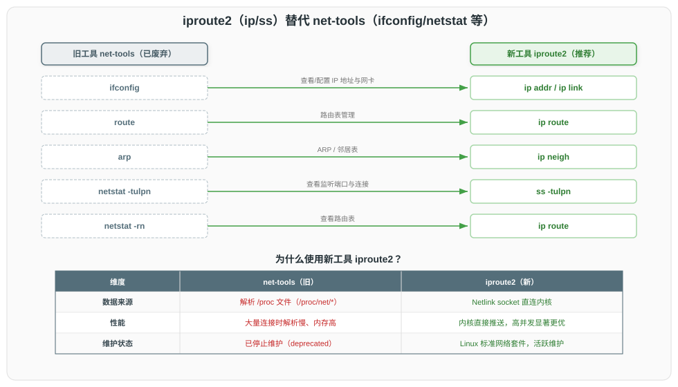
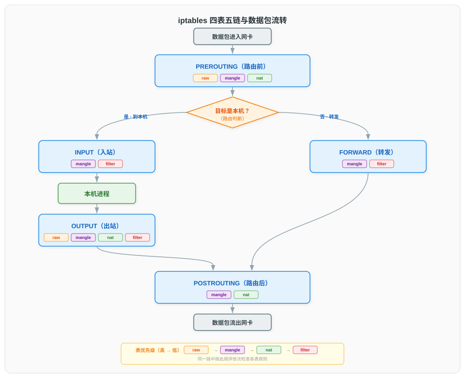
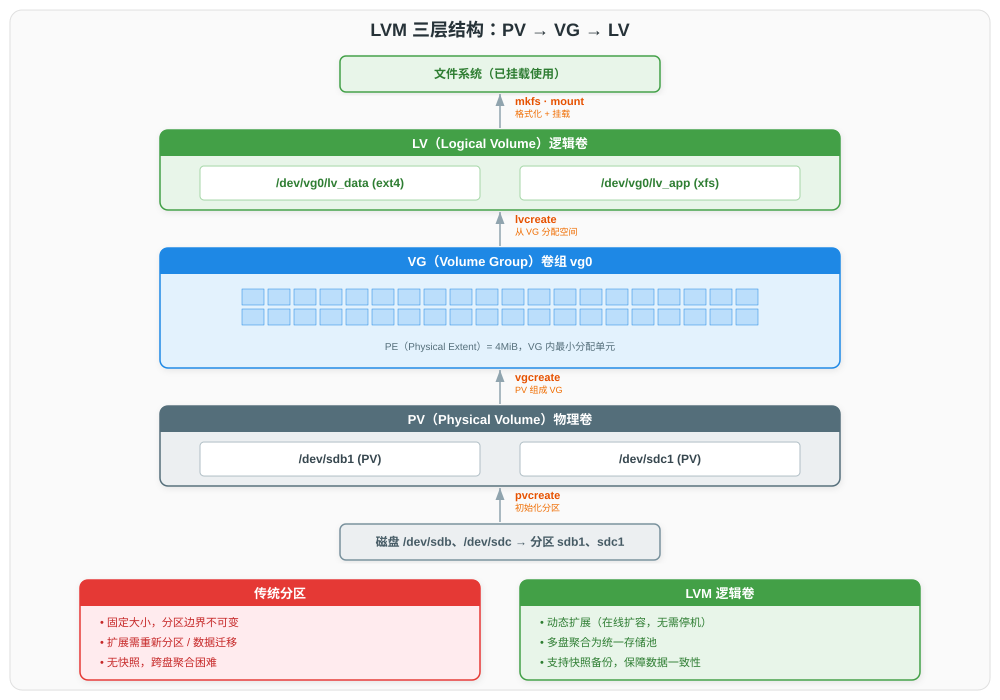

# 网络与磁盘管理命令

> 本文档为 Linux 常用命令系列分论篇之一，系统讲解网络配置与诊断、连接查看、数据传输、防火墙、SSH 远程管理、包捕获、磁盘分区、文件系统管理、磁盘空间分析、LVM 逻辑卷管理、I/O 性能监控及 Swap 管理。网络与磁盘是后端服务运行的两条生命线：网络决定服务可达性，磁盘决定数据持久性与 I/O 吞吐。掌握这两类命令是排查"连不上""读写慢""空间满""卷扩容"等线上高频故障的核心能力。

## 一、网络配置

网络配置命令用于查看与设置网卡、IP 地址、路由表、ARP 邻居表及网络命名空间。Linux 网络配置工具经历了从 net-tools 到 iproute2 的代际更替，理解这一演进有助于选择正确的工具。

### 1.1 ip — 现代网络配置工具

`ip` 命令来自 [iproute2](https://baturin.org/docs/iproute2/) 工具集，是 Linux 现代网络配置的事实标准。它通过 Netlink socket（`AF_NETLINK`）与内核通信，直接操作内核网络子系统数据结构，取代了基于 `/proc` 与 `ioctl` 的旧工具 net-tools（ifconfig、route、arp）。Netlink 是一种基于 socket 的双向内核-用户态通信机制（[RFC 3549](https://www.rfc-editor.org/rfc/rfc3549)），支持多播事件通知，比 ioctl 更适合批量配置与状态监听。



`ip` 命令采用 `ip 对象 命令 [参数]` 的层次语法，主要对象如下：

| 对象 | 缩写 | 作用 | 替代的旧工具 |
|------|------|------|-------------|
| `link` | `l` | 网卡设备配置（启停、MTU、MAC） | ifconfig |
| `addr` | `a` | IP 地址管理（IPv4/IPv6） | ifconfig |
| `route` | `r` | 路由表管理 | route |
| `neigh` | `n` | ARP/邻居表管理 | arp |
| `rule` | `ru` | 策略路由规则 | 无 |
| `netns` | | 网络命名空间管理 | 无 |
| `maddr` | `m` | 多播地址管理 | ipmaddr |

常用操作示例：

```bash
# 查看所有网卡与链路状态
ip link show
ip -br link show          # 精简模式：网卡名、状态、MTU

# 查看 IP 地址
ip addr show
ip -br addr show          # 精简模式：网卡名、状态、IP

# 启停网卡
sudo ip link set dev eth0 up
sudo ip link set dev eth0 down

# 添加 / 删除 IP 地址（24 为前缀长度，等价于掩码 255.255.255.0）
sudo ip addr add 192.168.1.10/24 dev eth0
sudo ip addr del 192.168.1.10/24 dev eth0

# 设置 MTU
sudo ip link set dev eth0 mtu 1400
```

路由管理：

```bash
# 查看主路由表
ip route show

# 查看某 IP 的路由决策（实际查询内核 FIB）
ip route get 8.8.8.8

# 添加默认网关
sudo ip route add default via 192.168.1.1

# 添加静态路由（目标 10.0.0.0/24 经 192.168.1.254 从 eth0 出）
sudo ip route add 10.0.0.0/24 via 192.168.1.254 dev eth0

# 删除路由
sudo ip route del 10.0.0.0/24
```

邻居表（ARP）管理：

```bash
# 查看 ARP 缓存
ip neigh show

# 删除某条 ARP 记录（IP 冲突或 ARP 污染时使用）
sudo ip neigh del 192.168.1.5 dev eth0

# 刷新所有 ARP 缓存
sudo ip neigh flush all
```

> **ifconfig 为何废弃**：ifconfig 来自 net-tools，依赖 `/proc/net/` 与 ioctl 系统调用，无法完整显示多 IP 绑定（仅显示第一个别名地址）、不支持策略路由、不原生支持 IPv6 多项特性。net-tools 自 2009 年起停止维护，[iproute2](https://baturin.org/docs/iproute2/) 由内核维护者 Stephen Hemminger 维护，是内核网络子系统的官方配套工具。所有现代发行版（RHEL/CentOS 7+、Ubuntu 18.04+、Debian 10+）默认不再预装 net-tools，`ip` 为首选。

### 1.2 ifconfig — 旧版网络配置工具

`ifconfig` 属于 net-tools 工具集，用于查看与配置网卡 IP 地址、掩码、MTU 等。其输出格式直观，仍见于部分旧系统与脚本，但功能受限，应优先使用 `ip`。

```bash
# 查看所有活动网卡
ifconfig
# 查看指定网卡
ifconfig eth0
# 配置 IP（临时生效）
sudo ifconfig eth0 192.168.1.10 netmask 255.255.255.0 up
```

### 1.3 nmcli — NetworkManager 命令行接口

`nmcli` 是 [NetworkManager](https://networkmanager.dev/) 的命令行客户端，用于在桌面环境与服务器中以"连接（connection）"为单位管理网络。NetworkManager 通过 D-Bus 暴露 API，支持动态管理以太网、Wi-Fi、VPN、Bonding、Bridge 等多种连接类型。nmcli 配置的连接可持久化到 `/etc/NetworkManager/system-connections/`，重启后自动生效，弥补 `ip` 命令仅临时生效的不足。

```bash
# 查看所有连接
nmcli connection show

# 查看所有设备状态
nmcli device status

# 创建静态 IP 连接并启用
sudo nmcli connection add type ethernet con-name static-eth0 ifname eth0 \
  ipv4.addresses 192.168.1.10/24 ipv4.gateway 192.168.1.1 \
  ipv4.dns "8.8.8.8 1.1.1.1" ipv4.method manual
sudo nmcli connection up static-eth0

# 修改现有连接
sudo nmcli connection modify static-eth0 ipv4.addresses 192.168.1.20/24

# 重启连接
sudo nmcli connection reload && sudo nmcli connection up static-eth0
```

| 对比维度 | ip | ifconfig | nmcli |
|----------|----|----------|-------|
| 数据来源 | Netlink socket | /proc + ioctl | D-Bus → NetworkManager |
| 持久化 | 否（临时生效） | 否 | 是（写入配置文件） |
| 维护状态 | 官方维护 | 已停止维护 | 官方维护 |
| 适用场景 | 即时配置 / 脚本 | 旧系统兼容 | 桌面 / 服务器持久化 |

## 二、网络诊断

网络诊断命令用于检测主机可达性、定位网络路径上的故障节点与延迟。

### 2.1 ping — 连通性检测

`ping` 基于 ICMP Echo（RFC 792）工作：发送 ICMP Echo Request（type 8），目标主机返回 ICMP Echo Reply（type 0）。它通过测量往返时延（RTT）与丢包率判断网络连通性与质量。ping 不依赖 TCP/UDP 端口，仅测试网络层可达性。

```bash
# 持续 ping（Ctrl+C 停止，显示统计）
ping 192.168.1.1

# 指定次数与包大小
ping -c 4 -s 1000 8.8.8.8

# 指定源 IP（多网卡场景）
ping -I 192.168.1.10 8.8.8.8

# 快速 ping（间隔 0.2 秒，洪水模式需 root）
sudo ping -f 192.168.1.1
```

> **ping 不通的常见原因**：目标主机禁用 ICMP Reply（如防火墙 DROP ICMP type 8）、中间设备过滤 ICMP、目标 IP 错误、ARP 未解析、路由不可达。ping 不通不代表服务不可用（TCP/UDP 仍可达），应结合 `tcping` 或 `nc -zv` 验证端口。

### 2.2 traceroute — 路径追踪

`traceroute` 利用 IP TTL（Time To Live）字段逐跳探测路径：第一个包 TTL=1，第一个路由器收到后 TTL 减为 0，丢弃并返回 ICMP Time Exceeded（type 11）；逐步递增 TTL，每个跳点的路由器返回 Time Exceeded，直到到达目标或达到最大跳数。

```bash
# 追踪路径（默认 UDP 探测）
traceroute 8.8.8.8

# 使用 ICMP 探测（穿透禁用 UDP 的防火墙）
traceroute -I 8.8.8.8

# 指定最大跳数与探测次数
traceroute -m 20 -q 1 8.8.8.8
```

`tracepath` 是 traceroute 的简化版，无需 root 权限，自动探测路径 MTU（PMTU）：

```bash
tracepath 8.8.8.8
```

### 2.3 arping — ARP 层检测

`arping` 工作在数据链路层，直接发送 ARP Request 探测同一广播域内主机的可达性。与 ping 不同，arping 不经过 IP 层，用于检测 IP 冲突、验证 ARP 表、测试二层连通性。

```bash
# 检测 IP 是否被占用（IP 冲突排查）
sudo arping -D -I eth0 -c 2 192.168.1.10
# -D 冲突检测模式，若有应答则该 IP 已被占用

# 探测指定 IP 的 MAC 地址
sudo arping -I eth0 192.168.1.1
```

## 三、连接查看

连接查看命令用于监控本机的网络连接状态、监听端口、套接字统计，是排查端口占用、连接泄漏、异常外联的关键工具。

### 3.1 ss — 现代套接字查看工具

`ss`（Socket Statistics）同样来自 iproute2 工具集，取代了 netstat。它通过 Netlink socket 直接读取内核套接字表，不依赖 `/proc/net/tcp` 解析，性能远高于 netstat——在数万连接的场景下 `ss` 几乎瞬时返回，而 netstat 可能需要数十秒。


```bash
# 查看所有 TCP 连接
ss -t              # 仅 ESTABLISHED
ss -t -a           # 含 LISTEN

# 查看所有监听端口（TCP + UDP）
ss -tulnp
# -t TCP  -u UDP  -l 仅 LISTEN  -n 不解析端口名  -p 显示进程

# 查看某端口的连接
ss -tnp | grep :8080

# 统计各状态连接数
ss -s

# 查看指定状态的连接（如 TIME_WAIT）
ss -tan state time-wait | wc -l
```

`ss -s` 输出示例与字段含义：

```
Total: 234 (kernel 240)
TCP:   156 (estab 45, closed 80, orphaned 0, synrecv 0, timewait 80/0), ports 0
```

| 统计项 | 含义 |
|--------|------|
| Total | 所有协议套接字总数；括号内 kernel 为内核哈希表已分配的套接字结构数（含过渡态，可能略大于用户可见数） |
| TCP | TCP 套接字总数（所有状态之和，等于 estab + closed + orphaned + synrecv + timewait） |
| estab | ESTABLISHED 状态的 TCP 连接数 |
| closed | 处于 CLOSE_WAIT、FIN_WAIT1/2、CLOSING、LAST_ACK、SYN_SENT 等非活跃状态的 TCP 套接字数（不含 TIME_WAIT，后者单独统计） |
| orphaned | 孤儿套接字数——已不属于任何进程（无对应文件描述符），大量积累通常意味着进程异常退出未正确关闭连接 |
| synrecv | SYN_RECV 状态的 TCP 套接字数（半连接，已收到 SYN 发送 SYN+ACK，等待对方 ACK 确认） |
| timewait | TIME_WAIT 状态的 TCP 套接字数；斜杠后为定时器轮中尚未超时的条目数 |
| ports | 绑定哈希表中的 TCP 端口条目数 |

### 3.2 netstat — 旧版套接字查看工具

`netstat` 属于 net-tools，兼容性较好但在大规模连接场景下性能差。其常用参数与 `ss` 一致：

```bash
# 查看所有 TCP 监听端口与进程
netstat -tulnp

# 查看路由表（等价 ip route）
netstat -rn

# 查看各协议统计
netstat -s
```

> **netstat 与 ss 选择**：两者参数兼容（`-tulnp` 行为一致），但 `ss` 直接走 Netlink，性能优势在万级连接时可达 10 倍以上。所有现代发行版推荐 `ss`，netstat 仅在旧系统上使用。

## 四、数据传输

数据传输命令用于在不同主机间复制文件、下载资源、同步目录。

### 4.1 curl — 多协议数据传输

[curl](https://curl.se/docs/manpage.html) 支持 HTTP/HTTPS/FTP/SCP/SFTP 等 20 余种协议，是命令行数据传输的事实标准。它以 URL 为输入，支持丰富的请求定制。

```bash
# GET 请求（默认）
curl https://example.com/api

# 仅显示响应头
curl -I https://example.com

# 显示详细握手过程（排查 TLS / 重定向）
curl -v https://example.com

# POST JSON
curl -X POST https://example.com/api \
  -H "Content-Type: application/json" \
  -d '{"key":"value"}'

# 带认证与超时
curl -u user:pass --connect-timeout 5 --max-time 30 https://example.com

# 下载文件（保留原文件名 / 指定文件名）
curl -O https://example.com/file.tar.gz
curl -o backup.tar.gz https://example.com/file.tar.gz

# 跟随重定向
curl -L https://example.com/redirect
```

### 4.2 wget — 递归下载工具

`wget` 专注于 HTTP/HTTPS/FTP 下载，支持递归下载与断点续传，适合批量抓取与镜像站点。

```bash
# 下载文件
wget https://example.com/file.tar.gz

# 断点续传
wget -c https://example.com/largefile.iso

# 递归下载整站（镜像）
wget -r -l 2 -k -p https://example.com/

# 后台下载
wget -b https://example.com/largefile.iso
```

### 4.3 scp — 基于 SSH 的远程复制

`scp`（Secure Copy）基于 SSH 协议加密传输文件，语法简洁。注意：自 OpenSSH 9.0 起，`scp` 默认使用 SFTP 协议而非传统 SCP 协议，提升了对特殊字符文件名的兼容性。

```bash
# 本地 → 远程
scp file.txt user@host:/tmp/

# 远程 → 本地
scp user@host:/var/log/app.log ./

# 递归复制目录
scp -r project/ user@host:/home/user/

# 指定端口与密钥
scp -P 2222 -i ~/.ssh/id_rsa file.txt user@host:/tmp/
```

### 4.4 rsync — 高效增量同步

`rsync` 通过"差异算法"（delta transfer）仅传输源与目标之间变化的字节块，支持本地与远程（基于 SSH 或 rsync 协议）同步，是大规模数据迁移与备份的首选。

```bash
# 本地同步（-a 归档模式保留权限/属主/时间/软链，-v 详细输出）
rsync -av /src/ /dst/

# 远程同步（注意源路径末尾 / 的含义）
rsync -av /src/ user@host:/dst/     # 同步 src 内容到 dst
rsync -av /src user@host:/dst/      # 将 src 目录本身放到 dst 下

# 删除目标端多余文件（镜像同步，慎用）
rsync -av --delete /src/ user@host:/dst/

# 限制带宽（KB/s）与显示进度
rsync -av --progress --bwlimit=1024 /src/ user@host:/dst/

# 断点续传（大文件传输中断后恢复）
rsync -av --partial --append-verify /src/ user@host:/dst/
```

| 对比维度 | scp | rsync |
|----------|-----|-------|
| 传输方式 | 全量复制 | 增量差异传输 |
| 断点续传 | 不支持 | 支持（--partial） |
| 带宽控制 | 无 | --bwlimit |
| 删除同步 | 无 | --delete |
| 适用场景 | 单次小文件 | 大规模 / 定期同步 |

## 五、网络工具

本节介绍端口扫描、网络探测与 DNS 解析工具。

### 5.1 nc — 网络瑞士军刀

`nc`（netcat）支持 TCP/UDP 读写，可建立连接、监听端口、端口扫描、传输文件，被称为"网络瑞士军刀"。

```bash
# 端口连通性测试（-z 扫描模式，-v 详细输出）
nc -zv 192.168.1.1 80
nc -zv 192.168.1.1 20-80       # 扫描端口范围

# 监听端口（服务端）
nc -l 8080                     # 监听 TCP 8080
nc -lu 8080                    # 监听 UDP 8080

# 传输文件（接收端先监听）
# 接收端：nc -l 9090 > received.txt
# 发送端：nc 192.168.1.10 9090 < send.txt

# 测试 HTTP 响应
echo -e "GET / HTTP/1.0\r\nHost: example.com\r\n\r\n" | nc example.com 80
```

### 5.2 nmap — 网络扫描与主机发现

[nmap](https://nmap.org/) 是专业的网络扫描工具，支持主机发现、端口扫描、服务版本探测、操作系统指纹识别。

```bash
# 扫描单机常用端口
nmap 192.168.1.1

# 扫描指定端口
nmap -p 22,80,443,3306 192.168.1.1

# 服务版本探测
nmap -sV 192.168.1.1

# 操作系统识别（需 root）
sudo nmap -O 192.168.1.1

# 扫描网段存活主机（不端口扫描）
nmap -sn 192.168.1.0/24
```

### 5.3 dig — DNS 解析工具

`dig`（Domain Information Groper）查询 DNS 记录，支持指定记录类型与上游 DNS 服务器，是排查域名解析问题的核心工具。

```bash
# 查询 A 记录
dig example.com

# 指定记录类型
dig example.com MX        # 邮件记录
dig example.com NS        # 域名服务器
dig example.com TXT       # 文本记录

# 指定上游 DNS 服务器
dig @8.8.8.8 example.com

# 精简输出
dig +short example.com

# 反向解析
dig -x 8.8.8.8

# 跟踪完整解析过程
dig +trace example.com
```

## 六、防火墙

防火墙命令用于管理 Linux 内核的数据包过滤规则，控制进出流量。

### 6.1 iptables — 经典包过滤防火墙

[iptables](https://www.netfilter.org/) 是 Linux 内核 Netfilter 框架的用户态配置工具。其运行机制分三层理解：

- **钩子与链**：Netfilter 在内核网络协议栈中注册了 5 个钩子（hook），数据包经过协议栈时依次触发——每个钩子对应一条链（chain），链中挂载的规则从上至下逐条匹配，命中即执行动作（ACCEPT/DROP 等）并停止后续匹配
- **表**：为按功能分类管理规则，iptables 将规则组织为 4 个表（table），每个表定义一类处理职责，并指定该类规则可挂载到哪些链上。数据包到达某条链时，按 raw → mangle → nat → filter 的表优先级依次检查该链上各表的规则
- **规则**：每条规则由匹配条件（协议、端口、地址等）与目标动作（ACCEPT/DROP/REJECT 等）组成

因此 iptables 的配置层次为：**表（按功能分类）→ 链（按触发时机分类）→ 规则（匹配条件 + 动作）**。



四表与职责（按优先级从高到低）：

| 表 | 优先级 | 职责 | 可用链 |
|----|--------|------|--------|
| `raw` | 最高 | 在连接跟踪前标记数据包，使其跳过连接跟踪（NOTRACK） | PREROUTING, OUTPUT |
| `mangle` | 高 | 修改数据包首部字段（TTL/TOS/DSCP/MARK），用于策略路由与 QoS | 全部五链 |
| `nat` | 中 | 做网络地址转换：DNAT 改写目标地址，SNAT/MASQUERADE 改写源地址 | PREROUTING, OUTPUT, POSTROUTING |
| `filter` | 低 | 根据匹配条件决定数据包的放行（ACCEPT）或丢弃（DROP/REJECT） | INPUT, FORWARD, OUTPUT |

五链与触发时机：

| 链 | 触发时机 | 典型用途 |
|----|----------|----------|
| PREROUTING | 数据包进入网卡后、路由判断前 | DNAT、raw 标记 |
| INPUT | 目标是本机的数据包，路由判断后 | 放行/丢弃入站连接 |
| FORWARD | 经本机转发的数据包 | 网关路由过滤 |
| OUTPUT | 本机进程发出的数据包 | 出站过滤 |
| POSTROUTING | 数据包发出网卡前 | SNAT、MASQUERADE |

```bash
# 查看规则（-L 列出，-n 不解析，-v 详细，--line-numbers 显示序号）
sudo iptables -L -n -v --line-numbers

# 允许已建立的连接
sudo iptables -A INPUT -m conntrack --ctstate ESTABLISHED,RELATED -j ACCEPT

# 允许 SSH 与 HTTP
sudo iptables -A INPUT -p tcp --dport 22 -j ACCEPT
sudo iptables -A INPUT -p tcp --dport 80 -j ACCEPT

# 拒绝其他入站（默认策略）
sudo iptables -P INPUT DROP
sudo iptables -P FORWARD DROP
sudo iptables -P OUTPUT ACCEPT

# 删除指定链中的规则（按序号）
sudo iptables -D INPUT 3

# 保存规则（RHEL/CentOS）
sudo iptables-save | sudo tee /etc/sysconfig/iptables
# Ubuntu/Debian
sudo netfilter-persistent save
```

> **DROP 与 REJECT 的区别**：DROP 静默丢弃数据包，不返回任何响应，攻击者无法判断目标是否存在（但会导致客户端长时间等待超时）；REJECT 丢弃并返回 ICMP Destination Unreachable 或 TCP RST，客户端立即收到拒绝，行为更友好。对公网暴露端口通常用 DROP 防止探测，内部网络可用 REJECT 加快故障反馈。

### 6.2 firewalld — 动态防火墙管理

`firewalld` 是 RHEL/CentOS 7+ 默认防火墙管理器，提供基于"区域（zone）"与"服务（service）"的动态管理。它向后端（默认 nftables / iptables）下发规则，支持运行时与永久配置分离，无需重载即可修改规则。

```bash
# 查看状态与默认区域
sudo firewall-cmd --state
sudo firewall-cmd --get-default-zone

# 查看当前区域规则
sudo firewall-cmd --list-all

# 添加服务（--permanent 永久生效，需 reload）
sudo firewall-cmd --permanent --add-service=http
sudo firewall-cmd --permanent --add-service=https
sudo firewall-cmd --reload

# 开放指定端口
sudo firewall-cmd --permanent --add-port=8080/tcp
sudo firewall-cmd --reload
```

### 6.3 ufw — Ubuntu 简化防火墙

`ufw`（Uncomplicated Firewall）是 Ubuntu 默认防火墙前端，封装 iptables 语法，降低使用门槛。

```bash
sudo ufw enable              # 启用
sudo ufw allow 22/tcp        # 允许 SSH
sudo ufw allow 80/tcp        # 允许 HTTP
sudo ufw status verbose      # 查看规则
sudo ufw deny 3306/tcp       # 拒绝 MySQL 外部访问
```

| 工具 | 后端 | 配置粒度 | 适用发行版 |
|------|------|----------|-----------|
| iptables | netfilter | 单条规则 | 通用 |
| firewalld | nftables/iptables | 区域 + 服务 | RHEL/CentOS 系 |
| ufw | iptables | 端口/服务 | Ubuntu 系 |

## 七、SSH 远程管理

SSH（Secure Shell）是远程登录与文件传输的加密协议标准（[RFC 4251](https://www.rfc-editor.org/rfc/rfc4251) 系列）。本节介绍 ssh 客户端常用配置与免密登录。

### 7.1 ssh 客户端

```bash
# 远程登录
ssh user@host
ssh -p 2222 user@host              # 指定端口
ssh -i ~/.ssh/id_rsa user@host     # 指定私钥

# 执行远程命令后返回（不进入交互 shell）
ssh user@host "uname -a"

# 端口转发：本地端口转发（访问本地 8080 = 访问远程 80）
ssh -L 8080:localhost:80 user@host

# 远程端口转发（将远程 8080 转发到本地 80）
ssh -R 8080:localhost:80 user@host

# 动态端口转发（SOCKS5 代理）
ssh -D 1080 user@host
```

### 7.2 SSH 密钥认证

密钥认证取代密码认证，提升安全性并支持自动化。密钥对生成后，公钥需追加到目标主机 `~/.ssh/authorized_keys`。

```bash
# 生成密钥对（ed25519 算法，比 RSA 更短更安全）
ssh-keygen -t ed25519 -C "user@host"

# 推送公钥到目标主机（自动配置 authorized_keys）
ssh-copy-id user@host

# 手动配置（当 ssh-copy-id 不可用时）
cat ~/.ssh/id_ed25519.pub | ssh user@host "mkdir -p ~/.ssh && cat >> ~/.ssh/authorized_keys && chmod 600 ~/.ssh/authorized_keys"
```

> **SSH 安全建议**：禁用密码登录（`PasswordAuthentication no`）、禁用 root 直接登录（`PermitRootLogin no`）、使用非默认端口、限制登录 IP（`AllowUsers`/`Match`）。密钥优先选 ed25519，RSA 至少 4096 位。

## 八、包捕获与带宽测试

包捕获命令用于抓取与解析网络流量，是协议分析与故障排查的底层工具。

### 8.1 tcpdump — 数据包捕获

[tcpdump](https://www.tcpdump.org/) 基于 libpcap 库抓取网卡数据包，支持强大的过滤表达式（BPF，Berkeley Packet Filter）。它是排查网络协议交互、定位连接异常的终极工具。

```bash
# 抓取指定网卡所有流量
sudo tcpdump -i eth0

# 抓取指定端口（-n 不解析，-c 限制数量）
sudo tcpdump -i eth0 -n -c 100 port 80

# 抓取指定主机的流量
sudo tcpdump -i eth0 -n host 192.168.1.10

# 组合过滤：源主机 + 目标端口
sudo tcpdump -i eth0 -n src host 192.168.1.10 and dst port 443

# 以 ASCII 显示内容（排查 HTTP 明文）
sudo tcpdump -i eth0 -A port 80

# 写入文件（供 Wireshark 分析）
sudo tcpdump -i eth0 -w capture.pcap port 80
# 读取 pcap 文件
tcpdump -r capture.pcap

# 显示完整时间戳与详细信息
sudo tcpdump -i eth0 -nn -tttt port 80
```

BPF 过滤表达式常用原语：

| 原语 | 含义 |
|------|------|
| `host 192.168.1.1` | 源或目的为该 IP |
| `src host x` / `dst host x` | 仅源 / 仅目的 |
| `port 80` / `dst port 80` | 端口过滤 |
| `tcp` / `udp` / `icmp` | 协议过滤 |
| `and` / `or` / `not` | 逻辑组合 |
| `net 192.168.1.0/24` | 网段过滤 |

### 8.2 iperf3 — 带宽测试

`iperf3` 用于测量两点间 TCP/UDP 的最大带宽，需服务端与客户端配合。

```bash
# 服务端监听（默认 5201 端口）
iperf3 -s

# 客户端测试 TCP 带宽（-t 持续秒数，-P 并行流数）
iperf3 -c 192.168.1.10 -t 30 -P 4

# 测试 UDP 带宽（-b 目标带宽，-u UDP 模式）
iperf3 -c 192.168.1.10 -u -b 100M -t 10
```

## 九、磁盘分区

磁盘分区命令用于查看磁盘设备、创建与管理分区表。

### 9.1 lsblk — 块设备列表

`lsblk` 列出系统所有块设备及其挂载关系，以树形结构展示，是磁盘管理的第一步。

```bash
lsblk                         # 基本信息树
lsblk -f                      # 含文件系统类型与 UUID
lsblk -o NAME,SIZE,TYPE,MOUNTPOINT,MODEL
```

### 9.2 fdisk — MBR 分区工具

`fdisk` 是传统的 MBR（Master Boot Record）分区工具，支持最大 2TiB 磁盘、最多 4 个主分区（或 3 主 + 1 扩展）。MBR 分区表存储在磁盘第一个扇区（512 字节）。

```bash
# 交互式分区
sudo fdisk /dev/sdb
# m 帮助  n 新建  p 打印  d 删除  w 写入  q 不保存退出

# 查看分区表（只读）
sudo fdisk -l /dev/sdb
```

### 9.3 parted / gdisk — GPT 分区工具

GPT（GUID Partition Table，由 [UEFI 规范](https://uefi.org/specifications) 定义）支持超过 2TiB 磁盘、最多 128 个分区，是现代磁盘的默认分区表格式。

`parted` 支持交互式与非交互式，同时支持 MBR 与 GPT：

```bash
# 创建 GPT 分区表
sudo parted /dev/sdb mklabel gpt

# 创建分区（起始到结束位置）
sudo parted /dev/sdb mkpart primary 0% 50%
sudo parted /dev/sdb mkpart primary 50% 100%

# 查看分区
sudo parted /dev/sdb print
```

`gdisk` 交互界面与 fdisk 类似，专用于 GPT：

```bash
sudo gdisk /dev/sdb
# o 新建 GPT  n 新建分区  p 打印  w 写入  q 退出
```

### 9.4 partprobe — 重读分区表

分区变更后，内核可能未立即识别新分区表。`partprobe` 通知内核重新读取分区表，无需重启。

```bash
sudo partprobe /dev/sdb
# 不指定设备则重读所有磁盘
sudo partprobe
```

> **MBR vs GPT 选择**：满足以下任一条件须用 GPT——①磁盘超过 2TiB（MBR 用 32 位 LBA 寻址，上限 2³² × 512 B ≈ 2 TiB）；②主分区超过 4 个（MBR 最多 4 个主分区，GPT 最多 128 个）；③ UEFI 引导盘（UEFI 固件只支持 GPT 分区表引导）。新磁盘一律推荐 GPT，除非需兼容传统 BIOS 固件。

> **固件、磁盘与分区格式的关系**：分区格式（MBR/GPT）是磁盘级别的属性，一块磁盘只能采用一种；固件类型（BIOS/UEFI）约束的是引导盘——BIOS 要求引导盘为 MBR，UEFI 要求引导盘为 GPT（部分 UEFI 提供 CSM 兼容模块允许从 MBR 引导，但属过渡方案）；非引导盘（数据盘）不受固件约束，可自由选择分区格式。

## 十、文件系统管理

文件系统管理命令用于在分区上创建文件系统、检查并修复文件系统、挂载分区到目录，以及配置开机自动挂载。

### 10.1 mkfs — 创建文件系统

`mkfs` 是文件系统创建工具的前端，具体格式由 `mkfs.<类型>` 子命令实现。

```bash
# 格式化为 ext4
sudo mkfs.ext4 /dev/sdb1

# 格式化为 xfs（RHEL/CentOS 默认）
sudo mkfs.xfs /dev/sdb1

# 指定块大小与标签
sudo mkfs.ext4 -b 4096 -L data_volume /dev/sdb1

# 创建无日志文件系统（ext2 本身不含日志功能，适用于 U 盘等无需日志的场景）
sudo mkfs.ext2 /dev/sdb1
```

### 10.2 fsck — 文件系统检查与修复

`fsck`（File System Consistency Check）检查并修复文件系统不一致。**前提条件：待检查的文件系统必须先卸载**，对已挂载的文件系统运行 fsck 可能造成数据损坏。

```bash
# 检查（不修复）
sudo fsck.ext4 -n /dev/sdb1

# 交互式修复
sudo fsck.ext4 /dev/sdb1

# 自动修复安全项（-p 仅自动处理可安全修复的问题，遇到风险项仍提示）
sudo fsck.ext4 -p /dev/sdb1

# 全部回答 yes（-y 对所有问题回答 yes，含危险操作，慎用）
sudo fsck.ext4 -y /dev/sdb1

# xfs 文件系统检查（xfs_repair 同样要求卸载后运行）
sudo umount /dev/sdb1
sudo xfs_repair /dev/sdb1
```

> **ext4 与 xfs 修复差异**：`fsck.ext4`（或 `e2fsck`）与 `xfs_repair` 均为离线修复工具，必须在文件系统卸载后运行。xfs 额外提供 `xfs_scrub`，可在挂载状态下做有限的在线检查与轻量修复，但严重损坏仍需离线 `xfs_repair`（加 `-L` 可清空日志强制修复，但有数据丢失风险）。

### 10.3 tune2fs — ext 文件系统参数调整

`tune2fs` 调整 ext2/ext3/ext4 文件系统的可调参数，常用于修改保留空间、检查间隔与卷标。

```bash
# 查看文件系统参数
sudo tune2fs -l /dev/sdb1

# 修改保留块百分比（默认 5%，大磁盘可降低以释放空间）
sudo tune2fs -m 1 /dev/sdb1

# 设置卷标
sudo tune2fs -L data_volume /dev/sdb1

# 禁用自动 fsck（-c 0 禁用按挂载次数触发，-i 0 禁用按时间间隔触发，两者独立）
sudo tune2fs -c 0 -i 0 /dev/sdb1
```

### 10.4 mount — 挂载文件系统

`mount` 将文件系统挂载到目录树，使分区内容可访问。

```bash
# 挂载分区
sudo mount /dev/sdb1 /mnt/data

# 指定文件系统类型与挂载选项
sudo mount -t ext4 -o rw,noatime /dev/sdb1 /mnt/data

# 挂载 ISO 镜像
sudo mount -o loop ubuntu.iso /mnt/iso

# 重新挂载为可读写（修复只读根分区时常用）
sudo mount -o remount,rw /

# 卸载
sudo umount /mnt/data
sudo umount /dev/sdb1
```

常用挂载选项：

| 选项 | 含义 |
|------|------|
| `rw` / `ro` | 可读写 / 只读 |
| `noatime` | 不更新访问时间，提升性能 |
| `nodiratime` | 不更新目录访问时间 |
| `defaults` | rw, suid, dev, exec, auto, nouser, async |
| `noexec` | 不允许执行二进制文件（安全加固） |
| `data=ordered` | ext4 数据日志模式（默认） |

### 10.5 /etc/fstab — 开机自动挂载

`/etc/fstab`（[man 5 fstab](https://man7.org/linux/man-pages/man5/fstab.5.html)）定义开机自动挂载的文件系统。每行六个字段：

| 字段 | 含义 | 示例 |
|------|------|------|
| 设备 | 设备名、UUID 或 LABEL | `UUID=xxx` |
| 挂载点 | 目录路径 | `/mnt/data` |
| 文件系统类型 | ext4/xfs/swap 等 | `ext4` |
| 挂载选项 | 逗号分隔 | `defaults,noatime` |
| dump | dump 备份频率（0=禁用） | `0` |
| fsck 顺序 | 启动时 fsck 顺序（根分区 1，其他 2，0=不检查） | `0` |

```bash
# /etc/fstab 示例
UUID=a1b2c3d4  /mnt/data  ext4  defaults,noatime  0  2
UUID=e5f6g7h8  /mnt/app   xfs   defaults          0  2
swap-file      none       swap  sw                0  0
```

```bash
# 验证 fstab 配置（仅检查语法，不实际挂载）
findmnt --verify
# 挂载 fstab 中所有未挂载的文件系统（同时验证配置是否正确）
sudo mount -a
# 查询设备 UUID
sudo blkid /dev/sdb1
```

> **fstab 错误的风险**：fstab 配置错误可能导致系统启动失败（卡在 fsck 或进入 emergency mode）。生产环境建议：使用 UUID 而非设备名（设备名可能因插入顺序变化）、修改后立即 `mount -a` 验证、对非关键分区 fsck 顺序设为 0。

## 十一、磁盘空间分析

磁盘空间命令用于查看文件系统使用率与定位大文件。

### 11.1 df — 文件系统使用率

`df`（disk free）报告已挂载文件系统的总容量、已用、可用空间与挂载点。

```bash
df -h                  # 人类可读单位
df -h -T               # 含文件系统类型
df -i                  # 查看 inode 使用率（小文件过多时 inode 耗尽）
df -x tmpfs -x devtmpfs  # 排除虚拟文件系统
```

> **inode 耗尽问题**：文件系统空间未满但无法创建文件（报错 `No space left on device`），通常是 inode 耗尽。每个文件占用一个 inode，大量小文件场景下 inode 可能先于空间耗尽。用 `df -i` 检查，用 `find /path -type f | wc -l` 定位小文件集中目录。

### 11.2 du — 目录空间占用

`du`（disk usage）统计目录或文件占用的磁盘空间。

```bash
# 当前目录总大小（-s 摘要，-h 人类可读）
du -sh /var/log

# 各子目录大小排序取前 10
du -h /var --max-depth=1 | sort -rh | head -10

# 含文件在内的空间占用排名（-a 同时统计文件，不仅统计目录）
du -ah /var/log | sort -rh | head -20
```

### 11.3 ncdu — 交互式空间分析

`ncdu`（NCurses Disk Usage）提供交互式 TUI 界面浏览目录空间，支持快速导航与删除，比 du 的命令行输出更直观。

```bash
ncdu /var
# 方向键导航，d 删除，q 退出
```

## 十二、LVM 逻辑卷管理

LVM（Logical Volume Manager）在物理分区之上建立逻辑卷抽象层，实现磁盘空间的动态分配、在线扩容、快照等高级功能。LVM 是生产环境磁盘管理的标准方案，解决了传统分区固定大小、难以扩展的痛点。



### 12.1 LVM 三层模型

LVM 采用三层抽象：

| 层 | 全称 | 含义 | 创建命令 |
|----|------|------|----------|
| PV | Physical Volume | 物理卷，磁盘或分区初始化后 | `pvcreate` |
| VG | Volume Group | 卷组，由若干 PV 组成的空间池 | `vgcreate` |
| LV | Logical Volume | 逻辑卷，从 VG 中分配 | `lvcreate` |

VG 内部的最小分配单元为 PE（Physical Extent），默认大小 4MiB。LV 由若干 PE 组成，因此 LV 大小必须是 PE 的整数倍。

### 12.2 PV 管理

```bash
# 将分区初始化为 PV
sudo pvcreate /dev/sdb1 /dev/sdc1

# 查看 PV 信息
sudo pvdisplay
sudo pvs            # 精简模式

# 删除 PV（需先从 VG 移除）
sudo pvremove /dev/sdc1
```

### 12.3 VG 管理

```bash
# 创建 VG（由两个 PV 组成，PE 默认 4MiB）
sudo vgcreate vg_data /dev/sdb1 /dev/sdc1

# 指定 PE 大小
sudo vgcreate -s 8M vg_data /dev/sdb1

# 查看 VG
sudo vgdisplay
sudo vgs

# 扩展 VG（添加新 PV）
sudo vgextend vg_data /dev/sdd1

# 缩减 VG（移除 PV，需先 pvmove 迁移数据）
sudo pvmove /dev/sdc1
sudo vgreduce vg_data /dev/sdc1
```

### 12.4 LV 管理

```bash
# 创建 LV（-L 指定大小，-n 指定名称）
sudo lvcreate -L 50G -n lv_data vg_data

# 使用 VG 全部剩余空间创建 LV
sudo lvcreate -l 100%FREE -n lv_app vg_data

# 查看 LV
sudo lvdisplay
sudo lvs

# 创建后格式化与挂载（与普通分区一致）
sudo mkfs.ext4 /dev/vg_data/lv_data
sudo mount /dev/vg_data/lv_data /mnt/data
```

LV 设备路径有两种形式：`/dev/<vg>/<lv>`（符号链接）与 `/dev/mapper/<vg>-<lv>`（dm 设备）。

### 12.5 在线扩容

LVM 的核心优势是支持在线扩容——无需卸载文件系统即可扩展 LV 容量。

```bash
# 步骤一：扩展 LV（-L +50G 增加空间，或 -L 100G 指定绝对大小）
sudo lvextend -L +50G /dev/vg_data/lv_data
# 或使用 VG 全部剩余空间
sudo lvextend -l +100%FREE /dev/vg_data/lv_data

# 步骤二：扩展文件系统（关键，否则内核仍按旧大小识别）
# ext4 在线扩展
sudo resize2fs /dev/vg_data/lv_data
# xfs 在线扩展（xfs_growfs 接收挂载点而非设备名）
sudo xfs_growfs /mnt/data
```

> **扩容前提与注意事项**：扩容前确保 VG 有足够的空闲 PE（`vgs` 查看 Free）；`lvextend` 后必须执行 `resize2fs`（ext4）或 `xfs_growfs`（xfs）扩展文件系统，否则新增空间不可用。ext4 与 xfs 均支持在线扩容（挂载状态下执行），但**不支持在线缩容**——缩容必须卸载文件系统且有数据丢失风险，生产环境应避免缩容，改为新建 LV 迁移数据。

### 12.6 LVM 快照

LVM 快照（snapshot）基于写时复制（Copy-On-Write）记录原 LV 在创建时刻的数据状态，常用于一致性备份。

**工作原理**：

1. **创建时**：不复制任何数据，仅记录元数据，瞬时完成
2. **原 LV 写入时**：内核先将待修改数据块的旧内容拷贝到快照区（COW 区），再写入新数据
3. **读取快照时**：未被修改的块直接从原 LV 读取，已被修改的块从 COW 区读取旧内容

COW 区存放原 LV 被修改前的旧数据块。COW 区满后，后续被修改的数据块无法再保存旧内容，快照读取这些块时只能得到新数据，冻结状态被破坏，因此快照失效。COW 区大小取决于快照存活期间原 LV 的写入量，通常设为原 LV 的 10%–20%。

```bash
# 创建快照（-L 指定 COW 区大小，按预估写入量设置）
sudo lvcreate -L 5G -s -n lv_data_snap /dev/vg_data/lv_data

# 挂载快照（用于备份）
sudo mount /dev/vg_data/lv_data_snap /mnt/snap

# 备份完成后立即删除快照（存活时间越短，期间原 LV 写入量越少，COW 区消耗越低）
sudo umount /mnt/snap
sudo lvremove /dev/vg_data/lv_data_snap
```

## 十三、I/O 性能监控

I/O 性能命令用于诊断磁盘读写瓶颈，区分随机/顺序 I/O、读/写比例与等待时间。

### 13.1 iostat — 磁盘 I/O 统计

`iostat` 来自 sysstat 工具集，报告 CPU 与各磁盘的 I/O 统计，是磁盘性能分析的首选。

```bash
iostat -x 1            # 扩展模式，每秒刷新
iostat -x 1 5          # 刷新 5 次后退出
iostat -x -d 1         # 仅磁盘（不含 CPU）
```

关键扩展指标（`-x`）：

| 指标 | 含义 | 健康判断 |
|------|------|----------|
| `%util` | 磁盘忙碌时间百分比 | 持续接近 100% 说明磁盘饱和 |
| `r/s` `w/s` | 每秒读/写请求数 | 关注总量与读写比 |
| `rkB/s` `wkB/s` | 每秒读/写吞吐量 | 实际带宽 |
| `await` | 平均 I/O 等待时间（毫秒） | 超过 10ms 需关注，超过 50ms 偏高 |
| `svctm` | 平均服务时间（毫秒） | 接近磁盘物理性能下限（sysstat 12+ 已移除，该值不再可靠） |
| `aqu-sz` | 平均请求队列长度 | 持续 >1 说明排队 |

### 13.2 iotop — 进程级 I/O 监控

`iotop` 类似 top，但按进程 I/O 读写速率排序，定位"谁在大量读写磁盘"。需 root 权限。

```bash
sudo iotop                    # 交互式
sudo iotop -o                 # 仅显示有 I/O 的进程
sudo iotop -o -b -n 3         # 批处理模式，3 次后退出
```

`iotop` 输出列：`DISK READ`、`DISK WRITE`、`SWAPIN`（交换区读入比例）、`IO>`（I/O 等待比例）。

## 十四、Swap 管理

Swap（交换分区/交换文件）是磁盘上的虚拟内存扩展，当物理内存不足时内核将不活跃内存页换出到 Swap，缓解内存压力。

### 14.1 查看 Swap

```bash
# 查看 Swap 总量与使用量
free -h
swapon --show
cat /proc/swaps
```

### 14.2 创建与启用 Swap

```bash
# 方式一：交换分区
sudo mkswap /dev/sdb2
sudo swapon /dev/sdb2

# 方式二：交换文件（更灵活，无需独立分区）
sudo fallocate -l 2G /swapfile
sudo chmod 600 /swapfile
sudo mkswap /swapfile
sudo swapon /swapfile

# 开机自动挂载（添加到 /etc/fstab）
/swapfile none swap sw 0 0
```

### 14.3 swappiness 参数

`vm.swappiness`（`/proc/sys/vm/swappiness`）控制内核使用 Swap 的倾向，取值 0–100：

| 值 | 行为 |
|----|------|
| 0 | 尽量不使用 Swap（仅在内存耗尽时） |
| 10 | 轻度倾向（数据库服务器推荐） |
| 60 | 默认值（通用） |
| 100 | 积极使用 Swap |

```bash
# 查看当前值
cat /proc/sys/vm/swappiness
sysctl vm.swappiness

# 临时修改
sudo sysctl vm.swappiness=10

# 永久修改（写入 /etc/sysctl.conf）
echo "vm.swappiness = 10" | sudo tee -a /etc/sysctl.conf
sudo sysctl -p
```

> **数据库场景的 Swap 策略**：MySQL、Redis 等数据库对内存访问延迟敏感，Swap 触发会导致性能断崖式下降。建议将 swappiness 设为 1–10，并确保物理内存充足。swappiness=0 在较新内核（3.5+）中并非完全不使用 Swap，而是在紧急 OOM 前才使用，但为安全起见数据库通常设为 1。

## 参考资料

### 官方文档

| 项目 | 链接 |
|------|------|
| iproute2 文档 | [baturin.org/docs/iproute2](https://baturin.org/docs/iproute2/) |
| Netfilter / iptables 官方文档 | [netfilter.org](https://www.netfilter.org/documentation/) |
| NetworkManager 项目 | [networkmanager.dev](https://networkmanager.dev/) |
| curl 手册 | [curl.se/docs/manpage](https://curl.se/docs/manpage.html) |
| tcpdump 官方文档 | [tcpdump.org](https://www.tcpdump.org/) |
| nmap 官方文档 | [nmap.org/docs](https://nmap.org/docs.html) |
| LVM 配置指南（Red Hat） | [Red Hat Logical Volumes](https://access.redhat.com/documentation/en-us/red_hat_enterprise_linux/9/html/configuring_and_managing_logical_volumes/index) |
| ext4 内核文档 | [kernel.org ext4](https://www.kernel.org/doc/html/latest/filesystems/ext4/) |
| XFS 内核文档 | [docs.kernel.org/filesystems/xfs](https://docs.kernel.org/filesystems/xfs.html) |
| fstab 手册页 | [man 5 fstab](https://man7.org/linux/man-pages/man5/fstab.5.html) |
| sysstat（iostat）项目 | [sysstat.github.io](https://sysstat.github.io/) |

### RFC 文档

| RFC | 标题 | 链接 |
|-----|------|------|
| RFC 792 | Internet Control Message Protocol (ICMP) | [rfc-editor.org](https://www.rfc-editor.org/rfc/rfc792) |
| RFC 3549 | Linux Netlink as an IP Services Protocol | [rfc-editor.org](https://www.rfc-editor.org/rfc/rfc3549) |
| RFC 4251 | The Secure Shell (SSH) Protocol Architecture | [rfc-editor.org](https://www.rfc-editor.org/rfc/rfc4251) |

### 关联文档

| 文档 | 说明 |
|------|------|
| [Linux命令体系总论](./Linux命令体系总论.md) | Linux 命令体系基础，Shell 类型、内建/外部命令、帮助方式、I/O 流与管道 |
| [系统与进程管理命令](./系统与进程管理命令.md) | 进程查看与控制、信号机制、systemd 服务管理、系统资源监控 |
