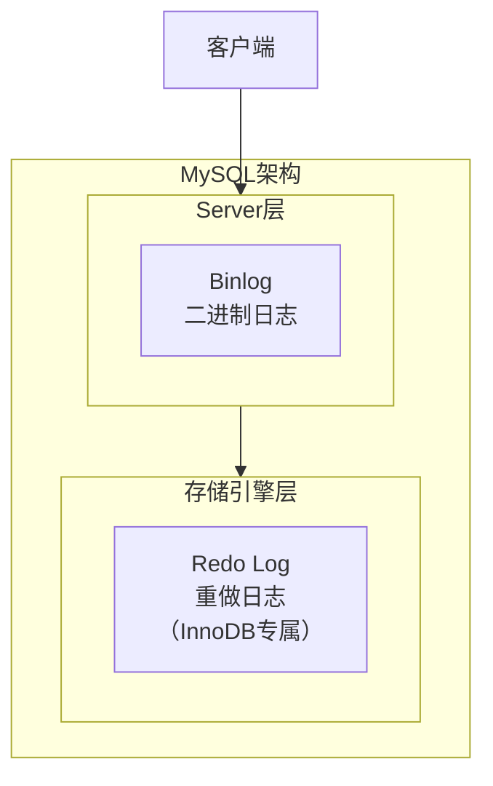
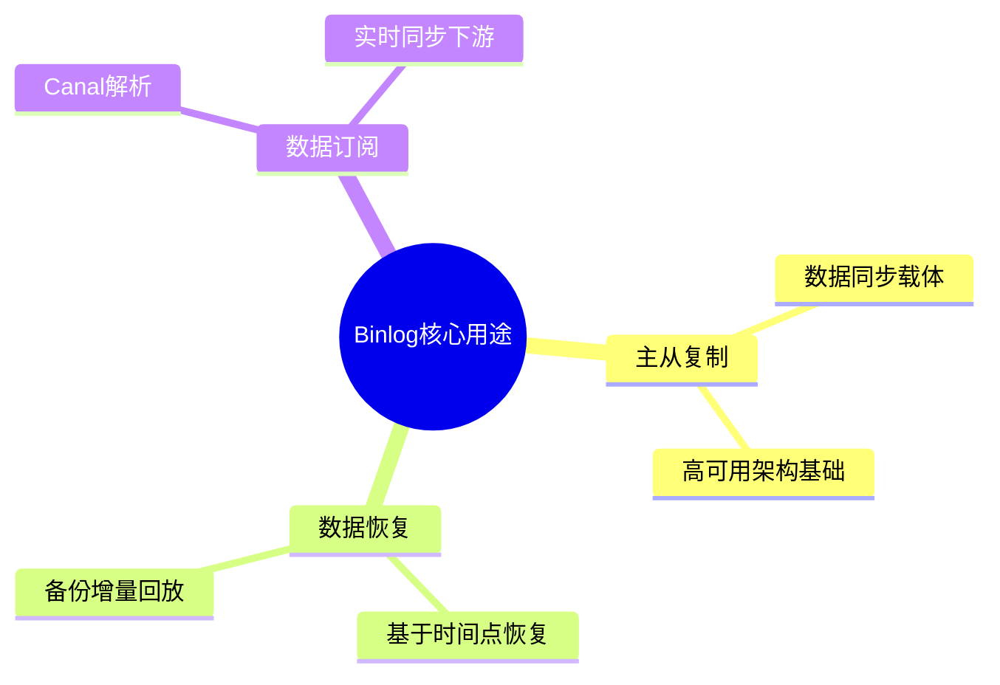
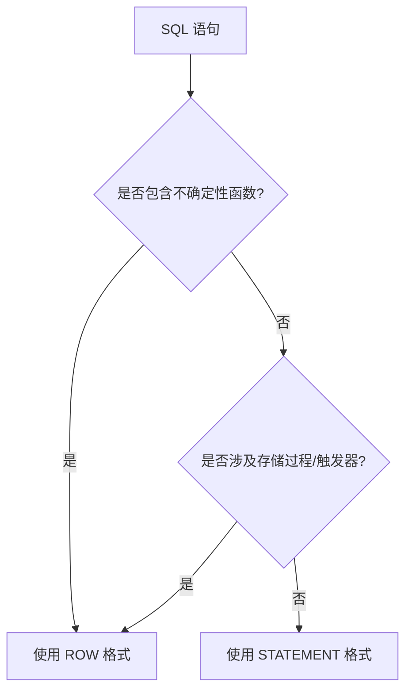
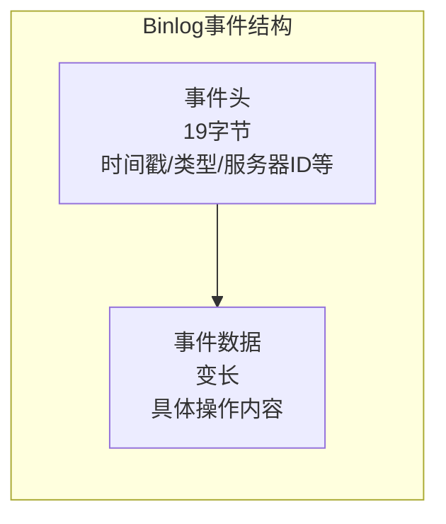
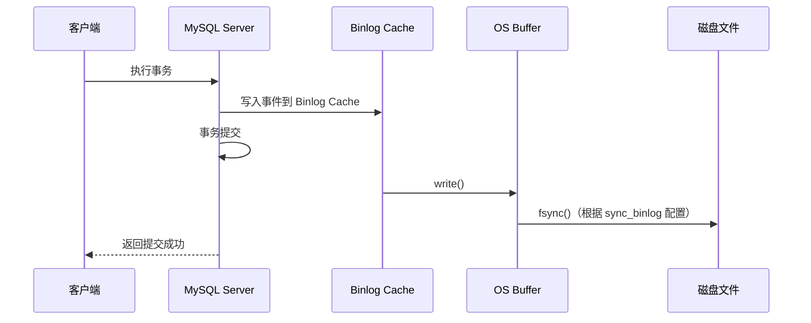
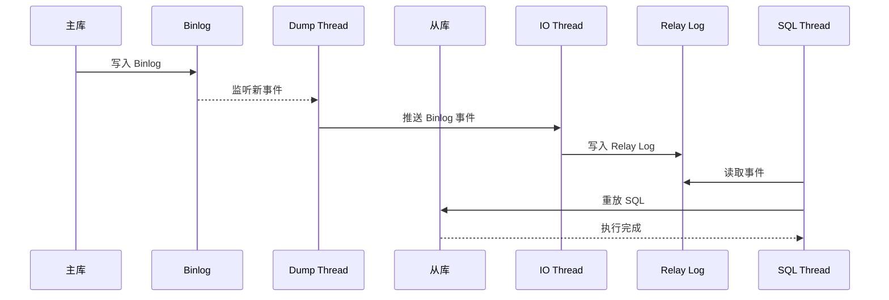
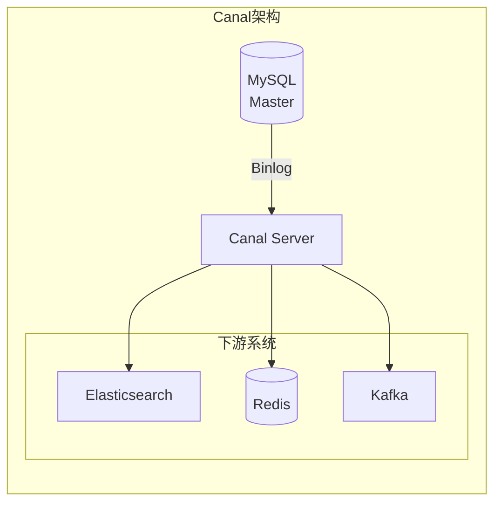

# MySQL Binlog 二进制日志详解

## 一、概述

### 1.1 什么是 Binlog？

Binlog（Binary Log，二进制日志）是 MySQL Server 层实现的日志文件，记录了所有对数据库执行的数据修改操作。

| 属性 | 说明 |
|------|------|
| **所属层级** | MySQL Server 层（与存储引擎无关） |
| **日志类型** | 逻辑日志（记录 SQL 语句或行变更） |
| **写入方式** | 追加写入（append-only），文件循环轮转 |
| **默认开启** | MySQL 8.0 默认开启（log_bin=ON） |

### 1.2 Binlog 与 Redo Log 的区别



| 对比项 | Binlog | Redo Log |
|--------|--------|----------|
| **所属层级** | MySQL Server 层 | InnoDB 存储引擎层 |
| **日志类型** | 逻辑日志 | 物理日志 |
| **写入方式** | 追加写入，容量无限 | 循环写入，容量固定 |
| **主要用途** | 主从复制、数据恢复 | 崩溃恢复 |
| **持久化控制** | sync_binlog 参数 | innodb_flush_log_at_trx_commit |
| **生命周期** | 可长期保留 | 循环覆盖 |

> **一句话记忆**：Binlog 是"给别人看的"（用于复制和归档），Redo Log 是"给自己用的"（用于崩溃恢复）。

---

## 二、核心作用

### 2.1 三大核心用途



| 用途 | 说明 |
|------|------|
| **主从复制** | Master 将 Binlog 发送给 Slave，Slave 重放实现数据同步 |
| **数据恢复** | 配合全量备份，实现基于时间点的恢复（PITR） |
| **数据订阅** | 通过 Canal 等工具解析 Binlog，实现实时数据同步 |

### 2.2 数据恢复场景示例

```
场景：下午 2 点误执行 DELETE FROM products;

恢复步骤：
1. 恢复昨晚 12 点的全量备份
2. 解析 Binlog，找到昨晚 12 点到下午 2 点之间的所有操作
3. 重放这些 Binlog 事件（跳过误删除操作）
4. 数据恢复到误删除前的状态
```

---

## 三、三种日志格式

### 3.1 格式概览

| 格式 | 记录方式 | 特点 |
|------|----------|------|
| **STATEMENT** | 记录执行的 SQL 语句 | 日志量小；但 `NOW()`、`UUID()` 等函数可能导致主从数据不一致 |
| **ROW** | 记录每行数据的修改前后值 | 主从数据强一致；但日志量大，批量更新时显著膨胀 |
| **MIXED** | 自动判断使用哪种格式 | 普通语句用 STATEMENT，含不确定函数时自动切换 ROW |

> **推荐**：MySQL 8.0 默认使用 ROW 格式，保证主从数据一致性。

### 3.2 STATEMENT 格式

**记录方式**：记录执行的 SQL 语句本身。

```sql
-- 执行的 SQL
UPDATE users SET status = 'active' WHERE last_login < '2024-01-01';

-- Binlog 记录内容
# at 437
#240102 10:30:15 server id 1  end_log_pos 531  Query   thread_id=10
SET TIMESTAMP=1704177015/*!*/;
UPDATE users SET status = 'active' WHERE last_login < '2024-01-01'/*!*/;
```

**优缺点**：

| 优点 | 缺点 |
|------|------|
| 日志文件小 | 不确定性函数（`NOW()`、`UUID()`）可能导致主从数据不一致 |
| 可读性强 | 存储过程、触发器可能导致问题 |
| 网络传输效率高 | 主从库索引不同可能导致执行计划差异 |

**不适用场景**：

```sql
-- 这些语句在 STATEMENT 格式下可能导致主从不一致
INSERT INTO logs VALUES (NOW(), UUID());
UPDATE users SET create_time = CURRENT_TIMESTAMP;
DELETE FROM orders LIMIT 10;  -- 无 ORDER BY，删除顺序不确定
```

### 3.3 ROW 格式

**记录方式**：记录每行数据的修改前后状态。

```sql
-- 执行的 SQL
UPDATE users SET age = 25 WHERE id = 1;

-- ROW 格式 Binlog 记录内容（简化表示）
### UPDATE `test`.`users`
### WHERE
###   @1=1    /* id */
###   @2=20   /* age 修改前 */
### SET
###   @1=1    /* id */
###   @2=25   /* age 修改后 */
```

**优缺点**：

| 优点 | 缺点 |
|------|------|
| 主从数据强一致 | 日志文件较大 |
| 不受函数影响 | 可读性较差 |
| 适用于复杂场景 | 占用更多网络带宽 |

**ROW 格式的优势**：

```
场景：UPDATE users SET status = 'active' WHERE last_login < '2024-01-01';

STATEMENT 格式：
- 从库执行相同 SQL，但数据分布可能不同，影响行数可能不同

ROW 格式：
- 记录实际修改的每一行数据
- 从库直接应用数据变更，结果完全一致
```

### 3.4 MIXED 格式

**记录方式**：根据 SQL 语句类型自动选择 STATEMENT 或 ROW 格式。

| 场景 | 使用格式 |
|------|----------|
| 普通增删改 | STATEMENT |
| 包含不确定性函数 | ROW |
| 存储过程、触发器 | ROW |
| `UUID()`、`NOW()` 等 | ROW |

**工作原理**：



### 3.5 格式选择建议

| 场景 | 推荐格式 | 理由 |
|------|----------|------|
| **生产环境** | ROW | 数据一致性优先 |
| **主从复制** | ROW | 避免主从数据不一致 |
| **磁盘空间受限** | MIXED | 平衡日志大小与一致性 |
| **简单业务** | STATEMENT | 日志小，可读性强 |

---

## 四、Binlog 工作原理

### 4.1 文件结构

```
$HOME/data/
├── mysql-bin.000001    # Binlog 文件
├── mysql-bin.000002
├── mysql-bin.000003
└── mysql-bin.index     # 索引文件，记录所有 Binlog 文件名
```

**文件命名规则**：

| 组成 | 说明 |
|------|------|
| 基础名 | 默认为 `mysql-bin`，可通过 `log_bin_basename` 配置 |
| 序号 | 6 位数字，从 000001 开始递增 |

**文件轮转机制**：

| 触发条件 | 说明 |
|----------|------|
| 文件大小达到 max_binlog_size | 默认 1GB |
| 执行 FLUSH LOGS 命令 | 手动触发 |
| MySQL 服务重启 | 自动创建新文件 |

### 4.2 事件结构

Binlog 以事件（Event）为单位记录操作：



| 事件类型 | 说明 |
|----------|------|
| **FORMAT_DESCRIPTION_EVENT** | 文件格式描述，每个文件开头 |
| **QUERY_EVENT** | SQL 语句（STATEMENT 格式） |
| **WRITE_ROWS_EVENT** | 插入行数据（ROW 格式） |
| **UPDATE_ROWS_EVENT** | 更新行数据（ROW 格式） |
| **DELETE_ROWS_EVENT** | 删除行数据（ROW 格式） |
| **XID_EVENT** | 事务提交标记 |

### 4.3 写入流程



### 4.4 刷盘策略

`sync_binlog` 参数控制 Binlog 的刷盘时机：

| 值 | 行为 | 性能 | 安全性 |
|----|------|------|--------|
| **0** | 由 OS 决定何时刷盘 | 最高 | 最低（可能丢失事务） |
| **1** | 每次事务提交都刷盘 | 较低 | 最高（不丢事务） |
| **N** | 每 N 次事务提交刷盘 | 中等 | 中等（最多丢 N-1 个事务） |

> **生产建议**：`sync_binlog = 1`，保证数据安全。

---

## 五、主从复制中的 Binlog

### 5.1 复制流程



### 5.2 三大核心线程

| 线程 | 位置 | 作用 |
|------|------|------|
| **Dump Thread** | 主库 | 读取 Binlog，推送给从库 |
| **IO Thread** | 从库 | 接收 Binlog，写入 Relay Log |
| **SQL Thread** | 从库 | 读取 Relay Log，重放 SQL |

### 5.3 GTID 全局事务标识

MySQL 5.6 引入 GTID（Global Transaction Identifier），简化主从复制管理。

**GTID 格式**：`source_id:transaction_id`

```
示例：3E11FA47-71CA-11E1-9E33-C80AA9429562:23
      ↑                                    ↑
   source_id(server_uuid)             transaction_id
```

**核心优势**：

| 优势 | 说明 |
|------|------|
| **简化配置** | 搭建主从时无需手动指定 `MASTER_LOG_FILE` 和 `MASTER_LOG_POS`<br/>只需执行 `CHANGE MASTER TO MASTER_AUTO_POSITION=1` |
| **故障恢复便捷** | 主从切换后，新从库自动从正确位置开始同步，无需人工计算 Binlog 位置 |
| **避免事务遗漏或重复** | 每个事务有全局唯一标识，从库自动跳过已执行的事务，不会重复执行 |
| **支持多源复制** | 每个事务携带源库 UUID，可清晰追溯事务来源，支持多主架构 |

**传统方式 vs GTID 方式**：

```sql
-- 传统方式：需要手动指定文件名和位置
CHANGE MASTER TO
  MASTER_HOST='192.168.1.100',
  MASTER_LOG_FILE='mysql-bin.000003',
  MASTER_LOG_POS=154;

-- GTID 方式：自动定位
CHANGE MASTER TO
  MASTER_HOST='192.168.1.100',
  MASTER_AUTO_POSITION=1;
```

---

## 六、Binlog 应用实践

### 6.1 数据恢复

**使用 mysqlbinlog 工具**：

```bash
# 查看 Binlog 内容
mysqlbinlog mysql-bin.000001

# 指定时间范围恢复
mysqlbinlog --start-datetime="2024-01-01 00:00:00" \
            --stop-datetime="2024-01-01 12:00:00" \
            mysql-bin.000001 | mysql -u root -p

# 指定位置范围恢复
mysqlbinlog --start-position=1000 --stop-position=2000 \
            mysql-bin.000001 | mysql -u root -p
```

### 6.2 Canal 数据订阅

**Canal 简介**：

Canal 是阿里巴巴开源的 MySQL 增量数据订阅工具，通过模拟 MySQL Slave 协议，实时解析 Binlog。



**工作原理**：

| 步骤 | 说明 |
|------|------|
| 1 | Canal 模拟 MySQL Slave，向 Master 发送 dump 请求 |
| 2 | Master 收到 dump 请求，推送 Binlog 给 Canal |
| 3 | Canal 解析 Binlog，提取数据变更事件 |
| 4 | 将变更事件发送到下游系统（Kafka、ElasticSearch、Redis 等） |

**典型应用场景**：

| 场景 | 说明 |
|------|------|
| **缓存同步** | MySQL 数据变更时，自动更新 Redis 缓存 |
| **搜索引擎同步** | 数据变更时，自动更新 Elasticsearch 索引 |
| **数据仓库同步** | 实时同步数据到数据仓库 |
| **业务解耦** | 通过消息队列通知下游业务系统 |

### 6.3 Canal 配置示例

**MySQL 配置**（my.cnf）：

```ini
[mysqld]
log-bin=mysql-bin          # 开启 binlog，文件名前缀为 mysql-bin
binlog-format=ROW          # 使用 ROW 格式，保证数据一致性
server-id=1                # 服务器唯一标识，主从复制必须配置
```

**Canal 配置**（canal.properties）：

```properties
canal.serverMode = kafka
canal.mq.servers = localhost:9092
canal.mq.topic = canal_topic
```

**Java 客户端示例**：

```java
CanalConnector connector = CanalConnectors.newSingleConnector(
    new InetSocketAddress("127.0.0.1", 11111), 
    "example", "", "");

connector.connect();
connector.subscribe(".*\\..*");

while (true) {
    Message message = connector.getWithoutAck(100);
    long batchId = message.getId();
    List<CanalEntry.Entry> entries = message.getEntries();
    
    for (CanalEntry.Entry entry : entries) {
        if (entry.getEntryType() == CanalEntry.EntryType.ROWDATA) {
            CanalEntry.RowChange rowChange = CanalEntry.RowChange.parseFrom(entry.getStoreValue());
            for (CanalEntry.RowData rowData : rowChange.getRowDatasList()) {
                // 处理数据变更
                System.out.println(rowChange.getEventType() + ": " + rowData.getAfterColumnsList());
            }
        }
    }
    connector.ack(batchId);
}
```

---

## 七、最佳实践

### 7.1 配置建议

| 参数 | 建议值 | 说明 |
|------|--------|------|
| **binlog_format** | ROW | 保证主从一致性 |
| **sync_binlog** | 1 | 每次事务提交刷盘 |
| **max_binlog_size** | 1GB | 单文件最大大小 |
| **expire_logs_days** | 7 | 自动清理过期日志 |
| **binlog_row_image** | FULL | 记录完整的行数据 |

### 7.2 监控指标

| 指标 | 说明 | 告警阈值 |
|------|------|----------|
| Binlog 文件大小 | 单个文件大小 | > 1GB |
| Binlog 保留时长 | `expire_logs_days` 配置值 | < 3 天（保留时间过短，影响数据恢复） |
| 主从延迟 | Slave 落后 Master 的时间 | > 1 秒 |
| Binlog 写入延迟 | fsync 耗时 | > 100ms |

### 7.3 常见问题

**Q1: Binlog 文件过大怎么办？**

| 解决方案 | 说明 |
|----------|------|
| 调整 max_binlog_size | 减小单文件大小 |
| 设置 expire_logs_days | 自动清理过期日志 |
| 使用 ROW 格式 | 日志更大，但一致性更好 |

**Q2: 主从复制延迟怎么排查？**

| 排查方向 | 说明 |
|----------|------|
| 网络延迟 | 检查主从网络带宽 |
| 从库性能 | 检查从库 CPU、IO |
| 大事务 | 避免单事务修改大量数据 |
| 主库写入压力 | 考虑分库分表 |

**Q3: STATEMENT 格式导致主从不一致怎么办？**

| 解决方案 | 说明 |
|----------|------|
| 切换到 ROW 格式 | 彻底解决问题 |
| 避免不确定性函数 | 使用固定值替代 `NOW()` |
| 检查存储过程 | 确保存储过程是确定性的，避免使用会话变量和非确定性函数 |

---

## 八、总结

### 8.1 核心要点

| 分类 | 要点 | 说明 |
|------|------|------|
| **基础认知** | Server 层日志 | 与存储引擎无关，所有引擎通用 |
| | 逻辑日志 | 记录 SQL 语句或行变更，非物理数据页 |
| | 追加写入 | 文件满后创建新文件，可长期保留 |
| **格式选择** | 三种格式 | STATEMENT（SQL语句）、ROW（行数据）、MIXED（混合） |
| | 推荐格式 | ROW 格式，MySQL 8.0 默认，保证主从一致性 |
| **生产配置** | sync_binlog=1 | 每次事务提交刷盘，保证事务不丢失 |
| | binlog_format=ROW | 避免非确定性函数导致主从不一致 |

### 8.2 Binlog vs Redo Log

| 对比项 | Binlog | Redo Log |
|--------|--------|----------|
| 用途 | 主从复制、数据恢复 | 崩溃恢复 |
| 层级 | MySQL Server 层 | InnoDB 存储引擎层 |
| 写入 | 追加写入 | 循环写入 |
| 协作 | 两阶段提交保证一致性 | - |

### 8.3 应用场景速查

| 场景 | 解决方案 |
|------|----------|
| 主从复制 | Binlog + GTID |
| 数据恢复 | mysqlbinlog + 全量备份 |
| 缓存同步 | Canal + Redis |
| 搜索同步 | Canal + Elasticsearch |
| 数据订阅 | Canal + Kafka |
