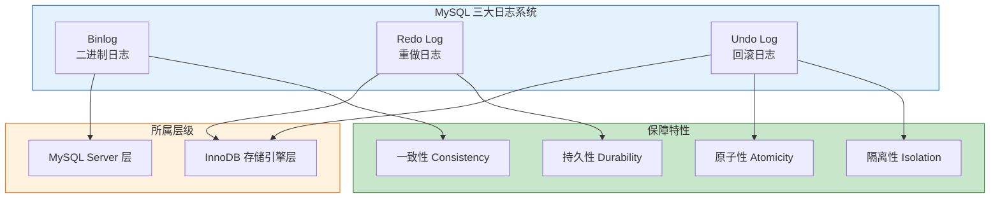
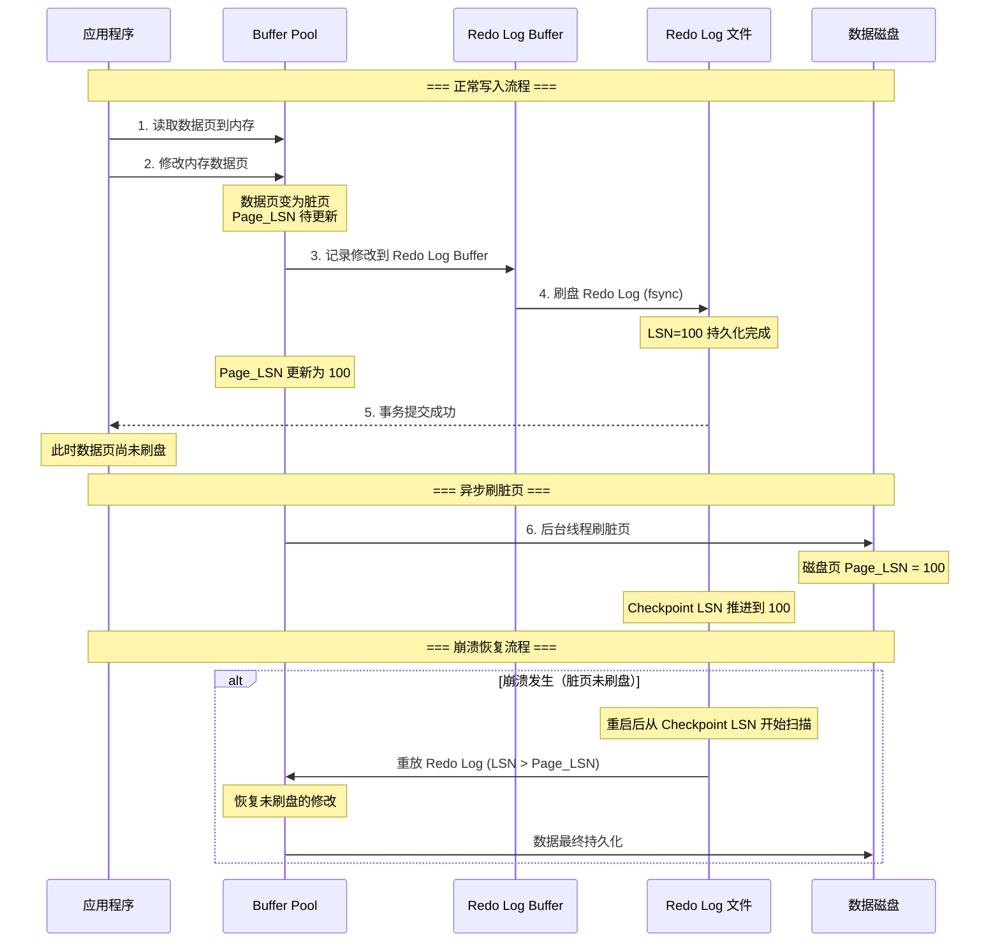
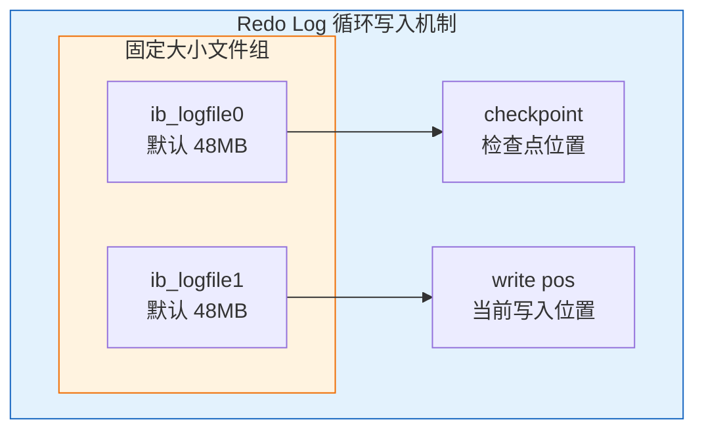
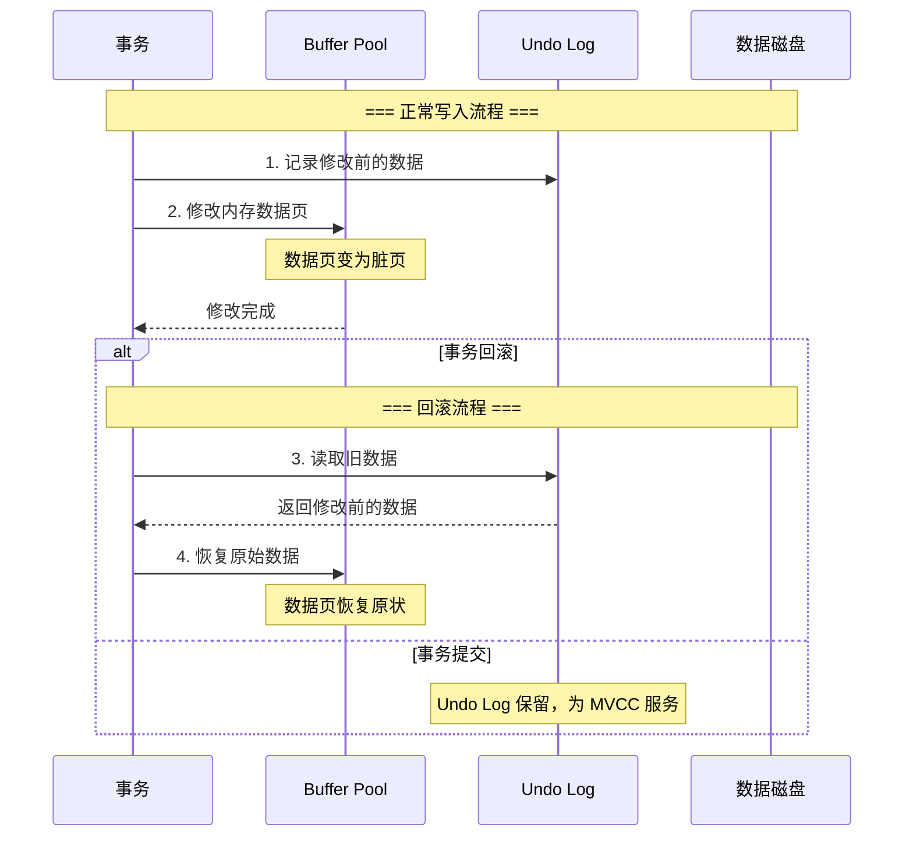
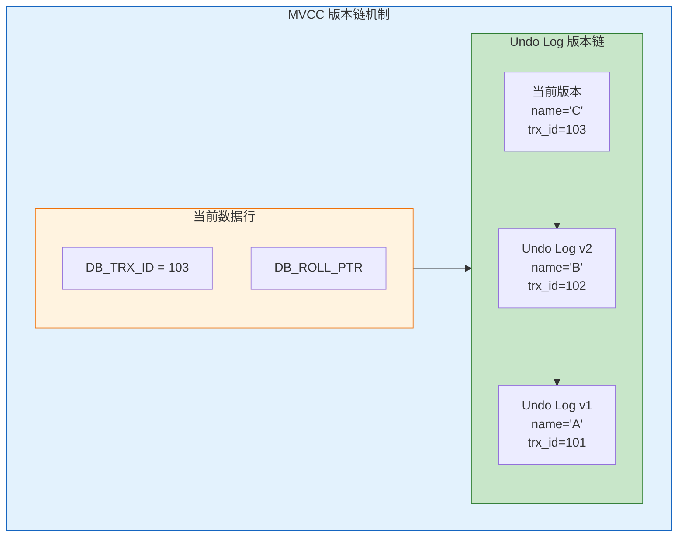
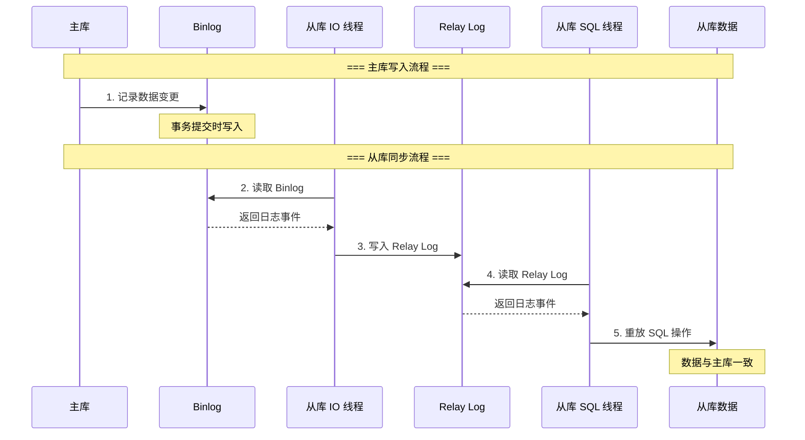
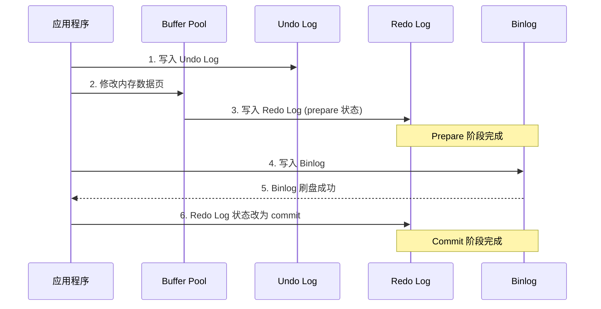
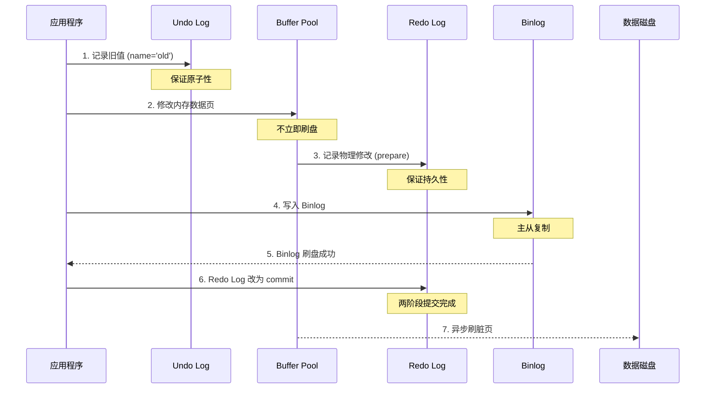

# MySQL 三大日志详解：Binlog、Redo Log、Undo Log

## 一、概述

MySQL 的日志系统是数据库可靠性与一致性的基石。三大日志各司其职，共同保障事务的 ACID 特性。



### 1.1 三大日志核心职责

| 日志类型 | 核心作用 | 保障特性 | 所属层级 |
|---------|---------|---------|---------|
| **Redo Log** | 崩溃恢复、持久化 | 持久性 (Durability) | InnoDB 存储引擎层 |
| **Undo Log** | 事务回滚、MVCC | 原子性、隔离性 | InnoDB 存储引擎层 |
| **Binlog** | 主从复制、数据备份 | 一致性 (Consistency) | MySQL Server 层 |

***

## 二、Redo Log（重做日志）

### 2.1 为什么需要 Redo Log？

**直接刷盘的问题**：

| 问题 | 说明 |
|------|------|
| **性能问题** | 数据页 16KB，修改几字节却要刷整个页；随机写性能差 |
| **可靠性问题** | Buffer Pool 基于内存，断电后脏页数据丢失 |

**Redo Log 的解决方案**：

| 优势 | 说明 |
|------|------|
| **记录内容精简** | 仅需几十字节记录修改内容，而非整个数据页 |
| **顺序写性能高** | 顺序写远高于随机写，大幅提升 I/O 效率 |
| **快速提交** | 只需保证 Redo Log 持久化即可提交事务，无需等待数据页刷盘 |

### 2.2 核心概念

| 概念 | 定义 |
|------|------|
| **Buffer Pool** | InnoDB 在内存中划出的区域，用于缓存数据页和索引页，减少磁盘 I/O |
| **数据页** | InnoDB 管理数据的基本单位，默认大小 16KB，包含多行记录 |
| **脏页** | Buffer Pool 中被修改过但尚未刷回磁盘的数据页 |
| **Redo Log** | 记录数据页修改的物理日志，用于崩溃恢复 |
| **LSN** | Log Sequence Number，日志序列号，单调递增，用于标识日志和数据页版本 |
| **Checkpoint** | 检查点，记录一个 LSN 值，表示在此之前的脏页已全部刷盘 |

### 2.3 WAL 机制与工作流程

Redo Log 采用 **WAL（Write-Ahead Logging，预写日志）** 机制，核心思想：**先写日志，再写磁盘**。

**完整工作流程时序图**：



**流程要点说明**：

| 阶段 | 步骤 | 操作 | 关键点 |
|------|------|------|--------|
| **写入阶段** | 1-2 | 数据修改 | 在 Buffer Pool 中完成，产生脏页 |
| | 3-4 | Redo Log 写入 | 先写 Buffer，再刷盘到文件，LSN 递增 |
| | 5 | 事务提交 | Redo Log 持久化后即可返回成功 |
| **刷盘阶段** | 6 | 异步刷脏页 | 后台线程择机刷盘，Checkpoint LSN 推进 |
| **恢复阶段** | - | 崩溃恢复 | 对比 Page_LSN 与 Redo Log LSN，重放未刷盘的修改 |

**Redo Log 内容格式**：记录的是"在某个数据页上做了什么修改"，例如：
```
对表空间 X 的数据页 Y 的偏移量 Z 处写入数据 A
```

### 2.4 存储结构



**存储特点**：
- 固定大小的循环文件（默认 `ib_logfile0` 和 `ib_logfile1`）
- 写满后从头开始覆盖，仅保留未刷盘的脏页日志
- `write pos` 记录当前写入位置，`checkpoint` 记录检查点位置
- 当 write pos 追上 checkpoint 时，需要暂停写入，先刷脏页推进 checkpoint

### 2.5 刷盘策略与关键配置

**刷盘策略**：由 `innodb_flush_log_at_trx_commit` 参数控制

| 参数值 | 行为 | 安全性 | 性能 |
|-------|------|--------|------|
| **0** | 每秒写入磁盘一次 | 可能丢失 1 秒数据 | 最高 |
| **1** | 每次事务提交都 fsync | 最安全（推荐生产环境） | 较低 |
| **2** | 写入 OS 缓存，由 OS 决定刷盘 | 可能丢失部分数据 | 较高 |

**关键配置参数**：

```sql
SHOW VARIABLES LIKE 'innodb_log%';
```

| 参数 | 说明 | 建议值 |
|------|------|--------|
| `innodb_log_file_size` | 单个日志文件大小 | 256MB - 2GB |
| `innodb_log_files_in_group` | 日志文件数量 | 默认 2 |
| `innodb_flush_log_at_trx_commit` | 刷盘策略 | 1（生产环境） |

### 2.6 Crash-Safe 机制

**崩溃恢复流程**：

1. MySQL 崩溃重启时，InnoDB 从 Checkpoint LSN 开始扫描 Redo Log
2. （已提交事务）对于每条 Redo Log 记录，对比数据页的 Page_LSN：
   - `Page_LSN < Redo_LSN`：该修改未刷盘，重放 Redo Log
   - `Page_LSN >= Redo_LSN`：该修改已刷盘，跳过
3. （未提交事务）对于每条 Redo Log 记录，结合 Undo Log 回滚

**LSN 判断逻辑**：

| 对象 | LSN 含义 |
|------|----------|
| **Redo Log 记录** | 每条日志记录有唯一的 LSN，表示写入顺序 |
| **数据页** | 每个数据页头部存储 `Page_LSN`，表示该页最后一次修改对应的日志位置 |
| **Checkpoint** | 记录一个 LSN 值，表示在此之前的脏页已全部刷盘 |

**Checkpoint 更新时机**：

| 触发条件 | 说明 |
|----------|------|
| **脏页刷盘完成** | 当脏页成功刷入磁盘后，Checkpoint LSN 向前推进 |
| **定期刷脏页** | 后台线程定期将脏页刷入磁盘，从而推进 Checkpoint LSN |
| **Redo Log 空间不足** | 当 write pos 接近 checkpoint 时，强制刷脏页并推进 Checkpoint LSN |
| **正常关闭数据库** | 关闭时执行 Sharp Checkpoint，将所有脏页刷盘 |
| **执行 CHECKPOINT 命令** | 手动触发刷脏页并推进 Checkpoint LSN |

**恢复起点**：从 Checkpoint LSN 开始扫描，之前的日志对应脏页已全部刷盘，无需处理。

***

## 三、Undo Log（回滚日志）

### 3.1 为什么需要 Undo Log？

**事务执行中的问题**：

| 问题 | 说明 |
|------|------|
| **原子性需求** | 事务要么全部成功，要么全部失败，需要能够撤销已执行的操作 |
| **并发读取需求** | 多个事务并发执行时，需要读取数据的历史版本，避免读写冲突 |

**Undo Log 的解决方案**：

| 优势 | 说明 |
|------|------|
| **事务回滚** | 记录修改前的数据，支持事务失败时恢复原状 |
| **MVCC 实现** | 通过版本链实现多版本并发控制，读操作不阻塞写操作 |

### 3.2 核心概念

| 概念 | 定义 |
|------|------|
| **Undo Log** | 记录数据修改前状态的逻辑日志，用于事务回滚和 MVCC |
| **回滚指针** | 数据行中的 DB_ROLL_PTR 字段，指向该行对应的 Undo Log 记录 |
| **版本链** | 通过回滚指针串联的多个历史数据版本 |
| **Read View** | 读视图，用于判断哪个版本对当前事务可见 |
| **Purge 线程** | 后台线程，负责清理不再需要的 Undo Log |

### 3.3 工作流程

**Undo Log 记录格式**：

| 操作类型 | Undo Log 记录内容 | 回滚操作 |
|----------|-------------------|----------|
| **INSERT** | 记录主键值 | 删除该行 |
| **DELETE** | 记录整行数据 | 重新插入 |
| **UPDATE** | 记录旧值 | 恢复旧值 |

**事务回滚工作流程**：



**流程要点说明**：

| 阶段 | 步骤 | 操作 | 关键点 |
|------|------|------|--------|
| **写入阶段** | 1 | 记录旧值 | 先写 Undo Log，再修改数据 |
| | 2 | 修改数据 | 在 Buffer Pool 中完成 |
| **回滚阶段** | 3-4 | 恢复数据 | 从 Undo Log 读取旧值，恢复原状 |
| **提交阶段** | - | 保留日志 | Undo Log 继续为 MVCC 服务 |

### 3.4 存储结构

**数据行隐藏字段**：

| 字段 | 说明 |
|------|------|
| **DB_TRX_ID** | 创建或最后一次修改该行的事务 ID |
| **DB_ROLL_PTR** | 回滚指针，指向 Undo Log 中该行的上一个版本 |

**MVCC 版本链结构**：



### 3.5 核心作用

#### 作用一：事务回滚（保证原子性）

当事务执行失败或显式 ROLLBACK 时，通过 Undo Log 恢复数据到事务开始前的状态。

#### 作用二：MVCC（多版本并发控制）

| 隔离级别 | Read View 创建时机 | 行为 |
|---------|-------------------|------|
| **读已提交 (RC)** | 每次 SELECT 创建新的 Read View | 读取最新已提交版本 |
| **可重复读 (RR)** | 事务开始时创建 Read View 并复用 | 通过版本链找到事务开始前的数据版本 |

### 3.6 生命周期与关键配置

**Undo Log 生命周期**：

| 阶段 | 操作 |
|------|------|
| 1. 事务开始 | 分配 Undo Log 空间 |
| 2. 数据修改 | 记录修改前的数据 |
| 3. 事务提交 | Undo Log 保留，继续为 MVCC 服务 |
| 4. 清理时机 | Purge 线程检测无事务依赖时回收 |

**清理机制**：
- 事务提交后，Undo Log 不会立即删除
- 需继续为 MVCC 服务（其他事务可能需要读取历史版本）
- Purge 线程定期检查不再被任何事务视图引用的 Undo Log 并回收

**关键配置参数**：

```sql
SHOW VARIABLES LIKE 'innodb_undo%';
```

| 参数 | 说明 | 建议值 |
|------|------|--------|
| `innodb_undo_tablespaces` | Undo 表空间数量 | 独立表空间 |
| `innodb_max_undo_log_size` | Undo 表空间最大值 | 根据业务调整 |
| `innodb_undo_log_truncate` | 是否自动截断 | ON |

***

## 四、Binlog（二进制日志）

### 4.1 为什么需要 Binlog？

**数据同步与恢复的问题**：

| 问题 | 说明 |
|------|------|
| **主从复制需求** | 需要将主库的数据变更同步到从库，实现读写分离和高可用 |
| **数据恢复需求** | 需要基于时间点恢复数据（PITR），全量备份后需增量恢复 |
| **数据审计需求** | 需要追踪数据的变更历史，满足审计和合规要求 |

**Binlog 的解决方案**：

| 优势 | 说明 |
|------|------|
| **主从复制** | 从库重放 Binlog 实现数据同步，支持读写分离 |
| **数据恢复** | 配合全量备份实现基于时间点的精确恢复 |
| **存储引擎通用** | Server 层实现，所有存储引擎都可使用 |

### 4.2 核心概念

| 概念 | 定义 |
|------|------|
| **Binlog** | MySQL Server 层实现的逻辑日志，记录所有数据变更操作 |
| **逻辑日志** | 记录操作逻辑（SQL 语句或行变更），而非物理数据页修改 |
| **事件** | Binlog 中的基本单位，每个事件描述一个数据变更操作 |
| **Binlog 文件** | 以二进制格式存储的日志文件，命名如 mysql-bin.000001 |
| **Relay Log** | 中继日志，从库存储从主库拉取的 Binlog 内容 |

### 4.3 工作流程

**主从复制工作流程**：



**流程要点说明**：

| 阶段 | 步骤 | 操作 | 关键点 |
|------|------|------|--------|
| **主库写入** | 1 | 记录变更 | 事务提交时写入 Binlog |
| **从库同步** | 2-3 | 拉取日志 | IO 线程读取并写入 Relay Log |
| | 4-5 | 重放日志 | SQL 线程读取并执行 SQL 操作 |

### 4.4 存储结构

**三种记录格式**：

| 格式 | 记录内容 | 优点 | 缺点 | 适用场景 |
|------|---------|------|------|---------|
| **STATEMENT** | 原始 SQL 语句 | 日志量小 | 动态函数可能导致主从不一致 | 简单场景（已不推荐） |
| **ROW** | 行数据修改前后的值 | 精确复制，无歧义 | 日志量大 | 生产环境推荐 |
| **MIXED** | 自动选择 | 折中方案 | 切换逻辑复杂 | 过渡方案 |

**Binlog 文件特点**：

| 特点 | 说明 |
|------|------|
| **追加写入** | 文件满后创建新文件，不会覆盖 |
| **长期保留** | 根据过期策略清理，用于备份恢复 |
| **索引文件** | binlog.index 记录所有 Binlog 文件列表 |

### 4.5 核心作用

#### 作用一：主从复制

实现数据从主库到从库的同步，支持读写分离架构。

#### 作用二：数据恢复

配合全量备份，通过重放 Binlog 实现基于时间点的恢复（PITR）。

#### 作用三：数据审计

记录所有数据变更操作，可用于审计和问题追踪。

### 4.6 刷盘策略与关键配置

**刷盘策略**：由 `sync_binlog` 参数控制

| 参数值 | 行为 | 安全性 | 性能 |
|-------|------|--------|------|
| **0** | 由 OS 决定刷盘时机 | 可能丢失日志 | 最高 |
| **1** | 每次事务提交都刷盘 | 最安全（推荐） | 较低 |
| **N** | 每 N 个事务刷盘一次 | 可能丢失 N 个事务的日志 | 较高 |

**关键配置参数**：

```sql
SHOW VARIABLES LIKE '%binlog%';
```

| 参数 | 说明 | 建议值 |
|------|------|--------|
| `binlog_format` | 日志格式 | ROW |
| `binlog_cache_size` | 事务缓存大小 | 根据事务大小调整 |
| `sync_binlog` | 刷盘策略 | 1（生产环境） |
| `expire_logs_days` | 日志过期天数 | 7-30 天 |

***

## 五、三大日志对比

### 5.1 核心差异对比

| 对比维度 | Redo Log | Undo Log | Binlog |
|---------|---------|---------|--------|
| **所属层级** | InnoDB 引擎层 | InnoDB 引擎层 | MySQL Server 层 |
| **日志类型** | 物理日志 | 逻辑日志（反向） | 逻辑日志 |
| **写入方式** | 循环写（固定大小） | 随机写（表空间） | 追加写 |
| **写入时机** | 事务执行中持续写 | 数据修改前写入 | 事务提交时一次性写入 |
| **核心用途** | 崩溃恢复、持久性 | 事务回滚、MVCC | 主从复制、数据恢复 |
| **崩溃恢复角色** | 核心恢复角色 | 辅助恢复（回滚未提交事务） | 不参与崩溃恢复 |
| **生命周期** | 数据页刷盘后失效 | 提交后保留，Purge 线程清理 | 长期保留（按策略清理） |

### 5.2 一句话总结

| 日志 | 总结 |
|------|------|
| **Redo Log** | "崩溃恢复的救命稻草" |
| **Undo Log** | "后悔药的原料" |
| **Binlog** | "主从复制的信使" |

***

## 六、Redo Log 两阶段提交

### 6.1 为什么需要两阶段提交？

**不一致场景**：

| 场景 | 问题描述 | 后果 |
|------|----------|------|
| **Redo Log 写了但 Binlog 没写** | 主库恢复后数据丢失 | 从库没收到，主从数据不一致 |
| **Binlog 写了但 Redo Log 没写** | 主库恢复后数据回滚 | 从库却收到了，主从数据不一致 |

**两阶段提交目的**：保证 Redo Log 和 Binlog 状态一致，避免主从数据不一致。

### 6.2 两阶段提交流程



**两阶段提交步骤**：

| 阶段 | 步骤 | 操作 |
|------|------|------|
| **Prepare 阶段** | 1 | 写入 Undo Log |
| | 2 | 修改内存数据页 |
| | 3 | 写入 Redo Log，标记为 prepare 状态 |
| **Commit 阶段** | 4 | 写入 Binlog |
| | 5 | Binlog 刷盘 |
| | 6 | Redo Log 状态改为 commit |

### 6.3 崩溃恢复逻辑

**恢复规则**：

| Redo Log 状态 | Binlog 状态 | 恢复操作 |
|---------------|-------------|----------|
| **commit** | - | 事务已提交，无需处理 |
| **prepare** | 完整 | 提交事务 |
| **prepare** | 不完整 | 回滚事务 |

***

## 七、数据更新时的日志协作流程

以 `UPDATE user SET name='test' WHERE id=1` 为例：



**写入顺序原则**：
- Undo Log "先于修改"
- Redo Log "伴随修改"
- Binlog "最后确认"

***

## 八、实际应用场景

### 8.1 故障恢复场景

| 场景 | 恢复方式 | 涉及日志 |
|------|---------|---------|
| **数据库崩溃** | Redo Log 恢复已提交数据 + Undo Log 回滚未提交事务 | Redo Log + Undo Log |
| **数据误删** | 全量备份 + Binlog 增量回放 | Binlog |
| **主从切换** | 从库提升为主库，继续提供服务 | Binlog |

### 8.2 性能优化建议

| 日志 | 优化建议 |
|------|---------|
| **Redo Log** | 合理设置 `innodb_log_file_size`（建议 256MB-2GB），避免频繁切换 |
| **Undo Log** | 开启独立 Undo 表空间，减少表空间碎片 |
| **Binlog** | 选择 ROW 格式，避免 STATEMENT 格式的复制一致性问题 |

### 8.3 生产环境推荐配置

```ini
[mysqld]
innodb_flush_log_at_trx_commit = 1
sync_binlog = 1
binlog_format = ROW
innodb_log_file_size = 512M
innodb_log_files_in_group = 2
```

**双 1 配置**：`innodb_flush_log_at_trx_commit=1` + `sync_binlog=1`，确保数据安全。

***

## 九、面试高频问题

| 问题 | 答案要点 |
|------|---------|
| **三大日志区别** | Redo Log 保证持久性，Undo Log 保证原子性和隔离性，Binlog 用于主从复制保证一致性 |
| **为什么 Redo Log 比 Binlog 快** | Redo Log 是顺序写，Binlog 需要事务提交时才写入 |
| **两阶段提交的意义** | 保证 Redo Log 和 Binlog 状态一致，避免主从数据不一致 |
| **Crash-Safe 如何实现** | Redo Log 恢复已提交事务，Undo Log 回滚未提交事务 |
| **MVCC 如何实现** | 通过 Undo Log 版本链 + Read View 实现多版本读 |

***

## 参考资料

- [MySQL 三大日志系统深度解析：Binlog、Redo Log、Undo Log](https://blog.csdn.net/m0_51000788/article/details/159350731)
- [MySQL三大核心日志深度解析](https://blog.csdn.net/gaosw0521/article/details/157803824)
- [MySQL三大日志详解：Undo Log、Redo Log和Binlog的作用与工作机制](https://blog.csdn.net/nihao2q/article/details/146899875)
- [腾讯二面：binlog、redolog 和 undolog 三大日志的区别？](http://m.toutiao.com/group/7621905756955001344/)
