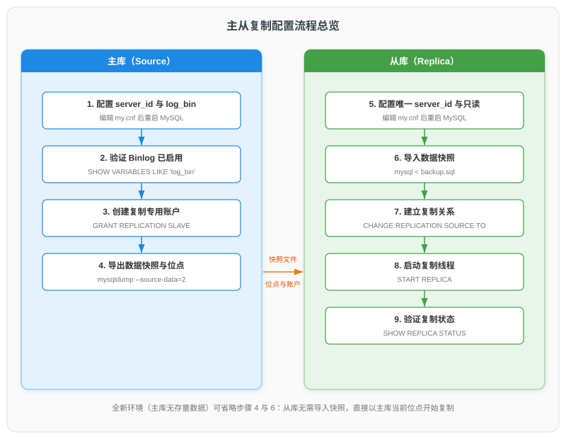
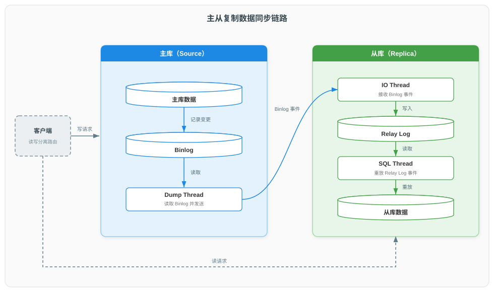

# MySQL 主从复制集群配置流程详解

> 本文聚焦 MySQL 主从复制集群的配置实操，涵盖术语与命令版本对照、主库配置、数据快照与位点获取、从库配置与复制建立、状态验证、GTID 模式配置及常见故障排查。复制架构与三线程协作原理详见《[MySQL 集群架构详解](./MySQL%20集群架构详解.md)》第二章，Binlog 机制详见《[MySQL Binlog 二进制日志详解](./MySQL%20Binlog%20二进制日志详解.md)》，本文不重复展开。

---

## 一、配置准备

### 1.1 术语与命令版本对照

MySQL 自 8.0.22 起将复制相关命令与状态列中的 master/slave 术语逐步替换为 source/replica（主库/从库），新旧命令对照及新命令引入版本如下：

| 功能 | 旧命令 | 新命令 | 新命令引入版本 |
|------|--------|--------|---------------|
| 配置复制关系 | CHANGE MASTER TO | CHANGE REPLICATION SOURCE TO | 8.0.23 |
| 启动 / 停止复制 | START SLAVE / STOP SLAVE | START REPLICA / STOP REPLICA | 8.0.22 |
| 查看复制状态 | SHOW SLAVE STATUS | SHOW REPLICA STATUS | 8.0.22 |
| 查看主库 Binlog 位点 | SHOW MASTER STATUS | SHOW BINARY LOG STATUS | 8.2（旧命令于 8.4 移除） |
| 导出时附带位点 | mysqldump --master-data | mysqldump --source-data | 8.0.26 |

> 旧命令在对应新命令引入的小版本中即被标记弃用。新命令与旧命令功能完全等价，仅术语变化；本文统一使用新命令，运行于旧小版本时按表替换。

### 1.2 复制原理与配置任务

主从复制的核心机制：主库将数据变更以事件形式记录到 Binlog；从库的 IO 线程从主库拉取 Binlog 事件、写入本地 Relay Log，SQL 线程再从 Relay Log 中重放执行，使从库数据与主库保持一致。该过程由主库 Dump Thread 与从库 IO Thread、SQL Thread 三个线程协作完成。

由此推出配置需要完成的四项任务：

| 配置任务 | 目的 | 对应操作 |
|----------|------|----------|
| 主库能够记录数据变更 | 提供复制的数据来源 | 启用 Binlog |
| 从库能够连接主库并读取 Binlog | 提供拉取通道的准入凭证 | 在主库创建复制专用账户 |
| 从库获得与主库一致的数据起点 | 使增量重放有意义 | 传输数据快照并确定复制起始位点 |
| 从库持续拉取并重放变更 | 维持数据同步 | 配置复制关系并启动复制线程 |

### 1.3 前置条件

| 条件 | 要求 |
|------|------|
| 版本 | 主从两端建议同为 MySQL 8.0.x，从库版本不低于主库 |
| 网络 | 从库可通过 TCP/IP 访问主库 3306 端口（复制不使用 Unix socket） |
| 权限 | 主库操作账户具备创建用户并授权的权限 |
| 存储引擎 | 业务表使用 InnoDB（配合无锁快照导出，见 3.2 节） |

### 1.4 配置流程总览



配置共九个步骤：步骤 1–4 在主库完成，产出数据快照、Binlog 位点与复制账户凭证；步骤 5–9 在从库完成，导入快照后建立并启动复制。全新环境（主库无存量数据）可省略步骤 4 与 6，从库直接以主库当前位点开始复制。

---

## 二、主库（Source）配置

### 2.1 配置 server_id 与 Binlog

编辑主库配置文件（Linux 下通常为 `/etc/my.cnf` 或 `/etc/mysql/my.cnf`），在 `[mysqld]` 段加入：

```ini
[mysqld]
# 复制拓扑内唯一标识，取值范围 1 ~ 2^32-1
server_id=1
# Binlog 文件基名（显式指定，避免主机名变更导致日志文件名变化）
log_bin=mysql-bin
# 每次事务提交时将 Binlog 刷盘
sync_binlog=1
# 每次事务提交时将 redo log 刷盘，与 sync_binlog 配合
innodb_flush_log_at_trx_commit=1
```

| 参数 | 作用 | 复制场景要求 |
|------|------|--------------|
| server_id | 在复制拓扑内唯一标识一台服务器 | 必须设置，且全拓扑唯一 |
| log_bin | Binlog 开关与文件基名 | 8.0 默认开启；显式指定基名是官方推荐做法 |
| sync_binlog=1 | 每次事务提交将 Binlog 刷盘 | 推荐值，保证主库崩溃后已确认事务不丢失 |
| innodb_flush_log_at_trx_commit=1 | 每次事务提交将 redo log 刷盘 | 推荐值，与 sync_binlog=1 配合使用 |
| skip_networking | 禁用 TCP/IP 网络 | 必须保持关闭，否则从库无法连接主库 |

> **server_id 的唯一性**：server_id 用于在复制拓扑中识别事件来源，主从两端取值相同会导致复制线程启动失败；多级级联拓扑中，所有节点的 server_id 也必须互不相同。

### 2.2 重启并验证

重启 MySQL 使配置生效，随后验证：

```sql
SHOW VARIABLES LIKE 'log_bin';    -- 期望 ON
SHOW VARIABLES LIKE 'server_id';   -- 期望 1
SHOW BINARY LOGS;                  -- 列出 Binlog 文件，能查询即 Binlog 已启用
```

### 2.3 创建复制专用账户

从库连接主库拉取 Binlog 时，需要一个专用的复制账户。遵循最小权限原则，该账户仅需 REPLICATION SLAVE 权限——只能拉取 Binlog 事件流，不能查询业务数据：

```sql
-- 账户限定登录来源为从库所在网段
CREATE USER 'repl'@'192.168.1.%' IDENTIFIED BY 'Repl@Passw0rd';
GRANT REPLICATION SLAVE ON *.* TO 'repl'@'192.168.1.%';
```

> **REPLICATION SLAVE 为权限名，不在术语替换范围**：1.1 节所述的 source/replica 术语替换仅作用于语句与状态列；权限名未参与替换，`REPLICATION SLAVE` 在 8.x 乃至 9.x 中始终是正式名称，不存在 REPLICA 形式的替代写法。

> **认证插件与复制连接**：MySQL 8.0 默认认证插件为 caching_sha2_password。复制连接未启用 SSL 时，从库 IO 线程首次连接需要获取主库的 RSA 公钥以完成密码的安全传输，该行为由复制关系中的 `GET_SOURCE_PUBLIC_KEY` 选项控制（见 4.3 节）。

---

## 三、数据快照与位点

### 3.1 两种起始场景

从库必须先获得与主库一致的数据，再从某个起点开始持续重放增量变更，复制才有意义：

| 场景 | 存量数据处理 | 复制起点 |
|------|--------------|----------|
| 全新环境（主库无业务数据） | 无需快照 | 主库当前 Binlog 位点 |
| 已有数据环境 | 导出快照并导入从库 | 快照导出时刻的 Binlog 位点 |

> **位点**（position）由 Binlog 文件名与文件内偏移量组成，表示"从库从 Binlog 的哪个事件开始重放"。位点必须与快照数据严格对应：位点早于快照覆盖范围，会重复重放快照已包含的变更（可能引发主键冲突）；位点晚于快照覆盖范围，则丢失中间变更。`--source-data` 使 mysqldump 在导出开始的同一时刻记录位点，两者天然对应。

### 3.2 导出快照并记录位点

在主库服务器执行：

```bash
mysqldump --single-transaction --source-data=2 \
  --all-databases --routines --events --triggers > backup.sql
```

| 参数 | 作用 |
|------|------|
| --single-transaction | 基于 InnoDB MVCC 一致性快照导出，不长时间锁表（仅适用于 InnoDB 表） |
| --source-data=2 | 将导出开始时刻的 Binlog 位点以注释形式写入 backup.sql（8.0.26 前为 --master-data=2） |
| --all-databases | 导出全部数据库 |
| --routines --events --triggers | 一并导出存储过程、定时事件与触发器 |

> `--source-data=1` 会把 CHANGE REPLICATION SOURCE TO 语句（非注释）直接写入导出文件，从库导入后仅需补齐账户信息即可启动复制；`=2` 以注释保留位点，便于人工核对后使用。本文采用 `=2`。

### 3.3 查看位点

位点也可随时手工查看（MySQL 8.4+ 命令；8.0–8.3 中为 `SHOW MASTER STATUS`）：

```sql
SHOW BINARY LOG STATUS;
```

```text
+------------------+----------+--------------+------------------+
| File             | Position | Binlog_Do_DB | Binlog_Ignore_DB |
+------------------+----------+--------------+------------------+
| mysql-bin.000003 |     1024 |              |                  |
+------------------+----------+--------------+------------------+
```

位点即 `(mysql-bin.000003, 1024)`。若导出时使用 `--source-data=2`，无需手工记录——位点已写入 backup.sql 头部，形如：

```text
-- CHANGE REPLICATION SOURCE TO SOURCE_LOG_FILE='mysql-bin.000003', SOURCE_LOG_POS=1024;
```

### 3.4 传输快照至从库

```bash
scp backup.sql root@192.168.1.20:/tmp/
```

---

## 四、从库（Replica）配置

### 4.1 配置 server_id 与只读

编辑从库配置文件：

```ini
[mysqld]
server_id=2
relay_log=relay-bin
read_only=ON
super_read_only=ON
```

| 参数 | 作用 |
|------|------|
| server_id=2 | 与主库及其他从库唯一区分（不可与主库相同） |
| relay_log | 中继日志文件基名（可选，默认按主机名命名） |
| read_only=ON | 普通账户只读 |
| super_read_only=ON | 连同具有 SUPER 权限的账户一并只读，防止误写破坏主从一致性 |

> 8.0 中从库的 Binlog 同样默认开启。从库仅作末端节点时可关闭（`skip-log-bin`）以节省空间；若作为级联复制的上级主库，则必须保留。

### 4.2 导入快照

```bash
mysql -u root -p < /tmp/backup.sql
```

导入完成后，从库已具备与主库导出时刻一致的数据。

### 4.3 建立复制关系

在从库执行 CHANGE REPLICATION SOURCE TO，告知主库地址、复制账户与起始位点（位点取自 backup.sql 头部注释，见 3.3 节）：

```sql
CHANGE REPLICATION SOURCE TO
  SOURCE_HOST='192.168.1.10',
  SOURCE_PORT=3306,
  SOURCE_USER='repl',
  SOURCE_PASSWORD='Repl@Passw0rd',
  SOURCE_LOG_FILE='mysql-bin.000003',
  SOURCE_LOG_POS=1024,
  GET_SOURCE_PUBLIC_KEY=1;
```

| 选项 | 作用 |
|------|------|
| SOURCE_HOST / SOURCE_PORT | 主库地址与端口 |
| SOURCE_USER / SOURCE_PASSWORD | 复制账户凭证 |
| SOURCE_LOG_FILE / SOURCE_LOG_POS | 复制起始位点 |
| GET_SOURCE_PUBLIC_KEY=1 | 未启用 SSL 时，IO 线程自动向主库请求 RSA 公钥以传输密码 |
| SOURCE_AUTO_POSITION=1 | GTID 模式自动定位（见第六章，与位点选项互斥） |

> 执行该语句需要操作账户具备 REPLICATION_SLAVE_ADMIN 权限（8.0.22 前为 SUPER）。CHANGE REPLICATION SOURCE TO 只保存连接信息，不会启动复制线程。

### 4.4 启动复制

```sql
START REPLICA;
```

> START REPLICA 返回成功仅代表两个复制线程的启动指令已发出：IO 线程可能尚未连上主库，SQL 线程也可能在重放首个事件时出错停止。复制是否真正建立，必须以 SHOW REPLICA STATUS 的结果为准（见 5.1 节）。

---

## 五、验证与监控

### 5.1 复制状态验证

```sql
SHOW REPLICA STATUS\G
```

输出字段众多，关键字段如下：

| 字段 | 含义 | 正常值 |
|------|------|--------|
| Replica_IO_State | IO 线程当前状态 | Waiting for source to send event |
| Replica_IO_Running | IO 线程是否运行并连上主库 | Yes |
| Replica_SQL_Running | SQL 线程是否运行 | Yes |
| Last_IO_Errno / Last_IO_Error | IO 线程最近一次错误 | 0 / 空 |
| Last_SQL_Errno / Last_SQL_Error | SQL 线程最近一次错误 | 0 / 空 |
| Read_Source_Log_Pos | 已拉取到的主库位点 | 持续增长 |
| Exec_Source_Log_Pos | 已重放完成的主库位点 | 与 Read_Source_Log_Pos 一致 |
| Seconds_Behind_Source | 从库落后主库的秒数 | 0 |

> IO 线程负责从主库**拉取**事件写入 Relay Log，SQL 线程负责从 Relay Log **重放**事件，两者任一为 No 复制即告中断：IO 线程停止，从库不再获得新变更；SQL 线程停止，已拉取的变更不再应用。两类故障的成因与处理见第七章。

### 5.2 数据同步链路



配置完成后，写请求发往主库、读请求发往从库（读写分离）。数据在两个实例间的完整流转路径如图所示：主库将变更记录至 Binlog，Dump Thread 读取 Binlog 并发送给从库，IO 线程接收后写入 Relay Log，SQL 线程重放至从库数据。三线程协作的时序细节见《[MySQL 集群架构详解](./MySQL%20集群架构详解.md)》2.3 节。

### 5.3 功能验证

在主库写入数据，到从库查询验证：

```sql
-- 主库执行
CREATE DATABASE repl_test;
USE repl_test;
CREATE TABLE t1 (id INT PRIMARY KEY, msg VARCHAR(100));
INSERT INTO t1 VALUES (1, 'hello replication');

-- 从库执行（数据已同步则可查到）
SELECT * FROM repl_test.t1;
```

> 主库的 SHOW PROCESSLIST 中可见 Dump Thread 对应的 Binlog Dump 连接，表明主库已开始向从库推送事件。

---

## 六、GTID 模式配置

### 6.1 位点模式的局限与 GTID 的引入

位点模式以"文件名 + 偏移量"标记复制起点，存在两个问题：

1. **位点与实例绑定**：主库切换（如原主库宕机后提升某从库为新主库）后，新主库的 Binlog 文件布局与原主库不同，其他从库无法沿用旧位点，须人工重新计算；
2. **多从库运维易错**：多从库、级联拓扑下，位点需逐一手工核对，任何一处错位都会导致数据不一致。

GTID（Global Transaction Identifier）为每个事务分配全局唯一标识 `server_uuid:transaction_id`，在主库提交时写入 Binlog。从库通过向主库上报"已执行的 GTID 集合"，由主库自动推送缺失的事务（auto-positioning），复制起点不再依赖文件位点。GTID 格式与生命周期的展开说明见《[MySQL 集群架构详解](./MySQL%20集群架构详解.md)》2.5 节。

### 6.2 启用 GTID

主从两端的配置文件中增加：

```ini
[mysqld]
gtid_mode=ON
enforce_gtid_consistency=ON
```

| 参数 | 作用 |
|------|------|
| gtid_mode=ON | 为每个事务分配 GTID 并记录于 Binlog |
| enforce_gtid_consistency=ON | 禁止破坏事务与 GTID 一一对应的语句（如同一语句或事务内混合更新 InnoDB 与 MyISAM 表），保证基于 GTID 的复制正确工作 |

> **混合更新为何破坏事务与 GTID 的一一对应**：GTID 按 Binlog 中的事务段分配。正常路径下，事务的全部语句在提交时一次性记录至 Binlog，构成一个事务段，"用户事务 = 事务段 = GTID"的对应关系由此成立。GTID 集合的语义即建立在该对应之上：集合中的每个 GTID 代表一个已在主库完整提交的事务；自动定位据此向主库请求缺失事务，主库切换据此判断各节点的数据状态。
>
> MyISAM 修改不可回滚、语句执行后立即生效，已生效的变更必须记录至 Binlog 且不随事务回滚移除。事务语句的记录时机因此不再统一：事务开头的非事务语句执行完成即写入，其余语句缓存至提交时写入。混合更新由此产生两种破坏形态：
>
> - **单个用户事务对应多个 GTID**：事务先更新 MyISAM、后更新 InnoDB 时，前者执行完成即写入、构成独立的事务段，后者提交时构成另一个事务段——同一事务的变更分散于两个 GTID，集合无法界定该事务的完整边界；
> - **GTID 对应的已提交事务不存在**：事务回滚后，MyISAM 变更已生效且不可回滚，必须记录至 Binlog——由此产生的 GTID 所代表的事务从未在主库提交，集合条目背离已提交的事实；若 MyISAM 更新由触发器间接引入（如 InnoDB 表的触发器更新 MyISAM 表），开发者不易感知非事务表的参与，回滚后产生同样结果。
>
> 两种形态分别从边界与事实两个层面破坏"每个 GTID 代表一个已完整提交的事务"这一语义，而自动定位与主库切换均以该语义为依据，语义失效则二者失去可靠基础。enforce_gtid_consistency=ON 拒绝此类语句，即在破坏发生前将其阻断。

> 官方建议的启用流程（冷启动）：将两端设为只读并等待从库追平 → 两端停机 → 配置参数后重启 → 重新备份（启用 GTID 前的备份不能用于 GTID 模式）→ 启动复制。全新环境直接以 GTID 模式初始化，则无需此流程。

> **"追平"与"重新备份"的目的不同**："追平"保证切换时刻主从数据一致、无在途的匿名事务，是启用 GTID 的切换一致性前提；"重新备份"产出启用后环境可用的基线备份，与现有从库无关，无需对其清空重导。

> **旧备份作废与基线备份的时效**：启用 GTID 前提交的事务均为匿名事务（anonymous transactions，Binlog 中无 GTID 标识）；gtid_mode 只作用于此后新写入的事务，不回填历史 Binlog。启用前的备份因此不能用于 GTID 环境，原因有二：其一，备份时点早于追平时刻的，缺失此后至启用为止产生的匿名事务，而 GTID 复制只传输 GTID 事务，缺失部分永久无法经复制补齐；其二，数据恢复不止于备份本身，还常需重放备份时点之后的 Binlog 以补齐变更，其中启用前的事件不含 GTID，gtid_mode=ON 的服务器无法应用。
>
> 启用后立即重新备份，此时主库尚未产生新事务，备份声明的 gtid_purged 为空，由它恢复的从库已执行的 GTID 集合为空，须从主库的第一个 GTID 事务起接收增量；主库按 binlog_expire_logs_seconds（默认 30 天）自动清理过期 Binlog，一旦第一个 GTID 事务被清理，从库的复制起点即无从获取，复制无法建立，该份基线备份随之失效。过期清理持续进行，任何基线备份的可用期因此有限，长期可用的基线备份须在运行期定期生成——运行期备份声明的 gtid_purged 非空，只要主库仍保留该集合之后的 Binlog，由它恢复的从库即可正常衔接。

### 6.3 建立 GTID 复制

快照的导出与导入同第三、四章（GTID 开启时 mysqldump 自动在导出文件中携带 GTID 集合信息），复制关系仅需指定自动定位：

```sql
CHANGE REPLICATION SOURCE TO
  SOURCE_HOST='192.168.1.10',
  SOURCE_PORT=3306,
  SOURCE_USER='repl',
  SOURCE_PASSWORD='Repl@Passw0rd',
  SOURCE_AUTO_POSITION=1,
  GET_SOURCE_PUBLIC_KEY=1;

START REPLICA;
```

> GTID 模式下不指定 SOURCE_LOG_FILE / SOURCE_LOG_POS；从库以自身已执行的 GTID 集合向主库请求增量事务。SHOW REPLICA STATUS 中 `Auto_Position=1` 表示自动定位已生效。

### 6.4 位点模式与 GTID 模式对比

| 维度 | 位点模式 | GTID 模式 |
|------|---------|-----------|
| 复制起点 | Binlog 文件名 + 偏移量 | 已执行 GTID 集合自动定位 |
| 主库切换 | 人工计算新位点 | 从库自动向新主库请求缺失事务 |
| 参数成本 | 无需额外参数 | 两端启用 gtid_mode 等参数 |
| 适用场景 | 拓扑固定的简单环境 | 需要故障切换、多源复制或自动化运维的环境 |

---

## 七、常见故障排查

### 7.1 排查路径

复制故障的定位遵循固定路径：

1. **查看错误日志**：错误日志记录复制线程停止的具体原因，是官方推荐的第一排查步骤；
2. **确定停止的线程**：SHOW REPLICA STATUS 中 Replica_IO_Running 与 Replica_SQL_Running 分别指示 IO / SQL 线程状态，二者成因不同；
3. **读取错误详情**：Last_IO_Error / Last_SQL_Error 给出对应线程停止前的最后错误。

### 7.2 常见故障与处理

复制故障集中表现为 IO / SQL 线程停止与复制延迟，五类典型故障分述如下：

- **Replica_IO_Running 为 No，Last_IO_Error 报连接失败**
  - 成因：网络不通、主库 3306 端口未开放、复制账户密码错误，或账户缺少 REPLICATION SLAVE 权限。
  - 处理：验证从库至主库的网络连通性与端口可达性；在从库服务器上使用复制账户手工连接主库，验证凭证与权限。

- **Last_IO_Error 报认证错误（requires secure connection 或 public key 相关）**
  - 成因：MySQL 8.0 默认认证插件 caching_sha2_password 在非 SSL 连接下未能获取主库 RSA 公钥，密码无法完成安全传输。
  - 处理：在 CHANGE REPLICATION SOURCE TO 中增加 GET_SOURCE_PUBLIC_KEY=1，或启用 SOURCE_SSL=1。

- **IO 线程报 master and slave have equal MySQL server UUIDs**
  - 成因：从库由主库镜像或克隆而来，两端数据目录下 auto.cnf 中的 server_uuid 相同。
  - 处理：删除从库数据目录下的 auto.cnf 并重启，使 MySQL 重新生成 server_uuid。

- **Replica_SQL_Running 为 No，Last_SQL_Error 报 1062 重复键等**
  - 成因：从库被误写导致主从数据不一致，SQL 线程重放的事务与本地数据冲突。
  - 处理：确认 super_read_only=ON 已开启，防止误写继续扩大；核对数据后按事务粒度跳过出错事务，或直接重建从库。

- **Seconds_Behind_Source 持续增大**
  - 成因：主库存在大事务，或从库单线程重放性能不足。
  - 处理：定位并拆分主库大事务；启用并行复制（replica_parallel_workers > 0）。

### 7.3 从库只读保护

误写从库是数据不一致的主要人为来源。`super_read_only=ON` 可阻止绝大多数误操作；若从库仍出现 SQL 线程报错，应优先怀疑历史遗留数据或位点错位，而非直接跳过错误事务——跳过会使主从差异永久保留，数据要求严格的场景下重建从库通常更可靠。

---

## 参考资料

| 主题 | 来源 |
|------|------|
| CHANGE REPLICATION SOURCE TO 语法（MySQL 8.0 Manual 15.4.2.3） | [CHANGE REPLICATION SOURCE TO Statement](https://dev.mysql.com/doc/refman/8.0/en/change-replication-source-to.html) |
| START REPLICA 语义（MySQL 8.0 Manual 15.4.2.6） | [START REPLICA Statement](https://dev.mysql.com/doc/refman/8.0/en/start-replica.html) |
| 基于 Binlog 位点的复制配置（MySQL 8.0 Manual 19.1.2） | [Setting Up Binary Log File Position Based Replication](https://dev.mysql.com/doc/refman/8.0/en/replication-howto.html) |
| 基于 GTID 的复制配置（MySQL Replication 2.3.4） | [Setting Up Replication Using GTIDs](https://dev.mysql.com/doc/mysql-replication-excerpt/8.0/en/replication-gtids-howto.html) |
| 创建复制账户（MySQL 8.0 Manual 19.1.2.3） | [Creating a User for Replication](https://dev.mysql.com/doc/refman/8.0/en/replication-howto-repuser.html) |
| 从库建立复制关系（MySQL 8.0 Manual 19.1.2.7） | [Setting the Source Configuration on the Replica](https://dev.mysql.com/doc/refman/8.0/en/replication-howto-slaveinit.html) |
| 复制故障排查（MySQL 8.0 Manual 19.5.4） | [Troubleshooting Replication](https://dev.mysql.com/doc/refman/8.0/en/replication-problems.html) |
| 复制状态检查（MySQL Replication 2.7.1） | [Checking Replication Status](https://dev.mysql.com/doc/mysql-replication-excerpt/8.0/en/replication-administration-status.html) |
| SHOW REPLICA STATUS 字段（MySQL 8.4 Manual 15.7.7.35） | [SHOW REPLICA STATUS Statement](https://dev.mysql.com/doc/refman/8.4/en/show-replica-status.html) |
| SHOW BINARY LOG STATUS（MySQL 8.4 Manual 15.7.7.x） | [SHOW BINARY LOG STATUS Statement](https://dev.mysql.com/doc/refman/8.4/en/show-binary-log-status.html) |
