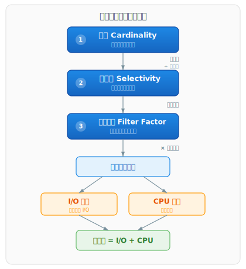
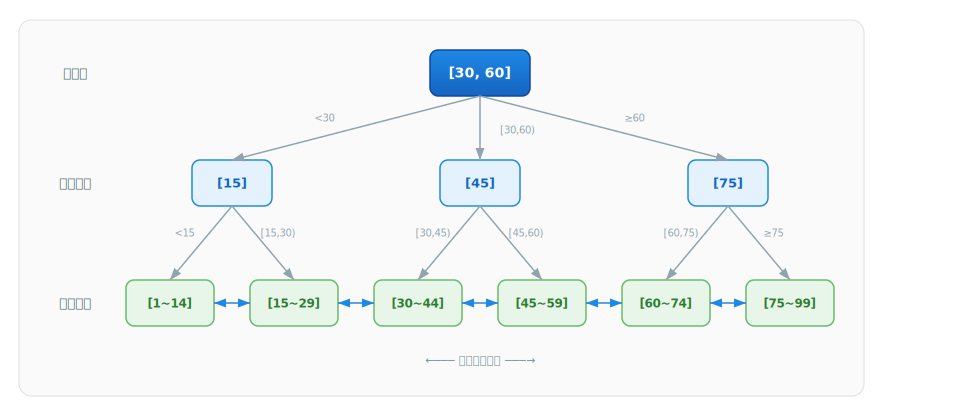

# MySQL 索引原理与失效场景详解

## 一、索引概述

### 1.1 索引定义

MySQL 官方文档对索引的定义：索引（Index）是帮助 MySQL 高效获取数据的数据结构。索引的本质是为数据表中的特定列建立有序的查找结构，通过缩小数据检索范围来避免全表扫描，从而提升查询性能。

### 1.2 索引的作用

根据 MySQL 官方文档（[Section 10.3.1 "How MySQL Uses Indexes"](https://dev.mysql.com/doc/refman/9.0/en/mysql-indexes.html)），MySQL 使用索引完成以下操作：

| 操作类型 | 说明 |
|----------|------|
| WHERE 条件过滤 | 快速定位满足 WHERE 子句的行 |
| 行排除 | 当存在多个可选索引时，MySQL 通常选择能排除最多行的索引（选择性最高的索引） |
| 联合索引左前缀查找 | 多列索引的任意左前缀可用于查找，如索引 `(col1, col2, col3)` 支持 `(col1)`、`(col1, col2)`、`(col1, col2, col3)` 三种查找 |
| JOIN 关联查询 | 从其他表检索行时使用索引，关联列的类型和大小需一致 |
| 聚合函数优化 | 对索引列查找 `MIN()` 或 `MAX()` 值，MySQL 可直接从 B-Tree 的最左或最右端获取 |
| 排序与分组 | 如果 ORDER BY 或 GROUP BY 使用了索引列，可避免额外的排序操作 |
| 覆盖索引 | 如果查询所需的所有列都在索引中，可直接从索引数据结构返回结果，无需回表 |

### 1.3 索引评估指标

优化器决定是否使用索引时，需要评估索引查找相对于全表扫描的成本优势。以下三个指标从不同层面支撑这一评估：基数和选择性衡量索引列本身的数据分布特征，过滤因子衡量特定查询条件的过滤效果。

#### 1.3.1 基数（Cardinality）

基数是索引列中不重复值的数量。根据 MySQL 官方文档（[Section 8.3.8 "InnoDB and MyISAM Index Statistics Collection"](https://dev.mysql.com/doc/refman/9.0/en/index-statistics.html)），`SHOW INDEX` 语句显示的 Cardinality 值基于 N/S 估算，其中 N 为表行数，S 为值组的平均行数。

> **值组的含义**：值组是具有相同索引键前缀值的行集合。对于单列索引，值组即具有相同列值的所有行（如 `name = '张三'` 的所有行）；对于联合索引 `(col1, col2, col3)`，值组按前缀长度划分——1 列前缀的值组为 `col1` 值相同的所有行，2 列前缀的值组为 `(col1, col2)` 值相同的所有行，以此类推。S 为每个值组包含的平均行数，Cardinality = N/S ≈ 不重复前缀值的数量。

| 特性 | 说明 |
|------|------|
| 含义 | 索引列中不重复值的数量 |
| 获取方式 | `SHOW INDEX FROM table_name` 中的 `Cardinality` 列 |
| 统计方式 | InnoDB 通过采样估算（默认采样 20 个随机索引页），非精确统计 |
| 更新方式 | `ANALYZE TABLE` 手动更新，或由 `innodb_stats_auto_recalc` 自动触发 |

> **Cardinality 是估算值**：InnoDB 通过采样推算，而非全表扫描。数据倾斜严重时，估算值可能偏差较大。可通过对比 `SHOW INDEX` 的 Cardinality 与 `SELECT COUNT(DISTINCT col)` 的实际值判断准确性。

#### 1.3.2 选择性（Selectivity）

选择性是基数的标准化形式，消除了表大小差异的影响，适用于跨表比较。

```
选择性 = 不重复值数量 / 表总行数 = COUNT(DISTINCT column) / COUNT(*)
```

| 选择性范围 | 索引效果 | 示例 |
|------------|----------|------|
| 接近 1 | 高效，索引过滤能力强 | 主键、唯一约束、手机号 |
| 中等 | 有效，需结合查询频率评估 | 用户 ID、订单日期 |
| 接近 0 | 低效，优化器可能放弃索引 | 性别（仅 2 个值）、状态标志 |

选择性影响优化器决策的机制：选择性越高 → 索引过滤后剩余行数越少 → 回表次数越少 → 优化器越倾向于使用索引。选择性过低时，索引过滤后仍返回大量行，回表的随机 I/O 成本可能超过全表扫描的顺序 I/O，优化器因此放弃索引。

#### 1.3.3 过滤因子（Filter Factor）

过滤因子衡量谓词（查询条件）匹配的行数比例，是优化器决定是否使用索引的直接依据。该概念出自 Tapio Lahdenmäki 的 *Relational Database Index Design and the Optimizer*，Oracle 优化器文档中也称为谓词选择性（Predicate Selectivity）。

```
过滤因子 = 谓词匹配的行数 / 表总行数
```

| 过滤因子范围 | 过滤效果 | 优化器倾向 |
|-------------|----------|-----------|
| 接近 0 | 强，匹配行数少 | 使用索引 |
| 接近 1 | 弱，匹配行数多 | 全表扫描 |

常见谓词的过滤因子估算（假设数据均匀分布）：

| 谓词类型 | 过滤因子估算 | 示例 |
|----------|-------------|------|
| 等值 `col = value` | 1 / NUM_DISTINCT | `status = 'ACTIVE'` → 1/3 |
| 范围 `col > value` | (MAX - value) / (MAX - MIN) | `age > 60` → 取决于值域 |
| 不等于 `col != value` | 1 - 1/NUM_DISTINCT | `status != 'ACTIVE'` → 2/3 |
| `IS NULL` | NULL 行数 / 总行数 | 取决于 NULL 值比例 |
| `IS NOT NULL` | 非 NULL 行数 / 总行数 | 取决于 NULL 值比例 |
| 复合谓词（列不相关） | FF₁ × FF₂ × ... | 各谓词过滤因子相乘 |

> **选择性与过滤因子的区别**：选择性是列级属性，衡量列值的不重复程度；过滤因子是谓词级属性，衡量特定查询条件的过滤效果。等值谓词的过滤因子 = 1 / NUM_DISTINCT = 1 / (选择性 × 总行数)，两者在此场景下等价。但非等值谓词（`!=`、`>`、`IS NULL` 等）的过滤因子取决于具体的操作符和数据分布，无法仅从列选择性推导。

#### 1.3.4 基数、选择性与过滤因子的关系

| 维度 | 基数（Cardinality） | 选择性（Selectivity） | 过滤因子（Filter Factor） |
|------|---------------------|----------------------|--------------------------|
| 衡量对象 | 列的不重复值数量 | 列值的不重复程度 | 谓词匹配的行数比例 |
| 类型 | 绝对值 | 相对值（0~1） | 相对值（0~1） |
| 受谓词影响 | 否 | 否 | 是 |
| 受表大小影响 | 是 | 否 | 否 |
| 适用场景 | 单表内评估索引 | 跨表比较索引效果 | 评估特定查询是否使用索引 |

三个指标形成逐层递进的评估链，在 CBO（Cost-Based Optimizer，基于成本的优化器）中协作完成索引评估：



| 步骤 | 阶段 | 转换 | 说明 |
|------|------|------|------|
| ① | 基数统计 | - | 通过采样统计估算列的不重复值数量 |
| ② | 归一化 | 基数 ÷ 表总行数 | 将基数归一化为 0~1 的选择性，消除表大小差异，使不同索引的过滤能力可直接比较 |
| ③ | 谓词适配 | 选择性 + 谓词条件 | 结合具体查询的谓词类型，将选择性调整为过滤因子，估算匹配的行数比例 |
| ④ | 行数估算 | 过滤因子 × 表总行数 | 估算索引过滤后需回表的行数 |
| ⑤ | 成本拆分 | I/O 成本 + CPU 成本 | I/O 成本来自回表随机 I/O，CPU 成本来自条件评估 |
| ⑥ | 方案选择 | 索引扫描成本 vs 全表扫描成本 | 选择总成本最低的执行方案 |

### 1.4 MySQL 索引类型概览

根据 MySQL 官方文档，不同存储引擎支持的索引类型如下：

| 存储引擎 | 支持的索引类型 |
|----------|----------------|
| InnoDB | B-Tree、FULLTEXT（倒排索引）、R-Tree（空间索引） |
| MyISAM | B-Tree、FULLTEXT（倒排索引）、R-Tree（空间索引） |
| MEMORY | B-Tree、Hash |

> 注：MySQL 官方文档中使用的术语为 "B-tree"，但在 InnoDB 的实际实现中，采用的是 B+ 树（B+ Tree）结构。B+ 树是 B 树的变体，两者在节点存储方式和叶子节点链接上存在关键差异，详见下文分析。

---

## 二、B+ 树索引

### 2.1 磁盘 I/O 与索引设计的关联

数据库的数据最终存储在磁盘上，磁盘 I/O 是数据库操作的主要性能瓶颈。一次磁盘随机 I/O 的耗时约 3-15ms（机械磁盘），而一次内存访问约 100ns，两者相差约 5 个数量级。

InnoDB 以**页（Page）** 为单位管理磁盘数据，默认页大小为 16KB（由 `innodb_page_size` 参数控制）。每次磁盘 I/O 读取一个完整的页到内存中的 Buffer Pool。因此，索引设计的核心目标是**以最少的页访问次数定位目标数据**。

基于此需求，理想的索引数据结构应满足：

| 需求 | 说明 |
|------|------|
| 树高尽可能低 | 使查找路径上的页访问次数最少，减少磁盘 I/O 次数 |
| 支持范围查询 | 能够高效地遍历一段连续的键值范围 |
| 查找性能稳定 | 所有查询的路径长度应一致，避免性能波动 |
| 支持顺序访问 | 能够按索引键的顺序高效扫描数据 |

> B+ 树中每个节点对应一个页，查找时从根节点逐层向下遍历到叶子节点，每经过一层就访问一个页，因此**树的高度 = 查找路径上的页访问次数**。页访问是否产生磁盘 I/O 取决于该页是否已在 Buffer Pool 中：若已缓存则直接从内存读取，否则触发一次磁盘 I/O；根节点通常常驻 Buffer Pool，因此实际可能的磁盘 I/O 次数通常为树高减一。因此，树高越低，页访问次数越少，可能的磁盘 I/O 次数也越少。

### 2.2 B+ 树数据结构

#### 2.2.1 逻辑结构

B+ 树是一种多路平衡查找树，其逻辑结构具有以下特征：

- **多路性**：每个节点可拥有多个子节点，非二叉结构
- **平衡性**：所有叶子节点位于同一层，查找路径长度一致
- **层级化存储**：分为根节点、内部节点（中间节点）和叶子节点
- **叶子节点链表化**：所有叶子节点通过双向链表连接，支持高效范围查询和顺序扫描

B+ 树的逻辑结构示意：



#### 2.2.2 物理存储

在 InnoDB 中，B+ 树的每个节点对应占据一个页（默认 16KB），节点内部包含多个条目：非叶子节点包含多个索引键和子节点指针，叶子节点包含多个数据行。

**根节点/内部节点（非叶子节点）的存储内容：**

| 内容 | 说明 |
|------|------|
| 索引键（Key） | 索引列的值，按升序排列 |
| 子节点指针 | 指向子节点页的页号（Page Number） |
| 页面元数据 | 页类型、键数量等控制信息 |

非叶子节点**不存储实际数据行**，仅存储索引键和子节点指针。n 个索引键将键空间划分为 n+1 个区间，每个区间对应 1 个子节点指针，因此 n 个索引键对应 n+1 个子节点指针。由于每个索引项（索引键 + 子节点指针）占用空间小，一个 16KB 的页可以存储数百到数千个索引项，使得 B+ 树的扇出（fanout）很大，树的高度很低。

**叶子节点的存储内容：**

| 索引类型 | 叶子节点存储内容 |
|----------|------------------|
| 聚簇索引（主键索引） | 索引键 + 完整数据行 |
| 二级索引（非主键索引） | 索引键 + 主键值 |

叶子节点之间通过双向链表连接，形成有序链表，支持范围查询时的高效遍历。

#### 2.2.3 B+ 树性质

B+ 树的**阶数（Order）**定义了一个节点最多拥有的子节点数。阶数越大，单个节点容纳的索引键越多，树越矮，可能的磁盘 I/O 越少。InnoDB 中阶数由页大小和索引键长度决定，而非显式配置。

在阶数为 m 的情况下，B+ 树满足以下性质：

1. 每个节点最多有 m 个子节点（即最多 m-1 个索引键）
2. 每个非叶子节点（除根节点外）至少有 ⌈m/2⌉ 个子节点（即至少 ⌈m/2⌉-1 个索引键）
3. 根节点至少有 2 个子节点（除非根节点本身是叶子节点）
4. 所有叶子节点位于同一层
5. 有 k 个子节点的非叶子节点包含 k-1 个索引键
6. 叶子节点包含所有数据，并通过指针串联

> **性质 2 的由来**：⌈m/2⌉ 下限是节点分裂的自然结果。当节点已满（m 个子节点）且需要再插入一个索引键时，该节点分裂为两个节点，各分得约一半子节点，均 ≥ ⌈m/2⌉。该下限保证每个节点至少半满（空间利用率 ≥ 50%），且树高上界为 $O(log_{⌈m/2⌉} n)$。删除导致子节点数低于 ⌈m/2⌉ 时，需向兄弟节点借键或与兄弟节点合并以恢复平衡。

#### 2.2.4 B+ 树时间复杂度

| 操作 | 时间复杂度 | 说明 |
|------|------------|------|
| 等值查找 | O(log n) | 由树高决定 |
| 范围查找 | O((log n) + m) | log n 定位起始点，m 为结果集大小 |
| 插入 | O(log n) | 可能触发页分裂 |
| 删除 | O(log n) | 可能触发页合并 |

### 2.3 B+ 树与其他数据结构的对比

#### 2.3.1 B+ 树 vs B 树

| 维度 | B 树 | B+ 树 |
|------|------|-------|
| 数据存储位置 | 所有节点（含非叶子节点）均可存储数据 | 仅叶子节点存储数据，非叶子节点仅存索引键 |
| 叶子节点链接 | 叶子节点之间无链表连接 | 叶子节点通过双向链表连接 |
| 查找稳定性 | 非叶子节点存储数据，不同键值的查找路径长度可能不同 | 所有查找必须到达叶子节点，路径长度一致 |
| 单页索引容量 | 非叶子节点存储数据，单页容纳的索引键较少 | 非叶子节点仅存索引键，单页容纳更多索引键 |
| 范围查询 | 需要中序遍历整棵树 | 沿叶子节点链表顺序遍历即可 |
| 磁盘 I/O 效率 | 中等（节点存数据导致单页索引键少，树较高） | 高（节点仅存索引键，树更矮） |
| 典型应用场景 | 内存数据库、文件系统 | 磁盘数据库（MySQL、PostgreSQL） |

B+ 树相比 B 树的核心优势：非叶子节点不存储数据，使得每个内部节点可以容纳更多的索引键，从而增大扇出、降低树高、减少可能的磁盘 I/O 次数。同时，叶子节点的链表结构使范围查询无需回溯上层节点，直接沿链表遍历即可。

#### 2.3.2 B+ 树 vs 哈希索引

| 维度 | B+ 树 | 哈希索引 |
|------|-------|----------|
| 等值查询 | O(log n) | O(1) |
| 范围查询 | 支持（沿叶子链表遍历） | 不支持 |
| 排序 | 支持（索引有序） | 不支持 |
| 最左前缀匹配 | 支持 | 不支持 |
| 哈希冲突 | 无此问题 | 存在哈希冲突，影响性能 |
| 存储引擎支持 | InnoDB、MyISAM | MEMORY（显式）；InnoDB（自适应哈希索引，内部自动管理） |

根据 MySQL 官方文档（[Section 10.3.9 "Comparison of B-Tree and Hash Indexes"](https://dev.mysql.com/doc/refman/9.0/en/index-btree-hash.html)），哈希索引仅适用于等值查询（`=`、`<=>`），不支持范围查询、排序和最左前缀匹配。

#### 2.3.3 B+ 树 vs 二叉搜索树

| 维度 | 二叉搜索树（含 AVL、红黑树） | B+ 树 |
|------|-------------------------------|-------|
| 每节点子节点数 | 最多 2 个 | 最多 m 个（m 通常为数百到数千） |
| 树高 | O(log₂ n)，较高 | O(log_m n)，极低 |
| 磁盘 I/O 次数 | 多（每个节点一次 I/O） | 少（3 层 B+ 树仅需 2-3 次 I/O） |
| 适用场景 | 内存数据结构 | 磁盘数据结构 |

二叉搜索树在数据量较大时树高过高，每次节点访问对应一次磁盘 I/O，查找效率无法满足数据库需求。

### 2.4 InnoDB 中 B+ 树的实现

#### 2.4.1 聚簇索引

聚簇索引（Clustered Index）是 InnoDB 中数据行的物理存储方式。聚簇索引的 B+ 树叶子节点直接存储完整的数据行，数据行按主键顺序物理存储。

根据 MySQL 官方文档（[Section 17.6.2.1 "Clustered and Secondary Indexes"](https://dev.mysql.com/doc/refman/9.0/en/innodb-index-types.html)），InnoDB 根据表定义按以下优先级确定聚簇索引的索引键，并构建相应的聚簇索引 B+ 树：

| 优先级 | 索引键来源 | 触发条件 |
|--------|-----------|---------|
| 1 | PRIMARY KEY 列 | 表定义了 PRIMARY KEY |
| 2 | 第一个所有键列均为 NOT NULL 的 UNIQUE 索引列 | 未定义 PRIMARY KEY，但存在符合条件的 UNIQUE 索引 |
| 3 | 隐藏列 `DB_ROW_ID`（6 字节单调递增） | 未定义 PRIMARY KEY 且无符合条件的 UNIQUE 索引（生成 `GEN_CLUST_INDEX` 隐藏聚簇索引） |

聚簇索引的特征：

- 每张表仅有一个聚簇索引
- 聚簇索引的叶子节点存储完整数据行
- 数据按主键顺序物理存储，范围查询和排序效率高
- 无需回表，直接通过索引获取数据

#### 2.4.2 二级索引

二级索引（Secondary Index）也称辅助索引或非聚簇索引。二级索引的 B+ 树叶子节点存储**索引列值 + 主键值**，而非完整数据行。

当通过二级索引查找非索引列数据时，需要执行**回表**操作：

1. 在二级索引的 B+ 树中查找索引列值，获取对应的主键值
2. 使用主键值到聚簇索引的 B+ 树中查找完整数据行

上述过程涉及两次 B+ 树查找：第一次在二级索引中定位主键值，第二次在聚簇索引中定位完整数据行（即回表）。回表是二级索引查询的主要性能开销，因为每条匹配记录都需要一次额外的聚簇索引查找，且主键值通常不连续，可能导致大量随机磁盘 I/O。

#### 2.4.3 聚簇索引与二级索引对比

| 特性 | 聚簇索引 | 二级索引 |
|------|----------|----------|
| 叶子节点存储 | 索引键 + 完整数据行 | 索引键 + 主键值 |
| 每表数量 | 仅 1 个 | 可多个 |
| 回表查询 | 无需回表 | 需回表（除非覆盖索引） |
| 插入性能 | 自增主键：顺序追加到叶子页末尾，效率高；非自增主键：需插入叶子页中间位置，目标页满时触发页分裂 | 每个二级索引均需插入新条目（索引列值 + 主键值），索引列非自增时同样可能触发页分裂 |
| 范围查询 | 数据按主键物理连续存储，顺序 I/O 效率高 | 二级索引按索引列有序，但回表时按主键值访问聚簇索引，主键值在索引列顺序下不连续，可能导致大量随机磁盘 I/O |

### 2.5 B+ 树操作

#### 2.5.1 查询流程

以等值查询 `WHERE id = 35` 为例，B+ 树的查找过程：

1. 读取根节点页到内存（1 次 I/O）
2. 在根节点内通过二分查找确定 35 所在的子节点范围
3. 读取对应的内部节点页到内存（1 次 I/O）
4. 重复二分查找，逐层向下定位
5. 读取叶子节点页到内存（1 次 I/O）
6. 在叶子节点中找到目标数据行

对于 3 层 B+ 树，一次等值查询最多需要 3 次磁盘 I/O（根节点常驻 Buffer Pool 时仅需 2 次）。

#### 2.5.2 插入与页分裂

当插入新记录时，B+ 树需要保持有序性和平衡性：

- **有序插入**（主键自增）：新记录追加到当前叶子节点的末尾，页满时分配新页。顺序插入时页的填充率约为 15/16（约 93.75%），InnoDB 保留约 1/16 的空间用于后续更新。
- **随机插入**：新记录需要插入到叶子节点的中间位置。如果目标页已满，则触发**页分裂（Page Split）**：将当前页的一半数据移动到新分配的页中，然后在父节点中插入新的索引项。随机插入时页的填充率为 1/2 到 15/16。

> **页的填充率（Fill Factor）**：指一个页中已用空间占页总容量的比例。InnoDB 没有提供显式的填充率配置参数（不同于 SQL Server 的 `FILLFACTOR`），其填充率由插入模式隐式决定：
>
> | 插入模式 | 填充率 | 原因 |
> |----------|--------|------|
> | 有序插入 | ≈ 15/16（93.75%） | 新记录顺序追加，页满时分配新页；InnoDB 保留 1/16 空间用于后续更新 |
> | 随机插入（页分裂后） | ≈ 1/2（50%） | 页分裂将数据均分到两个页，分裂后两个页各约 50% 填充 |
> | 随机插入（持续插入后） | 1/2 → 15/16 | 分裂后的页随后续插入逐渐填充，直到再次触发分裂 |
>
> 填充率反映了空间利用率与页分裂频率的权衡：填充率越高，空间利用率越高，但后续操作更易触发页分裂；填充率越低，空间浪费越多，但为后续操作留有余量。

页分裂的影响：

- 产生额外的磁盘 I/O（数据迁移和新页写入）
- 导致页的空间利用率降低（分裂后两个页各约 50% 填充）
- 父节点可能也需要分裂，极端情况下分裂传播至根节点

#### 2.5.3 删除与页合并

当删除记录导致页的填充率低于 `MERGE_THRESHOLD`（默认 50%）时，InnoDB 尝试将当前页与相邻页合并，释放空页。

`MERGE_THRESHOLD` 的配置方式：

| 配置级别 | 语法 |
|----------|------|
| 表级别 | `CREATE TABLE ... COMMENT 'MERGE_THRESHOLD=40'` |
| 索引级别 | `CREATE INDEX idx ON t1(id) COMMENT 'MERGE_THRESHOLD=40'` |

索引级别的设置优先于表级别。`MERGE_THRESHOLD` 的取值范围为 1 到 50，默认值为 50。

### 2.6 B+ 树高度计算

InnoDB B+ 树的高度决定了查找所需的磁盘 I/O 次数。以默认页大小 16KB 为例：

**非叶子节点容量估算**：

假设每个索引键 + 子节点指针约 16 字节，则每个非叶子节点可存储约 16KB / 16B = 1024 个索引项。

**3 层 B+ 树的容量**：

| 层级 | 节点数 | 说明 |
|------|--------|------|
| 第 1 层（根节点） | 1 | 常驻 Buffer Pool |
| 第 2 层（内部节点） | 1024 | 约 1024 个页 |
| 第 3 层（叶子节点） | 1024 × 1024 = 1,048,576 | 约 100 万个页 |

假设每行数据约 1KB，每个叶子页存储约 16 行，3 层 B+ 树可存储约 1,048,576 × 16 ≈ 1600 万行数据。

**4 层 B+ 树的容量**：约 1024³ × 16 ≈ 170 亿行数据。

因此，对于千万级数据，3 层 B+ 树即可满足需求，查找仅需 2-3 次磁盘 I/O。

---

## 三、索引分类

### 3.1 按数据结构分类

| 索引类型 | 数据结构 | 支持的存储引擎 | 特点 |
|----------|----------|----------------|------|
| B-Tree 索引 | B+ 树 | InnoDB、MyISAM | 默认索引类型，支持等值查询、范围查询、排序、最左前缀匹配 |
| Hash 索引 | 哈希表 | MEMORY（显式）；InnoDB（自适应哈希索引） | 仅支持等值查询，不支持范围查询和排序 |
| Full-Text 索引 | 倒排索引 | InnoDB（5.6+）、MyISAM | 用于全文搜索，支持 `MATCH ... AGAINST` 语法 |
| R-Tree 索引 | R 树 | InnoDB（5.7+）、MyISAM | 用于空间数据类型（GEOMETRY、POINT 等），支持空间操作函数 |

### 3.2 按存储方式分类

| 索引类型 | 叶子节点存储 | 数量限制 | 回表需求 |
|----------|--------------|----------|----------|
| 聚簇索引 | 索引键 + 完整数据行 | 每表 1 个 | 无需回表 |
| 二级索引 | 索引键 + 主键值 | 每表可多个 | 需回表（覆盖索引除外） |

### 3.3 按逻辑功能分类

| 索引类型 | 定义方式 | 特点 |
|----------|----------|------|
| 主键索引 | `PRIMARY KEY` | 唯一且非空，InnoDB 以此作为聚簇索引 |
| 唯一索引 | `UNIQUE` | 索引列值必须唯一，允许 NULL |
| 普通索引 | `INDEX` / `KEY` | 无唯一性约束，仅用于加速查询 |
| 前缀索引 | `INDEX col(N)` | 对字符串列的前 N 个字符建立索引，减少索引空间占用 |
| 联合索引 | `INDEX (col1, col2, col3)` | 多列组合索引，遵循最左前缀匹配原则 |
| 函数索引 | `INDEX ((expr))` | MySQL 8.0+ 支持，对表达式结果建立索引 |

---

## 四、索引优化机制

### 4.1 覆盖索引

覆盖索引（Covering Index）是指查询所需的所有列都包含在索引中，无需回表到聚簇索引获取数据。

判断方式：`EXPLAIN` 输出的 `Extra` 列显示 `Using index`。

```sql
-- 假设存在联合索引 idx_name_age (name, age)
-- 覆盖索引：查询列均在索引中
SELECT name, age FROM user WHERE name = '张三';

-- 非覆盖索引：需要回表获取 email 列
SELECT name, age, email FROM user WHERE name = '张三';
```

覆盖索引的优势：

- 避免回表操作，减少磁盘 I/O
- 二级索引的叶子节点通常远小于聚簇索引的叶子节点，同等数据量下二级索引页数更少，扫描效率更高

> **为什么二级索引叶子节点远小于聚簇索引？** 聚簇索引叶子节点存储主键值 + 完整数据行（所有列），单条目可能数百至数千字节；二级索引叶子节点仅存储索引列值 + 主键值，单条目通常仅十几至几十字节。因此单个 16KB 页中，聚簇索引可能仅存储十几行，而二级索引可存储上千条，同等数据量下二级索引所需页数远少于聚簇索引。

### 4.2 索引条件下推

索引条件下推（Index Condition Pushdown，ICP）是 MySQL 5.6 引入的优化。根据 MySQL 官方文档（[Section 10.2.1.6 "Index Condition Pushdown Optimization"](https://dev.mysql.com/doc/refman/9.0/en/index-condition-pushdown-optimization.html)），ICP 的工作原理：

**无 ICP 时**：

1. 存储引擎遍历二级索引，回表定位到基表中的行
2. 将完整行返回给 MySQL Server
3. MySQL Server 评估 WHERE 条件，决定是否接受该行

**有 ICP 时**：

1. 存储引擎遍历二级索引，读取索引元组
2. 使用索引列评估 WHERE 条件中可由索引列判断的部分
3. 仅当索引条件满足时，才回表读取完整行
4. 将完整行返回给 MySQL Server
5. MySQL Server 评估 WHERE 条件的剩余部分

ICP 的适用条件：

| 条件 | 说明 |
|------|------|
| 访问方法 | 适用于 range、ref、eq_ref、ref_or_null |
| 存储引擎 | InnoDB 和 MyISAM（含分区表） |
| InnoDB 限制 | 仅用于二级索引（聚簇索引已包含完整行，ICP 无法减少 I/O） |
| 不支持场景 | 虚拟生成列上的二级索引、子查询条件、存储函数条件 |

判断方式：`EXPLAIN` 输出的 `Extra` 列显示 `Using index condition`。

```sql
-- 假设索引 idx_zipcode_lastname (zipcode, lastname, firstname)
SELECT * FROM people
WHERE zipcode = '95054'
  AND lastname LIKE '%etrunia%'
  AND address LIKE '%Main Street%';
```

上述查询中，`zipcode` 可通过索引定位，`lastname LIKE '%etrunia%'` 无法使用索引定位但可在索引元组中评估，`address LIKE '%Main Street%'` 需要回表后评估。ICP 使存储引擎在回表前先过滤 `lastname` 条件，减少回表次数。

### 4.3 自适应哈希索引

自适应哈希索引（Adaptive Hash Index，AHI）是 InnoDB 的内部优化机制。根据 MySQL 官方文档（[Section 17.5.3 "Adaptive Hash Index"](https://dev.mysql.com/doc/refman/9.0/en/innodb-adaptive-hash.html)）：

- InnoDB 监控索引搜索模式，如果观察到某些索引页被频繁访问，会自动在这些页上构建哈希索引
- 哈希索引基于 B+ 树索引的键前缀构建，前缀长度可变
- AHI 仅在表数据基本全部装入内存时效果显著，将索引查找从 B+ 树的 O(log n) 提升到哈希的 O(1)
- 由 `innodb_adaptive_hash_index` 参数控制，默认启用
- AHI 分区数由 `innodb_adaptive_hash_index_parts` 控制，默认 8，最大 512

> **为什么称作"自适应"？** AHI 无需人工配置，InnoDB 根据运行时观察到的索引页访问模式，自动决定在哪些页上构建哈希索引。访问频繁的页会被选中，访问稀少的页则不会，索引结构随负载变化动态调整，因此称为"自适应"。

AHI 的局限性：

- 高并发 JOIN 场景下可能成为争用源
- `LIKE` 操作和 `%` 通配符查询通常无法受益（对于不受益的负载，关闭 AHI 可减少不必要的性能开销）

### 4.4 联合索引与最左前缀匹配原则

联合索引（Composite Index）是在多个列上建立的索引。根据 MySQL 官方文档（[Section 10.3.6 "Multiple-Column Indexes"](https://dev.mysql.com/doc/refman/9.0/en/multiple-column-indexes.html)），联合索引 `(col1, col2, col3)` 相当于创建了三个索引的查找能力：`(col1)`、`(col1, col2)`、`(col1, col2, col3)`。

**最左前缀匹配原则**：查询条件必须从索引定义的最左列开始匹配，中间不能跳过列。

联合索引 `(a, b, c)` 的匹配规则：

| 查询条件 | 索引使用情况 |
|----------|--------------|
| `WHERE a = 1` | 使用索引，匹配 a |
| `WHERE a = 1 AND b = 2` | 使用索引，匹配 a、b |
| `WHERE a = 1 AND b = 2 AND c = 3` | 使用索引，匹配 a、b、c |
| `WHERE b = 2` | 不使用索引（跳过最左列 a） |
| `WHERE b = 2 AND c = 3` | 不使用索引（跳过最左列 a） |
| `WHERE a = 1 AND c = 3` | 使用索引，仅匹配 a（c 无法使用索引） |

**范围查询对后续列的影响**：当联合索引中某一列使用范围查询（`>`、`<`、`BETWEEN`、`LIKE 'prefix%'`）时，该列右侧的所有列无法使用索引。

```sql
-- 索引 idx_abc (a, b, c)
-- a 使用等值查询，b 使用范围查询，c 无法使用索引
SELECT * FROM t WHERE a = 1 AND b > 2 AND c = 3;
```

---

## 五、索引失效场景

索引失效的本质是查询优化器判断使用索引的成本高于全表扫描。以下场景是导致索引失效的常见原因。

### 5.1 违反最左前缀匹配原则

联合索引的 B+ 树按照索引定义的列顺序构建。跳过最左列直接查询后续列，B+ 树无法利用有序性进行定位。

```sql
-- 索引 idx_abc (a, b, c)

-- 索引失效：跳过最左列 a
SELECT * FROM t WHERE b = 2;

-- 索引失效：跳过最左列 a
SELECT * FROM t WHERE b = 2 AND c = 3;

-- 索引有效：从最左列 a 开始，匹配 a、b
SELECT * FROM t WHERE a = 1 AND b = 2;
```

### 5.2 索引列使用函数

对索引列使用函数会改变列值的形态，B+ 树中存储的是原始值，无法保证函数计算后的结果在索引中是有序的，因此无法使用索引进行定位。

```sql
-- 索引失效：索引列使用函数
SELECT * FROM user WHERE UPPER(username) = 'ADMIN';
SELECT * FROM orders WHERE YEAR(create_time) = 2025;
SELECT * FROM user WHERE LEFT(username, 3) = 'abc';

-- 索引有效：将函数操作转移到常量端
SELECT * FROM user WHERE username = 'ADMIN'
   OR username = 'admin';
SELECT * FROM orders WHERE create_time >= '2025-01-01' AND create_time < '2026-01-01';
```

MySQL 8.0+ 支持函数索引，可对表达式结果建立索引：

```sql
CREATE INDEX idx_year ON orders ((YEAR(create_time)));
```

### 5.3 索引列参与计算或表达式

在索引列上进行算术运算或其他表达式操作，等同于对索引列施加了变换函数，B+ 树无法直接使用。

```sql
-- 索引失效：索引列参与计算
SELECT * FROM product WHERE price * 0.8 > 100;
SELECT * FROM user WHERE age + 1 = 20;

-- 索引有效：将计算转移到常量端
SELECT * FROM product WHERE price > 100 / 0.8;
SELECT * FROM user WHERE age = 19;
```

### 5.4 隐式类型转换

当查询条件中的值类型与列定义的类型不一致时，MySQL 会进行隐式类型转换。根据 MySQL 官方文档（[Section 10.3.1 "How MySQL Uses Indexes"](https://dev.mysql.com/doc/refman/9.0/en/mysql-indexes.html)），对不同类型的列进行比较时，如果无法直接比较，MySQL 会执行类型转换，这可能导致索引无法使用。

MySQL 的隐式转换规则：将字符串转换为数值进行比较。当 `VARCHAR` 列与数值比较时，MySQL 会在 `VARCHAR` 列上执行 `CAST` 操作，相当于对索引列使用了函数。

```sql
-- phone 列为 VARCHAR(11)，建有索引

-- 索引失效：数值与字符串比较，MySQL 在 phone 列上执行 CAST(phone AS SIGNED)
SELECT * FROM user WHERE phone = 13800138000;

-- 索引有效：类型一致
SELECT * FROM user WHERE phone = '13800138000';
```

反向情况：当数值列与字符串比较时，MySQL 将字符串转换为数值，索引列本身不受影响，索引仍可使用。

```sql
-- id 列为 INT，建有索引

-- 索引有效：MySQL 将字符串 '1' 转换为数值 1，索引列 id 不受影响
SELECT * FROM user WHERE id = '1';
```

### 5.5 隐式字符集转换

当 JOIN 操作或比较操作涉及不同字符集的列时，MySQL 会执行字符集转换，导致索引失效。

```sql
-- 表 users 的 username 列使用 utf8mb4
-- 表 logs 的 username 列使用 latin1

-- 索引失效：字符集不同，MySQL 执行隐式字符集转换
SELECT u.id, l.log_time
FROM users u
JOIN logs l ON u.username = l.username;
```

解决方案：确保关联列使用相同的字符集和排序规则。

### 5.6 LIKE 以通配符开头

B+ 树索引按索引键的左前缀有序排列。`LIKE 'prefix%'` 可以利用索引的前缀匹配特性定位起始位置；`LIKE '%pattern'` 或 `LIKE '%pattern%'` 无法确定起始位置，B+ 树的有序性无法发挥作用。

```sql
-- 索引失效：前导通配符
SELECT * FROM article WHERE title LIKE '%MySQL';
SELECT * FROM article WHERE title LIKE '%MySQL%';

-- 索引有效：仅后缀通配符
SELECT * FROM article WHERE title LIKE 'MySQL%';
```

替代方案：对于必须使用前导通配符的场景，可考虑全文索引（`FULLTEXT`）或外部搜索引擎。

### 5.7 OR 条件包含无索引列

当 `OR` 连接的条件中有一个列没有索引时，MySQL 为确保结果正确性，可能选择全表扫描而非使用部分索引。

```sql
-- 假设 name 有索引，email 无索引

-- 索引失效：email 无索引，整个查询退化为全表扫描
SELECT * FROM user WHERE name = '张三' OR email = 'zhang@example.com';

-- 替代方案 1：为 OR 涉及的所有列建立索引
CREATE INDEX idx_email ON user(email);

-- 替代方案 2：使用 UNION 改写
SELECT * FROM user WHERE name = '张三'
UNION ALL
SELECT * FROM user WHERE email = 'zhang@example.com';
```

### 5.8 范围查询导致后续索引列失效

联合索引中，当某一列使用范围查询时，该列右侧的所有列无法使用索引。这是因为范围查询后的列在 B+ 树中不再保持全局有序。

```sql
-- 索引 idx_abc (a, b, c)

-- 索引部分失效：a 使用等值查询（有效），b 使用范围查询（有效），c 无法使用索引
SELECT * FROM t WHERE a = 1 AND b > 2 AND c = 3;

-- 索引有效：a、b、c 均使用等值查询
SELECT * FROM t WHERE a = 1 AND b = 2 AND c = 3;
```

设计联合索引时，应将需要范围查询的列放在等值查询列的右侧。

### 5.9 优化器放弃索引

即使索引在语法上可用，MySQL 优化器也会基于成本估算决定是否使用索引。当索引列的数据分布不均匀（低选择性）并且查询命中的行数占全表比例较高（高过滤因子）时，优化器判断全表扫描（顺序 I/O）比索引查找 + 大量回表（随机 I/O）成本更低，从而放弃索引。

```sql
-- 假设 status 列仅有 0 和 1 两个值，90% 的行 status = 1

-- 优化器可能放弃索引，选择全表扫描
SELECT * FROM orders WHERE status = 1;
```

判断方式：通过 `EXPLAIN` 查看 `type` 列是否为 `ALL`，以及 `key` 列是否为 `NULL`。

可通过 `FORCE INDEX` 提示优化器使用指定索引，但需谨慎使用：

```sql
SELECT * FROM orders FORCE INDEX(idx_status) WHERE status = 1;
```

#### 典型场景：!= 和 <> 操作符

`!=` 和 `<>` 操作符需要排除特定值的行，通常意味着匹配的结果集较大，需要扫描大部分索引并产生大量回表，此时优化器可能判断全表扫描成本更低。

```sql
-- 索引可能失效：不等于操作
SELECT * FROM product WHERE status != 'ACTIVE';
SELECT * FROM user WHERE age <> 18;

-- 替代方案：使用 IN 列举可能的值
SELECT * FROM product WHERE status IN ('PENDING', 'CANCELLED', 'DRAFT');
```

> 注：不等于操作是否导致索引失效取决于优化器的成本估算。如果 `!=` 排除的行数较多（即匹配结果集较小），优化器可能仍选择使用索引。

#### 典型场景：NOT IN / NOT EXISTS

`NOT IN` 和 `NOT EXISTS` 是否定操作，需要排除特定值的行。与 `!=` 类似，当排除的行数较少时，优化器可能判断全表扫描成本更低。

```sql
-- 索引可能失效：NOT IN
SELECT * FROM user WHERE id NOT IN (SELECT user_id FROM orders);

-- 替代方案：使用 LEFT JOIN
SELECT u.* FROM user u
LEFT JOIN orders o ON u.id = o.user_id
WHERE o.user_id IS NULL;
```

#### 典型场景：IS NULL / IS NOT NULL

`IS NULL` 和 `IS NOT NULL` 是否使用索引取决于谓词的过滤因子。过滤因子越高（匹配结果集越大），优化器越倾向全表扫描。

```sql
-- 如果 99% 的行 status 都不为 NULL，IS NOT NULL 匹配 99% 的行，过滤因子高
SELECT * FROM orders WHERE status IS NOT NULL;  -- 可能全表扫描

-- 如果仅 1% 的行 status 为 NULL，IS NULL 匹配 1% 的行，过滤因子低
SELECT * FROM orders WHERE status IS NULL;  -- 可能使用索引
```

### 索引失效场景汇总

| 场景 | 失效原因 | 解决方案 |
|------|----------|----------|
| 违反最左前缀原则 | 跳过联合索引的最左列，B+ 树无法定位 | 确保查询条件从最左列开始 |
| 索引列使用函数 | 函数改变了列值形态，B+ 树无法定位 | 将函数转移到常量端，或使用函数索引（8.0+） |
| 索引列参与计算 | 计算改变了列值形态，B+ 树无法定位 | 将计算转移到常量端 |
| 隐式类型转换 | MySQL 在索引列上执行 CAST，等同于使用函数 | 确保查询值的类型与列定义一致 |
| 隐式字符集转换 | 字符集不同导致转换 | 确保关联列字符集和排序规则一致 |
| LIKE 前导通配符 | 无法确定 B+ 树中的起始位置 | 使用后缀通配符，或使用全文索引 |
| OR 条件含无索引列 | 部分条件无索引导致整体退化为全表扫描 | 为所有 OR 列建索引，或改用 UNION |
| 范围查询右侧列失效 | 范围查询后后续列不再全局有序 | 将范围查询列放在联合索引右侧 |
| 优化器放弃索引 | 全表扫描成本低于索引查找 + 回表 | 评估索引选择性，必要时使用 FORCE INDEX |

---

## 六、索引设计原则

### 6.1 建立索引的场景

| 场景 | 说明 |
|------|------|
| 高频 WHERE 条件列 | 频繁作为查询过滤条件的列 |
| JOIN 关联列 | 频繁用于表关联的列 |
| ORDER BY / GROUP BY 列 | 频繁用于排序或分组的列 |
| 高选择性列 | 列的基数（Cardinality）高，重复值少 |

### 6.2 避免建立索引的场景

| 场景 | 说明 |
|------|------|
| 低选择性列 | 列的重复值多（如性别、状态标志），索引过滤效果差 |
| 频繁更新的列 | 索引维护成本高，每次更新都需修改 B+ 树 |
| 小表 | 全表扫描成本低于索引查找 |
| 很少用于查询的列 | 索引占用存储空间且增加写入开销 |

### 6.3 联合索引设计策略

联合索引的列顺序应遵循以下原则：

1. **等值过滤列在前，范围过滤列在后**：确保范围查询不会导致后续列失效
2. **高选择性列在前**：将区分度高的列放在左侧，提升索引过滤效率
3. **考虑覆盖索引**：将查询中需要 SELECT 的列纳入联合索引，避免回表
4. **避免冗余索引**：联合索引 `(a, b)` 已覆盖单列索引 `(a)` 的功能，无需重复创建

### 6.4 主键设计原则

- 使用自增主键：避免随机插入导致的页分裂，保持数据物理顺序
- 主键长度尽量短：二级索引的叶子节点存储主键值，短主键减少索引空间占用
- 避免更新主键：主键更新会导致聚簇索引数据行移动和所有二级索引的更新

---

## 七、参考资料

- MySQL 9.0 Reference Manual - Section 8.3.8: [InnoDB and MyISAM Index Statistics Collection](https://dev.mysql.com/doc/refman/9.0/en/index-statistics.html)
- MySQL 9.0 Reference Manual - Section 10.2.1.6: [Index Condition Pushdown Optimization](https://dev.mysql.com/doc/refman/9.0/en/index-condition-pushdown-optimization.html)
- MySQL 9.0 Reference Manual - Section 10.3.1: [How MySQL Uses Indexes](https://dev.mysql.com/doc/refman/9.0/en/mysql-indexes.html)
- MySQL 9.0 Reference Manual - Section 10.3.5: [Column Indexes](https://dev.mysql.com/doc/refman/9.0/en/column-indexes.html)
- MySQL 9.0 Reference Manual - Section 10.3.6: [Multiple-Column Indexes](https://dev.mysql.com/doc/refman/9.0/en/multiple-column-indexes.html)
- MySQL 9.0 Reference Manual - Section 10.3.9: [Comparison of B-Tree and Hash Indexes](https://dev.mysql.com/doc/refman/9.0/en/index-btree-hash.html)
- MySQL 9.0 Reference Manual - Section 15.10: [InnoDB Row Formats](https://dev.mysql.com/doc/refman/9.0/en/innodb-row-format.html)
- MySQL 9.0 Reference Manual - Section 17.5.3: [Adaptive Hash Index](https://dev.mysql.com/doc/refman/9.0/en/innodb-adaptive-hash.html)
- MySQL 9.0 Reference Manual - Section 17.6.2.1: [Clustered and Secondary Indexes](https://dev.mysql.com/doc/refman/9.0/en/innodb-index-types.html)
- MySQL 9.0 Reference Manual - Section 17.6.2.2: [The Physical Structure of an InnoDB Index](https://dev.mysql.com/doc/refman/9.0/en/innodb-physical-structure.html)
