# MySQL 集群架构详解

## 一、概述

MySQL 集群架构是实现数据库高可用、高性能、可扩展的核心技术方案。本文将系统介绍 MySQL 主从复制架构及主流集群方案。

### 1.1 集群架构核心目标

| 目标 | 说明 |
|------|------|
| **高可用** | 主节点故障时快速切换，保障服务连续性 |
| **读写分离** | 读请求分散到从库，提升整体吞吐量 |
| **数据备份** | 从库提供数据冗余，支持灾备恢复 |
| **负载均衡** | 多节点分担请求压力，提升性能 |

### 1.2 数据同步核心机制

**所有 MySQL 集群架构的数据同步都基于 Binlog（二进制日志）**。

| 机制 | 说明 |
|------|------|
| **Binlog** | 记录所有数据修改操作，是数据同步的载体 |
| **同步方式** | 不同方案采用不同的同步策略（异步/半同步/同步） |
| **一致性保证** | 通过 Binlog 的完整传递确保数据一致 |

### 1.3 主流方案概览

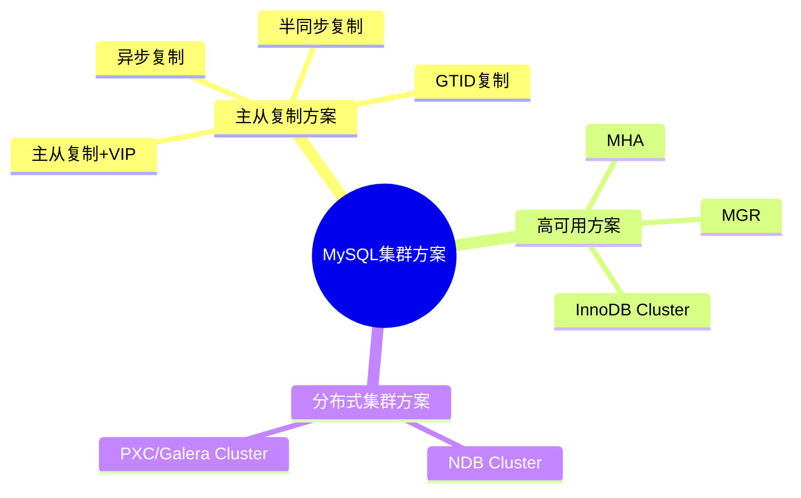

---

## 二、主从复制架构

### 2.1 架构概述

主从复制是 MySQL 最基础的集群架构，通过 Binlog 实现主库到从库的数据同步。

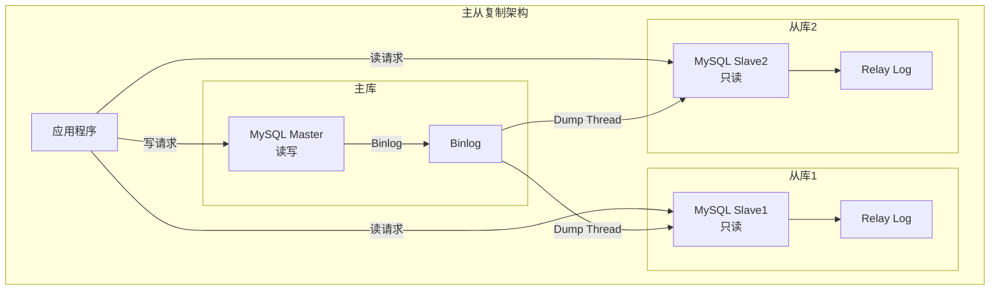

### 2.2 核心组件

| 组件 | 作用 |
|------|------|
| **Binlog** | 二进制日志，记录所有数据修改操作，主从复制的数据载体 |
| **Relay Log** | 中继日志，从库接收的 Binlog 临时存储 |
| **Dump Thread** | 主库线程，负责向从库发送 Binlog |
| **IO Thread** | 从库线程，接收主库 Binlog 写入 Relay Log |
| **SQL Thread** | 从库线程，重放 Relay Log 中的事件 |

### 2.3 复制流程

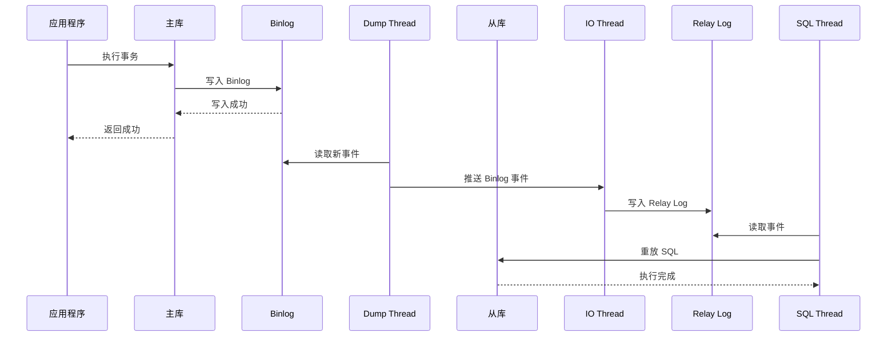

### 2.4 复制模式对比

| 模式 | 原理 | 优点 | 缺点 | 适用场景 |
|------|------|------|------|----------|
| **异步复制** | 主库提交后立即返回，不等待从库 | 性能最佳 | 可能丢数据 | 非核心业务 |
| **半同步复制** | 主库等待至少一个从库确认收到 Binlog | 数据更可靠 | 性能有损耗 | 核心业务 |
| **全同步复制** | 主库等待所有从库确认 | 数据零丢失 | 性能最差 | 金融交易 |

### 2.5 GTID 全局事务标识

MySQL 5.6 引入的 GTID（Global Transaction Identifier）简化了主从复制管理。

**GTID 格式**：`server_uuid:transaction_id`

```
示例：3E11FA47-71CA-11E1-9E33-C80AA9429562:23
      ↑                                    ↑
   server_uuid                        transaction_id
```

**GTID 在主从复制中的作用**：

| 作用 | 说明 |
|------|------|
| **唯一标识事务** | 每个事务在集群内有全局唯一标识，避免重复执行 |
| **简化配置** | 无需手动指定 Binlog 文件名和位置，自动定位同步点 |
| **故障恢复** | 主从切换后，从库自动根据 GTID 找到需要同步的事务 |
| **一致性保证** | 通过 GTID 集合判断从库是否已执行某事务，避免数据不一致 |

**GTID 工作流程**：

```
1. 主库执行事务 T1，生成 GTID = uuid:1
2. 事务 T1 写入 Binlog，GTID 一起记录
3. 从库 IO Thread 接收 Binlog，提取 GTID
4. 从库检查 GTID 是否已执行：
   - 已执行：跳过
   - 未执行：写入 Relay Log 并重放
5. 从库记录已执行的 GTID 集合
```

### 2.6 Binlog 格式

| 格式 | 记录方式 | 优点 | 缺点 |
|------|----------|------|------|
| **STATEMENT** | 记录 SQL 语句 | 日志体积小 | 函数/触发器可能导致不一致 |
| **ROW** | 记录行数据变化 | 一致性强 | 日志体积大 |
| **MIXED** | 混合模式 | 兼顾两者 | 复杂场景可能出问题 |

> **推荐**：MySQL 8.0 默认使用 ROW 格式，保证主从数据一致性。

### 2.7 主从复制 + VIP 方案

**VIP（Virtual IP，虚拟 IP）** 是主从复制架构中实现高可用的简单方案。

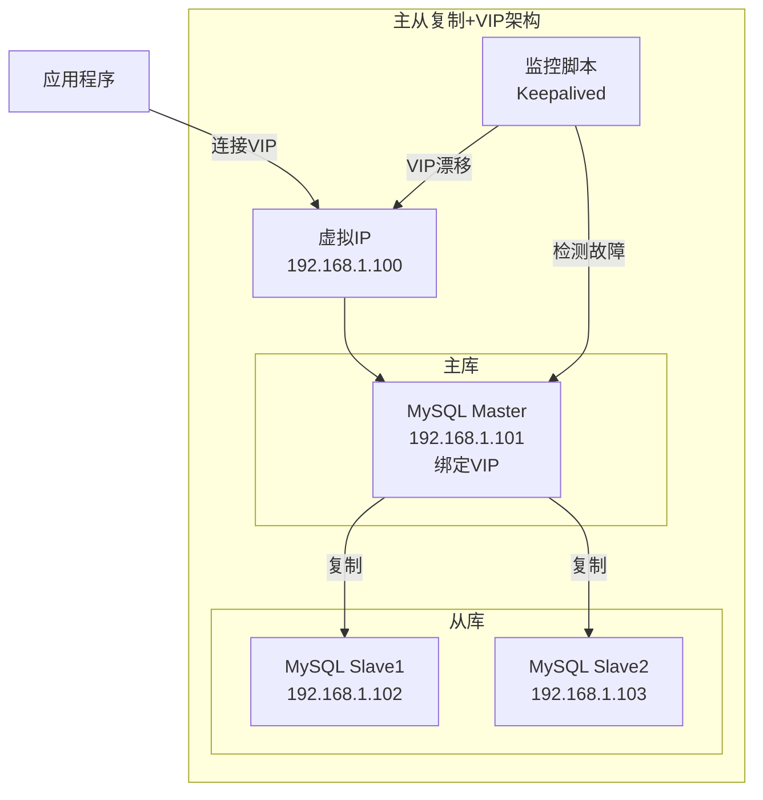

**工作原理**：

| 步骤 | 操作 |
|------|------|
| 1 | 应用程序连接 VIP，VIP 绑定在主库上 |
| 2 | 监控脚本（如 Keepalived）持续检测主库状态 |
| 3 | 主库故障时，监控脚本将 VIP 漂移到从库 |
| 4 | 从库提升为主库，应用程序无感知切换 |

**优缺点**：

| 优点 | 缺点 |
|------|------|
| 部署简单 | 需要额外监控脚本 |
| 成本低 | 切换过程可能有短暂中断 |
| 对应用透明 | 可能丢失未同步的数据 |

---

## 三、高可用方案

### 3.1 MHA 架构

#### 3.1.1 架构概述

MHA（Master High Availability）是 Perl 脚本开发的 MySQL 高可用工具，专注于主节点故障切换。

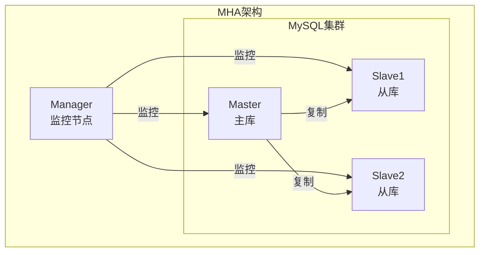

#### 3.1.2 核心组件

| 组件 | 说明 |
|------|------|
| **MHA Manager** | 管理节点，监控主库状态，执行故障切换 |
| **MHA Node** | 数据节点，运行在每个 MySQL 服务器上 |

#### 3.1.3 故障切换流程

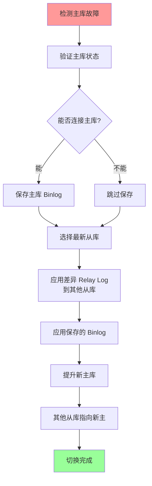

**详细步骤**：

| 步骤 | 操作 |
|------|------|
| 1 | Manager 多次尝试连接主库，确认故障 |
| 2 | 如果能连接，从宕机主库保存未同步的 Binlog |
| 3 | 识别 Relay Log 最新的从库作为新主库候选 |
| 4 | 将差异 Relay Log 应用到其他从库 |
| 5 | 应用从原主库保存的 Binlog 事件 |
| 6 | 提升候选从库为新主库 |
| 7 | 重新配置其他从库指向新主库 |

#### 3.1.4 MHA 优缺点

| 优点 | 缺点 |
|------|------|
| 切换时间短（10-30秒） | 需要额外 Manager 节点 |
| 最大程度保证数据一致性 | 仅支持主从架构 |
| 支持在线切换 | 维护成本较高 |
| 开源免费 | 社区活跃度下降 |

### 3.2 MGR 架构

#### 3.2.1 架构概述

MGR（MySQL Group Replication）是 MySQL 5.7.17 引入的官方高可用方案，基于 Paxos 协议实现分布式一致性。

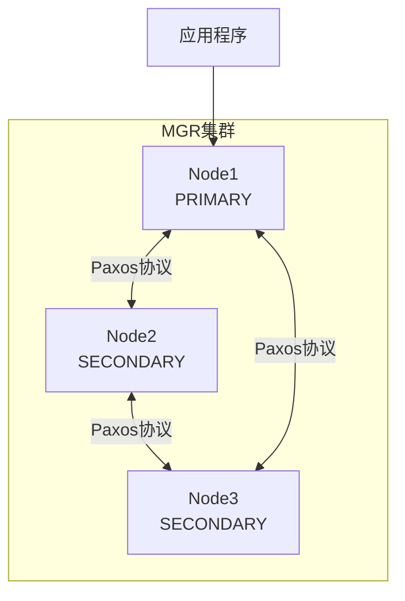

#### 3.2.2 核心特性

| 特性 | 说明 |
|------|------|
| **强一致性** | 基于 Paxos 协议，多数节点确认后事务才提交 |
| **自动故障转移** | 主节点故障时自动选举新主 |
| **自动节点管理** | 支持动态添加/删除节点 |
| **最大9节点** | 集群规模上限为 9 个节点 |

#### 3.2.3 工作模式

**单主模式（Single-Primary）**：

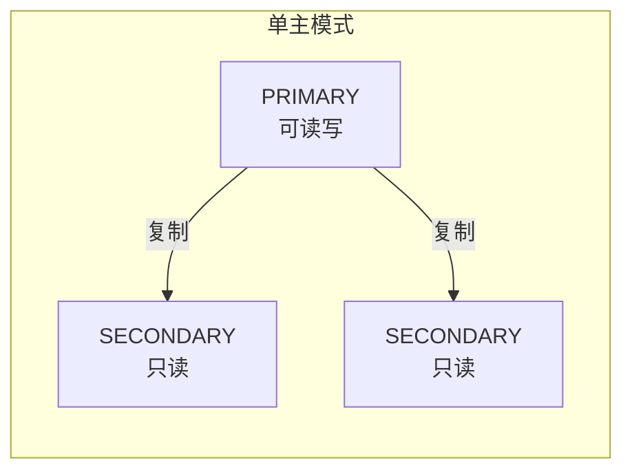

- 只有 PRIMARY 节点可写
- 其他节点只读
- PRIMARY 故障自动选举新主

**多主模式（Multi-Primary）**：

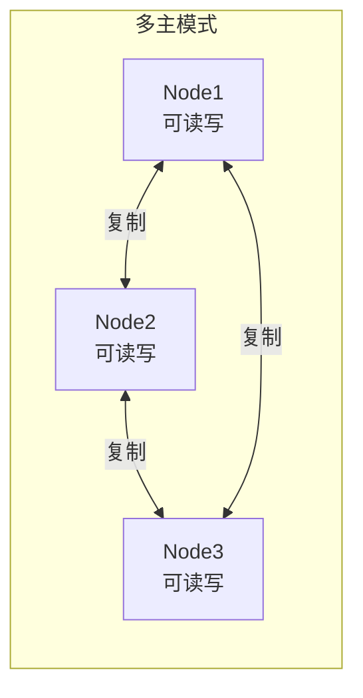

- 所有节点都可写
- 需处理写写冲突
- 适合特定业务场景

#### 3.2.4 事务提交流程

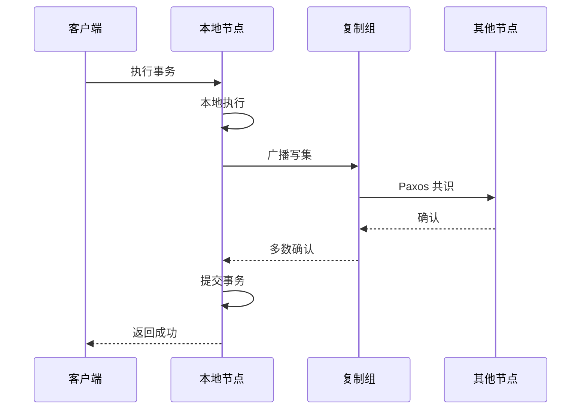

#### 3.2.5 冲突检测机制

**什么是写写冲突？**

写写冲突仅出现在**多主模式**下，其是指多个节点同时修改同一行数据时产生的冲突。在多主模式下，当两个客户端同时向不同节点写入相同行的数据时，就会发生写写冲突。

**冲突检测处理**：

| 场景 | 说明 | 处理方式 |
|----------|------|----------|
| **写写冲突** | 多个事务同时修改同一行数据 | First-Commit-Wins，先提交的获胜，后提交的回滚 |
| **行级检测** | 仅修改相同行时才出现事务冲突 | 不同行的修改时事务可以并行执行 |
| **只读事务** | 只读操作不修改数据 | 无需协调，直接执行 |

**冲突检测流程**：

```
1. 事务在本地节点执行，生成写集（包含修改的行主键）
2. 写集广播到所有节点
3. 各节点进行冲突检测：
   - 比较写集中的行主键与正在执行的事务是否冲突
   - 如果冲突，按全局排序决定哪个事务提交获胜
4. 冲突的事务被回滚，返回错误
```

### 3.3 InnoDB Cluster 架构

#### 3.3.1 架构概述

InnoDB Cluster 是 MySQL 官方提供的一站式高可用解决方案，整合了多个组件。

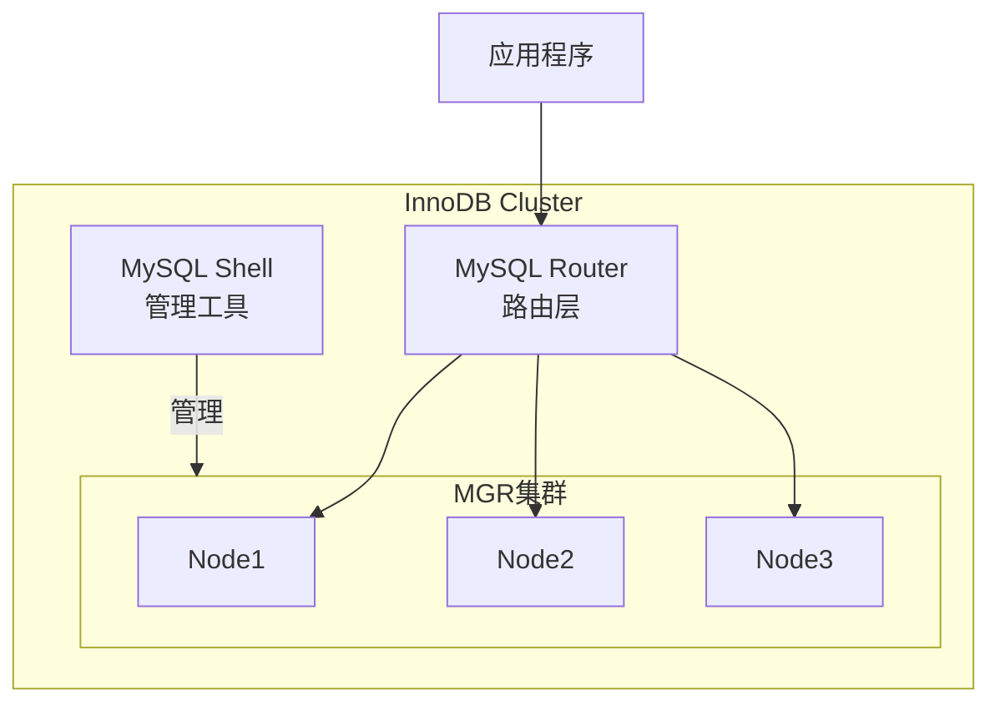

#### 3.3.2 核心组件

| 组件 | 作用 |
|------|------|
| **MySQL Server** | 数据库服务，启用 MGR 插件 |
| **MySQL Router** | 应用层路由，自动故障转移 |
| **MySQL Shell** | 管理工具，集群配置与监控 |

#### 3.3.3 核心特性

| 特性 | 说明 |
|------|------|
| 一站式方案 | 集成 MGR + Router + Shell |
| 自动路由 | Router 自动识别主从节点 |
| 简化部署 | Shell 提供一键部署能力 |
| 可视化管理 | 支持集群状态监控 |

#### 3.3.4 与 MHA 对比

| 对比项 | InnoDB Cluster | MHA |
|--------|----------------|-----|
| 数据一致性 | 强一致（Paxos） | 最终一致 |
| 故障转移 | 秒级自动 | 10-30秒 |
| 部署复杂度 | 中等 | 较高 |
| 多主支持 | 支持 | 不支持 |
| 官方支持 | MySQL 官方 | 社区维护 |

---

## 四、分布式集群方案

### 4.1 NDB Cluster 架构

#### 4.1.1 架构概述

MySQL NDB Cluster 是 MySQL 的高可用、高冗余分布式数据库集群，采用 Shared-Nothing 架构。

**什么是 Shared-Nothing 架构？**

Shared-Nothing（无共享）架构是一种分布式系统架构，每个节点拥有独立的 CPU、内存和磁盘，节点之间不共享任何硬件资源。

| 特点 | 说明 |
|------|------|
| **独立资源** | 每个节点有独立的计算和存储资源 |
| **无单点故障** | 没有共享组件，任一节点故障不影响整体 |
| **水平扩展** | 通过增加节点线性扩展性能 |
| **高可用** | 数据多副本存储，自动故障转移 |

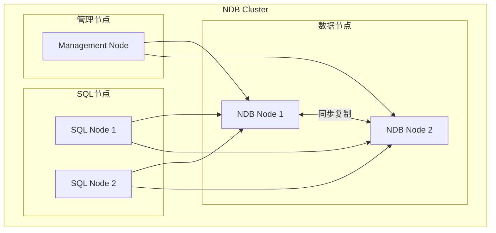

#### 4.1.2 节点类型

| 节点类型 | 作用 |
|----------|------|
| **SQL 节点** | 处理 SQL 查询，访问数据节点 |
| **数据节点（NDB）** | 存储数据，同步复制到其他数据节点 |
| **管理节点** | 集群配置管理、监控 |

#### 4.1.3 核心特性

| 特性 | 说明 |
|------|------|
| Shared-Nothing | 无共享架构，无单点故障 |
| 同步复制 | 数据实时同步到多个数据节点 |
| 自动分片 | 数据自动分区存储 |
| 内存存储 | 表数据主要存储在内存中，支持磁盘存储 |
| 99.999% 可用性 | 支持节点故障自动恢复 |

**关于内存存储**：

NDB Cluster 的 NDB 存储引擎是一种"内存优先"的存储引擎：

| 存储方式 | 说明 |
|----------|------|
| **内存表** | 表数据默认完全存储在内存中，通过检查点和日志持久化到磁盘 |
| **磁盘表** | 可配置将非索引数据存储在磁盘上，索引仍在内存中 |
| **持久化** | 内存数据通过定期检查点写入磁盘，保证数据持久性 |

#### 4.1.4 适用场景

| 适用 | 不适用 |
|------|--------|
| 电信级高可用 | 大事务处理 |
| 实时系统 | 复杂关联查询 |
| 高并发读写 | 数据仓库 |

### 4.2 PXC / Galera Cluster 架构

#### 4.2.1 架构概述

PXC（Percona XtraDB Cluster）是基于 Galera 的多主同步复制集群。

**背景说明**：

| 项目 | 说明 |
|------|------|
| **Galera** | 由 Codership 公司开发的同步复制库，提供认证复制机制 |
| **PXC** | Percona 公司基于 Galera 的 MySQL 发行版，集成 XtraDB 存储引擎 |
| **MariaDB Galera Cluster** | MariaDB 集成 Galera 的版本 |

后两者都基于 Galera 同步复制库，核心机制相同，区别在于发行方和部分特性。

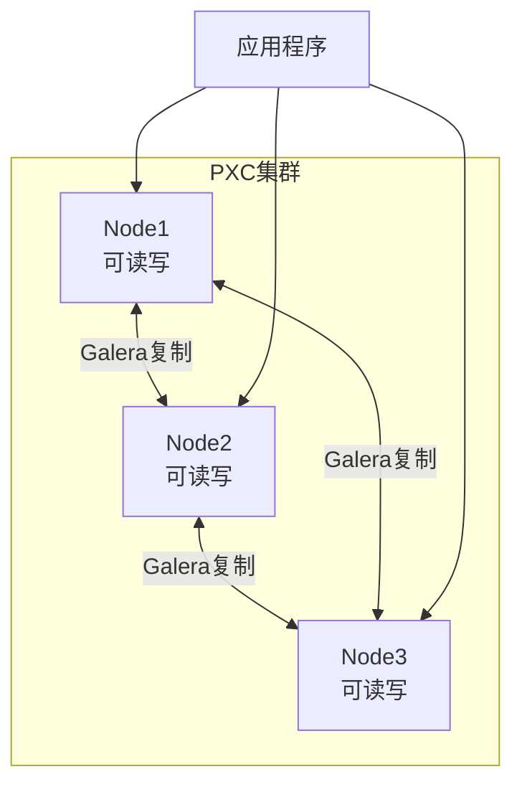

#### 4.2.2 核心原理

**认证复制（Certification-Based Replication）** 是 Galera 的核心机制，采用乐观并发控制策略，事务先在本地执行，提交时再进行全局冲突检测。

**核心概念**：

| 概念 | 说明 |
|------|------|
| **写集（Write Set）** | 事务修改的数据集合，包含修改的行主键、前后值等信息 |
| **全局序列号（GTID）** | 每个事务的全局唯一序号，用于全局排序和认证 |
| **认证（Certification）** | 基于主键检测事务是否与其他事务存在冲突 |
| **总序（Total Order）** | 所有节点以相同顺序处理事务 |

**事务执行四阶段**：

| 阶段 | 名称 | 操作 |
|------|------|------|
| 1 | 本地执行阶段 | 事务在本地节点执行，但不提交 |
| 2 | 发送阶段 | 将写集广播到所有节点（包括自身） |
| 3 | 认证阶段 | 所有节点进行冲突检测 |
| 4 | 写入阶段 | 认证通过则提交，否则回滚 |

**详细流程图**：

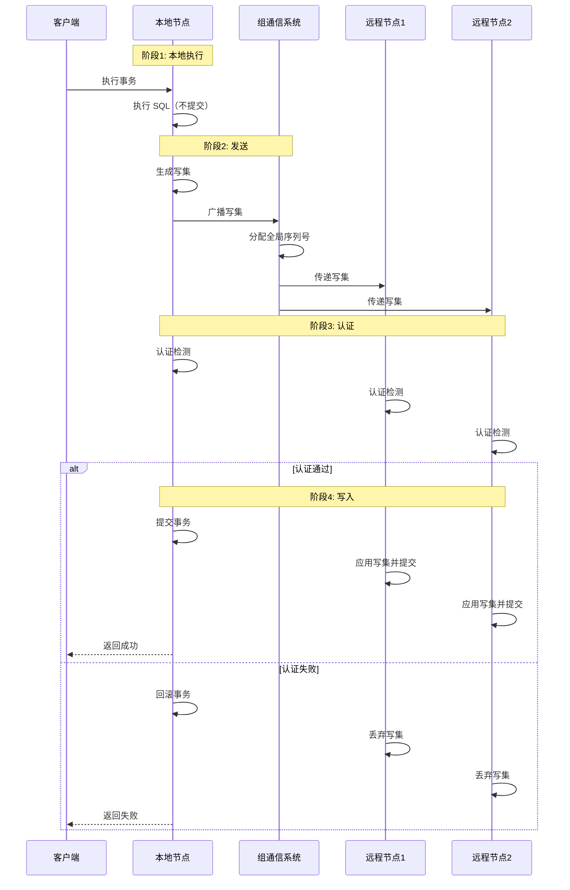

**各阶段详细说明**：

**阶段1 - 本地执行**：

| 操作 | 说明 |
|------|------|
| 客户端发起事务 | 连接到任意节点执行 SQL |
| 本地执行 | 事务在本地执行，修改数据但不提交 |
| 乐观策略 | 假设没有冲突，先执行后验证 |

**阶段2 - 发送**：

| 操作 | 说明 |
|------|------|
| 生成写集 | 将事务修改封装为写集，包含行主键和修改内容 |
| 广播写集 | 通过组通信系统广播到所有节点 |
| 分配序列号 | 组通信系统分配全局唯一序列号 |

**阶段3 - 认证**：

| 操作 | 说明 |
|------|------|
| 全局排序 | 所有节点按序列号对写集排序 |
| 冲突检测 | 检查写集主键是否与认证队列中的事务冲突 |
| 认证规则 | 修改相同行则冲突，先到的获胜，后到的失败 |

**阶段4 - 写入**：

| 节点 | 认证通过 | 认证失败 |
|------|----------|----------|
| 本地节点 | 提交事务，返回成功 | 回滚事务，返回失败 |
| 远程节点 | 应用写集，提交事务 | 丢弃写集 |

> **说明**：本地节点事务已执行，只需提交；远程节点需要先应用写集（执行数据修改），再提交。

**全局排序机制**：

Galera 通过**组通信系统**实现全局排序，保证所有节点以相同顺序处理事务。

| 特性 | 说明 |
|------|------|
| 原子广播 | 写集要么传给所有节点，要么都不传 |
| 全序一致性 | 所有节点接收相同顺序的消息 |
| 组维护 | 每个节点知道所有节点的状态 |

**GCache 与状态同步**：

GCache 是每个节点本地存储的写集缓存，与认证队列协同工作。

| 组件 | 存储位置 | 作用 | 生命周期 |
|------|----------|------|----------|
| **认证队列** | 内存 | 临时存放待认证的写集 | 认证完成后释放 |
| **GCache** | 磁盘 | 持久化存储已认证的写集 | 环形缓冲区，旧数据可被覆盖 |

**写集流转过程**：

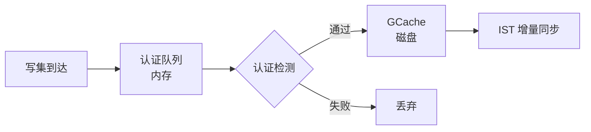

| 特性 | 说明 |
|------|------|
| GCache 存储位置 | 每个节点本地磁盘 |
| GCache 存储内容 | 已认证事务的写集 |
| GCache 默认大小 | 128MB（可通过 `gcache.size` 配置） |
| GCache 作用 | 支持 IST 增量同步，节点恢复时补齐数据 |

**状态同步方式**：

| 方式 | 全称 | 说明 | 适用场景 |
|------|------|------|----------|
| **SST** | State Snapshot Transfer | 全量同步，传输完整数据 | 新节点加入 |
| **IST** | Incremental State Transfer | 增量同步，从 GCache 传输缺失写集 | 节点短暂离线后重新加入，缺失事务在 GCache 范围内 |

> IST 依赖 DONOR 节点的 GCache 包含缺失的事务，否则降级为 SST。

**DONOR 与 JOINER 角色**：

| 角色 | 说明 |
|------|------|
| **JOINER** | 请求加入集群的节点，需要同步数据 |
| **DONOR** | 向 JOINER 提供数据的节点 |

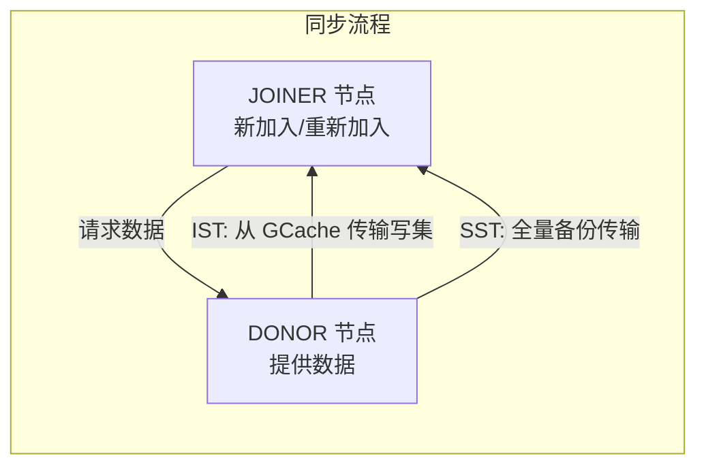

**DONOR 选择机制**：

| 同步方式 | DONOR 选择 |
|----------|-----------|
| IST 增量同步 | 选择 GCache 包含缺失事务的节点 |
| SST 全量同步 | 可选择任意健康节点，或通过 `wsrep_sst_donor` 指定 |

#### 4.2.3 核心特性

| 特性 | 说明 |
|------|------|
| 真正多主 | 所有节点可同时读写 |
| 同步复制 | 数据零丢失 |
| 自动节点管理 | 新节点自动同步数据 |
| 强一致性 | 基于 Galera 认证机制 |

#### 4.2.4 限制条件

| 限制 | 说明 |
|------|------|
| 仅支持 InnoDB | 其他存储引擎不支持 |
| 必须有主键 | 无主键表无法复制 |
| 不支持表级锁 | LOCK TABLES 不支持 |
| 不支持 XA 事务 | 分布式事务不支持 |
| 网络敏感 | 节点间延迟需 < 5ms |

#### 4.2.5 与 MGR 对比

| 对比项 | PXC / Galera Cluster | MGR |
|--------|---------------------|-----|
| 一致性协议 | 认证复制（Certification-Based） | Paxos 共识协议 |
| 确认机制 | 全节点确认 | 多数节点确认 |
| 认证时机 | 全局排序后立即认证 | Paxos 共识后认证 |
| 写集存储 | GCache | Binlog |
| 性能特点 | 网络敏感，延迟影响大 | 相对稳定 |
| 官方支持 | Percona/MariaDB | MySQL 官方 |

---

## 五、方案选型对比

### 5.1 综合对比

| 方案 | 一致性 | 可用性 | 复杂度 | 性能 | 适用场景 |
|------|--------|--------|--------|------|----------|
| 主从复制 | 弱 | 中 | 低 | 高 | 读写分离 |
| 主从复制+VIP | 弱 | 中 | 低 | 高 | 简单高可用 |
| MHA | 弱 | 高 | 中 | 高 | 传统高可用 |
| MGR | 强 | 高 | 中 | 中 | 现代高可用 |
| InnoDB Cluster | 强 | 高 | 中 | 中 | 企业级应用 |
| NDB Cluster | 强 | 极高 | 高 | 中 | 电信/实时系统 |
| PXC / Galera Cluster | 强 | 高 | 中 | 中 | 多主写入 |

### 5.2 选型决策树

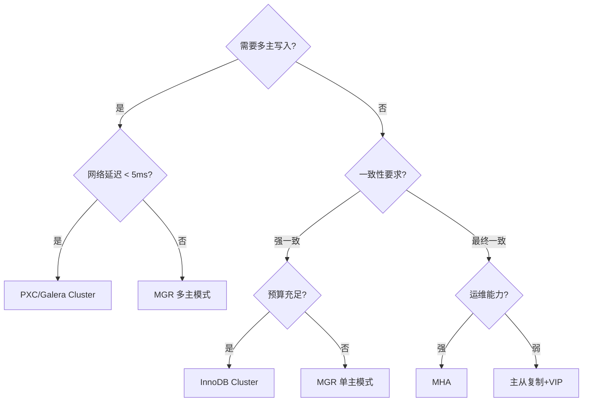

### 5.3 推荐场景

| 业务场景 | 推荐方案 | 理由 |
|----------|----------|------|
| 中小业务 | 主从复制+VIP | 简单、成本低 |
| 核心业务 | InnoDB Cluster | 官方支持、强一致 |
| 金融交易 | MGR + 半同步 | 数据零丢失 |
| 电信级系统 | NDB Cluster | 极高可用性 |
| 多地写入 | PXC / Galera Cluster | 真正多主 |

---

## 六、最佳实践

### 6.1 集群规模建议

| 方案 | 最小节点 | 推荐节点 | 说明 |
|------|----------|----------|------|
| 主从复制 | 1主1从 | 1主2从 | 从库数量根据读压力决定 |
| MHA | 1主2从 | 1主3从 | 至少2从保证切换可靠性 |
| MGR | 3节点 | 3-5节点 | 奇数节点，保证选举 |
| PXC / Galera Cluster | 3节点 | 3-5节点 | 奇数节点，避免脑裂 |

### 6.2 网络要求

| 方案 | 网络延迟要求 | 带宽要求 |
|------|--------------|----------|
| 主从复制 | < 100ms | 低 |
| MHA | < 50ms | 中 |
| MGR | < 10ms | 中 |
| PXC / Galera Cluster | < 5ms | 高 |
| NDB Cluster | < 1ms | 极高 |

### 6.3 监控指标

| 指标 | 说明 | 告警阈值 |
|------|------|----------|
| 复制延迟 | 主从数据同步延迟 | > 1s |
| 节点状态 | 集群节点在线状态 | 节点离线 |
| 事务冲突率 | 写冲突比例 | > 1% |
| 网络延迟 | 节点间通信延迟 | > 阈值 |

---

## 七、总结

MySQL 集群架构选型需要综合考虑业务需求、技术能力、成本预算等因素：

1. **简单场景**：主从复制 + VIP 即可满足基本高可用需求
2. **企业核心业务**：推荐 InnoDB Cluster，官方支持、生态完善
3. **强一致性要求**：MGR 或 PXC / Galera Cluster，根据网络条件选择
4. **极端高可用**：NDB Cluster，电信级可用性保障

选择合适的方案，配合规范的运维流程，才能构建稳定可靠的 MySQL 集群架构。
