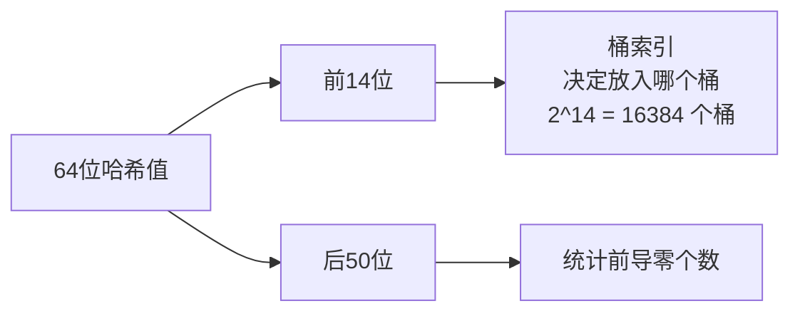

# Redis HyperLogLog 详解

## 一、概述

HyperLogLog 是一种**概率数据结构**，用于估算集合的基数（Cardinality，即不重复元素的数量）。

### 核心特点

| 特性 | 说明 |
|------|------|
| 内存占用 | 固定 12 KB（最多） |
| 标准误差 | 约 0.81% |
| 最大基数 | 2^64 ≈ 1.84 × 10^19 |
| 精确度 | 概率估算，非精确值 |

### 与 Set 对比

| 数据类型 | 最大元素数 | 内存占用 | 精确度 |
|----------|-----------|----------|--------|
| Set | 2^32 - 1（约 42 亿） | O(N)，随元素数增长 | 100% 精确 |
| HyperLogLog | 2^64（约 1844 亿亿） | 固定 12 KB | 约 99.19% 精确 |

---

## 二、命名由来

HyperLogLog 相关命令以 **PF** 为前缀，是为了纪念算法发明人 **Philippe Flajolet** 教授（1948-2011）。

### 算法演进历史

| 年份 | 算法 | 贡献者 |
|------|------|--------|
| 1985 | Probabilistic Counting | Flajolet & Martin |
| 2003 | LogLog | Durand & Flajolet |
| 2007 | **HyperLogLog** | Flajolet et al. |

---

## 三、基本命令

### 3.1 PFADD - 添加元素

```bash
PFADD key element [element ...]
```

**功能**：向 HyperLogLog 添加一个或多个元素。

**返回值**：
- `1`：至少有一个内部寄存器被修改（新元素影响基数）
- `0`：所有元素已存在，不影响基数估算

**时间复杂度**：O(1)

**示例**：

```bash
> PFADD uv:20240101 user1 user2 user3
(integer) 1

> PFADD uv:20240101 user1 user2
(integer) 0
```

### 3.2 PFCOUNT - 获取基数

```bash
PFCOUNT key [key ...]
```

**功能**：返回 HyperLogLog 的基数估算值。

**返回值**：估算的不重复元素数量

**时间复杂度**：O(1) 单 key，O(N) 多 key

**示例**：

```bash
> PFADD page:views user1 user2 user3 user1 user2
(integer) 1

> PFCOUNT page:views
(integer) 3
```

**多 key 合并统计**：

```bash
> PFADD uv:mon user1 user2 user3
(integer) 1

> PFADD uv:tue user2 user3 user4
(integer) 1

> PFCOUNT uv:mon uv:tue
(integer) 4
```

### 3.3 PFMERGE - 合并 HyperLogLog

```bash
PFMERGE destkey sourcekey [sourcekey ...]
```

**功能**：将多个 HyperLogLog 合并为一个。

**返回值**：`OK`

**时间复杂度**：O(N)，N 为源 key 数量

**示例**：

```bash
> PFADD daily:20240101 user1 user2 user3
(integer) 1

> PFADD daily:20240102 user2 user3 user4
(integer) 1

> PFMERGE weekly:2024w1 daily:20240101 daily:20240102
OK

> PFCOUNT weekly:2024w1
(integer) 4
```

---

## 四、算法原理（易懂版）

### 4.1 核心思想

HyperLogLog **不存储元素本身**，而是通过数学方法**估算**元素数量。

**类比理解**：

> 想象你要统计体育馆里有多少人。
> - **精确统计**：记录每个人的身份证号 → 内存 O(N)
> - **HyperLogLog**：观察"最罕见事件"的出现频率来反推总数 → 内存 O(1)

### 4.2 抛硬币实验

假设我们进行多轮抛硬币实验，每轮持续抛直到出现反面为止，记录**开头连续正面的次数**：

```
第1轮: 正正反 → 开头连续 2 个正面
第2轮: 反 → 开头连续 0 个正面
第3轮: 正正正正反 → 开头连续 4 个正面
第4轮: 正反 → 开头连续 1 个正面
...
```

**关键观察**：

- 开头连续出现 k 个正面的概率是 1/2^(k+1)
- 开头连续出现 ≥ k 个正面的概率是 1/2^k

**反推总数**：

如果我们观察到最大的开头连续正面数是 10，说明：

$$N \times \frac{1}{2^{10}} \approx 1 \Rightarrow N \approx 2^{10} = 1024$$

即大约进行了 **1024 轮**实验。

这就是 HyperLogLog 的核心思想：**通过观察"最极端情况"来反推总次数**。

### 4.3 处理流程

```
输入元素 → 哈希函数 → 64位二进制串 → 分桶统计 → 基数估算
```

#### 步骤一：哈希映射

每个元素通过哈希函数映射为 **64 位二进制串**：

```
元素 "user123" → 哈希 → 00010110 01001001 ... (64位)
```

#### 步骤二：分桶

将 64 位哈希值分成两部分：



- **前 14 位**：决定放入哪个桶（2^14 = 16384 个桶）
- **后 50 位**：统计前导零的个数

#### 步骤三：记录最大前导零

每个桶只记录**该桶见过的最大前导零的个数**：

```
哈希值: 00010110... → 前导零 = 3
哈希值: 00000101... → 前导零 = 5  ← 更新桶的值
哈希值: 00100011... → 前导零 = 2  ← 不更新
```

#### 步骤四：估算基数

通过所有桶的统计值，使用调和平均数计算基数估算值。

---

## 五、数学推导（严谨版）

### 5.1 前导零概率分布

#### 基本假设

哈希函数将元素映射为**均匀分布**的二进制串，每一位是 0 或 1 的概率各为 1/2。

#### 前导零 = k 的概率

前导零 = k 意味着：前 k 位是 0，第 k+1 位是 1。

$$P(\text{前导零} = k) = \left(\frac{1}{2}\right)^k \times \frac{1}{2} = \frac{1}{2^{k+1}}$$

#### 前导零 ≥ k 的概率

前导零 ≥ k 意味着：前 k 位都是 0。

$$P(\text{前导零} \geq k) = \left(\frac{1}{2}\right)^k = \frac{1}{2^k}$$

#### 概率分布表

| 前导零个数 k | 二进制模式 | 概率 |
|-------------|-----------|------|
| 0 | `1xxx...` | 1/2 = 50% |
| 1 | `01xx...` | 1/4 = 25% |
| 2 | `001x...` | 1/8 = 12.5% |
| 3 | `0001...` | 1/16 = 6.25% |
| k | k个0后跟1 | 1/2^(k+1) |

### 5.2 基数估算原理

#### 期望值推导

设数据集中有 N 个不同元素，每个元素产生一个随机哈希值。

期望看到前导零 ≥ k 的元素个数：

$$E(\text{前导零} \geq k) = N \times P(\text{前导零} \geq k) = N \times \frac{1}{2^k}$$

#### 临界点分析

设实际观察到的最大前导零为 k_max，这意味着：

1. **至少存在一个**前导零 = k_max 的元素
2. **不存在**前导零 > k_max 的元素

那么最大前导零 k_max 在期望上处于"存在"与"不存在"的临界点。

> **期望值与实际观察的关系**：
> - 期望值 E = N/2^k 表示"平均有多少个元素满足条件前导零 ≥ k"
> - **E ≥ 1**：期望至少有一个元素满足条件，实际观察中**很可能存在**
> - **E < 1**：期望不足一个元素满足条件，实际观察中**很可能不存在**
>
> **k_max 为什么是临界点**：
> - 观察到前导零 = k_max 的元素存在 → 说明 E(k_max) = N/2^k_max ≥ 1
> - 观察到前导零 > k_max 的元素不存在 → 说明 E(k_max+1) = N/2^(k_max+1) < 1
> - k_max 正好是期望值从 ≥ 1 变成 < 1 的转折点

**推导**：

对于 k = k_max，存在满足条件的元素，故期望值 ≥ 1：

$$N \times \frac{1}{2^{k_{max}}} \geq 1$$

对于 k = k_max + 1，不存在满足条件的元素，故期望值 < 1：

$$N \times \frac{1}{2^{k_{max}+1}} < 1$$

联立得：

$$2^{k_{max}} \leq N < 2^{k_{max}+1}$$

因此：

$$N \approx 2^{k_{max}}$$

**数值示例验证：**

假设 N = 1000 个元素：

| k | 期望值 E = N/2^k | 含义 |
|---|-----------------|------|
| 8 | 3.9 | 必然存在 |
| 9 | 1.95 | 很可能存在 |
| 10 | 0.98 | 临界点 |
| 11 | 0.49 | 很可能不存在 |

最大前导零 k_max 约为 9~10，反推 N ≈ 2^9 ~ 2^10 = 512 ~ 1024，与实际 N=1000 相近。

**结论**：最大前导零 k 可以反推基数 N ≈ 2^k

### 5.3 分桶与调和平均数

#### 为什么需要分桶？

单个桶的估算方差很大，使用 m 个桶可以：

1. 每个桶独立估算
2. 使用调和平均数合并结果
3. 降低方差，提高精度

#### HyperLogLog 估算公式

$$\hat{N} = \alpha_m \times m^2 \times \left(\sum_{j=1}^{m} 2^{-\rho_j}\right)^{-1}$$

其中：
- m = 桶数量（Redis 中 m = 16384）
- ρ_j = 第 j 个桶的最大前导零
- α_m = 修正因子

#### 修正因子 α_m

$$\alpha_m = \left(m \int_0^\infty \left(\log_2\left(\frac{2+u}{1+u}\right)\right)^m du\right)^{-1}$$

常用值：

| m | α_m |
|---|-----|
| 16 | 0.673 |
| 32 | 0.697 |
| 64 | 0.709 |
| ≥128 | 0.7213 / (1 + 1.079/m) |

### 5.4 误差分析

#### 标准误差公式

根据 Flajolet 等人的原始论文，HyperLogLog 的标准误差为：

$$\sigma = \frac{\beta_m}{\sqrt{m}}$$

其中 β_m 是一个常数，当 m 较大时 β_m ≈ 1.04。

#### Redis 的误差

Redis 使用 m = 16384 = 2^14：

$$\sigma = \frac{1.04}{\sqrt{16384}} = \frac{1.04}{128} \approx 0.81\%$$

**这就是 Redis HyperLogLog 0.81% 标准误差的由来。**

---

## 六、内存结构

### 6.1 内存计算

```
12 KB = 16384 桶 × 6 位/桶 ÷ 8 位/字节 ÷ 1024 字节/KB
      = 98304 位 ÷ 8 ÷ 1024
      = 12 KB
```

| 参数 | 值 | 说明 |
|------|-----|------|
| 桶数量 | 16384 (2^14) | 前 14 位决定桶索引 |
| 每桶位数 | 6 位 | 最大可记录 63 个前导零 |
| 总内存 | 12 KB | 固定大小（稠密模式） |

### 6.2 稀疏与稠密编码

Redis 对 HyperLogLog 进行了优化，使用两种编码方式：

#### 稀疏编码（Sparse）

- **适用场景**：基数较小（通常 < 3000）
- **原理**：使用行程编码压缩大量零值
- **优势**：内存占用远小于 12 KB

#### 稠密编码（Dense）

- **适用场景**：基数较大
- **原理**：固定 16384 × 6 位存储
- **内存**：固定 12 KB

#### 自动切换

Redis 会根据基数大小自动在两种编码间切换：

```
基数小 → 稀疏编码（节省内存）
基数增大 → 自动切换到稠密编码
```

### 6.3 内存布局

```
稠密编码内存布局：

+--------+--------+-----+--------+
| 110000 | 000111 | ... | 001011 |  # 每个桶6位
+--------+--------+-----+--------+
  桶0      桶1           桶16383
```

---

## 七、为什么 12 KB 能统计 2^64 个元素？

### 关键理解

HyperLogLog **不存储元素本身**，只存储"统计信息"。

### 数学解释

1. **哈希值是 64 位**：理论上可产生 2^64 种不同值
2. **每个桶记录的是"位置信息"**：6 位可记录 0-63 的前导零个数
3. **数学估算**：通过概率统计，而非精确存储

```
最大前导零 = 50 位（64 - 14）
估算基数上限 ≈ 2^50 × 16384 ≈ 2^64
```

### 类比理解

| 方法 | 存储内容 | 内存占用 |
|------|---------|---------|
| 精确统计（Set） | 记录每个元素的值 | O(N) |
| HyperLogLog | 记录"最极端情况"的位置 | O(1) |

---

## 八、应用场景

### 8.1 网站 UV 统计

```bash
# 统计每日独立访客
PFADD uv:20240101 user_ip_1
PFADD uv:20240101 user_ip_2
PFADD uv:20240101 user_ip_1  # 重复添加不影响

PFCOUNT uv:20240101  # 获取当日 UV
```

### 8.2 页面访问统计

```bash
# 统计页面独立访客
PFADD page:home user1
PFADD page:home user2
PFADD page:product:123 user1 user3

PFCOUNT page:home         # 首页 UV
PFCOUNT page:product:123  # 商品页 UV
```

### 8.3 周/月统计

```bash
# 合并每日数据得到周统计
PFMERGE uv:week:2024w1 uv:20240101 uv:20240102 ... uv:20240107
PFCOUNT uv:week:2024w1
```

### 8.4 搜索词统计

```bash
# 统计不同搜索词数量
PFADD search:terms "redis tutorial"
PFADD search:terms "mysql optimization"
PFADD search:terms "redis tutorial"  # 重复

PFCOUNT search:terms  # 独立搜索词数量
```

### 8.5 适用场景总结

| 场景 | 说明 |
|------|------|
| UV 统计 | 页面独立访客数 |
| IP 统计 | 独立 IP 数量 |
| 搜索词统计 | 不同搜索词数量 |
| 在线用户统计 | 独立用户数 |

### 8.6 不适用场景

| 场景 | 原因 |
|------|------|
| 需要精确值 | HyperLogLog 是概率估算 |
| 需要知道具体元素 | HyperLogLog 不存储元素内容 |
| 小数据量 | 小数据量用 Set 更合适 |

---

## 九、与其他方案对比

### 9.1 算法对比

| 算法 | 内存占用 | 误差率 | 精确 | 可合并 |
|------|---------|--------|------|--------|
| HashSet | O(N) | 0% | 是 | 否 |
| Linear Counting | O(N) | 可变 | 否 | 是 |
| LogLog | O(log log N) | 1.3/√m | 否 | 是 |
| **HyperLogLog** | O(log log N) | 0.81% | 否 | 是 |

### 9.2 Redis 数据类型对比

| 方案 | 内存 | 精确度 | 适用场景 |
|------|------|--------|---------|
| Set | O(N) | 100% | 小数据量，需要精确值 |
| Bitmap | O(最大ID/8) | 100% | 用户 ID 连续且已知范围 |
| HyperLogLog | 12 KB | ~99% | 大数据量，允许误差 |

### 9.3 选择建议

```
数据量 < 1万 且需要精确值 → Set
用户 ID 连续且范围已知 → Bitmap
数据量大且允许误差 → HyperLogLog
```

---

## 十、注意事项

### 10.1 误差特性

- 标准误差约 0.81%
- 误差是**概率性的**，不是固定偏差
- 对于大数据量，误差影响可忽略

### 10.2 内存特性

- 最大 12 KB，但小基数时更少（稀疏编码）
- 内存占用与元素数量无关
- 合并操作会触发稠密编码

### 10.3 使用限制

- 无法获取具体元素列表
- 无法删除单个元素
- 不适合小数据量精确统计

### 10.4 最佳实践

```bash
# 1. 合理设置 key 命名
PFADD uv:page:{page_id}:{date} {user_id}

# 2. 定期合并统计数据
PFMERGE uv:month:202401 uv:20240101 ... uv:20240131

# 3. 设置过期时间（如需要）
EXPIRE uv:20240101 86400  # 1天后过期
```

---

## 十一、总结

| 问题 | 答案 |
|------|------|
| 什么是 HyperLogLog？ | 概率数据结构，用于估算集合基数 |
| 为什么内存固定？ | 只存储 16384 个桶的最大前导零值 |
| 为什么能估算基数？ | 基于概率论：前导零个数与元素数量成对数关系 |
| 为什么是 12 KB？ | 16384 × 6 位 = 12 KB |
| 为什么支持 2^64？ | 64 位哈希空间 + 数学估算 |
| 误差为什么是 0.81%？ | σ = 1.04/√16384 ≈ 0.81% |
| PF 命名由来？ | 纪念发明人 Philippe Flajolet |

HyperLogLog 是大数据时代基数统计的利器，以极小的内存代价实现了海量数据的近似统计，是 Redis 中最具代表性的概率数据结构。
