# Redis 缓存穿透、击穿、雪崩详解

## 一、问题概述

在使用 Redis 缓存的高并发系统中，缓存穿透、击穿、雪崩是三大经典问题，它们都会导致大量请求直接打到数据库，可能造成数据库崩溃、系统瘫痪。

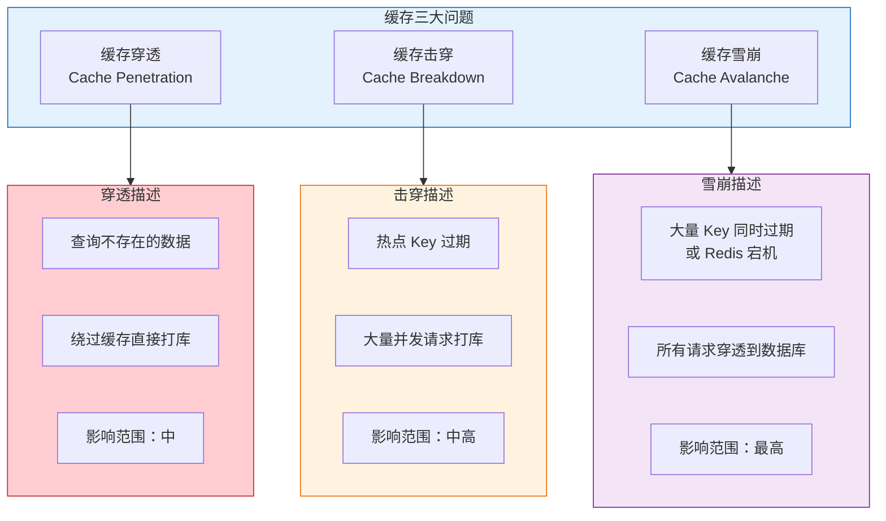

### 1.1 三大问题对比

| 问题       | 触发场景                  | 影响范围 | 核心特征      |
| -------- | --------------------- | ---- | --------- |
| **缓存穿透** | 查询根本不存在的数据            | 中    | 缓存和数据库都没有 |
| **缓存击穿** | 热点 Key 过期瞬间           | 中高   | 单点热点，高并发  |
| **缓存雪崩** | 大量 Key 同时过期或 Redis 宕机 | 最高   | 大面积失效     |

***

## 二、缓存穿透

### 2.1 问题场景

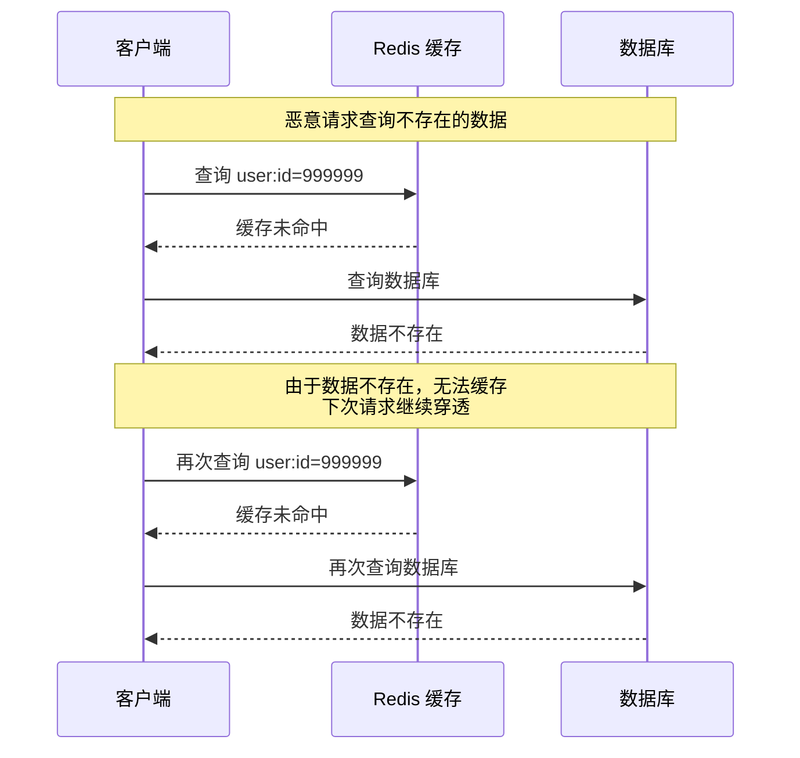

**缓存穿透的原因**：

| 原因 | 说明 |
| ---- | ------------------ |
| **恶意攻击** | 攻击者故意请求不存在的数据，绕过缓存 |
| **业务缺陷** | 业务逻辑错误，产生大量无效查询 |
| **数据删除** | 数据被删除后，请求仍访问已删除的数据（如已下架商品、已注销用户） |

### 2.2 解决方案

#### 方案一：缓存空值

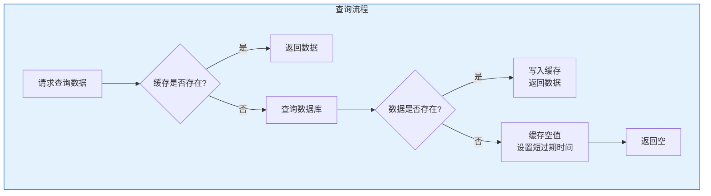

**代码示例**：

```java
public User getUserById(Long id) {
    String key = "user:" + id;
    String value = redis.get(key);
    
    if (value != null) {
        if ("NULL".equals(value)) {
            return null;
        }
        return JSON.parseObject(value, User.class);
    }
    
    User user = userMapper.selectById(id);
    
    if (user != null) {
        redis.set(key, JSON.toJSONString(user), 3600);
    } else {
        redis.set(key, "NULL", 300);
    }
    
    return user;
}
```

**优缺点**：

| 优点        | 缺点          |
| --------- | ----------- |
| 实现简单      | 占用额外内存      |
| 有效减少数据库压力 | 需要设置合理的过期时间 |
| <br />    | 可能存在数据不一致   |

#### 方案二：布隆过滤器

##### 什么是布隆过滤器

布隆过滤器（Bloom Filter）是一种空间效率很高的概率型数据结构，用于判断一个元素是否在一个集合中。它的特点是：

- **判断不存在**：100% 准确，元素一定不在集合中
- **判断存在**：可能误判，元素可能在集合中（假阳性）

##### 工作原理图解

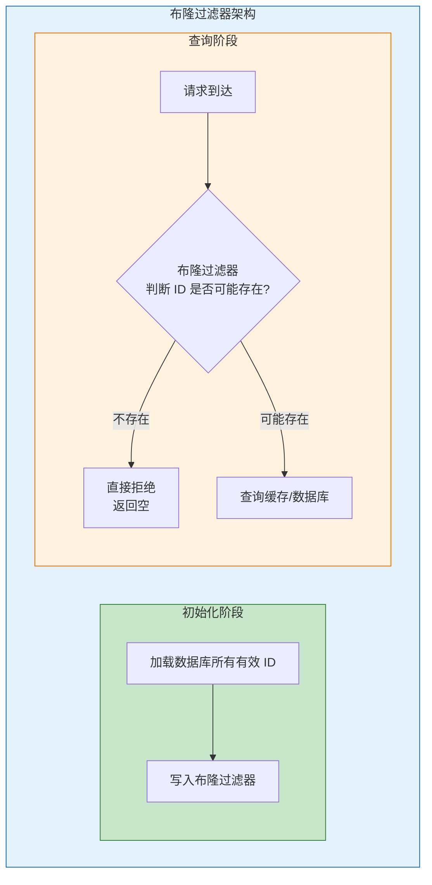

##### 存储过程详解

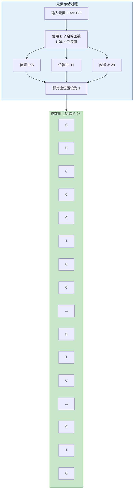

##### 查询过程详解

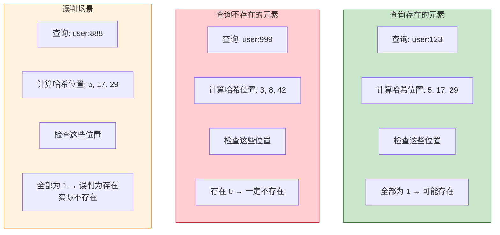

##### 为什么会有误判

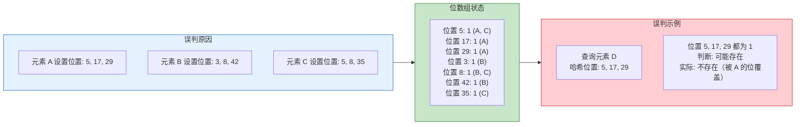

**误判原因总结**：
- 不同元素经过哈希函数计算后，可能得到相同的位置
- 当查询一个不存在的元素时，其所有哈希位置可能恰好都被其他元素设置为 1
- 这种"巧合"导致误判（假阳性）

##### 关键参数选择

| 参数 | 说明 | 影响 |
|------|------|------|
| **n** | 预期元素数量 | 过小会导致误判率升高 |
| **m** | 位数组大小（bit） | 越大误判率越低，但占用内存越多 |
| **k** | 哈希函数数量 | 过多影响性能，过少误判率高 |
| **p** | 期望误判率 | 越低需要越大的 m 和越多的 k |

**参数计算公式**：

```
最优哈希函数数量: k = (m/n) × ln(2)
最小位数组大小: m = -n × ln(p) / (ln(2))²
```

**实际选择建议**：

| 预期元素数量 | 期望误判率 | 建议位数组大小 | 建议哈希函数数 |
|--------------|------------|----------------|----------------|
| 100 万 | 1% | 9.6 Mbit (1.2 MB) | 7 |
| 100 万 | 0.1% | 14.4 Mbit (1.8 MB) | 10 |
| 1000 万 | 1% | 96 Mbit (12 MB) | 7 |
| 1000 万 | 0.1% | 144 Mbit (18 MB) | 10 |

##### 布隆过滤器特点总结

| 特性 | 说明 |
|------|------|
| **空间效率高** | 使用位数组，每个元素只需几个 bit |
| **查询速度快** | O(k) 时间复杂度，k 为哈希函数数量 |
| **插入速度快** | O(k) 时间复杂度 |
| **存在误判** | 可能判断存在但实际不存在（假阳性） |
| **不存在误判** | 判断不存在则一定不存在 |
| **不能删除** | 不支持删除元素（会影响其他元素） |

##### Redisson 实现示例：

```java
@Configuration
public class BloomFilterConfig {
    
    @Bean
    public RBloomFilter<Long> userBloomFilter(RedissonClient redisson) {
        RBloomFilter<Long> bloomFilter = redisson.getBloomFilter("user:bloom");
        bloomFilter.tryInit(1000000L, 0.01);
        return bloomFilter;
    }
}

@Service
public class UserService {
    
    @Autowired
    private RBloomFilter<Long> userBloomFilter;
    
    public User getUserById(Long id) {
        if (!userBloomFilter.contains(id)) {
            return null;
        }
        
        String key = "user:" + id;
        String value = redis.get(key);
        
        if (value != null) {
            return JSON.parseObject(value, User.class);
        }
        
        User user = userMapper.selectById(id);
        if (user != null) {
            redis.set(key, JSON.toJSONString(user), 3600);
        }
        
        return user;
    }
}
```

#### 方案三：接口层校验

```java
@GetMapping("/user/{id}")
public Result getUser(@PathVariable Long id) {
    if (id == null || id <= 0) {
        return Result.error("参数错误");
    }
    
    if (!isValidId(id)) {
        return Result.error("无效ID");
    }
    
    return Result.success(userService.getUserById(id));
}
```

### 2.3 方案对比

| 方案        | 优点        | 缺点         | 适用场景       |
| --------- | --------- | ---------- | ---------- |
| **缓存空值**  | 实现简单      | 占用内存、数据不一致 | 数据量小、穿透频率低 |
| **布隆过滤器** | 内存占用小、效率高 | 存在误判、需要预热  | 数据量大、穿透频率高 |
| **接口校验**  | 提前拦截      | 无法防止所有情况   | 参数校验、基础防护  |

***

## 三、缓存击穿

### 3.1 问题场景

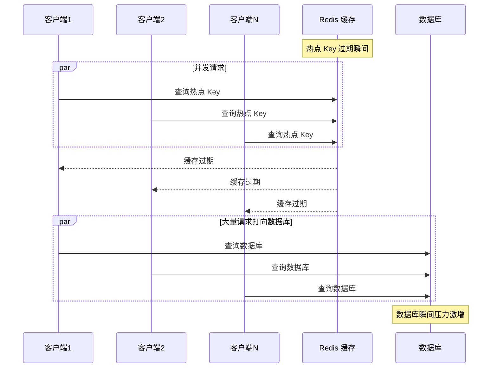

**缓存击穿的原因**：

| 原因         | 说明             |
| ---------- | -------------- |
| **热点数据过期** | 高频访问的 Key 恰好过期 |
| **缓存未命中**  | 大量并发请求同时发现缓存失效 |
| **无保护机制**  | 没有限制并发查询数据库    |

### 3.2 解决方案

#### 方案一：互斥锁（分布式锁）

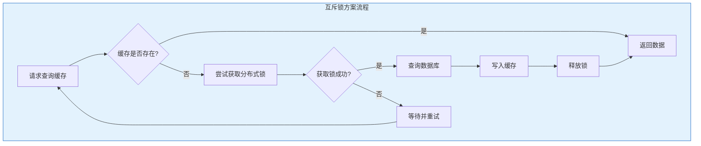

**代码示例**：

```java
public User getUserWithLock(Long id) {
    String key = "user:" + id;
    String lockKey = "lock:user:" + id;
    
    String value = redis.get(key);
    if (value != null) {
        return JSON.parseObject(value, User.class);
    }
    
    boolean locked = false;
    try {
        locked = redis.setnx(lockKey, "1", 10);
        if (locked) {
            User user = userMapper.selectById(id);
            if (user != null) {
                redis.set(key, JSON.toJSONString(user), 3600);
            }
            return user;
        } else {
            Thread.sleep(50);
            return getUserWithLock(id);
        }
    } catch (InterruptedException e) {
        Thread.currentThread().interrupt();
        return null;
    } finally {
        if (locked) {
            redis.del(lockKey);
        }
    }
}
```

**关键说明**：

| 问题 | 说明 |
|------|------|
| **为什么用 finally？** | 确保锁最终被释放，避免死锁 |
| **为什么判断 locked？** | 只有获取锁成功的线程才能释放锁 |
| **锁过期时间 10 秒** | 防止业务异常导致锁永不释放 |

**更安全的锁实现（Lua 脚本保证原子性）**：

```java
public User getUserWithSafeLock(Long id) {
    String key = "user:" + id;
    String lockKey = "lock:user:" + id;
    String lockValue = UUID.randomUUID().toString();
    
    String value = redis.get(key);
    if (value != null) {
        return JSON.parseObject(value, User.class);
    }
    
    boolean locked = false;
    try {
        locked = redis.setnx(lockKey, lockValue, 10);
        if (locked) {
            User user = userMapper.selectById(id);
            if (user != null) {
                redis.set(key, JSON.toJSONString(user), 3600);
            }
            return user;
        } else {
            Thread.sleep(50);
            return getUserWithSafeLock(id);
        }
    } catch (InterruptedException e) {
        Thread.currentThread().interrupt();
        return null;
    } finally {
        if (locked) {
            String script = "if redis.call('get', KEYS[1]) == ARGV[1] then " +
                           "return redis.call('del', KEYS[1]) " +
                           "else return 0 end";
            redis.eval(script, Arrays.asList(lockKey), Arrays.asList(lockValue));
        }
    }
}
```

**安全锁的关键点**：

| 要点 | 说明 |
|------|------|
| **锁值唯一性** | 使用 UUID 作为锁值，标识锁的持有者 |
| **Lua 脚本释放** | 保证"判断锁归属"和"删除锁"的原子性 |
| **防止误删** | 只删除自己持有的锁，避免删除其他线程的锁 |

**为什么需要 UUID 标识锁持有者？**

当线程执行时间超过锁过期时间时，锁会自动释放，其他线程可能获取锁。此时原线程执行完毕后释放锁，若不检查锁的归属，会误删其他线程的锁。

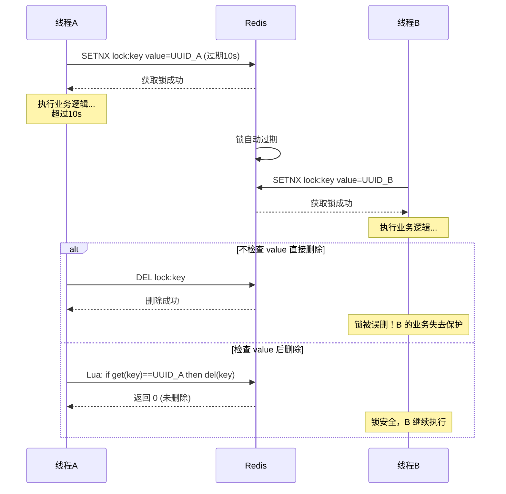

**误删场景示例**：

| 时间 | 线程A | 线程B | Redis 锁状态 |
|------|-------|-------|-------------|
| T1 | 获取锁，value=UUID_A | - | lock:key = UUID_A |
| T2 | 执行业务逻辑... | - | lock:key = UUID_A |
| T10 | (仍在执行) | - | 锁过期自动释放 |
| T11 | (仍在执行) | 获取锁，value=UUID_B | lock:key = UUID_B |
| T12 | 执行完毕，尝试释放锁 | 执行业务逻辑... | 若不检查value，锁被误删 |

**双重检测优化**：

```java
public User getUserWithDoubleCheck(Long id) {
    String key = "user:" + id;
    String lockKey = "lock:user:" + id;
    String lockValue = UUID.randomUUID().toString();
    
    String value = redis.get(key);
    if (value != null) {
        return JSON.parseObject(value, User.class);
    }
    
    int maxRetry = 10;
    for (int i = 0; i < maxRetry; i++) {
        boolean locked = redis.setnx(lockKey, lockValue, 10);
        if (locked) {
            try {
                value = redis.get(key);
                if (value != null) {
                    return JSON.parseObject(value, User.class);
                }
                
                User user = userMapper.selectById(id);
                if (user != null) {
                    redis.set(key, JSON.toJSONString(user), 3600);
                }
                return user;
            } finally {
                String script = "if redis.call('get', KEYS[1]) == ARGV[1] then " +
                               "return redis.call('del', KEYS[1]) " +
                               "else return 0 end";
                redis.eval(script, Arrays.asList(lockKey), Arrays.asList(lockValue));
            }
        }
        
        try {
            Thread.sleep(50);
        } catch (InterruptedException e) {
            Thread.currentThread().interrupt();
            return null;
        }
    }
    
    return null;
}
```

**循环模式的优势**：

| 优势 | 说明 |
|------|------|
| **避免栈溢出** | 无递归调用，不会 StackOverflowError |
| **可控重试次数** | 通过 maxRetry 限制最大重试次数 |
| **资源消耗低** | 无额外栈帧开销 |

#### 方案二：逻辑过期

##### 方案设计理念

逻辑过期方案的核心思想是：**热点数据永不过期，通过逻辑过期时间判断是否需要更新**。

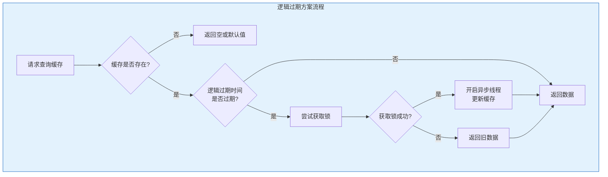

##### 为什么缓存不存在直接返回 null？

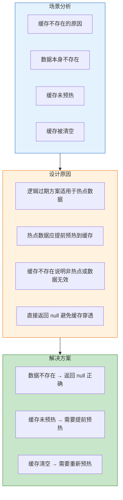

**关键说明**：

| 情况 | 原因 | 处理方式 |
|------|------|----------|
| **缓存不存在** | 数据本身不存在或未预热 | 直接返回 null（非热点数据） |
| **缓存存在但未过期** | 数据仍然有效 | 直接返回缓存数据 |
| **缓存存在但已过期** | 需要更新 | 返回旧数据 + 异步更新 |

##### 为什么获取不到锁返回旧数据？

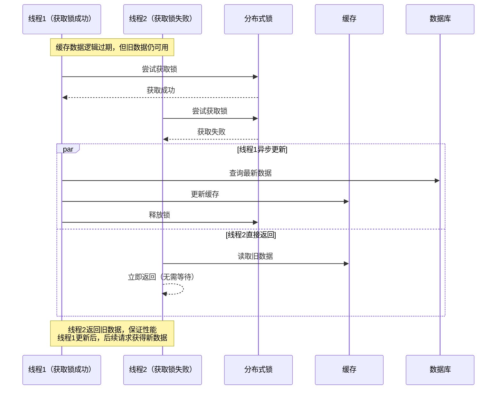

**返回旧数据的优势**：

| 优势 | 说明 |
|------|------|
| **无阻塞** | 用户不需要等待数据库查询和缓存更新 |
| **高性能** | 所有请求都能快速响应 |
| **最终一致** | 异步更新后，后续请求获得最新数据 |
| **避免击穿** | 不会大量请求打到数据库 |

**适用场景**：

| 场景 | 是否适用 | 原因 |
|------|----------|------|
| **热点数据** | 适用 | 数据已预热，缓存中始终存在 |
| **允许短暂过期** | 适用 | 可以接受返回稍旧的数据 |
| **高并发场景** | 适用 | 无阻塞，性能最优 |
| **强一致性要求** | 不适用 | 需要使用互斥锁方案 |

##### 数据结构设计：

```java
@Data
public class CacheData<T> {
    private T data;
    private Long expireTime;
}
```

**代码示例**：

```java
public User getUserWithLogicalExpire(Long id) {
    String key = "user:" + id;
    String lockKey = "lock:user:" + id;
    
    String value = redis.get(key);
    if (value == null) {
        return null;
    }
    
    CacheData<User> cacheData = JSON.parseObject(value, 
        new TypeReference<CacheData<User>>(){});
    
    if (cacheData.getExpireTime() > System.currentTimeMillis()) {
        return cacheData.getData();
    }
    
    if (redis.setnx(lockKey, "1", 10)) {
        executorService.submit(() -> {
            try {
                User user = userMapper.selectById(id);
                CacheData<User> newData = new CacheData<>();
                newData.setData(user);
                newData.setExpireTime(System.currentTimeMillis() + 3600000L);
                redis.set(key, JSON.toJSONString(newData));
            } finally {
                redis.del(lockKey);
            }
        });
    }
    
    return cacheData.getData();
}
```

#### 方案三：热点 Key 永不过期

```java
public void cacheHotData(Long id) {
    User user = userMapper.selectById(id);
    if (user != null) {
        redis.set("user:" + id, JSON.toJSONString(user));
    }
}

@Scheduled(fixedRate = 3600000)
public void refreshHotData() {
    List<Long> hotIds = getHotUserIds();
    for (Long id : hotIds) {
        cacheHotData(id);
    }
}
```

### 3.3 方案对比

| 方案       | 一致性  | 性能    | 复杂度 | 适用场景      |
| -------- | ---- | ----- | --- | --------- |
| **互斥锁**  | 强一致  | 有等待延迟 | 中   | 对一致性要求高   |
| **逻辑过期** | 最终一致 | 无阻塞   | 高   | 对性能要求高    |
| **永不过期** | 最终一致 | 最高    | 低   | 热点数据、定时更新 |

***

## 四、缓存雪崩

### 4.1 问题场景

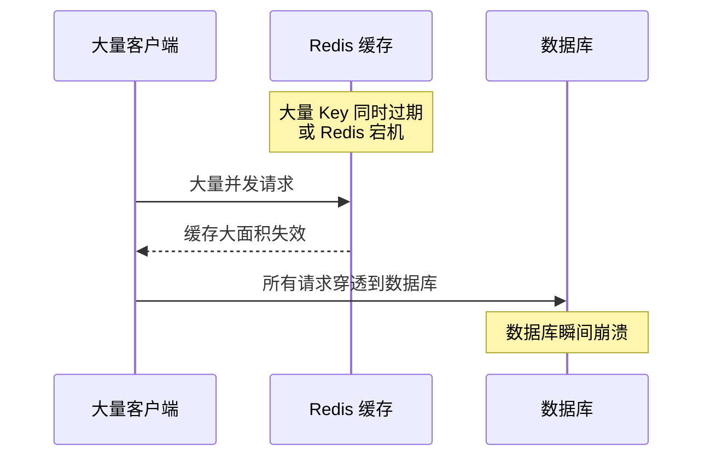

**缓存雪崩的原因**：

| 原因           | 说明                |
| ------------ | ----------------- |
| **同时过期**     | 大量 Key 设置了相同的过期时间 |
| **Redis 宕机** | Redis 服务故障，缓存不可用  |
| **缓存预热失败**   | 系统启动时缓存未预热        |

### 4.2 解决方案

#### 方案一：过期时间随机化

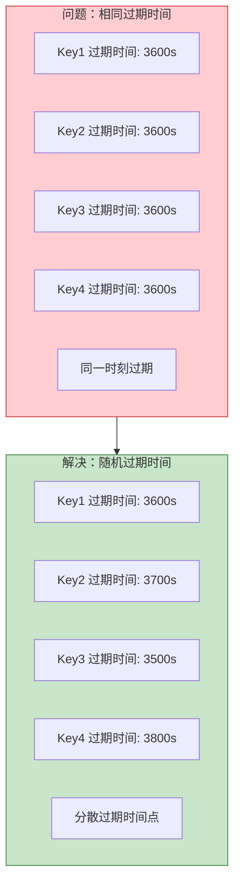

**代码示例**：

```java
public void setWithRandomExpire(String key, String value, long baseExpire) {
    Random random = new Random();
    long randomExpire = baseExpire + random.nextInt(600);
    redis.set(key, value, randomExpire);
}
```

#### 方案二：多级缓存

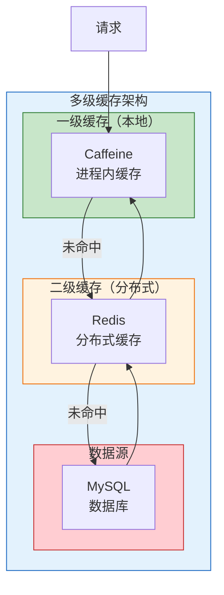

**Spring Cache + Caffeine + Redis 实现**：

##### Maven 依赖

```xml
<dependencies>
    <dependency>
        <groupId>org.springframework.boot</groupId>
        <artifactId>spring-boot-starter-cache</artifactId>
    </dependency>
    <dependency>
        <groupId>org.springframework.boot</groupId>
        <artifactId>spring-boot-starter-data-redis</artifactId>
    </dependency>
    <dependency>
        <groupId>com.github.ben-manes.caffeine</groupId>
        <artifactId>caffeine</artifactId>
    </dependency>
</dependencies>
```

##### 配置类实现

```java
@Configuration
@EnableCaching
public class CacheConfig {
    
    @Bean
    public CacheManager cacheManager(RedisConnectionFactory factory) {
        List<CacheManager> cacheManagers = new ArrayList<>();
        
        CaffeineCacheManager caffeineCacheManager = new CaffeineCacheManager();
        caffeineCacheManager.setCaffeine(Caffeine.newBuilder()
            .expireAfterWrite(300, TimeUnit.SECONDS)
            .maximumSize(1000));
        cacheManagers.add(caffeineCacheManager);
        
        RedisCacheConfiguration redisConfig = RedisCacheConfiguration.defaultCacheConfig()
            .entryTtl(Duration.ofSeconds(3600))
            .serializeKeysWith(RedisSerializationContext.SerializationPair
                .fromSerializer(new StringRedisSerializer()))
            .serializeValuesWith(RedisSerializationContext.SerializationPair
                .fromSerializer(new GenericJackson2JsonRedisSerializer()));
        
        RedisCacheManager redisCacheManager = RedisCacheManager.builder(factory)
            .cacheDefaults(redisConfig)
            .build();
        cacheManagers.add(redisCacheManager);
        
        return new CompositeCacheManager(cacheManagers.toArray(new CacheManager[0]));
    }
}
```

##### 使用示例

```java
@Service
public class UserService {
    
    @Cacheable(value = "user", key = "#id")
    public User getUserById(Long id) {
        return userMapper.selectById(id);
    }
    
    @CacheEvict(value = "user", key = "#id")
    public void updateUser(User user) {
        userMapper.updateById(user);
    }
}
```

##### 关键说明

| 组件 | 作用 | 说明 |
|------|------|------|
| **CompositeCacheManager** | 组合多个缓存管理器 | 按顺序查找：先查 Caffeine，再查 Redis |
| **CaffeineCacheManager** | 本地缓存管理器 | L1 缓存，速度快但容量有限 |
| **RedisCacheManager** | 分布式缓存管理器 | L2 缓存，支持分布式共享 |
| **@EnableCaching** | 启用缓存注解 | 必须添加才能使用 @Cacheable 等注解 |

##### 多级缓存工作流程

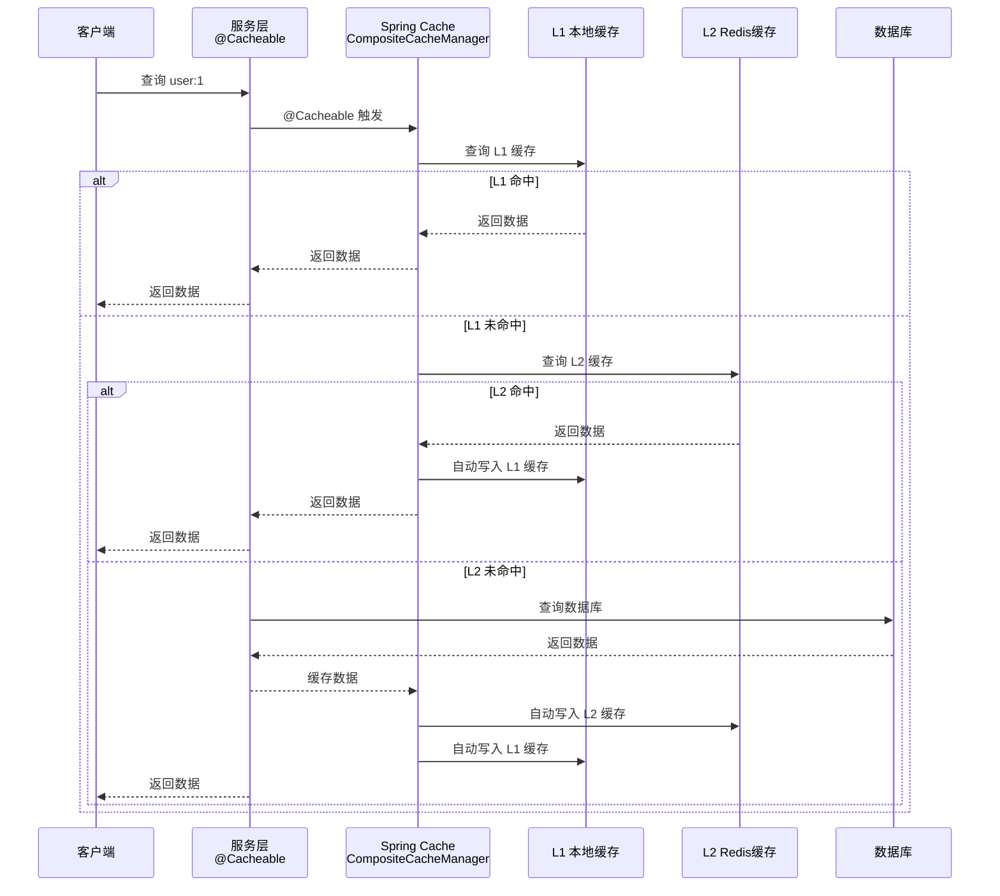

#### 方案三：熔断降级

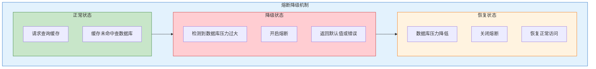

**Sentinel 熔断配置**：

```java
@Service
public class UserService {
    
    @SentinelResource(value = "getUserById", 
        blockHandler = "handleBlock",
        fallback = "handleFallback")
    public User getUserById(Long id) {
        return userMapper.selectById(id);
    }
    
    public User handleBlock(Long id, BlockException ex) {
        return getDefaultUser();
    }
    
    public User handleFallback(Long id, Throwable ex) {
        return getDefaultUser();
    }
    
    private User getDefaultUser() {
        User user = new User();
        user.setId(-1L);
        user.setName("默认用户");
        return user;
    }
}
```

#### 方案四：Redis 高可用

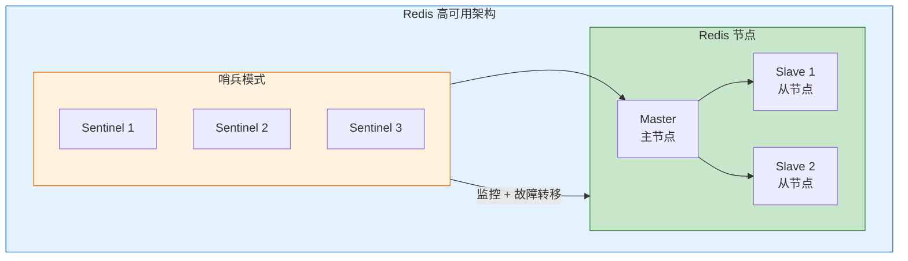

### 4.3 方案对比

| 方案            | 作用     | 优点     | 缺点            |
| ------------- | ------ | ------ | ------------- |
| **过期时间随机化**   | 防止同时过期 | 实现简单   | 无法防止 Redis 宕机 |
| **多级缓存**      | 多层保护   | 高可用    | 数据一致性复杂       |
| **熔断降级**      | 保护数据库  | 防止级联故障 | 用户体验下降        |
| **Redis 高可用** | 防止宕机   | 自动故障转移 | 架构复杂          |

***

## 五、综合对比与最佳实践

### 5.1 三大问题对比总结

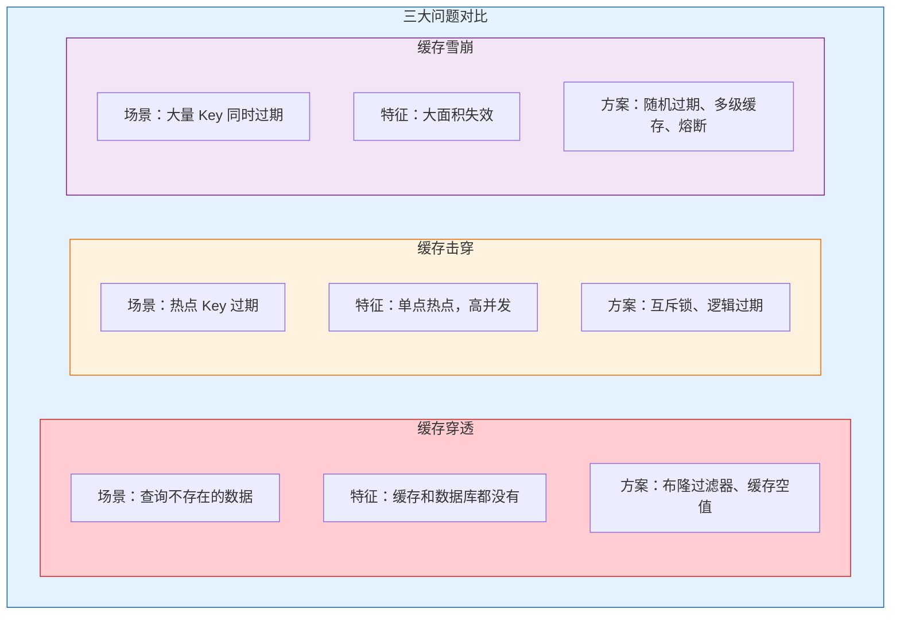

### 5.2 最佳实践

| 场景       | 推荐方案                  |
| -------- | --------------------- |
| **防止穿透** | 布隆过滤器 + 接口参数校验        |
| **防止击穿** | 互斥锁（强一致）或 逻辑过期（高性能）   |
| **防止雪崩** | 过期时间随机化 + 多级缓存 + 熔断降级 |
| **高可用**  | Redis 集群/哨兵 + 本地缓存兜底  |

### 5.3 面试高频问题

| 问题              | 答案要点                      |
| --------------- | ------------------------- |
| **三大问题区别**      | 穿透是数据不存在，击穿是热点过期，雪崩是大面积失效 |
| **布隆过滤器原理**     | 位数组 + 多哈希，存在误判但不会漏判       |
| **互斥锁 vs 逻辑过期** | 互斥锁强一致有阻塞，逻辑过期高性能最终一致     |
| **如何设计缓存**      | 多级缓存 + 随机过期 + 熔断降级 + 高可用  |

***

## 参考资料

- [Redis 缓存穿透、击穿、雪崩解决方案](https://blog.csdn.net/m0_73784704/article/details/152006873)
- [Redis 布隆过滤器原理与应用](https://blog.csdn.net/zhang_hao_chao/article/details/132219157)
- [Redis 缓存三大核心问题](https://blog.csdn.net/weixin_43290370/article/details/154689046)

