# SEO 搜索引擎优化详解

## 一、概述

### 1.1 什么是 SEO

**SEO（Search Engine Optimization，搜索引擎优化）** 是通过技术手段、内容策略与生态建设，提升网站在搜索引擎自然搜索结果中的可见度与排名，从而获取有针对性的免费流量（非付费流量）的过程。

**核心本质：** SEO 是网站在搜索引擎规则框架下，进行的一场关于**相关性、权威性与用户体验**的持续竞赛。它本质上是内容、技术、数据和用户行为之间的复杂优化。

### 1.2 SEO 的多层次目标

SEO 的目标远不止提高排名和流量：

| 目标层次 | 说明 |
|----------|------|
| **提高质量流量** | 吸引真正对产品或服务感兴趣的用户，而非泛流量 |
| **提升转化率** | 通过优化落地页和用户旅程，提高访客转化为客户的比率 |
| **建立品牌权威** | 在搜索结果中的持续曝光增强品牌认知度和信任度 |
| **提供卓越体验** | SEO 与用户体验密不可分，良好的 SEO 实践能显著改善用户满意度 |
| **数据驱动决策** | SEO 提供宝贵的用户行为数据，指导整体营销策略 |

### 1.3 SEO vs SEM

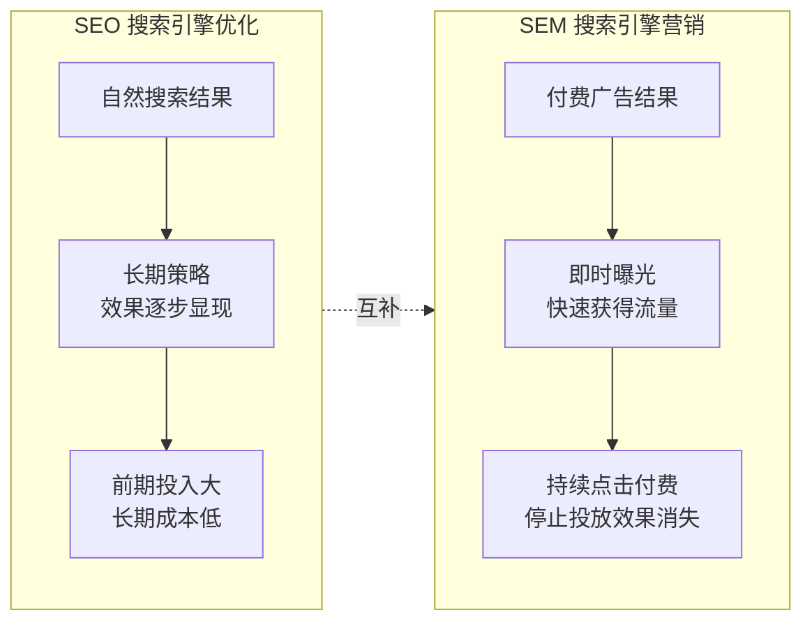

| 对比维度 | SEO（搜索引擎优化） | SEM（搜索引擎营销） |
|----------|---------------------|---------------------|
| **成本结构** | 前期投入大，长期成本低 | 持续的点击付费成本 |
| **时间框架** | 长期策略，效果逐步显现 | 可以迅速获得流量 |
| **可控性** | 受搜索引擎算法影响大 | 高度可控，可精确定位 |
| **信任度** | 用户通常更信任有机结果 | 部分用户可能忽视广告 |
| **长期效益** | 效果持久，积累品牌权威 | 停止投放后效果迅速消失 |

---

## 二、搜索引擎工作原理

### 2.1 搜索引擎三大核心组件

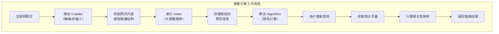

搜索引擎的三大核心组件协同工作，提供最相关的搜索结果：

| 组件 | 职责 | 说明 |
|------|------|------|
| **爬虫（Crawler）** | 发现和收集网页信息 | 也称为蜘蛛或机器人，如 Googlebot、Baiduspider |
| **索引（Index）** | 存储和组织网页信息 | 类似于巨大的数据库，存储网页的文本、链接、元数据等 |
| **算法（Algorithm）** | 决定页面排名 | 根据相关性、权威性等因素计算页面排序 |

### 2.2 搜索引擎运作三阶段

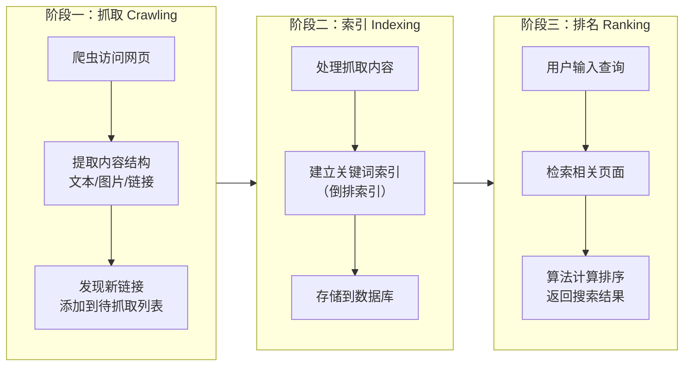

**详细说明：**

| 阶段 | 操作 | 说明 |
|------|------|------|
| **抓取（Crawling）** | 爬虫访问网页 | 从已知 URL 列表开始，分析页面内容和链接结构，将新发现的链接添加到待抓取列表 |
| **索引（Indexing）** | 建立索引 | 将抓取到的网页信息进行处理，建立关键词-文档映射关系（倒排索引），支持分词、同义词处理 |
| **排名（Ranking）** | 计算排序 | 根据算法（如 PageRank）计算网页与搜索查询的相关性并排序 |

### 2.3 爬虫工作原理

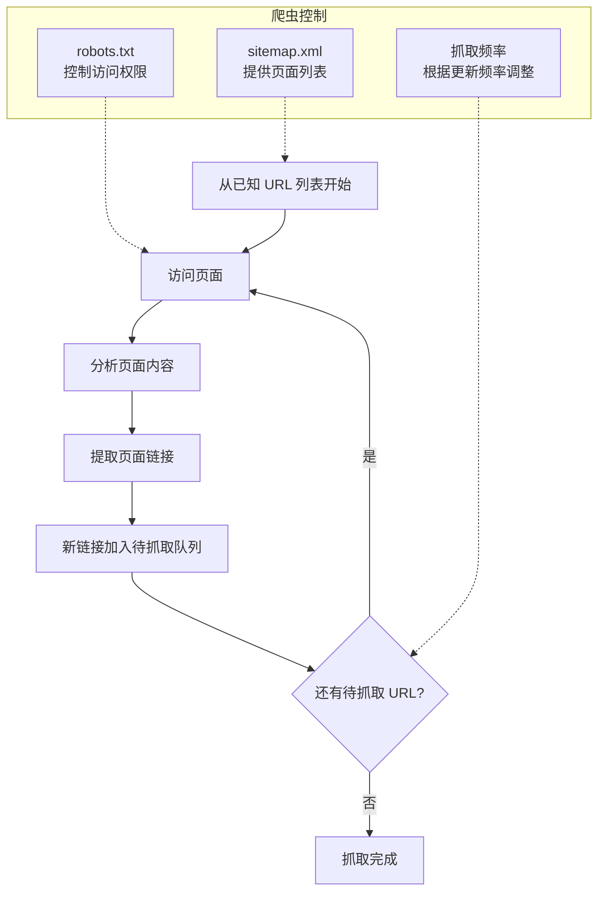

**爬虫控制机制：**

| 机制 | 说明 | 示例 |
|------|------|------|
| **robots.txt** | 控制爬虫访问权限，指定哪些页面可以/不可以抓取 | `Disallow: /admin/` 禁止爬虫访问管理目录 |
| **sitemap.xml** | 提供网站页面列表，帮助爬虫快速发现页面 | XML 格式列出所有重要页面 URL |
| **抓取频率** | 根据网站更新频率自动调整，新闻类站点抓取更频繁 | 新闻站点日抓取 3-5 次，静态页面间隔 72 小时 |

### 2.4 网站收录与排名

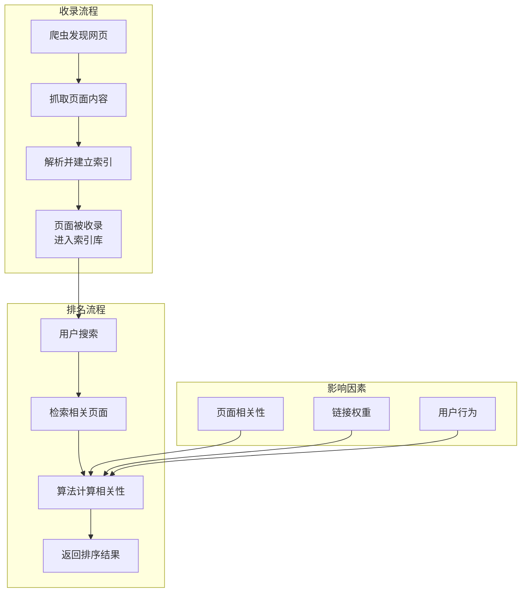

**页面权重计算公式：**

```
页面权重值 = 页面相关性值 + 链接权重值 + 用户行为得分
```

| 因素 | 说明 |
|------|------|
| **页面相关性** | 页面内容与搜索关键词的匹配程度 |
| **链接权重** | 外部链接（Backlinks）的数量和质量 |
| **用户行为** | 用户点击率、停留时间、跳出率等 |

---

## 三、SEO 三大核心支柱

现代 SEO 建立在三个相互关联的支柱之上：

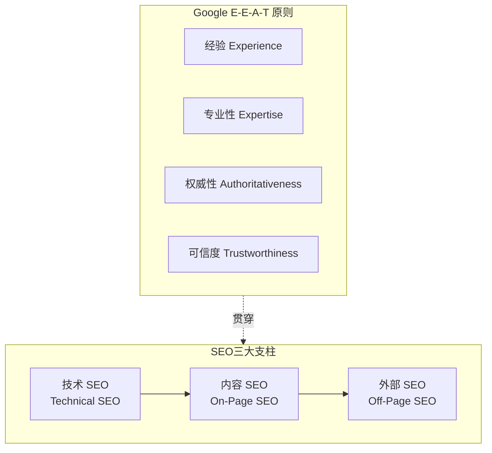

### 3.1 技术 SEO（Technical SEO）

**目标：** 确保网站技术架构符合搜索引擎爬虫的抓取规则，提升搜索引擎友好度。

| 优化方向 | 具体措施 |
|----------|----------|
| **网站结构** | 清晰的导航结构、扁平化层级（任何页面距首页 ≤3 次点击） |
| **URL 设计** | 静态化 URL、包含关键词、可读性强 |
| **爬虫控制** | robots.txt 配置、sitemap.xml 提交 |
| **页面性能** | 加载速度优化、Core Web Vitals 达标 |
| **移动端优化** | 响应式设计、移动优先索引适配 |
| **结构化数据** | Schema Markup 标注，提升富媒体摘要展示 |

### 3.2 内容 SEO（On-Page SEO）

**目标：** 优化页面内容质量，满足用户搜索意图，提升页面相关性。

| 优化方向 | 具体措施 |
|----------|----------|
| **关键词策略** | 核心关键词布局、长尾关键词挖掘 |
| **标题优化** | Title Tag 包含关键词、长度 50-60 字符 |
| **元描述** | Meta Description 吸引点击、长度 150-160 字符 |
| **内容质量** | 原创性、深度、解决用户问题 |
| **内部链接** | 合理的锚文本、权重传递 |
| **Heading 标签** | H1-H6 层级合理、包含关键词 |

### 3.3 外部 SEO（Off-Page SEO）

**目标：** 建立网站权威性，获取高质量外部链接，提升品牌曝光。

| 优化方向 | 具体措施 |
|----------|----------|
| **外链建设** | 高质量外链获取、避免垃圾链接 |
| **品牌曝光** | 社交媒体分享、媒体报道、行业论坛参与 |
| **本地 SEO** | Google 商家档案优化、NAP 信息一致性 |
| **声誉管理** | 在线评价管理、品牌信任度建设 |

---

## 四、技术 SEO 详解

### 4.1 HTML 语义化与标签优化

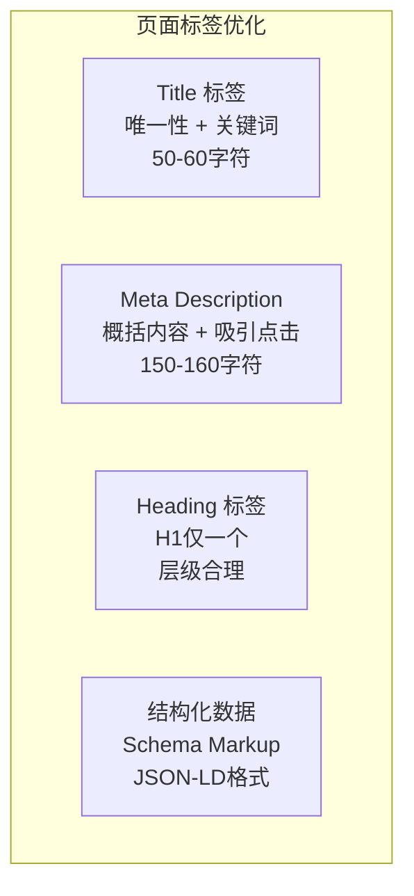

**标签优化要点：**

| 标签 | 优化要点 | 示例 |
|------|----------|------|
| **Title 标签** | 每个页面唯一、包含核心关键词、长度 50-60 字符 | `<title>SEO优化指南 - 搜索引擎优化详解</title>` |
| **Meta Description** | 简洁概括页面内容、吸引点击、长度 150-160 字符 | `<meta name="description" content="全面解析SEO搜索引擎优化原理与技巧...">` |
| **Heading 标签** | H1 仅一个、包含主关键词、H2-H6 层级合理 | `<h1>SEO搜索引擎优化详解</h1>` |
| **结构化数据** | 使用 JSON-LD 格式标注内容类型 | 文章、产品、面包屑导航等 |

**结构化数据示例：**

```html
<script type="application/ld+json">
{
  "@context": "https://schema.org",
  "@type": "Article",
  "headline": "SEO搜索引擎优化详解",
  "author": { "@type": "Person", "name": "作者名" },
  "datePublished": "2025-01-15"
}
</script>
```

### 4.2 网站结构与爬虫友好性

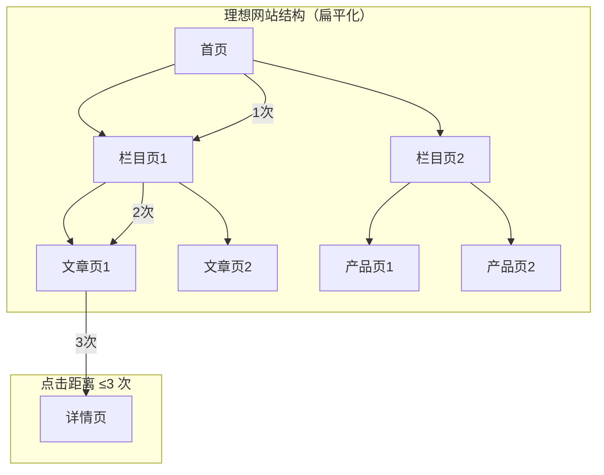

**URL 设计原则：**

| 原则 | 说明 | 好的示例 | 坏的示例 |
|------|------|----------|----------|
| **静态化** | 避免动态参数 | `/seo-guide/` | `/page?id=123` |
| **可读性** | 包含关键词 | `/best-seo-tools-2025` | `/p/abc123` |
| **简洁性** | 避免过长 URL | `/blog/seo-tips` | `/blog/2025/01/15/category/sub/seo` |

**爬虫控制配置：**

```txt
# robots.txt 示例
User-agent: *
Disallow: /admin/
Disallow: /private/
Allow: /public/
Sitemap: https://example.com/sitemap.xml
```

```xml
# sitemap.xml 示例
<?xml version="1.0" encoding="UTF-8"?>
<urlset xmlns="http://www.sitemaps.org/schemas/sitemap/0.9">
  <url>
    <loc>https://example.com/</loc>
    <lastmod>2025-01-15</lastmod>
    <changefreq>daily</changefreq>
    <priority>1.0</priority>
  </url>
</urlset>
```

### 4.3 页面性能优化

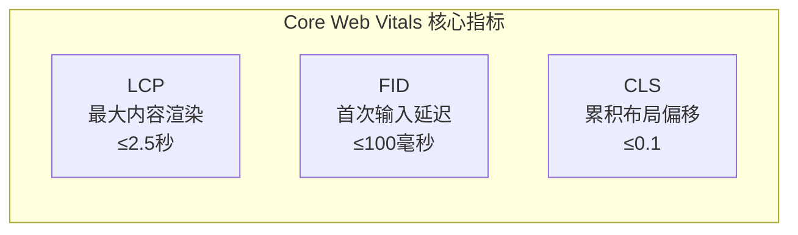

**性能优化措施：**

| 优化方向 | 具体措施 |
|----------|----------|
| **图片优化** | WebP 格式、懒加载、压缩至 200KB 以内 |
| **资源压缩** | CSS/JS minify、Gzip 压缩 |
| **减少重定向** | 避免链式重定向 |
| **CDN 加速** | 使用 CDN 分发静态资源 |
| **缓存策略** | 合理设置浏览器缓存 |

### 4.4 移动端优化

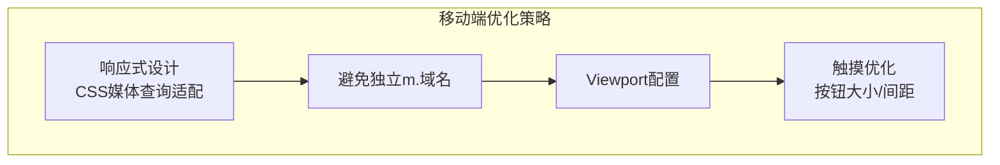

**移动端优化要点：**

| 要点 | 说明 |
|------|------|
| **响应式设计** | 使用 CSS 媒体查询适配不同屏幕尺寸，避免单独开发 m. 域名 |
| **Viewport 配置** | `<meta name="viewport" content="width=device-width, initial-scale=1">` |
| **触摸优化** | 按钮大小 ≥48px、间距合理、避免 hover 效果 |
| **AMP 加速** | 对新闻/博客类页面可启用 AMP（需权衡维护成本） |

---

## 五、内容 SEO 详解

### 5.1 关键词策略

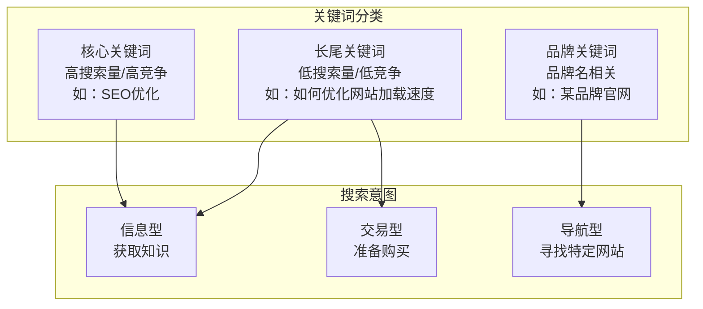

**关键词类型对比：**

| 类型 | 特点 | 示例 | 适用场景 |
|------|------|------|----------|
| **核心关键词** | 高搜索量、高竞争、转化泛 | "SEO优化" | 首页、栏目页 |
| **长尾关键词** | 低搜索量、低竞争、转化精准 | "如何优化网站加载速度" | 文章页、问答页 |
| **品牌关键词** | 品牌相关、竞争低 | "某品牌官网" | 首页 |

**关键词布局原则：**

| 位置 | 布局要点 |
|------|----------|
| **Title 标签** | 核心关键词置于标题前 15 字符 |
| **H1 标签** | 包含主关键词 |
| **首段** | 前 100 字包含核心关键词 |
| **正文** | 长尾关键词自然分布，遵循"3-5-7密度法则" |
| **内部链接** | 锚文本包含相关关键词 |

### 5.2 内容质量优化

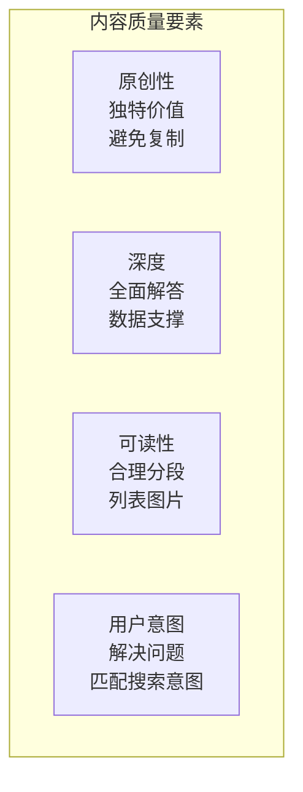

**内容优化要点：**

| 要点 | 说明 |
|------|------|
| **原创性** | 避免复制内容，提供独特价值 |
| **深度** | 全面、准确地回答用户查询，展现专业性 |
| **可读性** | 合理分段、使用列表和图片、段落不超过 3-4 行 |
| **用户意图匹配** | 内容需解决搜索者的核心问题（信息型、导航型、交易型） |
| **时效性** | 定期更新内容，保持信息新鲜度 |

### 5.3 内部链接优化

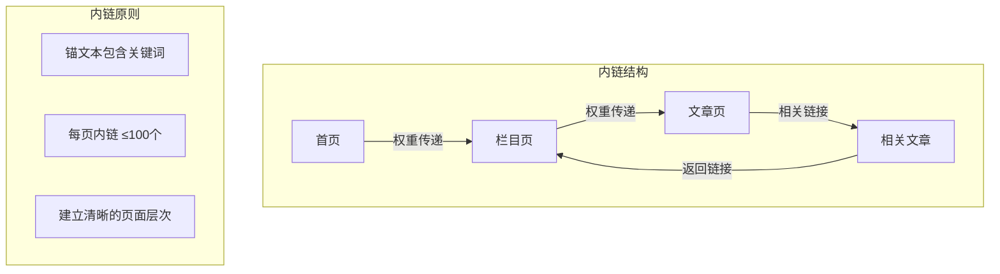

**内部链接优化要点：**

| 要点 | 说明 |
|------|------|
| **锚文本** | 使用描述性锚文本，包含关键词（如 `<a href="/seo-tools">SEO工具推荐</a>`） |
| **数量控制** | 每页内部链接建议 ≤100 个，避免过度链接 |
| **层级清晰** | 建立清晰的页面层次（首页 > 分类页 > 文章页） |
| **面包屑导航** | 添加面包屑导航（如"首页 > SEO指南 > 关键词研究"） |

---

## 六、外部 SEO 详解

### 6.1 外链建设策略

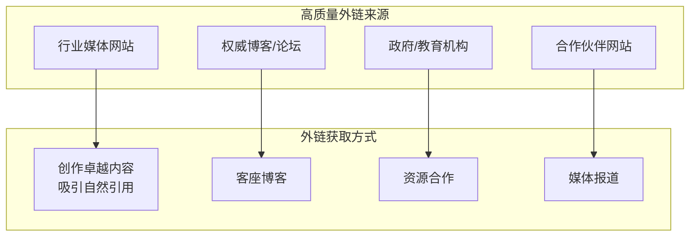

**外链质量评估：**

| 指标 | 高质量外链 | 低质量外链 |
|------|------------|------------|
| **来源网站权威性** | 高权重、行业相关 | 低权重、不相关 |
| **链接位置** | 正文内容中 | 页脚、侧边栏 |
| **锚文本** | 自然、相关 | 关键词堆砌 |
| **链接数量** | 自然增长 | 大量购买 |

**外链建设原则：**

- **质量优先、数量适度**：一条高质量外链价值远超多条低质量外链
- **避免垃圾链接**：来自垃圾网站、链接农场的链接可能对排名产生负面影响
- **自然增长**：通过优质内容吸引自然引用，而非购买链接

### 6.2 本地 SEO 优化

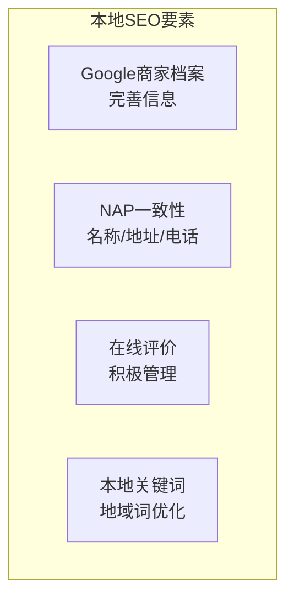

**本地 SEO 优化要点：**

| 要点 | 说明 |
|------|------|
| **Google 商家档案** | 完善商家信息（名称、地址、电话、营业时间、图片） |
| **NAP 一致性** | 确保名称、地址、电话信息在各平台一致 |
| **在线评价** | 积极管理在线评价，回复用户反馈 |
| **本地关键词** | 优化地域关键词（如"北京 SEO 服务"） |

---

## 七、白帽 SEO 与黑帽 SEO

### 7.1 白帽 SEO vs 黑帽 SEO

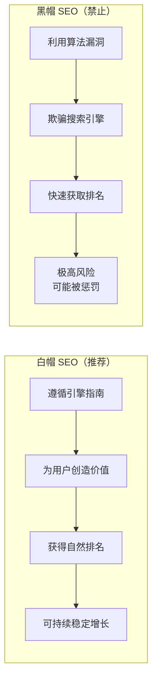

**对比分析：**

| 维度 | 白帽 SEO | 黑帽 SEO |
|------|----------|----------|
| **哲学** | 遵循引擎指南，为用户创造价值，获得自然排名 | 利用算法漏洞，欺骗搜索引擎，快速获取排名 |
| **技术手段** | 优化内容、技术架构、用户体验、获取自然外链 | 关键词堆砌、隐藏文字、购买链接、链接农场、AI 生成低质内容 |
| **短期效果** | 慢，需要积累 | 可能非常快 |
| **长期风险** | 可持续、稳定增长，抗算法更新能力强 | 极高风险，一旦被检测会导致排名骤降甚至网站被除名 |
| **商业伦理** | 诚信经营，品牌建设 | 短视行为，损害品牌 |

### 7.2 常见黑帽 SEO 手法（禁止使用）

| 手法 | 说明 | 风险 |
|------|------|------|
| **关键词堆砌** | 在页面中过度重复关键词 | 被算法检测后降权 |
| **隐藏文字** | 将关键词隐藏在页面中（如白色文字白色背景） | 严重违规，可能被除名 |
| **购买链接** | 大量购买低质量外链 | 违反 Google 政策，可能被手动处罚 |
| **链接农场** | 参与链接交换网络 | 被识别后整体降权 |
| **门页（Doorway Pages）** | 创建大量针对特定关键词的页面 | 被算法惩罚 |
| **伪装（Cloaking）** | 向爬虫和用户展示不同内容 | 严重违规，可能被除名 |
| **AI 生成低质内容** | 大量生成无价值内容 | 2025 年 Google 算法更新重点打击 |

---

## 八、Google E-E-A-T 原则

### 8.1 E-E-A-T 概念

Google 的 **E-E-A-T**（经验、专业性、权威性、可信度）理念是评判内容质量的核心标准：

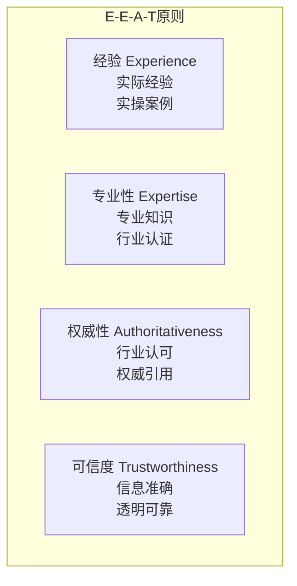

| 维度 | 说明 | 体现方式 |
|------|------|----------|
| **经验（Experience）** | 实际经验、实操案例 | 真实案例、实操截图、用户评价 |
| **专业性（Expertise）** | 专业知识、行业认证 | 作者资质、专业背景、认证信息 |
| **权威性（Authoritativeness）** | 行业认可、权威引用 | 外链来源、媒体报道、行业奖项 |
| **可信度（Trustworthiness）** | 信息准确、透明可靠 | 信息来源标注、联系方式、隐私政策 |

### 8.2 E-E-A-T 优化策略

| 策略 | 具体措施 |
|------|----------|
| **展示作者信息** | 添加作者简介、资质认证、专业背景 |
| **引用权威来源** | 内容中引用权威数据、研究报告 |
| **获取高质量外链** | 来自权威网站的外链提升权威性 |
| **提供真实案例** | 展示实操案例、用户评价、成功案例 |
| **保持信息透明** | 标注信息来源、提供联系方式、隐私政策 |

---

## 九、SEO 工具推荐

### 9.1 工具分类

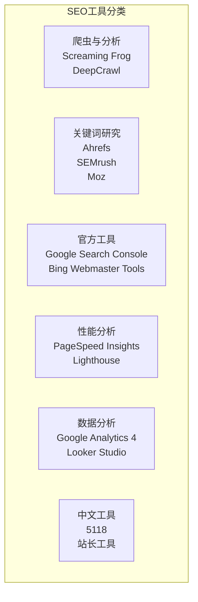

### 9.2 常用工具详解

| 工具类别 | 代表工具 | 核心用途 |
|----------|----------|----------|
| **爬虫与分析** | Screaming Frog、DeepCrawl | 技术审计，发现结构性问题（4xx/5xx 错误、重定向问题） |
| **关键词研究** | Ahrefs、SEMrush、Moz | 关键词研究、外链分析、竞争对标 |
| **官方工具** | Google Search Console、Bing Webmaster Tools | 索引状态、性能报告、手动操作通知 |
| **性能分析** | PageSpeed Insights、Lighthouse | 测量 Core Web Vitals，提供优化建议 |
| **数据分析** | Google Analytics 4、Looker Studio | 流量分析、用户行为追踪、制作报告 |
| **中文工具** | 5118、站长工具 | 中文关键词挖掘、百度排名查询 |

---

## 十、常见 SEO 错误

### 10.1 技术问题

| 问题 | 说明 | 解决方案 |
|------|------|----------|
| **未处理 404 错误** | 死链影响用户体验和爬虫抓取 | 设置 404 页面、使用 301 重定向 |
| **重复内容** | 多个 URL 返回相同内容 | 使用 Canonical 标签指定权威版本 |
| **JavaScript 渲染问题** | JS 渲染内容未预渲染，爬虫无法抓取 | 使用预渲染或 SSR |
| **Robots.txt 配置错误** | 误屏蔽重要页面 | 检查配置，确保重要页面可被抓取 |
| **加载速度慢** | 页面加载时间过长 | 优化图片、压缩资源、启用 CDN |

### 10.2 内容问题

| 问题 | 说明 | 解决方案 |
|------|------|----------|
| **关键词堆砌** | 过度重复关键词 | 自然分布关键词，使用语义相关词 |
| **内容过时** | 信息不再准确或有效 | 定期更新内容，保持时效性 |
| **内容复制** | 复制其他网站内容 | 创作原创内容，提供独特价值 |
| **内容质量低** | 内容浅薄、无价值 | 提供深度、全面的内容 |

### 10.3 外链问题

| 问题 | 说明 | 解决方案 |
|------|------|----------|
| **购买低质外链** | 大量购买垃圾链接 | 通过优质内容吸引自然外链 |
| **链接农场** | 参与链接交换网络 | 避免参与，建立自然外链 |
| **外链来源不相关** | 外链来自不相关网站 | 获取行业相关网站的外链 |

---

## 十一、SEO 优化流程

### 11.1 系统性 SEO 流程

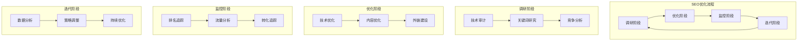

### 11.2 各阶段详解

| 阶段 | 主要工作 | 工具 |
|------|----------|------|
| **调研阶段** | 技术审计、关键词研究、竞争分析 | Screaming Frog、Ahrefs、SEMrush |
| **优化阶段** | 技术优化、内容优化、外链建设 | 根据问题选择相应工具 |
| **监控阶段** | 排名追踪、流量分析、转化追踪 | Google Search Console、Google Analytics |
| **迭代阶段** | 数据分析、策略调整、持续优化 | 根据数据选择优化方向 |

---

## 十二、总结

### 12.1 核心要点

1. **SEO 定义**：通过技术手段、内容策略与生态建设，提升网站在搜索引擎自然搜索结果中的排名
2. **搜索引擎原理**：爬取 → 索引 → 排名 三阶段运作
3. **三大支柱**：技术 SEO、内容 SEO、外部 SEO 协同优化
4. **E-E-A-T 原则**：经验、专业性、权威性、可信度是内容质量评判标准
5. **白帽优先**：遵循搜索引擎指南，为用户创造价值，获得可持续排名

### 12.2 SEO 优化核心原则

| 原则 | 说明 |
|------|------|
| **用户优先** | SEO 的最终目标是满足用户需求，而非欺骗搜索引擎 |
| **内容为王** | 高质量、原创、有价值的内容是 SEO 的核心 |
| **技术支撑** | 良好的技术架构是内容被搜索引擎发现和索引的基础 |
| **长期主义** | SEO 是长期策略，需要持续投入和优化 |
| **数据驱动** | 通过数据分析指导优化方向和策略调整 |

### 12.3 面试要点

1. 什么是 SEO？SEO 的核心目标是什么？
2. 搜索引擎的工作原理是什么？（爬取、索引、排名）
3. SEO 的三大核心支柱是什么？
4. 什么是 E-E-A-T 原则？如何优化？
5. 白帽 SEO 和黑帽 SEO 的区别是什么？
6. 如何进行关键词策略优化？
7. 什么是 Core Web Vitals？如何优化？
8. 如何进行外链建设？
9. 常见的 SEO 错误有哪些？
10. SEO 和 SEM 的区别是什么？