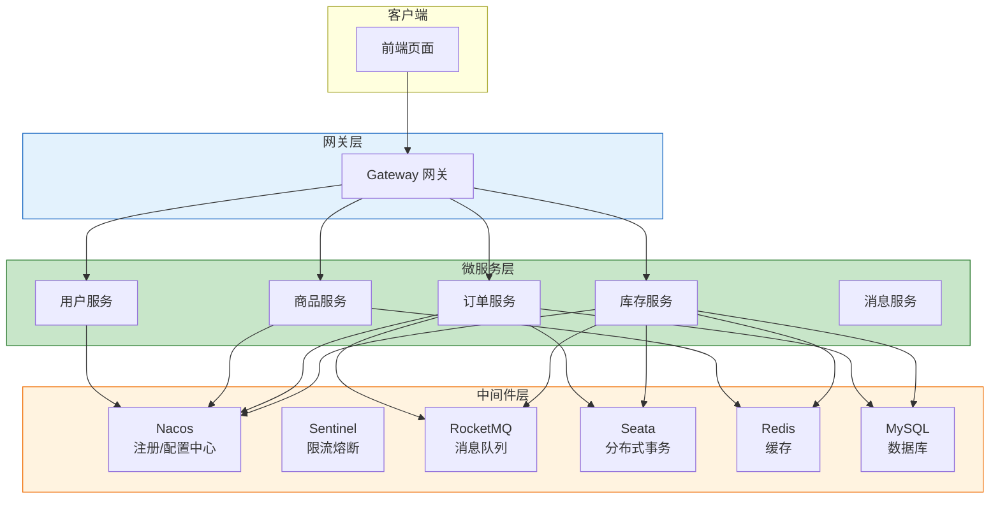
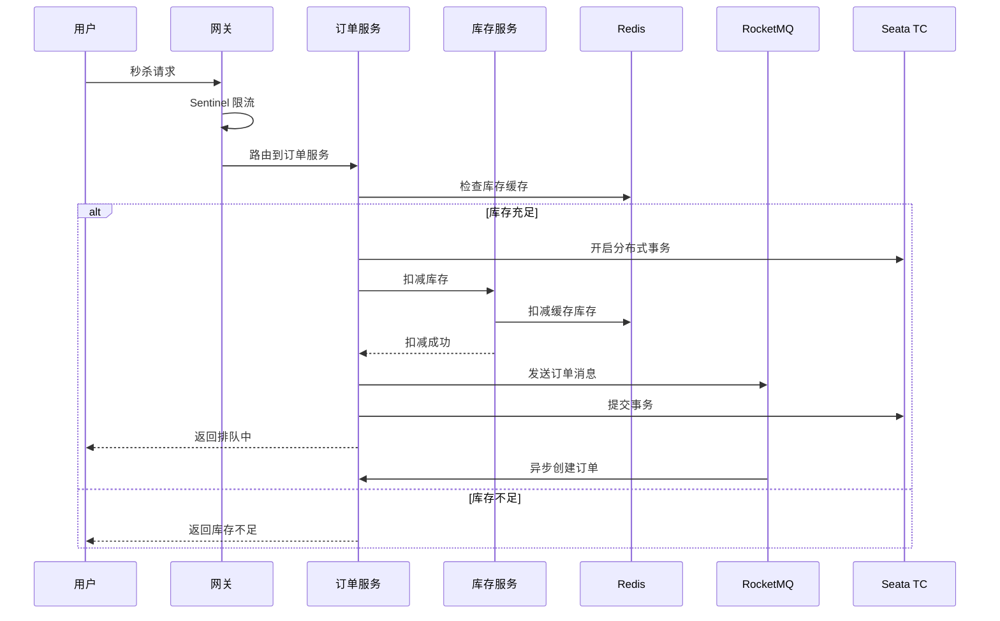

# Spring Cloud Alibaba 面试项目推荐方案

## 一、项目选型原则

选择面试项目时，应考虑以下因素：

| 因素 | 说明 |
|------|------|
| **业务复杂度** | 能体现微服务拆分的必要性 |
| **技术覆盖面** | 涵盖核心微服务组件 |
| **本地可运行** | 无需依赖外部云服务 |
| **面试亮点** | 有可深入讨论的技术难点 |
| **开发周期** | 1-2 个月可完成 |

---

## 二、推荐方案

### 方案一：电商秒杀系统（强烈推荐）

**项目名称**：高并发电商秒杀系统

**推荐理由**：
- 业务场景经典，面试高频话题
- 涵盖微服务核心技术点最多
- 高并发场景可深入讨论优化方案

**服务拆分**：

```
秒杀系统
├── gateway-service（网关服务）
├── user-service（用户服务）
├── product-service（商品服务）
├── order-service（订单服务）
├── stock-service（库存服务）
├── coupon-service（优惠券服务）
└── message-service（消息服务）
```

**技术架构**：



**核心功能**：

| 功能 | 技术点 |
|------|--------|
| 秒杀商品展示 | Redis 缓存热点数据 |
| 秒杀下单 | Sentinel 限流、分布式锁 |
| 库存扣减 | Seata 分布式事务 |
| 异步处理 | RocketMQ 削峰填谷 |
| 订单超时取消 | RocketMQ 延迟消息 |

**面试亮点**：

1. **高并发限流**：Sentinel QPS 限流 + Redis 分布式锁
2. **分布式事务**：Seata AT 模式保证库存与订单一致性
3. **缓存策略**：多级缓存、缓存预热、缓存穿透/雪崩处理
4. **消息队列**：异步解耦、削峰填谷、延迟消息
5. **服务治理**：Nacos 服务发现、配置热更新

**本地开发资源需求**：

| 组件 | 内存占用 |
|------|----------|
| Nacos | ~512MB |
| Sentinel Dashboard | ~256MB |
| RocketMQ NameServer + Broker | ~1GB |
| Seata Server | ~256MB |
| Redis | ~128MB |
| MySQL | ~512MB |
| 微服务（5-6个） | ~2GB |
| **总计** | **~5GB** |

---

### 方案二：在线教育平台

**项目名称**：在线课程学习平台

**推荐理由**：
- 业务逻辑清晰，易于理解
- 涉及多种业务场景
- 可扩展性好

**服务拆分**：

```
在线教育平台
├── gateway-service（网关服务）
├── user-service（用户服务）
├── course-service（课程服务）
├── order-service（订单服务）
├── learning-service（学习记录服务）
├── comment-service（评论服务）
└── live-service（直播服务）
```

**核心功能**：

| 功能 | 技术点 |
|------|--------|
| 课程列表 | Redis 缓存、分页查询 |
| 课程购买 | Seata 分布式事务 |
| 学习进度 | Redis 记录实时进度 |
| 课程评论 | RocketMQ 异步处理 |
| 视频播放 | 断点续播、进度同步 |

**面试亮点**：

1. **分布式事务**：订单与课程购买的一致性
2. **缓存设计**：课程热点数据缓存策略
3. **消息队列**：评论异步处理、通知推送
4. **文件存储**：视频文件本地存储方案

---

### 方案三：博客/论坛系统

**项目名称**：技术博客社区

**推荐理由**：
- 开发难度适中
- 业务场景常见
- 适合展示基础微服务能力

**服务拆分**：

```
博客社区
├── gateway-service（网关服务）
├── user-service（用户服务）
├── article-service（文章服务）
├── comment-service（评论服务）
├── like-service（点赞服务）
└── message-service（消息服务）
```

**核心功能**：

| 功能 | 技术点 |
|------|--------|
| 文章发布 | Nacos 配置管理 |
| 文章列表 | Redis 缓存、分页 |
| 点赞功能 | Redis 计数器 |
| 评论功能 | RocketMQ 异步通知 |
| 消息通知 | RocketMQ 消息推送 |

**面试亮点**：

1. **缓存策略**：文章热点数据缓存
2. **计数器设计**：Redis 实现点赞计数
3. **消息通知**：异步消息处理
4. **全文搜索**：可扩展 ES 搜索功能

---

## 三、方案对比

| 维度 | 秒杀系统 | 在线教育 | 博客社区 |
|------|----------|----------|----------|
| **开发难度** | ⭐⭐⭐⭐⭐ | ⭐⭐⭐⭐ | ⭐⭐⭐ |
| **技术覆盖** | ⭐⭐⭐⭐⭐ | ⭐⭐⭐⭐ | ⭐⭐⭐ |
| **面试价值** | ⭐⭐⭐⭐⭐ | ⭐⭐⭐⭐ | ⭐⭐⭐ |
| **资源需求** | ⭐⭐⭐⭐⭐ | ⭐⭐⭐⭐ | ⭐⭐⭐ |
| **扩展空间** | ⭐⭐⭐⭐⭐ | ⭐⭐⭐⭐ | ⭐⭐⭐⭐ |

---

## 四、秒杀系统详细设计（推荐方案）

### 4.1 技术选型

| 层次 | 技术 | 版本 |
|------|------|------|
| 基础框架 | Spring Boot | 2.7.x |
| 微服务框架 | Spring Cloud Alibaba | 2021.x |
| 注册/配置中心 | Nacos | 2.2.x |
| 网关 | Spring Cloud Gateway | 3.1.x |
| 限流熔断 | Sentinel | 1.8.x |
| 分布式事务 | Seata | 1.6.x |
| 消息队列 | RocketMQ | 5.x |
| 缓存 | Redis | 7.x |
| 数据库 | MySQL | 8.x |
| ORM | MyBatis-Plus | 3.5.x |

### 4.2 核心流程

**秒杀下单流程**：



### 4.3 项目结构

```
seckill-system/
├── seckill-common/                 # 公共模块
│   ├── common-core/               # 核心工具类
│   ├── common-redis/              # Redis 配置
│   └── common-mq/                 # MQ 配置
├── seckill-gateway/               # 网关服务
├── seckill-user/                  # 用户服务
├── seckill-product/               # 商品服务
├── seckill-order/                 # 订单服务
├── seckill-stock/                 # 库存服务
├── seckill-message/               # 消息服务
└── seckill-admin/                 # 管理后台
```

### 4.4 面试问题准备

| 问题 | 回答要点 |
|------|----------|
| 如何防止超卖？ | Redis 预扣库存 + Seata 分布式事务 + 数据库乐观锁 |
| 如何处理高并发？ | Sentinel 限流 + Redis 缓存 + MQ 削峰 |
| 如何保证消息不丢失？ | RocketMQ 同步发送 + 消息持久化 + 消费确认 |
| 如何保证分布式事务？ | Seata AT 模式 + 最终一致性 |
| 如何处理热点数据？ | Redis 多级缓存 + 本地缓存 + 缓存预热 |

---

## 五、开发建议

### 5.1 开发顺序

1. **第一阶段**：搭建基础框架
   - 创建父工程、公共模块
   - 搭建 Nacos、MySQL、Redis
   - 实现用户服务基础功能

2. **第二阶段**：核心业务开发
   - 商品服务：商品管理、库存管理
   - 订单服务：订单创建、订单查询
   - 库存服务：库存扣减、库存回滚

3. **第三阶段**：中间件集成
   - 集成 Sentinel 限流
   - 集成 RocketMQ 消息队列
   - 集成 Seata 分布式事务

4. **第四阶段**：优化与测试
   - 压力测试
   - 性能优化
   - 问题排查

### 5.2 注意事项

1. **资源控制**：本地开发注意内存分配，可适当减少服务数量
2. **版本兼容**：注意 Spring Cloud Alibaba 与 Spring Boot 版本对应
3. **渐进开发**：先实现核心功能，再逐步添加高级特性
4. **文档记录**：记录架构设计、技术选型理由，便于面试讲解

---

## 参考资料

- [Spring Cloud Alibaba 官方文档](https://github.com/alibaba/spring-cloud-alibaba)
- [Seata 官方文档](https://seata.io/zh-cn/)
- [Sentinel 官方文档](https://sentinelguard.io/zh-cn/)
- [RocketMQ 官方文档](https://rocketmq.apache.org/)
