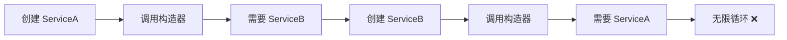
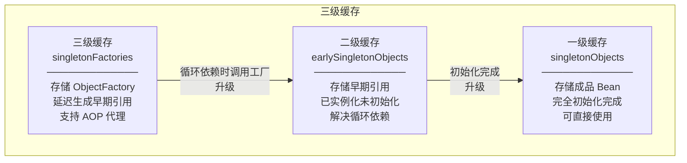
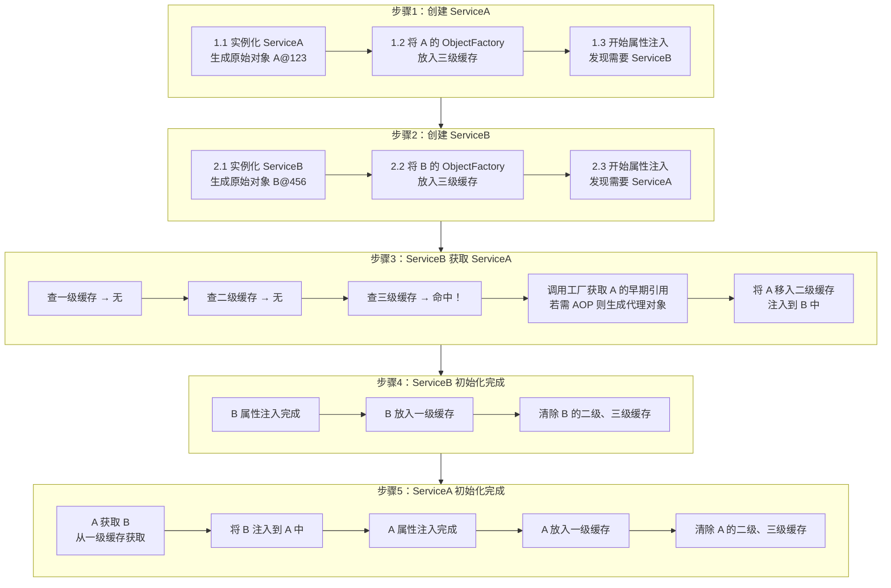
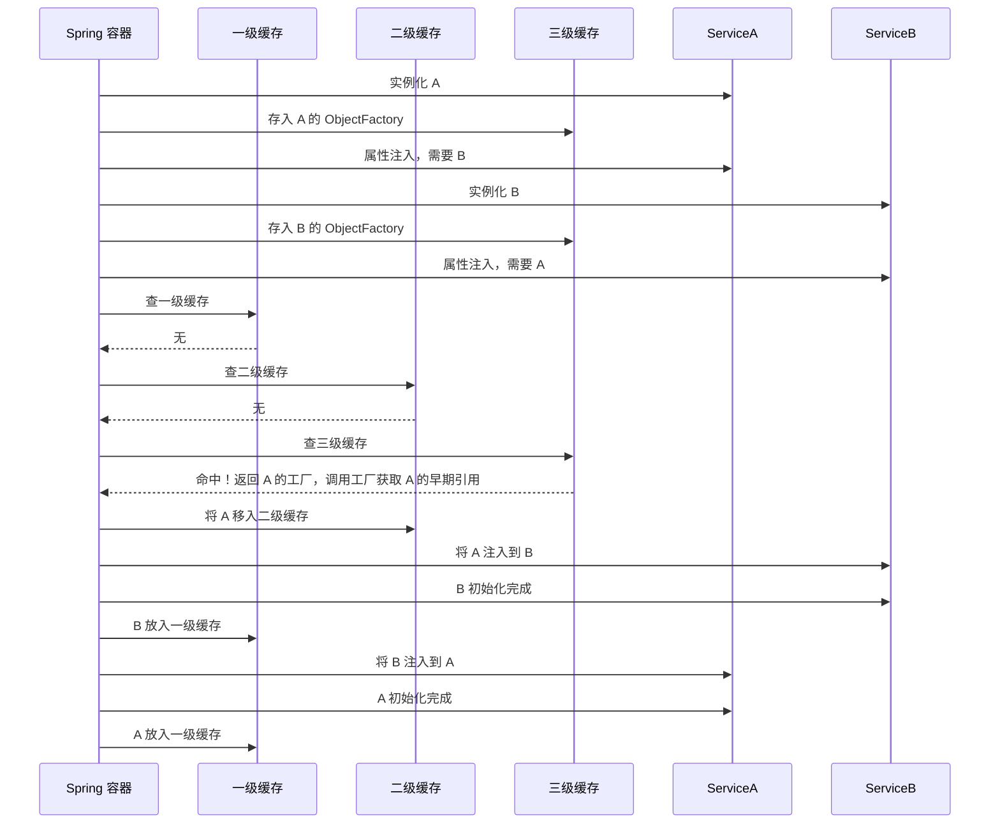
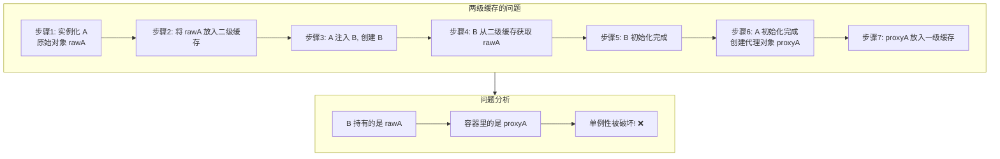
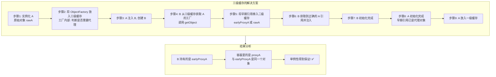

# Spring 循环依赖解决方案详解

## 一、概述

循环依赖是指两个或多个 Bean 相互依赖，形成闭环的情况。例如：Bean A 依赖 Bean B，而 Bean B 又依赖 Bean A。如果不处理，会导致实例化过程陷入无限循环。

Spring 通过**三级缓存机制**解决单例 Bean 的循环依赖问题，核心思想是"提前暴露 Bean 的早期引用"，让依赖在 Bean 完全初始化前即可被访问，从而打破循环。

---

## 二、循环依赖的类型

### 2.1 按依赖结构分类

| 类型 | 示例 | 说明 |
|------|------|------|
| 直接循环依赖 | A ←→ B | 两个 Bean 相互依赖 |
| 间接循环依赖 | A → B → C → A | 多个 Bean 形成闭环 |
| 自我依赖 | A → A | Bean 依赖自身（罕见） |

### 2.2 按注入方式分类

| 注入方式 | 是否支持 | 原因 |
|----------|----------|------|
| Setter 注入 / 字段注入 | ✅ 支持 | 依赖注入发生在实例化之后，可提前暴露对象引用 |
| 构造器注入 | ❌ 不支持 | 实例化时就需要依赖对象，无法提前暴露 |

**构造器注入无法解决循环依赖的原因：**

```java
@Service
public class ServiceA {
    private final ServiceB serviceB;
    
    public ServiceA(ServiceB serviceB) {  // 构造时就需要 B
        this.serviceB = serviceB;
    }
}

@Service
public class ServiceB {
    private final ServiceA serviceA;
    
    public ServiceB(ServiceA serviceA) {  // 构造时就需要 A
        this.serviceA = serviceA;
    }
}
```

创建流程：



---

## 三、三级缓存机制

### 3.1 三级缓存定义

Spring 在 `DefaultSingletonBeanRegistry` 中定义了三级缓存：

```java
public class DefaultSingletonBeanRegistry {
    
    private final Map<String, Object> singletonObjects = new ConcurrentHashMap<>(256);
    
    private final Map<String, Object> earlySingletonObjects = new HashMap<>(16);
    
    private final Map<String, ObjectFactory<?>> singletonFactories = new HashMap<>(16);
    
    private final Set<String> singletonsCurrentlyInCreation = 
        Collections.newSetFromMap(new ConcurrentHashMap<>(16));
}
```

### 3.2 三级缓存职责

| 缓存级别 | 变量名 | 存储内容 | 作用 |
|----------|--------|----------|------|
| 一级缓存 | singletonObjects | 完全初始化好的单例 Bean | 存放最终可用的 Bean（成品） |
| 二级缓存 | earlySingletonObjects | 早期引用（未完成属性注入的单例 Bean） | 存放半成品 Bean |
| 三级缓存 | singletonFactories | ObjectFactory（工厂对象） | 延迟生成早期引用，支持 AOP 代理 |

### 3.3 三级缓存架构图



---

## 四、循环依赖解决流程

### 4.1 场景示例

假设存在两个 Bean 互相依赖：

```java
@Service
public class ServiceA {
    @Autowired
    private ServiceB serviceB;
}

@Service
public class ServiceB {
    @Autowired
    private ServiceA serviceA;
}
```

### 4.2 完整解决流程



### 4.3 时序图



---

## 五、为什么需要三级缓存？

### 5.1 核心问题：AOP 代理与循环依赖的冲突

Spring 面临一个核心矛盾：

**原则 A（标准生命周期）：**
- AOP 代理对象应该在 Bean 初始化完成后生成
- 即 `postProcessAfterInitialization()` 阶段

**现实 B（循环依赖困境）：**
- 当 A 依赖 B，B 又依赖 A 时，B 在属性注入时必须拿到 A 的引用
- 如果 A 需要被 AOP 代理，B 必须拿到 A 的代理对象，而非原始对象

**矛盾：**
- 按原则，A 的代理要在最后创建
- 按现实，B 现在就要用 A 的代理
- 如果给 B 原始对象 A，等 A 流程结束变成代理对象后，B 持有的 A 和容器里的 A 就不是同一个对象了（单例性被破坏）

### 5.2 假设只有两级缓存

**场景：A 需要 AOP 代理，且 A 与 B 循环依赖**



### 5.3 三级缓存的解决方案



### 5.4 ObjectFactory 的核心作用

```java
protected Object getEarlyBeanReference(String beanName, RootBeanDefinition mbd, Object bean) {
    Object exposedObject = bean;
    if (bean != null && !mbd.isSynthetic() && hasInstantiationAwareBeanPostProcessors()) {
        for (BeanPostProcessor bp : getBeanPostProcessors()) {
            if (bp instanceof SmartInstantiationAwareBeanPostProcessor) {
                SmartInstantiationAwareBeanPostProcessor ibp = (SmartInstantiationAwareBeanPostProcessor) bp;
                exposedObject = ibp.getEarlyBeanReference(exposedObject, beanName);
            }
        }
    }
    return exposedObject;
}
```

**关键点：**
- `ObjectFactory` 是一个延迟执行的工厂
- 只有在发生循环依赖时才会调用
- 调用时判断是否需要生成 AOP 代理
- 保证最终注入的对象和容器中的对象是同一个

---

## 六、不支持的场景

### 6.1 构造器注入的循环依赖

```java
@Service
public class ServiceA {
    private final ServiceB serviceB;
    
    public ServiceA(ServiceB serviceB) {
        this.serviceB = serviceB;
    }
}

@Service
public class ServiceB {
    private final ServiceA serviceA;
    
    public ServiceB(ServiceA serviceA) {
        this.serviceA = serviceA;
    }
}
```

**异常信息：**
```
BeanCurrentlyInCreationException: Error creating bean with name 'serviceA': 
Requested bean is currently in creation: Is there an unresolvable circular reference?
```

**原因：** 构造器注入要求在实例化时就获取依赖对象，此时 Bean 还未创建，无法提前暴露引用。

### 6.2 原型作用域的循环依赖

```java
@Scope("prototype")
@Service
public class ServiceA {
    @Autowired
    private ServiceB serviceB;
}

@Scope("prototype")
@Service
public class ServiceB {
    @Autowired
    private ServiceA serviceA;
}
```

**原因：** 原型 Bean 每次请求都创建新实例，不使用缓存机制，无法解决循环依赖。

### 6.3 @Async 特殊情况

`@Async` 注解的 Bean 在循环依赖时需要特殊处理：

```java
@Service
public class ServiceA {
    @Autowired
    private ServiceB serviceB;
    
    @Async
    public void asyncMethod() {}
}
```

**原因：** `@Async` 会创建 AOP 代理，三级缓存可以处理，但需要确保代理正确生成。

---

## 七、解决方案

### 7.1 方案对比

| 方案 | 适用场景 | 优点 | 缺点 |
|------|----------|------|------|
| 重构代码 | 所有场景 | 从根本上解决问题 | 可能需要较大改动 |
| @Lazy 注入 | 构造器注入循环依赖 | 改动小 | 增加理解成本 |
| Setter 注入替代构造器注入 | 构造器注入循环依赖 | 改动小 | 需要修改注入方式 |
| ObjectProvider | 动态获取依赖 | 灵活 | 增加代码复杂度 |

### 7.2 方案一：使用 @Lazy

```java
@Service
public class ServiceA {
    private final ServiceB serviceB;
    
    public ServiceA(@Lazy ServiceB serviceB) {
        this.serviceB = serviceB;
    }
}
```

**原理：** `@Lazy` 会创建一个代理对象注入，只有在实际调用时才会真正获取 Bean。

### 7.3 方案二：改用 Setter 注入

```java
@Service
public class ServiceA {
    private ServiceB serviceB;
    
    @Autowired
    public void setServiceB(ServiceB serviceB) {
        this.serviceB = serviceB;
    }
}
```

### 7.4 方案三：使用 ObjectProvider

```java
@Service
public class ServiceA {
    @Autowired
    private ObjectProvider<ServiceB> serviceBProvider;
    
    public void doSomething() {
        ServiceB serviceB = serviceBProvider.getObject();
    }
}
```

### 7.5 方案四：重构代码（推荐）

提取公共逻辑到第三个 Bean，打破循环依赖：

```java
@Service
public class CommonService {
    // 公共逻辑
}

@Service
public class ServiceA {
    @Autowired
    private CommonService commonService;
}

@Service
public class ServiceB {
    @Autowired
    private CommonService commonService;
}
```

---

## 八、Spring Boot 配置

### 8.1 版本差异

从 Spring Boot 2.6 开始，默认禁止循环依赖：

```properties
spring.main.allow-circular-references=false
```

### 8.2 启用循环依赖支持

如需支持循环依赖，需显式配置：

```properties
spring.main.allow-circular-references=true
```

---

## 九、常见问题排查

### 9.1 异常信息

```
BeanCurrentlyInCreationException: Error creating bean with name 'xxx': 
Requested bean is currently in creation: Is there an unresolvable circular reference?
```

### 9.2 排查步骤

1. **检查 Bean 作用域**：确保是单例（Singleton）
2. **检查注入方式**：是否使用了构造器注入
3. **检查依赖链**：梳理 Bean 之间的依赖关系
4. **使用 @Lazy**：在循环依赖的注入点添加 @Lazy
5. **重构代码**：提取公共逻辑，打破循环

---

## 十、总结

### 10.1 核心要点

1. **三级缓存机制**：
   - 一级缓存：存储完全初始化的 Bean
   - 二级缓存：存储早期暴露的 Bean
   - 三级缓存：存储 ObjectFactory，支持 AOP 代理

2. **支持场景**：
   - 单例 Bean
   - Setter 注入 / 字段注入

3. **不支持场景**：
   - 构造器注入的循环依赖
   - 原型作用域的循环依赖

4. **三级缓存的意义**：
   - 延迟生成代理对象
   - 保证循环依赖 + AOP 的正确性
   - 维护单例性

### 10.2 最佳实践

1. **优先避免循环依赖**：良好的代码设计不应存在循环依赖
2. **使用 @Lazy 临时解决**：快速解决构造器注入的循环依赖
3. **重构代码**：提取公共逻辑，打破依赖闭环
4. **选择合适的注入方式**：构造器注入保证不可变性，Setter 注入支持循环依赖

### 10.3 面试要点

1. Spring 如何解决循环依赖？三级缓存机制
2. 为什么需要三级缓存而不是两级？支持 AOP 代理
3. 构造器注入为什么不能解决循环依赖？无法提前暴露引用
4. ObjectFactory 的作用是什么？延迟生成早期引用，动态决定是否生成代理
